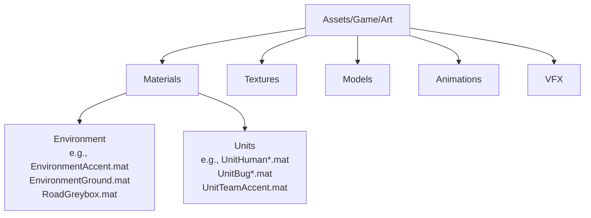
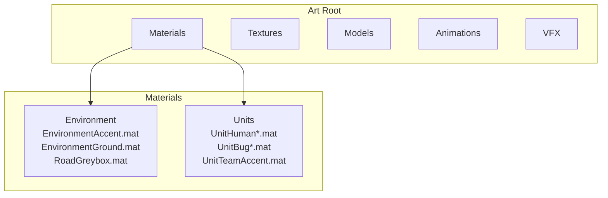
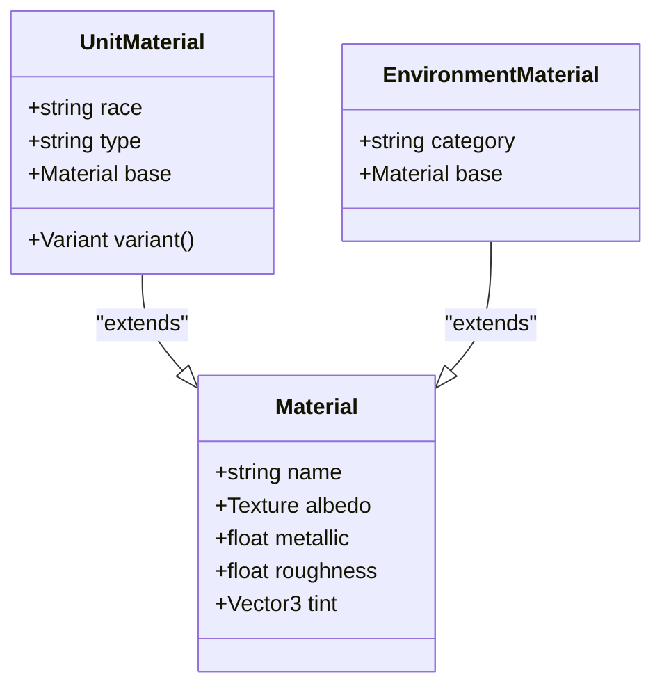
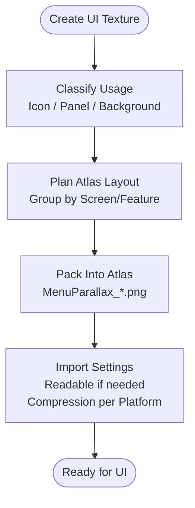
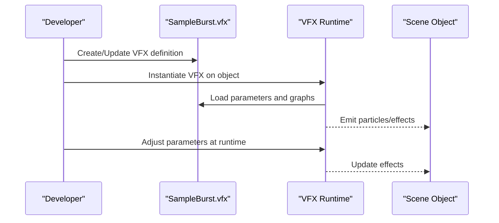
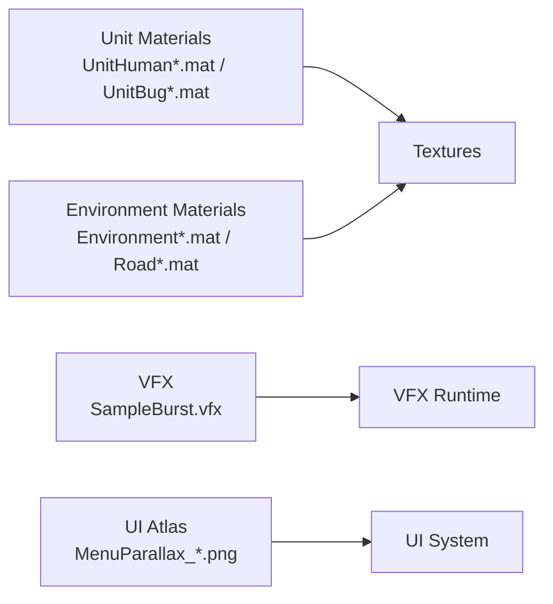

# Art Asset Organization

<cite>
**Referenced Files in This Document**
- [EnvironmentAccent.mat](file://Assets/Game/Art/Materials/EnvironmentAccent.mat)
- [EnvironmentGround.mat](file://Assets/Game/Art/Materials/EnvironmentGround.mat)
- [RoadGreybox.mat](file://Assets/Game/Art/Materials/RoadGreybox.mat)
- [UnitBugChitin.mat](file://Assets/Game/Art/Materials/Units/UnitBugChitin.mat)
- [UnitBugChitinDark.mat](file://Assets/Game/Art/Materials/Units/UnitBugChitinDark.mat)
- [UnitBugGlow.mat](file://Assets/Game/Art/Materials/Units/UnitBugGlow.mat)
- [UnitHumanArcane.mat](file://Assets/Game/Art/Materials/Units/UnitHumanArcane.mat)
- [UnitHumanCloth.mat](file://Assets/Game/Art/Materials/Units/UnitHumanCloth.mat)
- [UnitHumanSkin.mat](file://Assets/Game/Art/Materials/Units/UnitHumanSkin.mat)
- [UnitHumanSteel.mat](file://Assets/Game/Art/Materials/Units/UnitHumanSteel.mat)
- [UnitHumanWood.mat](file://Assets/Game/Art/Materials/Units/UnitHumanWood.mat)
- [UnitTeamAccent.mat](file://Assets/Game/Art/Materials/Units/UnitTeamAccent.mat)
</cite>

## Table of Contents
1. [Introduction](#introduction)
2. [Project Structure](#project-structure)
3. [Core Components](#core-components)
4. [Architecture Overview](#architecture-overview)
5. [Detailed Component Analysis](#detailed-component-analysis)
6. [Dependency Analysis](#dependency-analysis)
7. [Performance Considerations](#performance-considerations)
8. [Troubleshooting Guide](#troubleshooting-guide)
9. [Conclusion](#conclusion)

## Introduction
This document defines BARAKI’s art asset organization system for the game content under Assets/Game/Art/. It explains how to structure and name materials, textures, models, animations, and VFX files; provides guidelines for organizing unit materials by race and type; documents texture atlasing for UI elements; and outlines best practices for version control, import settings optimization, and platform-specific texture compression. It also covers material palette organization for team accents and environmental assets.

## Project Structure
The art pipeline is organized under a single root folder with clear subfolders for each asset category:

- Materials: PBR materials for environment, roads, and units
- Textures: Source textures and atlases (including UI)
- Models: 3D meshes for units, props, and environments
- Animations: Animation clips and related data
- VFX: Visual effect definitions and related resources

**Diagram sources**
- [EnvironmentAccent.mat](file://Assets/Game/Art/Materials/EnvironmentAccent.mat)
- [EnvironmentGround.mat](file://Assets/Game/Art/Materials/EnvironmentGround.mat)
- [RoadGreybox.mat](file://Assets/Game/Art/Materials/RoadGreybox.mat)
- [UnitHumanSteel.mat](file://Assets/Game/Art/Materials/Units/UnitHumanSteel.mat)
- [UnitBugChitin.mat](file://Assets/Game/Art/Materials/Units/UnitBugChitin.mat)
- [UnitTeamAccent.mat](file://Assets/Game/Art/Materials/Units/UnitTeamAccent.mat)

**Section sources**
- [EnvironmentAccent.mat](file://Assets/Game/Art/Materials/EnvironmentAccent.mat)
- [EnvironmentGround.mat](file://Assets/Game/Art/Materials/EnvironmentGround.mat)
- [RoadGreybox.mat](file://Assets/Game/Art/Materials/RoadGreybox.mat)
- [UnitHumanSteel.mat](file://Assets/Game/Art/Materials/Units/UnitHumanSteel.mat)
- [UnitBugChitin.mat](file://Assets/Game/Art/Materials/Units/UnitBugChitin.mat)
- [UnitTeamAccent.mat](file://Assets/Game/Art/Materials/Units/UnitTeamAccent.mat)

## Core Components
- Materials
  - Environment materials are placed directly under Materials and describe general surfaces such as ground, accent panels, and greybox roads.
  - Unit materials live under Materials/Units and follow a consistent naming scheme that encodes race and material type.
- Textures
  - Keep source textures under Textures. For UI, prefer atlases to reduce draw calls and simplify batching.
- Models
  - Store 3D assets under Models, grouped by subject (units, props, environment).
- Animations
  - Place animation clips under Animations, ideally organized per character or system.
- VFX
  - Store VFX definitions under VFX, using descriptive names tied to their purpose.

Naming conventions observed in the project:
- Materials
  - Units: Unit{Race}{Type}.mat
    - Examples: UnitHumanSteel.mat, UnitHumanCloth.mat, UnitHumanSkin.mat, UnitHumanArcane.mat, UnitHumanWood.mat
    - Bug variants: UnitBugChitin.mat, UnitBugChitinDark.mat, UnitBugGlow.mat
  - Team accents: UnitTeamAccent.mat
  - Environment: {Category}{Surface}.mat
    - Examples: EnvironmentAccent.mat, EnvironmentGround.mat, RoadGreybox.mat
- Textures
  - UI parallax example pattern: MenuParallax_*.png
- VFX
  - Example pattern: SampleBurst.vfx

Best-practice summary:
- Use PascalCase for all asset names.
- Include race/type in unit material names to avoid ambiguity.
- Prefix UI-related textures with context (e.g., MenuParallax_*) to group them logically.
- Keep VFX filenames concise but descriptive of the effect.

**Section sources**
- [UnitHumanSteel.mat](file://Assets/Game/Art/Materials/Units/UnitHumanSteel.mat)
- [UnitHumanCloth.mat](file://Assets/Game/Art/Materials/Units/UnitHumanCloth.mat)
- [UnitHumanSkin.mat](file://Assets/Game/Art/Materials/Units/UnitHumanSkin.mat)
- [UnitHumanArcane.mat](file://Assets/Game/Art/Materials/Units/UnitHumanArcane.mat)
- [UnitHumanWood.mat](file://Assets/Game/Art/Materials/Units/UnitHumanWood.mat)
- [UnitBugChitin.mat](file://Assets/Game/Art/Materials/Units/UnitBugChitin.mat)
- [UnitBugChitinDark.mat](file://Assets/Game/Art/Materials/Units/UnitBugChitinDark.mat)
- [UnitBugGlow.mat](file://Assets/Game/Art/Materials/Units/UnitBugGlow.mat)
- [UnitTeamAccent.mat](file://Assets/Game/Art/Materials/Units/UnitTeamAccent.mat)
- [EnvironmentAccent.mat](file://Assets/Game/Art/Materials/EnvironmentAccent.mat)
- [EnvironmentGround.mat](file://Assets/Game/Art/Materials/EnvironmentGround.mat)
- [RoadGreybox.mat](file://Assets/Game/Art/Materials/RoadGreybox.mat)

## Architecture Overview
The art asset architecture separates concerns by asset type and uses consistent naming to encode metadata (race, type, usage). This enables predictable discovery, easy refactoring, and streamlined tooling.

**Diagram sources**
- [EnvironmentAccent.mat](file://Assets/Game/Art/Materials/EnvironmentAccent.mat)
- [EnvironmentGround.mat](file://Assets/Game/Art/Materials/EnvironmentGround.mat)
- [RoadGreybox.mat](file://Assets/Game/Art/Materials/RoadGreybox.mat)
- [UnitHumanSteel.mat](file://Assets/Game/Art/Materials/Units/UnitHumanSteel.mat)
- [UnitBugChitin.mat](file://Assets/Game/Art/Materials/Units/UnitBugChitin.mat)
- [UnitTeamAccent.mat](file://Assets/Game/Art/Materials/Units/UnitTeamAccent.mat)

## Detailed Component Analysis

### Materials
- Folder layout
  - Materials/: top-level environment materials
  - Materials/Units/: unit materials grouped by race and surface type
- Naming patterns
  - Unit materials: Unit{Race}{Type}.mat
    - Human examples: UnitHumanSteel.mat, UnitHumanCloth.mat, UnitHumanSkin.mat, UnitHumanArcane.mat, UnitHumanWood.mat
    - Bug examples: UnitBugChitin.mat, UnitBugChitinDark.mat, UnitBugGlow.mat
  - Team accent: UnitTeamAccent.mat
  - Environment: EnvironmentAccent.mat, EnvironmentGround.mat, RoadGreybox.mat
- Organizational guidelines
  - Group unit materials by race under Materials/Units.
  - Use distinct suffixes for variant materials (e.g., Dark, Glow) to keep variants discoverable.
  - Maintain a small set of reusable environment materials to ensure visual consistency across scenes.
- Palette management
  - Centralize team accent colors in UnitTeamAccent.mat and reference it from UI and HUD materials where appropriate.
  - Keep environment palettes cohesive via EnvironmentAccent.mat and EnvironmentGround.mat.

[No diagram sources since this diagram is conceptual]

**Section sources**
- [UnitHumanSteel.mat](file://Assets/Game/Art/Materials/Units/UnitHumanSteel.mat)
- [UnitHumanCloth.mat](file://Assets/Game/Art/Materials/Units/UnitHumanCloth.mat)
- [UnitHumanSkin.mat](file://Assets/Game/Art/Materials/Units/UnitHumanSkin.mat)
- [UnitHumanArcane.mat](file://Assets/Game/Art/Materials/Units/UnitHumanArcane.mat)
- [UnitHumanWood.mat](file://Assets/Game/Art/Materials/Units/UnitHumanWood.mat)
- [UnitBugChitin.mat](file://Assets/Game/Art/Materials/Units/UnitBugChitin.mat)
- [UnitBugChitinDark.mat](file://Assets/Game/Art/Materials/Units/UnitBugChitinDark.mat)
- [UnitBugGlow.mat](file://Assets/Game/Art/Materials/Units/UnitBugGlow.mat)
- [UnitTeamAccent.mat](file://Assets/Game/Art/Materials/Units/UnitTeamAccent.mat)
- [EnvironmentAccent.mat](file://Assets/Game/Art/Materials/EnvironmentAccent.mat)
- [EnvironmentGround.mat](file://Assets/Game/Art/Materials/EnvironmentGround.mat)
- [RoadGreybox.mat](file://Assets/Game/Art/Materials/RoadGreybox.mat)

### Textures
- Guidelines
  - Keep source textures under Textures.
  - For UI elements, prefer atlases to minimize draw calls and improve batching.
  - Use descriptive prefixes for context (e.g., MenuParallax_* for menu parallax layers).
- Atlasing strategy
  - Group related UI icons and panels into shared atlases.
  - Avoid mixing high-frequency UI sprites with large background images in the same atlas.
  - Provide separate atlases per screen or feature area to reduce memory pressure.

[No diagram sources since this diagram shows conceptual workflow]

**Section sources**
- [MenuParallax_Background.png](file://Assets/Game/Art/Textures/MenuParallax_Background.png)
- [MenuParallax_Midground.png](file://Assets/Game/Art/Textures/MenuParallax_Midground.png)
- [MenuParallax_Foreground.png](file://Assets/Game/Art/Textures/MenuParallax_Foreground.png)

### Models
- Guidelines
  - Store meshes under Models, grouped by subject (e.g., Units, Props, Environment).
  - Keep LODs and rigging data co-located with the primary mesh when applicable.
  - Use consistent scale and pivot conventions across all models.

[No section sources required unless specific files are analyzed]

### Animations
- Guidelines
  - Place animation clips under Animations, ideally organized per character or system.
  - Name animations descriptively (e.g., Idle, Attack, Death) and keep clip durations reasonable.
  - Reference animations from animator controllers rather than hardcoding clip paths.

[No section sources required unless specific files are analyzed]

### VFX
- Guidelines
  - Store VFX definitions under VFX with descriptive names (e.g., SampleBurst.vfx).
  - Keep VFX parameters centralized where possible to allow global tuning.
  - Separate heavy VFX from lightweight ones to optimize runtime performance.

**Diagram sources**
- [SampleBurst.vfx](file://Assets/Game/Art/VFX/SampleBurst.vfx)

**Section sources**
- [SampleBurst.vfx](file://Assets/Game/Art/VFX/SampleBurst.vfx)

## Dependency Analysis
- Cohesion
  - Materials/Units exhibits high cohesion around race/type semantics, making it easy to find and update variants.
  - Environment materials are intentionally minimal to maintain consistency across scenes.
- Coupling
  - Unit materials depend on textures and shader graphs; changes should be coordinated with texture updates.
  - UI atlases decouple individual sprites from rendering, reducing coupling between UI screens and asset changes.
- External dependencies
  - VFX files rely on Unity’s VFX runtime; ensure compatibility with target platforms.
  - Texture compression depends on platform-specific formats (ASTC, BC, etc.).

**Diagram sources**
- [UnitHumanSteel.mat](file://Assets/Game/Art/Materials/Units/UnitHumanSteel.mat)
- [UnitBugChitin.mat](file://Assets/Game/Art/Materials/Units/UnitBugChitin.mat)
- [EnvironmentAccent.mat](file://Assets/Game/Art/Materials/EnvironmentAccent.mat)
- [EnvironmentGround.mat](file://Assets/Game/Art/Materials/EnvironmentGround.mat)
- [RoadGreybox.mat](file://Assets/Game/Art/Materials/RoadGreybox.mat)
- [SampleBurst.vfx](file://Assets/Game/Art/VFX/SampleBurst.vfx)
- [MenuParallax_Background.png](file://Assets/Game/Art/Textures/MenuParallax_Background.png)
- [MenuParallax_Midground.png](file://Assets/Game/Art/Textures/MenuParallax_Midground.png)
- [MenuParallax_Foreground.png](file://Assets/Game/Art/Textures/MenuParallax_Foreground.png)

## Performance Considerations
- Texture compression
  - Use ASTC for mobile platforms, BC/DXT for PC, and ETC2 for older Android devices.
  - Prefer compressed formats for final builds; keep uncompressed originals in source control.
- Atlasing
  - Consolidate UI sprites into atlases to reduce draw calls and improve batching.
  - Split large atlases by screen or feature to limit memory footprint.
- Materials
  - Reuse environment materials across scenes to reduce memory duplication.
  - Limit the number of unique unit materials per frame to improve GPU efficiency.
- VFX
  - Keep particle counts and graph complexity within target platform budgets.
  - Use instancing and pooling where supported.

[No section sources required since this section provides general guidance]

## Troubleshooting Guide
- Missing textures on materials
  - Verify that referenced textures exist under Textures and that import settings match the intended use (e.g., sRGB for color maps).
- Incorrect compression artifacts
  - Check platform-specific compression settings; switch to higher-quality formats if necessary.
- VFX not visible
  - Ensure the VFX file exists under VFX and that the runtime can locate it; verify layer and visibility settings on scene objects.
- UI atlas issues
  - Confirm atlas packing order and UV bounds; re-pack if new sprites were added.

[No section sources required since this section provides general guidance]

## Conclusion
BARAKI’s art organization centers on clear folder separation and consistent naming to encode race, type, and usage. By following these conventions—especially for unit materials, UI texture atlasing, and VFX file management—the team can maintain a scalable, performant, and collaborative art pipeline. Adhering to platform-specific compression and version control best practices ensures smooth iteration and reliable builds across targets.