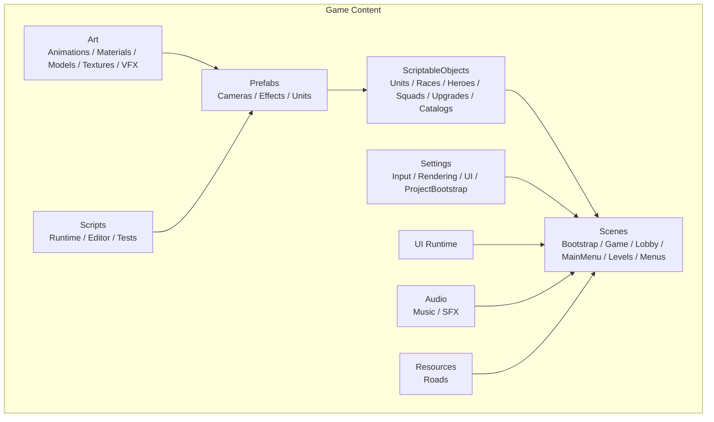
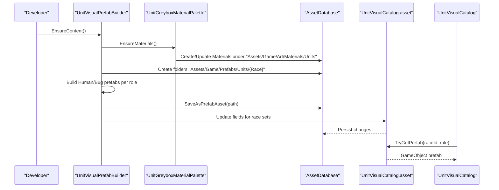
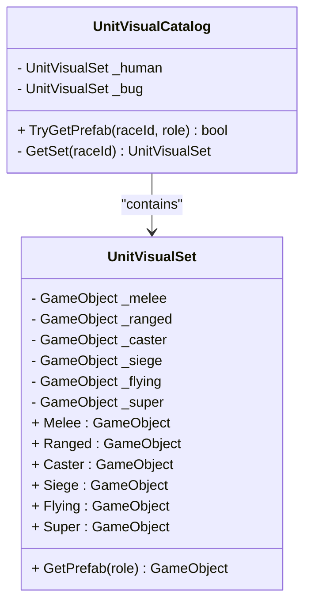
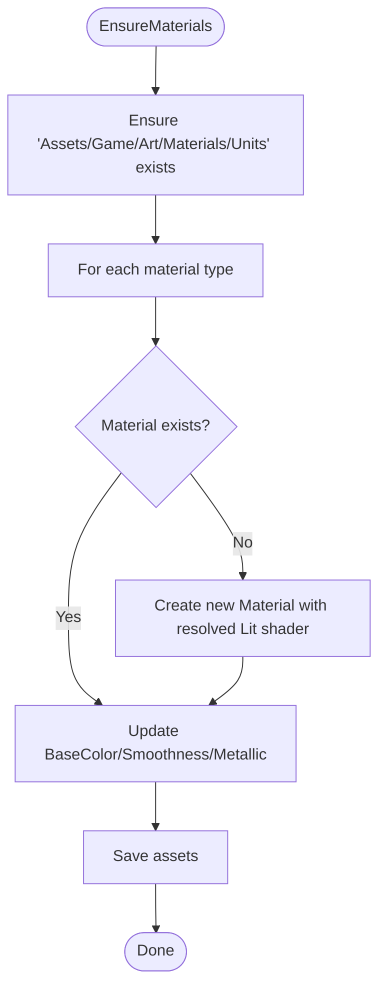
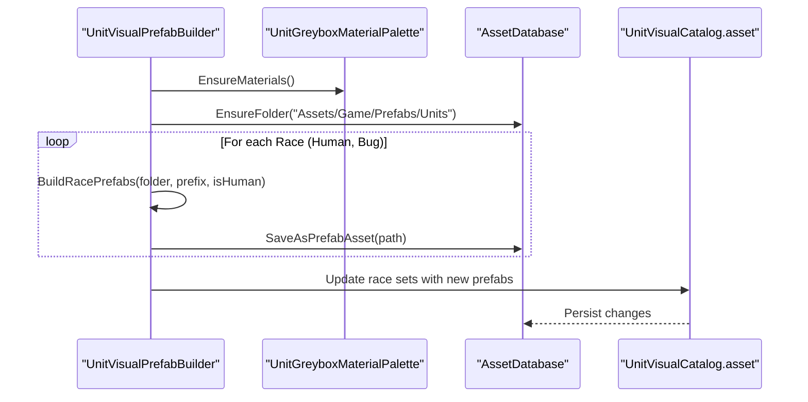
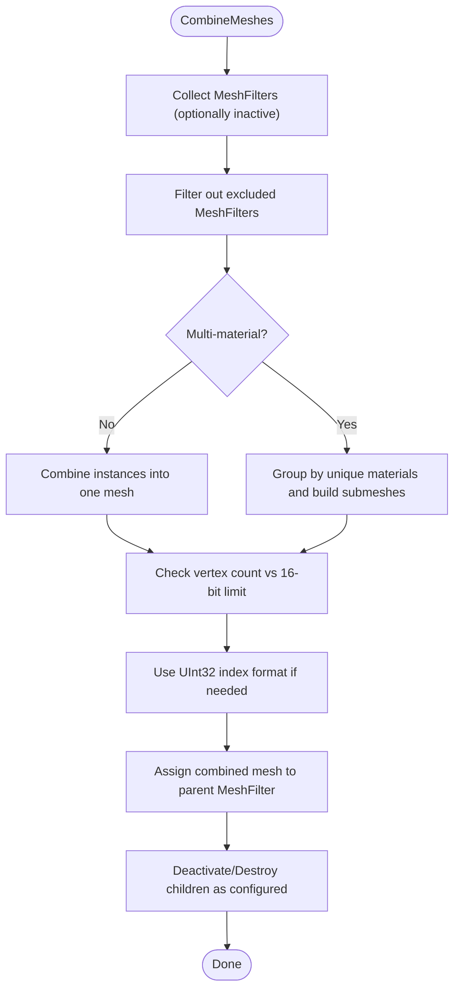
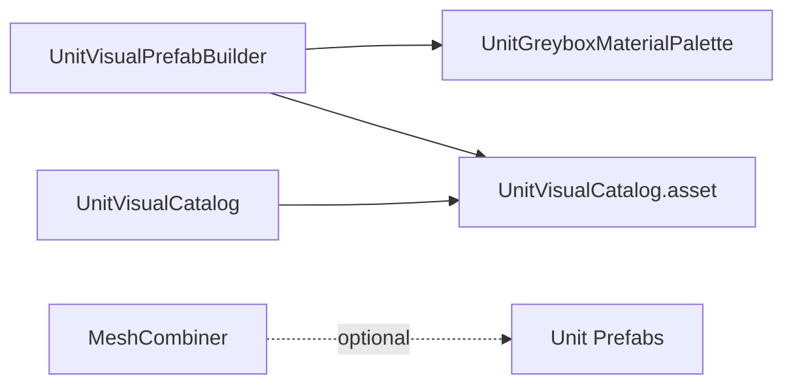

# Asset Pipeline & Organization

<cite>
**Referenced Files in This Document**
- [UnitVisualPrefabBuilder.cs](file://Assets/Game/Scripts/Editor/UnitVisualPrefabBuilder.cs)
- [UnitGreyboxMaterialPalette.cs](file://Assets/Game/Scripts/Editor/UnitGreyboxMaterialPalette.cs)
- [UnitVisualCatalog.cs](file://Assets/Game/Scripts/Runtime/Gameplay/Match/UnitVisualCatalog.cs)
- [UnitVisualCatalog.asset](file://Assets/Game/ScriptableObjects/UnitVisualCatalog.asset)
- [MeshCombiner.cs](file://Assets/MeshCombiner/Scripts/MeshCombiner.cs)
</cite>

## Table of Contents
1. [Introduction](#introduction)
2. [Project Structure](#project-structure)
3. [Core Components](#core-components)
4. [Architecture Overview](#architecture-overview)
5. [Detailed Component Analysis](#detailed-component-analysis)
6. [Dependency Analysis](#dependency-analysis)
7. [Performance Considerations](#performance-considerations)
8. [Troubleshooting Guide](#troubleshooting-guide)
9. [Conclusion](#conclusion)
10. [Appendices](#appendices)

## Introduction
This document defines BARAKI’s asset pipeline and organization for art assets, materials, textures, 3D models, prefabs, audio, VFX, and shaders. It explains the folder hierarchy under Assets/Game/Art/, prefab organization for units, cameras, and effects, naming conventions, version control best practices, material system design (unit visuals, team accents, environment), performance optimization techniques (mesh combining, texture atlasing, LOD), and import settings guidance.

## Project Structure
The project organizes game content under Assets/Game with clear separation between Art, Prefabs, ScriptableObjects, Scenes, Scripts, Settings, UI, Audio, and Resources. The Art directory is intended to contain:
- Animations
- Materials
- Models
- Textures
- VFX

Prefabs are grouped by category:
- Cameras
- Effects
- Units

ScriptableObjects include catalogs and data definitions for units, races, heroes, squads, upgrades, and a Unit Visual Catalog that maps race and role to unit prefabs.

[No sources needed since this diagram shows conceptual structure]

## Core Components
- Unit Visual Catalog: A runtime ScriptableObject that maps each race to a set of unit prefabs keyed by combat role. It provides a lookup method to retrieve a specific unit prefab at runtime.
- Greybox Material Palette: An editor utility that ensures URP Lit materials exist for unit parts (skin, steel, wood, cloth, arcane, chitin variants, glow, and team accent). It creates or updates these materials and persists them under Art/Materials/Units.
- Unit Visual Prefab Builder: An editor tool that procedurally generates greybox unit prefabs for two races across six roles, places team accent parts on named transforms, saves prefabs under Assets/Game/Prefabs/Units, and updates the Unit Visual Catalog asset.

Key responsibilities:
- Ensure consistent material availability for unit parts.
- Generate canonical unit prefabs with predictable structure and naming.
- Maintain a central catalog mapping race + role → prefab.

**Section sources**
- [UnitVisualCatalog.cs:1-58](file://Assets/Game/Scripts/Runtime/Gameplay/Match/UnitVisualCatalog.cs#L1-L58)
- [UnitGreyboxMaterialPalette.cs:1-93](file://Assets/Game/Scripts/Editor/UnitGreyboxMaterialPalette.cs#L1-L93)
- [UnitVisualPrefabBuilder.cs:1-508](file://Assets/Game/Scripts/Editor/UnitVisualPrefabBuilder.cs#L1-L508)

## Architecture Overview
The asset pipeline integrates editor tools and runtime data:
- Editor tools create and maintain materials and prefabs.
- The Unit Visual Catalog asset holds references to generated prefabs.
- Runtime code uses the catalog to spawn appropriate unit visuals based on race and role.

**Diagram sources**
- [UnitVisualPrefabBuilder.cs:17-29](file://Assets/Game/Scripts/Editor/UnitVisualPrefabBuilder.cs#L17-L29)
- [UnitGreyboxMaterialPalette.cs:22-37](file://Assets/Game/Scripts/Editor/UnitGreyboxMaterialPalette.cs#L22-L37)
- [UnitVisualCatalog.cs:15-26](file://Assets/Game/Scripts/Runtime/Gameplay/Match/UnitVisualCatalog.cs#L15-L26)
- [UnitVisualCatalog.asset:1-29](file://Assets/Game/ScriptableObjects/UnitVisualCatalog.asset#L1-L29)

## Detailed Component Analysis

### Unit Visual Catalog
Purpose:
- Central registry of unit prefabs indexed by race and role.
- Provides a safe lookup API for runtime instantiation.

Data model:
- Two race sets (Human, Bug).
- Each set contains six roles (Melee, Ranged, Caster, Siege, Flying, Super).
- Lookup method returns a prefab reference if available.

Usage:
- Runtime systems query the catalog to obtain the correct visual prefab for a unit instance.

**Diagram sources**
- [UnitVisualCatalog.cs:10-56](file://Assets/Game/Scripts/Runtime/Gameplay/Match/UnitVisualCatalog.cs#L10-L56)

**Section sources**
- [UnitVisualCatalog.cs:1-58](file://Assets/Game/Scripts/Runtime/Gameplay/Match/UnitVisualCatalog.cs#L1-L58)
- [UnitVisualCatalog.asset:1-29](file://Assets/Game/ScriptableObjects/UnitVisualCatalog.asset#L1-L29)

### Greybox Material Palette
Purpose:
- Ensures persistent URP Lit materials exist for unit parts and team accents.
- Creates materials if missing and updates base color, smoothness, and metallic properties.

Behavior:
- Resolves an appropriate Lit shader from a reference material or built-in shader.
- Persists created materials under Art/Materials/Units.

**Diagram sources**
- [UnitGreyboxMaterialPalette.cs:22-56](file://Assets/Game/Scripts/Editor/UnitGreyboxMaterialPalette.cs#L22-L56)
- [UnitGreyboxMaterialPalette.cs:58-73](file://Assets/Game/Scripts/Editor/UnitGreyboxMaterialPalette.cs#L58-L73)

**Section sources**
- [UnitGreyboxMaterialPalette.cs:1-93](file://Assets/Game/Scripts/Editor/UnitGreyboxMaterialPalette.cs#L1-L93)

### Unit Visual Prefab Builder
Purpose:
- Procedurally constructs greybox unit prefabs for Human and Bug races across six roles.
- Adds team accent parts on a named transform for easy runtime recoloring.
- Saves prefabs under Assets/Game/Prefabs/Units/{Race}/{Role}.prefab.
- Updates the Unit Visual Catalog asset with references to newly created prefabs.

Workflow:
- Ensure materials via palette.
- Ensure folder structure for prefabs and catalog.
- Build prefabs per race and role.
- Save prefabs and update catalog.

**Diagram sources**
- [UnitVisualPrefabBuilder.cs:17-29](file://Assets/Game/Scripts/Editor/UnitVisualPrefabBuilder.cs#L17-L29)
- [UnitVisualPrefabBuilder.cs:31-54](file://Assets/Game/Scripts/Editor/UnitVisualPrefabBuilder.cs#L31-L54)
- [UnitVisualPrefabBuilder.cs:446-478](file://Assets/Game/Scripts/Editor/UnitVisualPrefabBuilder.cs#L446-L478)

**Section sources**
- [UnitVisualPrefabBuilder.cs:1-508](file://Assets/Game/Scripts/Editor/UnitVisualPrefabBuilder.cs#L1-L508)

### Mesh Combiner Utility
Purpose:
- Combines child meshes into a single mesh (single or multi-material) to reduce draw calls.
- Supports deactivating or destroying combined children and generating UV maps.
- Handles vertex limits and index format selection for compatibility.

Usage:
- Attach to a root object containing multiple renderers.
- Configure options (multi-material, combine inactive children, deactivate/destroy children).
- Invoke CombineMeshes to produce a combined mesh asset or in-place mesh.

**Diagram sources**
- [MeshCombiner.cs:73-117](file://Assets/MeshCombiner/Scripts/MeshCombiner.cs#L73-L117)
- [MeshCombiner.cs:138-217](file://Assets/MeshCombiner/Scripts/MeshCombiner.cs#L138-L217)
- [MeshCombiner.cs:219-343](file://Assets/MeshCombiner/Scripts/MeshCombiner.cs#L219-L343)

**Section sources**
- [MeshCombiner.cs:1-343](file://Assets/MeshCombiner/Scripts/MeshCombiner.cs#L1-L343)

## Dependency Analysis
- UnitVisualPrefabBuilder depends on:
  - UnitGreyboxMaterialPalette for material creation/update.
  - Unity Editor APIs for asset database operations and prefab saving.
  - UnitVisualCatalog to persist prefab references.
- UnitVisualCatalog is a runtime dependency used by gameplay systems to resolve unit visuals.
- MeshCombiner is independent and can be applied to any scene/prefab hierarchy to optimize rendering.

**Diagram sources**
- [UnitVisualPrefabBuilder.cs:17-29](file://Assets/Game/Scripts/Editor/UnitVisualPrefabBuilder.cs#L17-L29)
- [UnitGreyboxMaterialPalette.cs:22-37](file://Assets/Game/Scripts/Editor/UnitGreyboxMaterialPalette.cs#L22-L37)
- [UnitVisualCatalog.cs:15-26](file://Assets/Game/Scripts/Runtime/Gameplay/Match/UnitVisualCatalog.cs#L15-L26)
- [UnitVisualCatalog.asset:1-29](file://Assets/Game/ScriptableObjects/UnitVisualCatalog.asset#L1-L29)

**Section sources**
- [UnitVisualPrefabBuilder.cs:1-508](file://Assets/Game/Scripts/Editor/UnitVisualPrefabBuilder.cs#L1-L508)
- [UnitGreyboxMaterialPalette.cs:1-93](file://Assets/Game/Scripts/Editor/UnitGreyboxMaterialPalette.cs#L1-L93)
- [UnitVisualCatalog.cs:1-58](file://Assets/Game/Scripts/Runtime/Gameplay/Match/UnitVisualCatalog.cs#L1-L58)
- [UnitVisualCatalog.asset:1-29](file://Assets/Game/ScriptableObjects/UnitVisualCatalog.asset#L1-L29)
- [MeshCombiner.cs:1-343](file://Assets/MeshCombiner/Scripts/MeshCombiner.cs#L1-L343)

## Performance Considerations
- Mesh Combining:
  - Use MeshCombiner to merge static geometry and reduce draw calls.
  - Prefer single-material combinations when possible; multi-material mode groups by unique materials and builds submeshes.
  - Watch vertex counts; enable 32-bit index buffers for large meshes where supported.
- Texture Atlasing:
  - Group small textures into atlases to reduce texture binds and improve batching.
  - Keep atlas sizes aligned to platform constraints (e.g., power-of-two dimensions where required).
- LOD Management:
  - Provide Level-of-Detail meshes for complex units and environment pieces.
  - Use Unity’s LODGroup component to switch meshes based on camera distance.
- Material Strategy:
  - Reuse materials across similar parts to maximize batching.
  - Use team accent parts on dedicated transforms for efficient runtime recoloring without duplicating meshes.
- Import Settings:
  - Compress textures appropriately per target platform (ASTC, ETC2, DXT).
  - Set mipmaps for world-space textures; disable for UI sprites.
  - Adjust max texture size and compression quality based on platform capabilities.
- Shader Management:
  - Standardize on URP Lit for most surfaces; use specialized shaders only when necessary.
  - Avoid excessive custom shader complexity to maintain performance across devices.

[No sources needed since this section provides general guidance]

## Troubleshooting Guide
- Missing Materials:
  - If unit parts appear untextured, run the material palette ensure routine to create or update materials under Art/Materials/Units.
- Catalog Not Updated:
  - After regenerating prefabs, verify the Unit Visual Catalog asset has been updated with new prefab references.
- Prefab Naming Mismatches:
  - Ensure prefabs follow the expected naming pattern (Race_Role) so runtime lookups succeed.
- Mesh Combination Issues:
  - If combined meshes break lighting or UVs, review UV generation settings and ensure materials are compatible.
  - Check vertex limits and index format selection for older platforms.

**Section sources**
- [UnitGreyboxMaterialPalette.cs:22-56](file://Assets/Game/Scripts/Editor/UnitGreyboxMaterialPalette.cs#L22-L56)
- [UnitVisualPrefabBuilder.cs:446-478](file://Assets/Game/Scripts/Editor/UnitVisualPrefabBuilder.cs#L446-L478)
- [MeshCombiner.cs:138-217](file://Assets/MeshCombiner/Scripts/MeshCombiner.cs#L138-L217)
- [MeshCombiner.cs:219-343](file://Assets/MeshCombiner/Scripts/MeshCombiner.cs#L219-L343)

## Conclusion
BARAKI’s asset pipeline centers on a robust editor-driven workflow that guarantees consistent materials, canonical unit prefabs, and a centralized catalog for runtime resolution. By following the folder hierarchy, naming conventions, and performance guidelines outlined here, teams can maintain a scalable and optimized art pipeline suitable for rapid iteration and broad platform support.

[No sources needed since this section summarizes without analyzing specific files]

## Appendices

### Folder Hierarchy Guidelines
- Art:
  - Animations: Animation clips and controllers for units and effects.
  - Materials: URP Lit materials for units and environment; team accent materials live here.
  - Models: FBX/OBJ imports for units, props, and environment.
  - Textures: Diffuse, normal, roughness, metalness maps; atlases organized by feature.
  - VFX: Particle systems, shader graphs, and related assets.
- Prefabs:
  - Units: One prefab per race+role combination.
  - Cameras: Camera rigs and controls.
  - Effects: Reusable VFX prefabs.
- ScriptableObjects:
  - Data definitions and catalogs (including Unit Visual Catalog).
- Scenes:
  - Bootstrap, Game, Lobby, MainMenu, Levels, Menus.
- Scripts:
  - Runtime logic, Editor tools, Tests.
- Settings:
  - Input, Rendering, UI, ProjectBootstrap configurations.
- UI:
  - Runtime UI components and themes.
- Audio:
  - Music and SFX directories.
- Resources:
  - Road assets and other dynamically loaded resources.

[No sources needed since this section provides general guidance]

### Naming Conventions
- Prefabs:
  - Race_Role.prefab (e.g., Human_Melee.prefab, Bug_Caster.prefab).
- Materials:
  - Unit{Race}{Part}.mat (e.g., UnitHumanSteel.mat, UnitBugChitinDark.mat).
- Team Accent:
  - UnitTeamAccent.mat; part transform name should match the expected accent slot.
- Textures:
  - Feature_TextureType.pixelsize.format (e.g., Forest_Diffuse_1024.png).
- Models:
  - Race_Role_Model.fbx (e.g., Human_Melee_Model.fbx).
- VFX:
  - EffectName_VFX.prefab and associated shader graph names.

[No sources needed since this section provides general guidance]

### Version Control Best Practices (Cursor Rules)
- Commit atomic changes:
  - Separate commits for art additions, material tweaks, and prefab updates.
- Preserve metadata:
  - Commit .meta files alongside assets to maintain GUID integrity.
- Avoid binary bloat:
  - Use texture compression and LODs before committing large assets.
- Clear commit messages:
  - Describe what changed and why (e.g., “Add Bug_Caster prefab and update catalog”).
- Branch strategy:
  - Feature branches for major content drops; merge after validation.
- Review process:
  - Require peer review for significant asset changes and catalog updates.

[No sources needed since this section provides general guidance]

### Import Settings and Platform Optimizations
- Textures:
  - Enable sRGB for color maps; disable for normal/metallic/roughness.
  - Choose ASTC for mobile, ETC2 for Android fallback, DXT for PC.
  - Set appropriate max texture size and mipmap chains.
- Models:
  - Bake normals where applicable; reduce polygon counts for distant objects.
  - Use LODs and occlusion culling for complex scenes.
- Shaders:
  - Prefer URP Lit; minimize custom shader complexity.
  - Use keyword-based features sparingly to avoid shader permutations.
- Audio:
  - Compress music streams; use PCM for short SFX requiring low latency.
  - Organize by category and apply platform-specific compression.

[No sources needed since this section provides general guidance]