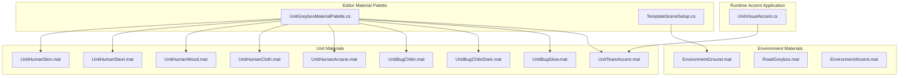
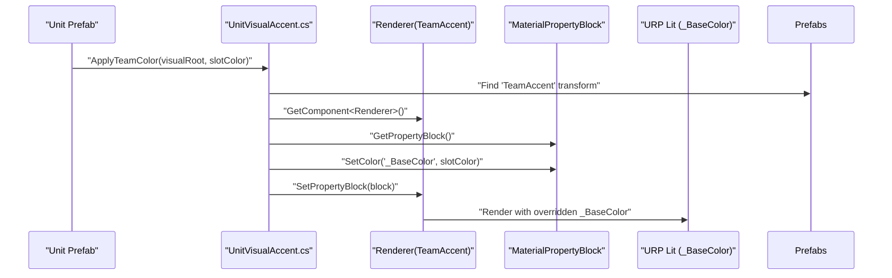
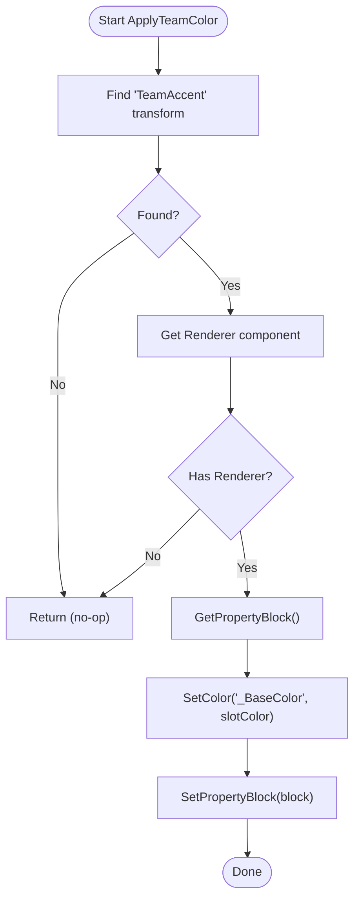
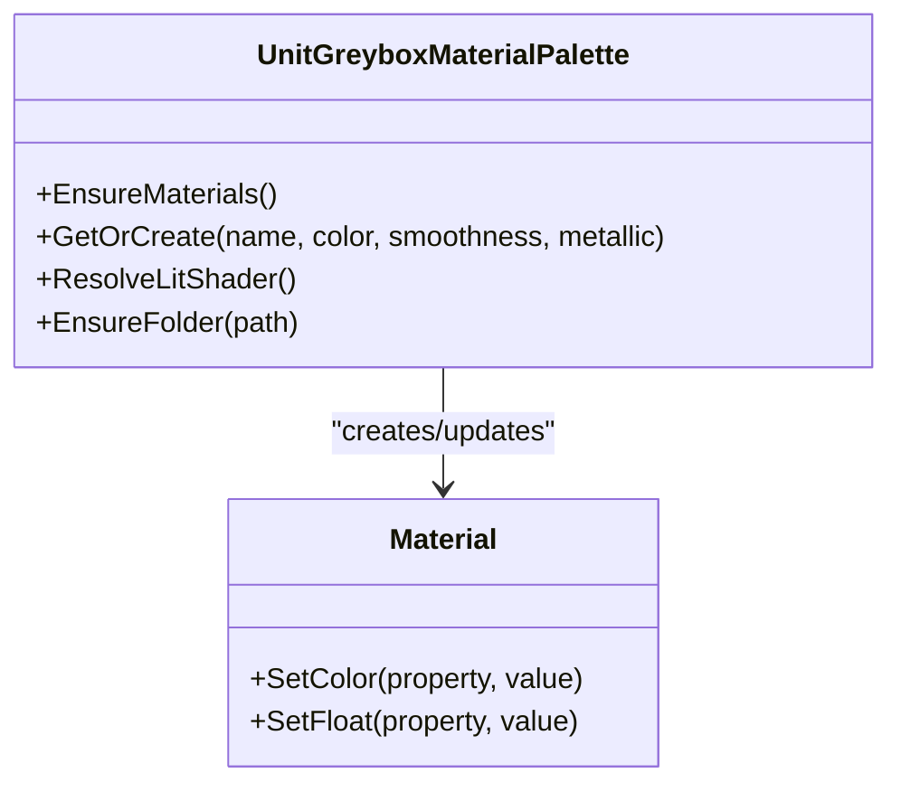
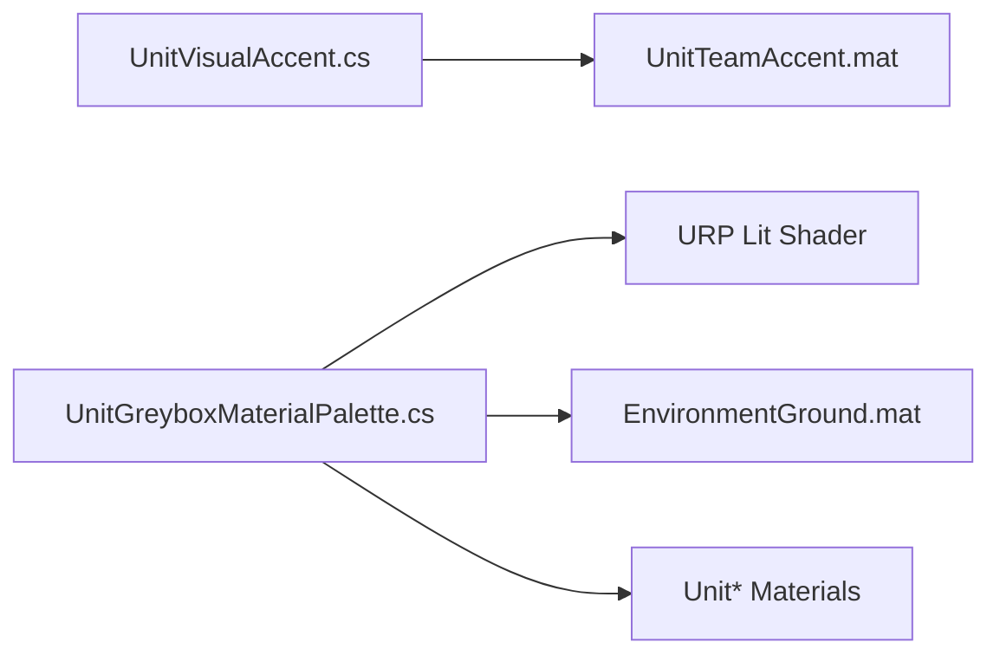

# Material & Shader System

<cite>
**Referenced Files in This Document**
- [EnvironmentGround.mat](file://Assets/Game/Art/Materials/EnvironmentGround.mat)
- [RoadGreybox.mat](file://Assets/Game/Art/Materials/RoadGreybox.mat)
- [EnvironmentAccent.mat](file://Assets/Game/Art/Materials/EnvironmentAccent.mat)
- [UnitHumanSkin.mat](file://Assets/Game/Art/Materials/Units/UnitHumanSkin.mat)
- [UnitHumanSteel.mat](file://Assets/Game/Art/Materials/Units/UnitHumanSteel.mat)
- [UnitHumanWood.mat](file://Assets/Game/Art/Materials/Units/UnitHumanWood.mat)
- [UnitHumanCloth.mat](file://Assets/Game/Art/Materials/Units/UnitHumanCloth.mat)
- [UnitHumanArcane.mat](file://Assets/Game/Art/Materials/Units/UnitHumanArcane.mat)
- [UnitBugChitin.mat](file://Assets/Game/Art/Materials/Units/UnitBugChitin.mat)
- [UnitBugChitinDark.mat](file://Assets/Game/Art/Materials/Units/UnitBugChitinDark.mat)
- [UnitBugGlow.mat](file://Assets/Game/Art/Materials/Units/UnitBugGlow.mat)
- [UnitTeamAccent.mat](file://Assets/Game/Art/Materials/Units/UnitTeamAccent.mat)
- [UnitVisualAccent.cs](file://Assets/Game/Scripts/Runtime/Gameplay/Match/UnitVisualAccent.cs)
- [UnitGreyboxMaterialPalette.cs](file://Assets/Game/Scripts/Editor/UnitGreyboxMaterialPalette.cs)
- [TemplateSceneSetup.cs](file://Assets/Game/Scripts/Editor/TemplateSceneSetup.cs)
- [ShaderGraphSettings.asset](file://ProjectSettings/ShaderGraphSettings.asset)
</cite>

## Table of Contents
1. Introduction
2. Project Structure
3. Core Components
4. Architecture Overview
5. Detailed Component Analysis
6. Dependency Analysis
7. Performance Considerations
8. Troubleshooting Guide
9. Conclusion
10. Appendices

## Introduction
This document explains BARAKI’s material and shader system architecture with a focus on:
- Unit materials (UnitHuman*, UnitBug*) organized by material type and team accent colors
- Environment materials for consistent visual styling (EnvironmentGround, RoadGreybox, EnvironmentAccent)
- Material property structure for unit customization, team color application, and visual accents
- Guidelines for creating new materials, shader graph usage, and performance optimization
- Material instancing considerations, GPU instancing for units, and platform-specific shader notes
- Examples to extend the system for new unit types or visual effects

The project uses Unity Universal Render Pipeline (URP) Lit materials as the primary shading model for both environment and unit greybox assets. Runtime team color application is performed via MaterialPropertyBlock targeting the URP Lit _BaseColor property.

## Project Structure
Materials are organized into two main categories:
- Environment materials under Assets/Game/Art/Materials
  - EnvironmentGround.mat
  - RoadGreybox.mat
  - EnvironmentAccent.mat
- Unit materials under Assets/Game/Art/Materials/Units
  - Human variants: UnitHumanSkin, UnitHumanSteel, UnitHumanWood, UnitHumanCloth, UnitHumanArcane
  - Bug variants: UnitBugChitin, UnitBugChitinDark, UnitBugGlow
  - Team accent: UnitTeamAccent

**Diagram sources**
- [EnvironmentGround.mat:1-138](file://Assets/Game/Art/Materials/EnvironmentGround.mat#L1-L138)
- [RoadGreybox.mat:1-138](file://Assets/Game/Art/Materials/RoadGreybox.mat#L1-L138)
- [EnvironmentAccent.mat:1-138](file://Assets/Game/Art/Materials/EnvironmentAccent.mat#L1-L138)
- [UnitHumanSkin.mat:1-138](file://Assets/Game/Art/Materials/Units/UnitHumanSkin.mat#L1-L138)
- [UnitHumanSteel.mat:1-138](file://Assets/Game/Art/Materials/Units/UnitHumanSteel.mat#L1-L138)
- [UnitHumanWood.mat:1-138](file://Assets/Game/Art/Materials/Units/UnitHumanWood.mat#L1-L138)
- [UnitHumanCloth.mat:1-138](file://Assets/Game/Art/Materials/Units/UnitHumanCloth.mat#L1-L138)
- [UnitHumanArcane.mat:1-138](file://Assets/Game/Art/Materials/Units/UnitHumanArcane.mat#L1-L138)
- [UnitBugChitin.mat:1-138](file://Assets/Game/Art/Materials/Units/UnitBugChitin.mat#L1-L138)
- [UnitBugChitinDark.mat:1-138](file://Assets/Game/Art/Materials/Units/UnitBugChitinDark.mat#L1-L138)
- [UnitBugGlow.mat:1-138](file://Assets/Game/Art/Materials/Units/UnitBugGlow.mat#L1-L138)
- [UnitTeamAccent.mat:1-138](file://Assets/Game/Art/Materials/Units/UnitTeamAccent.mat#L1-L138)
- [UnitVisualAccent.cs:1-56](file://Assets/Game/Scripts/Runtime/Gameplay/Match/UnitVisualAccent.cs#L1-L56)
- [UnitGreyboxMaterialPalette.cs:1-92](file://Assets/Game/Scripts/Editor/UnitGreyboxMaterialPalette.cs#L1-L92)
- [TemplateSceneSetup.cs:141-165](file://Assets/Game/Scripts/Editor/TemplateSceneSetup.cs#L141-L165)

**Section sources**
- [EnvironmentGround.mat:1-138](file://Assets/Game/Art/Materials/EnvironmentGround.mat#L1-L138)
- [RoadGreybox.mat:1-138](file://Assets/Game/Art/Materials/RoadGreybox.mat#L1-L138)
- [EnvironmentAccent.mat:1-138](file://Assets/Game/Art/Materials/EnvironmentAccent.mat#L1-L138)
- [UnitHumanSkin.mat:1-138](file://Assets/Game/Art/Materials/Units/UnitHumanSkin.mat#L1-L138)
- [UnitHumanSteel.mat:1-138](file://Assets/Game/Art/Materials/Units/UnitHumanSteel.mat#L1-L138)
- [UnitHumanWood.mat:1-138](file://Assets/Game/Art/Materials/Units/UnitHumanWood.mat#L1-L138)
- [UnitHumanCloth.mat:1-138](file://Assets/Game/Art/Materials/Units/UnitHumanCloth.mat#L1-L138)
- [UnitHumanArcane.mat:1-138](file://Assets/Game/Art/Materials/Units/UnitHumanArcane.mat#L1-L138)
- [UnitBugChitin.mat:1-138](file://Assets/Game/Art/Materials/Units/UnitBugChitin.mat#L1-L138)
- [UnitBugChitinDark.mat:1-138](file://Assets/Game/Art/Materials/Units/UnitBugChitinDark.mat#L1-L138)
- [UnitBugGlow.mat:1-138](file://Assets/Game/Art/Materials/Units/UnitBugGlow.mat#L1-L138)
- [UnitTeamAccent.mat:1-138](file://Assets/Game/Art/Materials/Units/UnitTeamAccent.mat#L1-L138)
- [UnitVisualAccent.cs:1-56](file://Assets/Game/Scripts/Runtime/Gameplay/Match/UnitVisualAccent.cs#L1-L56)
- [UnitGreyboxMaterialPalette.cs:1-92](file://Assets/Game/Scripts/Editor/UnitGreyboxMaterialPalette.cs#L1-L92)
- [TemplateSceneSetup.cs:141-165](file://Assets/Game/Scripts/Editor/TemplateSceneSetup.cs#L141-L165)

## Core Components
- Environment materials provide base ground, road, and accent surfaces using URP Lit with consistent properties such as BaseColor, Smoothness, Metallic, and Emission where applicable.
- Unit materials define per-surface appearance for human and bug units (skin, steel, wood, cloth, arcane, chitin, dark chitin, glow).
- Team accent material (UnitTeamAccent) is used to apply team colors at runtime to a dedicated “TeamAccent” mesh part within unit prefabs.
- Editor palette ensures persistent URP Lit materials exist and are initialized with correct defaults.
- Runtime accent application locates the “TeamAccent” transform and applies the team slot color via MaterialPropertyBlock to the _BaseColor property.

Key runtime behavior:
- The accent system finds a child named “TeamAccent” and sets its renderer’s _BaseColor through a MaterialPropertyBlock.
- The editor palette creates or updates unit materials with appropriate BaseColor, Smoothness, and Metallic values.

**Section sources**
- [UnitVisualAccent.cs:1-56](file://Assets/Game/Scripts/Runtime/Gameplay/Match/UnitVisualAccent.cs#L1-L56)
- [UnitGreyboxMaterialPalette.cs:1-92](file://Assets/Game/Scripts/Editor/UnitGreyboxMaterialPalette.cs#L1-L92)
- [UnitTeamAccent.mat:1-138](file://Assets/Game/Art/Materials/Units/UnitTeamAccent.mat#L1-L138)
- [EnvironmentGround.mat:1-138](file://Assets/Game/Art/Materials/EnvironmentGround.mat#L1-L138)
- [RoadGreybox.mat:1-138](file://Assets/Game/Art/Materials/RoadGreybox.mat#L1-L138)
- [EnvironmentAccent.mat:1-138](file://Assets/Game/Art/Materials/EnvironmentAccent.mat#L1-L138)

## Architecture Overview
The material system follows a layered approach:
- Asset layer: URP Lit materials for environment and units
- Editor tooling: Palette to ensure materials exist and are correctly configured
- Runtime overlay: Accent system applies team colors without duplicating materials

**Diagram sources**
- [UnitVisualAccent.cs:1-56](file://Assets/Game/Scripts/Runtime/Gameplay/Match/UnitVisualAccent.cs#L1-L56)
- [UnitTeamAccent.mat:1-138](file://Assets/Game/Art/Materials/Units/UnitTeamAccent.mat#L1-L138)

## Detailed Component Analysis

### Environment Materials
- EnvironmentGround.mat: Dark, low-smoothness surface for ground; no emission; standard URP Lit settings.
- RoadGreybox.mat: Slightly lighter, very low smoothness for roads; non-metallic.
- EnvironmentAccent.mat: Higher smoothness and subtle emission for UI-like or highlighted elements.

These materials share a common URP Lit shader and rely on BaseColor, Smoothness, Metallic, and Emission to achieve consistent look across scenes.

**Section sources**
- [EnvironmentGround.mat:1-138](file://Assets/Game/Art/Materials/EnvironmentGround.mat#L1-L138)
- [RoadGreybox.mat:1-138](file://Assets/Game/Art/Materials/RoadGreybox.mat#L1-L138)
- [EnvironmentAccent.mat:1-138](file://Assets/Game/Art/Materials/EnvironmentAccent.mat#L1-L138)

### Unit Materials
- Human variants:
  - UnitHumanSkin.mat: Warm skin tone, moderate smoothness.
  - UnitHumanSteel.mat: Metallic and smoother for armor/metal parts.
  - UnitHumanWood.mat: Low metallic, low smoothness for organic wood.
  - UnitHumanCloth.mat: Very low smoothness for fabric.
  - UnitHumanArcane.mat: High smoothness for magical surfaces.
- Bug variants:
  - UnitBugChitin.mat: Mid-tone greenish chitin.
  - UnitBugChitinDark.mat: Darker chitin variant.
  - UnitBugGlow.mat: Brighter, higher smoothness for glowing parts.
- Team accent:
  - UnitTeamAccent.mat: Neutral base intended to be tinted at runtime via _BaseColor.

All unit materials use URP Lit and expose BaseColor, Smoothness, and Metallic for quick tuning.

**Section sources**
- [UnitHumanSkin.mat:1-138](file://Assets/Game/Art/Materials/Units/UnitHumanSkin.mat#L1-L138)
- [UnitHumanSteel.mat:1-138](file://Assets/Game/Art/Materials/Units/UnitHumanSteel.mat#L1-L138)
- [UnitHumanWood.mat:1-138](file://Assets/Game/Art/Materials/Units/UnitHumanWood.mat#L1-L138)
- [UnitHumanCloth.mat:1-138](file://Assets/Game/Art/Materials/Units/UnitHumanCloth.mat#L1-L138)
- [UnitHumanArcane.mat:1-138](file://Assets/Game/Art/Materials/Units/UnitHumanArcane.mat#L1-L138)
- [UnitBugChitin.mat:1-138](file://Assets/Game/Art/Materials/Units/UnitBugChitin.mat#L1-L138)
- [UnitBugChitinDark.mat:1-138](file://Assets/Game/Art/Materials/Units/UnitBugChitinDark.mat#L1-L138)
- [UnitBugGlow.mat:1-138](file://Assets/Game/Art/Materials/Units/UnitBugGlow.mat#L1-L138)
- [UnitTeamAccent.mat:1-138](file://Assets/Game/Art/Materials/Units/UnitTeamAccent.mat#L1-L138)

### Team Accent Application
The accent system targets a specific mesh part named “TeamAccent” inside unit prefabs and applies the team slot color at runtime. It uses MaterialPropertyBlock to avoid duplicating materials and keeps GPU batching efficient.

**Diagram sources**
- [UnitVisualAccent.cs:1-56](file://Assets/Game/Scripts/Runtime/Gameplay/Match/UnitVisualAccent.cs#L1-L56)

**Section sources**
- [UnitVisualAccent.cs:1-56](file://Assets/Game/Scripts/Runtime/Gameplay/Match/UnitVisualAccent.cs#L1-L56)

### Editor Material Palette
The editor palette ensures that all required unit materials exist and are initialized with correct URP Lit properties. It also resolves the correct shader path based on an existing reference material.

**Diagram sources**
- [UnitGreyboxMaterialPalette.cs:1-92](file://Assets/Game/Scripts/Editor/UnitGreyboxMaterialPalette.cs#L1-L92)

**Section sources**
- [UnitGreyboxMaterialPalette.cs:1-92](file://Assets/Game/Scripts/Editor/UnitGreyboxMaterialPalette.cs#L1-L92)

### Template Scene Setup Utilities
Editor utilities can create or update URP Lit materials for scene setup, enabling emission when needed.

**Section sources**
- [TemplateSceneSetup.cs:141-165](file://Assets/Game/Scripts/Editor/TemplateSceneSetup.cs#L141-L165)

## Dependency Analysis
- Runtime dependency:
  - UnitVisualAccent depends on the presence of a “TeamAccent” mesh part and a URP Lit shader supporting _BaseColor.
- Editor dependency:
  - UnitGreyboxMaterialPalette depends on URP Lit shader availability and references EnvironmentGround.mat as a fallback shader resolver.
- Material dependencies:
  - All materials reference the URP Lit shader and set BaseColor, Smoothness, Metallic, and optionally Emission.

**Diagram sources**
- [UnitVisualAccent.cs:1-56](file://Assets/Game/Scripts/Runtime/Gameplay/Match/UnitVisualAccent.cs#L1-L56)
- [UnitGreyboxMaterialPalette.cs:1-92](file://Assets/Game/Scripts/Editor/UnitGreyboxMaterialPalette.cs#L1-L92)
- [EnvironmentGround.mat:1-138](file://Assets/Game/Art/Materials/EnvironmentGround.mat#L1-L138)
- [UnitTeamAccent.mat:1-138](file://Assets/Game/Art/Materials/Units/UnitTeamAccent.mat#L1-L138)

**Section sources**
- [UnitVisualAccent.cs:1-56](file://Assets/Game/Scripts/Runtime/Gameplay/Match/UnitVisualAccent.cs#L1-L56)
- [UnitGreyboxMaterialPalette.cs:1-92](file://Assets/Game/Scripts/Editor/UnitGreyboxMaterialPalette.cs#L1-L92)
- [EnvironmentGround.mat:1-138](file://Assets/Game/Art/Materials/EnvironmentGround.mat#L1-L138)
- [UnitTeamAccent.mat:1-138](file://Assets/Game/Art/Materials/Units/UnitTeamAccent.mat#L1-L138)

## Performance Considerations
- MaterialPropertyBlock usage:
  - The accent system uses MaterialPropertyBlock to override _BaseColor per instance, avoiding material duplication and preserving batching where possible.
- Instancing flags:
  - Current materials have m_EnableInstancingVariants disabled. For large numbers of identical units, consider enabling GPU instancing and ensuring shaders support it.
- Shader variant limit:
  - ShaderGraphSettings.asset defines a default variant limit. Keep keyword combinations minimal to avoid excessive shader variants.
- Mesh combining:
  - If you combine meshes for static environments, ensure shared materials are grouped to reduce draw calls.

[No sources needed since this section provides general guidance]

## Troubleshooting Guide
- Team accent not applied:
  - Ensure the unit prefab contains a child named “TeamAccent” with a Renderer component.
  - Verify the renderer uses a URP Lit-compatible shader that reads _BaseColor.
- Incorrect team color:
  - Confirm the slot color passed to ApplyTeamColor matches the intended team palette.
- Missing materials in editor:
  - Run the editor palette to ensure all unit materials exist and are initialized.
- Emission not visible:
  - Enable emission keywords and set EmissionColor if using emissive materials.

**Section sources**
- [UnitVisualAccent.cs:1-56](file://Assets/Game/Scripts/Runtime/Gameplay/Match/UnitVisualAccent.cs#L1-L56)
- [UnitGreyboxMaterialPalette.cs:1-92](file://Assets/Game/Scripts/Editor/UnitGreyboxMaterialPalette.cs#L1-L92)
- [TemplateSceneSetup.cs:141-165](file://Assets/Game/Scripts/Editor/TemplateSceneSetup.cs#L141-L165)

## Conclusion
BARAKI’s material system centers on URP Lit materials for environment and units, with a clean separation between asset definitions and runtime overlays. The team accent system leverages MaterialPropertyBlock to apply team colors efficiently. The editor palette guarantees consistent material initialization. By following the guidelines below, teams can extend the system safely while maintaining performance and visual consistency.

[No sources needed since this section summarizes without analyzing specific files]

## Appendices

### Material Property Reference (URP Lit)
- BaseColor: Primary albedo color; used by runtime accent system.
- Smoothness: Controls specular sharpness.
- Metallic: Controls metalness for PBR.
- EmissionColor: Optional emissive output; requires emission keyword.

**Section sources**
- [EnvironmentGround.mat:1-138](file://Assets/Game/Art/Materials/EnvironmentGround.mat#L1-L138)
- [RoadGreybox.mat:1-138](file://Assets/Game/Art/Materials/RoadGreybox.mat#L1-L138)
- [EnvironmentAccent.mat:1-138](file://Assets/Game/Art/Materials/EnvironmentAccent.mat#L1-L138)
- [UnitHumanSteel.mat:1-138](file://Assets/Game/Art/Materials/Units/UnitHumanSteel.mat#L1-L138)
- [UnitBugGlow.mat:1-138](file://Assets/Game/Art/Materials/Units/UnitBugGlow.mat#L1-L138)

### Creating New Unit Materials
- Create a new material under Assets/Game/Art/Materials/Units.
- Use URP Lit shader and set BaseColor, Smoothness, and Metallic to match the desired surface.
- Optionally add emission for special effects.
- Update the editor palette to include the new material if you want automatic creation/initialization.

**Section sources**
- [UnitGreyboxMaterialPalette.cs:1-92](file://Assets/Game/Scripts/Editor/UnitGreyboxMaterialPalette.cs#L1-L92)
- [TemplateSceneSetup.cs:141-165](file://Assets/Game/Scripts/Editor/TemplateSceneSetup.cs#L141-L165)

### Extending Team Accent for New Unit Types
- Add a “TeamAccent” mesh part to the new unit prefab.
- Assign UnitTeamAccent or a similar URP Lit material to the accent mesh.
- Ensure ApplyTeamColor is invoked during unit spawn or selection to set the team color.

**Section sources**
- [UnitVisualAccent.cs:1-56](file://Assets/Game/Scripts/Runtime/Gameplay/Match/UnitVisualAccent.cs#L1-L56)
- [UnitTeamAccent.mat:1-138](file://Assets/Game/Art/Materials/Units/UnitTeamAccent.mat#L1-L138)

### Shader Graph Usage Notes
- The current materials use URP Lit rather than custom ShaderGraphs.
- If introducing ShaderGraphs, ensure they expose equivalent properties (e.g., BaseColor) and maintain compatibility with MaterialPropertyBlock overrides.
- Monitor shader variant limits and keep keyword usage minimal.

**Section sources**
- [ShaderGraphSettings.asset:1-20](file://ProjectSettings/ShaderGraphSettings.asset#L1-L20)

### Platform-Specific Shader Considerations
- Some older mobile GPUs may lack advanced features; prefer URP Lit with minimal complexity.
- Avoid heavy reliance on MaterialPropertyBlock for frequently changing properties if SRP Batching is critical; however, small per-instance color changes are generally acceptable.
- Test emission and high smoothness on target platforms to ensure performance budgets are met.

[No sources needed since this section provides general guidance]