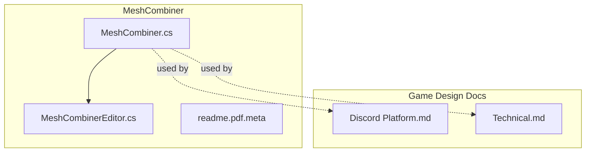
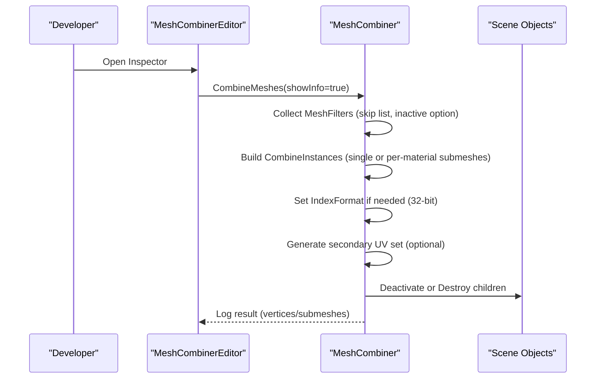
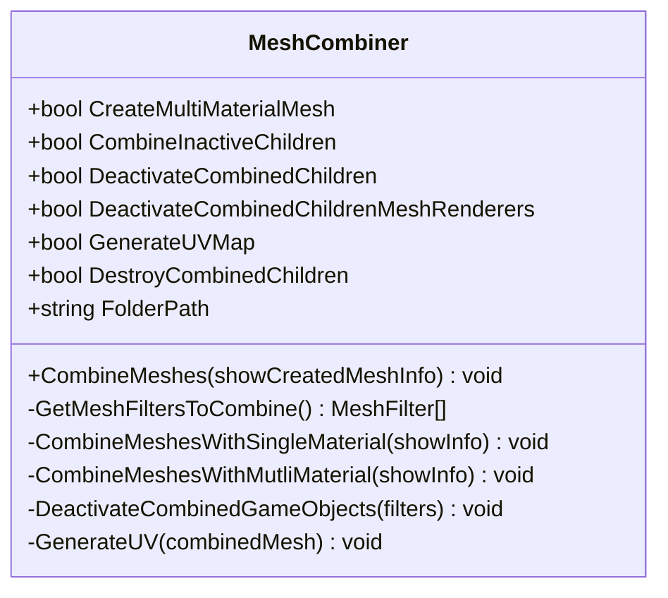
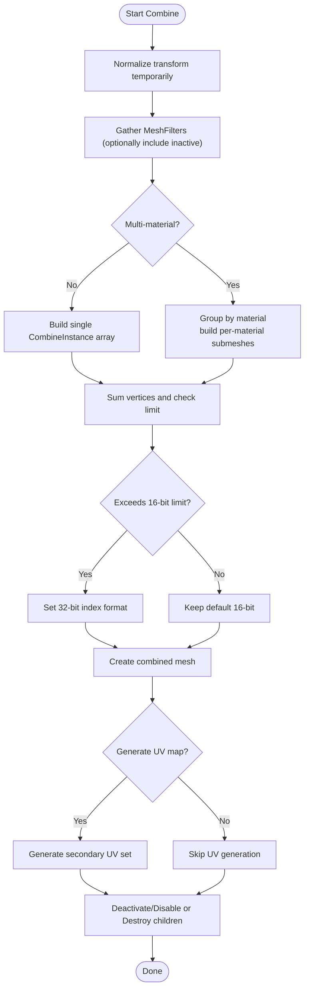
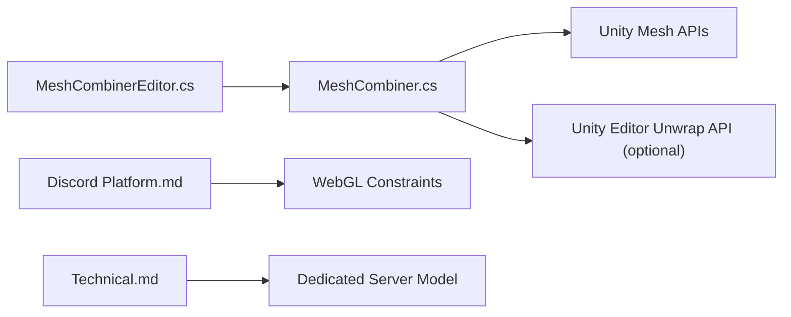

# Performance Optimization

<cite>
**Referenced Files in This Document**
- [MeshCombiner.cs](file://Assets/MeshCombiner/Scripts/MeshCombiner.cs)
- [MeshCombinerEditor.cs](file://Assets/MeshCombiner/Editor/MeshCombinerEditor.cs)
- [readme.pdf.meta](file://Assets/MeshCombiner/readme.pdf.meta)
- [Discord Platform.md](file://Assets/Game/GameDesign/Discord Platform.md)
- [Technical.md](file://Assets/Game/GameDesign/Technical.md)
</cite>

## Table of Contents
1. Introduction
2. Project Structure
3. Core Components
4. Architecture Overview
5. Detailed Component Analysis
6. Dependency Analysis
7. Performance Considerations
8. Troubleshooting Guide
9. Conclusion

## Introduction
This document explains BARAKI’s performance optimization strategies and tools with a focus on rendering efficiency, memory management, and platform-specific constraints for Discord Activities (WebGL). It covers:
- MeshCombiner integration to reduce draw calls
- Texture optimization techniques (atlas creation, compression, mipmapping)
- LOD implementation guidance for units and buildings
- Object pooling patterns for frequently spawned objects
- Memory management best practices
- Profiling workflow and bottleneck identification
- Platform-specific optimizations for WebGL and Discord Activities

Where applicable, concrete code references are provided via section sources.

## Project Structure
The project includes a dedicated MeshCombiner tool under Assets/MeshCombiner and game design documents that define the target platform and runtime architecture. The key performance-related assets are:
- MeshCombiner runtime and editor scripts
- Game design docs describing WebGL constraints and server model

**Diagram sources**
- [MeshCombiner.cs:1-396](file://Assets/MeshCombiner/Scripts/MeshCombiner.cs#L1-L396)
- [MeshCombinerEditor.cs:1-62](file://Assets/MeshCombiner/Editor/MeshCombinerEditor.cs#L1-L62)
- [readme.pdf.meta:1-15](file://Assets/MeshCombiner/readme.pdf.meta#L1-L15)
- [Discord Platform.md:1-340](file://Assets/Game/GameDesign/Discord Platform.md#L1-L340)
- [Technical.md:1-185](file://Assets/Game/GameDesign/Technical.md#L1-L185)

**Section sources**
- [MeshCombiner.cs:1-396](file://Assets/MeshCombiner/Scripts/MeshCombiner.cs#L1-L396)
- [MeshCombinerEditor.cs:1-62](file://Assets/MeshCombiner/Editor/MeshCombinerEditor.cs#L1-L62)
- [Discord Platform.md:313-319](file://Assets/Game/GameDesign/Discord Platform.md#L313-L319)
- [Technical.md:161-166](file://Assets/Game/GameDesign/Technical.md#L161-L166)

## Core Components
- MeshCombiner: Combines child meshes into one or multiple submeshes to reduce draw calls. Supports single-material and multi-material modes, optional UV generation, and post-combine cleanup (deactivate or destroy children).
- Editor Integration: Provides an inspector button and toggles to control combine behavior and options.
- Platform Constraints: WebGL-only client for Discord Activities; requires aggressive memory and draw call optimization.

Key responsibilities:
- Reduce overdraw and state changes by batching geometry
- Manage vertex index buffer size limits
- Provide optional lightmap UVs for combined meshes
- Offer safe cleanup of original children after combining

**Section sources**
- [MeshCombiner.cs:7-50](file://Assets/MeshCombiner/Scripts/MeshCombiner.cs#L7-L50)
- [MeshCombinerEditor.cs:30-57](file://Assets/MeshCombiner/Editor/MeshCombinerEditor.cs#L30-L57)

## Architecture Overview
The performance pipeline centers around pre-runtime mesh combination and runtime object reuse, constrained by WebGL limitations.

**Diagram sources**
- [MeshCombiner.cs:73-117](file://Assets/MeshCombiner/Scripts/MeshCombiner.cs#L73-L117)
- [MeshCombiner.cs:138-217](file://Assets/MeshCombiner/Scripts/MeshCombiner.cs#L138-L217)
- [MeshCombiner.cs:219-357](file://Assets/MeshCombiner/Scripts/MeshCombiner.cs#L219-L357)
- [MeshCombiner.cs:359-395](file://Assets/MeshCombiner/Scripts/MeshCombiner.cs#L359-L395)
- [MeshCombinerEditor.cs:30-57](file://Assets/MeshCombiner/Editor/MeshCombinerEditor.cs#L30-L57)

## Detailed Component Analysis

### MeshCombiner Integration
MeshCombiner reduces draw calls by merging child meshes into a single mesh or multiple submeshes grouped by material. It also handles:
- Transform normalization during combine to avoid parent scale issues
- Optional inclusion of inactive children
- Vertex count checks and 32-bit index buffers when exceeding 16-bit limits
- Optional generation of secondary UV sets for lightmaps
- Post-combine cleanup: deactivate children, disable their renderers, or destroy them

**Diagram sources**
- [MeshCombiner.cs:7-50](file://Assets/MeshCombiner/Scripts/MeshCombiner.cs#L7-L50)
- [MeshCombiner.cs:73-117](file://Assets/MeshCombiner/Scripts/MeshCombiner.cs#L73-L117)
- [MeshCombiner.cs:138-217](file://Assets/MeshCombiner/Scripts/MeshCombiner.cs#L138-L217)
- [MeshCombiner.cs:219-357](file://Assets/MeshCombiner/Scripts/MeshCombiner.cs#L219-L357)
- [MeshCombiner.cs:359-395](file://Assets/MeshCombiner/Scripts/MeshCombiner.cs#L359-L395)

Implementation highlights:
- Single-material mode merges all child meshes into one mesh and assigns a single material from a child renderer.
- Multi-material mode groups children by material, creates submeshes per material, and assigns the unique materials array to the parent renderer.
- When total vertices exceed 65535, it switches to 32-bit index format where supported.
- Optional UV map generation uses editor APIs to create secondary UV sets for lightmapping.
- Cleanup can either deactivate children, disable their MeshRenderer components, or destroy them immediately.

Operational flow:

**Diagram sources**
- [MeshCombiner.cs:73-117](file://Assets/MeshCombiner/Scripts/MeshCombiner.cs#L73-L117)
- [MeshCombiner.cs:138-217](file://Assets/MeshCombiner/Scripts/MeshCombiner.cs#L138-L217)
- [MeshCombiner.cs:219-357](file://Assets/MeshCombiner/Scripts/MeshCombiner.cs#L219-L357)
- [MeshCombiner.cs:359-395](file://Assets/MeshCombiner/Scripts/MeshCombiner.cs#L359-L395)

Usage notes:
- Prefer single-material mode for maximum batching benefits.
- Use multi-material mode only when necessary; each material increases state changes.
- Enable “Combine Inactive Children” only when you need static geometry that is not visible at runtime.
- Use “Generate UV Map” in-editor for lightmapped scenes; this is slow and editor-only.
- Choose between deactivating/disabling children vs destroying them based on whether you need to recombine later.

**Section sources**
- [MeshCombiner.cs:73-117](file://Assets/MeshCombiner/Scripts/MeshCombiner.cs#L73-L117)
- [MeshCombiner.cs:138-217](file://Assets/MeshCombiner/Scripts/MeshCombiner.cs#L138-L217)
- [MeshCombiner.cs:219-357](file://Assets/MeshCombiner/Scripts/MeshCombiner.cs#L219-L357)
- [MeshCombiner.cs:359-395](file://Assets/MeshCombiner/Scripts/MeshCombiner.cs#L359-L395)
- [MeshCombinerEditor.cs:30-57](file://Assets/MeshCombiner/Editor/MeshCombinerEditor.cs#L30-L57)

### Texture Optimization Techniques
While specific texture import settings are not present in the analyzed files, the following strategies align with WebGL and Discord Activity constraints documented in the project:
- Atlas creation for UI elements:
  - Group small UI sprites into atlases to minimize texture binds and improve batching.
  - Keep atlas sizes within WebGL-friendly dimensions (e.g., power-of-two or GPU-supported max).
- Compression settings:
  - Use GPU-native formats (ASTC/ETC2/BC depending on target) to reduce VRAM and bandwidth.
  - For WebGL, prefer ETC2/ASTC-compatible textures where supported; otherwise use DXT/BC variants if targeting desktop browsers.
- Mipmapping:
  - Enable mipmaps for world-space textures to reduce aliasing and cache misses at distance.
  - Disable mipmaps for crisp UI textures if they are always rendered at screen space.
- Texture streaming and LOD:
  - Stream large textures and provide lower-resolution variants for distant objects.
  - Avoid excessive texture resolution beyond what is visible on target devices.

These recommendations complement the WebGL constraints noted in the project documentation.

**Section sources**
- [Discord Platform.md:313-319](file://Assets/Game/GameDesign/Discord Platform.md#L313-L319)

### LOD Implementation for Units and Buildings
Although no explicit LOD scripts were found in the analyzed files, the project emphasizes aggressive LOD usage for WebGL builds. Recommended approach:
- Use Unity LODGroup components on unit and building prefabs.
- Define multiple detail levels (high, medium, low) with corresponding meshes and materials.
- Configure LOD transitions based on camera distance and pixel error thresholds.
- Ensure LOD switching does not cause visual popping by using fade-in/out or crossfading where possible.
- Validate LOD performance impact using profiling tools and adjust thresholds accordingly.

[No sources needed since this section provides general guidance]

### Object Pooling Patterns
The project explicitly states that pooling is mandatory due to frequent spawning of units and effects. Recommended patterns:
- Centralized pool managers per object type (units, projectiles, VFX).
- Pre-warm pools at scene load to avoid runtime allocation spikes.
- Reuse objects by resetting state rather than instantiating/destroying.
- Track active/inactive counts and expand pools lazily if needed.
- Integrate with spawn schedulers (e.g., barracks wave scheduler) to coordinate pooling with gameplay timing.

**Section sources**
- [Technical.md:161-166](file://Assets/Game/GameDesign/Technical.md#L161-L166)

### Memory Management Best Practices
For WebGL and Discord Activities:
- Minimize allocations during gameplay; prefer pooling and object reuse.
- Avoid dynamic string concatenation in hot paths; precompute and cache results.
- Limit VFX complexity and duration; cap simultaneous effects.
- Use lightweight data structures and avoid unnecessary boxing/unboxing.
- Monitor memory usage and GC pressure with profiling tools; optimize hotspots iteratively.

[No sources needed since this section provides general guidance]

### Profiling Tools Usage and Bottleneck Identification
Recommended workflow:
- Use Unity Profiler to identify CPU/GPU bottlenecks, focusing on draw calls, triangles, and memory allocations.
- Inspect frame capture details for WebGL builds to understand browser overhead.
- Measure before/after metrics after applying MeshCombiner and pooling changes.
- Track draw call reduction, triangle count, and memory footprint improvements.
- Iterate on LOD thresholds and texture resolutions based on measured performance.

[No sources needed since this section provides general guidance]

### Platform-Specific Optimizations for Discord Activities (WebGL)
Key constraints and strategies:
- WebGL cannot host authoritative servers; use dedicated headless servers per match.
- All HTTP must go through Discord proxy/URL mappings; ensure TLS for WSS connections.
- Aggressively manage build size and RAM usage; apply pooling, LOD, and VFX limits.
- Consider simplified URP profile for Activity builds.
- Validate CSP rules and avoid inline scripts in shell.

**Section sources**
- [Discord Platform.md:39-52](file://Assets/Game/GameDesign/Discord Platform.md#L39-L52)
- [Discord Platform.md:111-116](file://Assets/Game/GameDesign/Discord Platform.md#L111-L116)
- [Discord Platform.md:313-319](file://Assets/Game/GameDesign/Discord Platform.md#L313-L319)
- [Technical.md:65-101](file://Assets/Game/GameDesign/Technical.md#L65-L101)

## Dependency Analysis
MeshCombiner depends on Unity’s mesh APIs and optionally on editor-only unwrapping utilities. Its editor script integrates with Unity’s inspector to expose controls.

**Diagram sources**
- [MeshCombiner.cs:385-395](file://Assets/MeshCombiner/Scripts/MeshCombiner.cs#L385-L395)
- [MeshCombinerEditor.cs:1-62](file://Assets/MeshCombiner/Editor/MeshCombinerEditor.cs#L1-L62)
- [Discord Platform.md:313-319](file://Assets/Game/GameDesign/Discord Platform.md#L313-L319)
- [Technical.md:65-101](file://Assets/Game/GameDesign/Technical.md#L65-L101)

**Section sources**
- [MeshCombiner.cs:385-395](file://Assets/MeshCombiner/Scripts/MeshCombiner.cs#L385-L395)
- [MeshCombinerEditor.cs:1-62](file://Assets/MeshCombiner/Editor/MeshCombinerEditor.cs#L1-L62)
- [Discord Platform.md:313-319](file://Assets/Game/GameDesign/Discord Platform.md#L313-L319)
- [Technical.md:65-101](file://Assets/Game/GameDesign/Technical.md#L65-L101)

## Performance Considerations
- Draw Calls: MeshCombiner significantly reduces draw calls by batching geometry; prefer single-material meshes where feasible.
- Vertex Limits: Watch for 65535 vertex limit; the tool automatically uses 32-bit index buffers when supported.
- Submeshes: Multi-material mode introduces more state changes; use sparingly.
- UV Generation: Secondary UV generation is editor-only and slow; enable only when needed for lightmapping.
- Cleanup Strategy: Deactivating or disabling children preserves the ability to recombine; destroying children removes them permanently.
- WebGL Constraints: Keep build size and RAM low; apply pooling, LOD, and VFX caps.

[No sources needed since this section provides general guidance]

## Troubleshooting Guide
Common issues and resolutions:
- Combined mesh has too many vertices:
  - Verify 32-bit index format usage; ensure Unity version supports it.
  - Split large models into smaller groups or reduce polygon count.
- Missing materials after combine:
  - Confirm correct material assignment in multi-material mode.
  - Ensure child MeshRenderers have valid sharedMaterials arrays.
- Lightmap UVs not applied:
  - Enable “Generate UV Map” in-editor; note it is slow and editor-only.
- Children still rendering:
  - Check “Deactivate Combined Children” and “Deactivate Combined Children's MeshRenderers” toggles.
- WebGL performance drops:
  - Apply pooling, LOD, and reduce VFX; validate URP profile for WebGL.

**Section sources**
- [MeshCombiner.cs:173-196](file://Assets/MeshCombiner/Scripts/MeshCombiner.cs#L173-L196)
- [MeshCombiner.cs:281-295](file://Assets/MeshCombiner/Scripts/MeshCombiner.cs#L281-L295)
- [MeshCombiner.cs:385-395](file://Assets/MeshCombiner/Scripts/MeshCombiner.cs#L385-L395)
- [MeshCombinerEditor.cs:45-57](file://Assets/MeshCombiner/Editor/MeshCombinerEditor.cs#L45-L57)
- [Discord Platform.md:313-319](file://Assets/Game/GameDesign/Discord Platform.md#L313-L319)

## Conclusion
BARAKI’s performance strategy leverages MeshCombiner to minimize draw calls, enforces object pooling and LOD to manage memory and rendering costs, and adheres to WebGL constraints for Discord Activities. By combining these techniques with disciplined profiling and iterative optimization, the project can achieve stable performance across target platforms while maintaining visual fidelity.

[No sources needed since this section summarizes without analyzing specific files]