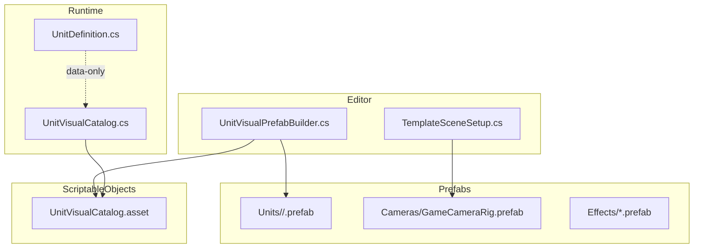
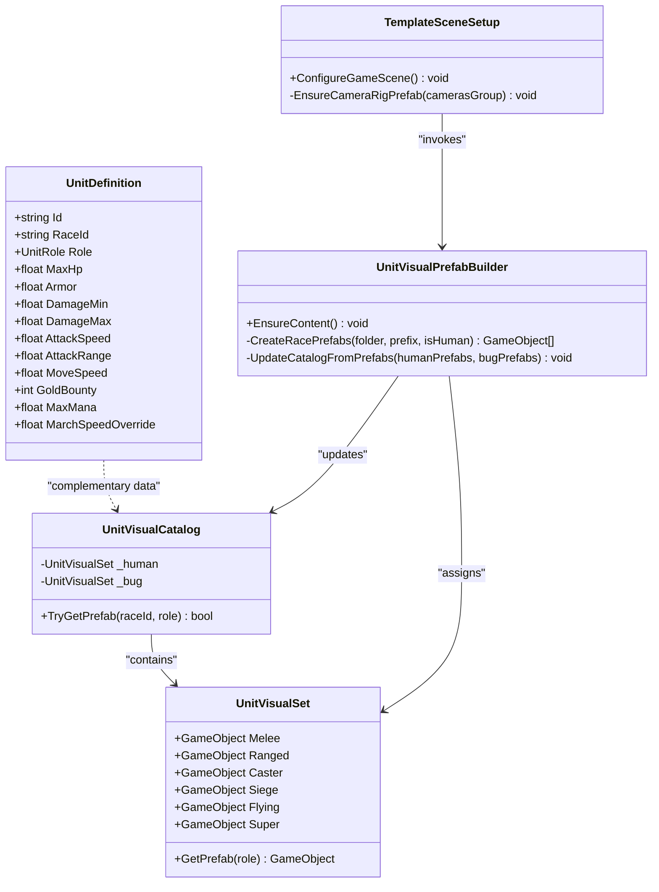
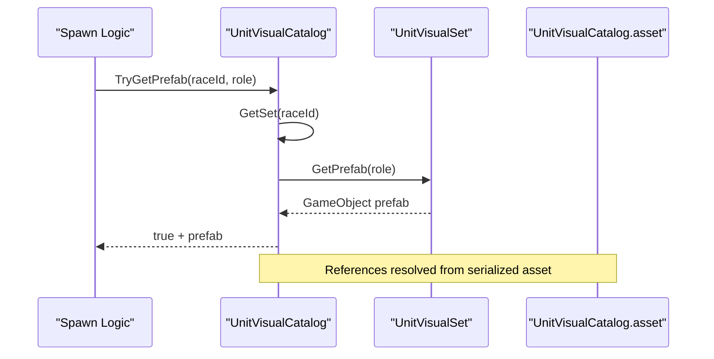
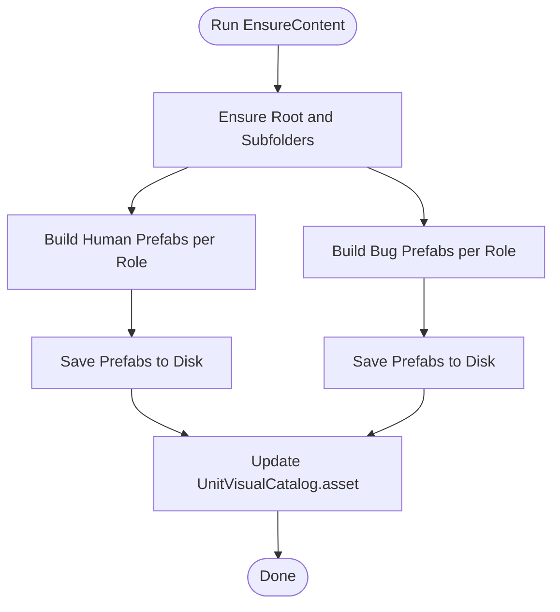
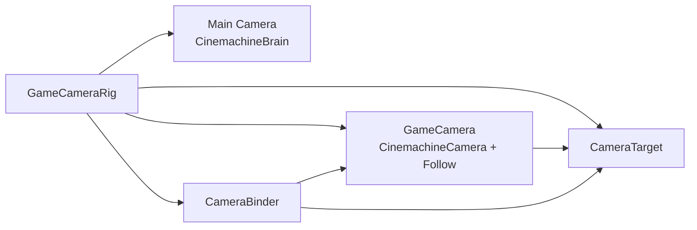
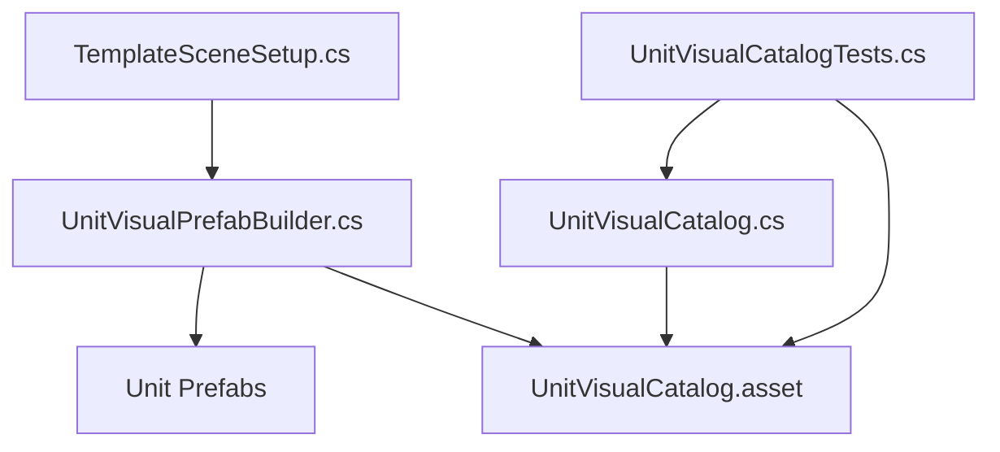

# Prefab Management

<cite>
**Referenced Files in This Document**
- [UnitVisualCatalog.cs](file://Assets/Game/Scripts/Runtime/Gameplay/Match/UnitVisualCatalog.cs)
- [UnitDefinition.cs](file://Assets/Game/Scripts/Runtime/Gameplay/Data/UnitDefinition.cs)
- [UnitVisualPrefabBuilder.cs](file://Assets/Game/Scripts/Editor/UnitVisualPrefabBuilder.cs)
- [TemplateSceneSetup.cs](file://Assets/Game/Scripts/Editor/TemplateSceneSetup.cs)
- [GameCameraRig.prefab](file://Assets/Game/Prefabs/Cameras/GameCameraRig.prefab)
- [UnitVisualCatalog.asset](file://Assets/Game/ScriptableObjects/UnitVisualCatalog.asset)
- [UnitVisualCatalogTests.cs](file://Assets/Game/Scripts/Tests/UnitVisualCatalogTests.cs)
</cite>

## Table of Contents
1. Introduction
2. Project Structure
3. Core Components
4. Architecture Overview
5. Detailed Component Analysis
6. Dependency Analysis
7. Performance Considerations
8. Troubleshooting Guide
9. Conclusion

## Introduction
This document explains BARAKI’s prefab management system with a focus on unit prefabs, their organization under Assets/Game/Prefabs/, and how they relate to data definitions. It covers:
- Hierarchical folder structure for Units (Bug/, Human/), Cameras, and Effects
- Naming conventions for unit prefabs and camera rig structures
- The relationship between prefabs and ScriptableObject definitions
- Guidelines for dependencies, component organization, and instantiation patterns
- Performance considerations for large hierarchies, object pooling, and memory management
- Step-by-step examples for creating new unit prefabs following established patterns

## Project Structure
The relevant runtime and editor assets are organized as follows:
- Assets/Game/Prefabs/Units/Human/ and Assets/Game/Prefabs/Units/Bug/ contain role-based unit prefabs
- Assets/Game/Prefabs/Cameras/ contains the main camera rig prefab
- Assets/Game/Prefabs/Effects/ is reserved for reusable visual effects prefabs
- Assets/Game/ScriptableObjects/UnitVisualCatalog.asset maps races and roles to prefabs
- Runtime code provides catalog lookup; Editor code generates greybox prefabs and updates the catalog

**Diagram sources**
- [UnitVisualCatalog.cs:1-57](file://Assets/Game/Scripts/Runtime/Gameplay/Match/UnitVisualCatalog.cs#L1-L57)
- [UnitDefinition.cs:1-36](file://Assets/Game/Scripts/Runtime/Gameplay/Data/UnitDefinition.cs#L1-L36)
- [UnitVisualPrefabBuilder.cs:1-507](file://Assets/Game/Scripts/Editor/UnitVisualPrefabBuilder.cs#L1-L507)
- [TemplateSceneSetup.cs:1-200](file://Assets/Game/Scripts/Editor/TemplateSceneSetup.cs#L1-L200)
- [GameCameraRig.prefab:1-393](file://Assets/Game/Prefabs/Cameras/GameCameraRig.prefab#L1-L393)
- [UnitVisualCatalog.asset:1-29](file://Assets/Game/ScriptableObjects/UnitVisualCatalog.asset#L1-L29)

**Section sources**
- [UnitVisualCatalog.cs:1-57](file://Assets/Game/Scripts/Runtime/Gameplay/Match/UnitVisualCatalog.cs#L1-L57)
- [UnitVisualPrefabBuilder.cs:1-507](file://Assets/Game/Scripts/Editor/UnitVisualPrefabBuilder.cs#L1-L507)
- [TemplateSceneSetup.cs:1-200](file://Assets/Game/Scripts/Editor/TemplateSceneSetup.cs#L1-L200)
- [GameCameraRig.prefab:1-393](file://Assets/Game/Prefabs/Cameras/GameCameraRig.prefab#L1-L393)
- [UnitVisualCatalog.asset:1-29](file://Assets/Game/ScriptableObjects/UnitVisualCatalog.asset#L1-L29)

## Core Components
- UnitVisualCatalog (runtime): Provides TryGetPrefab(raceId, role) to resolve a unit prefab by race and combat role. Internally holds two sets (Human, Bug), each mapping six roles to GameObject references.
- UnitVisualCatalog.asset: Serialized asset that binds specific prefabs to each race and role combination.
- UnitVisualPrefabBuilder (editor): Procedurally creates greybox unit prefabs for all races and roles, then updates the catalog asset.
- TemplateSceneSetup (editor): Ensures required folders and prefabs exist, including the camera rig and effects directory.
- GameCameraRig.prefab: A self-contained camera rig containing Main Camera, Cinemachine Brain, Virtual Camera, Follow target, and binder components.
- UnitDefinition (data): Pure data definition for units (stats, IDs, roles). It does not reference prefabs directly but complements the visual catalog at runtime.

Key responsibilities:
- Catalog lookup isolates content from logic
- Builder centralizes creation and naming
- Scene setup guarantees environment consistency

**Section sources**
- [UnitVisualCatalog.cs:1-57](file://Assets/Game/Scripts/Runtime/Gameplay/Match/UnitVisualCatalog.cs#L1-L57)
- [UnitVisualCatalog.asset:1-29](file://Assets/Game/ScriptableObjects/UnitVisualCatalog.asset#L1-L29)
- [UnitVisualPrefabBuilder.cs:1-507](file://Assets/Game/Scripts/Editor/UnitVisualPrefabBuilder.cs#L1-L507)
- [TemplateSceneSetup.cs:1-200](file://Assets/Game/Scripts/Editor/TemplateSceneSetup.cs#L1-L200)
- [GameCameraRig.prefab:1-393](file://Assets/Game/Prefabs/Cameras/GameCameraRig.prefab#L1-L393)
- [UnitDefinition.cs:1-36](file://Assets/Game/Scripts/Runtime/Gameplay/Data/UnitDefinition.cs#L1-L36)

## Architecture Overview
The prefab system separates data, visuals, and generation:
- Data layer: UnitDefinition defines gameplay stats and identifiers
- Visual layer: Prefabs represent unit models and rigs
- Catalog layer: UnitVisualCatalog bridges data and visuals via race+role keys
- Editor tooling: UnitVisualPrefabBuilder ensures consistent content and catalog state
- Scene bootstrap: TemplateSceneSetup ensures required scene elements and directories

**Diagram sources**
- [UnitDefinition.cs:1-36](file://Assets/Game/Scripts/Runtime/Gameplay/Data/UnitDefinition.cs#L1-L36)
- [UnitVisualCatalog.cs:1-57](file://Assets/Game/Scripts/Runtime/Gameplay/Match/UnitVisualCatalog.cs#L1-L57)
- [UnitVisualPrefabBuilder.cs:1-507](file://Assets/Game/Scripts/Editor/UnitVisualPrefabBuilder.cs#L1-L507)
- [TemplateSceneSetup.cs:1-200](file://Assets/Game/Scripts/Editor/TemplateSceneSetup.cs#L1-L200)

## Detailed Component Analysis

### Unit Visual Catalog (Runtime)
Purpose:
- Centralized lookup for unit prefabs by race and role
- Exposes TryGetPrefab(raceId, role) returning a GameObject reference

Behavior:
- Maintains two UnitVisualSet instances (Human, Bug)
- Each set maps six roles to prefabs
- GetPrefab(role) uses pattern matching to return the correct prefab

Usage:
- Instantiate prefabs via catalog during match or spawn flows
- Avoid hardcoding paths or names

**Diagram sources**
- [UnitVisualCatalog.cs:1-57](file://Assets/Game/Scripts/Runtime/Gameplay/Match/UnitVisualCatalog.cs#L1-L57)
- [UnitVisualCatalog.asset:1-29](file://Assets/Game/ScriptableObjects/UnitVisualCatalog.asset#L1-L29)

**Section sources**
- [UnitVisualCatalog.cs:1-57](file://Assets/Game/Scripts/Runtime/Gameplay/Match/UnitVisualCatalog.cs#L1-L57)
- [UnitVisualCatalog.asset:1-29](file://Assets/Game/ScriptableObjects/UnitVisualCatalog.asset#L1-L29)

### Unit Definition (Data)
Purpose:
- Holds unit gameplay data such as ID, race, role, and stats
- Does not reference prefabs directly; keeps data decoupled from visuals

Guidelines:
- Keep IDs stable across versions
- Use Role consistently with catalog keys
- Maintain balance values here; visuals are configured separately

**Section sources**
- [UnitDefinition.cs:1-36](file://Assets/Game/Scripts/Runtime/Gameplay/Data/UnitDefinition.cs#L1-L36)

### Unit Visual Prefab Builder (Editor)
Purpose:
- Creates greybox unit prefabs for both races and all roles
- Enforces naming and hierarchy conventions
- Updates UnitVisualCatalog.asset automatically

Key behaviors:
- Ensures folder structure under Assets/Game/Prefabs/Units/{Human,Bug}
- Builds prefabs named "{Race}_{Role}.prefab"
- Assigns team accent transforms and materials where applicable
- Persists prefabs and updates catalog asset

**Diagram sources**
- [UnitVisualPrefabBuilder.cs:1-507](file://Assets/Game/Scripts/Editor/UnitVisualPrefabBuilder.cs#L1-L507)

**Section sources**
- [UnitVisualPrefabBuilder.cs:1-507](file://Assets/Game/Scripts/Editor/UnitVisualPrefabBuilder.cs#L1-L507)

### Template Scene Setup (Editor)
Purpose:
- Idempotently configures the game scene
- Ensures required directories and prefabs exist
- Creates or reuses the camera rig prefab

Highlights:
- Ensures Assets/Game/Prefabs/Effects and Assets/Game/Prefabs/Cameras
- Saves GameCameraRig.prefab if missing
- Invokes UnitVisualPrefabBuilder.EnsureContent to keep content fresh

**Section sources**
- [TemplateSceneSetup.cs:1-200](file://Assets/Game/Scripts/Editor/TemplateSceneSetup.cs#L1-L200)
- [TemplateSceneSetup.cs:575-645](file://Assets/Game/Scripts/Editor/TemplateSceneSetup.cs#L575-L645)

### Camera Rig Structure
Structure overview:
- Root: GameCameraRig
  - Main Camera (CinemachineBrain)
  - GameCamera (CinemachineCamera + Follow)
  - CameraTarget (target transform)
  - CameraBinder (binds virtual camera and default target)

Naming and hierarchy:
- Root name: GameCameraRig
- Children: Main Camera, GameCamera, CameraTarget, CameraBinder
- Follow offset and FOV configured on the virtual camera

**Diagram sources**
- [GameCameraRig.prefab:1-393](file://Assets/Game/Prefabs/Cameras/GameCameraRig.prefab#L1-L393)

**Section sources**
- [GameCameraRig.prefab:1-393](file://Assets/Game/Prefabs/Cameras/GameCameraRig.prefab#L1-L393)

### Effects Folder
Purpose:
- Houses reusable VFX prefabs (e.g., SampleBurst)
- Referenced by scenes or systems as needed

Guidelines:
- Keep effect prefabs lightweight and self-contained
- Prefer shared materials and particle systems
- Avoid heavy runtime allocations inside effects

**Section sources**
- [TemplateSceneSetup.cs:1-200](file://Assets/Game/Scripts/Editor/TemplateSceneSetup.cs#L1-L200)

## Dependency Analysis
- Runtime dependency: UnitVisualCatalog depends on UnitVisualCatalog.asset for prefab references
- Editor dependency: UnitVisualPrefabBuilder writes prefabs and updates the catalog asset
- Scene bootstrap dependency: TemplateSceneSetup ensures directories and invokes builder
- Tests verify catalog correctness and prefab presence

**Diagram sources**
- [TemplateSceneSetup.cs:1-200](file://Assets/Game/Scripts/Editor/TemplateSceneSetup.cs#L1-L200)
- [UnitVisualPrefabBuilder.cs:1-507](file://Assets/Game/Scripts/Editor/UnitVisualPrefabBuilder.cs#L1-L507)
- [UnitVisualCatalog.cs:1-57](file://Assets/Game/Scripts/Runtime/Gameplay/Match/UnitVisualCatalog.cs#L1-L57)
- [UnitVisualCatalog.asset:1-29](file://Assets/Game/ScriptableObjects/UnitVisualCatalog.asset#L1-L29)
- [UnitVisualCatalogTests.cs:1-76](file://Assets/Game/Scripts/Tests/UnitVisualCatalogTests.cs#L1-L76)

**Section sources**
- [UnitVisualCatalogTests.cs:1-76](file://Assets/Game/Scripts/Tests/UnitVisualCatalogTests.cs#L1-L76)

## Performance Considerations
- Prefab hierarchy size
  - Keep unit prefabs shallow; avoid deep nested transforms
  - Remove colliders from non-interactive parts in prefabs
  - Share materials and meshes across variants
- Object pooling
  - Reuse unit instances rather than frequent instantiate/destroy
  - Pool projectiles and temporary effects
  - Reset pooled objects efficiently without allocations
- Memory management
  - Avoid Resources.Load for new content; prefer catalog-driven references
  - Cache component references in Awake/Start
  - Minimize per-frame allocations in hot paths
- Rendering
  - Use static batching where appropriate
  - Limit draw calls by sharing materials and LODs
  - Optimize culling masks and layers for cameras

[No sources needed since this section provides general guidance]

## Troubleshooting Guide
Common issues and resolutions:
- Missing catalog entries
  - Run the editor builder to regenerate prefabs and update the catalog
  - Verify all twelve race-role combinations are assigned
- Incorrect prefab names
  - Ensure naming follows "{Race}_{Role}.prefab" convention
  - Confirm catalog mappings align with expected names
- Camera rig problems
  - Ensure GameCameraRig.prefab exists and has required children
  - Validate CameraBinder references to virtual camera and target
- Effects not appearing
  - Confirm Assets/Game/Prefabs/Effects exists and contains required prefabs
  - Check scene setup invoked by TemplateSceneSetup

Validation helpers:
- Use tests to assert catalog existence and prefab assignments
- Inspect inspector fields on UnitVisualCatalog.asset for nulls

**Section sources**
- [UnitVisualCatalogTests.cs:1-76](file://Assets/Game/Scripts/Tests/UnitVisualCatalogTests.cs#L1-L76)
- [TemplateSceneSetup.cs:1-200](file://Assets/Game/Scripts/Editor/TemplateSceneSetup.cs#L1-L200)
- [GameCameraRig.prefab:1-393](file://Assets/Game/Prefabs/Cameras/GameCameraRig.prefab#L1-L393)

## Conclusion
BARAKI’s prefab management system cleanly separates data, visuals, and generation:
- UnitDefinition carries gameplay data
- UnitVisualCatalog bridges data to visuals via race+role keys
- UnitVisualPrefabBuilder standardizes content creation and catalog updates
- TemplateSceneSetup ensures consistent scene and asset scaffolding
Following the naming, hierarchy, and performance guidelines will keep the system maintainable and efficient as content scales.

[No sources needed since this section summarizes without analyzing specific files]