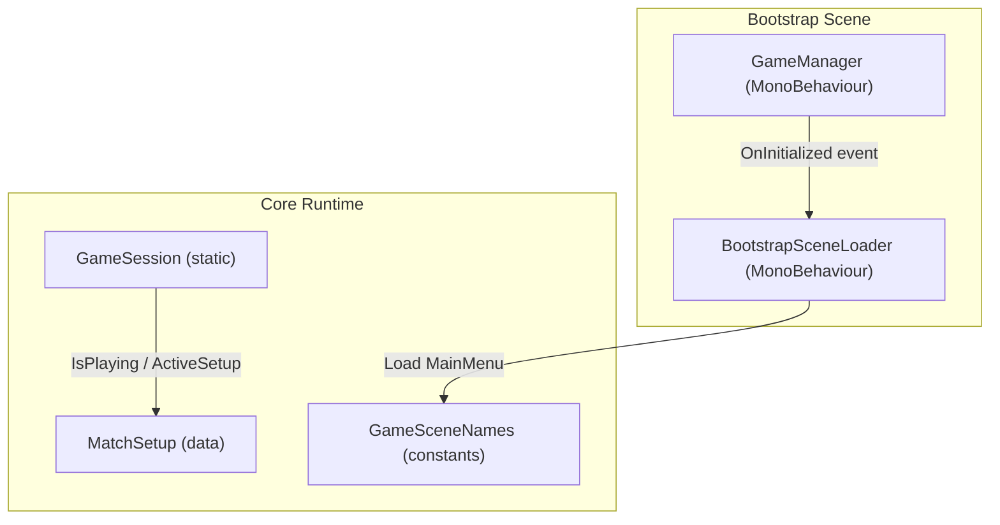
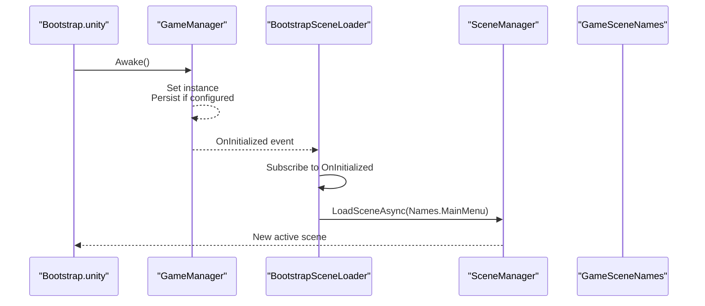
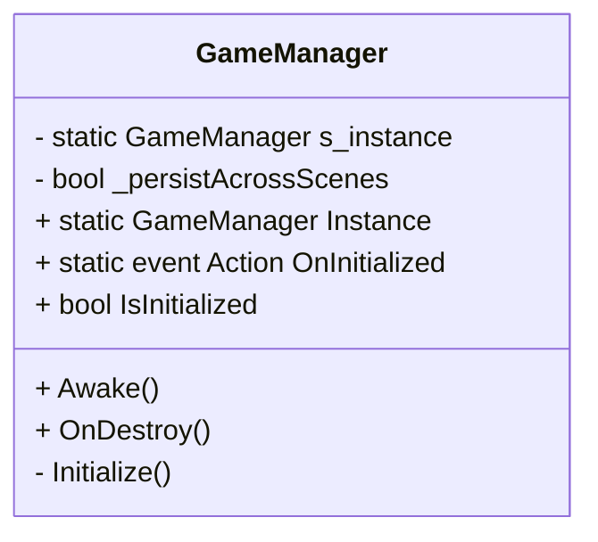
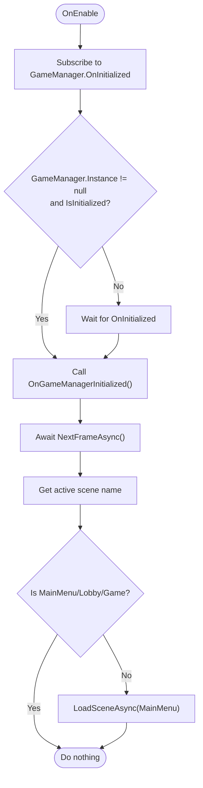
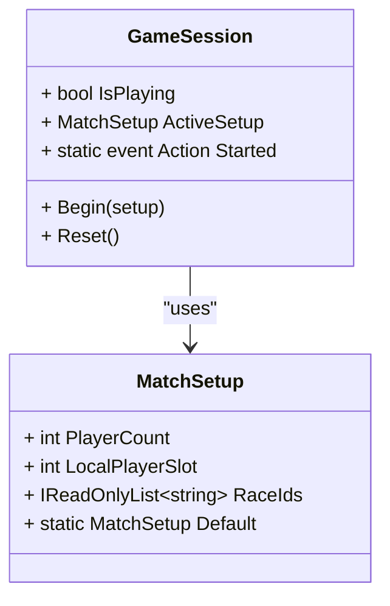
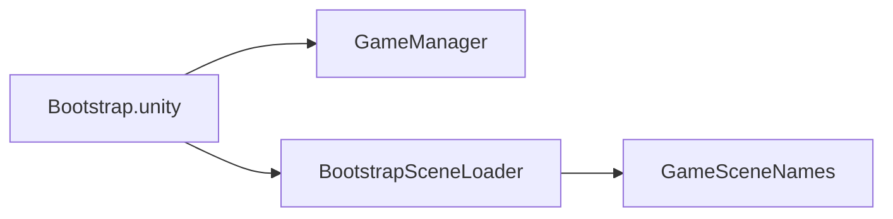
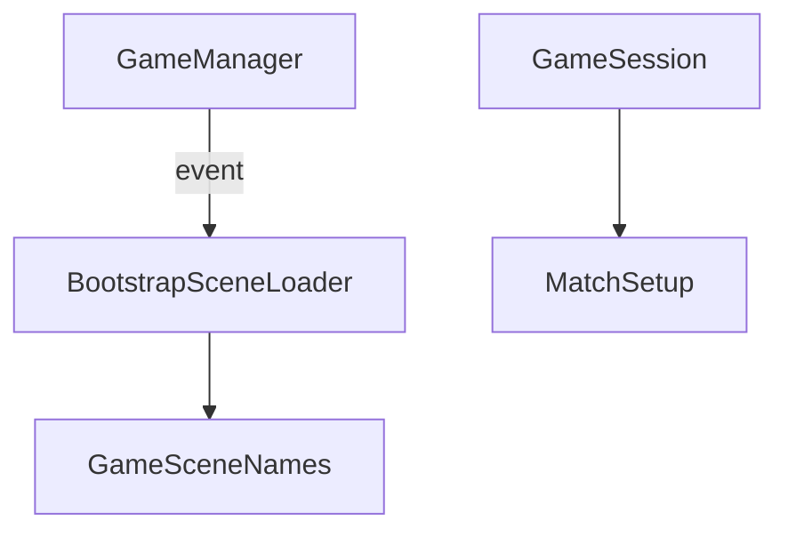

# Core Systems Architecture

<cite>
**Referenced Files in This Document**
- [GameManager.cs](file://Assets/Game/Scripts/Runtime/Core/GameManager.cs)
- [GameSession.cs](file://Assets/Game/Scripts/Runtime/Core/GameSession.cs)
- [BootstrapSceneLoader.cs](file://Assets/Game/Scripts/Runtime/Core/BootstrapSceneLoader.cs)
- [MatchSetup.cs](file://Assets/Game/Scripts/Runtime/Core/MatchSetup.cs)
- [GameSceneNames.cs](file://Assets/Game/Scripts/Runtime/Core/GameSceneNames.cs)
- [Bootstrap.unity](file://Assets/Game/Scenes/Bootstrap.unity)
- [unity-async.mdc](file://Assets/Game/Settings/ProjectBootstrap/Cursor/rules/unity-async.mdc)
</cite>

## Table of Contents
1. [Introduction](#introduction)
2. [Project Structure](#project-structure)
3. [Core Components](#core-components)
4. [Architecture Overview](#architecture-overview)
5. [Detailed Component Analysis](#detailed-component-analysis)
6. [Dependency Analysis](#dependency-analysis)
7. [Performance Considerations](#performance-considerations)
8. [Troubleshooting Guide](#troubleshooting-guide)
9. [Conclusion](#conclusion)
10. [Appendices](#appendices)

## Introduction
This document describes the core systems architecture for BARAKI’s runtime bootstrap and session management. It focuses on:
- Singleton pattern usage in GameManager to provide a global, scene-persistent coordinator
- Event-driven communication via static events (OnInitialized, Started)
- Scene lifecycle management orchestrated by BootstrapSceneLoader
- Interactions between GameManager, GameSession, and BootstrapSceneLoader
- Technical decisions around scene loading, session state, and global service access
- Infrastructure requirements, memory considerations, performance constraints, error handling, logging, debugging support, technology stack choices, and version compatibility

## Project Structure
The core runtime is organized under Game.Core with minimal dependencies on Unity APIs. The Bootstrap scene initializes the singleton and delegates further navigation to the loader.

**Diagram sources**
- [GameManager.cs:1-59](file://Assets/Game/Scripts/Runtime/Core/GameManager.cs#L1-L59)
- [BootstrapSceneLoader.cs:1-40](file://Assets/Game/Scripts/Runtime/Core/BootstrapSceneLoader.cs#L1-L40)
- [GameSession.cs:1-35](file://Assets/Game/Scripts/Runtime/Core/GameSession.cs#L1-L35)
- [MatchSetup.cs:1-29](file://Assets/Game/Scripts/Runtime/Core/MatchSetup.cs#L1-L29)
- [GameSceneNames.cs:1-12](file://Assets/Game/Scripts/Runtime/Core/GameSceneNames.cs#L1-L12)

**Section sources**
- [Bootstrap.unity:196-244](file://Assets/Game/Scenes/Bootstrap.unity#L196-L244)
- [GameManager.cs:1-59](file://Assets/Game/Scripts/Runtime/Core/GameManager.cs#L1-L59)
- [BootstrapSceneLoader.cs:1-40](file://Assets/Game/Scripts/Runtime/Core/BootstrapSceneLoader.cs#L1-L40)

## Core Components
- GameManager: A singleton MonoBehaviour that persists across scenes and signals initialization completion via an event.
- BootstrapSceneLoader: Subscribes to GameManager.OnInitialized and loads the main menu after bootstrap systems are ready.
- GameSession: Static session state holder indicating whether gameplay has started and carrying match setup data.
- MatchSetup: Immutable configuration passed from lobby to match entry points.
- GameSceneNames: Centralized constants for build-order scene names.

Key responsibilities:
- Global coordination and persistence (GameManager)
- Asynchronous scene transitions (BootstrapSceneLoader)
- Session state and handoff data (GameSession, MatchSetup)
- Build-time scene contract (GameSceneNames)

**Section sources**
- [GameManager.cs:1-59](file://Assets/Game/Scripts/Runtime/Core/GameManager.cs#L1-L59)
- [BootstrapSceneLoader.cs:1-40](file://Assets/Game/Scripts/Runtime/Core/BootstrapSceneLoader.cs#L1-L40)
- [GameSession.cs:1-35](file://Assets/Game/Scripts/Runtime/Core/GameSession.cs#L1-L35)
- [MatchSetup.cs:1-29](file://Assets/Game/Scripts/Runtime/Core/MatchSetup.cs#L1-L29)
- [GameSceneNames.cs:1-12](file://Assets/Game/Scripts/Runtime/Core/GameSceneNames.cs#L1-L12)

## Architecture Overview
The bootstrap flow ensures that core services are initialized before any gameplay or UI-heavy scenes load. GameManager acts as the single source of truth for initialization status and provides a stable reference across scenes. BootstrapSceneLoader reacts to initialization and performs safe scene transitions using async utilities.

**Diagram sources**
- [GameManager.cs:21-56](file://Assets/Game/Scripts/Runtime/Core/GameManager.cs#L21-L56)
- [BootstrapSceneLoader.cs:11-37](file://Assets/Game/Scripts/Runtime/Core/BootstrapSceneLoader.cs#L11-L37)
- [GameSceneNames.cs:4-10](file://Assets/Game/Scripts/Runtime/Core/GameSceneNames.cs#L4-L10)
- [Bootstrap.unity:219-244](file://Assets/Game/Scenes/Bootstrap.unity#L219-L244)

## Detailed Component Analysis

### GameManager
- Pattern: Singleton with optional DontDestroyOnLoad persistence.
- Lifecycle:
  - Awake: Ensures single instance, optionally detaches from parent and persists, then initializes.
  - OnDestroy: Clears static instance reference.
  - Initialize: Sets IsInitialized and raises OnInitialized.
- Concurrency: No explicit threading; relies on Unity’s main thread.
- Extensibility: Other systems subscribe to OnInitialized to perform late initialization.

**Diagram sources**
- [GameManager.cs:1-59](file://Assets/Game/Scripts/Runtime/Core/GameManager.cs#L1-L59)

**Section sources**
- [GameManager.cs:11-56](file://Assets/Game/Scripts/Runtime/Core/GameManager.cs#L11-L56)

### BootstrapSceneLoader
- Purpose: Loads MainMenu once GameManager is initialized, avoiding redundant loads if already in a valid scene.
- Flow:
  - OnEnable: Subscribes to GameManager.OnInitialized; handles case where GameManager is already initialized.
  - OnDisable: Unsubscribes to prevent leaks.
  - OnGameManagerInitialized: Waits one frame, checks current scene name against allowed scenes, then loads MainMenu asynchronously.
- Async strategy: Uses Awaitable.NextFrameAsync per project conventions.

**Diagram sources**
- [BootstrapSceneLoader.cs:11-37](file://Assets/Game/Scripts/Runtime/Core/BootstrapSceneLoader.cs#L11-L37)
- [GameSceneNames.cs:4-10](file://Assets/Game/Scripts/Runtime/Core/GameSceneNames.cs#L4-L10)

**Section sources**
- [BootstrapSceneLoader.cs:11-37](file://Assets/Game/Scripts/Runtime/Core/BootstrapSceneLoader.cs#L11-L37)

### GameSession and MatchSetup
- GameSession:
  - Tracks IsPlaying and ActiveSetup.
  - Raises Started when transitioning into gameplay.
  - Provides Begin(setup) and Reset() to control lifecycle.
- MatchSetup:
  - Encapsulates player count, local player slot, and race IDs.
  - Enforces clamping rules for safety.
  - Exposes Default factory.

**Diagram sources**
- [GameSession.cs:8-33](file://Assets/Game/Scripts/Runtime/Core/GameSession.cs#L8-L33)
- [MatchSetup.cs:7-27](file://Assets/Game/Scripts/Runtime/Core/MatchSetup.cs#L7-L27)

**Section sources**
- [GameSession.cs:8-33](file://Assets/Game/Scripts/Runtime/Core/GameSession.cs#L8-L33)
- [MatchSetup.cs:7-27](file://Assets/Game/Scripts/Runtime/Core/MatchSetup.cs#L7-L27)

### Scene Contract and Bootstrap Scene
- GameSceneNames centralizes scene identifiers used by loaders and managers.
- Bootstrap.unity hosts GameManager and BootstrapSceneLoader, wiring them at startup.

**Diagram sources**
- [Bootstrap.unity:219-244](file://Assets/Game/Scenes/Bootstrap.unity#L219-L244)
- [GameSceneNames.cs:4-10](file://Assets/Game/Scripts/Runtime/Core/GameSceneNames.cs#L4-L10)

**Section sources**
- [Bootstrap.unity:219-244](file://Assets/Game/Scenes/Bootstrap.unity#L219-L244)
- [GameSceneNames.cs:4-10](file://Assets/Game/Scripts/Runtime/Core/GameSceneNames.cs#L4-L10)

## Dependency Analysis
- GameManager depends only on UnityEngine and exposes a static event.
- BootstrapSceneLoader depends on UnityEngine.SceneManagement and GameSceneNames.
- GameSession depends on MatchSetup.
- No circular dependencies among these core components.

**Diagram sources**
- [GameManager.cs:17-18](file://Assets/Game/Scripts/Runtime/Core/GameManager.cs#L17-L18)
- [BootstrapSceneLoader.cs:11-18](file://Assets/Game/Scripts/Runtime/Core/BootstrapSceneLoader.cs#L11-L18)
- [GameSceneNames.cs:4-10](file://Assets/Game/Scripts/Runtime/Core/GameSceneNames.cs#L4-L10)
- [GameSession.cs:12-14](file://Assets/Game/Scripts/Runtime/Core/GameSession.cs#L12-L14)
- [MatchSetup.cs:7-27](file://Assets/Game/Scripts/Runtime/Core/MatchSetup.cs#L7-L27)

**Section sources**
- [GameManager.cs:17-18](file://Assets/Game/Scripts/Runtime/Core/GameManager.cs#L17-L18)
- [BootstrapSceneLoader.cs:11-18](file://Assets/Game/Scripts/Runtime/Core/BootstrapSceneLoader.cs#L11-L18)
- [GameSession.cs:12-14](file://Assets/Game/Scripts/Runtime/Core/GameSession.cs#L12-L14)
- [MatchSetup.cs:7-27](file://Assets/Game/Scripts/Runtime/Core/MatchSetup.cs#L7-L27)
- [GameSceneNames.cs:4-10](file://Assets/Game/Scripts/Runtime/Core/GameSceneNames.cs#L4-L10)

## Performance Considerations
- Singleton lifetime:
  - GameManager uses DontDestroyOnLoad when configured, which keeps it alive across scene loads. Ensure objects attached to it are lightweight to avoid unnecessary memory retention.
- Scene loading:
  - BootstrapSceneLoader defers loading until next frame to allow initializers to run and avoids redundant loads by checking the active scene name.
- Async strategy:
  - Use Awaitable in Game.Core bootstrap paths per project conventions; use UniTask in gameplay/UI layers. Avoid Task and bare async void outside Unity messages.
- Memory:
  - Keep persistent objects small; prefer references to ScriptableObjects or Addressables for heavy assets.
  - Clear static references during reset flows (e.g., GameSession.Reset) to avoid retaining large graphs.
- Threading:
  - All core components operate on the main thread; do not invoke Unity APIs off-thread.

[No sources needed since this section provides general guidance]

## Troubleshooting Guide
- Multiple instances of GameManager:
  - Symptom: Duplicate initialization or destroyed instances.
  - Cause: Multiple GameObjects with GameManager in different scenes without proper persistence settings.
  - Resolution: Ensure only one GameManager exists and that _persistAcrossScenes is set appropriately.
- Missing MainMenu load:
  - Symptom: Stuck on Bootstrap scene.
  - Cause: OnInitialized never invoked or scene name mismatch.
  - Resolution: Verify GameManager.Initialize runs and GameSceneNames values match EditorBuildSettings.
- Event leaks:
  - Symptom: Unexpected behavior after scene reloads.
  - Cause: BootstrapSceneLoader not unsubscribing properly.
  - Resolution: Confirm OnDisable removes the handler.
- Session state inconsistencies:
  - Symptom: Gameplay flags not resetting.
  - Resolution: Call GameSession.Reset when leaving gameplay; ensure no lingering references to ActiveSetup.

**Section sources**
- [GameManager.cs:21-56](file://Assets/Game/Scripts/Runtime/Core/GameManager.cs#L21-L56)
- [BootstrapSceneLoader.cs:11-37](file://Assets/Game/Scripts/Runtime/Core/BootstrapSceneLoader.cs#L11-L37)
- [GameSession.cs:16-33](file://Assets/Game/Scripts/Runtime/Core/GameSession.cs#L16-L33)
- [GameSceneNames.cs:4-10](file://Assets/Game/Scripts/Runtime/Core/GameSceneNames.cs#L4-L10)

## Conclusion
BARAKI’s core systems follow a clean separation of concerns:
- GameManager provides a reliable, persistent initialization anchor.
- BootstrapSceneLoader orchestrates safe scene transitions using events and async utilities.
- GameSession encapsulates gameplay state and handoff data via MatchSetup.
This design minimizes coupling, supports testability through static events, and aligns with project conventions for asynchronous operations.

[No sources needed since this section summarizes without analyzing specific files]

## Appendices

### Technology Stack and Version Compatibility
- Unity runtime: Requires SceneManager and standard MonoBehaviours; compatible with modern Unity versions supporting async/await patterns.
- Asynchronous libraries:
  - Game.Core bootstrap uses Awaitable (NextFrameAsync).
  - Gameplay/UI layers should use UniTask per project conventions.
- Scene management:
  - Relies on SceneManager.LoadSceneAsync and scene names defined in GameSceneNames.

**Section sources**
- [unity-async.mdc:1-29](file://Assets/Game/Settings/ProjectBootstrap/Cursor/rules/unity-async.mdc#L1-L29)
- [BootstrapSceneLoader.cs:26-37](file://Assets/Game/Scripts/Runtime/Core/BootstrapSceneLoader.cs#L26-L37)
- [GameSceneNames.cs:4-10](file://Assets/Game/Scripts/Runtime/Core/GameSceneNames.cs#L4-L10)