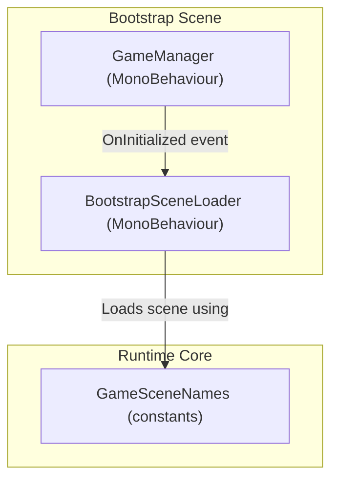
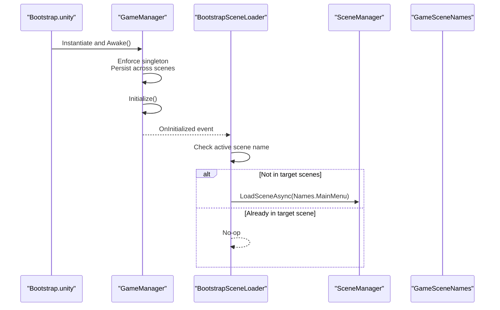
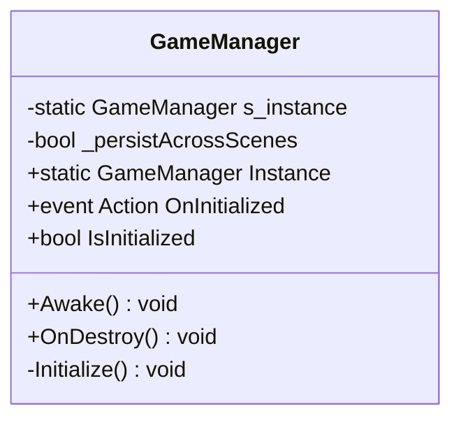
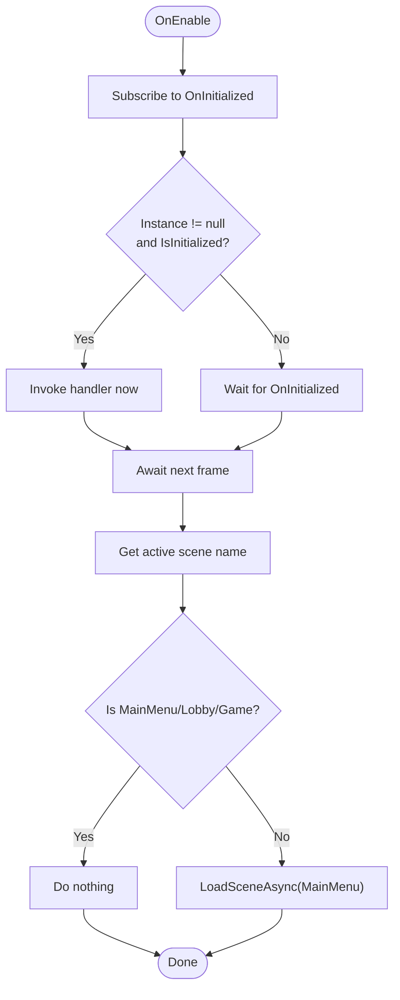
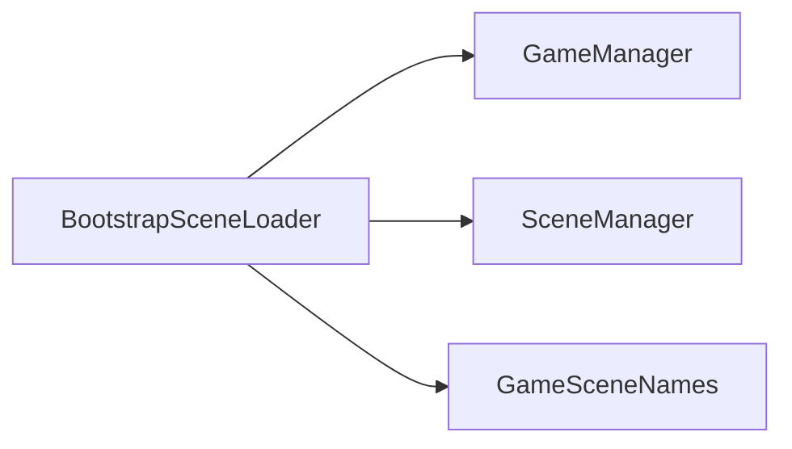

# Game Lifecycle Management

<cite>
**Referenced Files in This Document**
- [GameManager.cs](file://Assets/Game/Scripts/Runtime/Core/GameManager.cs)
- [BootstrapSceneLoader.cs](file://Assets/Game/Scripts/Runtime/Core/BootstrapSceneLoader.cs)
- [GameSceneNames.cs](file://Assets/Game/Scripts/Runtime/Core/GameSceneNames.cs)
- [Bootstrap.unity](file://Assets/Game/Scenes/Bootstrap.unity)
</cite>

## Table of Contents
1. [Introduction](#introduction)
2. [Project Structure](#project-structure)
3. [Core Components](#core-components)
4. [Architecture Overview](#architecture-overview)
5. [Detailed Component Analysis](#detailed-component-analysis)
6. [Dependency Analysis](#dependency-analysis)
7. [Performance Considerations](#performance-considerations)
8. [Troubleshooting Guide](#troubleshooting-guide)
9. [Conclusion](#conclusion)

## Introduction
This document explains BARAKI’s game lifecycle management system with a focus on the GameManager singleton, scene persistence behavior, and the bootstrap sequence from application startup through scene loading. It covers Awake() lifecycle usage, DontDestroyOnLoad behavior, instance management patterns, event subscription via OnInitialized, error handling during initialization, memory considerations, scene transition coordination, cleanup procedures, and troubleshooting for common issues such as duplicate instances or failed initializations.

## Project Structure
The core lifecycle is implemented in the Game.Core namespace and orchestrated by the Bootstrap scene:
- GameManager: Singleton that persists across scenes and signals when initialized.
- BootstrapSceneLoader: Subscribes to GameManager.OnInitialized and transitions to the main menu after systems are ready.
- GameSceneNames: Centralized constants for build-order scene names.
- Bootstrap.unity: Contains the GameManager GameObject with both GameManager and BootstrapSceneLoader components.

**Diagram sources**
- [GameManager.cs:1-59](file://Assets/Game/Scripts/Runtime/Core/GameManager.cs#L1-L59)
- [BootstrapSceneLoader.cs:1-40](file://Assets/Game/Scripts/Runtime/Core/BootstrapSceneLoader.cs#L1-L40)
- [GameSceneNames.cs:1-12](file://Assets/Game/Scripts/Runtime/Core/GameSceneNames.cs#L1-L12)
- [Bootstrap.unity:196-244](file://Assets/Game/Scenes/Bootstrap.unity#L196-L244)

**Section sources**
- [GameManager.cs:1-59](file://Assets/Game/Scripts/Runtime/Core/GameManager.cs#L1-L59)
- [BootstrapSceneLoader.cs:1-40](file://Assets/Game/Scripts/Runtime/Core/BootstrapSceneLoader.cs#L1-L40)
- [GameSceneNames.cs:1-12](file://Assets/Game/Scripts/Runtime/Core/GameSceneNames.cs#L1-L12)
- [Bootstrap.unity:196-244](file://Assets/Game/Scenes/Bootstrap.unity#L196-L244)

## Core Components
- GameManager
  - Provides a static Instance accessor and an OnInitialized event.
  - Ensures a single instance via static field checks in Awake().
  - Persists across scenes when configured.
  - Sets IsInitialized and raises OnInitialized upon completion.
- BootstrapSceneLoader
  - Subscribes to GameManager.OnInitialized in OnEnable.
  - Guards against double-loading by checking current active scene names.
  - Waits one frame before attempting to load the next scene.
  - Loads MainMenu unless already in a target scene.
- GameSceneNames
  - Defines canonical scene names used by the loader.

Key behaviors:
- Singleton enforcement prevents duplicate instances.
- DontDestroyOnLoad ensures cross-scene persistence.
- Event-driven initialization decouples bootstrapping from other systems.

**Section sources**
- [GameManager.cs:1-59](file://Assets/Game/Scripts/Runtime/Core/GameManager.cs#L1-L59)
- [BootstrapSceneLoader.cs:1-40](file://Assets/Game/Scripts/Runtime/Core/BootstrapSceneLoader.cs#L1-L40)
- [GameSceneNames.cs:1-12](file://Assets/Game/Scripts/Runtime/Core/GameSceneNames.cs#L1-L12)

## Architecture Overview
The bootstrap flow starts in the Bootstrap scene, where GameManager initializes and emits OnInitialized. BootstrapSceneLoader reacts to this event and transitions to the main menu if needed.

**Diagram sources**
- [Bootstrap.unity:196-244](file://Assets/Game/Scenes/Bootstrap.unity#L196-L244)
- [GameManager.cs:21-56](file://Assets/Game/Scripts/Runtime/Core/GameManager.cs#L21-L56)
- [BootstrapSceneLoader.cs:11-37](file://Assets/Game/Scripts/Runtime/Core/BootstrapSceneLoader.cs#L11-L37)
- [GameSceneNames.cs:4-10](file://Assets/Game/Scripts/Runtime/Core/GameSceneNames.cs#L4-L10)

## Detailed Component Analysis

### GameManager
Responsibilities:
- Singleton pattern with static instance storage and guard logic.
- Scene persistence via DontDestroyOnLoad when enabled.
- Initialization signaling through OnInitialized and IsInitialized flag.

Lifecycle details:
- Awake():
  - If another instance exists, destroys the duplicate.
  - Otherwise, sets the static instance.
  - Optionally detaches from parent and marks object to persist across scene loads.
  - Calls Initialize().
- OnDestroy():
  - Clears the static instance reference to prevent dangling references.
- Initialize():
  - Marks IsInitialized true and invokes OnInitialized.

Memory and cleanup:
- Static reference is cleared on destruction to avoid leaks.
- Parent detachment avoids unintended transform hierarchies after persistence.

Usage guidance:
- Access via GameManager.Instance.
- Subscribe to OnInitialized to run post-boot logic.
- Check IsInitialized before relying on fully initialized state.

**Diagram sources**
- [GameManager.cs:1-59](file://Assets/Game/Scripts/Runtime/Core/GameManager.cs#L1-L59)

**Section sources**
- [GameManager.cs:1-59](file://Assets/Game/Scripts/Runtime/Core/GameManager.cs#L1-L59)

### BootstrapSceneLoader
Responsibilities:
- React to GameManager initialization.
- Ensure only one scene transition occurs per session.
- Defer scene loading to the next frame to avoid race conditions.

Lifecycle details:
- OnEnable():
  - Subscribes to GameManager.OnInitialized.
  - If GameManager is already initialized, triggers handler immediately.
- OnDisable():
  - Unsubscribes to prevent memory leaks.
- OnGameManagerInitialized():
  - Awaits one frame.
  - Checks the active scene name; skips if already in a target scene.
  - Loads MainMenu asynchronously otherwise.

Error handling and robustness:
- Guarded against multiple loads by checking active scene names.
- Uses async frame wait to ensure stable scene context.

**Diagram sources**
- [BootstrapSceneLoader.cs:11-37](file://Assets/Game/Scripts/Runtime/Core/BootstrapSceneLoader.cs#L11-L37)
- [GameSceneNames.cs:4-10](file://Assets/Game/Scripts/Runtime/Core/GameSceneNames.cs#L4-L10)

**Section sources**
- [BootstrapSceneLoader.cs:1-40](file://Assets/Game/Scripts/Runtime/Core/BootstrapSceneLoader.cs#L1-L40)
- [GameSceneNames.cs:1-12](file://Assets/Game/Scripts/Runtime/Core/GameSceneNames.cs#L1-L12)

### Bootstrap.unity Integration
The Bootstrap scene contains:
- A GameManager GameObject under a “SYSTEMS” root.
- Both GameManager and BootstrapSceneLoader components attached.
- A Main Camera for rendering during bootstrap.

This arrangement ensures:
- Early instantiation of GameManager.
- Immediate availability of OnInitialized for BootstrapSceneLoader.
- Clean separation between bootstrap systems and gameplay content.

**Section sources**
- [Bootstrap.unity:196-244](file://Assets/Game/Scenes/Bootstrap.unity#L196-L244)

## Dependency Analysis
- BootstrapSceneLoader depends on:
  - GameManager (for OnInitialized and Instance).
  - SceneManager (for asynchronous scene loading).
  - GameSceneNames (for canonical scene identifiers).
- GameManager has no runtime dependencies beyond Unity’s MonoBehaviour lifecycle.

**Diagram sources**
- [BootstrapSceneLoader.cs:1-40](file://Assets/Game/Scripts/Runtime/Core/BootstrapSceneLoader.cs#L1-L40)
- [GameManager.cs:1-59](file://Assets/Game/Scripts/Runtime/Core/GameManager.cs#L1-L59)
- [GameSceneNames.cs:1-12](file://Assets/Game/Scripts/Runtime/Core/GameSceneNames.cs#L1-L12)

**Section sources**
- [BootstrapSceneLoader.cs:1-40](file://Assets/Game/Scripts/Runtime/Core/BootstrapSceneLoader.cs#L1-L40)
- [GameManager.cs:1-59](file://Assets/Game/Scripts/Runtime/Core/GameManager.cs#L1-L59)
- [GameSceneNames.cs:1-12](file://Assets/Game/Scripts/Runtime/Core/GameSceneNames.cs#L1-L12)

## Performance Considerations
- Singleton checks and DontDestroyOnLoad are lightweight but should be used judiciously to avoid unnecessary persistence.
- Deferring scene load to the next frame reduces contention with scene setup and improves stability.
- Avoid heavy work in Awake(); use OnInitialized subscribers for deferred initialization.
- Keep the Bootstrap scene minimal to reduce first-frame overhead.

[No sources needed since this section provides general guidance]

## Troubleshooting Guide
Common issues and resolutions:
- Duplicate GameManager instances
  - Symptom: Multiple instances exist or unexpected behavior due to extra copies.
  - Cause: Multiple managers created without proper guards.
  - Resolution: Ensure only one GameManager exists in the build order and rely on its internal duplicate check. Remove any additional instances manually.
- Failed initialization or missing OnInitialized handlers
  - Symptom: Systems never start or UI does not appear.
  - Cause: Handler subscribed too late or GameManager not present.
  - Resolution: Subscribe early (e.g., in OnEnable), and verify GameManager is present in the Bootstrap scene.
- Scene not transitioning to MainMenu
  - Symptom: Stuck on Bootstrap or previous scene.
  - Cause: Active scene already matches target or loader disabled.
  - Resolution: Confirm active scene name and ensure BootstrapSceneLoader is enabled and subscribed.
- Memory leaks or stale references
  - Symptom: Crashes or unexpected nulls after reloads.
  - Cause: Missing unsubscription or lingering static references.
  - Resolution: Always unsubscribe from OnInitialized in OnDisable; confirm OnDestroy clears the static instance.

Operational checks:
- Verify GameManager.IsInitialized before accessing dependent systems.
- Confirm BootstrapSceneLoader uses the correct scene names from GameSceneNames.
- Ensure DontDestroyOnLoad is intended for your use case; disable if you want per-scene isolation.

**Section sources**
- [GameManager.cs:21-56](file://Assets/Game/Scripts/Runtime/Core/GameManager.cs#L21-L56)
- [BootstrapSceneLoader.cs:11-37](file://Assets/Game/Scripts/Runtime/Core/BootstrapSceneLoader.cs#L11-L37)
- [GameSceneNames.cs:4-10](file://Assets/Game/Scripts/Runtime/Core/GameSceneNames.cs#L4-L10)

## Conclusion
BARAKI’s lifecycle management centers on a robust GameManager singleton and an event-driven bootstrap process. The design ensures a single persistent manager, clear initialization signaling, and safe scene transitions. By following the recommended patterns—early subscriptions, guarded initialization, and careful cleanup—you can maintain a stable and scalable game loop across scenes.