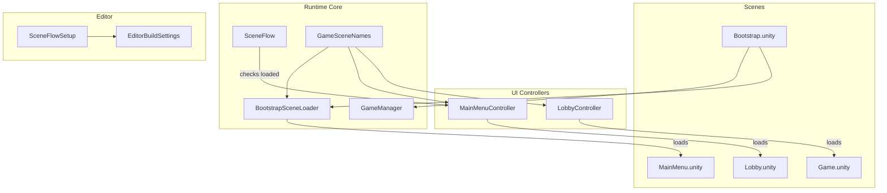
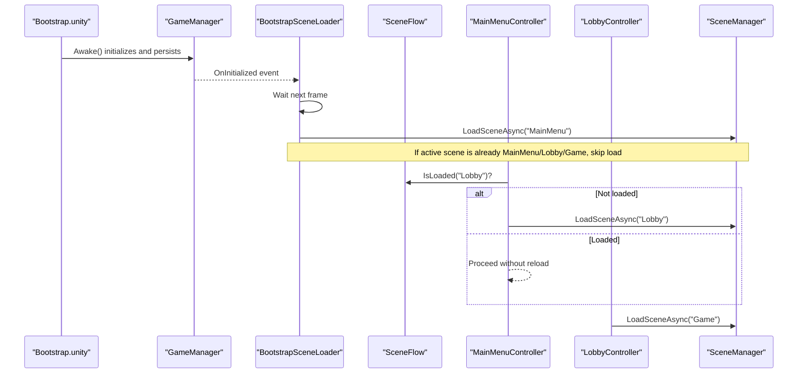
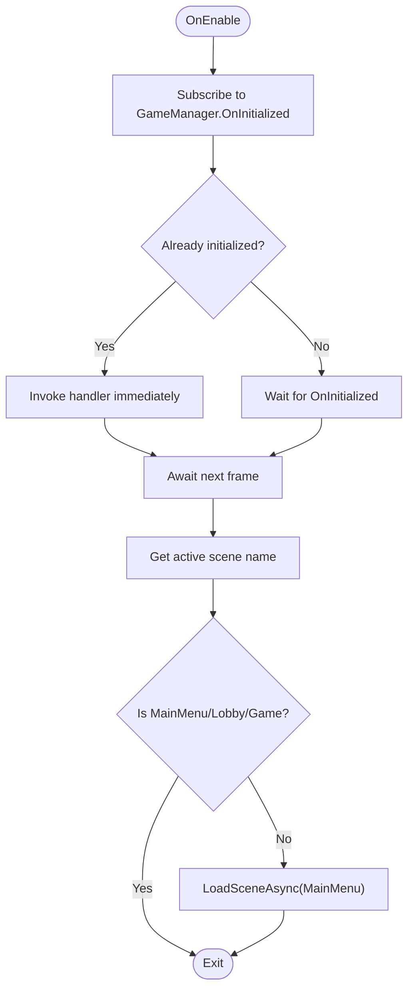
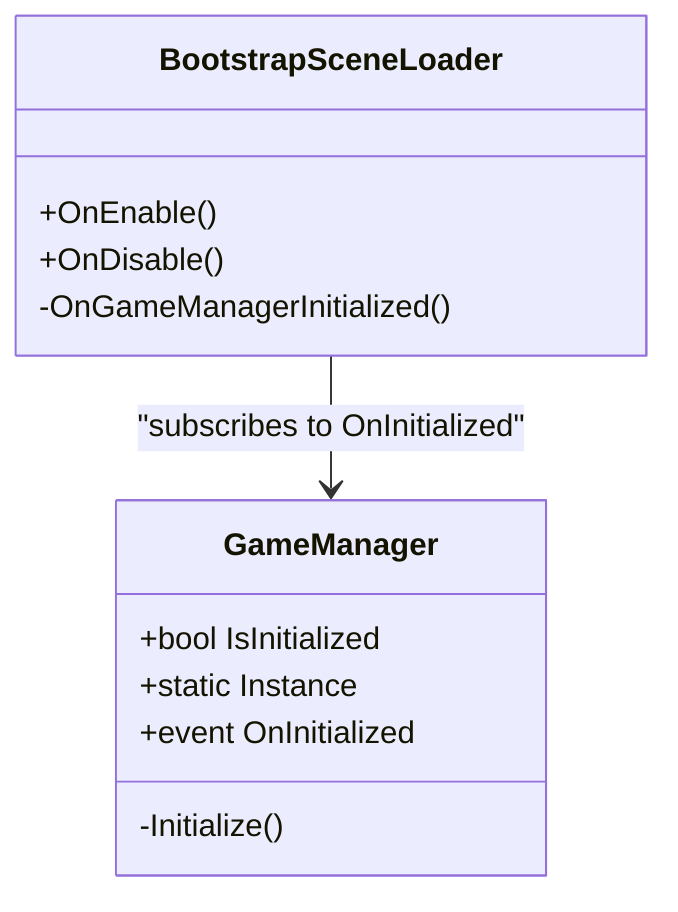
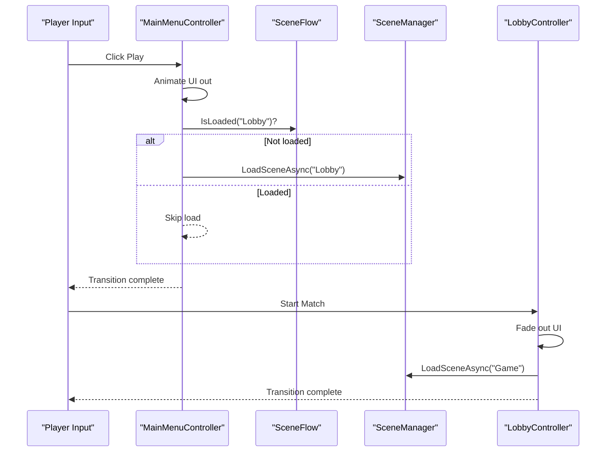
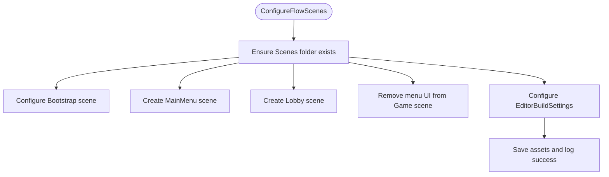
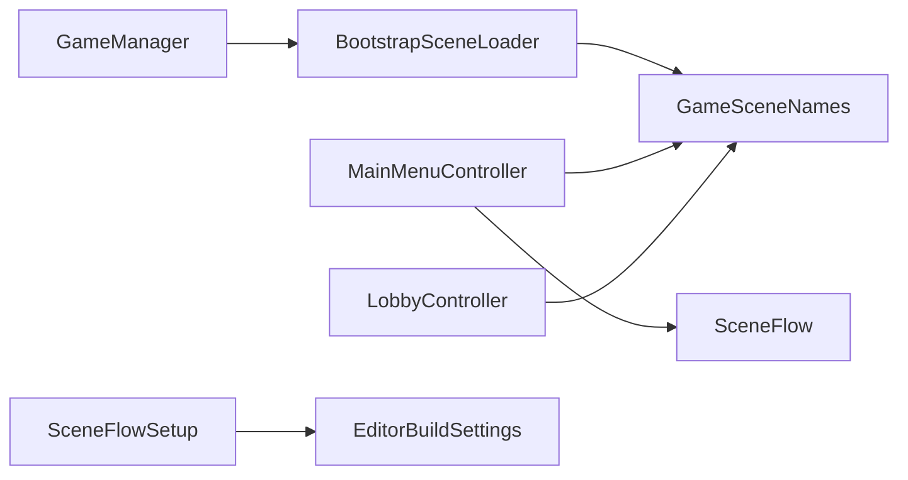

# Scene Flow & Loading System

<cite>
**Referenced Files in This Document**
- [BootstrapSceneLoader.cs](file://Assets/Game/Scripts/Runtime/Core/BootstrapSceneLoader.cs)
- [GameSceneNames.cs](file://Assets/Game/Scripts/Runtime/Core/GameSceneNames.cs)
- [GameManager.cs](file://Assets/Game/Scripts/Runtime/Core/GameManager.cs)
- [SceneFlow.cs](file://Assets/Game/Scripts/Runtime/Core/SceneFlow.cs)
- [LobbyController.cs](file://Assets/Game/UI/Runtime/Controllers/LobbyController.cs)
- [MainMenuController.cs](file://Assets/Game/UI/Runtime/Controllers/MainMenuController.cs)
- [Bootstrap.unity](file://Assets/Game/Scenes/Bootstrap.unity)
- [EditorBuildSettings.asset](file://ProjectSettings/EditorBuildSettings.asset)
- [SceneFlowSetup.cs](file://Assets/Game/Scripts/Editor/SceneFlowSetup.cs)
- [UnityAsyncExtensions.UIToolkit.cs](file://Assets/Game/UI/Runtime/Extensions/UniTask/UnityAsyncExtensions.UIToolkit.cs)
- [unity-async.mdc](file://Assets/Game/Settings/ProjectBootstrap/Cursor/rules/unity-async.mdc)
</cite>

## Table of Contents
1. [Introduction](#introduction)
2. [Project Structure](#project-structure)
3. [Core Components](#core-components)
4. [Architecture Overview](#architecture-overview)
5. [Detailed Component Analysis](#detailed-component-analysis)
6. [Dependency Analysis](#dependency-analysis)
7. [Performance Considerations](#performance-considerations)
8. [Troubleshooting Guide](#troubleshooting-guide)
9. [Conclusion](#conclusion)
10. [Appendices](#appendices)

## Introduction
This document explains BARAKI’s scene flow and loading system with a focus on the BootstrapSceneLoader architecture, scene registration via GameSceneNames, editor tooling for setup and build pipeline integration, and runtime async patterns used across UI controllers. It also provides guidelines for adding new scenes, configuring load orders, preloading strategies, memory management during transitions, progress reporting, and debugging techniques.

## Project Structure
The scene flow is centered around four core scenes: Bootstrap → MainMenu → Lobby → Game. The bootstrap scene initializes persistent systems and then delegates to the main menu. Controllers in UI scenes orchestrate transitions using async patterns and optional fade animations. Editor tooling ensures consistent scene creation, UI wiring, and build order configuration.

**Diagram sources**
- [BootstrapSceneLoader.cs:1-39](file://Assets/Game/Scripts/Runtime/Core/BootstrapSceneLoader.cs#L1-L39)
- [GameManager.cs:1-58](file://Assets/Game/Scripts/Runtime/Core/GameManager.cs#L1-L58)
- [SceneFlow.cs:1-13](file://Assets/Game/Scripts/Runtime/Core/SceneFlow.cs#L1-L13)
- [GameSceneNames.cs:1-12](file://Assets/Game/Scripts/Runtime/Core/GameSceneNames.cs#L1-L12)
- [MainMenuController.cs:400-440](file://Assets/Game/UI/Runtime/Controllers/MainMenuController.cs#L400-L440)
- [LobbyController.cs:86-124](file://Assets/Game/UI/Runtime/Controllers/LobbyController.cs#L86-L124)
- [Bootstrap.unity:198-244](file://Assets/Game/Scenes/Bootstrap.unity#L198-L244)
- [SceneFlowSetup.cs:138-152](file://Assets/Game/Scripts/Editor/SceneFlowSetup.cs#L138-L152)
- [EditorBuildSettings.asset:1-21](file://ProjectSettings/EditorBuildSettings.asset#L1-L21)

**Section sources**
- [BootstrapSceneLoader.cs:1-39](file://Assets/Game/Scripts/Runtime/Core/BootstrapSceneLoader.cs#L1-L39)
- [GameManager.cs:1-58](file://Assets/Game/Scripts/Runtime/Core/GameManager.cs#L1-L58)
- [SceneFlow.cs:1-13](file://Assets/Game/Scripts/Runtime/Core/SceneFlow.cs#L1-L13)
- [GameSceneNames.cs:1-12](file://Assets/Game/Scripts/Runtime/Core/GameSceneNames.cs#L1-L12)
- [MainMenuController.cs:400-440](file://Assets/Game/UI/Runtime/Controllers/MainMenuController.cs#L400-L440)
- [LobbyController.cs:86-124](file://Assets/Game/UI/Runtime/Controllers/LobbyController.cs#L86-L124)
- [Bootstrap.unity:198-244](file://Assets/Game/Scenes/Bootstrap.unity#L198-L244)
- [SceneFlowSetup.cs:138-152](file://Assets/Game/Scripts/Editor/SceneFlowSetup.cs#L138-L152)
- [EditorBuildSettings.asset:1-21](file://ProjectSettings/EditorBuildSettings.asset#L1-L21)

## Core Components
- BootstrapSceneLoader: Subscribes to GameManager initialization and loads the main menu after systems are ready. It avoids redundant loads if already in a target scene.
- GameManager: A persistent singleton that signals when initialization is complete via an event.
- GameSceneNames: Centralized constants for scene names used throughout the codebase and aligned with EditorBuildSettings.
- SceneFlow: Utility to check whether a scene is already loaded.
- UI Controllers (MainMenuController, LobbyController): Orchestrate transitions with optional fade animations and async loading.

Key responsibilities:
- BootstrapSceneLoader coordinates the first transition from Bootstrap to MainMenu.
- GameManager provides a stable initialization signal.
- GameSceneNames centralizes scene identifiers.
- SceneFlow prevents duplicate loads by checking scene state.
- UI Controllers manage user-driven transitions and UI feedback.

**Section sources**
- [BootstrapSceneLoader.cs:1-39](file://Assets/Game/Scripts/Runtime/Core/BootstrapSceneLoader.cs#L1-L39)
- [GameManager.cs:1-58](file://Assets/Game/Scripts/Runtime/Core/GameManager.cs#L1-L58)
- [GameSceneNames.cs:1-12](file://Assets/Game/Scripts/Runtime/Core/GameSceneNames.cs#L1-L12)
- [SceneFlow.cs:1-13](file://Assets/Game/Scripts/Runtime/Core/SceneFlow.cs#L1-L13)
- [MainMenuController.cs:400-440](file://Assets/Game/UI/Runtime/Controllers/MainMenuController.cs#L400-L440)
- [LobbyController.cs:86-124](file://Assets/Game/UI/Runtime/Controllers/LobbyController.cs#L86-L124)

## Architecture Overview
The runtime flow begins in the Bootstrap scene, which contains the GameManager and BootstrapSceneLoader. After GameManager initializes, BootstrapSceneLoader triggers the first scene load to MainMenu. From there, UI controllers handle navigation to Lobby and Game, optionally fading UI and preloading scenes.

**Diagram sources**
- [BootstrapSceneLoader.cs:1-39](file://Assets/Game/Scripts/Runtime/Core/BootstrapSceneLoader.cs#L1-L39)
- [GameManager.cs:1-58](file://Assets/Game/Scripts/Runtime/Core/GameManager.cs#L1-L58)
- [SceneFlow.cs:1-13](file://Assets/Game/Scripts/Runtime/Core/SceneFlow.cs#L1-L13)
- [MainMenuController.cs:400-440](file://Assets/Game/UI/Runtime/Controllers/MainMenuController.cs#L400-L440)
- [LobbyController.cs:86-124](file://Assets/Game/UI/Runtime/Controllers/LobbyController.cs#L86-L124)

## Detailed Component Analysis

### BootstrapSceneLoader
Responsibilities:
- Subscribe/unsubscribe to GameManager.OnInitialized safely.
- Ensure at least one frame passes before attempting to load the next scene.
- Guard against redundant loads if already in a target scene.
- Use centralized scene name constants.

**Diagram sources**
- [BootstrapSceneLoader.cs:1-39](file://Assets/Game/Scripts/Runtime/Core/BootstrapSceneLoader.cs#L1-L39)
- [GameSceneNames.cs:1-12](file://Assets/Game/Scripts/Runtime/Core/GameSceneNames.cs#L1-L12)

**Section sources**
- [BootstrapSceneLoader.cs:1-39](file://Assets/Game/Scripts/Runtime/Core/BootstrapSceneLoader.cs#L1-L39)
- [GameSceneNames.cs:1-12](file://Assets/Game/Scripts/Runtime/Core/GameSceneNames.cs#L1-L12)

### GameManager
Responsibilities:
- Persist across scenes when configured.
- Signal initialization completion via an event.
- Provide a static instance for other components to observe.

**Diagram sources**
- [GameManager.cs:1-58](file://Assets/Game/Scripts/Runtime/Core/GameManager.cs#L1-L58)
- [BootstrapSceneLoader.cs:1-39](file://Assets/Game/Scripts/Runtime/Core/BootstrapSceneLoader.cs#L1-L39)

**Section sources**
- [GameManager.cs:1-58](file://Assets/Game/Scripts/Runtime/Core/GameManager.cs#L1-L58)

### SceneFlow
Responsibilities:
- Provide a simple utility to determine if a scene is already loaded to avoid redundant loads.

Usage example path:
- [MainMenuController.cs:400-440](file://Assets/Game/UI/Runtime/Controllers/MainMenuController.cs#L400-L440)

**Section sources**
- [SceneFlow.cs:1-13](file://Assets/Game/Scripts/Runtime/Core/SceneFlow.cs#L1-L13)
- [MainMenuController.cs:400-440](file://Assets/Game/UI/Runtime/Controllers/MainMenuController.cs#L400-L440)

### GameSceneNames
Responsibilities:
- Centralize scene names used by runtime logic and ensure consistency with EditorBuildSettings.

Integration points:
- Used by BootstrapSceneLoader to decide the target scene.
- Referenced by UI controllers for navigation.

**Section sources**
- [GameSceneNames.cs:1-12](file://Assets/Game/Scripts/Runtime/Core/GameSceneNames.cs#L1-L12)
- [BootstrapSceneLoader.cs:1-39](file://Assets/Game/Scripts/Runtime/Core/BootstrapSceneLoader.cs#L1-L39)
- [EditorBuildSettings.asset:1-21](file://ProjectSettings/EditorBuildSettings.asset#L1-L21)

### UI Controllers (MainMenuController, LobbyController)
Responsibilities:
- Handle user input and trigger scene transitions.
- Optionally animate UI out/in during transitions.
- Preload scenes when not already loaded.
- Use async patterns with cancellation tokens tied to MonoBehaviour lifetime.

**Diagram sources**
- [MainMenuController.cs:400-440](file://Assets/Game/UI/Runtime/Controllers/MainMenuController.cs#L400-L440)
- [LobbyController.cs:86-124](file://Assets/Game/UI/Runtime/Controllers/LobbyController.cs#L86-L124)
- [SceneFlow.cs:1-13](file://Assets/Game/Scripts/Runtime/Core/SceneFlow.cs#L1-L13)

**Section sources**
- [MainMenuController.cs:400-440](file://Assets/Game/UI/Runtime/Controllers/MainMenuController.cs#L400-L440)
- [LobbyController.cs:86-124](file://Assets/Game/UI/Runtime/Controllers/LobbyController.cs#L86-L124)

### Editor Tools: SceneFlowSetup
Responsibilities:
- Create or configure Bootstrap, MainMenu, Lobby scenes.
- Wire UI cameras and controllers.
- Remove extraneous UI from Game scene.
- Configure EditorBuildSettings with the correct scene order.

**Diagram sources**
- [SceneFlowSetup.cs:24-37](file://Assets/Game/Scripts/Editor/SceneFlowSetup.cs#L24-L37)
- [SceneFlowSetup.cs:138-152](file://Assets/Game/Scripts/Editor/SceneFlowSetup.cs#L138-L152)

**Section sources**
- [SceneFlowSetup.cs:24-37](file://Assets/Game/Scripts/Editor/SceneFlowSetup.cs#L24-L37)
- [SceneFlowSetup.cs:138-152](file://Assets/Game/Scripts/Editor/SceneFlowSetup.cs#L138-L152)
- [EditorBuildSettings.asset:1-21](file://ProjectSettings/EditorBuildSettings.asset#L1-L21)

### Async Patterns and Conventions
- Bootstrap/Core uses Awaitable for early bootstrapping tasks.
- Gameplay/UI uses UniTask with proper cancellation via GetCancellationTokenOnDestroy().
- UI Toolkit extensions provide async button/toggle/slider interactions.

References:
- [unity-async.mdc](file://Assets/Game/Settings/ProjectBootstrap/Cursor/rules/unity-async.mdc)
- [UnityAsyncExtensions.UIToolkit.cs:1-45](file://Assets/Game/UI/Runtime/Extensions/UniTask/UnityAsyncExtensions.UIToolkit.cs#L1-L45)

**Section sources**
- [unity-async.mdc:1-29](file://Assets/Game/Settings/ProjectBootstrap/Cursor/rules/unity-async.mdc#L1-L29)
- [UnityAsyncExtensions.UIToolkit.cs:1-45](file://Assets/Game/UI/Runtime/Extensions/UniTask/UnityAsyncExtensions.UIToolkit.cs#L1-L45)

## Dependency Analysis
High-level dependencies among core components:

**Diagram sources**
- [GameManager.cs:1-58](file://Assets/Game/Scripts/Runtime/Core/GameManager.cs#L1-L58)
- [BootstrapSceneLoader.cs:1-39](file://Assets/Game/Scripts/Runtime/Core/BootstrapSceneLoader.cs#L1-L39)
- [GameSceneNames.cs:1-12](file://Assets/Game/Scripts/Runtime/Core/GameSceneNames.cs#L1-L12)
- [SceneFlow.cs:1-13](file://Assets/Game/Scripts/Runtime/Core/SceneFlow.cs#L1-L13)
- [MainMenuController.cs:400-440](file://Assets/Game/UI/Runtime/Controllers/MainMenuController.cs#L400-L440)
- [LobbyController.cs:86-124](file://Assets/Game/UI/Runtime/Controllers/LobbyController.cs#L86-L124)
- [SceneFlowSetup.cs:138-152](file://Assets/Game/Scripts/Editor/SceneFlowSetup.cs#L138-L152)
- [EditorBuildSettings.asset:1-21](file://ProjectSettings/EditorBuildSettings.asset#L1-L21)

**Section sources**
- [GameManager.cs:1-58](file://Assets/Game/Scripts/Runtime/Core/GameManager.cs#L1-L58)
- [BootstrapSceneLoader.cs:1-39](file://Assets/Game/Scripts/Runtime/Core/BootstrapSceneLoader.cs#L1-L39)
- [GameSceneNames.cs:1-12](file://Assets/Game/Scripts/Runtime/Core/GameSceneNames.cs#L1-L12)
- [SceneFlow.cs:1-13](file://Assets/Game/Scripts/Runtime/Core/SceneFlow.cs#L1-L13)
- [MainMenuController.cs:400-440](file://Assets/Game/UI/Runtime/Controllers/MainMenuController.cs#L400-L440)
- [LobbyController.cs:86-124](file://Assets/Game/UI/Runtime/Controllers/LobbyController.cs#L86-L124)
- [SceneFlowSetup.cs:138-152](file://Assets/Game/Scripts/Editor/SceneFlowSetup.cs#L138-L152)
- [EditorBuildSettings.asset:1-21](file://ProjectSettings/EditorBuildSettings.asset#L1-L21)

## Performance Considerations
- Scene preloading:
  - Use SceneFlow.IsLoaded checks before loading to avoid redundant work.
  - Preload non-critical scenes (e.g., Lobby) from MainMenu while the player browses options.
- Memory management during transitions:
  - Unload previous scenes when appropriate to free memory.
  - Avoid holding references to destroyed objects; rely on controller lifetimes and cancellation tokens.
- Progress reporting:
  - For large scenes, consider implementing custom loaders that report progress via events or UI updates.
  - Integrate with Addressables or AssetBundle streaming where applicable.
- Asynchronous conventions:
  - Follow project rules: Awaitable in core bootstrap, UniTask in gameplay/UI.
  - Always pass CancellationToken derived from the host MonoBehaviour to prevent leaks.

[No sources needed since this section provides general guidance]

## Troubleshooting Guide
Common issues and resolutions:
- Duplicate scene loads:
  - Symptom: Multiple loads of the same scene causing stutter or unexpected resets.
  - Fix: Use SceneFlow.IsLoaded to guard loads and ensure only one load per request.
- Missing initialization:
  - Symptom: BootstrapSceneLoader does not trigger or throws null reference.
  - Fix: Verify GameManager is present in Bootstrap scene and persists across scenes.
- Incorrect build order:
  - Symptom: Runtime cannot find scenes or crashes on load.
  - Fix: Run SceneFlowSetup.ConfigureFlowScenes to set EditorBuildSettings correctly.
- UI stuck during transitions:
  - Symptom: Buttons remain disabled or animations do not finish.
  - Fix: Ensure cancellation tokens are passed to all async operations and reset interactivity flags after completion.

**Section sources**
- [SceneFlow.cs:1-13](file://Assets/Game/Scripts/Runtime/Core/SceneFlow.cs#L1-L13)
- [Bootstrap.unity:198-244](file://Assets/Game/Scenes/Bootstrap.unity#L198-L244)
- [SceneFlowSetup.cs:138-152](file://Assets/Game/Scripts/Editor/SceneFlowSetup.cs#L138-L152)
- [MainMenuController.cs:400-440](file://Assets/Game/UI/Runtime/Controllers/MainMenuController.cs#L400-L440)
- [LobbyController.cs:86-124](file://Assets/Game/UI/Runtime/Controllers/LobbyController.cs#L86-L124)

## Conclusion
BARAKI’s scene flow is designed around a minimal bootstrap phase, centralized scene naming, and robust async transitions in UI controllers. The editor tooling enforces consistent scene structure and build order, while utilities like SceneFlow help avoid redundant loads. Following the provided guidelines will keep transitions smooth, memory usage controlled, and development workflows efficient.

[No sources needed since this section summarizes without analyzing specific files]

## Appendices

### Adding a New Scene
Steps:
- Add a new .unity file under Assets/Game/Scenes.
- Update GameSceneNames with the new constant.
- Update EditorBuildSettings via SceneFlowSetup.ConfigureFlowScenes or manually add the entry.
- Wire any required systems (e.g., camera group, UI controllers).
- Reference the new constant in controllers for navigation.

**Section sources**
- [GameSceneNames.cs:1-12](file://Assets/Game/Scripts/Runtime/Core/GameSceneNames.cs#L1-L12)
- [SceneFlowSetup.cs:138-152](file://Assets/Game/Scripts/Editor/SceneFlowSetup.cs#L138-L152)
- [EditorBuildSettings.asset:1-21](file://ProjectSettings/EditorBuildSettings.asset#L1-L21)

### Configuring Load Orders
- Ensure EditorBuildSettings lists scenes in the intended execution order.
- Use SceneFlowSetup.ConfigureFlowScenes to enforce canonical ordering.
- Validate with tests that assert the expected sequence.

**Section sources**
- [SceneFlowSetup.cs:138-152](file://Assets/Game/Scripts/Editor/SceneFlowSetup.cs#L138-L152)
- [EditorBuildSettings.asset:1-21](file://ProjectSettings/EditorBuildSettings.asset#L1-L21)

### Custom Scene Loader Example Pattern
Pattern outline:
- Implement a loader component that subscribes to a start event.
- Use awaitable/UniTask to sequence preloading steps.
- Report progress via callbacks or UI updates.
- Trigger SceneManager.LoadSceneAsync once dependencies are satisfied.

Guidance references:
- [unity-async.mdc:1-29](file://Assets/Game/Settings/ProjectBootstrap/Cursor/rules/unity-async.mdc#L1-L29)
- [UnityAsyncExtensions.UIToolkit.cs:1-45](file://Assets/Game/UI/Runtime/Extensions/UniTask/UnityAsyncExtensions.UIToolkit.cs#L1-L45)

**Section sources**
- [unity-async.mdc:1-29](file://Assets/Game/Settings/ProjectBootstrap/Cursor/rules/unity-async.mdc#L1-L29)
- [UnityAsyncExtensions.UIToolkit.cs:1-45](file://Assets/Game/UI/Runtime/Extensions/UniTask/UnityAsyncExtensions.UIToolkit.cs#L1-L45)