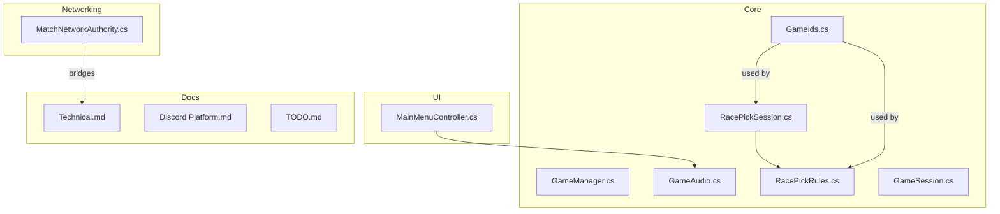
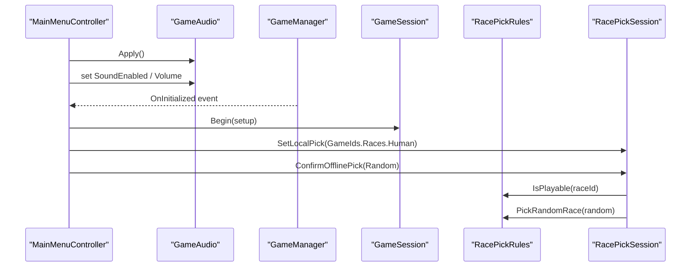
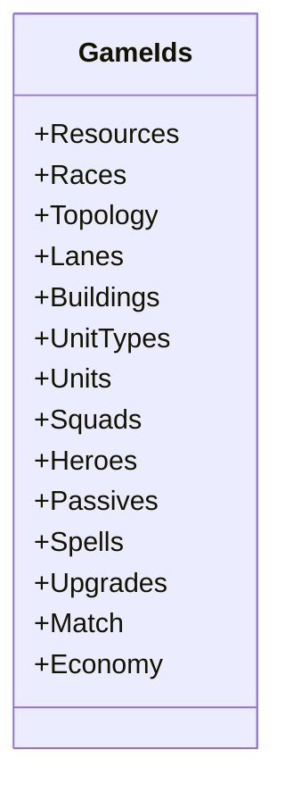
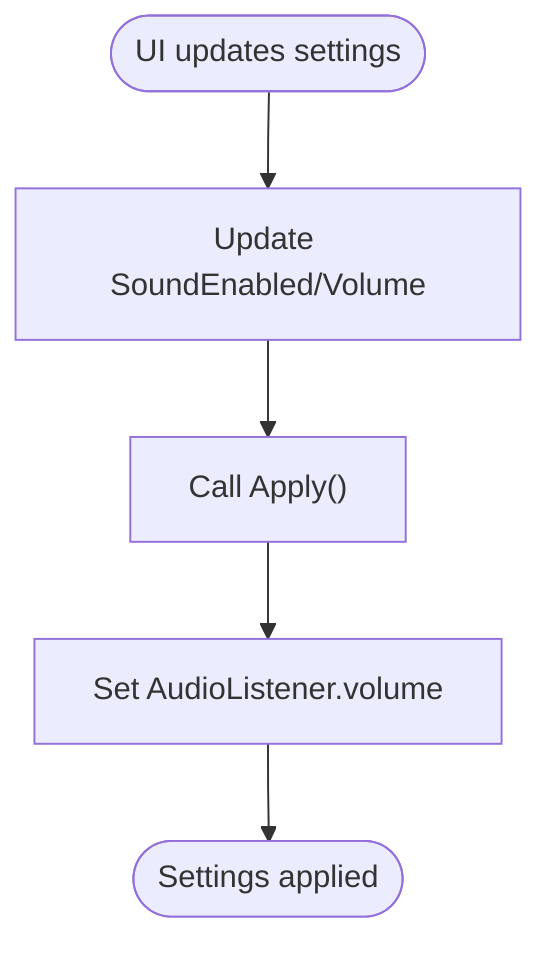
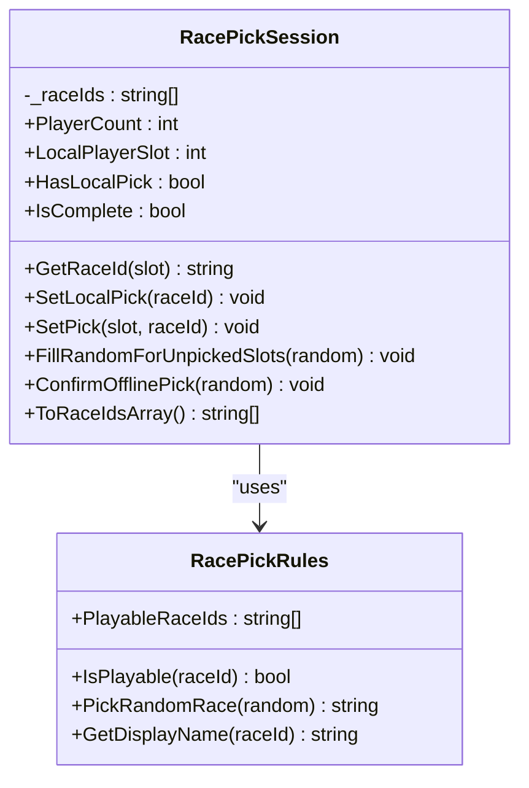
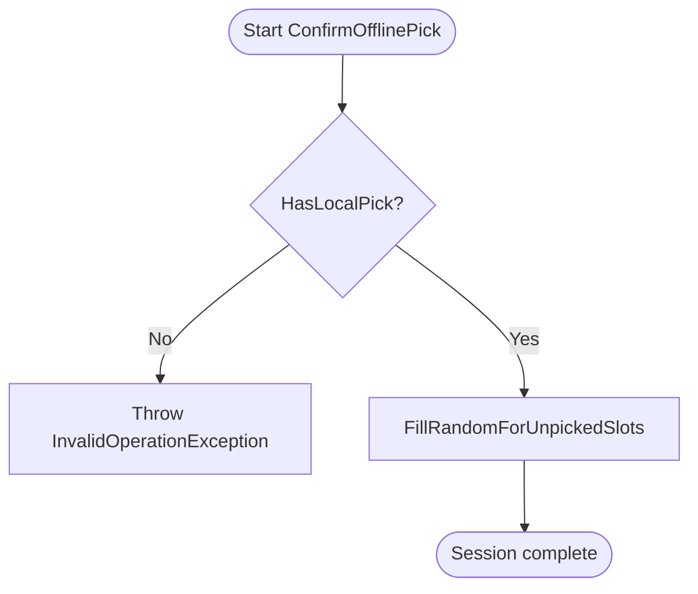
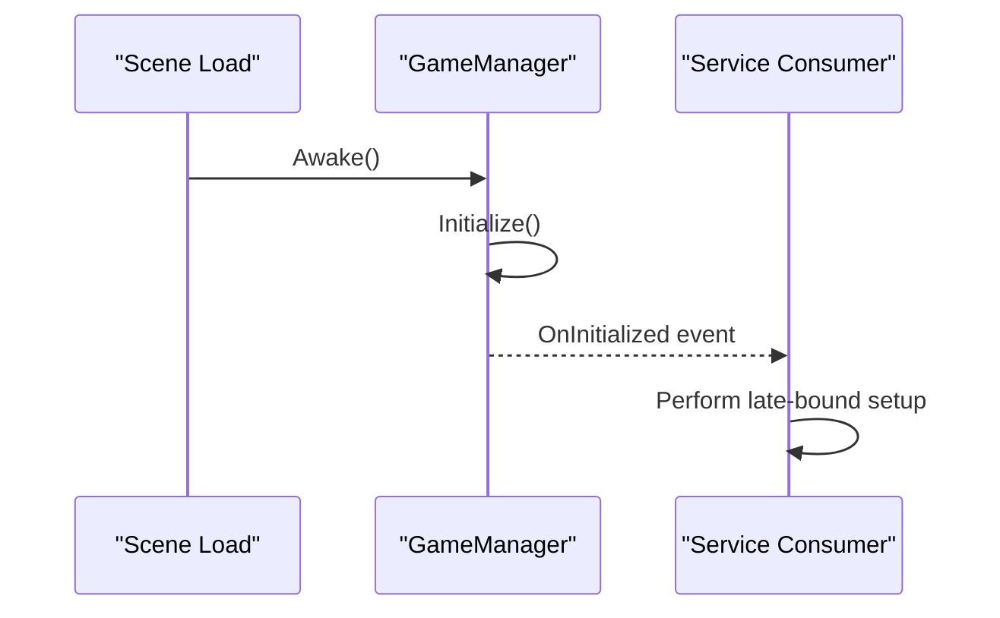
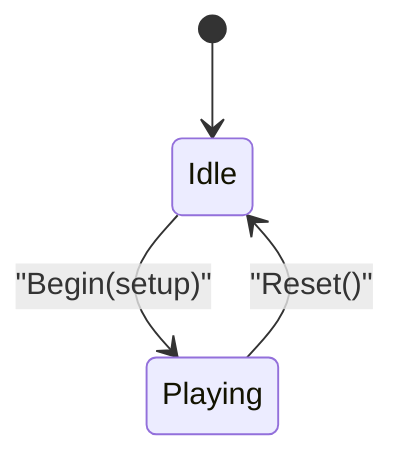
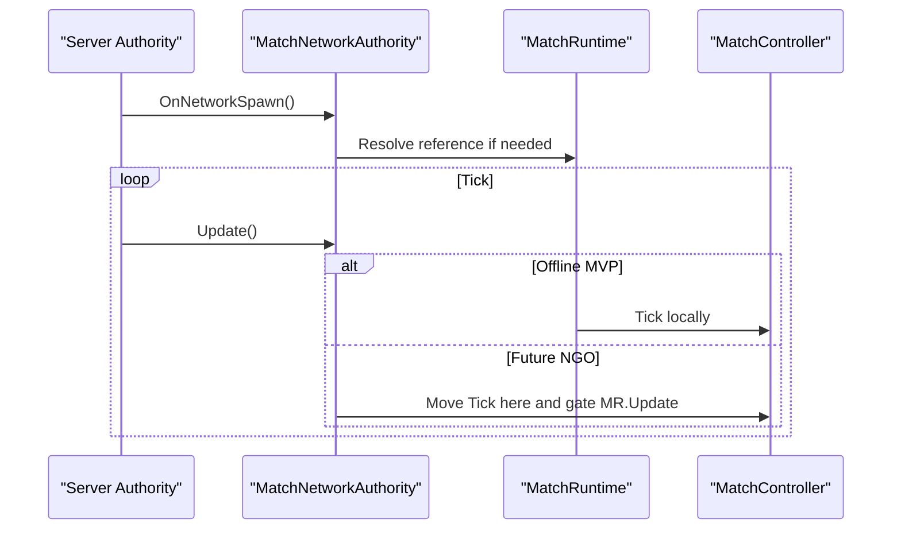
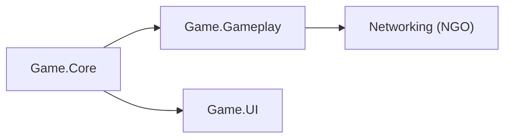

# Service Architecture & Dependency Management

<cite>
**Referenced Files in This Document**
- [GameIds.cs](file://Assets/Game/Scripts/Runtime/Core/GameIds.cs)
- [GameManager.cs](file://Assets/Game/Scripts/Runtime/Core/GameManager.cs)
- [GameAudio.cs](file://Assets/Game/Scripts/Runtime/Core/GameAudio.cs)
- [RacePickRules.cs](file://Assets/Game/Scripts/Runtime/Core/RacePickRules.cs)
- [RacePickSession.cs](file://Assets/Game/Scripts/Runtime/Core/RacePickSession.cs)
- [GameSession.cs](file://Assets/Game/Scripts/Runtime/Core/GameSession.cs)
- [MatchNetworkAuthority.cs](file://Assets/Game/Scripts/Runtime/Gameplay/Networking/MatchNetworkAuthority.cs)
- [MainMenuController.cs](file://Assets/Game/UI/Runtime/Controllers/MainMenuController.cs)
- [Game.Core.asmdef](file://Assets/Game/Scripts/Runtime/Core/Game.Core.asmdef)
- [unity-core.mdc](file://Assets/Game/Settings/ProjectBootstrap/Cursor/rules/unity-core.mdc)
- [agent-guidelines.mdc](file://Assets/Game/Settings/ProjectBootstrap/Cursor/rules/agent-guidelines.mdc)
- [Technical.md](file://Assets/Game/GameDesign/Technical.md)
- [Discord Platform.md](file://Assets/Game/GameDesign/Discord Platform.md)
- [TODO.md](file://Assets/Game/GameDesign/TODO.md)
- [GameIdsTests.cs](file://Assets/Game/Scripts/Tests/GameIdsTests.cs)
- [RacePickSessionTests.cs](file://Assets/Game/Scripts/Tests/RacePickSessionTests.cs)
</cite>

## Table of Contents
1. Introduction
2. Project Structure
3. Core Components
4. Architecture Overview
5. Detailed Component Analysis
6. Dependency Analysis
7. Performance Considerations
8. Troubleshooting Guide
9. Conclusion

## Introduction
This document explains BARAKI’s service architecture and dependency management patterns with a focus on:
- Global service access via stable identifiers (GameIds) for consistent identification across systems
- Centralized audio preferences through GameAudio
- Rule-based services exemplified by RacePickRules and RacePickSession
- Patterns for creating custom services, dependency injection, lifecycle management, discovery, version compatibility, testing strategies, and design principles to avoid tight coupling

The goal is to provide both high-level architectural guidance and code-level details that are accessible to readers with limited technical background.

## Project Structure
BARAKI organizes core runtime logic under the Game.Core assembly boundary, which includes session state, global services, and rule definitions. Gameplay-specific systems live under separate assemblies (e.g., Game.Gameplay), while UI controllers reside under Game.UI. The project follows clear namespace-to-folder mapping and uses ScriptableObjects for data-driven configuration.

**Diagram sources**
- [GameIds.cs:1-165](file://Assets/Game/Scripts/Runtime/Core/GameIds.cs#L1-L165)
- [GameManager.cs:1-59](file://Assets/Game/Scripts/Runtime/Core/GameManager.cs#L1-L59)
- [GameAudio.cs:1-17](file://Assets/Game/Scripts/Runtime/Core/GameAudio.cs#L1-L17)
- [RacePickRules.cs:1-44](file://Assets/Game/Scripts/Runtime/Core/RacePickRules.cs#L1-L44)
- [RacePickSession.cs:1-124](file://Assets/Game/Scripts/Runtime/Core/RacePickSession.cs#L1-L124)
- [GameSession.cs:1-34](file://Assets/Game/Scripts/Runtime/Core/GameSession.cs#L1-L34)
- [MainMenuController.cs:73-110](file://Assets/Game/UI/Runtime/Controllers/MainMenuController.cs#L73-L110)
- [MatchNetworkAuthority.cs:1-34](file://Assets/Game/Scripts/Runtime/Gameplay/Networking/MatchNetworkAuthority.cs#L1-L34)
- [Technical.md:38-79](file://Assets/Game/GameDesign/Technical.md#L38-L79)
- [Discord Platform.md:1-52](file://Assets/Game/GameDesign/Discord Platform.md#L1-L52)
- [TODO.md:42-66](file://Assets/Game/GameDesign/TODO.md#L42-L66)

**Section sources**
- [Game.Core.asmdef:1-14](file://Assets/Game/Scripts/Runtime/Core/Game.Core.asmdef#L1-L14)
- [unity-core.mdc:37-55](file://Assets/Game/Settings/ProjectBootstrap/Cursor/rules/unity-core.mdc#L37-L55)
- [Technical.md:57-64](file://Assets/Game/GameDesign/Technical.md#L57-L64)

## Core Components
- GameIds: Central registry of stable string identifiers used across gameplay, UI, and networking to avoid magic strings and ensure consistency.
- GameManager: Singleton-like MonoBehaviour coordinating initialization and persistence across scenes; exposes an OnInitialized event for late-binding consumers.
- GameAudio: Static service exposing sound enablement and volume settings applied globally to Unity’s AudioListener.
- RacePickRules: Pure rules defining playable races, validation, random selection, and display names.
- RacePickSession: Pre-match race selection state machine enforcing constraints and filling unpicked slots offline.
- GameSession: High-level game state signaling when play begins and holding active match setup.
- MatchNetworkAuthority: Networking bridge scaffolding for server-side authority over match simulation.

These components form the foundation for service-oriented design: small, focused, and loosely coupled via interfaces or events rather than direct references.

**Section sources**
- [GameIds.cs:1-165](file://Assets/Game/Scripts/Runtime/Core/GameIds.cs#L1-L165)
- [GameManager.cs:1-59](file://Assets/Game/Scripts/Runtime/Core/GameManager.cs#L1-L59)
- [GameAudio.cs:1-17](file://Assets/Game/Scripts/Runtime/Core/GameAudio.cs#L1-L17)
- [RacePickRules.cs:1-44](file://Assets/Game/Scripts/Runtime/Core/RacePickRules.cs#L1-L44)
- [RacePickSession.cs:1-124](file://Assets/Game/Scripts/Runtime/Core/RacePickSession.cs#L1-L124)
- [GameSession.cs:1-34](file://Assets/Game/Scripts/Runtime/Core/GameSession.cs#L1-L34)
- [MatchNetworkAuthority.cs:1-34](file://Assets/Game/Scripts/Runtime/Gameplay/Networking/MatchNetworkAuthority.cs#L1-L34)

## Architecture Overview
At runtime, services are accessed either directly (for lightweight statics like GameAudio) or via a central coordinator (GameManager). UI controllers bind to these services to reflect user preferences. Rule-based services encapsulate domain logic (e.g., race pick rules) and are consumed by stateful sessions (RacePickSession). Networking bridges integrate with the authoritative server model described in design docs.

**Diagram sources**
- [MainMenuController.cs:73-110](file://Assets/Game/UI/Runtime/Controllers/MainMenuController.cs#L73-L110)
- [GameAudio.cs:1-17](file://Assets/Game/Scripts/Runtime/Core/GameAudio.cs#L1-L17)
- [GameManager.cs:1-59](file://Assets/Game/Scripts/Runtime/Core/GameManager.cs#L1-L59)
- [GameSession.cs:1-34](file://Assets/Game/Scripts/Runtime/Core/GameSession.cs#L1-L34)
- [RacePickRules.cs:1-44](file://Assets/Game/Scripts/Runtime/Core/RacePickRules.cs#L1-L44)
- [RacePickSession.cs:1-124](file://Assets/Game/Scripts/Runtime/Core/RacePickSession.cs#L1-L124)

## Detailed Component Analysis

### Global Identifier Model via GameIds
GameIds provides a single source of truth for all stable identifiers used throughout the game. It groups IDs by category (Races, Buildings, Units, Spells, Upgrades, etc.) and is referenced by tests to enforce uniqueness and alignment with documentation.

Key responsibilities:
- Provide compile-time constants for IDs
- Ensure consistency between code and design documents
- Support deterministic behavior in tests and simulations

**Diagram sources**
- [GameIds.cs:1-165](file://Assets/Game/Scripts/Runtime/Core/GameIds.cs#L1-L165)

**Section sources**
- [GameIdsTests.cs:1-55](file://Assets/Game/Scripts/Tests/GameIdsTests.cs#L1-L55)
- [TODO.md:42-66](file://Assets/Game/GameDesign/TODO.md#L42-L66)

### Centralized Audio Preferences: GameAudio
GameAudio exposes global sound settings and applies them to Unity’s AudioListener. UI controllers read/write these values and call Apply to propagate changes immediately.

Responsibilities:
- Maintain SoundEnabled and Volume
- Apply current settings to AudioListener
- Provide a simple API for UI binding

**Diagram sources**
- [GameAudio.cs:1-17](file://Assets/Game/Scripts/Runtime/Core/GameAudio.cs#L1-L17)
- [MainMenuController.cs:73-110](file://Assets/Game/UI/Runtime/Controllers/MainMenuController.cs#L73-L110)

**Section sources**
- [GameAudio.cs:1-17](file://Assets/Game/Scripts/Runtime/Core/GameAudio.cs#L1-L17)
- [MainMenuController.cs:73-110](file://Assets/Game/UI/Runtime/Controllers/MainMenuController.cs#L73-L110)

### Rule-Based Services: RacePickRules and RacePickSession
RacePickRules defines the set of playable races, validates selections, picks random races, and maps IDs to display names. RacePickSession manages pre-match race selection state, enforces constraints, and fills unpicked slots offline using rules.

**Diagram sources**
- [RacePickRules.cs:1-44](file://Assets/Game/Scripts/Runtime/Core/RacePickRules.cs#L1-L44)
- [RacePickSession.cs:1-124](file://Assets/Game/Scripts/Runtime/Core/RacePickSession.cs#L1-L124)

**Diagram sources**
- [RacePickSession.cs:102-110](file://Assets/Game/Scripts/Runtime/Core/RacePickSession.cs#L102-L110)
- [RacePickRules.cs:26-35](file://Assets/Game/Scripts/Runtime/Core/RacePickRules.cs#L26-L35)

**Section sources**
- [RacePickRules.cs:1-44](file://Assets/Game/Scripts/Runtime/Core/RacePickRules.cs#L1-L44)
- [RacePickSession.cs:1-124](file://Assets/Game/Scripts/Runtime/Core/RacePickSession.cs#L1-L124)
- [RacePickSessionTests.cs:1-52](file://Assets/Game/Scripts/Tests/RacePickSessionTests.cs#L1-L52)

### Lifecycle Coordinator: GameManager
GameManager persists across scenes and signals initialization via an event. Consumers can subscribe to OnInitialized to perform late-bound setup without tight coupling to scene loading order.

**Diagram sources**
- [GameManager.cs:21-56](file://Assets/Game/Scripts/Runtime/Core/GameManager.cs#L21-L56)

**Section sources**
- [GameManager.cs:1-59](file://Assets/Game/Scripts/Runtime/Core/GameManager.cs#L1-L59)

### Game State: GameSession
GameSession tracks whether the player has entered gameplay and holds the active match setup. It raises a Started event when play begins.

**Diagram sources**
- [GameSession.cs:16-32](file://Assets/Game/Scripts/Runtime/Core/GameSession.cs#L16-L32)

**Section sources**
- [GameSession.cs:1-34](file://Assets/Game/Scripts/Runtime/Core/GameSession.cs#L1-L34)

### Networking Bridge: MatchNetworkAuthority
MatchNetworkAuthority is a scaffold bridging NGO (Netcode for GameObjects) with the pure C# match simulation. It ensures server-only ticking and coordinates with MatchRuntime during development and future production builds.

**Diagram sources**
- [MatchNetworkAuthority.cs:15-32](file://Assets/Game/Scripts/Runtime/Gameplay/Networking/MatchNetworkAuthority.cs#L15-L32)
- [Technical.md:38-79](file://Assets/Game/GameDesign/Technical.md#L38-L79)

**Section sources**
- [MatchNetworkAuthority.cs:1-34](file://Assets/Game/Scripts/Runtime/Gameplay/Networking/MatchNetworkAuthority.cs#L1-L34)
- [Technical.md:38-79](file://Assets/Game/GameDesign/Technical.md#L38-L79)

## Dependency Analysis
Assembly boundaries and dependencies:
- Game.Core contains foundational services and rules
- Game.Gameplay depends on Game.Core for IDs and rules
- Game.UI consumes Game.Core services (e.g., GameAudio)
- Networking integrates with Game.Gameplay and Game.Core

**Diagram sources**
- [Game.Core.asmdef:1-14](file://Assets/Game/Scripts/Runtime/Core/Game.Core.asmdef#L1-L14)
- [Technical.md:57-64](file://Assets/Game/GameDesign/Technical.md#L57-L64)

**Section sources**
- [Game.Core.asmdef:1-14](file://Assets/Game/Scripts/Runtime/Core/Game.Core.asmdef#L1-L14)
- [Technical.md:57-64](file://Assets/Game/GameDesign/Technical.md#L57-L64)

## Performance Considerations
- Cache components at startup; avoid Find* and GetComponent in hot paths
- Use ObjectPool<T> for frequent spawn/destroy operations
- Keep physics updates in FixedUpdate and input handling in Update
- Avoid Resources.Load for new content; prefer addressables or preloaded assets
- Prefer immutable configuration where possible to reduce allocations

[No sources needed since this section provides general guidance]

## Troubleshooting Guide
Common issues and resolutions:
- Duplicate or empty GameIds: Run GameIdsTests to detect duplicates and validate non-empty strings
- Race pick errors: Ensure local player picks before confirming offline; verify IsPlayable checks pass
- Audio not applying: Verify GameAudio.Apply is called after changing SoundEnabled or Volume
- Initialization ordering: Subscribe to GameManager.OnInitialized to avoid accessing uninitialized services

**Section sources**
- [GameIdsTests.cs:1-55](file://Assets/Game/Scripts/Tests/GameIdsTests.cs#L1-L55)
- [RacePickSessionTests.cs:1-52](file://Assets/Game/Scripts/Tests/RacePickSessionTests.cs#L1-L52)
- [GameManager.cs:52-56](file://Assets/Game/Scripts/Runtime/Core/GameManager.cs#L52-L56)
- [GameAudio.cs:12-15](file://Assets/Game/Scripts/Runtime/Core/GameAudio.cs#L12-L15)

## Conclusion
BARAKI’s service architecture emphasizes:
- Stable identifiers via GameIds to decouple systems and improve testability
- Small, focused services (GameAudio, RacePickRules) with clear contracts
- Event-driven initialization (GameManager.OnInitialized) to avoid tight coupling
- Rule-based logic separated from stateful sessions (RacePickSession)
- Clear assembly boundaries and documented integration points for networking

Adopting these patterns supports maintainability, scalability, and robust testing across the project.