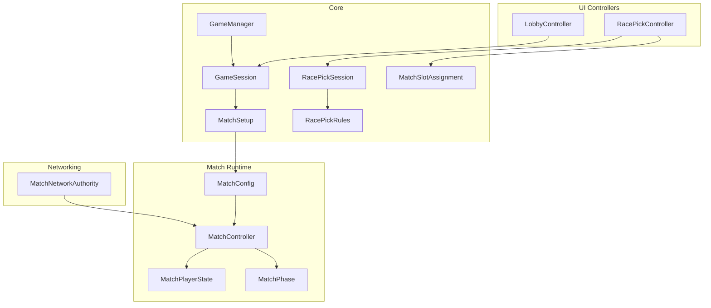
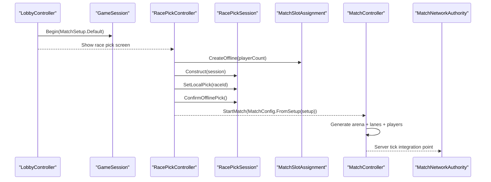
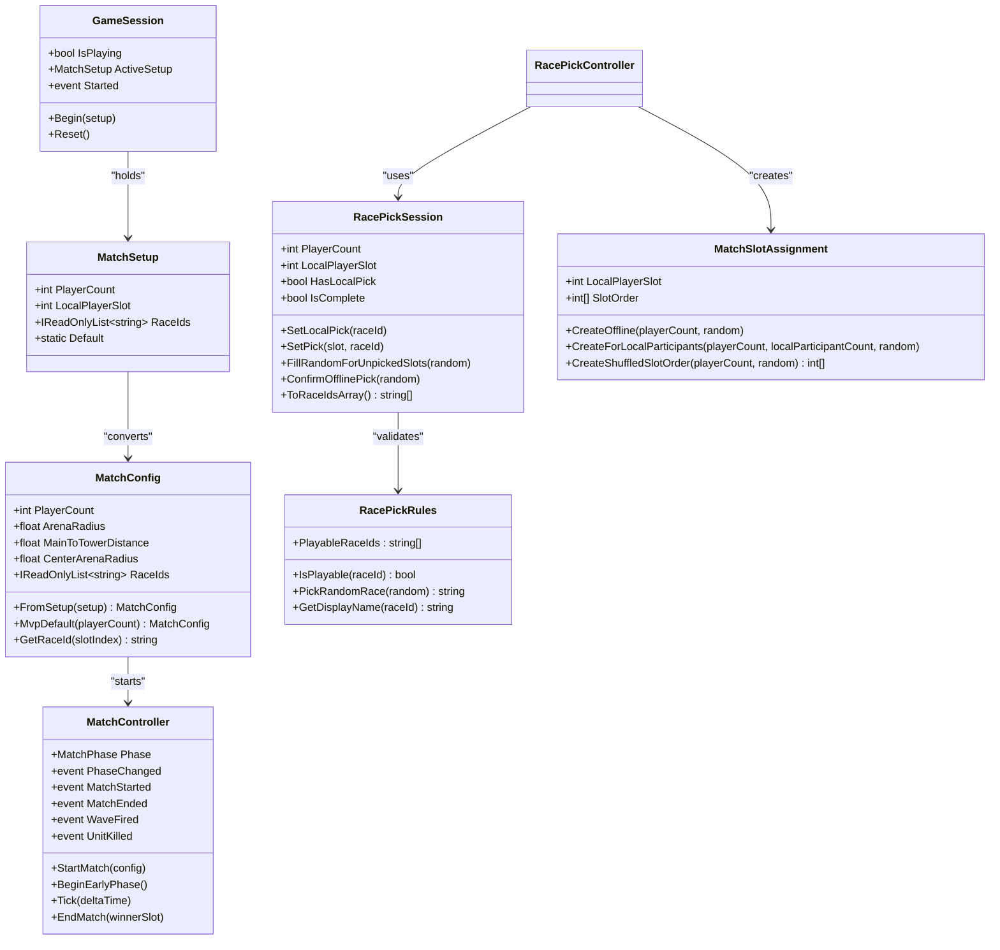

# Session State Management

<cite>
**Referenced Files in This Document**
- [GameSession.cs](file://Assets/Game/Scripts/Runtime/Core/GameSession.cs)
- [MatchSetup.cs](file://Assets/Game/Scripts/Runtime/Core/MatchSetup.cs)
- [RacePickSession.cs](file://Assets/Game/Scripts/Runtime/Core/RacePickSession.cs)
- [RacePickRules.cs](file://Assets/Game/Scripts/Runtime/Core/RacePickRules.cs)
- [MatchSlotAssignment.cs](file://Assets/Game/Scripts/Runtime/Core/MatchSlotAssignment.cs)
- [GameManager.cs](file://Assets/Game/Scripts/Runtime/Core/GameManager.cs)
- [LobbyController.cs](file://Assets/Game/UI/Controllers/LobbyController.cs)
- [RacePickController.cs](file://Assets/Game/UI/Controllers/RacePickController.cs)
- [MatchConfig.cs](file://Assets/Game/Scripts/Runtime/Gameplay/Match/MatchConfig.cs)
- [MatchController.cs](file://Assets/Game/Scripts/Runtime/Gameplay/Match/MatchController.cs)
- [MatchPlayerState.cs](file://Assets/Game/Scripts/Runtime/Gameplay/Match/MatchPlayerState.cs)
- [MatchPhase.cs](file://Assets/Game/Scripts/Runtime/Gameplay/Match/MatchPhase.cs)
- [MatchNetworkAuthority.cs](file://Assets/Game/Scripts/Runtime/Gameplay/Networking/MatchNetworkAuthority.cs)
- [Technical.md](file://Assets/Game/GameDesign/Technical.md)
- [Match Flow.md](file://Assets/Game/GameDesign/Match%20Flow.md)
</cite>

## Table of Contents
1. Introduction
2. Project Structure
3. Core Components
4. Architecture Overview
5. Detailed Component Analysis
6. Dependency Analysis
7. Performance Considerations
8. Troubleshooting Guide
9. Conclusion

## Introduction
This document explains BARAKI’s session state management system with a focus on how matches are configured, how race selection is coordinated, and how the game transitions from lobby to active gameplay. It covers:
- GameSession as the global runtime flag and handoff carrier for match configuration
- MatchSetup for player count validation and optional race IDs
- RacePickSession for per-slot race assignment and offline fallback logic
- MatchSlotAssignment for arena slot permutation and local player slot mapping
- The relationship between sessions and matches, including scene persistence and serialization considerations
- Multiplayer synchronization, client-server consistency, and rollback guidance
- Examples for creating sessions, transitioning states, and cleaning up
- Guidelines for extending functionality and handling edge cases such as disconnections or invalid states

## Project Structure
The session and match systems are organized under clear namespaces:
- Game.Core: Global session, setup, race pick rules, and slot assignment
- Game.Gameplay.Match: Match orchestration, phases, player state, and config
- Game.UI.Controllers: UI controllers that drive session creation and race picking
- Game.Gameplay.Networking: Network bridge scaffolding for server authority

**Diagram sources**
- [GameSession.cs:1-34](file://Assets/Game/Scripts/Runtime/Core/GameSession.cs#L1-L34)
- [MatchSetup.cs:1-28](file://Assets/Game/Scripts/Runtime/Core/MatchSetup.cs#L1-L28)
- [RacePickSession.cs:1-124](file://Assets/Game/Scripts/Runtime/Core/RacePickSession.cs#L1-L124)
- [RacePickRules.cs:1-44](file://Assets/Game/Scripts/Runtime/Core/RacePickRules.cs#L1-L44)
- [MatchSlotAssignment.cs:1-79](file://Assets/Game/Scripts/Runtime/Core/MatchSlotAssignment.cs#L1-L79)
- [GameManager.cs:1-58](file://Assets/Game/Scripts/Runtime/Core/GameManager.cs#L1-L58)
- [LobbyController.cs:1-135](file://Assets/Game/UI/Controllers/LobbyController.cs#L1-L135)
- [RacePickController.cs:74-111](file://Assets/Game/UI/Controllers/RacePickController.cs#L74-L111)
- [MatchConfig.cs:1-67](file://Assets/Game/Scripts/Runtime/Gameplay/Match/MatchConfig.cs#L1-L67)
- [MatchController.cs:1-205](file://Assets/Game/Scripts/Runtime/Gameplay/Match/MatchController.cs#L1-L205)
- [MatchPlayerState.cs:1-17](file://Assets/Game/Scripts/Runtime/Gameplay/Match/MatchPlayerState.cs#L1-L17)
- [MatchPhase.cs:1-13](file://Assets/Game/Scripts/Runtime/Gameplay/Match/MatchPhase.cs#L1-L13)
- [MatchNetworkAuthority.cs:1-34](file://Assets/Game/Scripts/Runtime/Gameplay/Networking/MatchNetworkAuthority.cs#L1-L34)

**Section sources**
- [GameSession.cs:1-34](file://Assets/Game/Scripts/Runtime/Core/GameSession.cs#L1-L34)
- [MatchSetup.cs:1-28](file://Assets/Game/Scripts/Runtime/Core/MatchSetup.cs#L1-L28)
- [RacePickSession.cs:1-124](file://Assets/Game/Scripts/Runtime/Core/RacePickSession.cs#L1-L124)
- [RacePickRules.cs:1-44](file://Assets/Game/Scripts/Runtime/Core/RacePickRules.cs#L1-L44)
- [MatchSlotAssignment.cs:1-79](file://Assets/Game/Scripts/Runtime/Core/MatchSlotAssignment.cs#L1-L79)
- [GameManager.cs:1-58](file://Assets/Game/Scripts/Runtime/Core/GameManager.cs#L1-L58)
- [LobbyController.cs:1-135](file://Assets/Game/UI/Controllers/LobbyController.cs#L1-L135)
- [RacePickController.cs:74-111](file://Assets/Game/UI/Controllers/RacePickController.cs#L74-L111)
- [MatchConfig.cs:1-67](file://Assets/Game/Scripts/Runtime/Gameplay/Match/MatchConfig.cs#L1-L67)
- [MatchController.cs:1-205](file://Assets/Game/Scripts/Runtime/Gameplay/Match/MatchController.cs#L1-L205)
- [MatchPlayerState.cs:1-17](file://Assets/Game/Scripts/Runtime/Gameplay/Match/MatchPlayerState.cs#L1-L17)
- [MatchPhase.cs:1-13](file://Assets/Game/Scripts/Runtime/Gameplay/Match/MatchPhase.cs#L1-L13)
- [MatchNetworkAuthority.cs:1-34](file://Assets/Game/Scripts/Runtime/Gameplay/Networking/MatchNetworkAuthority.cs#L1-L34)

## Core Components
- GameSession: A static holder that signals when gameplay has started and carries the current MatchSetup across scenes. It exposes a Started event and provides Begin/Reset lifecycle methods.
- MatchSetup: Immutable configuration passed from lobby to match, including validated player count (clamped to 2–8), local player slot, and optional race IDs.
- RacePickSession: Manages per-slot race picks, enforces playable races, supports offline confirmation by filling unpicked slots with random playable races, and exposes completion checks.
- RacePickRules: Centralized list of playable races and helpers for validation and random selection.
- MatchSlotAssignment: Generates a shuffled permutation of arena slots and identifies the local player’s assigned slot.
- MatchConfig: Bridges MatchSetup into match runtime parameters, including default race ID generation when none are provided.
- MatchController: Server-authoritative orchestrator for match phases, arena layout, wave scheduling, combat, buildings, elimination, and winner determination.
- MatchPlayerState: Per-player snapshot of slot index, race, gold, and elimination status.
- MatchPhase: Enumerates match phases mirroring design constants.
- MatchNetworkAuthority: Network bridge scaffold for server-only tick control and future replication hooks.

**Section sources**
- [GameSession.cs:1-34](file://Assets/Game/Scripts/Runtime/Core/GameSession.cs#L1-L34)
- [MatchSetup.cs:1-28](file://Assets/Game/Scripts/Runtime/Core/MatchSetup.cs#L1-L28)
- [RacePickSession.cs:1-124](file://Assets/Game/Scripts/Runtime/Core/RacePickSession.cs#L1-L124)
- [RacePickRules.cs:1-44](file://Assets/Game/Scripts/Runtime/Core/RacePickRules.cs#L1-L44)
- [MatchSlotAssignment.cs:1-79](file://Assets/Game/Scripts/Runtime/Core/MatchSlotAssignment.cs#L1-L79)
- [MatchConfig.cs:1-67](file://Assets/Game/Scripts/Runtime/Gameplay/Match/MatchConfig.cs#L1-L67)
- [MatchController.cs:1-205](file://Assets/Game/Scripts/Runtime/Gameplay/Match/MatchController.cs#L1-L205)
- [MatchPlayerState.cs:1-17](file://Assets/Game/Scripts/Runtime/Gameplay/Match/MatchPlayerState.cs#L1-L17)
- [MatchPhase.cs:1-13](file://Assets/Game/Scripts/Runtime/Gameplay/Match/MatchPhase.cs#L1-L13)
- [MatchNetworkAuthority.cs:1-34](file://Assets/Game/Scripts/Runtime/Gameplay/Networking/MatchNetworkAuthority.cs#L1-L34)

## Architecture Overview
The session-to-match flow begins in the UI controllers, which create and validate setup data, then transition scenes while persisting the session context. During the race pick phase, each slot receives a valid race ID; if offline, unpicked slots are filled deterministically. Finally, the match controller initializes the arena, lanes, players, and subsystems, and drives the match through defined phases.

**Diagram sources**
- [LobbyController.cs:100-107](file://Assets/Game/UI/Controllers/LobbyController.cs#L100-L107)
- [GameSession.cs:16-32](file://Assets/Game/Scripts/Runtime/Core/GameSession.cs#L16-L32)
- [RacePickController.cs:78-111](file://Assets/Game/UI/Controllers/RacePickController.cs#L78-L111)
- [MatchSlotAssignment.cs:26-49](file://Assets/Game/Scripts/Runtime/Core/MatchSlotAssignment.cs#L26-L49)
- [RacePickSession.cs:62-110](file://Assets/Game/Scripts/Runtime/Core/RacePickSession.cs#L62-L110)
- [MatchConfig.cs:29-44](file://Assets/Game/Scripts/Runtime/Gameplay/Match/MatchConfig.cs#L29-L44)
- [MatchController.cs:36-88](file://Assets/Game/Scripts/Runtime/Gameplay/Match/MatchController.cs#L36-L88)
- [MatchNetworkAuthority.cs:15-32](file://Assets/Game/Scripts/Runtime/Gameplay/Networking/MatchNetworkAuthority.cs#L15-L32)

## Detailed Component Analysis

### GameSession
Responsibilities:
- Global flag indicating whether gameplay is active
- Carries the active MatchSetup across scenes
- Emits a Started event for subscribers to react to session start
- Provides Reset to clear state when returning to menus

Key behaviors:
- Begin sets ActiveSetup (or defaults) and flips IsPlaying
- Reset clears both flags and references

Usage examples:
- Creation: LobbyController calls Begin with a MatchSetup before loading the Game scene
- Cleanup: Call Reset after leaving gameplay to avoid stale state

**Section sources**
- [GameSession.cs:1-34](file://Assets/Game/Scripts/Runtime/Core/GameSession.cs#L1-L34)
- [LobbyController.cs:100-107](file://Assets/Game/UI/Controllers/LobbyController.cs#L100-L107)

### MatchSetup
Responsibilities:
- Validate and clamp player count to 2–8
- Clamp local player slot within bounds
- Carry optional race IDs for later use by MatchConfig

Validation and defaults:
- Player count clamped to [2, 8]
- Local player slot clamped to [0, PlayerCount - 1]
- Default instance provides sensible defaults for quick starts

Integration points:
- Consumed by MatchConfig.FromSetup to derive race IDs when null

**Section sources**
- [MatchSetup.cs:1-28](file://Assets/Game/Scripts/Runtime/Core/MatchSetup.cs#L1-L28)
- [MatchConfig.cs:29-44](file://Assets/Game/Scripts/Runtime/Gameplay/Match/MatchConfig.cs#L29-L44)

### RacePickSession and RacePickRules
Responsibilities:
- Maintain per-slot race selections
- Enforce playable races via RacePickRules
- Support offline MVP by auto-filling unpicked slots with random playable races
- Provide completion checks and safe array export

Algorithms and complexity:
- FillRandomForUnpickedSlots iterates over slots once: O(N)
- ToRaceIdsArray copies internal array: O(N)
- Validation uses linear search over PlayableRaceIds: O(R) where R is small constant

Edge cases:
- Throws if confirming without local pick
- Throws if exporting incomplete set
- Validates all race IDs against playable set

**Section sources**
- [RacePickSession.cs:1-124](file://Assets/Game/Scripts/Runtime/Core/RacePickSession.cs#L1-L124)
- [RacePickRules.cs:1-44](file://Assets/Game/Scripts/Runtime/Core/RacePickRules.cs#L1-L44)

### MatchSlotAssignment
Responsibilities:
- Produce a unique permutation of arena slots for participants
- Identify the local player’s slot in the permutation
- Provide offline constructors for single local participant

Algorithm:
- Fisher-Yates shuffle over indices [0..N-1]: O(N) time, O(1) extra space

Constraints:
- Player count must be 2–8
- Local participant count must be within [1, playerCount]

**Section sources**
- [MatchSlotAssignment.cs:1-79](file://Assets/Game/Scripts/Runtime/Core/MatchSlotAssignment.cs#L1-L79)

### MatchConfig
Responsibilities:
- Bridge from MatchSetup to match runtime parameters
- Generate default race IDs when none are provided (alternating Human/Bug)
- Expose helper to retrieve race ID by slot index

Default behavior:
- FromSetup returns a config with player count and either supplied or generated race IDs

**Section sources**
- [MatchConfig.cs:1-67](file://Assets/Game/Scripts/Runtime/Gameplay/Match/MatchConfig.cs#L1-L67)

### MatchController
Responsibilities:
- Authoritative match orchestration: phases, arena layout, lanes, players, waves, combat, buildings, elimination
- Emit events for phase changes, match start/end, waves, and unit kills
- Drive time-based phase transitions and activation/deactivation of subsystems

Key flows:
- StartMatch validates inputs, generates arena and lanes, initializes players with starting gold, wires subsystems, and enters Start phase
- Tick advances time, updates wave scheduler and combat, and resolves time-based phases
- EndMatch finalizes winner and deactivates ongoing systems

Complexity highlights:
- StartMatch performs initialization proportional to player count and building/unit counts
- Tick runs at fixed rate (server 30 Hz planned) and delegates to subsystems

Events:
- PhaseChanged(previous, next)
- MatchStarted
- MatchEnded(winnerSlot)
- WaveFired(wave)
- UnitKilled(event)

**Section sources**
- [MatchController.cs:1-205](file://Assets/Game/Scripts/Runtime/Gameplay/Match/MatchController.cs#L1-L205)
- [MatchPhase.cs:1-13](file://Assets/Game/Scripts/Runtime/Gameplay/Match/MatchPhase.cs#L1-L13)
- [MatchPlayerState.cs:1-17](file://Assets/Game/Scripts/Runtime/Gameplay/Match/MatchPlayerState.cs#L1-L17)

### RacePickController Integration
Responsibilities:
- Initialize RacePickSession using MatchSlotAssignment and GameSession.ActiveSetup
- Handle user race selection and confirm offline picks
- Update UI labels and enable/disable confirm button based on validity

Flow:
- BeginRacePick constructs session and UI hints
- SelectRace updates selected label and button state
- OnConfirm records local pick and fills other slots randomly

**Section sources**
- [RacePickController.cs:78-111](file://Assets/Game/UI/Controllers/RacePickController.cs#L78-L111)

### Scene Persistence and Lifecycle
- GameManager persists across scenes when enabled, providing a stable anchor for cross-scene services
- GameSession holds the active MatchSetup during gameplay and can be reset when leaving the scene

Guidelines:
- Use DontDestroyOnLoad sparingly; prefer explicit scene load/unload coordination
- Ensure GameSession.Reset is called on teardown paths to prevent stale state

**Section sources**
- [GameManager.cs:1-58](file://Assets/Game/Scripts/Runtime/Core/GameManager.cs#L1-L58)
- [GameSession.cs:16-32](file://Assets/Game/Scripts/Runtime/Core/GameSession.cs#L16-L32)

### Networking and Authority
- MatchNetworkAuthority is a server-only bridge intended to gate simulation ticks and integrate with Unity Netcode for GameObjects
- Planned architecture: dedicated server authoritative sim; clients render only; 30 Hz tick rate

Consistency and rollback:
- Server simulates movement and combat; clients receive authoritative transforms
- For future rollback: store deterministic snapshots keyed by tick and replay actions; ensure RNG seeds are synchronized for deterministic fill operations

**Section sources**
- [MatchNetworkAuthority.cs:1-34](file://Assets/Game/Scripts/Runtime/Gameplay/Networking/MatchNetworkAuthority.cs#L1-L34)
- [Technical.md:38-185](file://Assets/Game/GameDesign/Technical.md#L38-L185)

## Dependency Analysis
High-level dependencies among core components:

**Diagram sources**
- [GameSession.cs:1-34](file://Assets/Game/Scripts/Runtime/Core/GameSession.cs#L1-L34)
- [MatchSetup.cs:1-28](file://Assets/Game/Scripts/Runtime/Core/MatchSetup.cs#L1-L28)
- [RacePickSession.cs:1-124](file://Assets/Game/Scripts/Runtime/Core/RacePickSession.cs#L1-L124)
- [RacePickRules.cs:1-44](file://Assets/Game/Scripts/Runtime/Core/RacePickRules.cs#L1-L44)
- [MatchSlotAssignment.cs:1-79](file://Assets/Game/Scripts/Runtime/Core/MatchSlotAssignment.cs#L1-L79)
- [MatchConfig.cs:1-67](file://Assets/Game/Scripts/Runtime/Gameplay/Match/MatchConfig.cs#L1-L67)
- [MatchController.cs:1-205](file://Assets/Game/Scripts/Runtime/Gameplay/Match/MatchController.cs#L1-L205)
- [RacePickController.cs:78-111](file://Assets/Game/UI/Controllers/RacePickController.cs#L78-L111)

**Section sources**
- [GameSession.cs:1-34](file://Assets/Game/Scripts/Runtime/Core/GameSession.cs#L1-L34)
- [MatchSetup.cs:1-28](file://Assets/Game/Scripts/Runtime/Core/MatchSetup.cs#L1-L28)
- [RacePickSession.cs:1-124](file://Assets/Game/Scripts/Runtime/Core/RacePickSession.cs#L1-L124)
- [RacePickRules.cs:1-44](file://Assets/Game/Scripts/Runtime/Core/RacePickRules.cs#L1-L44)
- [MatchSlotAssignment.cs:1-79](file://Assets/Game/Scripts/Runtime/Core/MatchSlotAssignment.cs#L1-L79)
- [MatchConfig.cs:1-67](file://Assets/Game/Scripts/Runtime/Gameplay/Match/MatchConfig.cs#L1-L67)
- [MatchController.cs:1-205](file://Assets/Game/Scripts/Runtime/Gameplay/Match/MatchController.cs#L1-L205)
- [RacePickController.cs:78-111](file://Assets/Game/UI/Controllers/RacePickController.cs#L78-L111)

## Performance Considerations
- Keep session and setup objects lightweight; they are short-lived and passed around frequently
- Avoid allocations in hot paths:
  - Prefer preallocated arrays for race IDs where possible
  - Reuse Random instances deterministically for reproducible offline fills
- Defer heavy work until StartMatch; keep Begin/Reset fast
- Server tick at 30 Hz; ensure Tick remains efficient by delegating to subsystems

[No sources needed since this section provides general guidance]

## Troubleshooting Guide
Common issues and resolutions:
- Invalid player count or slot:
  - Ensure PlayerCount is within 2–8 and LocalPlayerSlot is within bounds
  - MatchSetup clamps values; verify upstream UI does not pass out-of-range inputs
- Race pick errors:
  - Confirm local player picked before ConfirmOfflinePick
  - Validate race IDs against playable set; throw descriptive exceptions
- Match start failures:
  - Verify RaceIds length equals PlayerCount
  - Check that MatchController is not already running or ended
- Scene persistence problems:
  - Ensure GameSession.Reset is called when leaving gameplay
  - Confirm GameManager persistence settings align with expected lifecycle

Operational tips:
- Subscribe to GameSession.Started to initialize UI and managers
- Use MatchController events to synchronize HUD and audio cues
- For network builds, ensure MatchNetworkAuthority is present and server-side tick gating is implemented

**Section sources**
- [MatchSetup.cs:12-20](file://Assets/Game/Scripts/Runtime/Core/MatchSetup.cs#L12-L20)
- [RacePickSession.cs:62-110](file://Assets/Game/Scripts/Runtime/Core/RacePickSession.cs#L62-L110)
- [MatchController.cs:36-88](file://Assets/Game/Scripts/Runtime/Gameplay/Match/MatchController.cs#L36-L88)
- [GameSession.cs:16-32](file://Assets/Game/Scripts/Runtime/Core/GameSession.cs#L16-L32)

## Conclusion
BARAKI’s session state management cleanly separates concerns:
- GameSession and MatchSetup provide a robust handoff from lobby to match
- RacePickSession and RacePickRules enforce valid race assignments with deterministic offline fallback
- MatchSlotAssignment ensures fair and randomized arena placement
- MatchController centralizes authoritative match logic and phase transitions
- The networking scaffold prepares for server-authoritative play with clear extension points

By following the guidelines above—validation-first design, event-driven transitions, deterministic randomness, and clear cleanup—you can extend sessions safely, maintain client-server consistency, and handle edge cases like disconnections or invalid states gracefully.

[No sources needed since this section summarizes without analyzing specific files]