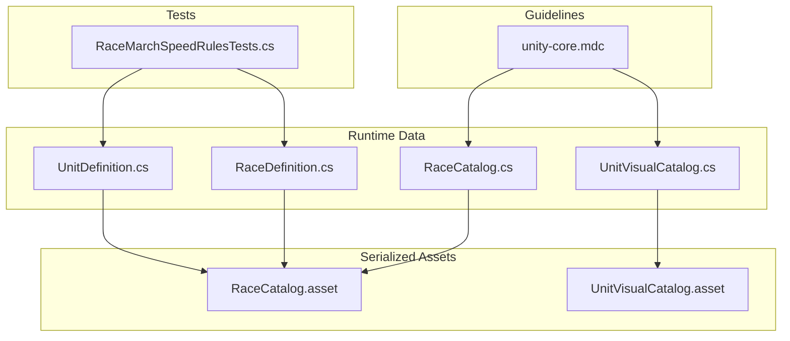
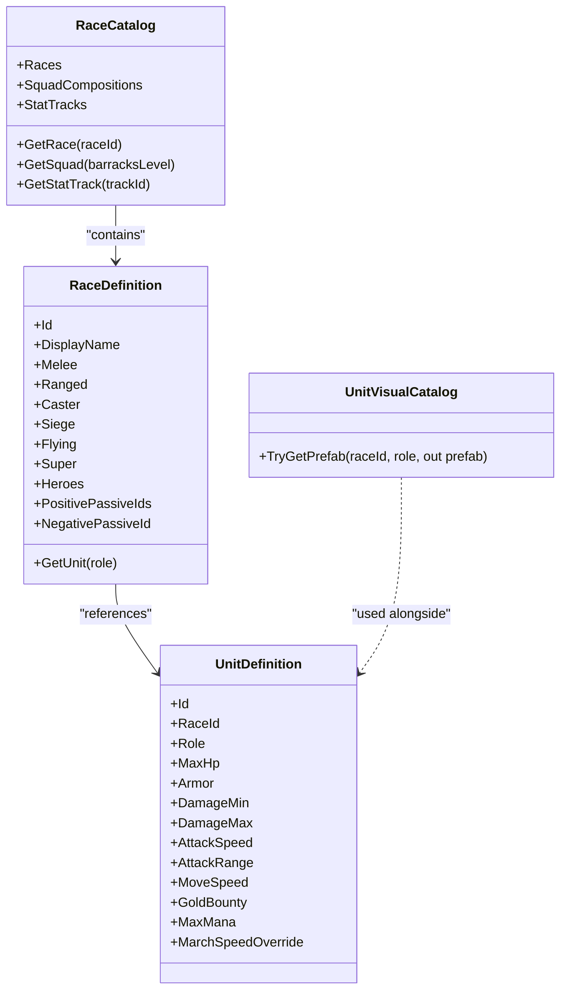
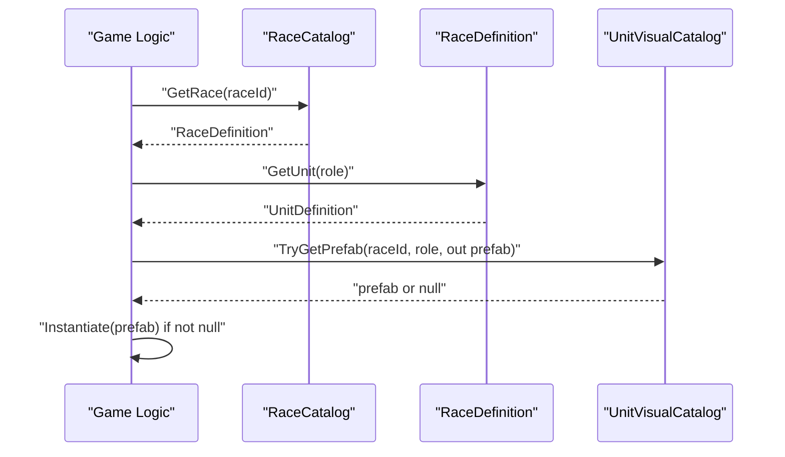
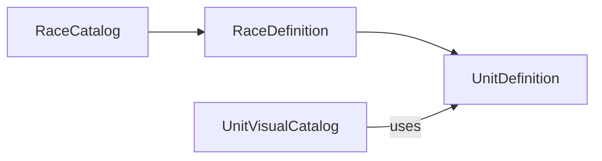

# Asset Pipeline & Serialization

<cite>
**Referenced Files in This Document**
- [RaceCatalog.cs](file://Assets/Game/Scripts/Runtime/Gameplay/Data/RaceCatalog.cs)
- [RaceDefinition.cs](file://Assets/Game/Scripts/Runtime/Gameplay/Data/RaceDefinition.cs)
- [UnitDefinition.cs](file://Assets/Game/Scripts/Runtime/Gameplay/Data/UnitDefinition.cs)
- [UnitVisualCatalog.cs](file://Assets/Game/Scripts/Runtime/Gameplay/Match/UnitVisualCatalog.cs)
- [RaceMarchSpeedRulesTests.cs](file://Assets/Game/Scripts/Tests/RaceMarchSpeedRulesTests.cs)
- [unity-core.mdc](file://Assets/Game/Settings/ProjectBootstrap/Cursor/rules/unity-core.mdc)
- [RaceCatalog.asset](file://Assets/Game/ScriptableObjects/RaceCatalog.asset)
- [UnitVisualCatalog.asset](file://Assets/Game/ScriptableObjects/UnitVisualCatalog.asset)
</cite>

## Table of Contents
1. Introduction
2. Project Structure
3. Core Components
4. Architecture Overview
5. Detailed Component Analysis
6. Dependency Analysis
7. Performance Considerations
8. Troubleshooting Guide
9. Conclusion

## Introduction
This document describes BARAKI’s asset pipeline and ScriptableObject serialization system with a focus on data-driven gameplay content. It explains how game data is organized, named, serialized, loaded, and instantiated at runtime. It also provides guidelines for creating new assets, maintaining consistency, managing dependencies, version control considerations, validation strategies, backup approaches, performance optimization for large catalogs, and debugging techniques for serialization issues.

## Project Structure
The project organizes data-driven content using ScriptableObject assets under the Game folder. The core data definitions live in the runtime codebase and are exposed to the Unity Editor via CreateAssetMenu attributes. Assets are stored as .asset files and referenced by other assets or runtime systems.

**Diagram sources**
- [RaceCatalog.cs:1-28](file://Assets/Game/Scripts/Runtime/Gameplay/Data/RaceCatalog.cs#L1-L28)
- [RaceDefinition.cs:1-45](file://Assets/Game/Scripts/Runtime/Gameplay/Data/RaceDefinition.cs#L1-L45)
- [UnitDefinition.cs:1-37](file://Assets/Game/Scripts/Runtime/Gameplay/Data/UnitDefinition.cs#L1-L37)
- [UnitVisualCatalog.cs:1-58](file://Assets/Game/Scripts/Runtime/Gameplay/Match/UnitVisualCatalog.cs#L1-L58)
- [RaceCatalog.asset:1-28](file://Assets/Game/ScriptableObjects/RaceCatalog.asset#L1-L28)
- [UnitVisualCatalog.asset:1-29](file://Assets/Game/ScriptableObjects/UnitVisualCatalog.asset#L1-L29)
- [RaceMarchSpeedRulesTests.cs:34-63](file://Assets/Game/Scripts/Tests/RaceMarchSpeedRulesTests.cs#L34-L63)
- [unity-core.mdc:37-55](file://Assets/Game/Settings/ProjectBootstrap/Cursor/rules/unity-core.mdc#L37-L55)

**Section sources**
- [RaceCatalog.cs:1-28](file://Assets/Game/Scripts/Runtime/Gameplay/Data/RaceCatalog.cs#L1-L28)
- [RaceDefinition.cs:1-45](file://Assets/Game/Scripts/Runtime/Gameplay/Data/RaceDefinition.cs#L1-L45)
- [UnitDefinition.cs:1-37](file://Assets/Game/Scripts/Runtime/Gameplay/Data/UnitDefinition.cs#L1-L37)
- [UnitVisualCatalog.cs:1-58](file://Assets/Game/Scripts/Runtime/Gameplay/Match/UnitVisualCatalog.cs#L1-L58)
- [unity-core.mdc:37-55](file://Assets/Game/Settings/ProjectBootstrap/Cursor/rules/unity-core.mdc#L37-L55)

## Core Components
- RaceCatalog: Central registry that holds arrays of RaceDefinition, SquadCompositionDefinition, and StatUpgradeTrackDefinition. Provides lookup helpers by id or level.
- RaceDefinition: Describes a race, including default units per role, hero list, and passive ids.
- UnitDefinition: Defines unit stats such as hp, armor, damage range, attack speed/range, movement speed, bounty, mana, and optional march speed override.
- UnitVisualCatalog: Maps race and combat role to concrete GameObject prefabs used during matches.

Key patterns:
- All types use [CreateAssetMenu] to enable easy creation from the Unity Editor.
- Serialized fields are private with public read-only properties exposing values safely.
- Catalogs expose simple query methods (e.g., GetRace, TryGetPrefab).

**Section sources**
- [RaceCatalog.cs:1-28](file://Assets/Game/Scripts/Runtime/Gameplay/Data/RaceCatalog.cs#L1-L28)
- [RaceDefinition.cs:1-45](file://Assets/Game/Scripts/Runtime/Gameplay/Data/RaceDefinition.cs#L1-L45)
- [UnitDefinition.cs:1-37](file://Assets/Game/Scripts/Runtime/Gameplay/Data/UnitDefinition.cs#L1-L37)
- [UnitVisualCatalog.cs:1-58](file://Assets/Game/Scripts/Runtime/Gameplay/Match/UnitVisualCatalog.cs#L1-L58)

## Architecture Overview
The data architecture separates pure data (ScriptableObjects) from visual instantiation. Runtime code reads data from catalogs and resolves visuals through a dedicated catalog keyed by race and role.

**Diagram sources**
- [RaceCatalog.cs:1-28](file://Assets/Game/Scripts/Runtime/Gameplay/Data/RaceCatalog.cs#L1-L28)
- [RaceDefinition.cs:1-45](file://Assets/Game/Scripts/Runtime/Gameplay/Data/RaceDefinition.cs#L1-L45)
- [UnitDefinition.cs:1-37](file://Assets/Game/Scripts/Runtime/Gameplay/Data/UnitDefinition.cs#L1-L37)
- [UnitVisualCatalog.cs:1-58](file://Assets/Game/Scripts/Runtime/Gameplay/Match/UnitVisualCatalog.cs#L1-L58)

## Detailed Component Analysis

### RaceCatalog
Responsibilities:
- Holds collections of races, squad compositions, and stat tracks.
- Exposes IReadOnlyList views to prevent external mutation.
- Provides lookup helpers by id or level.

Serialization notes:
- Uses arrays of ScriptableObject references; Unity serializes these as file IDs.
- Ensure referenced assets exist to avoid null entries.

Best practices:
- Keep arrays ordered by logical progression when applicable (e.g., barracks levels).
- Use unique Ids across all entries to simplify lookups.

**Section sources**
- [RaceCatalog.cs:1-28](file://Assets/Game/Scripts/Runtime/Gameplay/Data/RaceCatalog.cs#L1-L28)
- [RaceCatalog.asset:1-28](file://Assets/Game/ScriptableObjects/RaceCatalog.asset#L1-L28)

### RaceDefinition
Responsibilities:
- Encapsulates race identity and default units per combat role.
- Links to heroes and passive identifiers.

Serialization notes:
- References multiple UnitDefinition instances and HeroDefinition instances.
- String arrays for passive ids should be validated for uniqueness and existence.

Validation tips:
- Verify each referenced UnitDefinition has a matching Role and valid Id.
- Ensure DisplayName is localized-friendly if needed.

**Section sources**
- [RaceDefinition.cs:1-45](file://Assets/Game/Scripts/Runtime/Gameplay/Data/RaceDefinition.cs#L1-L45)

### UnitDefinition
Responsibilities:
- Stores numeric stats and identifiers for a unit type.
- Supports optional march speed overrides.

Serialization notes:
- Numeric fields serialize directly; ensure sensible defaults.
- March speed override can influence pathing and timing; validate ranges.

Consistency checks:
- Confirm Id and RaceId match expected conventions.
- Validate DamageMin <= DamageMax and AttackRange >= 0.

**Section sources**
- [UnitDefinition.cs:1-37](file://Assets/Game/Scripts/Runtime/Gameplay/Data/UnitDefinition.cs#L1-L37)

### UnitVisualCatalog
Responsibilities:
- Maps race and role to concrete GameObject prefabs for rendering in matches.
- Provides a safe TryGetPrefab method to avoid exceptions.

Serialization notes:
- Contains nested Serializable classes for grouping visuals by race.
- Prefab references must be assigned in the Editor; missing references will return false from TryGetPrefab.

Usage pattern:
- Combine with RaceDefinition.Id and UnitDefinition.Role to resolve visuals at spawn time.

**Section sources**
- [UnitVisualCatalog.cs:1-58](file://Assets/Game/Scripts/Runtime/Gameplay/Match/UnitVisualCatalog.cs#L1-L58)
- [UnitVisualCatalog.asset:1-29](file://Assets/Game/ScriptableObjects/UnitVisualCatalog.asset#L1-L29)

### Serialization and Asset Loading Strategy
- Creation: Use CreateAssetMenu to generate new assets from the Unity Editor.
- Storage: Assets are saved as .asset files under the ScriptableObjects directory.
- Referencing: Other assets reference these via Unity’s internal GUID-based references.
- Loading: Load at startup or on demand using standard Unity mechanisms; avoid Resources.Load for new content per project guidelines.

Guideline reference:
- Prefer ScriptableObject configuration and avoid Resources.Load for new content.

**Section sources**
- [unity-core.mdc:37-55](file://Assets/Game/Settings/ProjectBootstrap/Cursor/rules/unity-core.mdc#L37-L55)

### Runtime Instantiation Patterns
Typical flow:
1. Resolve data via RaceCatalog.GetRace or similar.
2. Determine UnitDefinition based on role or selection logic.
3. Use UnitVisualCatalog.TryGetPrefab to obtain the GameObject prefab.
4. Instantiate the prefab into the scene or pool.

[No diagram sources since this sequence illustrates conceptual usage rather than specific function call chains]

## Dependency Analysis
- RaceCatalog depends on RaceDefinition, SquadCompositionDefinition, and StatUpgradeTrackDefinition.
- RaceDefinition depends on UnitDefinition and HeroDefinition.
- UnitVisualCatalog depends on string constants for race keys and GameObject references.

**Diagram sources**
- [RaceCatalog.cs:1-28](file://Assets/Game/Scripts/Runtime/Gameplay/Data/RaceCatalog.cs#L1-L28)
- [RaceDefinition.cs:1-45](file://Assets/Game/Scripts/Runtime/Gameplay/Data/RaceDefinition.cs#L1-L45)
- [UnitDefinition.cs:1-37](file://Assets/Game/Scripts/Runtime/Gameplay/Data/UnitDefinition.cs#L1-L37)
- [UnitVisualCatalog.cs:1-58](file://Assets/Game/Scripts/Runtime/Gameplay/Match/UnitVisualCatalog.cs#L1-L58)

**Section sources**
- [RaceCatalog.cs:1-28](file://Assets/Game/Scripts/Runtime/Gameplay/Data/RaceCatalog.cs#L1-L28)
- [RaceDefinition.cs:1-45](file://Assets/Game/Scripts/Runtime/Gameplay/Data/RaceDefinition.cs#L1-L45)
- [UnitDefinition.cs:1-37](file://Assets/Game/Scripts/Runtime/Gameplay/Data/UnitDefinition.cs#L1-L37)
- [UnitVisualCatalog.cs:1-58](file://Assets/Game/Scripts/Runtime/Gameplay/Match/UnitVisualCatalog.cs#L1-L58)

## Performance Considerations
- Avoid Resources.Load for new content; prefer preloaded catalogs and dependency injection or static accessors.
- Cache frequently accessed references (e.g., resolved prefabs) where appropriate.
- Keep arrays small and well-indexed; consider dictionaries for large datasets if needed.
- Minimize allocations in hot paths; reuse collections and avoid LINQ in tight loops.
- Validate and prune unused assets to reduce memory footprint.

[No sources needed since this section provides general guidance]

## Troubleshooting Guide
Common issues and remedies:
- Null references in catalogs:
  - Ensure all referenced assets exist and are properly assigned in the Inspector.
  - Reimport assets if GUIDs become desynchronized.
- Missing prefab references:
  - Verify UnitVisualCatalog entries are set for each race and role combination.
  - Use TryGetPrefab and handle null cases gracefully.
- Incorrect march speed behavior:
  - Check UnitDefinition._marchSpeedOverride and related rules.
  - Tests demonstrate programmatic manipulation of serialized fields for validation.

Editor-time validation:
- Use SerializedObject in tests to assert field values and edge cases.
- Add editor scripts to validate Id uniqueness and referential integrity.

Backup strategy:
- Commit .asset files to version control along with their meta files.
- Maintain periodic backups of the entire Assets directory.
- Tag releases after validating critical catalogs (RaceCatalog, UnitVisualCatalog).

**Section sources**
- [RaceMarchSpeedRulesTests.cs:34-63](file://Assets/Game/Scripts/Tests/RaceMarchSpeedRulesTests.cs#L34-L63)
- [unity-core.mdc:37-55](file://Assets/Game/Settings/ProjectBootstrap/Cursor/rules/unity-core.mdc#L37-L55)

## Conclusion
BARAKI’s data-driven approach leverages ScriptableObject assets to define gameplay content cleanly and efficiently. By organizing data into focused catalogs and definitions, referencing assets consistently, and following the provided guidelines for creation, validation, and performance, teams can maintain a robust and scalable asset pipeline. Adopting the recommended practices ensures reliable serialization, predictable runtime behavior, and easier collaboration across team members.