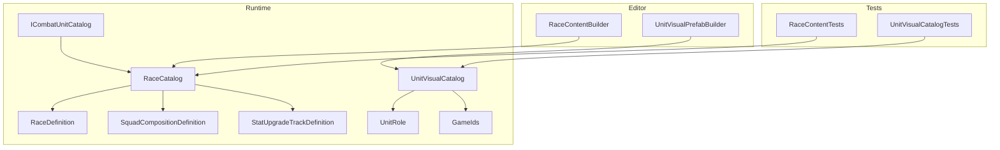
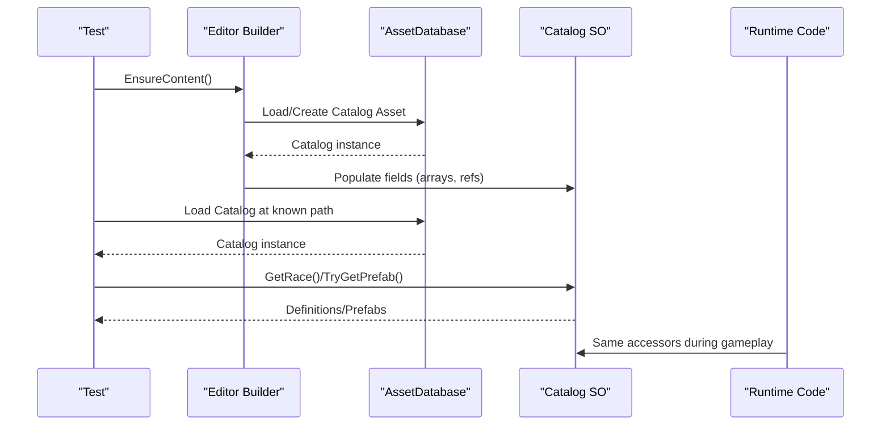
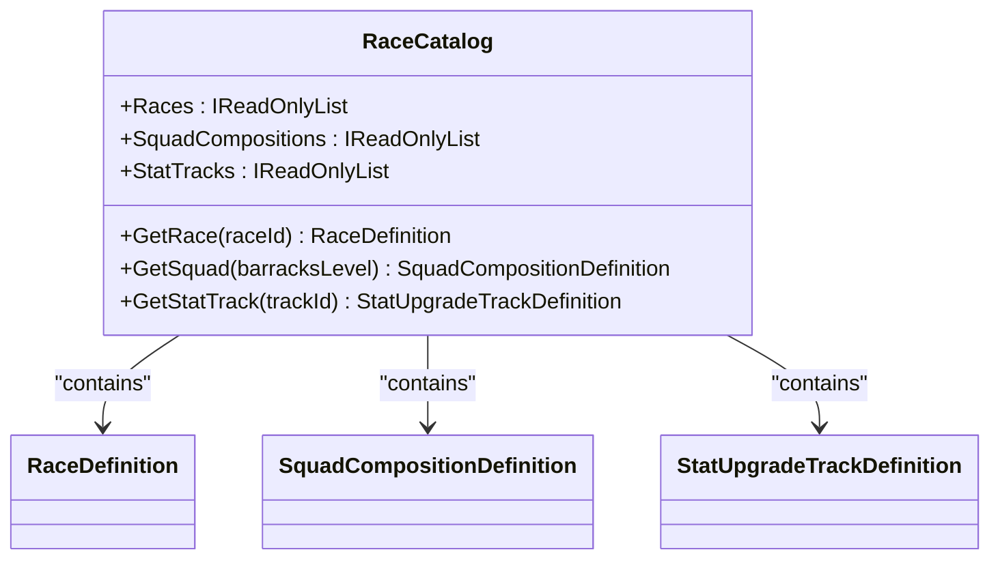
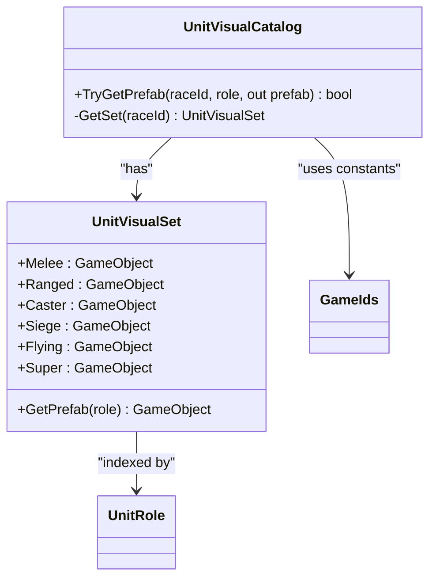
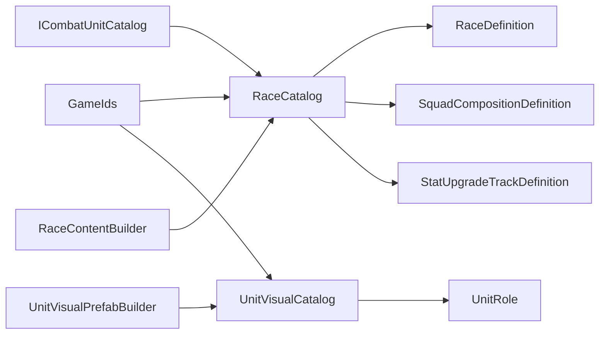

# Catalog & Registry System

<cite>
**Referenced Files in This Document**
- [RaceCatalog.cs](file://Assets/Game/Scripts/Runtime/Gameplay/Data/RaceCatalog.cs)
- [UnitVisualCatalog.cs](file://Assets/Game/Scripts/Runtime/Gameplay/Match/UnitVisualCatalog.cs)
- [ICombatUnitCatalog.cs](file://Assets/Game/Scripts/Runtime/Gameplay/Combat/ICombatUnitCatalog.cs)
- [RaceDefinition.cs](file://Assets/Game/Scripts/Runtime/Gameplay/Data/RaceDefinition.cs)
- [SquadCompositionDefinition.cs](file://Assets/Game/Scripts/Runtime/Gameplay/Data/SquadCompositionDefinition.cs)
- [StatUpgradeTrackDefinition.cs](file://Assets/Game/Scripts/Runtime/Gameplay/Data/StatUpgradeTrackDefinition.cs)
- [UnitRole.cs](file://Assets/Game/Scripts/Runtime/Gameplay/Data/UnitRole.cs)
- [GameIds.cs](file://Assets/Game/Scripts/Runtime/Core/GameIds.cs)
- [RaceContentBuilder.cs](file://Assets/Game/Scripts/Editor/RaceContentBuilder.cs)
- [UnitVisualPrefabBuilder.cs](file://Assets/Game/Scripts/Editor/UnitVisualPrefabBuilder.cs)
- [RaceContentTests.cs](file://Assets/Game/Scripts/Tests/RaceContentTests.cs)
- [UnitVisualCatalogTests.cs](file://Assets/Game/Scripts/Tests/UnitVisualCatalogTests.cs)
</cite>

## Table of Contents
1. [Introduction](#introduction)
2. [Project Structure](#project-structure)
3. [Core Components](#core-components)
4. [Architecture Overview](#architecture-overview)
5. [Detailed Component Analysis](#detailed-component-analysis)
6. [Dependency Analysis](#dependency-analysis)
7. [Performance Considerations](#performance-considerations)
8. [Troubleshooting Guide](#troubleshooting-guide)
9. [Conclusion](#conclusion)
10. [Appendices](#appendices)

## Introduction
This document explains BARAKI’s catalog and registry system with a focus on RaceCatalog and UnitVisualCatalog. These classes act as centralized data access points for gameplay content (races, squads, stat tracks) and runtime unit visuals (prefabs per race and role). The documentation covers:
- Implementation details and lookup mechanisms
- Relationship to ScriptableObject assets and initialization patterns
- Caching strategies and performance considerations
- Usage examples across the codebase
- Error handling for missing references
- Versioning and migration strategies
- Best practices for extending the system with new content types

## Project Structure
The catalog system is organized around two primary catalogs:
- RaceCatalog: Data-driven definitions for races, squad compositions, and upgrade tracks
- UnitVisualCatalog: Prefab mappings for visual representation by race and combat role

**Diagram sources**
- [RaceCatalog.cs:1-27](file://Assets/Game/Scripts/Runtime/Gameplay/Data/RaceCatalog.cs#L1-L27)
- [UnitVisualCatalog.cs:1-58](file://Assets/Game/Scripts/Runtime/Gameplay/Match/UnitVisualCatalog.cs#L1-L58)
- [ICombatUnitCatalog.cs:1-24](file://Assets/Game/Scripts/Runtime/Gameplay/Combat/ICombatUnitCatalog.cs#L1-L24)
- [RaceDefinition.cs:1-30](file://Assets/Game/Scripts/Runtime/Gameplay/Data/RaceDefinition.cs#L1-L30)
- [SquadCompositionDefinition.cs](file://Assets/Game/Scripts/Runtime/Gameplay/Data/SquadCompositionDefinition.cs)
- [StatUpgradeTrackDefinition.cs](file://Assets/Game/Scripts/Runtime/Gameplay/Data/StatUpgradeTrackDefinition.cs)
- [UnitRole.cs:1-13](file://Assets/Game/Scripts/Runtime/Gameplay/Data/UnitRole.cs#L1-L13)
- [GameIds.cs:1-40](file://Assets/Game/Scripts/Runtime/Core/GameIds.cs#L1-L40)
- [RaceContentBuilder.cs:1-39](file://Assets/Game/Scripts/Editor/RaceContentBuilder.cs#L1-L39)
- [UnitVisualPrefabBuilder.cs:446-507](file://Assets/Game/Scripts/Editor/UnitVisualPrefabBuilder.cs#L446-L507)
- [RaceContentTests.cs:1-45](file://Assets/Game/Scripts/Tests/RaceContentTests.cs#L1-L45)
- [UnitVisualCatalogTests.cs:1-76](file://Assets/Game/Scripts/Tests/UnitVisualCatalogTests.cs#L1-L76)

**Section sources**
- [RaceCatalog.cs:1-27](file://Assets/Game/Scripts/Runtime/Gameplay/Data/RaceCatalog.cs#L1-L27)
- [UnitVisualCatalog.cs:1-58](file://Assets/Game/Scripts/Runtime/Gameplay/Match/UnitVisualCatalog.cs#L1-L58)
- [ICombatUnitCatalog.cs:1-24](file://Assets/Game/Scripts/Runtime/Gameplay/Combat/ICombatUnitCatalog.cs#L1-L24)
- [RaceDefinition.cs:1-30](file://Assets/Game/Scripts/Runtime/Gameplay/Data/RaceDefinition.cs#L1-L30)
- [SquadCompositionDefinition.cs](file://Assets/Game/Scripts/Runtime/Gameplay/Data/SquadCompositionDefinition.cs)
- [StatUpgradeTrackDefinition.cs](file://Assets/Game/Scripts/Runtime/Gameplay/Data/StatUpgradeTrackDefinition.cs)
- [UnitRole.cs:1-13](file://Assets/Game/Scripts/Runtime/Gameplay/Data/UnitRole.cs#L1-L13)
- [GameIds.cs:1-40](file://Assets/Game/Scripts/Runtime/Core/GameIds.cs#L1-L40)
- [RaceContentBuilder.cs:1-39](file://Assets/Game/Scripts/Editor/RaceContentBuilder.cs#L1-L39)
- [UnitVisualPrefabBuilder.cs:446-507](file://Assets/Game/Scripts/Editor/UnitVisualPrefabBuilder.cs#L446-L507)
- [RaceContentTests.cs:1-45](file://Assets/Game/Scripts/Tests/RaceContentTests.cs#L1-L45)
- [UnitVisualCatalogTests.cs:1-76](file://Assets/Game/Scripts/Tests/UnitVisualCatalogTests.cs#L1-L76)

## Core Components
- RaceCatalog
  - Centralized read-only access to RaceDefinition, SquadCompositionDefinition, and StatUpgradeTrackDefinition arrays.
  - Provides keyed lookups by string IDs or numeric levels.
  - Exposes IReadOnlyList views to prevent mutation from consumers.
- UnitVisualCatalog
  - Maps race IDs to UnitVisualSet objects that hold prefabs for each UnitRole.
  - Offers TryGetPrefab(raceId, role) returning a boolean and out reference for safe consumption.
- Supporting Types
  - GameIds: stable string identifiers used across catalogs and tests.
  - UnitRole: enum defining roles resolved by UnitVisualCatalog.
  - ICombatUnitCatalog: abstraction over RaceCatalog for combat subsystems.

Key responsibilities:
- Provide single source-of-truth for content retrieval
- Keep runtime logic decoupled from asset structure
- Enable editor tooling to generate and maintain catalog assets

**Section sources**
- [RaceCatalog.cs:1-27](file://Assets/Game/Scripts/Runtime/Gameplay/Data/RaceCatalog.cs#L1-L27)
- [UnitVisualCatalog.cs:1-58](file://Assets/Game/Scripts/Runtime/Gameplay/Match/UnitVisualCatalog.cs#L1-L58)
- [ICombatUnitCatalog.cs:1-24](file://Assets/Game/Scripts/Runtime/Gameplay/Combat/ICombatUnitCatalog.cs#L1-L24)
- [UnitRole.cs:1-13](file://Assets/Game/Scripts/Runtime/Gameplay/Data/UnitRole.cs#L1-L13)
- [GameIds.cs:1-40](file://Assets/Game/Scripts/Runtime/Core/GameIds.cs#L1-L40)

## Architecture Overview
The catalog system follows a simple, robust pattern:
- Data layer: ScriptableObject assets define content (races, units, squads, tracks, visuals).
- Access layer: Catalog classes expose typed, keyed accessors.
- Editor tooling: Builders create and update catalog assets from baseline data and prefabs.
- Tests: Validate correctness and completeness of generated content.

**Diagram sources**
- [RaceContentBuilder.cs:1-39](file://Assets/Game/Scripts/Editor/RaceContentBuilder.cs#L1-L39)
- [UnitVisualPrefabBuilder.cs:446-507](file://Assets/Game/Scripts/Editor/UnitVisualPrefabBuilder.cs#L446-L507)
- [RaceContentTests.cs:1-45](file://Assets/Game/Scripts/Tests/RaceContentTests.cs#L1-L45)
- [UnitVisualCatalogTests.cs:1-76](file://Assets/Game/Scripts/Tests/UnitVisualCatalogTests.cs#L1-L76)

## Detailed Component Analysis

### RaceCatalog
Responsibilities:
- Store arrays of RaceDefinition, SquadCompositionDefinition, and StatUpgradeTrackDefinition.
- Provide fast, readable accessors:
  - GetRace(string id)
  - GetSquad(int barracksLevel)
  - GetStatTrack(string trackId)
- Expose IReadOnlyList views for enumeration without mutation.

Lookup mechanism:
- Linear search using LINQ FirstOrDefault with null checks and equality comparisons.
- Returns null when no match is found; callers should handle null safely.

Initialization and caching:
- Created via CreateAssetMenu and populated by RaceContentBuilder.
- Loaded at runtime through Unity’s asset loading pipeline; typically injected into systems or accessed via a singleton-like holder elsewhere in the project.

Error handling:
- Null returns indicate missing entries. Consumers must guard against null dereference.

Performance characteristics:
- O(n) per lookup where n is array length. For small catalogs this is acceptable.
- If catalogs grow significantly, consider building internal dictionaries keyed by Id/BarracksLevel for O(1) access.

Usage examples:
- Tests load the catalog and assert presence and counts of races, heroes, and squad totals.
- Combat subsystem uses ICombatUnitCatalog to abstract RaceCatalog access.

**Diagram sources**
- [RaceCatalog.cs:1-27](file://Assets/Game/Scripts/Runtime/Gameplay/Data/RaceCatalog.cs#L1-L27)
- [RaceDefinition.cs:1-30](file://Assets/Game/Scripts/Runtime/Gameplay/Data/RaceDefinition.cs#L1-L30)
- [SquadCompositionDefinition.cs](file://Assets/Game/Scripts/Runtime/Gameplay/Data/SquadCompositionDefinition.cs)
- [StatUpgradeTrackDefinition.cs](file://Assets/Game/Scripts/Runtime/Gameplay/Data/StatUpgradeTrackDefinition.cs)

**Section sources**
- [RaceCatalog.cs:1-27](file://Assets/Game/Scripts/Runtime/Gameplay/Data/RaceCatalog.cs#L1-L27)
- [RaceContentTests.cs:1-45](file://Assets/Game/Scripts/Tests/RaceContentTests.cs#L1-L45)
- [ICombatUnitCatalog.cs:1-24](file://Assets/Game/Scripts/Runtime/Gameplay/Combat/ICombatUnitCatalog.cs#L1-L24)

### UnitVisualCatalog
Responsibilities:
- Map race IDs to UnitVisualSet instances containing GameObject prefab references for each UnitRole.
- Provide TryGetPrefab(raceId, role) for safe retrieval with explicit success/failure signaling.

Lookup mechanism:
- Switch-based selection of UnitVisualSet by race ID.
- Role-based switch within UnitVisualSet to return the appropriate prefab.

Initialization and caching:
- Created and updated by UnitVisualPrefabBuilder which writes SerializedObject properties to the catalog asset.
- At runtime, loaded like any other ScriptableObject and cached by the loader or DI container.

Error handling:
- TryGetPrefab returns false if either the race set is unknown or the specific prefab is null. Callers should branch accordingly.

Performance characteristics:
- Constant-time selection via switch statements.
- Minimal overhead; suitable for frequent calls during spawn flows.

Usage examples:
- Tests verify all twelve prefabs are assigned and validate structural requirements (e.g., team accent transform).

**Diagram sources**
- [UnitVisualCatalog.cs:1-58](file://Assets/Game/Scripts/Runtime/Gameplay/Match/UnitVisualCatalog.cs#L1-L58)
- [UnitRole.cs:1-13](file://Assets/Game/Scripts/Runtime/Gameplay/Data/UnitRole.cs#L1-L13)
- [GameIds.cs:1-40](file://Assets/Game/Scripts/Runtime/Core/GameIds.cs#L1-L40)

**Section sources**
- [UnitVisualCatalog.cs:1-58](file://Assets/Game/Scripts/Runtime/Gameplay/Match/UnitVisualCatalog.cs#L1-L58)
- [UnitVisualCatalogTests.cs:1-76](file://Assets/Game/Scripts/Tests/UnitVisualCatalogTests.cs#L1-L76)

### Editor Tooling and Initialization Patterns
- RaceContentBuilder
  - Ensures folder structure and creates baseline ScriptableObject assets for Races, Units, Heroes, Squads, Upgrades.
  - Populates RaceCatalog with arrays of definitions and links them together.
- UnitVisualPrefabBuilder
  - Creates or loads UnitVisualCatalog asset.
  - Assigns prefab references per race and role using SerializedObject property assignment.
  - Persists changes and marks assets dirty.

These builders enable reproducible content generation and keep runtime catalogs consistent with design documents.

**Section sources**
- [RaceContentBuilder.cs:1-39](file://Assets/Game/Scripts/Editor/RaceContentBuilder.cs#L1-L39)
- [UnitVisualPrefabBuilder.cs:446-507](file://Assets/Game/Scripts/Editor/UnitVisualPrefabBuilder.cs#L446-L507)

### Runtime Usage Examples
- RaceCatalog usage in tests:
  - Loads catalog from a known path and asserts race composition, hero counts, and squad totals.
- UnitVisualCatalog usage in tests:
  - Verifies existence after ensure-content and validates all race-role combinations resolve to non-null prefabs.
- Combat subsystem integration:
  - ICombatUnitCatalog wraps RaceCatalog to provide a focused interface for combat logic.

**Section sources**
- [RaceContentTests.cs:1-45](file://Assets/Game/Scripts/Tests/RaceContentTests.cs#L1-L45)
- [UnitVisualCatalogTests.cs:1-76](file://Assets/Game/Scripts/Tests/UnitVisualCatalogTests.cs#L1-L76)
- [ICombatUnitCatalog.cs:1-24](file://Assets/Game/Scripts/Runtime/Gameplay/Combat/ICombatUnitCatalog.cs#L1-L24)

## Dependency Analysis

**Diagram sources**
- [GameIds.cs:1-40](file://Assets/Game/Scripts/Runtime/Core/GameIds.cs#L1-L40)
- [RaceCatalog.cs:1-27](file://Assets/Game/Scripts/Runtime/Gameplay/Data/RaceCatalog.cs#L1-L27)
- [UnitVisualCatalog.cs:1-58](file://Assets/Game/Scripts/Runtime/Gameplay/Match/UnitVisualCatalog.cs#L1-L58)
- [RaceDefinition.cs:1-30](file://Assets/Game/Scripts/Runtime/Gameplay/Data/RaceDefinition.cs#L1-L30)
- [SquadCompositionDefinition.cs](file://Assets/Game/Scripts/Runtime/Gameplay/Data/SquadCompositionDefinition.cs)
- [StatUpgradeTrackDefinition.cs](file://Assets/Game/Scripts/Runtime/Gameplay/Data/StatUpgradeTrackDefinition.cs)
- [UnitRole.cs:1-13](file://Assets/Game/Scripts/Runtime/Gameplay/Data/UnitRole.cs#L1-L13)
- [ICombatUnitCatalog.cs:1-24](file://Assets/Game/Scripts/Runtime/Gameplay/Combat/ICombatUnitCatalog.cs#L1-L24)
- [RaceContentBuilder.cs:1-39](file://Assets/Game/Scripts/Editor/RaceContentBuilder.cs#L1-L39)
- [UnitVisualPrefabBuilder.cs:446-507](file://Assets/Game/Scripts/Editor/UnitVisualPrefabBuilder.cs#L446-L507)

**Section sources**
- [GameIds.cs:1-40](file://Assets/Game/Scripts/Runtime/Core/GameIds.cs#L1-L40)
- [RaceCatalog.cs:1-27](file://Assets/Game/Scripts/Runtime/Gameplay/Data/RaceCatalog.cs#L1-L27)
- [UnitVisualCatalog.cs:1-58](file://Assets/Game/Scripts/Runtime/Gameplay/Match/UnitVisualCatalog.cs#L1-L58)
- [ICombatUnitCatalog.cs:1-24](file://Assets/Game/Scripts/Runtime/Gameplay/Combat/ICombatUnitCatalog.cs#L1-L24)

## Performance Considerations
- Lookup complexity:
  - RaceCatalog uses linear scans; acceptable for small datasets but may become a bottleneck if arrays grow large.
  - UnitVisualCatalog uses switch-based constant-time selection.
- Caching strategy:
  - Cache resolved results at higher layers (e.g., cache RaceDefinition pointers after first lookup).
  - Avoid repeated heavy operations in hot paths (e.g., avoid repeated Find operations).
- Memory and GC:
  - Prefer direct field accessors and avoid allocations in tight loops.
  - Use readonly references where possible.
- Asset loading:
  - Preload catalogs during scene bootstrapping to avoid runtime hitches.
  - Consider Addressables or Resources caching if dynamic loading is required.

[No sources needed since this section provides general guidance]

## Troubleshooting Guide
Common issues and resolutions:
- Missing race or squad entry
  - Symptom: GetRace/GetSquad returns null.
  - Action: Verify GameIds values match those in ScriptableObject assets; regenerate content using RaceContentBuilder.EnsureContent().
- Null prefab in UnitVisualCatalog
  - Symptom: TryGetPrefab returns false or out prefab is null.
  - Action: Run UnitVisualPrefabBuilder to reassign prefabs; confirm all race-role pairs are filled.
- Duplicate or inconsistent IDs
  - Symptom: Lookups fail unexpectedly.
  - Action: Run GameIds uniqueness tests; ensure IDs remain unique and aligned with GDD.
- Dirty assets not persisted
  - Symptom: Changes lost after editor restart.
  - Action: Ensure SetDirty is called after modifying SerializedObject properties in builder scripts.

**Section sources**
- [RaceContentBuilder.cs:1-39](file://Assets/Game/Scripts/Editor/RaceContentBuilder.cs#L1-L39)
- [UnitVisualPrefabBuilder.cs:446-507](file://Assets/Game/Scripts/Editor/UnitVisualPrefabBuilder.cs#L446-L507)
- [RaceContentTests.cs:1-45](file://Assets/Game/Scripts/Tests/RaceContentTests.cs#L1-L45)
- [UnitVisualCatalogTests.cs:1-76](file://Assets/Game/Scripts/Tests/UnitVisualCatalogTests.cs#L1-L76)

## Conclusion
RaceCatalog and UnitVisualCatalog provide clear, centralized access to game content and visuals. Their design emphasizes simplicity, safety, and testability:
- Clear separation between data (ScriptableObjects) and access (catalogs)
- Safe APIs with explicit error signaling
- Editor tooling for reproducible content creation
- Comprehensive tests validating integrity and completeness

Adopting the recommended performance and versioning practices will keep the system scalable and maintainable as content grows.

[No sources needed since this section summarizes without analyzing specific files]

## Appendices

### Versioning and Migration Strategies
- Stable identifiers
  - Use GameIds constants consistently across catalogs and tests.
  - Never rename IDs without updating GDD and all dependent assets.
- Asset versioning
  - Maintain a changelog for catalog updates; tag releases in version control.
  - Keep backward-compatible migrations in place when evolving schemas.
- Migration approach
  - On load, detect schema versions and run migration steps to populate missing fields or convert legacy structures.
  - Log warnings for deprecated fields and schedule cleanup.
- Validation
  - Add pre-commit or CI checks that run content tests to catch inconsistencies early.

[No sources needed since this section provides general guidance]

### Best Practices for Extending the Catalog System
- Adding a new content type
  - Define a new ScriptableObject definition type.
  - Extend the relevant catalog with arrays and accessor methods.
  - Update editor builders to generate and wire up new assets.
  - Add tests to assert presence and invariants.
- Keeping lookups efficient
  - Introduce internal caches or dictionaries if arrays grow beyond a few dozen entries.
- Maintaining consistency
  - Centralize IDs in GameIds.
  - Enforce non-null contracts via tests and assertions.
- Documentation
  - Keep inline comments concise and accurate.
  - Reflect changes in design docs and README notes.

[No sources needed since this section provides general guidance]