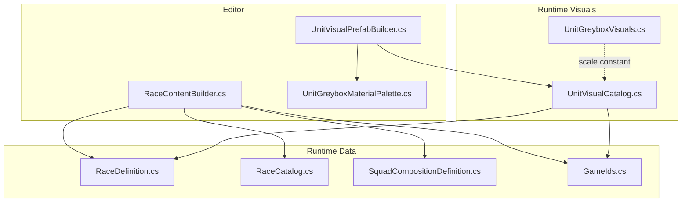
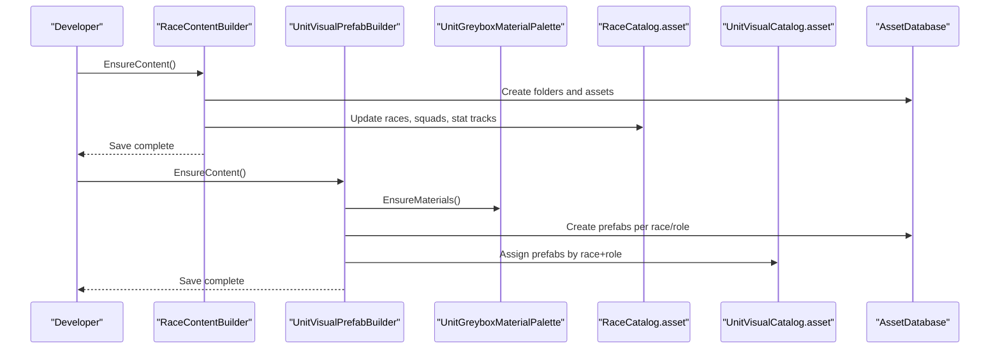
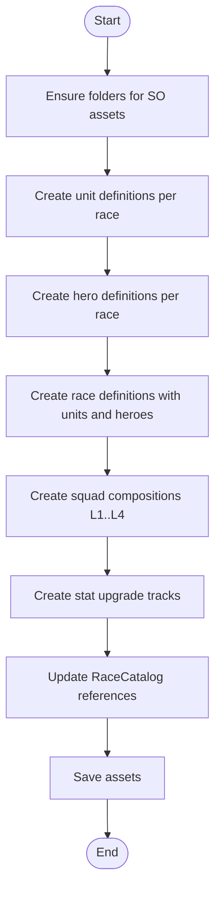
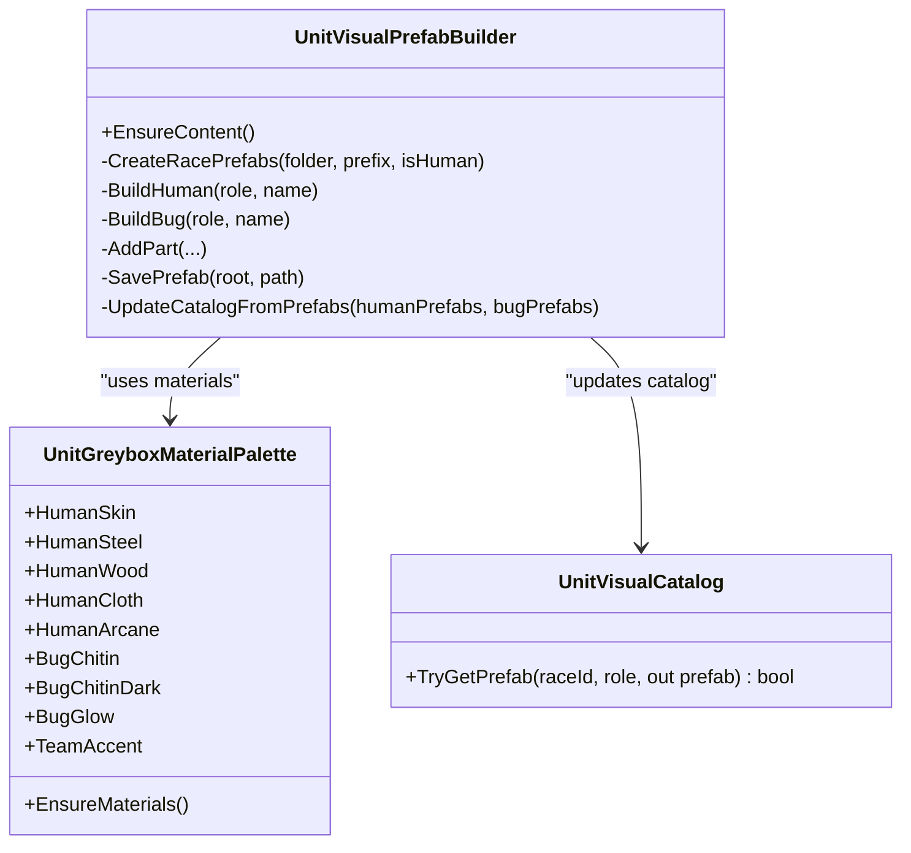
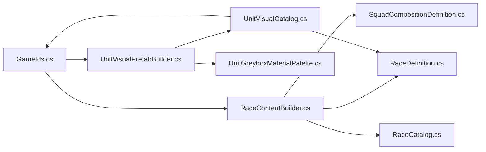

# Content Creation Tools

<cite>
**Referenced Files in This Document**
- [RaceContentBuilder.cs](file://Assets/Game/Scripts/Editor/RaceContentBuilder.cs)
- [UnitVisualPrefabBuilder.cs](file://Assets/Game/Scripts/Editor/UnitVisualPrefabBuilder.cs)
- [UnitGreyboxMaterialPalette.cs](file://Assets/Game/Scripts/Editor/UnitGreyboxMaterialPalette.cs)
- [UnitVisualCatalog.cs](file://Assets/Game/Scripts/Runtime/Gameplay/Match/UnitVisualCatalog.cs)
- [UnitGreyboxVisuals.cs](file://Assets/Game/Scripts/Runtime/Gameplay/Match/UnitGreyboxVisuals.cs)
- [RaceDefinition.cs](file://Assets/Game/Scripts/Runtime/Gameplay/Data/RaceDefinition.cs)
- [RaceCatalog.cs](file://Assets/Game/Scripts/Runtime/Gameplay/Data/RaceCatalog.cs)
- [SquadCompositionDefinition.cs](file://Assets/Game/Scripts/Runtime/Gameplay/Data/SquadCompositionDefinition.cs)
- [GameIds.cs](file://Assets/Game/Scripts/Runtime/Core/GameIds.cs)
- [UnitVisualCatalogTests.cs](file://Assets/Game/Scripts/Tests/UnitVisualCatalogTests.cs)
- [RaceContentTests.cs](file://Assets/Game/Scripts/Tests/RaceContentTests.cs)
</cite>

## Table of Contents
1. Introduction
2. Project Structure
3. Core Components
4. Architecture Overview
5. Detailed Component Analysis
6. Dependency Analysis
7. Performance Considerations
8. Troubleshooting Guide
9. Conclusion

## Introduction
This document explains BARAKI’s editor tools and content creation pipeline for races, units, and visual assets. It focuses on:
- RaceContentBuilder: automated generation of race, unit, hero, squad, and upgrade data assets from baseline design values.
- UnitVisualPrefabBuilder: procedural greybox prefab creation for Human and Bug units across six combat roles, plus a catalog asset to wire prefabs into the runtime.
- UnitGreyboxMaterialPalette: persistent URP Lit materials used by greybox prefabs.

It also covers editor-specific workflows, batch processing, validation tests, customization options, error handling, integration with Unity Editor APIs, troubleshooting guidance, and performance considerations for large datasets.

## Project Structure
The content creation pipeline spans Editor utilities and runtime data structures:
- Editor tools create ScriptableObject assets and Prefabs under Assets/Game/ScriptableObjects and Assets/Game/Prefabs/Units.
- Runtime catalogs expose typed accessors for races, squads, upgrades, and unit visuals.

**Diagram sources**
- [RaceContentBuilder.cs](file://Assets/Game/Scripts/Editor/RaceContentBuilder.cs)
- [UnitVisualPrefabBuilder.cs](file://Assets/Game/Scripts/Editor/UnitVisualPrefabBuilder.cs)
- [UnitGreyboxMaterialPalette.cs](file://Assets/Game/Scripts/Editor/UnitGreyboxMaterialPalette.cs)
- [RaceDefinition.cs](file://Assets/Game/Scripts/Runtime/Gameplay/Data/RaceDefinition.cs)
- [RaceCatalog.cs](file://Assets/Game/Scripts/Runtime/Gameplay/Data/RaceCatalog.cs)
- [SquadCompositionDefinition.cs](file://Assets/Game/Scripts/Runtime/Gameplay/Data/SquadCompositionDefinition.cs)
- [GameIds.cs](file://Assets/Game/Scripts/Runtime/Core/GameIds.cs)
- [UnitVisualCatalog.cs](file://Assets/Game/Scripts/Runtime/Gameplay/Match/UnitVisualCatalog.cs)
- [UnitGreyboxVisuals.cs](file://Assets/Game/Scripts/Runtime/Gameplay/Match/UnitGreyboxVisuals.cs)

**Section sources**
- [RaceContentBuilder.cs](file://Assets/Game/Scripts/Editor/RaceContentBuilder.cs)
- [UnitVisualPrefabBuilder.cs](file://Assets/Game/Scripts/Editor/UnitVisualPrefabBuilder.cs)
- [UnitGreyboxMaterialPalette.cs](file://Assets/Game/Scripts/Editor/UnitGreyboxMaterialPalette.cs)
- [RaceDefinition.cs](file://Assets/Game/Scripts/Runtime/Gameplay/Data/RaceDefinition.cs)
- [RaceCatalog.cs](file://Assets/Game/Scripts/Runtime/Gameplay/Data/RaceCatalog.cs)
- [SquadCompositionDefinition.cs](file://Assets/Game/Scripts/Runtime/Gameplay/Data/SquadCompositionDefinition.cs)
- [GameIds.cs](file://Assets/Game/Scripts/Runtime/Core/GameIds.cs)
- [UnitVisualCatalog.cs](file://Assets/Game/Scripts/Runtime/Gameplay/Match/UnitVisualCatalog.cs)
- [UnitGreyboxVisuals.cs](file://Assets/Game/Scripts/Runtime/Gameplay/Match/UnitGreyboxVisuals.cs)

## Core Components
- RaceContentBuilder
  - Ensures folder structure and creates or updates ScriptableObject assets for Units, Heroes, Races, Squads, and Upgrades.
  - Populates RaceCatalog with references to races, squad compositions, and stat tracks.
  - Uses SerializedObject to set fields without manual inspector work.
- UnitVisualPrefabBuilder
  - Builds greybox prefabs for two races (Human, Bug) across six roles (Melee, Ranged, Caster, Siege, Flying, Super).
  - Saves prefabs and updates UnitVisualCatalog with role-to-prefab mappings.
  - Delegates material provisioning to UnitGreyboxMaterialPalette.
- UnitGreyboxMaterialPalette
  - Creates persistent URP Lit materials if missing and configures base color, smoothness, and metallic.
  - Resolves shader via reference material or fallbacks.

Key runtime contracts:
- GameIds provides stable identifiers for races, units, heroes, passives, and upgrades.
- RaceCatalog exposes typed accessors for races, squads, and stat tracks.
- UnitVisualCatalog maps race + role to a GameObject prefab.

**Section sources**
- [RaceContentBuilder.cs](file://Assets/Game/Scripts/Editor/RaceContentBuilder.cs)
- [UnitVisualPrefabBuilder.cs](file://Assets/Game/Scripts/Editor/UnitVisualPrefabBuilder.cs)
- [UnitGreyboxMaterialPalette.cs](file://Assets/Game/Scripts/Editor/UnitGreyboxMaterialPalette.cs)
- [RaceCatalog.cs](file://Assets/Game/Scripts/Runtime/Gameplay/Data/RaceCatalog.cs)
- [UnitVisualCatalog.cs](file://Assets/Game/Scripts/Runtime/Gameplay/Match/UnitVisualCatalog.cs)
- [GameIds.cs](file://Assets/Game/Scripts/Runtime/Core/GameIds.cs)

## Architecture Overview
The pipeline is split into two complementary flows:
- Data flow: RaceContentBuilder generates and wires data assets into RaceCatalog.
- Visual flow: UnitVisualPrefabBuilder generates greybox prefabs and wires them into UnitVisualCatalog.

**Diagram sources**
- [RaceContentBuilder.cs](file://Assets/Game/Scripts/Editor/RaceContentBuilder.cs)
- [UnitVisualPrefabBuilder.cs](file://Assets/Game/Scripts/Editor/UnitVisualPrefabBuilder.cs)
- [UnitGreyboxMaterialPalette.cs](file://Assets/Game/Scripts/Editor/UnitGreyboxMaterialPalette.cs)
- [RaceCatalog.cs](file://Assets/Game/Scripts/Runtime/Gameplay/Data/RaceCatalog.cs)
- [UnitVisualCatalog.cs](file://Assets/Game/Scripts/Runtime/Gameplay/Match/UnitVisualCatalog.cs)

## Detailed Component Analysis

### RaceContentBuilder
Purpose:
- Generate MVP content for two races (Human, Bug), including units, heroes, squad compositions, and upgrade tracks.
- Populate RaceCatalog with references to all created assets.

Key behaviors:
- Folder management: ensures directories for Units, Heroes, Races, Squads, and Upgrades exist.
- Asset lifecycle: LoadOrCreate pattern avoids duplication; uses SerializedObject to set fields deterministically.
- Squad composition: defines four levels with increasing unit counts.
- Upgrade tracks: defines cost and research time arrays for multiple stats.

Integration points:
- Uses GameIds for consistent IDs across units, heroes, passives, and upgrades.
- Writes to RaceCatalog.asset under ScriptableObjects.

Validation:
- Tests assert catalog existence, race contents, squad totals, caster mana, and upgrade track properties.

Customization:
- To add new races or units, extend the builders for units/heroes/races and update the catalog assembly.
- Squad compositions can be extended by adding entries and updating the catalog array.

Error handling:
- Folders are created recursively if missing.
- Existing assets are updated in place rather than recreated.

Performance:
- Batch creation minimizes disk I/O by saving once after all changes.
- SerializedObject batching reduces editor overhead.

**Diagram sources**
- [RaceContentBuilder.cs](file://Assets/Game/Scripts/Editor/RaceContentBuilder.cs)
- [RaceCatalog.cs](file://Assets/Game/Scripts/Runtime/Gameplay/Data/RaceCatalog.cs)

**Section sources**
- [RaceContentBuilder.cs](file://Assets/Game/Scripts/Editor/RaceContentBuilder.cs)
- [RaceCatalog.cs](file://Assets/Game/Scripts/Runtime/Gameplay/Data/RaceCatalog.cs)
- [RaceContentTests.cs](file://Assets/Game/Scripts/Tests/RaceContentTests.cs)

### UnitVisualPrefabBuilder
Purpose:
- Procedurally generate greybox prefabs for Human and Bug races across six combat roles.
- Maintain UnitVisualCatalog mapping race + role to prefab.

Key behaviors:
- Role-based construction: each role composes primitives into recognizable silhouettes.
- Team accent placement: consistent accent transform name enables runtime team coloring.
- Catalog synchronization: writes role-to-prefab references into UnitVisualCatalog.asset.

Integration points:
- Relies on UnitGreyboxMaterialPalette for shared materials.
- Uses GameIds and UnitRole enum for consistent mapping.

Validation:
- Tests verify catalog existence and that specific race+role lookups return named prefabs.

Customization:
- Add new roles by extending role lists and switch branches.
- Adjust geometry and materials per role to match art direction.

Error handling:
- Deletes existing prefab at path before saving to avoid duplicates.
- Destroys temporary scene objects after saving.

Performance:
- Prefab save occurs once per role; final AssetDatabase.SaveAssets consolidates writes.

**Diagram sources**
- [UnitVisualPrefabBuilder.cs](file://Assets/Game/Scripts/Editor/UnitVisualPrefabBuilder.cs)
- [UnitGreyboxMaterialPalette.cs](file://Assets/Game/Scripts/Editor/UnitGreyboxMaterialPalette.cs)
- [UnitVisualCatalog.cs](file://Assets/Game/Scripts/Runtime/Gameplay/Match/UnitVisualCatalog.cs)

**Section sources**
- [UnitVisualPrefabBuilder.cs](file://Assets/Game/Scripts/Editor/UnitVisualPrefabBuilder.cs)
- [UnitVisualCatalog.cs](file://Assets/Game/Scripts/Runtime/Gameplay/Match/UnitVisualCatalog.cs)
- [UnitVisualCatalogTests.cs](file://Assets/Game/Scripts/Tests/UnitVisualCatalogTests.cs)

### UnitGreyboxMaterialPalette
Purpose:
- Provide persistent URP Lit materials for greybox units.
- Resolve shader via reference material or fallbacks.

Key behaviors:
- GetOrCreate pattern ensures materials exist and are configured consistently.
- Sets BaseColor/Color, Smoothness, Metallic for URP compatibility.

Integration points:
- Consumed by UnitVisualPrefabBuilder during prefab creation.
- Uses AssetDatabase to persist materials.

Customization:
- Add new materials by exposing additional static properties and using GetOrCreate.
- Adjust default colors and PBR parameters per aesthetic needs.

Error handling:
- Shader resolution falls back through reference material, URP Lit, then Standard.

Performance:
- Minimal overhead; only creates materials when missing.

**Section sources**
- [UnitGreyboxMaterialPalette.cs](file://Assets/Game/Scripts/Editor/UnitGreyboxMaterialPalette.cs)

### Runtime Contracts and Integration
- GameIds: centralizes string IDs for races, units, heroes, passives, upgrades, etc.
- RaceDefinition: holds per-race unit references, heroes, and passive IDs.
- RaceCatalog: aggregates races, squad compositions, and upgrade tracks with lookup helpers.
- SquadCompositionDefinition: defines unit counts per barracks level.
- UnitVisualCatalog: maps race + role to a GameObject prefab for presentation.
- UnitGreyboxVisuals: shared scale constant for presenter prefabs.

These contracts ensure consistency between generated content and runtime systems.

**Section sources**
- [GameIds.cs](file://Assets/Game/Scripts/Runtime/Core/GameIds.cs)
- [RaceDefinition.cs](file://Assets/Game/Scripts/Runtime/Gameplay/Data/RaceDefinition.cs)
- [RaceCatalog.cs](file://Assets/Game/Scripts/Runtime/Gameplay/Data/RaceCatalog.cs)
- [SquadCompositionDefinition.cs](file://Assets/Game/Scripts/Runtime/Gameplay/Data/SquadCompositionDefinition.cs)
- [UnitVisualCatalog.cs](file://Assets/Game/Scripts/Runtime/Gameplay/Match/UnitVisualCatalog.cs)
- [UnitGreyboxVisuals.cs](file://Assets/Game/Scripts/Runtime/Gameplay/Match/UnitGreyboxVisuals.cs)

## Dependency Analysis
High-level dependencies among core components:

**Diagram sources**
- [GameIds.cs](file://Assets/Game/Scripts/Runtime/Core/GameIds.cs)
- [RaceContentBuilder.cs](file://Assets/Game/Scripts/Editor/RaceContentBuilder.cs)
- [UnitVisualPrefabBuilder.cs](file://Assets/Game/Scripts/Editor/UnitVisualPrefabBuilder.cs)
- [UnitGreyboxMaterialPalette.cs](file://Assets/Game/Scripts/Editor/UnitGreyboxMaterialPalette.cs)
- [RaceDefinition.cs](file://Assets/Game/Scripts/Runtime/Gameplay/Data/RaceDefinition.cs)
- [SquadCompositionDefinition.cs](file://Assets/Game/Scripts/Runtime/Gameplay/Data/SquadCompositionDefinition.cs)
- [RaceCatalog.cs](file://Assets/Game/Scripts/Runtime/Gameplay/Data/RaceCatalog.cs)
- [UnitVisualCatalog.cs](file://Assets/Game/Scripts/Runtime/Gameplay/Match/UnitVisualCatalog.cs)

**Section sources**
- [GameIds.cs](file://Assets/Game/Scripts/Runtime/Core/GameIds.cs)
- [RaceContentBuilder.cs](file://Assets/Game/Scripts/Editor/RaceContentBuilder.cs)
- [UnitVisualPrefabBuilder.cs](file://Assets/Game/Scripts/Editor/UnitVisualPrefabBuilder.cs)
- [UnitGreyboxMaterialPalette.cs](file://Assets/Game/Scripts/Editor/UnitGreyboxMaterialPalette.cs)
- [RaceDefinition.cs](file://Assets/Game/Scripts/Runtime/Gameplay/Data/RaceDefinition.cs)
- [SquadCompositionDefinition.cs](file://Assets/Game/Scripts/Runtime/Gameplay/Data/SquadCompositionDefinition.cs)
- [RaceCatalog.cs](file://Assets/Game/Scripts/Runtime/Gameplay/Data/RaceCatalog.cs)
- [UnitVisualCatalog.cs](file://Assets/Game/Scripts/Runtime/Gameplay/Match/UnitVisualCatalog.cs)

## Performance Considerations
- Batch operations: Both builders minimize AssetDatabase calls by saving once after all modifications.
- SerializedObject usage: Reduces inspector overhead and avoids repeated property lookups.
- Material reuse: Shared materials prevent redundant allocations and keep memory footprint low.
- Prefab regeneration: Deleting existing prefabs before saving prevents duplicate assets and keeps project size predictable.
- Large datasets: When scaling to many races/roles, consider:
  - Splitting builders into per-race modules to reduce single-file complexity.
  - Parallelizing independent asset creation where possible (outside Unity main thread constraints).
  - Profiling AssetDatabase.SaveAssets frequency and grouping saves.

[No sources needed since this section provides general guidance]

## Troubleshooting Guide
Common issues and resolutions:
- Missing materials or shaders
  - Symptom: Greybox parts appear unlit or black.
  - Resolution: Run UnitVisualPrefabBuilder.EnsureContent to recreate materials; verify shader resolution fallback chain.
- Duplicate or stale prefabs
  - Symptom: Unexpected prefab versions or duplicates.
  - Resolution: Re-run builder to overwrite existing prefabs; ensure delete-before-save logic executes.
- Catalog mismatch
  - Symptom: TryGetPrefab returns null for known race+role.
  - Resolution: Re-run UnitVisualPrefabBuilder.EnsureContent; confirm catalog path and array assignments.
- Inconsistent IDs
  - Symptom: Runtime cannot find races/units by ID.
  - Resolution: Keep GameIds synchronized with GDD and regenerated assets; re-run RaceContentBuilder.EnsureContent.
- Folder permission errors
  - Symptom: AssetDatabase.CreateFolder fails.
  - Resolution: Verify write permissions and that parent folders exist; builders attempt recursive creation but may fail on restricted paths.

Validation:
- Use provided tests to assert catalog integrity and expected properties after regeneration.

**Section sources**
- [UnitVisualCatalogTests.cs](file://Assets/Game/Scripts/Tests/UnitVisualCatalogTests.cs)
- [RaceContentTests.cs](file://Assets/Game/Scripts/Tests/RaceContentTests.cs)

## Conclusion
BARAKI’s content creation tools provide a robust, repeatable pipeline for generating balanced race data and consistent greybox visuals. RaceContentBuilder standardizes data assets and ties them into RaceCatalog, while UnitVisualPrefabBuilder produces role-appropriate prefabs and wires them into UnitVisualCatalog. UnitGreyboxMaterialPalette ensures consistent rendering across greybox assets. Together, these tools streamline iteration, enforce consistency via centralized IDs, and integrate cleanly with Unity’s Editor framework. For large-scale content, follow the performance recommendations and leverage the included tests to maintain correctness.