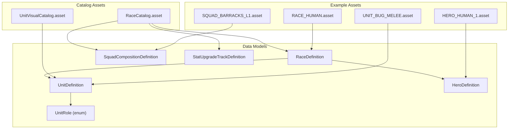
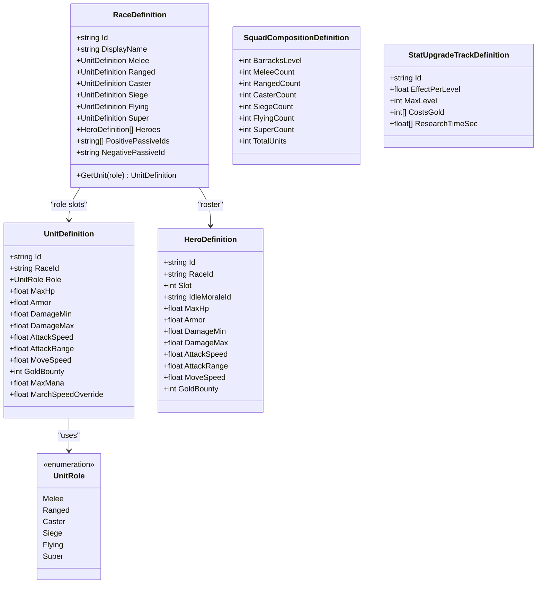
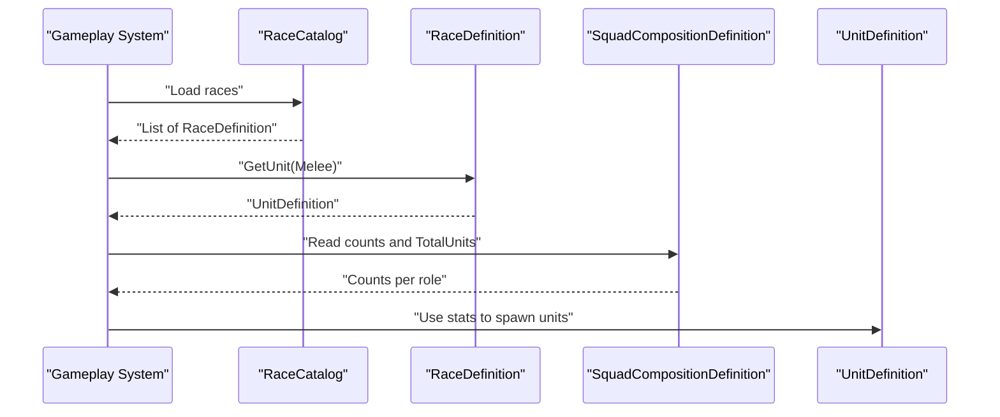
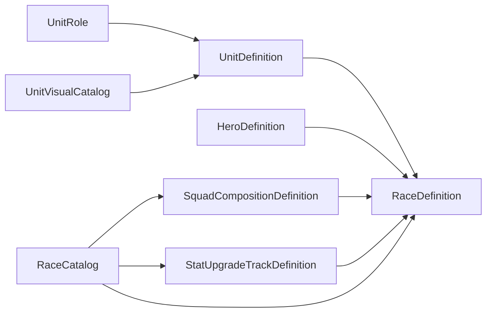

# Core Data Models

<cite>
**Referenced Files in This Document**
- [UnitDefinition.cs](file://Assets/Game/Scripts/Runtime/Gameplay/Data/UnitDefinition.cs)
- [RaceDefinition.cs](file://Assets/Game/Scripts/Runtime/Gameplay/Data/RaceDefinition.cs)
- [HeroDefinition.cs](file://Assets/Game/Scripts/Runtime/Gameplay/Data/HeroDefinition.cs)
- [SquadCompositionDefinition.cs](file://Assets/Game/Scripts/Runtime/Gameplay/Data/SquadCompositionDefinition.cs)
- [StatUpgradeTrackDefinition.cs](file://Assets/Game/Scripts/Runtime/Gameplay/Data/StatUpgradeTrackDefinition.cs)
- [UnitRole.cs](file://Assets/Game/Scripts/Runtime/Gameplay/Data/UnitRole.cs)
- [RACE_HUMAN.asset](file://Assets/Game/ScriptableObjects/Races/RACE_HUMAN.asset)
- [UNIT_BUG_MELEE.asset](file://Assets/Game/ScriptableObjects/Units/UNIT_BUG_MELEE.asset)
- [HERO_HUMAN_1.asset](file://Assets/Game/ScriptableObjects/Heroes/HERO_HUMAN_1.asset)
- [SQUAD_BARRACKS_L1.asset](file://Assets/Game/ScriptableObjects/Squads/SQUAD_BARRACKS_L1.asset)
- [RaceCatalog.asset](file://Assets/Game/ScriptableObjects/RaceCatalog.asset)
- [UnitVisualCatalog.asset](file://Assets/Game/ScriptableObjects/UnitVisualCatalog.asset)
</cite>

## Table of Contents
1. Introduction
2. Project Structure
3. Core Components
4. Architecture Overview
5. Detailed Component Analysis
6. Dependency Analysis
7. Performance Considerations
8. Troubleshooting Guide
9. Conclusion

## Introduction
This document provides comprehensive data model documentation for BARAKI’s core ScriptableObject definitions used to describe units, races, heroes, squad compositions, and stat upgrade tracks. It explains entity relationships, field definitions, data types, validation rules, business logic constraints, the SCREAMING_SNAKE identifier system, default value strategies, serialization considerations, and how these models interact with gameplay systems. Concrete examples are drawn from actual asset files in the repository.

## Project Structure
The data models live under the runtime gameplay data namespace and are authored as Unity ScriptableObject assets. Catalog assets aggregate references to other assets (races, squads, stat tracks), while visual catalogs map unit roles to prefabs.

**Diagram sources**
- [UnitDefinition.cs:1-37](file://Assets/Game/Scripts/Runtime/Gameplay/Data/UnitDefinition.cs#L1-L37)
- [RaceDefinition.cs:1-45](file://Assets/Game/Scripts/Runtime/Gameplay/Data/RaceDefinition.cs#L1-L45)
- [HeroDefinition.cs:1-35](file://Assets/Game/Scripts/Runtime/Gameplay/Data/HeroDefinition.cs#L1-L35)
- [SquadCompositionDefinition.cs:1-26](file://Assets/Game/Scripts/Runtime/Gameplay/Data/SquadCompositionDefinition.cs#L1-L26)
- [StatUpgradeTrackDefinition.cs:1-21](file://Assets/Game/Scripts/Runtime/Gameplay/Data/StatUpgradeTrackDefinition.cs#L1-L21)
- [UnitRole.cs:1-13](file://Assets/Game/Scripts/Runtime/Gameplay/Data/UnitRole.cs#L1-L13)
- [RaceCatalog.asset:1-28](file://Assets/Game/ScriptableObjects/RaceCatalog.asset#L1-L28)
- [UnitVisualCatalog.asset:1-29](file://Assets/Game/ScriptableObjects/UnitVisualCatalog.asset#L1-L29)
- [RACE_HUMAN.asset:1-31](file://Assets/Game/ScriptableObjects/Races/RACE_HUMAN.asset#L1-L31)
- [UNIT_BUG_MELEE.asset:1-28](file://Assets/Game/ScriptableObjects/Units/UNIT_BUG_MELEE.asset#L1-L28)
- [HERO_HUMAN_1.asset:1-27](file://Assets/Game/ScriptableObjects/Heroes/HERO_HUMAN_1.asset#L1-L27)
- [SQUAD_BARRACKS_L1.asset:1-22](file://Assets/Game/ScriptableObjects/Squads/SQUAD_BARRACKS_L1.asset#L1-L22)

**Section sources**
- [UnitDefinition.cs:1-37](file://Assets/Game/Scripts/Runtime/Gameplay/Data/UnitDefinition.cs#L1-L37)
- [RaceDefinition.cs:1-45](file://Assets/Game/Scripts/Runtime/Gameplay/Data/RaceDefinition.cs#L1-L45)
- [HeroDefinition.cs:1-35](file://Assets/Game/Scripts/Runtime/Gameplay/Data/HeroDefinition.cs#L1-L35)
- [SquadCompositionDefinition.cs:1-26](file://Assets/Game/Scripts/Runtime/Gameplay/Data/SquadCompositionDefinition.cs#L1-L26)
- [StatUpgradeTrackDefinition.cs:1-21](file://Assets/Game/Scripts/Runtime/Gameplay/Data/StatUpgradeTrackDefinition.cs#L1-L21)
- [UnitRole.cs:1-13](file://Assets/Game/Scripts/Runtime/Gameplay/Data/UnitRole.cs#L1-L13)
- [RaceCatalog.asset:1-28](file://Assets/Game/ScriptableObjects/RaceCatalog.asset#L1-L28)
- [UnitVisualCatalog.asset:1-29](file://Assets/Game/ScriptableObjects/UnitVisualCatalog.asset#L1-L29)
- [RACE_HUMAN.asset:1-31](file://Assets/Game/ScriptableObjects/Races/RACE_HUMAN.asset#L1-L31)
- [UNIT_BUG_MELEE.asset:1-28](file://Assets/Game/ScriptableObjects/Units/UNIT_BUG_MELEE.asset#L1-L28)
- [HERO_HUMAN_1.asset:1-27](file://Assets/Game/ScriptableObjects/Heroes/HERO_HUMAN_1.asset#L1-L27)
- [SQUAD_BARRACKS_L1.asset:1-22](file://Assets/Game/ScriptableObjects/Squads/SQUAD_BARRACKS_L1.asset#L1-L22)

## Core Components
This section summarizes each core data model, its fields, types, defaults, and constraints.

- UnitDefinition
  - Purpose: Defines a base unit type with combat stats and economy values.
  - Key fields:
    - Id: string — unique SCREAMING_SNAKE identifier for this unit type.
    - RaceId: string — foreign key referencing a RaceDefinition.Id.
    - Role: enum UnitRole — Melee, Ranged, Caster, Siege, Flying, Super.
    - MaxHp: float — default 100f.
    - Armor: float — default 0.
    - DamageMin/DamageMax: float — defaults 8f/10f.
    - AttackSpeed: float — default 1f.
    - AttackRange: float — default 1.5f.
    - MoveSpeed: float — default 4f.
    - GoldBounty: int — default 8.
    - MaxMana: float — default 0.
    - MarchSpeedOverride: float — default 0.
  - Validation notes:
    - Id must be non-empty and unique within the game.
    - RaceId must reference an existing RaceDefinition.
    - Role must be one of the defined UnitRole values.
    - Numeric stats should be non-negative; negative values may break gameplay.
  - Business logic:
    - Used by spawners, combat calculators, and UI to display unit stats.
    - March speed override can replace default movement when marching.

- RaceDefinition
  - Purpose: Groups role-specific unit definitions, hero roster, and passive IDs per race.
  - Key fields:
    - Id: string — unique SCREAMING_SNAKE identifier for the race.
    - DisplayName: string — human-readable name.
    - Melee/Ranged/Caster/Siege/Flying/Super: UnitDefinition references — role-to-unit mapping.
    - Heroes: array of HeroDefinition — available heroes for the race.
    - PositivePassiveIds: array of string — passive identifiers applied positively.
    - NegativePassiveId: string — single negative passive identifier.
  - Methods:
    - GetUnit(UnitRole): returns the UnitDefinition for the given role or null if not set.
  - Validation notes:
    - Id must be unique across races.
    - Each role slot should point to a valid UnitDefinition whose Role matches the slot and whose RaceId equals this RaceDefinition.Id.
    - Heroes must belong to this race (HeroDefinition.RaceId == this.Id).
    - Passive IDs must exist in the passive registry (if applicable).

- HeroDefinition
  - Purpose: Defines hero entities with stats and slot metadata.
  - Key fields:
    - Id: string — unique SCREAMING_SNAKE identifier.
    - RaceId: string — foreign key to RaceDefinition.Id.
    - Slot: int — hero slot index (default 1).
    - IdleMoraleId: string — morale state identifier for idle behavior.
    - Stats: similar to UnitDefinition (MaxHp, Armor, DamageMin/Max, AttackSpeed, AttackRange, MoveSpeed, GoldBounty).
  - Validation notes:
    - RaceId must match an existing RaceDefinition.
    - Slot uniqueness per race is recommended to avoid conflicts.
    - Non-negative numeric stats.

- SquadCompositionDefinition
  - Purpose: Specifies how many units of each role are produced at a given barracks level.
  - Key fields:
    - BarracksLevel: int — unlocks this composition.
    - Counts per role: melee/ranged/caster/siege/flying/super (int).
    - TotalUnits: computed property summing all counts.
  - Validation notes:
    - All counts must be non-negative.
    - TotalUnits should reflect the intended squad size; zero implies no units spawned.

- StatUpgradeTrackDefinition
  - Purpose: Defines a linear upgrade track with per-level effects, costs, and research times.
  - Key fields:
    - Id: string — unique SCREAMING_SNAKE identifier for the track.
    - EffectPerLevel: float — multiplier or additive effect per level (default 0.03f).
    - MaxLevel: int — maximum levels (default 9).
    - CostsGold: int[] — cost per level; length should equal MaxLevel.
    - ResearchTimeSec: float[] — time per level; length should equal MaxLevel.
  - Validation notes:
    - Arrays must have exactly MaxLevel entries.
    - Costs and times must be non-negative.

**Section sources**
- [UnitDefinition.cs:1-37](file://Assets/Game/Scripts/Runtime/Gameplay/Data/UnitDefinition.cs#L1-L37)
- [RaceDefinition.cs:1-45](file://Assets/Game/Scripts/Runtime/Gameplay/Data/RaceDefinition.cs#L1-L45)
- [HeroDefinition.cs:1-35](file://Assets/Game/Scripts/Runtime/Gameplay/Data/HeroDefinition.cs#L1-L35)
- [SquadCompositionDefinition.cs:1-26](file://Assets/Game/Scripts/Runtime/Gameplay/Data/SquadCompositionDefinition.cs#L1-L26)
- [StatUpgradeTrackDefinition.cs:1-21](file://Assets/Game/Scripts/Runtime/Gameplay/Data/StatUpgradeTrackDefinition.cs#L1-L21)
- [UnitRole.cs:1-13](file://Assets/Game/Scripts/Runtime/Gameplay/Data/UnitRole.cs#L1-L13)

## Architecture Overview
The data models form a cohesive graph where Races compose Units and Heroes, Squads define production quantities, and Upgrade Tracks provide progression parameters. Catalogs centralize references for efficient loading.

**Diagram sources**
- [UnitDefinition.cs:1-37](file://Assets/Game/Scripts/Runtime/Gameplay/Data/UnitDefinition.cs#L1-L37)
- [RaceDefinition.cs:1-45](file://Assets/Game/Scripts/Runtime/Gameplay/Data/RaceDefinition.cs#L1-L45)
- [HeroDefinition.cs:1-35](file://Assets/Game/Scripts/Runtime/Gameplay/Data/HeroDefinition.cs#L1-L35)
- [SquadCompositionDefinition.cs:1-26](file://Assets/Game/Scripts/Runtime/Gameplay/Data/SquadCompositionDefinition.cs#L1-L26)
- [StatUpgradeTrackDefinition.cs:1-21](file://Assets/Game/Scripts/Runtime/Gameplay/Data/StatUpgradeTrackDefinition.cs#L1-L21)
- [UnitRole.cs:1-13](file://Assets/Game/Scripts/Runtime/Gameplay/Data/UnitRole.cs#L1-L13)

## Detailed Component Analysis

### UnitDefinition
- Responsibilities:
  - Encapsulates baseline combat and economic attributes for a unit type.
  - Provides read-only accessors for safe consumption by gameplay systems.
- Field details and defaults:
  - Id: string — required, unique.
  - RaceId: string — FK to RaceDefinition.Id.
  - Role: UnitRole — determines classification and selection via RaceDefinition.GetUnit.
  - MaxHp: float — default 100f.
  - Armor: float — default 0.
  - DamageMin/DamageMax: float — defaults 8f/10f.
  - AttackSpeed: float — default 1f.
  - AttackRange: float — default 1.5f.
  - MoveSpeed: float — default 4f.
  - GoldBounty: int — default 8.
  - MaxMana: float — default 0.
  - MarchSpeedOverride: float — default 0.
- Validation rules:
  - Id non-empty and unique.
  - RaceId must resolve to a valid RaceDefinition.
  - Role must be a defined UnitRole.
  - Numeric fields non-negative unless explicitly allowed.
- Business logic usage:
  - Combat calculations use damage range, attack speed, armor, and range.
  - Economy uses gold bounty on death.
  - Movement uses move speed or march speed override during marches.

**Section sources**
- [UnitDefinition.cs:1-37](file://Assets/Game/Scripts/Runtime/Gameplay/Data/UnitDefinition.cs#L1-L37)
- [UNIT_BUG_MELEE.asset:1-28](file://Assets/Game/ScriptableObjects/Units/UNIT_BUG_MELEE.asset#L1-L28)

### RaceDefinition
- Responsibilities:
  - Aggregates role-based unit definitions and hero rosters for a race.
  - Exposes helper method to retrieve a unit by role.
- Field details:
  - Id: string — unique race identifier.
  - DisplayName: string — localized or readable name.
  - Role slots: UnitDefinition references for Melee/Ranged/Caster/Siege/Flying/Super.
  - Heroes: array of HeroDefinition.
  - PositivePassiveIds: array of string.
  - NegativePassiveId: string.
- Method:
  - GetUnit(UnitRole): returns the corresponding UnitDefinition or null.
- Validation rules:
  - Id unique across races.
  - Each role slot points to a UnitDefinition with matching Role and RaceId.
  - Heroes must have RaceId equal to this race Id.
  - Passive IDs must exist in their respective registries.
- Business logic usage:
  - Determines which units are available to a player based on race.
  - Drives passive application logic using positive/negative passive IDs.

**Section sources**
- [RaceDefinition.cs:1-45](file://Assets/Game/Scripts/Runtime/Gameplay/Data/RaceDefinition.cs#L1-L45)
- [RACE_HUMAN.asset:1-31](file://Assets/Game/ScriptableObjects/Races/RACE_HUMAN.asset#L1-L31)

### HeroDefinition
- Responsibilities:
  - Defines hero entities with stats and slot metadata.
- Field details:
  - Id: string — unique hero identifier.
  - RaceId: string — FK to RaceDefinition.Id.
  - Slot: int — hero slot index (default 1).
  - IdleMoraleId: string — morale state id.
  - Stats: similar to UnitDefinition (MaxHp, Armor, DamageMin/Max, AttackSpeed, AttackRange, MoveSpeed, GoldBounty).
- Validation rules:
  - RaceId must match an existing race.
  - Slot uniqueness per race is recommended.
  - Non-negative numeric stats.
- Business logic usage:
  - Spawns hero instances with appropriate stats and morale states.
  - Integrates with UI for hero selection and display.

**Section sources**
- [HeroDefinition.cs:1-35](file://Assets/Game/Scripts/Runtime/Gameplay/Data/HeroDefinition.cs#L1-L35)
- [HERO_HUMAN_1.asset:1-27](file://Assets/Game/ScriptableObjects/Heroes/HERO_HUMAN_1.asset#L1-L27)

### SquadCompositionDefinition
- Responsibilities:
  - Defines the number of units per role at a specific barracks level.
- Field details:
  - BarracksLevel: int — unlocks this composition.
  - Counts per role: melee/ranged/caster/siege/flying/super (int).
  - TotalUnits: computed sum of all counts.
- Validation rules:
  - All counts non-negative.
  - TotalUnits reflects intended squad size.
- Business logic usage:
  - Production systems consume this to determine unit spawns per wave or batch.

**Section sources**
- [SquadCompositionDefinition.cs:1-26](file://Assets/Game/Scripts/Runtime/Gameplay/Data/SquadCompositionDefinition.cs#L1-L26)
- [SQUAD_BARRACKS_L1.asset:1-22](file://Assets/Game/ScriptableObjects/Squads/SQUAD_BARRACKS_L1.asset#L1-L22)

### StatUpgradeTrackDefinition
- Responsibilities:
  - Describes a linear upgrade track with per-level effects, costs, and research times.
- Field details:
  - Id: string — unique track identifier.
  - EffectPerLevel: float — effect increment per level (default 0.03f).
  - MaxLevel: int — maximum levels (default 9).
  - CostsGold: int[] — cost per level; length must equal MaxLevel.
  - ResearchTimeSec: float[] — time per level; length must equal MaxLevel.
- Validation rules:
  - Array lengths must equal MaxLevel.
  - Costs and times non-negative.
- Business logic usage:
  - Research systems apply cumulative effects based on current level.
  - UI displays costs and times for each level.

**Section sources**
- [StatUpgradeTrackDefinition.cs:1-21](file://Assets/Game/Scripts/Runtime/Gameplay/Data/StatUpgradeTrackDefinition.cs#L1-L21)

### Identifier System: SCREAMING_SNAKE
- Convention:
  - Primary keys and foreign keys use SCREAMING_SNAKE identifiers (e.g., RACE_HUMAN, UNIT_BUG_MELEE, HERO_HUMAN_1).
  - Ensures stable, human-readable, and version-control-friendly IDs.
- Usage patterns:
  - UnitDefinition.RaceId references RaceDefinition.Id.
  - HeroDefinition.RaceId references RaceDefinition.Id.
  - Passives referenced by strings (e.g., PASSIVE_HUMAN_STEEL_ARMS) follow the same convention.
- Benefits:
  - Easy debugging and localization.
  - Stable cross-references across assets and scenes.

**Section sources**
- [RACE_HUMAN.asset:1-31](file://Assets/Game/ScriptableObjects/Races/RACE_HUMAN.asset#L1-L31)
- [UNIT_BUG_MELEE.asset:1-28](file://Assets/Game/ScriptableObjects/Units/UNIT_BUG_MELEE.asset#L1-L28)
- [HERO_HUMAN_1.asset:1-27](file://Assets/Game/ScriptableObjects/Heroes/HERO_HUMAN_1.asset#L1-L27)

### Data Validation Patterns
- Recommended validations:
  - Uniqueness checks for Id fields across their respective categories.
  - Foreign key integrity: ensure referenced Ids exist in catalogs.
  - Enum validity: enforce UnitRole values.
  - Non-negative constraints for numeric stats and arrays.
  - Array length consistency: CostsGold and ResearchTimeSec must match MaxLevel.
- Implementation suggestions:
  - Editor-time validation tools to warn about missing references or invalid ranges.
  - Runtime asserts for critical invariants (e.g., GetUnit returning null).

[No sources needed since this section provides general guidance]

### Default Value Strategies
- Defaults observed:
  - UnitDefinition.MaxHp = 100f, DamageMin = 8f, DamageMax = 10f, AttackSpeed = 1f, AttackRange = 1.5f, MoveSpeed = 4f, GoldBounty = 8, MaxMana = 0, MarchSpeedOverride = 0.
  - HeroDefinition.Slot = 1, MaxHp = 600f, Armor = 4f, DamageMin = 35f, DamageMax = 45f, AttackSpeed = 1f, AttackRange = 1.5f, MoveSpeed = 4f, GoldBounty = 80.
  - StatUpgradeTrackDefinition.EffectPerLevel = 0.03f, MaxLevel = 9.
- Strategy:
  - Provide sensible defaults to reduce authoring overhead.
  - Allow overrides per asset for balance tuning.

**Section sources**
- [UnitDefinition.cs:1-37](file://Assets/Game/Scripts/Runtime/Gameplay/Data/UnitDefinition.cs#L1-L37)
- [HeroDefinition.cs:1-35](file://Assets/Game/Scripts/Runtime/Gameplay/Data/HeroDefinition.cs#L1-L35)
- [StatUpgradeTrackDefinition.cs:1-21](file://Assets/Game/Scripts/Runtime/Gameplay/Data/StatUpgradeTrackDefinition.cs#L1-L21)

### Serialization Considerations
- Unity serialization:
  - Fields are serialized via [SerializeField]; public properties expose read-only access.
  - References to other ScriptableObjects are preserved in YAML assets.
- Asset naming:
  - Filenames often mirror Ids (e.g., RACE_HUMAN.asset, UNIT_BUG_MELEE.asset) aiding discoverability.
- Catalogs:
  - RaceCatalog.asset aggregates lists of races, squad compositions, and stat tracks.
  - UnitVisualCatalog.asset maps race-role pairs to prefab references for instantiation.

**Section sources**
- [RaceCatalog.asset:1-28](file://Assets/Game/ScriptableObjects/RaceCatalog.asset#L1-L28)
- [UnitVisualCatalog.asset:1-29](file://Assets/Game/ScriptableObjects/UnitVisualCatalog.asset#L1-L29)

### Gameplay Integration Examples
- Spawn flow using RaceDefinition and SquadCompositionDefinition:
  - Load RaceDefinition by Id.
  - Use GetUnit(UnitRole) to obtain role-specific UnitDefinition.
  - Read SquadCompositionDefinition.TotalUnits and per-role counts to spawn batches.
- Upgrade flow using StatUpgradeTrackDefinition:
  - For each level up to MaxLevel, apply EffectPerLevel cumulatively.
  - Display CostsGold[i] and ResearchTimeSec[i] for each level i.

**Diagram sources**
- [RaceCatalog.asset:1-28](file://Assets/Game/ScriptableObjects/RaceCatalog.asset#L1-L28)
- [RaceDefinition.cs:1-45](file://Assets/Game/Scripts/Runtime/Gameplay/Data/RaceDefinition.cs#L1-L45)
- [SquadCompositionDefinition.cs:1-26](file://Assets/Game/Scripts/Runtime/Gameplay/Data/SquadCompositionDefinition.cs#L1-L26)
- [UnitDefinition.cs:1-37](file://Assets/Game/Scripts/Runtime/Gameplay/Data/UnitDefinition.cs#L1-L37)

## Dependency Analysis
- Direct dependencies:
  - RaceDefinition depends on UnitDefinition and HeroDefinition.
  - UnitDefinition depends on UnitRole enum.
  - Catalog assets depend on multiple data models.
- Indirect dependencies:
  - Visual catalog depends on UnitDefinition indirectly through role mappings.
- Cohesion and coupling:
  - High cohesion within each data model.
  - Moderate coupling via Id-based references; catalogs centralize dependency resolution.

**Diagram sources**
- [UnitRole.cs:1-13](file://Assets/Game/Scripts/Runtime/Gameplay/Data/UnitRole.cs#L1-L13)
- [UnitDefinition.cs:1-37](file://Assets/Game/Scripts/Runtime/Gameplay/Data/UnitDefinition.cs#L1-L37)
- [RaceDefinition.cs:1-45](file://Assets/Game/Scripts/Runtime/Gameplay/Data/RaceDefinition.cs#L1-L45)
- [HeroDefinition.cs:1-35](file://Assets/Game/Scripts/Runtime/Gameplay/Data/HeroDefinition.cs#L1-L35)
- [SquadCompositionDefinition.cs:1-26](file://Assets/Game/Scripts/Runtime/Gameplay/Data/SquadCompositionDefinition.cs#L1-L26)
- [StatUpgradeTrackDefinition.cs:1-21](file://Assets/Game/Scripts/Runtime/Gameplay/Data/StatUpgradeTrackDefinition.cs#L1-L21)
- [RaceCatalog.asset:1-28](file://Assets/Game/ScriptableObjects/RaceCatalog.asset#L1-L28)
- [UnitVisualCatalog.asset:1-29](file://Assets/Game/ScriptableObjects/UnitVisualCatalog.asset#L1-L29)

**Section sources**
- [UnitRole.cs:1-13](file://Assets/Game/Scripts/Runtime/Gameplay/Data/UnitRole.cs#L1-L13)
- [UnitDefinition.cs:1-37](file://Assets/Game/Scripts/Runtime/Gameplay/Data/UnitDefinition.cs#L1-L37)
- [RaceDefinition.cs:1-45](file://Assets/Game/Scripts/Runtime/Gameplay/Data/RaceDefinition.cs#L1-L45)
- [HeroDefinition.cs:1-35](file://Assets/Game/Scripts/Runtime/Gameplay/Data/HeroDefinition.cs#L1-L35)
- [SquadCompositionDefinition.cs:1-26](file://Assets/Game/Scripts/Runtime/Gameplay/Data/SquadCompositionDefinition.cs#L1-L26)
- [StatUpgradeTrackDefinition.cs:1-21](file://Assets/Game/Scripts/Runtime/Gameplay/Data/StatUpgradeTrackDefinition.cs#L1-L21)
- [RaceCatalog.asset:1-28](file://Assets/Game/ScriptableObjects/RaceCatalog.asset#L1-L28)
- [UnitVisualCatalog.asset:1-29](file://Assets/Game/ScriptableObjects/UnitVisualCatalog.asset#L1-L29)

## Performance Considerations
- Avoid repeated lookups by caching resolved references in runtime managers.
- Precompute derived values (e.g., average damage) if frequently accessed.
- Keep arrays small and aligned with MaxLevel to minimize memory overhead.
- Use readonly properties to prevent accidental mutation of data models.

[No sources needed since this section provides general guidance]

## Troubleshooting Guide
Common issues and resolutions:
- Null reference when calling RaceDefinition.GetUnit:
  - Ensure the requested UnitRole has a valid UnitDefinition assigned.
  - Validate that the UnitDefinition.Role matches the slot and RaceId equals the parent race.
- Missing passive IDs:
  - Verify PositivePassiveIds and NegativePassiveId exist in the passive registry.
- Invalid upgrade track arrays:
  - Confirm CostsGold and ResearchTimeSec lengths equal MaxLevel.
- Incorrect squad sizes:
  - Check SquadCompositionDefinition counts and TotalUnits consistency.

**Section sources**
- [RaceDefinition.cs:1-45](file://Assets/Game/Scripts/Runtime/Gameplay/Data/RaceDefinition.cs#L1-L45)
- [StatUpgradeTrackDefinition.cs:1-21](file://Assets/Game/Scripts/Runtime/Gameplay/Data/StatUpgradeTrackDefinition.cs#L1-L21)
- [SquadCompositionDefinition.cs:1-26](file://Assets/Game/Scripts/Runtime/Gameplay/Data/SquadCompositionDefinition.cs#L1-L26)

## Conclusion
BARAKI’s core data models provide a clear, extensible foundation for defining units, races, heroes, squad compositions, and upgrade tracks. The SCREAMING_SNAKE identifier system ensures robust cross-referencing, while catalogs centralize asset management. Adhering to the documented validation rules and default strategies will maintain data integrity and streamline gameplay integration.