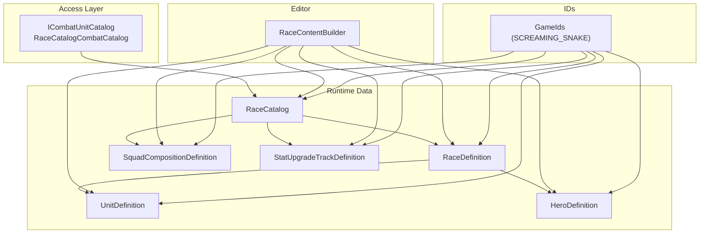
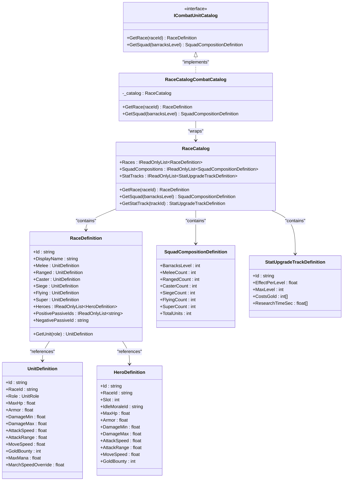
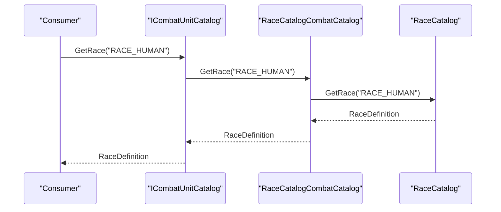
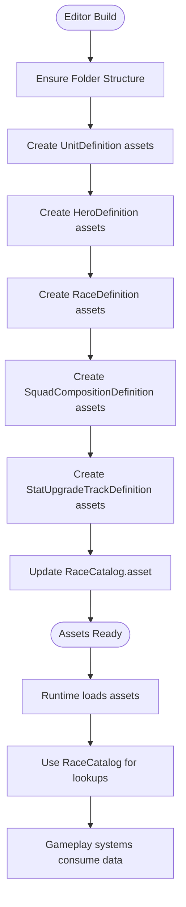
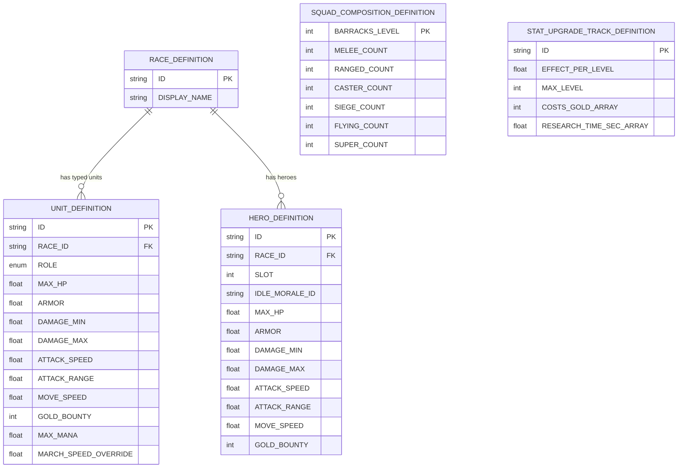
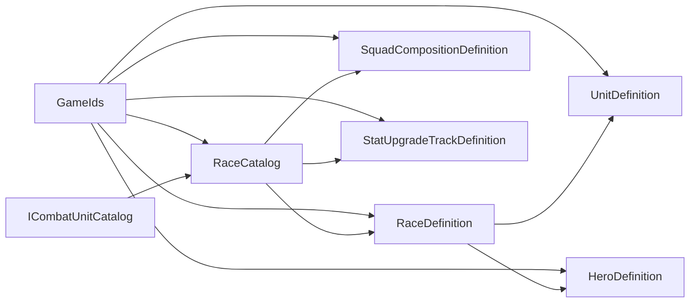

# Data-Driven Design System

<cite>
**Referenced Files in This Document**
- [RaceCatalog.cs](file://Assets/Game/Scripts/Runtime/Gameplay/Data/RaceCatalog.cs)
- [RaceDefinition.cs](file://Assets/Game/Scripts/Runtime/Gameplay/Data/RaceDefinition.cs)
- [UnitDefinition.cs](file://Assets/Game/Scripts/Runtime/Gameplay/Data/UnitDefinition.cs)
- [HeroDefinition.cs](file://Assets/Game/Scripts/Runtime/Gameplay/Data/HeroDefinition.cs)
- [SquadCompositionDefinition.cs](file://Assets/Game/Scripts/Runtime/Gameplay/Data/SquadCompositionDefinition.cs)
- [StatUpgradeTrackDefinition.cs](file://Assets/Game/Scripts/Runtime/Gameplay/Data/StatUpgradeTrackDefinition.cs)
- [ICombatUnitCatalog.cs](file://Assets/Game/Scripts/Runtime/Gameplay/Combat/ICombatUnitCatalog.cs)
- [GameIds.cs](file://Assets/Game/Scripts/Runtime/Core/GameIds.cs)
- [RaceContentBuilder.cs](file://Assets/Game/Scripts/Editor/RaceContentBuilder.cs)
- [RaceCatalog.asset](file://Assets/Game/ScriptableObjects/RaceCatalog.asset)
- [Units.md](file://Assets/Game/GameDesign/Units.md)
</cite>

## Table of Contents
1. Introduction
2. Project Structure
3. Core Components
4. Architecture Overview
5. Detailed Component Analysis
6. Dependency Analysis
7. Performance Considerations
8. Troubleshooting Guide
9. Conclusion
10. Appendices

## Introduction
This document describes BARAKI’s data-driven design system built on Unity ScriptableObjects. It focuses on the entity relationships between UnitDefinition, RaceDefinition, and RaceCatalog, including field definitions, data types, validation rules, primary/foreign key semantics using SCREAMING_SNAKE identifiers, and how races connect to units, heroes, squad compositions, and upgrade tracks. It also documents data access patterns through catalogs and builders, caching strategies, serialization considerations, lifecycle from editor creation to runtime instantiation, migration paths for balancing changes, and runtime security/validation.

## Project Structure
The data model is implemented as a set of ScriptableObject assets under Assets/Game/ScriptableObjects, with runtime classes under Assets/Game/Scripts/Runtime/Gameplay/Data and supporting interfaces under Combat. An Editor builder populates baseline content and maintains the central catalog asset.

**Diagram sources**
- [RaceCatalog.cs:1-28](file://Assets/Game/Scripts/Runtime/Gameplay/Data/RaceCatalog.cs#L1-L28)
- [RaceDefinition.cs:1-45](file://Assets/Game/Scripts/Runtime/Gameplay/Data/RaceDefinition.cs#L1-L45)
- [UnitDefinition.cs:1-37](file://Assets/Game/Scripts/Runtime/Gameplay/Data/UnitDefinition.cs#L1-L37)
- [HeroDefinition.cs:1-34](file://Assets/Game/Scripts/Runtime/Gameplay/Data/HeroDefinition.cs#L1-L34)
- [SquadCompositionDefinition.cs:1-26](file://Assets/Game/Scripts/Runtime/Gameplay/Data/SquadCompositionDefinition.cs#L1-L26)
- [StatUpgradeTrackDefinition.cs:1-21](file://Assets/Game/Scripts/Runtime/Gameplay/Data/StatUpgradeTrackDefinition.cs#L1-L21)
- [ICombatUnitCatalog.cs:1-24](file://Assets/Game/Scripts/Runtime/Gameplay/Combat/ICombatUnitCatalog.cs#L1-L24)
- [RaceContentBuilder.cs:1-352](file://Assets/Game/Scripts/Editor/RaceContentBuilder.cs#L1-L352)
- [GameIds.cs:1-165](file://Assets/Game/Scripts/Runtime/Core/GameIds.cs#L1-L165)

**Section sources**
- [RaceCatalog.cs:1-28](file://Assets/Game/Scripts/Runtime/Gameplay/Data/RaceCatalog.cs#L1-L28)
- [RaceDefinition.cs:1-45](file://Assets/Game/Scripts/Runtime/Gameplay/Data/RaceDefinition.cs#L1-L45)
- [UnitDefinition.cs:1-37](file://Assets/Game/Scripts/Runtime/Gameplay/Data/UnitDefinition.cs#L1-L37)
- [HeroDefinition.cs:1-34](file://Assets/Game/Scripts/Runtime/Gameplay/Data/HeroDefinition.cs#L1-L34)
- [SquadCompositionDefinition.cs:1-26](file://Assets/Game/Scripts/Runtime/Gameplay/Data/SquadCompositionDefinition.cs#L1-L26)
- [StatUpgradeTrackDefinition.cs:1-21](file://Assets/Game/Scripts/Runtime/Gameplay/Data/StatUpgradeTrackDefinition.cs#L1-L21)
- [ICombatUnitCatalog.cs:1-24](file://Assets/Game/Scripts/Runtime/Gameplay/Combat/ICombatUnitCatalog.cs#L1-L24)
- [RaceContentBuilder.cs:1-352](file://Assets/Game/Scripts/Editor/RaceContentBuilder.cs#L1-L352)
- [GameIds.cs:1-165](file://Assets/Game/Scripts/Runtime/Core/GameIds.cs#L1-L165)

## Core Components
- RaceCatalog: Central registry holding arrays of RaceDefinition, SquadCompositionDefinition, and StatUpgradeTrackDefinition. Provides lookup methods by string IDs or integer levels.
- RaceDefinition: Represents a race with typed unit slots (Melee, Ranged, Caster, Siege, Flying, Super), hero list, and passive IDs. Includes a helper to resolve a unit by role.
- UnitDefinition: Defines per-unit stats and identity fields including role and race linkage via ID.
- HeroDefinition: Per-race hero entries with combat stats and morale references.
- SquadCompositionDefinition: Fixed squad composition per barracks level.
- StatUpgradeTrackDefinition: Upgrade track metadata with effect scaling, max level, costs, and research times.

Key relationships:
- RaceDefinition contains references to UnitDefinition instances for each role and an array of HeroDefinition.
- RaceCatalog aggregates multiple RaceDefinition instances and provides indexed accessors.
- SquadCompositionDefinition and StatUpgradeTrackDefinition are referenced by RaceCatalog for gameplay progression and upgrades.

Primary/Foreign Key Semantics (SCREAMING_SNAKE):
- Primary keys:
  - RaceDefinition.Id (e.g., RACE_HUMAN, RACE_BUG)
  - UnitDefinition.Id (e.g., UNIT_HUMAN_MELEE)
  - HeroDefinition.Id (e.g., HERO_HUMAN_1)
  - SquadCompositionDefinition.BarracksLevel (unique per squad)
  - StatUpgradeTrackDefinition.Id (e.g., UPG_MELEE_DMG)
- Foreign keys:
  - UnitDefinition.RaceId references RaceDefinition.Id
  - RaceDefinition.Melee/Ranged/Caster/Siege/Flying/Super reference UnitDefinition.Id
  - RaceDefinition.Heroes[] reference HeroDefinition.Id
  - GameIds constants provide canonical SCREAMING_SNAKE values used across assets and code.

Data types and defaults:
- Strings for stable IDs; floats for numeric stats; ints for counts and levels; arrays for collections.
- Defaults are present for some numeric fields (e.g., MaxHp, DamageMin/Max, AttackSpeed, MoveSpeed, GoldBounty).

Validation rules enforced at runtime:
- Catalog lookups return null when IDs do not match any entry.
- UnitRole resolution returns null for unknown roles.
- Tests assert non-null results and expected totals for squads and caster mana.

**Section sources**
- [RaceCatalog.cs:1-28](file://Assets/Game/Scripts/Runtime/Gameplay/Data/RaceCatalog.cs#L1-L28)
- [RaceDefinition.cs:1-45](file://Assets/Game/Scripts/Runtime/Gameplay/Data/RaceDefinition.cs#L1-L45)
- [UnitDefinition.cs:1-37](file://Assets/Game/Scripts/Runtime/Gameplay/Data/UnitDefinition.cs#L1-L37)
- [HeroDefinition.cs:1-34](file://Assets/Game/Scripts/Runtime/Gameplay/Data/HeroDefinition.cs#L1-L34)
- [SquadCompositionDefinition.cs:1-26](file://Assets/Game/Scripts/Runtime/Gameplay/Data/SquadCompositionDefinition.cs#L1-L26)
- [StatUpgradeTrackDefinition.cs:1-21](file://Assets/Game/Scripts/Runtime/Gameplay/Data/StatUpgradeTrackDefinition.cs#L1-L21)
- [GameIds.cs:1-165](file://Assets/Game/Scripts/Runtime/Core/GameIds.cs#L1-L165)

## Architecture Overview
The data architecture centers on immutable, serialized definitions accessed via a catalog interface. The catalog abstracts direct array access and provides keyed retrieval. The combat layer consumes the catalog through an interface to decouple gameplay logic from concrete storage.

**Diagram sources**
- [RaceCatalog.cs:1-28](file://Assets/Game/Scripts/Runtime/Gameplay/Data/RaceCatalog.cs#L1-L28)
- [RaceDefinition.cs:1-45](file://Assets/Game/Scripts/Runtime/Gameplay/Data/RaceDefinition.cs#L1-L45)
- [UnitDefinition.cs:1-37](file://Assets/Game/Scripts/Runtime/Gameplay/Data/UnitDefinition.cs#L1-L37)
- [HeroDefinition.cs:1-34](file://Assets/Game/Scripts/Runtime/Gameplay/Data/HeroDefinition.cs#L1-L34)
- [SquadCompositionDefinition.cs:1-26](file://Assets/Game/Scripts/Runtime/Gameplay/Data/SquadCompositionDefinition.cs#L1-L26)
- [StatUpgradeTrackDefinition.cs:1-21](file://Assets/Game/Scripts/Runtime/Gameplay/Data/StatUpgradeTrackDefinition.cs#L1-L21)
- [ICombatUnitCatalog.cs:1-24](file://Assets/Game/Scripts/Runtime/Gameplay/Combat/ICombatUnitCatalog.cs#L1-L24)

## Detailed Component Analysis

### RaceCatalog
Responsibilities:
- Holds arrays of core definitions and exposes read-only lists.
- Provides lookup methods by string ID or integer level.
- Acts as the single source of truth for game data during runtime.

Key behaviors:
- GetRace uses first-match equality on Id.
- GetSquad matches BarracksLevel.
- GetStatTrack matches Id.

Performance notes:
- Linear scans over small arrays; acceptable for current scale. For larger datasets, consider building internal dictionaries keyed by Id/BarracksLevel.

**Section sources**
- [RaceCatalog.cs:1-28](file://Assets/Game/Scripts/Runtime/Gameplay/Data/RaceCatalog.cs#L1-L28)

### RaceDefinition
Responsibilities:
- Encapsulates a race’s identity, display name, and typed unit slots.
- Exposes hero list and passive IDs.
- Provides GetUnit(UnitRole) convenience method.

Validation:
- Returns null for unknown roles.

**Section sources**
- [RaceDefinition.cs:1-45](file://Assets/Game/Scripts/Runtime/Gameplay/Data/RaceDefinition.cs#L1-L45)

### UnitDefinition
Responsibilities:
- Stores unit identity, role, and combat/economy stats.
- Links back to its race via RaceId.

Defaults:
- Numeric fields have sensible defaults (e.g., MaxHp, DamageMin/Max, AttackSpeed, MoveSpeed, GoldBounty).

**Section sources**
- [UnitDefinition.cs:1-37](file://Assets/Game/Scripts/Runtime/Gameplay/Data/UnitDefinition.cs#L1-L37)

### HeroDefinition
Responsibilities:
- Per-race hero definition with slot assignment and morale ID.
- Similar stat schema to UnitDefinition.

**Section sources**
- [HeroDefinition.cs:1-34](file://Assets/Game/Scripts/Runtime/Gameplay/Data/HeroDefinition.cs#L1-L34)

### SquadCompositionDefinition
Responsibilities:
- Declares fixed counts per unit role for a given barracks level.
- Computes TotalUnits as a derived property.

**Section sources**
- [SquadCompositionDefinition.cs:1-26](file://Assets/Game/Scripts/Runtime/Gameplay/Data/SquadCompositionDefinition.cs#L1-L26)

### StatUpgradeTrackDefinition
Responsibilities:
- Defines upgrade track parameters: effect scaling, max level, gold cost curve, and research time curve.

**Section sources**
- [StatUpgradeTrackDefinition.cs:1-21](file://Assets/Game/Scripts/Runtime/Gameplay/Data/StatUpgradeTrackDefinition.cs#L1-L21)

### Data Access Patterns
- Interface-based access via ICombatUnitCatalog allows swapping implementations without changing consumers.
- RaceCatalogCombatCatalog wraps RaceCatalog and forwards calls.

**Diagram sources**
- [ICombatUnitCatalog.cs:1-24](file://Assets/Game/Scripts/Runtime/Gameplay/Combat/ICombatUnitCatalog.cs#L1-L24)
- [RaceCatalog.cs:1-28](file://Assets/Game/Scripts/Runtime/Gameplay/Data/RaceCatalog.cs#L1-L28)

**Section sources**
- [ICombatUnitCatalog.cs:1-24](file://Assets/Game/Scripts/Runtime/Gameplay/Combat/ICombatUnitCatalog.cs#L1-L24)

### Data Lifecycle: Editor Creation to Runtime Instantiation
- Editor: RaceContentBuilder ensures folders exist, creates or updates ScriptableObject assets (units, heroes, races, squads, upgrades), and writes the central RaceCatalog.asset.
- Runtime: Assets are loaded into memory as ScriptableObject instances; RaceCatalog provides keyed access.

**Diagram sources**
- [RaceContentBuilder.cs:1-352](file://Assets/Game/Scripts/Editor/RaceContentBuilder.cs#L1-L352)
- [RaceCatalog.asset:1-28](file://Assets/Game/ScriptableObjects/RaceCatalog.asset#L1-L28)

**Section sources**
- [RaceContentBuilder.cs:1-352](file://Assets/Game/Scripts/Editor/RaceContentBuilder.cs#L1-L352)
- [RaceCatalog.asset:1-28](file://Assets/Game/ScriptableObjects/RaceCatalog.asset#L1-L28)

### Database Schema Diagram (Conceptual Mapping)
Although data is stored as Unity assets, the following conceptual ER diagram maps the relationships among entities and their SCREAMING_SNAKE identifiers.

[No sources needed since this diagram shows conceptual mapping, not actual database tables]

### Validation Rules and Security Considerations
- Null safety: Catalog getters return null if no match found; consumers must guard against nulls.
- Role resolution: Unknown roles yield null from RaceDefinition.GetUnit.
- ID consistency: GameIds provides canonical SCREAMING_SNAKE strings; tests verify uniqueness and GDD alignment.
- Sanity checks: Tests assert squad totals and caster mana presence.

Recommended runtime validations:
- Assert non-null after GetRace/GetSquad/GetStatTrack before use.
- Validate that UnitDefinition.RaceId exists in RaceCatalog.
- Validate array lengths for CostsGold and ResearchTimeSec match MaxLevel.

Security considerations:
- Treat all external inputs (e.g., saved IDs) as untrusted; validate against known sets.
- Avoid executing arbitrary behavior based solely on string IDs; prefer enums or validated lookups.

**Section sources**
- [RaceCatalog.cs:1-28](file://Assets/Game/Scripts/Runtime/Gameplay/Data/RaceCatalog.cs#L1-L28)
- [RaceDefinition.cs:1-45](file://Assets/Game/Scripts/Runtime/Gameplay/Data/RaceDefinition.cs#L1-L45)
- [GameIds.cs:1-165](file://Assets/Game/Scripts/Runtime/Core/GameIds.cs#L1-L165)

### Data Migration Paths and Version Management
- Baseline generation: RaceContentBuilder.EnsureContent creates or updates assets deterministically from GDD baselines.
- Balancing changes:
  - Adjust numeric fields in existing assets or regenerate via builder.
  - Keep SCREAMING_SNAKE IDs stable to avoid breaking references.
- Versioning strategy:
  - Maintain a versioned copy of assets or use branching for major balance passes.
  - Track changes in GDD documents and ensure GameIds remain consistent.

**Section sources**
- [RaceContentBuilder.cs:1-352](file://Assets/Game/Scripts/Editor/RaceContentBuilder.cs#L1-L352)
- [Units.md:1-75](file://Assets/Game/GameDesign/Units.md#L1-L75)

## Dependency Analysis
The data layer depends on stable identifiers and is consumed by higher layers through an interface.

**Diagram sources**
- [GameIds.cs:1-165](file://Assets/Game/Scripts/Runtime/Core/GameIds.cs#L1-L165)
- [RaceCatalog.cs:1-28](file://Assets/Game/Scripts/Runtime/Gameplay/Data/RaceCatalog.cs#L1-L28)
- [RaceDefinition.cs:1-45](file://Assets/Game/Scripts/Runtime/Gameplay/Data/RaceDefinition.cs#L1-L45)
- [UnitDefinition.cs:1-37](file://Assets/Game/Scripts/Runtime/Gameplay/Data/UnitDefinition.cs#L1-L37)
- [HeroDefinition.cs:1-34](file://Assets/Game/Scripts/Runtime/Gameplay/Data/HeroDefinition.cs#L1-L34)
- [SquadCompositionDefinition.cs:1-26](file://Assets/Game/Scripts/Runtime/Gameplay/Data/SquadCompositionDefinition.cs#L1-L26)
- [StatUpgradeTrackDefinition.cs:1-21](file://Assets/Game/Scripts/Runtime/Gameplay/Data/StatUpgradeTrackDefinition.cs#L1-L21)
- [ICombatUnitCatalog.cs:1-24](file://Assets/Game/Scripts/Runtime/Gameplay/Combat/ICombatUnitCatalog.cs#L1-L24)

**Section sources**
- [GameIds.cs:1-165](file://Assets/Game/Scripts/Runtime/Core/GameIds.cs#L1-L165)
- [RaceCatalog.cs:1-28](file://Assets/Game/Scripts/Runtime/Gameplay/Data/RaceCatalog.cs#L1-L28)
- [ICombatUnitCatalog.cs:1-24](file://Assets/Game/Scripts/Runtime/Gameplay/Combat/ICombatUnitCatalog.cs#L1-L24)

## Performance Considerations
- Current implementation uses linear scans over small arrays; suitable for current content size.
- Optimization opportunities:
  - Precompute and cache dictionaries in RaceCatalog keyed by Id/BarracksLevel.
  - Cache resolved UnitDefinition pointers per race and role.
  - Avoid repeated allocations by reusing result objects where safe.
- Serialization:
  - ScriptableObject assets are lightweight and efficient for static data.
  - Keep arrays compact and avoid unnecessary nested references.

[No sources needed since this section provides general guidance]

## Troubleshooting Guide
Common issues and resolutions:
- Null reference after GetRace/GetSquad/GetStatTrack:
  - Verify the requested ID exists in GameIds and matches asset configuration.
  - Ensure RaceCatalog.asset includes the required entries.
- Incorrect squad totals:
  - Confirm SquadCompositionDefinition arrays reflect intended totals.
  - Re-run RaceContentBuilder.EnsureContent to regenerate baseline.
- Missing caster mana:
  - Check UnitDefinition.MaxMana for caster roles; builder sets default for casters.

**Section sources**
- [RaceCatalog.cs:1-28](file://Assets/Game/Scripts/Runtime/Gameplay/Data/RaceCatalog.cs#L1-L28)
- [RaceContentBuilder.cs:1-352](file://Assets/Game/Scripts/Editor/RaceContentBuilder.cs#L1-L352)

## Conclusion
BARAKI’s data-driven architecture leverages ScriptableObjects for clear separation of data and logic. RaceCatalog centralizes access, while RaceDefinition, UnitDefinition, HeroDefinition, SquadCompositionDefinition, and StatUpgradeTrackDefinition define the domain model. Stable SCREAMING_SNAKE identifiers ensure consistency across assets and code. The Editor builder streamlines content creation and maintenance, and the interface-based access pattern supports future extensibility and testing.

## Appendices

### Field Definitions Summary
- RaceDefinition
  - Id: string (PK)
  - DisplayName: string
  - Melee/Ranged/Caster/Siege/Flying/Super: UnitDefinition (FK to UnitDefinition.Id)
  - Heroes: array of HeroDefinition (FK to HeroDefinition.Id)
  - PositivePassiveIds/NegativePassiveId: string arrays/scalar
- UnitDefinition
  - Id: string (PK)
  - RaceId: string (FK to RaceDefinition.Id)
  - Role: enum
  - Stats: MaxHp, Armor, DamageMin/Max, AttackSpeed, AttackRange, MoveSpeed, GoldBounty, MaxMana, MarchSpeedOverride
- HeroDefinition
  - Id: string (PK)
  - RaceId: string (FK to RaceDefinition.Id)
  - Slot: int
  - IdleMoraleId: string
  - Stats: similar to UnitDefinition
- SquadCompositionDefinition
  - BarracksLevel: int (PK)
  - Counts per role: int
  - TotalUnits: computed
- StatUpgradeTrackDefinition
  - Id: string (PK)
  - EffectPerLevel: float
  - MaxLevel: int
  - CostsGold: int[]
  - ResearchTimeSec: float[]

**Section sources**
- [RaceDefinition.cs:1-45](file://Assets/Game/Scripts/Runtime/Gameplay/Data/RaceDefinition.cs#L1-L45)
- [UnitDefinition.cs:1-37](file://Assets/Game/Scripts/Runtime/Gameplay/Data/UnitDefinition.cs#L1-L37)
- [HeroDefinition.cs:1-34](file://Assets/Game/Scripts/Runtime/Gameplay/Data/HeroDefinition.cs#L1-L34)
- [SquadCompositionDefinition.cs:1-26](file://Assets/Game/Scripts/Runtime/Gameplay/Data/SquadCompositionDefinition.cs#L1-L26)
- [StatUpgradeTrackDefinition.cs:1-21](file://Assets/Game/Scripts/Runtime/Gameplay/Data/StatUpgradeTrackDefinition.cs#L1-L21)