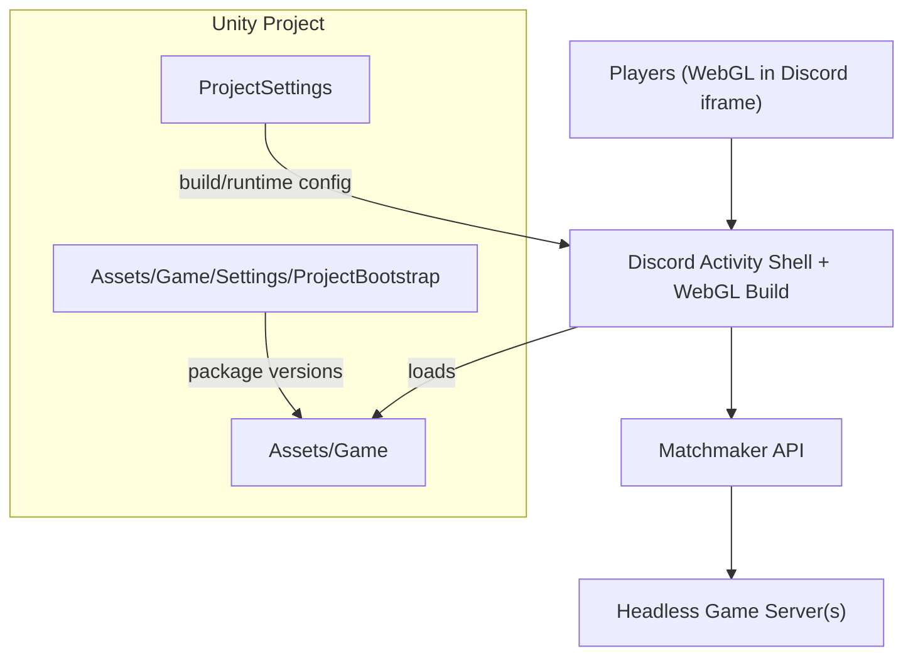
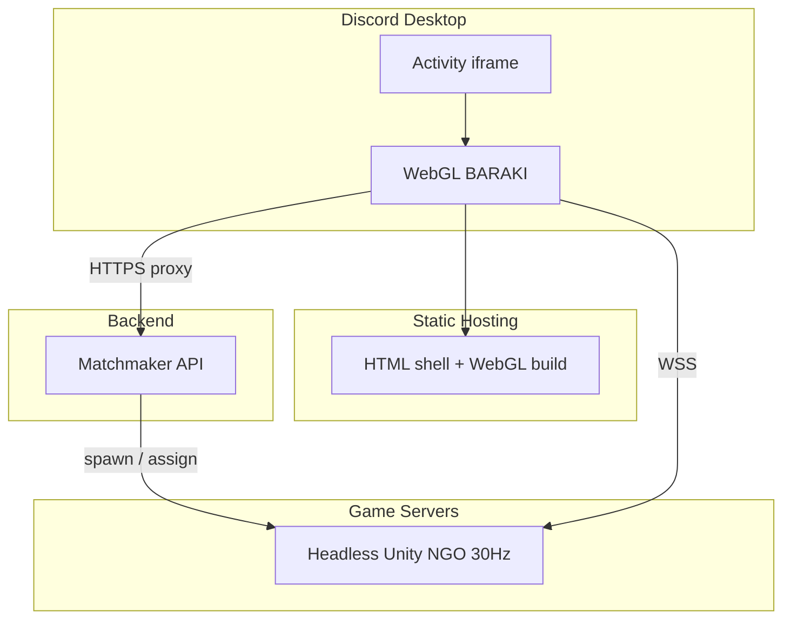
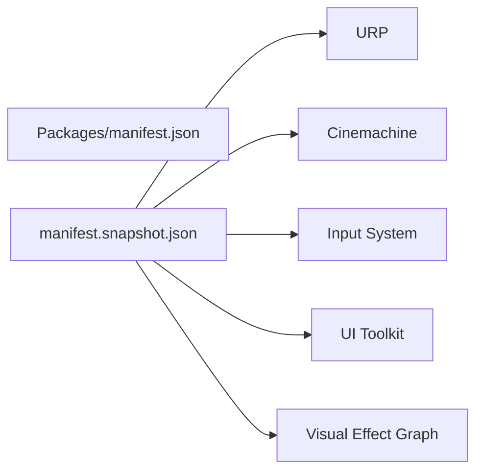

# Deployment & Distribution

<cite>
**Referenced Files in This Document**
- [Discord Platform.md](file://Assets/Game/GameDesign/Discord Platform.md)
- [ProjectSettings.asset](file://ProjectSettings/ProjectSettings.asset)
- [GraphicsSettings.asset](file://ProjectSettings/GraphicsSettings.asset)
- [EditorSettings.asset](file://ProjectSettings/EditorSettings.asset)
- [Game.unity](file://Assets/Game/Scenes/Game.unity)
- [GameCameraRig.prefab](file://Assets/Game/Prefabs/Cameras/GameCameraRig.prefab)
- [manifest.snapshot.json](file://Assets/Game/Settings/ProjectBootstrap/manifest.snapshot.json)
</cite>

## Table of Contents
1. Introduction
2. Project Structure
3. Core Components
4. Architecture Overview
5. Detailed Component Analysis
6. Dependency Analysis
7. Performance Considerations
8. Troubleshooting Guide
9. Conclusion

## Introduction
This document explains how to deploy and distribute BARAKI as a Discord Activity using a Unity WebGL client, a minimal backend (matchmaker), and dedicated headless game servers per match. It covers WebGL build configuration, Discord Activity hosting requirements, server deployment options, optimization for browser execution, and operational guidance for production environments.

## Project Structure
The project is a standard Unity project with:
- Game content under Assets/Game
- Project-wide settings under ProjectSettings
- Package manifest snapshot under Assets/Game/Settings/ProjectBootstrap

[No sources needed since this diagram shows conceptual structure]

## Core Components
- WebGL Client (Discord Activity): Unity WebGL build served from static hosting; loads the Discord Embedded App SDK and initializes the game.
- Matchmaker API: Lightweight service that creates or joins matches and returns a WSS endpoint for the dedicated server.
- Dedicated Headless Game Server: Per-match authoritative simulation running on Linux (or compatible platform), exposing WebSockets over TLS.

Key constraints and decisions are defined in the design doc.

**Section sources**
- [Discord Platform.md:26-70](file://Assets/Game/GameDesign/Discord Platform.md#L26-L70)

## Architecture Overview
The runtime architecture consists of four layers:
- Discord desktop hosts an iframe running the Activity shell and WebGL client.
- Static hosting serves the HTML shell and WebGL build.
- Matchmaker orchestrates matchmaking and returns server endpoints.
- Dedicated headless servers run one match each and communicate via WSS.

**Diagram sources**
- [Discord Platform.md:77-103](file://Assets/Game/GameDesign/Discord Platform.md#L77-L103)

**Section sources**
- [Discord Platform.md:73-116](file://Assets/Game/GameDesign/Discord Platform.md#L73-L116)

## Detailed Component Analysis

### WebGL Build Configuration (Unity)
- Target: WebGL
- Memory and threading:
  - Initial memory size and maximum memory size are configured for WebGL builds.
  - Threads support is disabled by default for WebGL.
  - Power preference and WASM-related flags are set.
- Compression and linking:
  - Compression format and linker target are specified.
  - Data caching and diagnostics toggles are present.
- Graphics:
  - URP is used; shader inclusion and rendering features are configured.
  - Camera post-processing and antialiasing can be tuned per scene/prefab.

Recommended checks before building:
- Validate WebGL memory limits and growth settings.
- Ensure no unsupported features are enabled for WebGL.
- Confirm URP profile is suitable for browser performance.

**Section sources**
- [ProjectSettings.asset:802-831](file://ProjectSettings/ProjectSettings.asset#L802-L831)
- [GraphicsSettings.asset:1-36](file://ProjectSettings/GraphicsSettings.asset#L1-L36)
- [Game.unity:240-289](file://Assets/Game/Scenes/Game.unity#L240-L289)
- [GameCameraRig.prefab:223-273](file://Assets/Game/Prefabs/Cameras/GameCameraRig.prefab#L223-L273)

### Discord Activity Hosting Requirements
- The Activity shell must be served over HTTPS and include the Discord Embedded App SDK.
- HTTP calls to the matchmaker should go through Discord URL mappings or a reverse proxy.
- All game server connections must use WSS with valid TLS certificates.
- Content Security Policy must not allow inline scripts in the shell.

Operational notes:
- Use Cloudflare Pages (or similar) for static hosting.
- Configure Discord Developer Portal URL mappings to route HTTP requests to your backend.

**Section sources**
- [Discord Platform.md:111-116](file://Assets/Game/GameDesign/Discord Platform.md#L111-L116)
- [Discord Platform.md:313-319](file://Assets/Game/GameDesign/Discord Platform.md#L313-L319)

### Backend: Matchmaker API
Responsibilities:
- Accept instance information and participant count.
- Create or locate a dedicated game server.
- Return a secure WSS endpoint and join token.

Minimal contract:
- POST /api/v1/match/ensure
- POST /api/v1/match/ready
- GET /api/v1/match/{instance_id}

Security:
- Verify Discord Activity Instance tokens when validating participants.

**Section sources**
- [Discord Platform.md:263-278](file://Assets/Game/GameDesign/Discord Platform.md#L263-L278)

### Dedicated Headless Game Server
Build and runtime:
- Build target: Linux Server (Dedicated Server).
- Run with batch mode and no graphics.
- Expose WebSockets on all interfaces; accept WSS from clients.
- Scene contains only simulation and networking components.

Lifecycle:
- Spawn one process per match.
- Terminate after match completion.

**Section sources**
- [Discord Platform.md:280-286](file://Assets/Game/GameDesign/Discord Platform.md#L280-L286)

### Publishing to Discord Activities
High-level steps:
- Host the Activity shell and WebGL build at a public HTTPS origin.
- In Discord Developer Portal, configure the Activity’s URLs and map HTTP endpoints to your backend.
- Verify the Activity for public distribution if required.
- Test within a small test guild before broader rollout.

Notes:
- Mobile Discord is not a target platform.
- Keep HTTP traffic proxied through Discord URL mappings.

**Section sources**
- [Discord Platform.md:111-116](file://Assets/Game/GameDesign/Discord Platform.md#L111-L116)
- [Discord Platform.md:313-319](file://Assets/Game/GameDesign/Discord Platform.md#L313-L319)
- [Discord Platform.md:328-334](file://Assets/Game/GameDesign/Discord Platform.md#L328-L334)

### Versioning and Updates
- Maintain a stable WebGL build artifact and serve it from a versioned path or CDN cache-busted filenames.
- Update the Activity shell to point to the new build URL.
- For server updates, perform rolling deployments across instances and ensure backward compatibility during transitions.

[No sources needed since this section provides general guidance]

### Hosting Options and Load Balancing
Options:
- FREE-0: Local PC headless server exposed via Cloudflare Tunnel; Workers-based matchmaker; Pages-hosted WebGL.
- FREE-1: Oracle Always Free ARM VM running Dockerized headless servers; Pages + Workers.
- Self-host VPS with Docker and reverse proxy for TLS termination.
- Managed game hosting providers for autoscaling.

Load balancing considerations:
- One container/process per match simplifies resource isolation.
- Reverse proxy routes WSS paths to active containers.
- Monitor CPU/RAM per container and scale horizontally by spawning more containers.

**Section sources**
- [Discord Platform.md:118-133](file://Assets/Game/GameDesign/Discord Platform.md#L118-L133)
- [Discord Platform.md:137-157](file://Assets/Game/GameDesign/Discord Platform.md#L137-L157)
- [Discord Platform.md:188-210](file://Assets/Game/GameDesign/Discord Platform.md#L188-L210)
- [Discord Platform.md:212-228](file://Assets/Game/GameDesign/Discord Platform.md#L212-L228)
- [Discord Platform.md:238-261](file://Assets/Game/GameDesign/Discord Platform.md#L238-L261)

### Monitoring Deployed Instances
- Track matchmaker request rates and latency.
- Monitor headless server CPU, memory, and WebSocket connection counts.
- Log errors and timeouts for client-server handshakes.
- Alert on abnormal match durations or high failure rates.

[No sources needed since this section provides general guidance]

## Dependency Analysis
Package dependencies relevant to build and runtime are captured in the manifest snapshot. Notable packages include URP, Cinemachine, Input System, UI Toolkit, and Visual Effect Graph. These influence WebGL build size and runtime behavior.

**Diagram sources**
- [manifest.snapshot.json:1-34](file://Assets/Game/Settings/ProjectBootstrap/manifest.snapshot.json#L1-L34)

**Section sources**
- [manifest.snapshot.json:1-34](file://Assets/Game/Settings/ProjectBootstrap/manifest.snapshot.json#L1-L34)

## Performance Considerations
- WebGL memory: Tune initial and maximum memory sizes; monitor growth behavior.
- Threading: Avoid multi-threaded code paths; WebGL threads are disabled by default.
- Graphics: Prefer unlit shaders where possible; reduce post-processing and antialiasing quality for browsers.
- Asset streaming: Minimize large assets; consider LODs and texture compression appropriate for WebGL.
- Network: Use WSS with efficient message formats; keep tick rate reasonable (e.g., 30 Hz).

**Section sources**
- [ProjectSettings.asset:802-831](file://ProjectSettings/ProjectSettings.asset#L802-L831)
- [Game.unity:240-289](file://Assets/Game/Scenes/Game.unity#L240-L289)
- [GameCameraRig.prefab:223-273](file://Assets/Game/Prefabs/Cameras/GameCameraRig.prefab#L223-L273)

## Troubleshooting Guide
Common issues and resolutions:
- Activity fails to load in Discord:
  - Ensure HTTPS and correct CSP without inline scripts.
  - Verify URL mappings route HTTP to your backend.
- WebGL crashes or OOM:
  - Reduce memory usage; check WebGL memory settings and asset sizes.
- Connection refused to game server:
  - Confirm WSS endpoint and valid TLS certificate.
  - Check firewall and reverse proxy routing.
- High latency or stutter:
  - Lower graphics quality; disable heavy post-processing; optimize draw calls.

**Section sources**
- [Discord Platform.md:111-116](file://Assets/Game/GameDesign/Discord Platform.md#L111-L116)
- [Discord Platform.md:313-319](file://Assets/Game/GameDesign/Discord Platform.md#L313-L319)
- [ProjectSettings.asset:802-831](file://ProjectSettings/ProjectSettings.asset#L802-L831)

## Conclusion
BARAKI’s Discord Activity deployment combines a WebGL client, a lightweight matchmaker, and dedicated headless servers. By configuring Unity WebGL settings appropriately, serving the Activity shell over HTTPS, and ensuring secure WSS connectivity to authoritative servers, you can deliver a responsive multiplayer experience inside Discord. Start with free-tier infrastructure for playtests and migrate to always-free or paid hosting as demand grows.