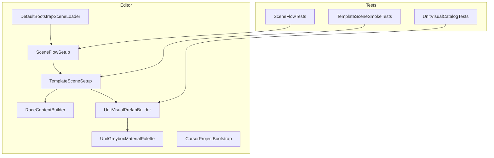
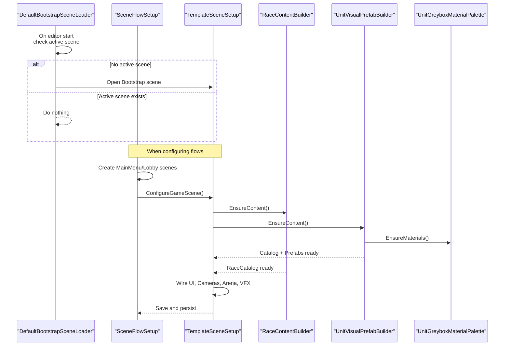
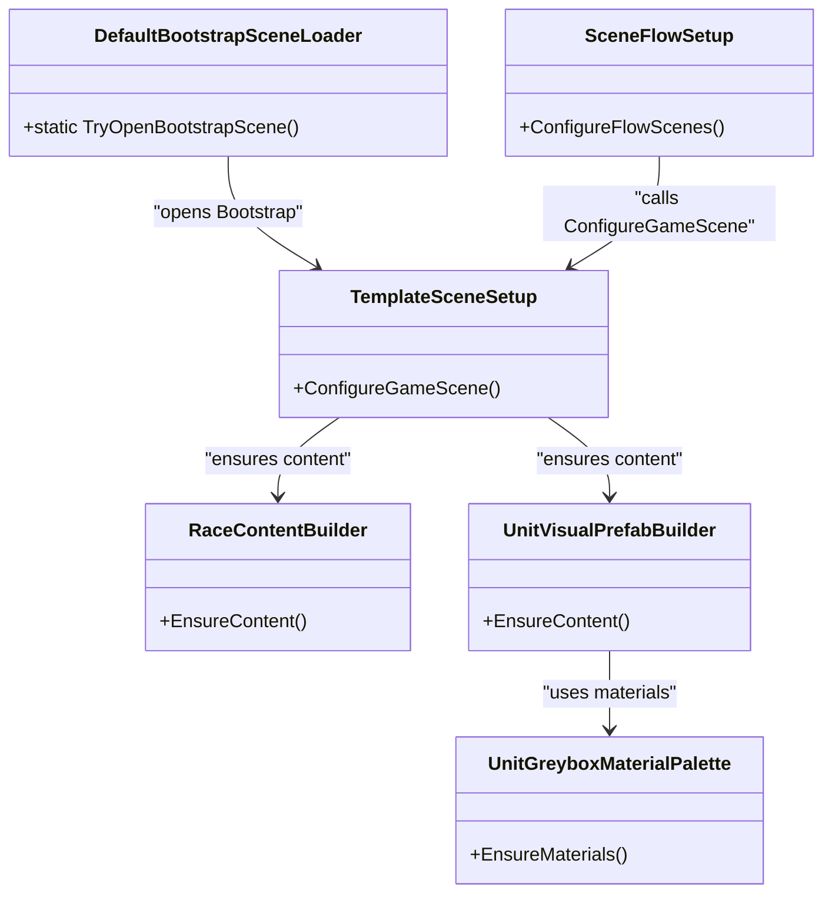

# Development Tools & Utilities

<cite>
**Referenced Files in This Document**
- [DefaultBootstrapSceneLoader.cs](file://Assets/Game/Scripts/Editor/DefaultBootstrapSceneLoader.cs)
- [SceneFlowSetup.cs](file://Assets/Game/Scripts/Editor/SceneFlowSetup.cs)
- [TemplateSceneSetup.cs](file://Assets/Game/Scripts/Editor/TemplateSceneSetup.cs)
- [RaceContentBuilder.cs](file://Assets/Game/Scripts/Editor/RaceContentBuilder.cs)
- [UnitVisualPrefabBuilder.cs](file://Assets/Game/Scripts/Editor/UnitVisualPrefabBuilder.cs)
- [UnitGreyboxMaterialPalette.cs](file://Assets/Game/Scripts/Editor/UnitGreyboxMaterialPalette.cs)
- [CursorProjectBootstrap.cs](file://Assets/Game/Scripts/Editor/CursorProjectBootstrap.cs)
- [TemplateSceneSmokeTests.cs](file://Assets/Game/Scripts/Tests/TemplateSceneSmokeTests.cs)
- [SceneFlowTests.cs](file://Assets/Game/Scripts/Tests/SceneFlowTests.cs)
- [UnitVisualCatalogTests.cs](file://Assets/Game/Scripts/Tests/UnitVisualCatalogTests.cs)
</cite>

## Table of Contents
1. Introduction
2. Project Structure
3. Core Components
4. Architecture Overview
5. Detailed Component Analysis
6. Dependency Analysis
7. Performance Considerations
8. Troubleshooting Guide
9. Conclusion
10. Appendices

## Introduction
This document explains BARAKI’s development tools and utilities focused on editor automation, scene bootstrapping, content generation, and testing. It covers:
- DefaultBootstrapSceneLoader for automatic scene loading at editor startup
- SceneFlowSetup for creating and wiring menu scenes and build order
- TemplateSceneSetup for idempotent Game scene configuration (cameras, UI, VFX, arena greybox)
- RaceContentBuilder for generating ScriptableObject-based game data
- UnitVisualPrefabBuilder for procedural greybox unit prefabs and catalog creation
- Testing smoke tests validating the template setup and generated assets
- Guidelines for extending the toolset with custom editor windows and utility scripts

## Project Structure
The development tooling is primarily located under Assets/Game/Scripts/Editor and Assets/Game/Scripts/Tests. The key responsibilities are:
- Editor bootstrap and scene orchestration
- Content generation for races, units, heroes, squads, upgrades
- Procedural prefab generation for unit visuals
- Automated scene configuration and validation via tests

**Diagram sources**
- [DefaultBootstrapSceneLoader.cs:1-50](file://Assets/Game/Scripts/Editor/DefaultBootstrapSceneLoader.cs#L1-L50)
- [SceneFlowSetup.cs:1-170](file://Assets/Game/Scripts/Editor/SceneFlowSetup.cs#L1-L170)
- [TemplateSceneSetup.cs:1-646](file://Assets/Game/Scripts/Editor/TemplateSceneSetup.cs#L1-L646)
- [RaceContentBuilder.cs:1-353](file://Assets/Game/Scripts/Editor/RaceContentBuilder.cs#L1-L353)
- [UnitVisualPrefabBuilder.cs:1-507](file://Assets/Game/Scripts/Editor/UnitVisualPrefabBuilder.cs#L1-L507)
- [UnitGreyboxMaterialPalette.cs:1-28](file://Assets/Game/Scripts/Editor/UnitGreyboxMaterialPalette.cs#L1-L28)
- [CursorProjectBootstrap.cs:155-200](file://Assets/Game/Scripts/Editor/CursorProjectBootstrap.cs#L155-L200)
- [TemplateSceneSmokeTests.cs:1-65](file://Assets/Game/Scripts/Tests/TemplateSceneSmokeTests.cs#L1-L65)
- [SceneFlowTests.cs:1-38](file://Assets/Game/Scripts/Tests/SceneFlowTests.cs#L1-L38)
- [UnitVisualCatalogTests.cs:1-46](file://Assets/Game/Scripts/Tests/UnitVisualCatalogTests.cs#L1-L46)

**Section sources**
- [DefaultBootstrapSceneLoader.cs:1-50](file://Assets/Game/Scripts/Editor/DefaultBootstrapSceneLoader.cs#L1-L50)
- [SceneFlowSetup.cs:1-170](file://Assets/Game/Scripts/Editor/SceneFlowSetup.cs#L1-L170)
- [TemplateSceneSetup.cs:1-646](file://Assets/Game/Scripts/Editor/TemplateSceneSetup.cs#L1-L646)
- [RaceContentBuilder.cs:1-353](file://Assets/Game/Scripts/Editor/RaceContentBuilder.cs#L1-L353)
- [UnitVisualPrefabBuilder.cs:1-507](file://Assets/Game/Scripts/Editor/UnitVisualPrefabBuilder.cs#L1-L507)
- [UnitGreyboxMaterialPalette.cs:1-28](file://Assets/Game/Scripts/Editor/UnitGreyboxMaterialPalette.cs#L1-L28)
- [CursorProjectBootstrap.cs:155-200](file://Assets/Game/Scripts/Editor/CursorProjectBootstrap.cs#L155-L200)
- [TemplateSceneSmokeTests.cs:1-65](file://Assets/Game/Scripts/Tests/TemplateSceneSmokeTests.cs#L1-L65)
- [SceneFlowTests.cs:1-38](file://Assets/Game/Scripts/Tests/SceneFlowTests.cs#L1-L38)
- [UnitVisualCatalogTests.cs:1-46](file://Assets/Game/Scripts/Tests/UnitVisualCatalogTests.cs#L1-L46)

## Core Components
- DefaultBootstrapSceneLoader: Automatically opens the Bootstrap scene when the Editor starts without an active scene.
- SceneFlowSetup: Creates MainMenu and Lobby scenes, wires UI documents, removes leftover UI from Game, and configures Build Settings.
- TemplateSceneSetup: Idempotently configures Game.unity with Cinemachine cameras, environment, VFX sample, Match runtime components, HUD, race pick UI, and a camera rig prefab.
- RaceContentBuilder: Generates baseline ScriptableObjects for races, units, heroes, squads, and stat upgrade tracks; updates the RaceCatalog.
- UnitVisualPrefabBuilder: Procedurally creates greybox unit prefabs per race and role, builds a UnitVisualCatalog asset, and ensures shared materials exist.
- UnitGreyboxMaterialPalette: Ensures URP Lit materials for unit visuals are created and cached.
- CursorProjectBootstrap: Optional helper to launch the Cursor editor from Unity.
- Tests: Smoke tests validate scene structure, build order, and generated catalogs/prefabs.

**Section sources**
- [DefaultBootstrapSceneLoader.cs:1-50](file://Assets/Game/Scripts/Editor/DefaultBootstrapSceneLoader.cs#L1-L50)
- [SceneFlowSetup.cs:1-170](file://Assets/Game/Scripts/Editor/SceneFlowSetup.cs#L1-L170)
- [TemplateSceneSetup.cs:1-646](file://Assets/Game/Scripts/Editor/TemplateSceneSetup.cs#L1-L646)
- [RaceContentBuilder.cs:1-353](file://Assets/Game/Scripts/Editor/RaceContentBuilder.cs#L1-L353)
- [UnitVisualPrefabBuilder.cs:1-507](file://Assets/Game/Scripts/Editor/UnitVisualPrefabBuilder.cs#L1-L507)
- [UnitGreyboxMaterialPalette.cs:1-28](file://Assets/Game/Scripts/Editor/UnitGreyboxMaterialPalette.cs#L1-L28)
- [CursorProjectBootstrap.cs:155-200](file://Assets/Game/Scripts/Editor/CursorProjectBootstrap.cs#L155-L200)
- [TemplateSceneSmokeTests.cs:1-65](file://Assets/Game/Scripts/Tests/TemplateSceneSmokeTests.cs#L1-L65)
- [SceneFlowTests.cs:1-38](file://Assets/Game/Scripts/Tests/SceneFlowTests.cs#L1-L38)
- [UnitVisualCatalogTests.cs:1-46](file://Assets/Game/Scripts/Tests/UnitVisualCatalogTests.cs#L1-L46)

## Architecture Overview
The editor toolchain orchestrates project initialization, scene composition, and content generation. The flow begins at editor startup or explicit calls from tests and other editors.

**Diagram sources**
- [DefaultBootstrapSceneLoader.cs:1-50](file://Assets/Game/Scripts/Editor/DefaultBootstrapSceneLoader.cs#L1-L50)
- [SceneFlowSetup.cs:1-170](file://Assets/Game/Scripts/Editor/SceneFlowSetup.cs#L1-L170)
- [TemplateSceneSetup.cs:1-646](file://Assets/Game/Scripts/Editor/TemplateSceneSetup.cs#L1-L646)
- [RaceContentBuilder.cs:1-353](file://Assets/Game/Scripts/Editor/RaceContentBuilder.cs#L1-L353)
- [UnitVisualPrefabBuilder.cs:1-507](file://Assets/Game/Scripts/Editor/UnitVisualPrefabBuilder.cs#L1-L507)
- [UnitGreyboxMaterialPalette.cs:1-28](file://Assets/Game/Scripts/Editor/UnitGreyboxMaterialPalette.cs#L1-L28)

## Detailed Component Analysis

### DefaultBootstrapSceneLoader
Purpose:
- Auto-opens the Bootstrap scene when the Editor starts without any loaded scene.

Key behaviors:
- Uses InitializeOnLoad to register a delayed call.
- Skips if play mode is starting or will change.
- Validates that no active scene is open.
- Resolves project root and checks existence of Bootstrap.unity before opening.

Usage example:
- No manual invocation required; it runs automatically on editor startup.

Best practices:
- Keep the path constant and ensure Bootstrap.unity exists.
- Avoid heavy work in static constructors; use delayCall.

**Section sources**
- [DefaultBootstrapSceneLoader.cs:1-50](file://Assets/Game/Scripts/Editor/DefaultBootstrapSceneLoader.cs#L1-L50)

### SceneFlowSetup
Purpose:
- Creates and configures Bootstrap, MainMenu, and Lobby scenes.
- Removes leftover menu UI from Game.unity.
- Configures Build Settings with a canonical scene order.

Key behaviors:
- Ensures Scenes folder exists.
- Builds UI groups and UIDocument entries for menus using UXML and controllers.
- Calls TemplateSceneSetup.ConfigureGameScene to finalize Game scene.
- Writes EditorBuildSettings.scenes with Bootstrap → MainMenu → Lobby → Game.

Usage example:
- Call ConfigureFlowScenes once during project setup or from a test OneTimeSetUp.

Best practices:
- Treat ConfigureFlowScenes as idempotent; re-running should not break existing setups.
- Keep UXML paths and PanelSettings consistent across scenes.

**Section sources**
- [SceneFlowSetup.cs:1-170](file://Assets/Game/Scripts/Editor/SceneFlowSetup.cs#L1-L170)

### TemplateSceneSetup
Purpose:
- Idempotent setup for Game.unity including Cinemachine, level backdrop, VFX sample, match runtime, HUD, race pick UI, and camera rig prefab.

Key behaviors:
- Ensures folders and layers.
- Ensures systems group and camera target.
- Creates Main Camera with CinemachineBrain, Virtual Camera with Follow and LookAt, and binds pan controller and binder.
- Sets up environment ground material, lighting, ambient settings, and fog toggles.
- Adds GameplayReveal component to light and wires intensities/duration.
- Ensures MatchRuntime and presenters, wiring catalogs and visual catalog references.
- Ensures MatchArenaGreybox with default parameters.
- Ensures MatchHud and RacePick UI documents with controllers wired to UIDocument.
- Creates SampleBurst VFX prefab if missing.
- Saves camera rig as prefab for reuse.

Usage example:
- Called by SceneFlowSetup.ConfigureFlowScenes or directly from maintenance code.

Best practices:
- Keep all asset paths centralized as constants.
- Use SerializedObject to wire references without breaking undo.
- Mark scene dirty and save after changes.

**Section sources**
- [TemplateSceneSetup.cs:1-646](file://Assets/Game/Scripts/Editor/TemplateSceneSetup.cs#L1-L646)

### RaceContentBuilder
Purpose:
- Generates MVP ScriptableObject assets for races, units, heroes, squads, and stat upgrade tracks based on baseline stats.

Key behaviors:
- Ensures directories for Units, Heroes, Races, Squads, Upgrades.
- Creates Human and Bug unit definitions with roles and stats.
- Creates three heroes per race with morale slots.
- Creates race definitions linking units and passives.
- Creates squad compositions per barracks level.
- Creates stat upgrade tracks with costs and research times.
- Updates RaceCatalog with races, squads, and tracks.

Usage example:
- Call EnsureContent during project setup or from tests to guarantee baseline data.

Best practices:
- Centralize IDs and stats to keep balance consistent.
- Re-run EnsureContent to regenerate assets deterministically.

**Section sources**
- [RaceContentBuilder.cs:1-353](file://Assets/Game/Scripts/Editor/RaceContentBuilder.cs#L1-L353)

### UnitVisualPrefabBuilder
Purpose:
- Procedurally generates greybox unit prefabs for each race and role and builds a UnitVisualCatalog asset.

Key behaviors:
- Ensures materials via UnitGreyboxMaterialPalette.
- Creates folders for Human and Bug prefabs.
- For each race, creates six role-specific prefabs (Melee, Ranged, Caster, Siege, Flying, Super).
- Updates UnitVisualCatalog with mappings from race and role to prefab.
- Persists assets.

Usage example:
- Call EnsureContent from TemplateSceneSetup or tests to generate prefabs and catalog.

Best practices:
- Keep naming conventions consistent for TryGetPrefab lookups.
- Update catalog whenever new roles or races are added.

**Section sources**
- [UnitVisualPrefabBuilder.cs:1-507](file://Assets/Game/Scripts/Editor/UnitVisualPrefabBuilder.cs#L1-L507)

### UnitGreyboxMaterialPalette
Purpose:
- Ensures persistent URP Lit materials for greybox unit visuals and caches them for reuse.

Key behaviors:
- Ensures Materials directory.
- Creates or loads materials with base color and smoothness/metallic properties.
- Provides typed accessors for team and material variants.

Usage example:
- Called by UnitVisualPrefabBuilder.EnsureContent to prepare materials before prefab creation.

Best practices:
- Keep material paths and names stable to avoid broken references.

**Section sources**
- [UnitGreyboxMaterialPalette.cs:1-28](file://Assets/Game/Scripts/Editor/UnitGreyboxMaterialPalette.cs#L1-L28)

### CursorProjectBootstrap
Purpose:
- Optional helper to launch the Cursor editor from Unity by resolving its executable path.

Key behaviors:
- Searches common local app data locations for Cursor.exe.
- Launches Cursor with the project root path.
- Logs helpful messages if not found or fails to launch.

Usage example:
- Integrate into your editor workflow to quickly switch between Unity and Cursor.

Best practices:
- Provide fallback instructions if auto-launch fails.

**Section sources**
- [CursorProjectBootstrap.cs:155-200](file://Assets/Game/Scripts/Editor/CursorProjectBootstrap.cs#L155-L200)

### Testing Framework Integration
Purpose:
- Validate that templates and content generators produce expected results.

Key tests:
- TemplateSceneSmokeTests: Verifies Cinemachine brain/camera, MatchArenaGreybox presence, camera pan controller, and VFX assets/prefab.
- SceneFlowTests: Asserts Build Settings scene order and enabled flags.
- UnitVisualCatalogTests: Confirms catalog existence and correct prefab mapping for specific races and roles.

Usage examples:
- Run tests in the Unity Test Runner to verify setup integrity.
- Use OneTimeSetUp to trigger SceneFlowSetup and content builders before assertions.

Best practices:
- Keep tests fast and deterministic.
- Regenerate content in setup steps to ensure consistent state.

**Section sources**
- [TemplateSceneSmokeTests.cs:1-65](file://Assets/Game/Scripts/Tests/TemplateSceneSmokeTests.cs#L1-L65)
- [SceneFlowTests.cs:1-38](file://Assets/Game/Scripts/Tests/SceneFlowTests.cs#L1-L38)
- [UnitVisualCatalogTests.cs:1-46](file://Assets/Game/Scripts/Tests/UnitVisualCatalogTests.cs#L1-L46)

## Dependency Analysis
The following diagram shows how the core editor components depend on each other and on assets.

**Diagram sources**
- [DefaultBootstrapSceneLoader.cs:1-50](file://Assets/Game/Scripts/Editor/DefaultBootstrapSceneLoader.cs#L1-L50)
- [SceneFlowSetup.cs:1-170](file://Assets/Game/Scripts/Editor/SceneFlowSetup.cs#L1-L170)
- [TemplateSceneSetup.cs:1-646](file://Assets/Game/Scripts/Editor/TemplateSceneSetup.cs#L1-L646)
- [RaceContentBuilder.cs:1-353](file://Assets/Game/Scripts/Editor/RaceContentBuilder.cs#L1-L353)
- [UnitVisualPrefabBuilder.cs:1-507](file://Assets/Game/Scripts/Editor/UnitVisualPrefabBuilder.cs#L1-L507)
- [UnitGreyboxMaterialPalette.cs:1-28](file://Assets/Game/Scripts/Editor/UnitGreyboxMaterialPalette.cs#L1-L28)

**Section sources**
- [DefaultBootstrapSceneLoader.cs:1-50](file://Assets/Game/Scripts/Editor/DefaultBootstrapSceneLoader.cs#L1-L50)
- [SceneFlowSetup.cs:1-170](file://Assets/Game/Scripts/Editor/SceneFlowSetup.cs#L1-L170)
- [TemplateSceneSetup.cs:1-646](file://Assets/Game/Scripts/Editor/TemplateSceneSetup.cs#L1-L646)
- [RaceContentBuilder.cs:1-353](file://Assets/Game/Scripts/Editor/RaceContentBuilder.cs#L1-L353)
- [UnitVisualPrefabBuilder.cs:1-507](file://Assets/Game/Scripts/Editor/UnitVisualPrefabBuilder.cs#L1-L507)
- [UnitGreyboxMaterialPalette.cs:1-28](file://Assets/Game/Scripts/Editor/UnitGreyboxMaterialPalette.cs#L1-L28)

## Performance Considerations
- Prefer idempotent operations: All setup methods check for existing objects/assets before creating or modifying them.
- Batch asset writes: Save assets once after multiple modifications to reduce Editor overhead.
- Avoid heavy work in static constructors: Use delayed calls for editor startup tasks.
- Cache frequently used references: Material palette caches materials to avoid repeated lookups.
- Keep scene graphs minimal during setup: Only create necessary components and wire references efficiently.

[No sources needed since this section provides general guidance]

## Troubleshooting Guide
Common issues and resolutions:
- Bootstrap scene does not open automatically:
  - Ensure no scene is already active and that Bootstrap.unity exists at the expected path.
  - Verify the editor is not entering play mode during startup.
- Game scene missing Cinemachine or UI:
  - Re-run SceneFlowSetup.ConfigureFlowScenes to recreate or repair scene structure.
  - Confirm UXML and PanelSettings assets exist at configured paths.
- Missing unit prefabs or catalog errors:
  - Call UnitVisualPrefabBuilder.EnsureContent to regenerate prefabs and catalog.
  - Check that UnitGreyboxMaterialPalette materials were created successfully.
- Build Settings incorrect:
  - Re-run SceneFlowSetup.ConfigureFlowScenes to set canonical scene order.
- Tests failing:
  - Ensure OneTimeSetUp triggers SceneFlowSetup and content builders.
  - Verify asset paths referenced by tests match current project layout.

**Section sources**
- [DefaultBootstrapSceneLoader.cs:1-50](file://Assets/Game/Scripts/Editor/DefaultBootstrapSceneLoader.cs#L1-L50)
- [SceneFlowSetup.cs:1-170](file://Assets/Game/Scripts/Editor/SceneFlowSetup.cs#L1-L170)
- [TemplateSceneSetup.cs:1-646](file://Assets/Game/Scripts/Editor/TemplateSceneSetup.cs#L1-L646)
- [UnitVisualPrefabBuilder.cs:1-507](file://Assets/Game/Scripts/Editor/UnitVisualPrefabBuilder.cs#L1-L507)
- [UnitGreyboxMaterialPalette.cs:1-28](file://Assets/Game/Scripts/Editor/UnitGreyboxMaterialPalette.cs#L1-L28)
- [TemplateSceneSmokeTests.cs:1-65](file://Assets/Game/Scripts/Tests/TemplateSceneSmokeTests.cs#L1-L65)
- [SceneFlowTests.cs:1-38](file://Assets/Game/Scripts/Tests/SceneFlowTests.cs#L1-L38)
- [UnitVisualCatalogTests.cs:1-46](file://Assets/Game/Scripts/Tests/UnitVisualCatalogTests.cs#L1-L46)

## Conclusion
BARAKI’s editor toolchain provides robust automation for scene bootstrapping, content generation, and validation. By centralizing setup logic and ensuring idempotent behavior, teams can reliably initialize projects, maintain consistent scene structures, and automate content pipelines. Integrating smoke tests further guarantees that templates and generated assets remain correct over time.

[No sources needed since this section summarizes without analyzing specific files]

## Appendices

### Usage Examples

- Automatic Bootstrap on Editor Start
  - Behavior: If no scene is open, the editor opens Bootstrap.unity automatically.
  - Reference: [DefaultBootstrapSceneLoader.cs:1-50](file://Assets/Game/Scripts/Editor/DefaultBootstrapSceneLoader.cs#L1-L50)

- Configure Full Scene Flow
  - Call SceneFlowSetup.ConfigureFlowScenes to create Bootstrap/MainMenu/Lobby, remove leftover UI from Game, configure Game scene, and set Build Settings.
  - Reference: [SceneFlowSetup.cs:1-170](file://Assets/Game/Scripts/Editor/SceneFlowSetup.cs#L1-L170)

- Repair Game Scene
  - Call TemplateSceneSetup.ConfigureGameScene to ensure Cinemachine, environment, VFX, HUD, race pick UI, and arena greybox are correctly set up.
  - Reference: [TemplateSceneSetup.cs:1-646](file://Assets/Game/Scripts/Editor/TemplateSceneSetup.cs#L1-L646)

- Generate Baseline Game Data
  - Call RaceContentBuilder.EnsureContent to create races, units, heroes, squads, and upgrade tracks, then update RaceCatalog.
  - Reference: [RaceContentBuilder.cs:1-353](file://Assets/Game/Scripts/Editor/RaceContentBuilder.cs#L1-L353)

- Generate Greybox Unit Prefabs and Catalog
  - Call UnitVisualPrefabBuilder.EnsureContent to create prefabs per race/role and build UnitVisualCatalog.
  - Reference: [UnitVisualPrefabBuilder.cs:1-507](file://Assets/Game/Scripts/Editor/UnitVisualPrefabBuilder.cs#L1-L507)

- Validate Setup via Tests
  - Run TemplateSceneSmokeTests, SceneFlowTests, and UnitVisualCatalogTests to assert correctness.
  - References:
    - [TemplateSceneSmokeTests.cs:1-65](file://Assets/Game/Scripts/Tests/TemplateSceneSmokeTests.cs#L1-L65)
    - [SceneFlowTests.cs:1-38](file://Assets/Game/Scripts/Tests/SceneFlowTests.cs#L1-L38)
    - [UnitVisualCatalogTests.cs:1-46](file://Assets/Game/Scripts/Tests/UnitVisualCatalogTests.cs#L1-L46)

### Extending the Toolset

- Custom Editor Windows
  - Create a new class inheriting from EditorWindow and add a [MenuItem] to open it.
  - Use AssetDatabase and EditorSceneManager APIs similar to existing tools for safe, idempotent operations.
  - Example patterns: folder creation, object/component inspection, serialized property wiring.

- Utility Scripts
  - Implement small, focused helpers for asset management, scene graph manipulation, and serialization.
  - Follow the idempotent pattern: check existence, create if missing, apply changes, mark dirty, save.

- Debugging and Profiling
  - Use Unity Profiler and Frame Debugger to inspect performance during setup and gameplay.
  - Add targeted logging around critical setup steps to diagnose failures.

- Quality Assurance Processes
  - Maintain smoke tests for scene structure and generated assets.
  - Enforce consistent asset paths and naming conventions to prevent broken references.
  - Periodically re-run content generators to keep baseline data synchronized with design docs.

[No sources needed since this section provides general guidance]