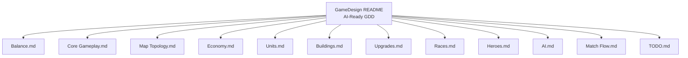
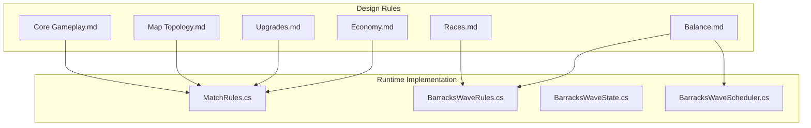
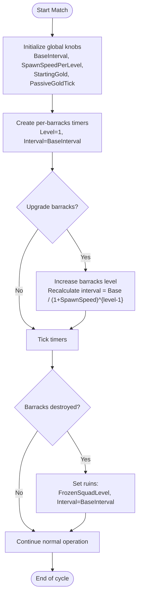
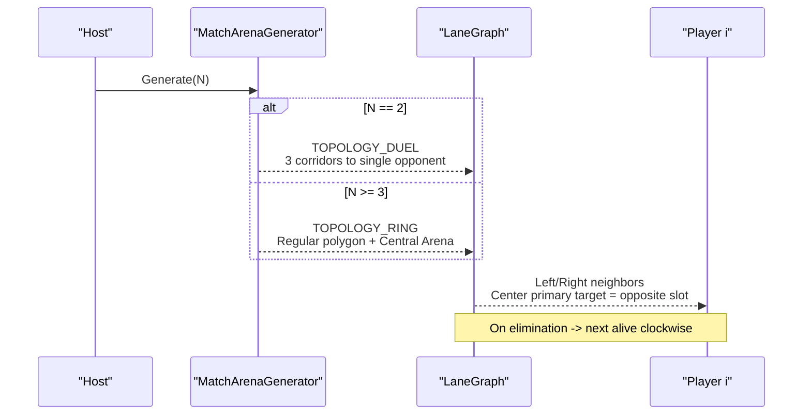
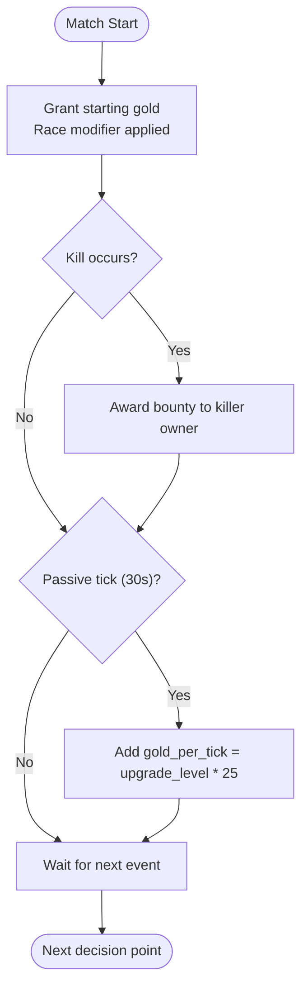
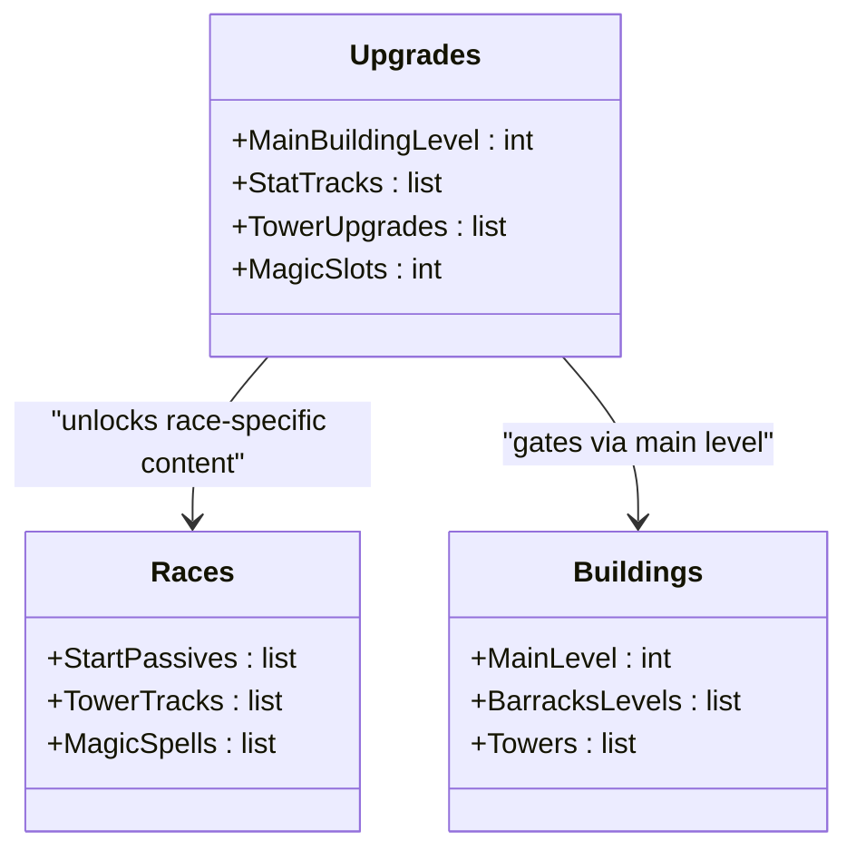
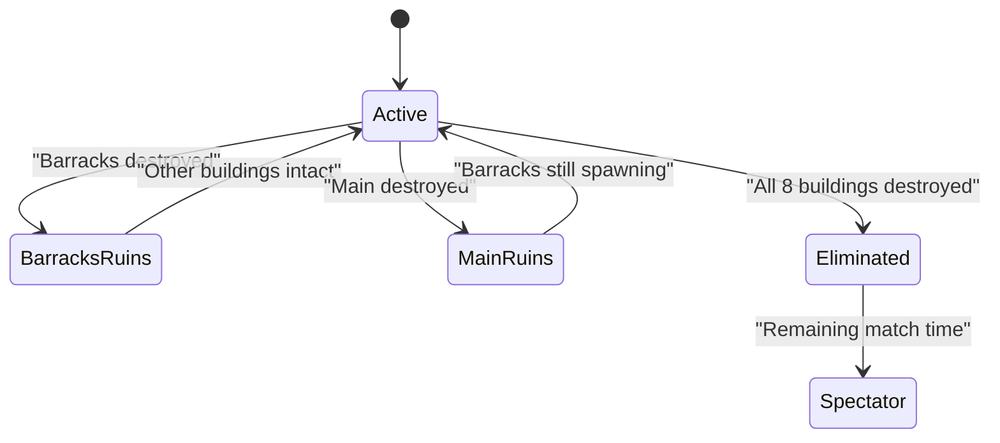
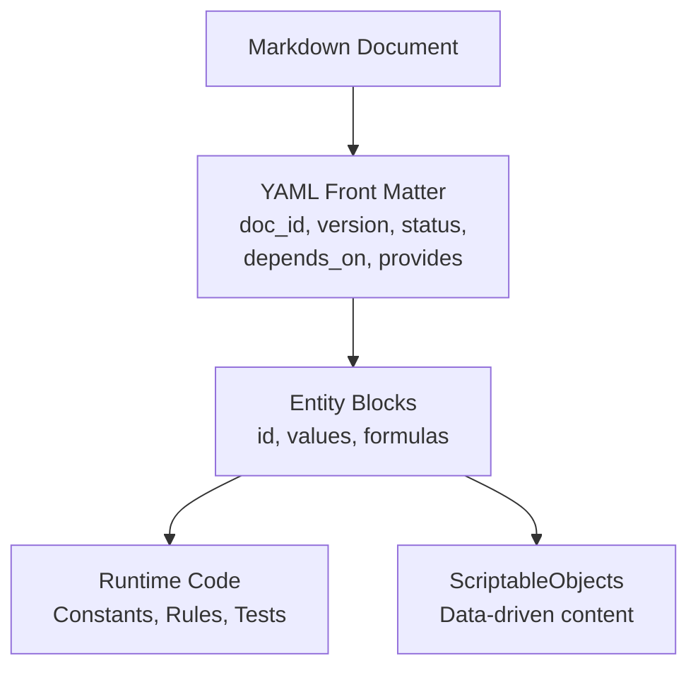
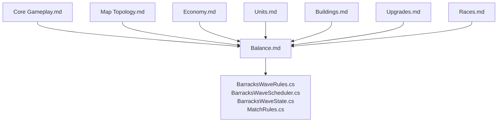

# Balance & Progression Philosophy

<cite>
**Referenced Files in This Document**
- [Balance.md](file://Assets/Game/GameDesign/Balance.md)
- [README.md](file://Assets/Game/GameDesign/README.md)
- [AI.md](file://Assets/Game/GameDesign/AI.md)
- [Core Gameplay.md](file://Assets/Game/GameDesign/Core%20Gameplay.md)
- [Map Topology.md](file://Assets/Game/GameDesign/Map%20Topology.md)
- [Economy.md](file://Assets/Game/GameDesign/Economy.md)
- [Units.md](file://Assets/Game/GameDesign/Units.md)
- [Buildings.md](file://Assets/Game/GameDesign/Buildings.md)
- [Upgrades.md](file://Assets/Game/GameDesign/Upgrades.md)
- [Races.md](file://Assets/Game/GameDesign/Races.md)
- [Heroes.md](file://Assets/Game/GameDesign/Heroes.md)
- [Match Flow.md](file://Assets/Game/GameDesign/Match%20Flow.md)
- [TODO.md](file://Assets/Game/GameDesign/TODO.md)
- [MatchRules.cs](file://Assets/Game/Scripts/Runtime/Gameplay/Match/MatchRules.cs)
- [BarracksWaveRules.cs](file://Assets/Game/Scripts/Runtime/Gameplay/Match/BarracksWaveRules.cs)
- [BarracksWaveState.cs](file://Assets/Game/Scripts/Runtime/Gameplay/Match/BarracksWaveState.cs)
- [BarracksWaveScheduler.cs](file://Assets/Game/Scripts/Runtime/Gameplay/Match/BarracksWaveScheduler.cs)
</cite>

## Table of Contents
1. Introduction
2. Project Structure
3. Core Components
4. Architecture Overview
5. Detailed Component Analysis
6. Dependency Analysis
7. Performance Considerations
8. Troubleshooting Guide
9. Conclusion

## Introduction
This document explains BARAKI’s balance philosophy and progression scaling systems with a focus on fair competition across 2–8 player matches, topology-driven scaling, numerical balance, stat scaling, power curve management, AI-ready GDD format, failure spectrum design, MVP prioritization, locked decisions, and the balance between strategic depth and accessibility. The goal is to provide both human players and AI agents with clear, deterministic rules that support engaging gameplay with meaningful consequences and comeback potential.

## Project Structure
BARAKI’s design is captured in an AI-Ready Game Design Document (GDD) system using YAML front matter and entity blocks for stable IDs, versions, dependencies, and scope flags. These documents define the canonical rules that runtime code implements.

**Diagram sources**
- [README.md:1-61](file://Assets/Game/GameDesign/README.md#L1-L61)

**Section sources**
- [README.md:1-61](file://Assets/Game/GameDesign/README.md#L1-L61)

## Core Components
- Fixed numerical balance across player counts: combat stats, economy, costs, and spawn intervals are identical for N=2…8; only map geometry scales.
- Per-barracks wave timing with level-based acceleration and ruins behavior.
- Race asymmetry via start passives, tower upgrades, and magic spells unlocked through main building levels.
- Stat upgrade tracks gated by main building level, providing controlled power growth.
- Failure spectrum from partial base loss to elimination, preserving match continuity and comeback opportunities.

**Section sources**
- [Balance.md:67-88](file://Assets/Game/GameDesign/Balance.md#L67-L88)
- [Buildings.md:186-253](file://Assets/Game/GameDesign/Buildings.md#L186-L253)
- [Upgrades.md:22-50](file://Assets/Game/GameDesign/Upgrades.md#L22-L50)
- [Races.md:17-56](file://Assets/Game/GameDesign/Races.md#L17-L56)

## Architecture Overview
The balance architecture separates immutable numeric tables from procedural map generation. Player count influences lane topology and arena size but not unit stats or economy.

**Diagram sources**
- [Balance.md:67-88](file://Assets/Game/GameDesign/Balance.md#L67-L88)
- [Economy.md:1-75](file://Assets/Game/GameDesign/Economy.md#L1-L75)
- [Upgrades.md:22-50](file://Assets/Game/GameDesign/Upgrades.md#L22-L50)
- [Races.md:17-56](file://Assets/Game/GameDesign/Races.md#L17-L56)
- [Map Topology.md:13-41](file://Assets/Game/GameDesign/Map%20Topology.md#L13-L41)
- [Core Gameplay.md:36-73](file://Assets/Game/GameDesign/Core%20Gameplay.md#L36-L73)
- [MatchRules.cs:1-46](file://Assets/Game/Scripts/Runtime/Gameplay/Match/MatchRules.cs#L1-L46)
- [BarracksWaveRules.cs:1-46](file://Assets/Game/Scripts/Runtime/Gameplay/Match/BarracksWaveRules.cs#L1-L46)
- [BarracksWaveState.cs:1-47](file://Assets/Game/Scripts/Runtime/Gameplay/Match/BarracksWaveState.cs#L1-L47)
- [BarracksWaveScheduler.cs:1-159](file://Assets/Game/Scripts/Runtime/Gameplay/Match/BarracksWaveScheduler.cs#L1-L159)

## Detailed Component Analysis

### Numerical Balance and Power Curve Management
- Global knobs define base wave interval, per-level spawn speed increase, starting gold, and passive gold tick parameters.
- Wave interval formula uses exponential decay based on barracks level; destroyed barracks revert to base interval while retaining squad composition.
- Unit baselines are symmetric across races; race-specific passives adjust effective stats without changing core numbers.
- Stat upgrade tracks provide linear percentage increases capped by main building level, ensuring predictable power curves.

**Diagram sources**
- [Balance.md:11-48](file://Assets/Game/GameDesign/Balance.md#L11-L48)
- [BarracksWaveRules.cs:12-24](file://Assets/Game/Scripts/Runtime/Gameplay/Match/BarracksWaveRules.cs#L12-L24)
- [BarracksWaveState.cs:39-45](file://Assets/Game/Scripts/Runtime/Gameplay/Match/BarracksWaveState.cs#L39-L45)

**Section sources**
- [Balance.md:11-48](file://Assets/Game/GameDesign/Balance.md#L11-L48)
- [Balance.md:67-88](file://Assets/Game/GameDesign/Balance.md#L67-L88)
- [Units.md:145-209](file://Assets/Game/GameDesign/Units.md#L145-L209)
- [Upgrades.md:81-115](file://Assets/Game/GameDesign/Upgrades.md#L81-L115)

### Player Count Scaling and Topology Adjustments
- Combat, economy, costs, and spawn intervals remain fixed for all player counts; only map geometry changes.
- Two topologies: Duel (N=2) with three parallel corridors and Ring (N≥3) with bases on a regular polygon and a central arena where center lanes merge.
- Center lane targeting rotates clockwise when primary target is eliminated, maintaining pressure and engagement.

**Diagram sources**
- [Map Topology.md:76-106](file://Assets/Game/GameDesign/Map%20Topology.md#L76-L106)
- [Map Topology.md:135-161](file://Assets/Game/GameDesign/Map%20Topology.md#L135-L161)
- [Core Gameplay.md:47-67](file://Assets/Game/GameDesign/Core%20Gameplay.md#L47-L67)

**Section sources**
- [Balance.md:67-88](file://Assets/Game/GameDesign/Balance.md#L67-L88)
- [Map Topology.md:13-41](file://Assets/Game/GameDesign/Map%20Topology.md#L13-L41)
- [Map Topology.md:76-106](file://Assets/Game/GameDesign/Map%2Topology.md#L76-L106)
- [Core Gameplay.md:47-67](file://Assets/Game/GameDesign/Core%20Gameplay.md#L47-L67)

### Economy and Passive Growth
- Gold income sources: kill bounties and passive gold ticks gated by main building level.
- Starting gold differs by race due to negative passives; Humans begin with reduced gold.
- Passive gold increases every 30 seconds per upgrade level, capped by main level.

**Diagram sources**
- [Economy.md:24-75](file://Assets/Game/GameDesign/Economy.md#L24-L75)
- [MatchRules.cs:10-18](file://Assets/Game/Scripts/Runtime/Gameplay/Match/MatchRules.cs#L10-L18)

**Section sources**
- [Economy.md:24-75](file://Assets/Game/GameDesign/Economy.md#L24-L75)
- [MatchRules.cs:10-18](file://Assets/Game/Scripts/Runtime/Gameplay/Match/MatchRules.cs#L10-L18)

### Upgrades, Stat Scaling, and Gates
- Main building level gates maximum stat research levels, hero hire slots, and magic upgrade slots.
- Stat tracks provide consistent percentage increases per level; healer effectiveness scales separately.
- Tower upgrades offer race-specific enhancements affecting units, towers, and spells.

**Diagram sources**
- [Upgrades.md:22-50](file://Assets/Game/GameDesign/Upgrades.md#L22-L50)
- [Races.md:17-56](file://Assets/Game/GameDesign/Races.md#L17-L56)
- [Buildings.md:136-184](file://Assets/Game/GameDesign/Buildings.md#L136-L184)

**Section sources**
- [Upgrades.md:22-50](file://Assets/Game/GameDesign/Upgrades.md#L22-L50)
- [Upgrades.md:81-115](file://Assets/Game/GameDesign/Upgrades.md#L81-L115)
- [Races.md:288-377](file://Assets/Game/GameDesign/Races.md#L288-L377)

### Failure Spectrum and Comeback Potential
- Partial losses: barracks destroyed become ruins, freezing squad composition and reverting spawn speed to base interval.
- Main building destroyed disables upgrades and passive gold but does not eliminate the player.
- Full elimination requires destruction of all eight buildings, allowing continued spectator play and comeback dynamics.

**Diagram sources**
- [Buildings.md:186-253](file://Assets/Game/GameDesign/Buildings.md#L186-L253)
- [Core Gameplay.md:106-125](file://Assets/Game/GameDesign/Core%20Gameplay.md#L106-L125)

**Section sources**
- [Buildings.md:186-253](file://Assets/Game/GameDesign/Buildings.md#L186-L253)
- [Core Gameplay.md:106-125](file://Assets/Game/GameDesign/Core%20Gameplay.md#L106-L125)

### AI-Ready GDD Format and Human/AI Support
- Documents use YAML front matter with doc_id, version, status, depends_on, provides, and mvp flags.
- Entity blocks define stable IDs used across code, ScriptableObjects, addresses, and tests.
- This structure supports both human understanding and AI agent consumption by providing deterministic, machine-readable specifications.

**Diagram sources**
- [README.md:9-22](file://Assets/Game/GameDesign/README.md#L9-L22)

**Section sources**
- [README.md:9-22](file://Assets/Game/GameDesign/README.md#L9-L22)

### MVP Prioritization and Locked Decisions
- MVP focuses on Discord Activity, 2–8 players, two races, WebGL + dedicated server infrastructure.
- Locked decisions include no time cap, fixed balance across player counts, per-barracks wave timing, and elimination conditions.
- TODO outlines phased development with acceptance criteria and test-driven development practices.

**Section sources**
- [README.md:44-46](file://Assets/Game/GameDesign/README.md#L44-L46)
- [Balance.md:146-155](file://Assets/Game/GameDesign/Balance.md#L146-L155)
- [TODO.md:29-101](file://Assets/Game/GameDesign/TODO.md#L29-L101)

## Dependency Analysis
The balance system depends on core gameplay loops, map topology, economy rules, unit definitions, building behaviors, upgrade trees, and race-specific modifiers. Runtime components implement these rules deterministically.

**Diagram sources**
- [Core Gameplay.md:1-34](file://Assets/Game/GameDesign/Core%20Gameplay.md#L1-L34)
- [Map Topology.md:13-41](file://Assets/Game/GameDesign/Map%20Topology.md#L13-L41)
- [Economy.md:1-75](file://Assets/Game/GameDesign/Economy.md#L1-L75)
- [Units.md:1-51](file://Assets/Game/GameDesign/Units.md#L1-L51)
- [Buildings.md:1-34](file://Assets/Game/GameDesign/Buildings.md#L1-L34)
- [Upgrades.md:1-21](file://Assets/Game/GameDesign/Upgrades.md#L1-L21)
- [Races.md:1-16](file://Assets/Game/GameDesign/Races.md#L1-L16)
- [BarracksWaveRules.cs:1-46](file://Assets/Game/Scripts/Runtime/Gameplay/Match/BarracksWaveRules.cs#L1-L46)
- [BarracksWaveScheduler.cs:1-159](file://Assets/Game/Scripts/Runtime/Gameplay/Match/BarracksWaveScheduler.cs#L1-L159)
- [BarracksWaveState.cs:1-47](file://Assets/Game/Scripts/Runtime/Gameplay/Match/BarracksWaveState.cs#L1-L47)
- [MatchRules.cs:1-46](file://Assets/Game/Scripts/Runtime/Gameplay/Match/MatchRules.cs#L1-L46)

**Section sources**
- [Core Gameplay.md:1-34](file://Assets/Game/GameDesign/Core%20Gameplay.md#L1-L34)
- [Map Topology.md:13-41](file://Assets/Game/GameDesign/Map%20Topology.md#L13-L41)
- [Economy.md:1-75](file://Assets/Game/GameDesign/Economy.md#L1-L75)
- [Units.md:1-51](file://Assets/Game/GameDesign/Units.md#L1-L51)
- [Buildings.md:1-34](file://Assets/Game/GameDesign/Buildings.md#L1-L34)
- [Upgrades.md:1-21](file://Assets/Game/GameDesign/Upgrades.md#L1-L21)
- [Races.md:1-16](file://Assets/Game/GameDesign/Races.md#L1-L16)
- [BarracksWaveRules.cs:1-46](file://Assets/Game/Scripts/Runtime/Gameplay/Match/BarracksWaveRules.cs#L1-L46)
- [BarracksWaveScheduler.cs:1-159](file://Assets/Game/Scripts/Runtime/Gameplay/Match/BarracksWaveScheduler.cs#L1-L159)
- [BarracksWaveState.cs:1-47](file://Assets/Game/Scripts/Runtime/Gameplay/Match/BarracksWaveState.cs#L1-L47)
- [MatchRules.cs:1-46](file://Assets/Game/Scripts/Runtime/Gameplay/Match/MatchRules.cs#L1-L46)

## Performance Considerations
- Deterministic formulas and fixed tables reduce runtime complexity and enable reliable testing.
- Per-barracks timers avoid global synchronization overhead and allow independent pacing.
- Procedural map generation scales with player count without altering core balance, keeping performance predictable.

[No sources needed since this section provides general guidance]

## Troubleshooting Guide
- Verify wave intervals match expected values for each barracks level and race modifier.
- Ensure ruins state correctly freezes squad level and resets interval to base.
- Confirm main building gates limit stat research, hero hires, and magic slots appropriately.
- Check that topology generation produces correct neighbor relationships and center targets for all player counts.

**Section sources**
- [BarracksWaveRules.cs:12-24](file://Assets/Game/Scripts/Runtime/Gameplay/Match/BarracksWaveRules.cs#L12-L24)
- [BarracksWaveState.cs:39-45](file://Assets/Game/Scripts/Runtime/Gameplay/Match/BarracksWaveState.cs#L39-L45)
- [Upgrades.md:22-50](file://Assets/Game/GameDesign/Upgrades.md#L22-L50)
- [Map Topology.md:35-41](file://Assets/Game/GameDesign/Map%20Topology.md#L35-L41)

## Conclusion
BARAKI’s balance philosophy centers on fixed numerical balance across player counts, with topology-driven scaling to maintain fairness and engagement. Clear progression gates, predictable power curves, and a well-defined failure spectrum ensure meaningful choices and comeback potential. The AI-Ready GDD format provides a robust foundation for both human and AI gameplay, while MVP priorities and locked decisions preserve game integrity and focus development efforts.