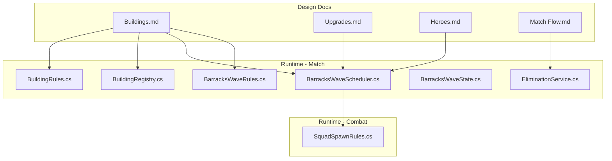
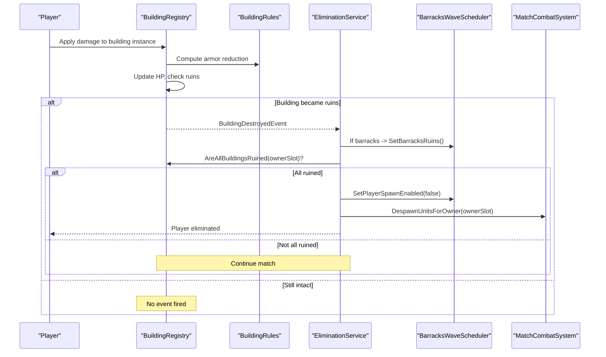
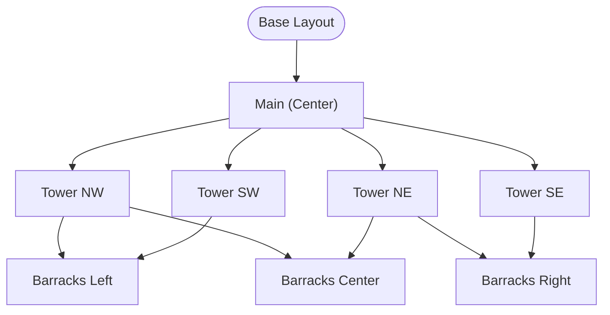
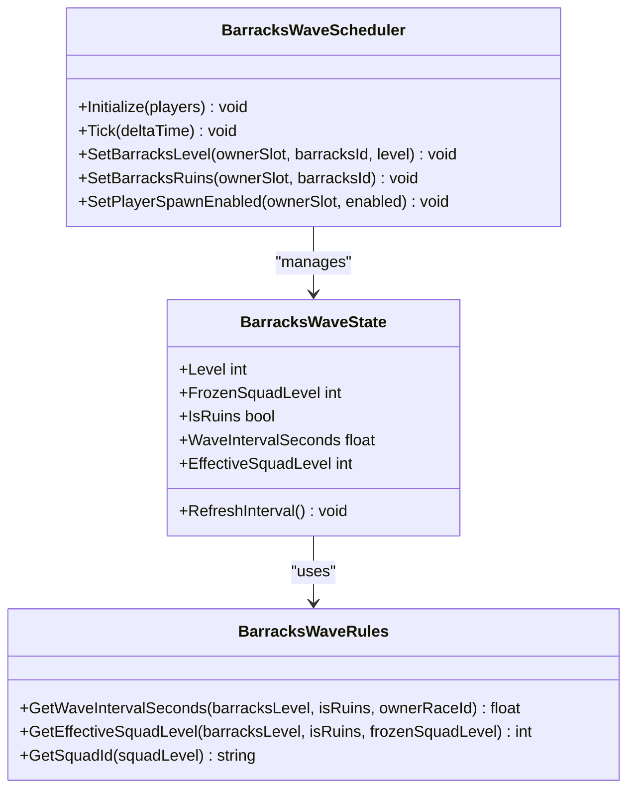
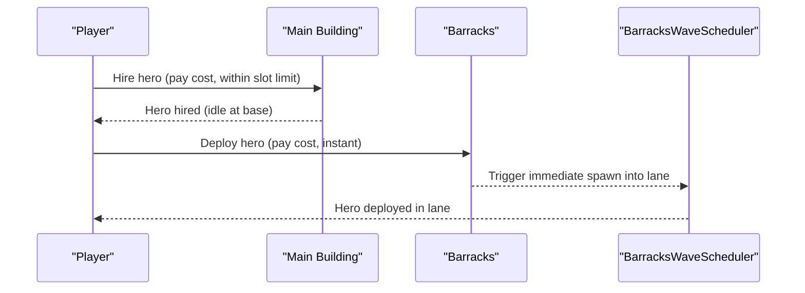
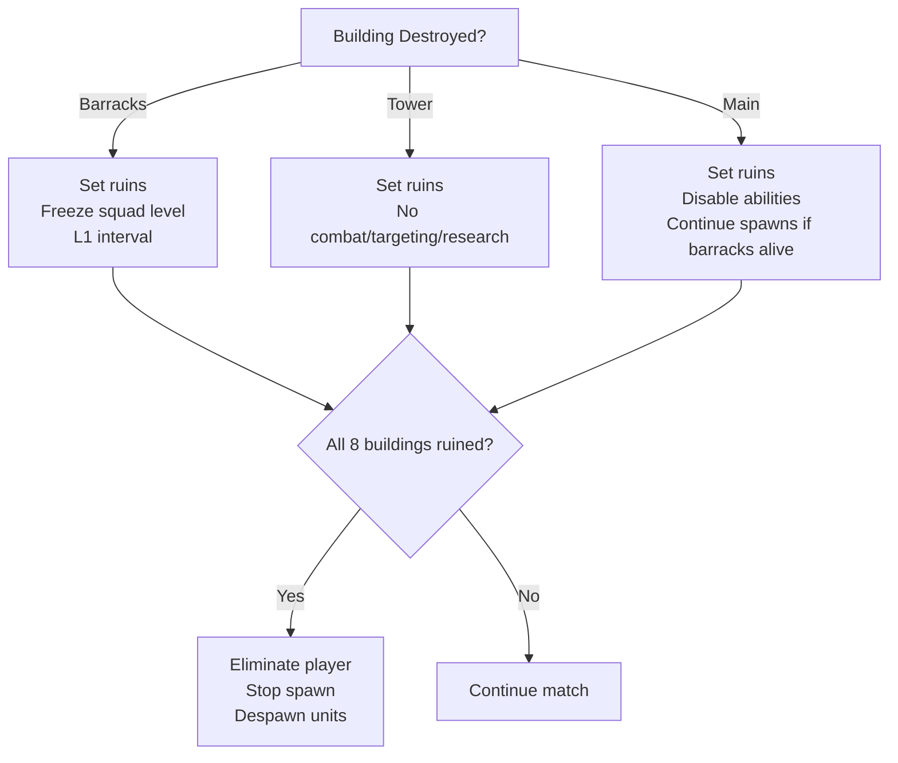
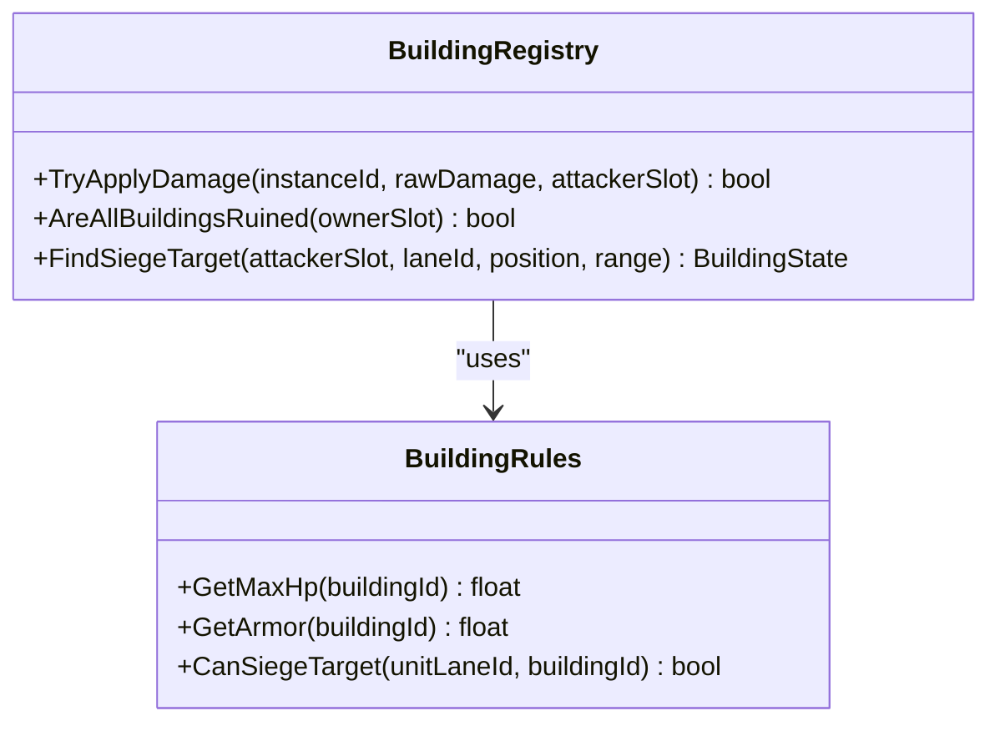
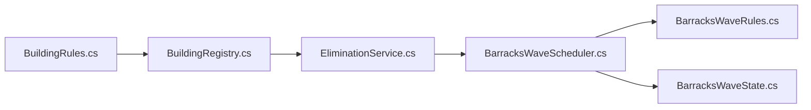

# Buildings & Base Management

<cite>
**Referenced Files in This Document**
- [Buildings.md](file://Assets/Game/GameDesign/Buildings.md)
- [Upgrades.md](file://Assets/Game/GameDesign/Upgrades.md)
- [Heroes.md](file://Assets/Game/GameDesign/Heroes.md)
- [Match Flow.md](file://Assets/Game/GameDesign/Match%20Flow.md)
- [BuildingRules.cs](file://Assets/Game/Scripts/Runtime/Gameplay/Match/BuildingRules.cs)
- [BuildingRegistry.cs](file://Assets/Game/Scripts/Runtime/Gameplay/Match/BuildingRegistry.cs)
- [BarracksWaveScheduler.cs](file://Assets/Game/Scripts/Runtime/Gameplay/Match/BarracksWaveScheduler.cs)
- [BarracksWaveRules.cs](file://Assets/Game/Scripts/Runtime/Gameplay/Match/BarracksWaveRules.cs)
- [BarracksWaveState.cs](file://Assets/Game/Scripts/Runtime/Gameplay/Match/BarracksWaveState.cs)
- [EliminationService.cs](file://Assets/Game/Scripts/Runtime/Gameplay/Match/EliminationService.cs)
- [SquadSpawnRules.cs](file://Assets/Game/Scripts/Runtime/Gameplay/Combat/SquadSpawnRules.cs)
</cite>

## Table of Contents
1. [Introduction](#introduction)
2. [Project Structure](#project-structure)
3. [Core Components](#core-components)
4. [Architecture Overview](#architecture-overview)
5. [Detailed Component Analysis](#detailed-component-analysis)
6. [Dependency Analysis](#dependency-analysis)
7. [Performance Considerations](#performance-considerations)
8. [Troubleshooting Guide](#troubleshooting-guide)
9. [Conclusion](#conclusion)
10. [Appendices](#appendices)

## Introduction
This document explains BARAKI’s building system and base management mechanics. It covers the eight critical structures per player (Main, three Barracks, four Towers), upgrade systems (barracks levels 1–4, main building progression with specific gold costs), tower target modes, destruction consequences (ruins state, spawn freezing, elimination conditions), hero hiring and deployment tied to main building levels, and how building levels affect unit production capabilities, spawn intervals, and defensive effectiveness. Strategic guidance on protection, upgrade priorities, and recovery after loss is also included.

## Project Structure
The building system spans design documents and runtime code:
- Design definitions for buildings, upgrades, heroes, and match flow are authored as markdown specifications.
- Runtime logic implements building lifecycle, wave scheduling, siege targeting, and elimination checks.

**Diagram sources**
- [Buildings.md](file://Assets/Game/GameDesign/Buildings.md)
- [Upgrades.md](file://Assets/Game/GameDesign/Upgrades.md)
- [Heroes.md](file://Assets/Game/GameDesign/Heroes.md)
- [Match Flow.md](file://Assets/Game/GameDesign/Match%20Flow.md)
- [BuildingRules.cs](file://Assets/Game/Scripts/Runtime/Gameplay/Match/BuildingRules.cs)
- [BuildingRegistry.cs](file://Assets/Game/Scripts/Runtime/Gameplay/Match/BuildingRegistry.cs)
- [BarracksWaveScheduler.cs](file://Assets/Game/Scripts/Runtime/Gameplay/Match/BarracksWaveScheduler.cs)
- [BarracksWaveRules.cs](file://Assets/Game/Scripts/Runtime/Gameplay/Match/BarracksWaveRules.cs)
- [BarracksWaveState.cs](file://Assets/Game/Scripts/Runtime/Gameplay/Match/BarracksWaveState.cs)
- [EliminationService.cs](file://Assets/Game/Scripts/Runtime/Gameplay/Match/EliminationService.cs)
- [SquadSpawnRules.cs](file://Assets/Game/Scripts/Runtime/Gameplay/Combat/SquadSpawnRules.cs)

**Section sources**
- [Buildings.md](file://Assets/Game/GameDesign/Buildings.md)
- [Upgrades.md](file://Assets/Game/GameDesign/Upgrades.md)
- [Heroes.md](file://Assets/Game/GameDesign/Heroes.md)
- [Match Flow.md](file://Assets/Game/GameDesign/Match%20Flow.md)
- [BuildingRules.cs](file://Assets/Game/Scripts/Runtime/Gameplay/Match/BuildingRules.cs)
- [BuildingRegistry.cs](file://Assets/Game/Scripts/Runtime/Gameplay/Match/BuildingRegistry.cs)
- [BarracksWaveScheduler.cs](file://Assets/Game/Scripts/Runtime/Gameplay/Match/BarracksWaveScheduler.cs)
- [BarracksWaveRules.cs](file://Assets/Game/Scripts/Runtime/Gameplay/Match/BarracksWaveRules.cs)
- [BarracksWaveState.cs](file://Assets/Game/Scripts/Runtime/Gameplay/Match/BarracksWaveState.cs)
- [EliminationService.cs](file://Assets/Game/Scripts/Runtime/Gameplay/Match/EliminationService.cs)
- [SquadSpawnRules.cs](file://Assets/Game/Scripts/Runtime/Gameplay/Combat/SquadSpawnRules.cs)

## Core Components
- Eight critical structures per player: Main, three Barracks (Left, Center, Right), four Towers (NW, NE, SW, SE).
- Upgrades:
  - Barracks levels 1–4 with increasing squad sizes and faster spawn intervals.
  - Main building levels 1–3 gated by gold costs; unlocks hero hire slots and other gates.
  - Tower target mode selection and race-specific tower upgrades when alive.
- Destruction:
  - Ruins states for all buildings; barracks continue spawning at frozen level and L1 interval; towers lose combat and research; main disables abilities but does not eliminate alone.
  - Elimination occurs only when all eight buildings are destroyed.
- Hero system:
  - Hire from Main (costs once per hero); deploy from a living Barracks (instant spawn into its lane).
  - Max heroes = Main level.

Key implementation anchors:
- Building HP/armor and siege targeting rules.
- Per-barracks wave scheduler with independent timers.
- Elimination service that reacts to building destruction events.

**Section sources**
- [Buildings.md](file://Assets/Game/GameDesign/Buildings.md)
- [Upgrades.md](file://Assets/Game/GameDesign/Upgrades.md)
- [Heroes.md](file://Assets/Game/GameDesign/Heroes.md)
- [Match Flow.md](file://Assets/Game/GameDesign/Match%20Flow.md)
- [BuildingRules.cs](file://Assets/Game/Scripts/Runtime/Gameplay/Match/BuildingRules.cs)
- [BarracksWaveScheduler.cs](file://Assets/Game/Scripts/Runtime/Gameplay/Match/BarracksWaveScheduler.cs)
- [BarracksWaveRules.cs](file://Assets/Game/Scripts/Runtime/Gameplay/Match/BarracksWaveRules.cs)
- [EliminationService.cs](file://Assets/Game/Scripts/Runtime/Gameplay/Match/EliminationService.cs)

## Architecture Overview
The building system coordinates between design specs and runtime services:

**Diagram sources**
- [BuildingRegistry.cs](file://Assets/Game/Scripts/Runtime/Gameplay/Match/BuildingRegistry.cs)
- [BuildingRules.cs](file://Assets/Game/Scripts/Runtime/Gameplay/Match/BuildingRules.cs)
- [EliminationService.cs](file://Assets/Game/Scripts/Runtime/Gameplay/Match/EliminationService.cs)
- [BarracksWaveScheduler.cs](file://Assets/Game/Scripts/Runtime/Gameplay/Match/BarracksWaveScheduler.cs)

## Detailed Component Analysis

### Building Types and Layout
- Eight structures per player: Main (center), three Barracks (one per lane), four Towers (square around Main).
- Lane binding: Left/Center/Right barracks each bind to their respective lanes; towers have no lane binding.
- Siege targeting: Units can target barracks on matching lanes and Main only from center lane.

**Diagram sources**
- [Buildings.md](file://Assets/Game/GameDesign/Buildings.md)
- [BuildingRules.cs](file://Assets/Game/Scripts/Runtime/Gameplay/Match/BuildingRules.cs)

**Section sources**
- [Buildings.md](file://Assets/Game/GameDesign/Buildings.md)
- [BuildingRules.cs](file://Assets/Game/Scripts/Runtime/Gameplay/Match/BuildingRules.cs)

### Upgrade System
- Barracks levels 1–4:
  - Squad sizes increase per level.
  - Spawn interval decreases with +5% speed per level; ruins revert to L1 interval.
  - Upgrade costs defined in design docs.
- Main building levels 1–3:
  - Gold costs gate progression; unlock hero hire slots and other caps.
- Tower target modes:
  - Alive towers allow setting target priority and race-specific upgrades.

**Diagram sources**
- [BarracksWaveRules.cs](file://Assets/Game/Scripts/Runtime/Gameplay/Match/BarracksWaveRules.cs)
- [BarracksWaveState.cs](file://Assets/Game/Scripts/Runtime/Gameplay/Match/BarracksWaveState.cs)
- [BarracksWaveScheduler.cs](file://Assets/Game/Scripts/Runtime/Gameplay/Match/BarracksWaveScheduler.cs)

**Section sources**
- [Buildings.md](file://Assets/Game/GameDesign/Buildings.md)
- [Upgrades.md](file://Assets/Game/GameDesign/Upgrades.md)
- [BarracksWaveRules.cs](file://Assets/Game/Scripts/Runtime/Gameplay/Match/BarracksWaveRules.cs)
- [BarracksWaveState.cs](file://Assets/Game/Scripts/Runtime/Gameplay/Match/BarracksWaveState.cs)
- [BarracksWaveScheduler.cs](file://Assets/Game/Scripts/Runtime/Gameplay/Match/BarracksWaveScheduler.cs)

### Hero Hiring and Deployment
- Hire heroes from Main:
  - Cost per hero; limited by Main level (max heroes = Main level).
- Deploy heroes from a living Barracks:
  - Instant spawn into the barracks’ lane; requires gold and cooldown after death.

**Diagram sources**
- [Heroes.md](file://Assets/Game/GameDesign/Heroes.md)
- [BarracksWaveScheduler.cs](file://Assets/Game/Scripts/Runtime/Gameplay/Match/BarracksWaveScheduler.cs)

**Section sources**
- [Heroes.md](file://Assets/Game/GameDesign/Heroes.md)
- [Upgrades.md](file://Assets/Game/GameDesign/Upgrades.md)

### Destruction Consequences and Elimination
- Barracks destroyed:
  - Enters ruins; squad level frozen; continues spawning at L1 interval.
- Tower destroyed:
  - Ruins remain; no combat, no targeting changes, no research via tower.
- Main destroyed:
  - Ruins; disables hire/upgrades/passive gold/magic; does not eliminate alone.
- Elimination:
  - Only when all eight buildings are destroyed; then spawn stops and units despawn.

**Diagram sources**
- [Buildings.md](file://Assets/Game/GameDesign/Buildings.md)
- [EliminationService.cs](file://Assets/Game/Scripts/Runtime/Gameplay/Match/EliminationService.cs)
- [Match Flow.md](file://Assets/Game/GameDesign/Match%20Flow.md)

**Section sources**
- [Buildings.md](file://Assets/Game/GameDesign/Buildings.md)
- [EliminationService.cs](file://Assets/Game/Scripts/Runtime/Gameplay/Match/EliminationService.cs)
- [Match Flow.md](file://Assets/Game/GameDesign/Match%20Flow.md)

### Relationship Between Building Levels and Production/Defense
- Barracks level affects:
  - Squad composition size.
  - Spawn interval (faster at higher levels; ruins revert to L1).
- Main level affects:
  - Hero hire slots and other caps.
- Towers provide defense while alive; destroyed towers remove defensive coverage.

**Diagram sources**
- [BuildingRules.cs](file://Assets/Game/Scripts/Runtime/Gameplay/Match/BuildingRules.cs)
- [BuildingRegistry.cs](file://Assets/Game/Scripts/Runtime/Gameplay/Match/BuildingRegistry.cs)

**Section sources**
- [BuildingRules.cs](file://Assets/Game/Scripts/Runtime/Gameplay/Match/BuildingRules.cs)
- [BuildingRegistry.cs](file://Assets/Game/Scripts/Runtime/Gameplay/Match/BuildingRegistry.cs)

## Dependency Analysis
- BuildingRegistry depends on BuildingRules for HP/armor and siege targeting.
- EliminationService listens to BuildingRegistry destruction events and coordinates with BarracksWaveScheduler and combat systems.
- BarracksWaveScheduler uses BarracksWaveRules for timing and squad IDs; BarracksWaveState encapsulates per-barracks state.

**Diagram sources**
- [BuildingRules.cs](file://Assets/Game/Scripts/Runtime/Gameplay/Match/BuildingRules.cs)
- [BuildingRegistry.cs](file://Assets/Game/Scripts/Runtime/Gameplay/Match/BuildingRegistry.cs)
- [EliminationService.cs](file://Assets/Game/Scripts/Runtime/Gameplay/Match/EliminationService.cs)
- [BarracksWaveScheduler.cs](file://Assets/Game/Scripts/Runtime/Gameplay/Match/BarracksWaveScheduler.cs)
- [BarracksWaveRules.cs](file://Assets/Game/Scripts/Runtime/Gameplay/Match/BarracksWaveRules.cs)
- [BarracksWaveState.cs](file://Assets/Game/Scripts/Runtime/Gameplay/Match/BarracksWaveState.cs)

**Section sources**
- [BuildingRules.cs](file://Assets/Game/Scripts/Runtime/Gameplay/Match/BuildingRules.cs)
- [BuildingRegistry.cs](file://Assets/Game/Scripts/Runtime/Gameplay/Match/BuildingRegistry.cs)
- [EliminationService.cs](file://Assets/Game/Scripts/Runtime/Gameplay/Match/EliminationService.cs)
- [BarracksWaveScheduler.cs](file://Assets/Game/Scripts/Runtime/Gameplay/Match/BarracksWaveScheduler.cs)
- [BarracksWaveRules.cs](file://Assets/Game/Scripts/Runtime/Gameplay/Match/BarracksWaveRules.cs)
- [BarracksWaveState.cs](file://Assets/Game/Scripts/Runtime/Gameplay/Match/BarracksWaveState.cs)

## Performance Considerations
- Per-barracks timers avoid global tick overhead and scale linearly with players × 3 barracks.
- Damage application and ruin checks are O(1) per building; elimination checks iterate only the player’s buildings.
- Keep tower upgrades and research off critical paths; they are gated by tower alive state.

[No sources needed since this section provides general guidance]

## Troubleshooting Guide
Common issues and resolutions:
- Spawn not firing:
  - Verify scheduler activation and IsSpawnEnabled flags.
  - Check effective squad level and interval calculations in ruins vs alive states.
- Incorrect siege targeting:
  - Ensure lane binding matches unit lane; Main only targetable from center lane.
- Elimination not triggering:
  - Confirm AreAllBuildingsRuined returns true for the owner slot; ensure BuildingDestroyed events propagate correctly.

**Section sources**
- [BarracksWaveScheduler.cs](file://Assets/Game/Scripts/Runtime/Gameplay/Match/BarracksWaveScheduler.cs)
- [BarracksWaveRules.cs](file://Assets/Game/Scripts/Runtime/Gameplay/Match/BarracksWaveRules.cs)
- [BuildingRules.cs](file://Assets/Game/Scripts/Runtime/Gameplay/Match/BuildingRules.cs)
- [EliminationService.cs](file://Assets/Game/Scripts/Runtime/Gameplay/Match/EliminationService.cs)

## Conclusion
BARAKI’s building system centers on eight core structures per player, with clear upgrade pathways and well-defined destruction behaviors. Barracks drive unit production with level-dependent squads and intervals; Main gates hero capacity and broader upgrades; Towers provide defense and targeted upgrades. Elimination is reserved for total base loss, preserving gameplay continuity until all structures fall. The architecture cleanly separates design specs from runtime logic, enabling predictable behavior and maintainable updates.

[No sources needed since this section summarizes without analyzing specific files]

## Appendices

### Strategic Guidance
- Protection priorities:
  - Prioritize keeping at least one barracks alive to sustain production; even ruins keep spawning at L1.
  - Defend towers to maintain early pressure and deny enemy siege access.
- Upgrade priorities:
  - Early: Secure barracks levels to improve output cadence.
  - Mid: Invest in Main level to unlock more heroes and stat caps.
  - Late: Enhance towers for sustained defense and control.
- Recovery strategies:
  - After losing a barracks, focus on defending remaining ones and use ruins to maintain baseline pressure.
  - Use heroes strategically to defend key lanes and delay enemy pushes toward Main.

[No sources needed since this section provides general guidance]