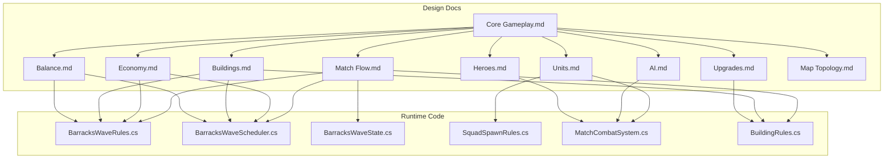
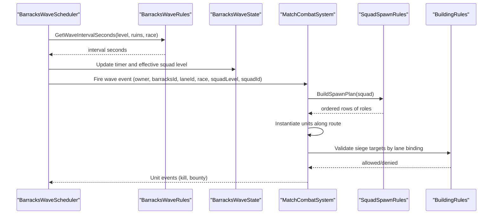
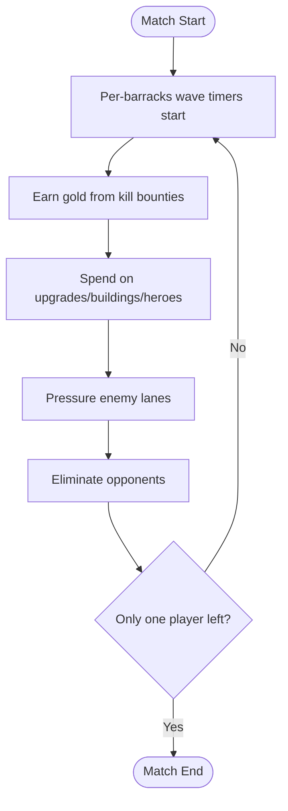
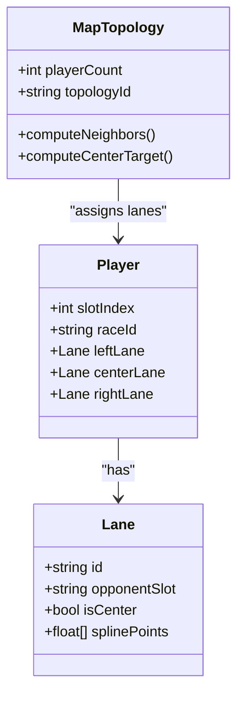
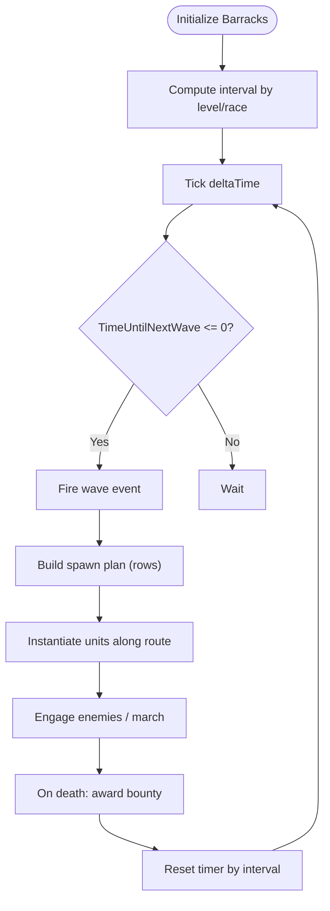
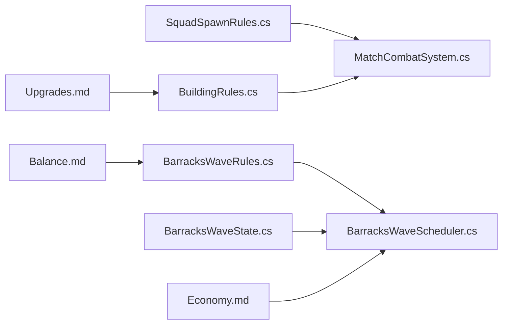

# Core Gameplay Loop

<cite>
**Referenced Files in This Document**
- [Core Gameplay.md](file://Assets/Game/GameDesign/Core%20Gameplay.md)
- [Match Flow.md](file://Assets/Game/GameDesign/Match%20Flow.md)
- [Economy.md](file://Assets/Game/GameDesign/Economy.md)
- [Buildings.md](file://Assets/Game/GameDesign/Buildings.md)
- [Units.md](file://Assets/Game/GameDesign/Units.md)
- [AI.md](file://Assets/Game/GameDesign/AI.md)
- [Balance.md](file://Assets/Game/GameDesign/Balance.md)
- [Upgrades.md](file://Assets/Game/GameDesign/Upgrades.md)
- [Heroes.md](file://Assets/Game/GameDesign/Heroes.md)
- [Map Topology.md](file://Assets/Game/GameDesign/Map%20Topology.md)
- [BarracksWaveRules.cs](file://Assets/Game/Scripts/Runtime/Gameplay/Match/BarracksWaveRules.cs)
- [BarracksWaveScheduler.cs](file://Assets/Game/Scripts/Runtime/Gameplay/Match/BarracksWaveScheduler.cs)
- [BarracksWaveState.cs](file://Assets/Game/Scripts/Runtime/Gameplay/Match/BarracksWaveState.cs)
- [SquadSpawnRules.cs](file://Assets/Game/Scripts/Runtime/Gameplay/Combat/SquadSpawnRules.cs)
- [MatchCombatSystem.cs](file://Assets/Game/Scripts/Runtime/Gameplay/Combat/MatchCombatSystem.cs)
- [BuildingRules.cs](file://Assets/Game/Scripts/Runtime/Gameplay/Match/BuildingRules.cs)
</cite>

## Table of Contents
1. [Introduction](#introduction)
2. [Project Structure](#project-structure)
3. [Core Components](#core-components)
4. [Architecture Overview](#architecture-overview)
5. [Detailed Component Analysis](#detailed-component-analysis)
6. [Dependency Analysis](#dependency-analysis)
7. [Performance Considerations](#performance-considerations)
8. [Troubleshooting Guide](#troubleshooting-guide)
9. [Conclusion](#conclusion)

## Introduction
BARAKI is a base-management, lane-based strategy game where players never directly control units. Instead, you influence outcomes by upgrading buildings, researching upgrades, hiring and deploying heroes, and managing defense. The core loop revolves around generating waves from barracks, earning gold from unit kills, and spending that gold to strengthen your lanes and defenses. Victory is achieved by eliminating opponents until only one player remains.

This document explains the complete match flow from spawn to elimination, the gold economy, lane-based combat across 2–8 players, automated unit behavior, wave spawning mechanics, and how barracks levels shape squad composition. It also provides strategic examples showing how player actions create pressure on enemy lanes while defending your own.

## Project Structure
The project’s design is defined through Game Design Documents (GDDs) under Assets/Game/GameDesign and implemented via runtime scripts under Assets/Game/Scripts/Runtime. The GDDs specify rules for gameplay loops, economy, buildings, units, AI, balance, upgrades, heroes, and map topology. Runtime code implements wave scheduling, squad spawning, combat handling, and building rules.

**Diagram sources**
- [Core Gameplay.md:1-125](file://Assets/Game/GameDesign/Core%20Gameplay.md#L1-L125)
- [Match Flow.md:1-242](file://Assets/Game/GameDesign/Match%20Flow.md#L1-L242)
- [Economy.md:1-123](file://Assets/Game/GameDesign/Economy.md#L1-L123)
- [Buildings.md:1-293](file://Assets/Game/GameDesign/Buildings.md#L1-L293)
- [Units.md:1-294](file://Assets/Game/GameDesign/Units.md#L1-L294)
- [AI.md:1-96](file://Assets/Game/GameDesign/AI.md#L1-L96)
- [Balance.md:1-155](file://Assets/Game/GameDesign/Balance.md#L1-L155)
- [Upgrades.md:1-211](file://Assets/Game/GameDesign/Upgrades.md#L1-L211)
- [Heroes.md:1-219](file://Assets/Game/GameDesign/Heroes.md#L1-L219)
- [Map Topology.md:1-269](file://Assets/Game/GameDesign/Map%20Topology.md#L1-L269)
- [BarracksWaveRules.cs:1-46](file://Assets/Game/Scripts/Runtime/Gameplay/Match/BarracksWaveRules.cs#L1-L46)
- [BarracksWaveScheduler.cs:40-159](file://Assets/Game/Scripts/Runtime/Gameplay/Match/BarracksWaveScheduler.cs#L40-L159)
- [BarracksWaveState.cs:1-47](file://Assets/Game/Scripts/Runtime/Gameplay/Match/BarracksWaveState.cs#L1-L47)
- [SquadSpawnRules.cs:46-77](file://Assets/Game/Scripts/Runtime/Gameplay/Combat/SquadSpawnRules.cs#L46-L77)
- [MatchCombatSystem.cs:78-119](file://Assets/Game/Scripts/Runtime/Gameplay/Combat/MatchCombatSystem.cs#L78-L119)
- [BuildingRules.cs:1-31](file://Assets/Game/Scripts/Runtime/Gameplay/Match/BuildingRules.cs#L1-L31)

**Section sources**
- [Core Gameplay.md:1-125](file://Assets/Game/GameDesign/Core%20Gameplay.md#L1-L125)
- [Match Flow.md:1-242](file://Assets/Game/GameDesign/Match%20Flow.md#L1-L242)

## Core Components
- Base management focus: Players influence outcomes via buildings, upgrades, heroes, and defense strategies; no direct unit control.
- Lane-based combat: Left flank, center lane, right flank with distinct behaviors depending on player count (2 vs 3–8).
- Automated unit behavior: Units spawn, march along lane splines, engage enemies, and award bounties upon death.
- Wave spawning: Per-barracks timers determine when squads are fired; barracks level affects both squad composition and spawn speed.
- Gold economy: Two income sources—kill bounty and passive gold from main building upgrades—drive strategic spending.
- Player actions: Research upgrades, upgrade barracks/main, hire/deploy heroes, set tower target modes, and unlock race magic.

**Section sources**
- [Core Gameplay.md:1-125](file://Assets/Game/GameDesign/Core%20Gameplay.md#L1-L125)
- [Economy.md:1-123](file://Assets/Game/GameDesign/Economy.md#L1-L123)
- [Buildings.md:1-293](file://Assets/Game/GameDesign/Buildings.md#L1-L293)
- [Units.md:1-294](file://Assets/Game/GameDesign/Units.md#L1-L294)
- [AI.md:1-96](file://Assets/Game/GameDesign/AI.md#L1-L96)
- [Upgrades.md:1-211](file://Assets/Game/GameDesign/Upgrades.md#L1-L211)
- [Heroes.md:1-219](file://Assets/Game/GameDesign/Heroes.md#L1-L219)

## Architecture Overview
The gameplay architecture separates design rules (GDDs) from runtime systems. Match Flow orchestrates phases and win conditions. BarracksWaveScheduler drives per-barracks timing using BarracksWaveRules and BarracksWaveState. SquadSpawnRules defines formation order. MatchCombatSystem handles wave firing and unit lifecycle. BuildingRules enforces HP and siege targeting constraints. Map Topology determines lane routing and opponent relationships.

**Diagram sources**
- [BarracksWaveScheduler.cs:40-159](file://Assets/Game/Scripts/Runtime/Gameplay/Match/BarracksWaveScheduler.cs#L40-L159)
- [BarracksWaveRules.cs:1-46](file://Assets/Game/Scripts/Runtime/Gameplay/Match/BarracksWaveRules.cs#L1-L46)
- [BarracksWaveState.cs:1-47](file://Assets/Game/Scripts/Runtime/Gameplay/Match/BarracksWaveState.cs#L1-L47)
- [SquadSpawnRules.cs:46-77](file://Assets/Game/Scripts/Runtime/Gameplay/Combat/SquadSpawnRules.cs#L46-L77)
- [MatchCombatSystem.cs:78-119](file://Assets/Game/Scripts/Runtime/Gameplay/Combat/MatchCombatSystem.cs#L78-L119)
- [BuildingRules.cs:1-31](file://Assets/Game/Scripts/Runtime/Gameplay/Match/BuildingRules.cs#L1-L31)

## Detailed Component Analysis

### Base Management Focus and Player Actions
- No direct unit control; influence via buildings, upgrades, heroes, and defense.
- Key actions: research upgrades, upgrade barracks/main, hire/deploy heroes, configure tower targeting, unlock race magic.
- Failure spectrum: destroyed barracks become ruins (frozen squad, L1 speed), destroyed main disables abilities but not elimination, all 8 buildings destroyed leads to elimination.

**Section sources**
- [Core Gameplay.md:1-125](file://Assets/Game/GameDesign/Core%20Gameplay.md#L1-L125)
- [Buildings.md:1-293](file://Assets/Game/GameDesign/Buildings.md#L1-L293)
- [Upgrades.md:1-211](file://Assets/Game/GameDesign/Upgrades.md#L1-L211)
- [Heroes.md:1-219](file://Assets/Game/GameDesign/Heroes.md#L1-L219)

### Complete Match Flow (Spawn to Elimination)
- Lobby → Start → Early/Mid/Late phases → End (last standing).
- Starting gold: 500g (race modifiers apply).
- Win condition: last player not eliminated.
- Elimination: all 8 buildings destroyed (main + 3 barracks + 4 towers); main alone does not eliminate.
- Spectator mode for eliminated players.

**Diagram sources**
- [Match Flow.md:1-242](file://Assets/Game/GameDesign/Match%20Flow.md#L1-L242)
- [Core Gameplay.md:1-125](file://Assets/Game/GameDesign/Core%20Gameplay.md#L1-L125)

**Section sources**
- [Match Flow.md:1-242](file://Assets/Game/GameDesign/Match%20Flow.md#L1-L242)
- [Core Gameplay.md:1-125](file://Assets/Game/GameDesign/Core%20Gameplay.md#L1-L125)

### Gold Income System and Strategic Spending
- Kill bounty: awarded to owner of unit delivering killing blow; hero kills double bounty; building kills yield no gold.
- Passive gold: every 30s tick increases based on main building passive gold upgrades (max 9 levels; cap gated by main level × 3).
- Starting gold: 500g at match start (race modifiers may adjust).
- Strategic trade-offs: upgrades vs heroes, defense vs pressure, center vs side lanes, save vs spend.

**Section sources**
- [Economy.md:1-123](file://Assets/Game/GameDesign/Economy.md#L1-L123)
- [Upgrades.md:1-211](file://Assets/Game/GameDesign/Upgrades.md#L1-L211)

### Lane-Based Combat System (Left Flank, Center, Right Flank)
- N=2 (Duel): three parallel corridors between two bases; all zero-sum gold model.
- N≥3 (Ring): bases on perimeter; left/right flank fight neighbors ±1; center marches to opposite slot via Central Arena; non-zero-sum potential due to multi-opponent arena combat.
- Retargeting: if primary center target eliminated, center waves retarget next alive clockwise.

**Diagram sources**
- [Map Topology.md:1-269](file://Assets/Game/GameDesign/Map%20Topology.md#L1-L269)
- [Core Gameplay.md:1-125](file://Assets/Game/GameDesign/Core%20Gameplay.md#L1-L125)

**Section sources**
- [Map Topology.md:1-269](file://Assets/Game/GameDesign/Map%20Topology.md#L1-L269)
- [Core Gameplay.md:1-125](file://Assets/Game/GameDesign/Core%20Gameplay.md#L1-L125)

### Automated Unit Behavior and Wave Spawning Mechanics
- Unit brain states: Spawn → March → Engage → Dead.
- Target selection prioritizes valid enemies in same lane or arena; melee chase, ranged attack, casters use spells, siege targets buildings, flying attacks specific classes.
- Wave intervals: per-barracks, formula uses base interval divided by spawn speed multiplier per barracks level; ruins revert to base interval.
- Squad composition: cumulative by barracks level; spawn plan orders front-to-back rows.

**Diagram sources**
- [BarracksWaveRules.cs:1-46](file://Assets/Game/Scripts/Runtime/Gameplay/Match/BarracksWaveRules.cs#L1-L46)
- [BarracksWaveScheduler.cs:40-159](file://Assets/Game/Scripts/Runtime/Gameplay/Match/BarracksWaveScheduler.cs#L40-L159)
- [SquadSpawnRules.cs:46-77](file://Assets/Game/Scripts/Runtime/Gameplay/Combat/SquadSpawnRules.cs#L46-L77)
- [AI.md:1-96](file://Assets/Game/GameDesign/AI.md#L1-L96)

**Section sources**
- [AI.md:1-96](file://Assets/Game/GameDesign/AI.md#L1-L96)
- [Balance.md:1-155](file://Assets/Game/GameDesign/Balance.md#L1-L155)
- [BarracksWaveRules.cs:1-46](file://Assets/Game/Scripts/Runtime/Gameplay/Match/BarracksWaveRules.cs#L1-L46)
- [BarracksWaveScheduler.cs:40-159](file://Assets/Game/Scripts/Runtime/Gameplay/Match/BarracksWaveScheduler.cs#L40-L159)
- [SquadSpawnRules.cs:46-77](file://Assets/Game/Scripts/Runtime/Gameplay/Combat/SquadSpawnRules.cs#L46-L77)

### Relationship Between Barracks Levels and Squad Composition
- Level 1: 4 units (melee×2, ranged×1, caster×1)
- Level 2: adds siege×2, melee×1 → total 7
- Level 3: adds flying×1, caster×1, ranged×1 → total 10
- Level 4: adds super×1, siege×1, melee×1, ranged×1 → total 14
- Each barracks level increases spawn speed by ~5%.

**Section sources**
- [Units.md:1-294](file://Assets/Game/GameDesign/Units.md#L1-L294)
- [Buildings.md:1-293](file://Assets/Game/GameDesign/Buildings.md#L1-L293)
- [Balance.md:1-155](file://Assets/Game/GameDesign/Balance.md#L1-L155)

### Heroes: Hire, Deploy, Morale, and Autonomy
- Max heroes per race equals main building level (1/2/3).
- Hire cost: 500g once per hero; deploy cost: 1000g instant spawn at barracks lane.
- Idle morale bonuses stack (damage, attack speed, armor).
- Hero AI prioritizes threats, buildings, and towers targeting them.

**Section sources**
- [Heroes.md:1-219](file://Assets/Game/GameDesign/Heroes.md#L1-L219)
- [Upgrades.md:1-211](file://Assets/Game/GameDesign/Upgrades.md#L1-L211)

### Defensive Strategies and Tower Targeting
- Towers provide defense; players can set target priority and research race-specific tower upgrades.
- Destroyed towers remain as ruins without function.
- Defense vs pressure trade-off influences resource allocation.

**Section sources**
- [Buildings.md:1-293](file://Assets/Game/GameDesign/Buildings.md#L1-L293)
- [Upgrades.md:1-211](file://Assets/Game/GameDesign/Upgrades.md#L1-L211)

### Strategic Decision-Making Examples
- Early game: invest in barracks level to increase wave size/speed; consider passive gold upgrades for steady income.
- Mid game: deploy heroes to reinforce critical lanes; research stat upgrades to boost overall effectiveness.
- Late game: push center lane for multi-opponent engagements; defend flanks with towers and targeted upgrades.
- Risk management: feeding center risks higher losses but offers broader gold opportunities; flank pressure isolates single opponents.

[No sources needed since this section synthesizes design intent without analyzing specific files]

## Dependency Analysis
The runtime systems depend on design documents for rules and constants. Key dependencies include:
- BarracksWaveScheduler depends on BarracksWaveRules and BarracksWaveState for timing and state.
- MatchCombatSystem relies on SquadSpawnRules for formation and BuildingRules for siege targeting validation.
- Economy and Upgrades influence player decisions and affect wave strength and defensive capabilities.

**Diagram sources**
- [BarracksWaveRules.cs:1-46](file://Assets/Game/Scripts/Runtime/Gameplay/Match/BarracksWaveRules.cs#L1-L46)
- [BarracksWaveScheduler.cs:40-159](file://Assets/Game/Scripts/Runtime/Gameplay/Match/BarracksWaveScheduler.cs#L40-L159)
- [BarracksWaveState.cs:1-47](file://Assets/Game/Scripts/Runtime/Gameplay/Match/BarracksWaveState.cs#L1-L47)
- [SquadSpawnRules.cs:46-77](file://Assets/Game/Scripts/Runtime/Gameplay/Combat/SquadSpawnRules.cs#L46-L77)
- [MatchCombatSystem.cs:78-119](file://Assets/Game/Scripts/Runtime/Gameplay/Combat/MatchCombatSystem.cs#L78-L119)
- [BuildingRules.cs:1-31](file://Assets/Game/Scripts/Runtime/Gameplay/Match/BuildingRules.cs#L1-L31)
- [Economy.md:1-123](file://Assets/Game/GameDesign/Economy.md#L1-L123)
- [Upgrades.md:1-211](file://Assets/Game/GameDesign/Upgrades.md#L1-L211)
- [Balance.md:1-155](file://Assets/Game/GameDesign/Balance.md#L1-L155)

**Section sources**
- [BarracksWaveRules.cs:1-46](file://Assets/Game/Scripts/Runtime/Gameplay/Match/BarracksWaveRules.cs#L1-L46)
- [BarracksWaveScheduler.cs:40-159](file://Assets/Game/Scripts/Runtime/Gameplay/Match/BarracksWaveScheduler.cs#L40-L159)
- [SquadSpawnRules.cs:46-77](file://Assets/Game/Scripts/Runtime/Gameplay/Combat/SquadSpawnRules.cs#L46-L77)
- [MatchCombatSystem.cs:78-119](file://Assets/Game/Scripts/Runtime/Gameplay/Combat/MatchCombatSystem.cs#L78-L119)
- [BuildingRules.cs:1-31](file://Assets/Game/Scripts/Runtime/Gameplay/Match/BuildingRules.cs#L1-L31)

## Performance Considerations
- Per-barracks wave scheduling avoids global synchronization overhead; each barracks maintains independent timers.
- Squad spawn plans precompute formation rows to minimize runtime calculations during instantiation.
- Fixed stats and economy across player counts simplify balancing and reduce scaling complexity.
- Server-authoritative unit positioning along splines reduces NavMesh usage and improves determinism.

[No sources needed since this section provides general guidance]

## Troubleshooting Guide
- If waves do not fire, verify barracks timers and interval calculations in BarracksWaveRules and ensure IsSpawnEnabled is true.
- For incorrect squad compositions, check SquadSpawnRules row ordering and squad definitions.
- Siege targeting issues should be validated against BuildingRules lane bindings.
- Hero deployment problems: confirm barracks alive status and cooldowns after death.

**Section sources**
- [BarracksWaveRules.cs:1-46](file://Assets/Game/Scripts/Runtime/Gameplay/Match/BarracksWaveRules.cs#L1-L46)
- [BarracksWaveScheduler.cs:40-159](file://Assets/Game/Scripts/Runtime/Gameplay/Match/BarracksWaveScheduler.cs#L40-L159)
- [SquadSpawnRules.cs:46-77](file://Assets/Game/Scripts/Runtime/Gameplay/Combat/SquadSpawnRules.cs#L46-L77)
- [BuildingRules.cs:1-31](file://Assets/Game/Scripts/Runtime/Gameplay/Match/BuildingRules.cs#L1-L31)
- [Heroes.md:1-219](file://Assets/Game/GameDesign/Heroes.md#L1-L219)

## Conclusion
BARAKI’s core gameplay loop centers on base management and strategic decision-making rather than direct unit control. Players earn gold through kills and passive income, then invest in upgrades, buildings, and heroes to strengthen their lanes and defenses. The lane-based system supports diverse strategies across 2–8 players, with automated unit behavior ensuring consistent combat dynamics. Understanding the interplay between barracks levels, squad composition, and economic choices enables players to create pressure on enemy lanes while maintaining robust defenses.

[No sources needed since this section summarizes without analyzing specific files]