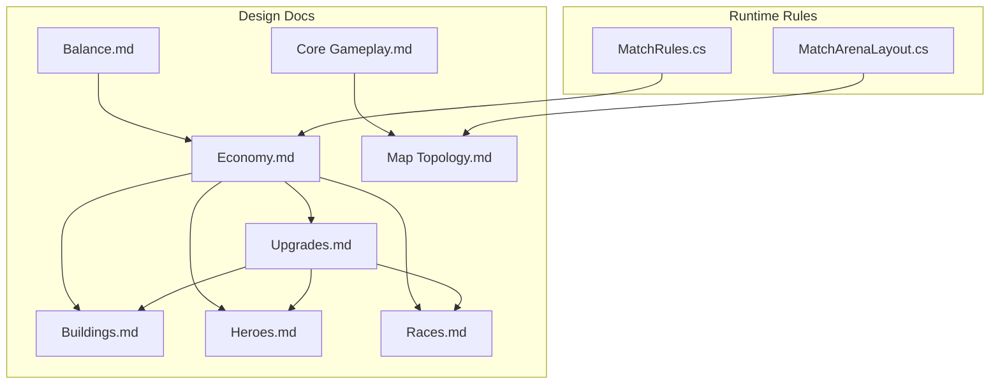
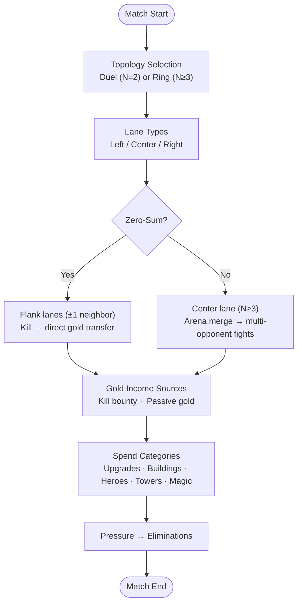
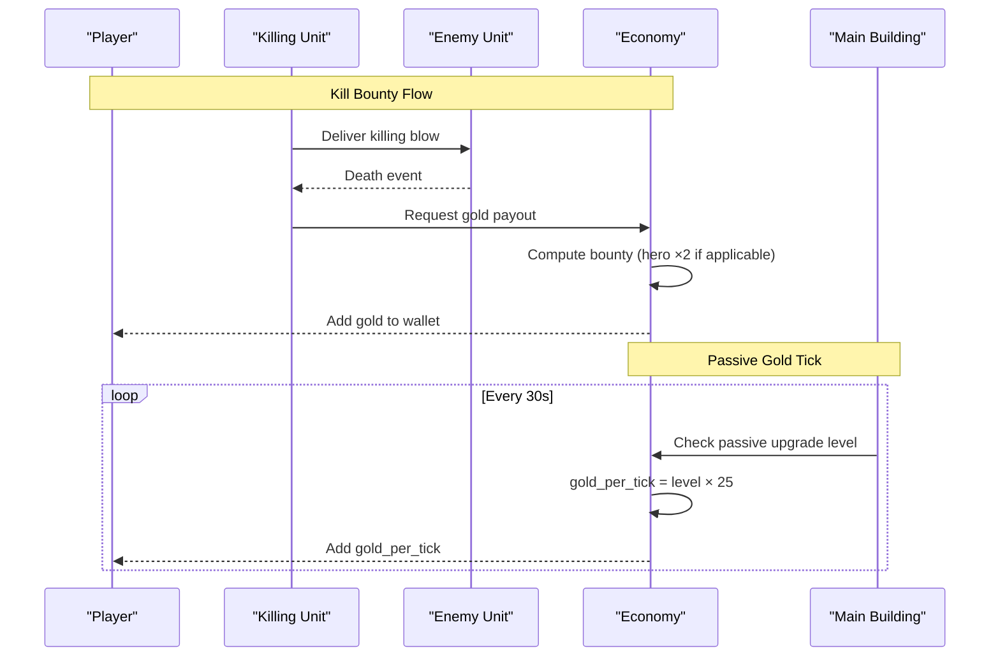
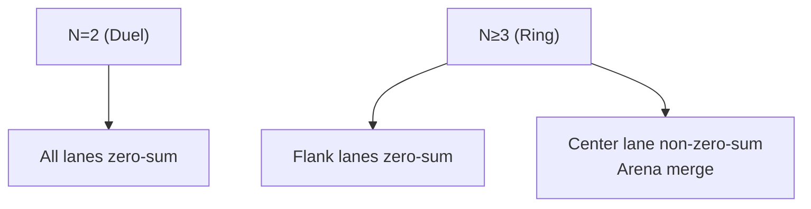
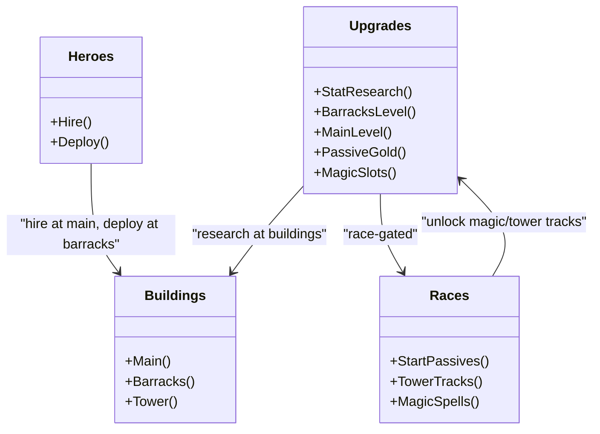
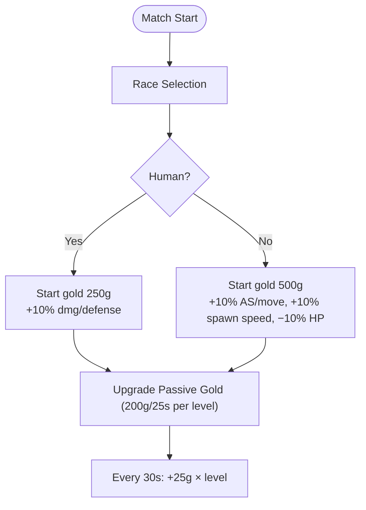
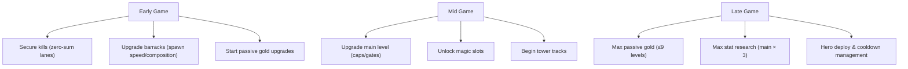
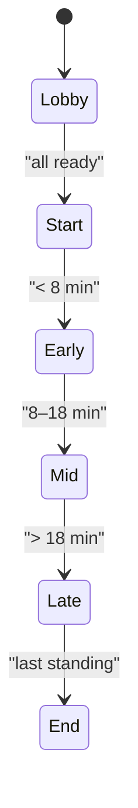
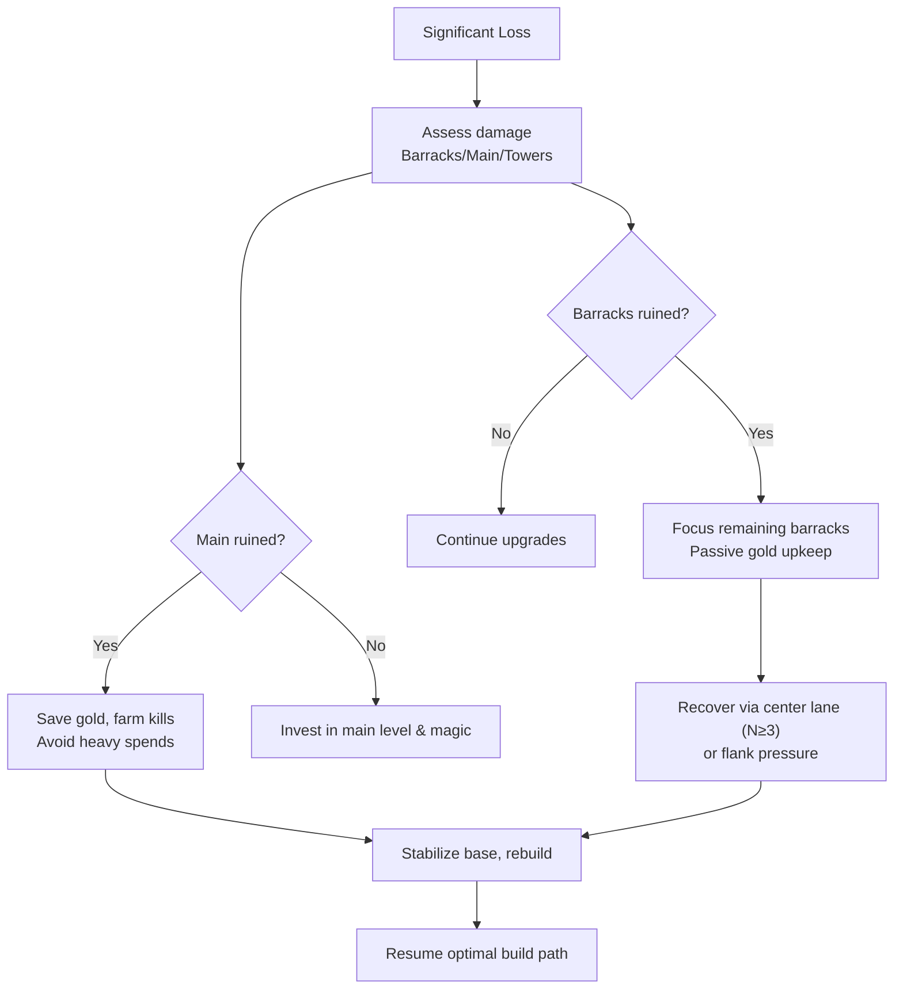
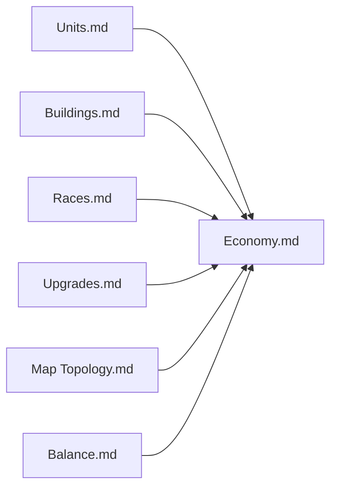

# Economy & Resource Management

<cite>
**Referenced Files in This Document**
- [Economy.md](file://Assets/Game/GameDesign/Economy.md)
- [Upgrades.md](file://Assets/Game/GameDesign/Upgrades.md)
- [Buildings.md](file://Assets/Game/GameDesign/Buildings.md)
- [Units.md](file://Assets/Game/GameDesign/Units.md)
- [Heroes.md](file://Assets/Game/GameDesign/Heroes.md)
- [Races.md](file://Assets/Game/GameDesign/Races.md)
- [Balance.md](file://Assets/Game/GameDesign/Balance.md)
- [Core Gameplay.md](file://Assets/Game/GameDesign/Core%20Gameplay.md)
- [Map Topology.md](file://Assets/Game/GameDesign/Map%20Topology.md)
- [MatchRules.cs](file://Assets/Game/Scripts/Runtime/Gameplay/Match/MatchRules.cs)
- [MatchArenaLayout.cs](file://Assets/Game/Scripts/Runtime/Gameplay/Match/MatchArenaLayout.cs)
</cite>

## Table of Contents
1. [Introduction](#introduction)
2. [Project Structure](#project-structure)
3. [Core Components](#core-components)
4. [Architecture Overview](#architecture-overview)
5. [Detailed Component Analysis](#detailed-component-analysis)
6. [Dependency Analysis](#dependency-analysis)
7. [Performance Considerations](#performance-considerations)
8. [Troubleshooting Guide](#troubleshooting-guide)
9. [Conclusion](#conclusion)
10. [Appendices](#appendices)

## Introduction
This document explains BARAKI’s economy and resource management systems with a focus on gold income, spending categories, passive generation, timing considerations, and strategic implications across different lane types and player counts. It synthesizes design documents and runtime constants to provide a clear, actionable guide for players and designers.

## Project Structure
The economy system is defined primarily through design documents and enforced by runtime rules:
- Design docs define income sources, costs, upgrade tracks, race passives, and building interactions.
- Runtime code enforces starting gold per race and match phase boundaries that influence economic pacing.

**Diagram sources**
- [Economy.md:1-123](file://Assets/Game/GameDesign/Economy.md#L1-L123)
- [Upgrades.md:1-211](file://Assets/Game/GameDesign/Upgrades.md#L1-L211)
- [Buildings.md:1-293](file://Assets/Game/GameDesign/Buildings.md#L1-L293)
- [Heroes.md:1-219](file://Assets/Game/GameDesign/Heroes.md#L1-L219)
- [Races.md:1-491](file://Assets/Game/GameDesign/Races.md#L1-L491)
- [Core Gameplay.md:1-125](file://Assets/Game/GameDesign/Core%20Gameplay.md#L1-L125)
- [Map Topology.md:1-269](file://Assets/Game/GameDesign/Map%20Topology.md#L1-L269)
- [Balance.md:1-155](file://Assets/Game/GameDesign/Balance.md#L1-L155)
- [MatchRules.cs:1-46](file://Assets/Game/Scripts/Runtime/Gameplay/Match/MatchRules.cs#L1-L46)
- [MatchArenaLayout.cs:1-53](file://Assets/Game/Scripts/Runtime/Gameplay/Match/MatchArenaLayout.cs#L1-L53)

**Section sources**
- [Economy.md:1-123](file://Assets/Game/GameDesign/Economy.md#L1-L123)
- [Upgrades.md:1-211](file://Assets/Game/GameDesign/Upgrades.md#L1-L211)
- [Buildings.md:1-293](file://Assets/Game/GameDesign/Buildings.md#L1-L293)
- [Heroes.md:1-219](file://Assets/Game/GameDesign/Heroes.md#L1-L219)
- [Races.md:1-491](file://Assets/Game/GameDesign/Races.md#L1-L491)
- [Core Gameplay.md:1-125](file://Assets/Game/GameDesign/Core%20Gameplay.md#L1-L125)
- [Map Topology.md:1-269](file://Assets/Game/GameDesign/Map%20Topology.md#L1-L269)
- [Balance.md:1-155](file://Assets/Game/GameDesign/Balance.md#L1-L155)
- [MatchRules.cs:1-46](file://Assets/Game/Scripts/Runtime/Gameplay/Match/MatchRules.cs#L1-L46)
- [MatchArenaLayout.cs:1-53](file://Assets/Game/Scripts/Runtime/Gameplay/Match/MatchArenaLayout.cs#L1-L53)

## Core Components
- Gold as the sole MVP resource with hard caps and no interest.
- Two income sources: kill bounties and passive gold ticks from main building upgrades.
- Spending categories include unit stat research, barracks upgrades, main building upgrades, hero hiring/deployment, tower enhancements, and race-specific magic unlocks.
- Race passives adjust starting gold and early-game pressure.

Key numbers:
- Starting gold: 500g baseline; Humans start with 250g due to a negative passive.
- Passive gold: +25g every 30s per level of the passive upgrade, capped at 9 levels (gate = main level × 3).
- Kill bounty: awarded to the owner of the unit delivering the killing blow; heroes grant double bounty.

**Section sources**
- [Economy.md:1-123](file://Assets/Game/GameDesign/Economy.md#L1-L123)
- [Upgrades.md:117-131](file://Assets/Game/GameDesign/Upgrades.md#L117-L131)
- [Races.md:93-146](file://Assets/Game/GameDesign/Races.md#L93-L146)
- [MatchRules.cs:10-18](file://Assets/Game/Scripts/Runtime/Gameplay/Match/MatchRules.cs#L10-L18)

## Architecture Overview
The economy architecture ties together map topology, lane behavior, and income models:
- Flank lanes are zero-sum: kills directly transfer gold between two opponents.
- Center lane is non-zero-sum when N ≥ 3: multiple opponents converge in the arena, enabling multi-opponent kills and broader gold opportunities.
- In duel mode (N=2), all lanes are zero-sum.

**Diagram sources**
- [Core Gameplay.md:40-73](file://Assets/Game/GameDesign/Core%20Gameplay.md#L40-L73)
- [Map Topology.md:14-41](file://Assets/Game/GameDesign/Map%20Topology.md#L14-L41)
- [Economy.md:24-62](file://Assets/Game/GameDesign/Economy.md#L24-L62)

**Section sources**
- [Core Gameplay.md:40-73](file://Assets/Game/GameDesign/Core%20Gameplay.md#L40-L73)
- [Map Topology.md:14-41](file://Assets/Game/GameDesign/Map%20Topology.md#L14-L41)
- [Economy.md:24-62](file://Assets/Game/GameDesign/Economy.md#L24-L62)

## Detailed Component Analysis

### Gold Income System
- Kill bounty:
  - Formula-based payout to the killer’s owner; assists not counted in MVP.
  - Hero kills yield double bounty.
  - Building kills do not award gold in MVP.
- Passive gold:
  - Ticks every 30 seconds.
  - Base growth is 0 without upgrades; each level of the passive upgrade adds +25g per tick.
  - Max upgrade level is 9, gated by main building level (×3 cap).

**Diagram sources**
- [Economy.md:26-62](file://Assets/Game/GameDesign/Economy.md#L26-L62)
- [Units.md:145-209](file://Assets/Game/GameDesign/Units.md#L145-L209)
- [Upgrades.md:117-131](file://Assets/Game/GameDesign/Upgrades.md#L117-L131)

**Section sources**
- [Economy.md:26-62](file://Assets/Game/GameDesign/Economy.md#L26-L62)
- [Units.md:145-209](file://Assets/Game/GameDesign/Units.md#L145-L209)
- [Upgrades.md:117-131](file://Assets/Game/GameDesign/Upgrades.md#L117-L131)

### Zero-Sum vs Non-Zero-Sum Across Lanes and Player Counts
- Duel (N=2): All lanes are zero-sum; center does not create extra gold opportunities beyond faster delivery.
- FFA (N≥3): Center lane merges into the Central Arena, enabling non-zero-sum dynamics where one kill can involve multiple opponents and shift momentum.

**Diagram sources**
- [Core Gameplay.md:40-73](file://Assets/Game/GameDesign/Core%20Gameplay.md#L40-L73)
- [Map Topology.md:76-106](file://Assets/Game/GameDesign/Map%20Topology.md#L76-L106)

**Section sources**
- [Core Gameplay.md:40-73](file://Assets/Game/GameDesign/Core%20Gameplay.md#L40-L73)
- [Map Topology.md:76-106](file://Assets/Game/GameDesign/Map%20Topology.md#L76-L106)

### Spending Categories
- Unit upgrades (stat research): Global per-race tracks with increasing costs and times; capped by main building level.
- Barracks improvements: Per-barracks level upgrades increase squad composition and spawn speed.
- Main building upgrades: Increase gates (stat cap, hero hire limit, magic slots) and unlock passive gold track.
- Hero hiring and deployment: Hire once per hero at main; deploy instantly from a living barracks.
- Tower enhancements: Race-specific tracks per tower; race-wide effects; parallel queues up to four towers.
- Race-specific abilities: Magic upgrades in main unlock caster spells; tower tracks add unique effects.

**Diagram sources**
- [Upgrades.md:1-211](file://Assets/Game/GameDesign/Upgrades.md#L1-L211)
- [Buildings.md:136-184](file://Assets/Game/GameDesign/Buildings.md#L136-L184)
- [Heroes.md:45-90](file://Assets/Game/GameDesign/Heroes.md#L45-L90)
- [Races.md:252-377](file://Assets/Game/GameDesign/Races.md#L252-L377)

**Section sources**
- [Upgrades.md:1-211](file://Assets/Game/GameDesign/Upgrades.md#L1-L211)
- [Buildings.md:136-184](file://Assets/Game/GameDesign/Buildings.md#L136-L184)
- [Heroes.md:45-90](file://Assets/Game/GameDesign/Heroes.md#L45-L90)
- [Races.md:252-377](file://Assets/Game/GameDesign/Races.md#L252-L377)

### Passive Gold Generation and Race Passives
- Passive gold:
  - Upgrade cost: flat 200g per level; research time: 25s per level.
  - Effect: +25g per 30s tick per level; max 9 levels; gate = main level × 3.
- Race passives:
  - Humans: +10% damage and defense, but −250 starting gold.
  - Bugs: +10% attack/move speed and +10% barracks spawn speed, but −10% unit HP.

**Diagram sources**
- [Economy.md:64-75](file://Assets/Game/GameDesign/Economy.md#L64-L75)
- [Upgrades.md:117-131](file://Assets/Game/GameDesign/Upgrades.md#L117-L131)
- [Races.md:93-146](file://Assets/Game/GameDesign/Races.md#L93-L146)

**Section sources**
- [Economy.md:64-75](file://Assets/Game/GameDesign/Economy.md#L64-L75)
- [Upgrades.md:117-131](file://Assets/Game/GameDesign/Upgrades.md#L117-L131)
- [Races.md:93-146](file://Assets/Game/GameDesign/Races.md#L93-L146)

### Timing Considerations and Investment Prioritization
- Early game:
  - Focus on securing kills in zero-sum lanes to fund initial upgrades.
  - Prioritize barracks level for spawn acceleration and squad composition.
  - Consider passive gold upgrade to stabilize mid-game income.
- Mid game:
  - Invest in main level to unlock higher stat caps, additional heroes, and more magic slots.
  - Begin tower upgrades for race-specific advantages.
- Late game:
  - Maximize passive gold and stat research within main-level caps.
  - Deploy heroes strategically; manage cooldowns after deaths.

[No sources needed since this section provides general guidance]

### Economic Pressure and Match Pacing
- Economic pressure arises from the trade-offs between saving for passive income versus spending on immediate power spikes (heroes, upgrades).
- Match phases influence pacing:
  - Early phase ends around 8 minutes.
  - Mid phase ends around 18 minutes.
  - Late phase follows thereafter.
- These thresholds help frame investment decisions and escalation timing.

**Diagram sources**
- [MatchRules.cs:8-33](file://Assets/Game/Scripts/Runtime/Gameplay/Match/MatchRules.cs#L8-L33)

**Section sources**
- [MatchRules.cs:8-33](file://Assets/Game/Scripts/Runtime/Gameplay/Match/MatchRules.cs#L8-L33)

### Optimal Economic Builds and Recovery Strategies
- Optimal builds:
  - Early: secure kills, invest in barracks level for faster waves; begin passive gold upgrade to smooth income.
  - Mid: upgrade main level to unlock stat caps and magic; start tower tracks aligned with race strengths.
  - Late: maximize passive gold and stat research; maintain hero presence via timely deployments.
- Recovery after significant losses:
  - If barracks destroyed: ruins freeze squad level and revert to L1 interval; prioritize rebuilding pressure via remaining barracks and passive income.
  - If main destroyed: passive gold stops; rely on kill income and existing upgrades; avoid further risky investments until stability returns.
  - Use center lane non-zero-sum dynamics (N≥3) to pivot toward high-value engagements and recover gold quickly.

[No sources needed since this section provides general guidance]

## Dependency Analysis
- Economy depends on:
  - Units’ gold_bounty values and hero double-bounty rule.
  - Buildings’ upgrade availability and gates (main level caps).
  - Races’ passives affecting starting gold and early stats.
  - Map topology influencing lane gold models and engagement density.

**Diagram sources**
- [Units.md:145-209](file://Assets/Game/GameDesign/Units.md#L145-L209)
- [Buildings.md:136-184](file://Assets/Game/GameDesign/Buildings.md#L136-L184)
- [Races.md:93-146](file://Assets/Game/GameDesign/Races.md#L93-L146)
- [Upgrades.md:1-211](file://Assets/Game/GameDesign/Upgrades.md#L1-L211)
- [Map Topology.md:14-41](file://Assets/Game/GameDesign/Map%20Topology.md#L14-L41)
- [Balance.md:1-155](file://Assets/Game/GameDesign/Balance.md#L1-L155)

**Section sources**
- [Units.md:145-209](file://Assets/Game/GameDesign/Units.md#L145-L209)
- [Buildings.md:136-184](file://Assets/Game/GameDesign/Buildings.md#L136-L184)
- [Races.md:93-146](file://Assets/Game/GameDesign/Races.md#L93-L146)
- [Upgrades.md:1-211](file://Assets/Game/GameDesign/Upgrades.md#L1-L211)
- [Map Topology.md:14-41](file://Assets/Game/GameDesign/Map%20Topology.md#L14-L41)
- [Balance.md:1-155](file://Assets/Game/GameDesign/Balance.md#L1-L155)

## Performance Considerations
- No explicit performance constraints are documented for the economy system itself; however, balancing targets suggest longer matches at higher player counts, which may affect long-term passive income accumulation and upgrade pacing.
- The fixed economy scaling across player counts ensures consistent decision-making regardless of N, while geometry changes impact engagement frequency and kill opportunities.

[No sources needed since this section provides general guidance]

## Troubleshooting Guide
- Unexpected gold payouts:
  - Verify killer attribution and hero double-bounty rule.
  - Confirm building kills do not award gold in MVP.
- Passive gold not ticking:
  - Ensure passive upgrade levels are purchased and main building is alive.
  - Check main level gating (max levels = main × 3).
- Race starting gold mismatch:
  - Confirm race selection; Humans start with 250g due to levy tax passive.

**Section sources**
- [Economy.md:26-75](file://Assets/Game/GameDesign/Economy.md#L26-L75)
- [Upgrades.md:117-131](file://Assets/Game/GameDesign/Upgrades.md#L117-L131)
- [Races.md:93-113](file://Assets/Game/GameDesign/Races.md#L93-L113)
- [MatchRules.cs:10-18](file://Assets/Game/Scripts/Runtime/Gameplay/Match/MatchRules.cs#L10-L18)

## Conclusion
BARAKI’s economy centers on kill-driven gold and scalable passive income, shaped by lane topology and race passives. Strategic tension emerges from balancing immediate power spikes against long-term income growth, with timing and investment prioritization critical across early, mid, and late phases. Understanding zero-sum and non-zero-sum dynamics enables players to optimize pressure and recovery strategies effectively.

[No sources needed since this section summarizes without analyzing specific files]

## Appendices

### Key Economic Constants Summary
- Starting gold: 500g baseline; Humans 250g.
- Passive gold: +25g per 30s per level; max 9 levels; gate = main × 3.
- Kill bounty: unit gold_bounty; hero ×2; building kills = 0.
- Costs:
  - Main level: 2000g (→2), 3000g (→3); times 120/180s.
  - Passive gold: 200g per level; 25s per level.
  - Magic slots: 800/1500/2500g; 60/90/135s.
  - Barracks level: 1000/1500/2500g; 45/90/135s.
  - Tower upgrades: 500/800/1200g; 45/90/135s per level.
  - Stat research: escalating costs and times per track.

**Section sources**
- [Economy.md:77-123](file://Assets/Game/GameDesign/Economy.md#L77-L123)
- [Upgrades.md:22-151](file://Assets/Game/GameDesign/Upgrades.md#L22-L151)
- [Upgrades.md:161-178](file://Assets/Game/GameDesign/Upgrades.md#L161-L178)
- [Upgrades.md:100-115](file://Assets/Game/GameDesign/Upgrades.md#L100-L115)
- [Races.md:252-286](file://Assets/Game/GameDesign/Races.md#L252-L286)
- [Balance.md:54-65](file://Assets/Game/GameDesign/Balance.md#L54-L65)