# Game Design Documentation

<cite>
**Referenced Files in This Document**
- [Vision.md](file://Assets/Game/GameDesign/Vision.md)
- [README.md](file://Assets/Game/GameDesign/README.md)
- [Core Gameplay.md](file://Assets/Game/GameDesign/Core%20Gameplay.md)
- [Map Topology.md](file://Assets/Game/GameDesign/Map%20Topology.md)
- [Match Flow.md](file://Assets/Game/GameDesign/Match%20Flow.md)
- [Economy.md](file://Assets/Game/GameDesign/Economy.md)
- [Buildings.md](file://Assets/Game/GameDesign/Buildings.md)
- [Units.md](file://Assets/Game/GameDesign/Units.md)
- [Upgrades.md](file://Assets/Game/GameDesign/Upgrades.md)
- [Heroes.md](file://Assets/Game/GameDesign/Heroes.md)
- [Races.md](file://Assets/Game/GameDesign/Races.md)
- [AI.md](file://Assets/Game/GameDesign/AI.md)
- [Balance.md](file://Assets/Game/GameDesign/Balance.md)
</cite>

## Table of Contents
1. [Introduction](#introduction)
2. [Project Structure](#project-structure)
3. [Core Components](#core-components)
4. [Architecture Overview](#architecture-overview)
5. [Detailed Component Analysis](#detailed-component-analysis)
6. [Dependency Analysis](#dependency-analysis)
7. [Performance Considerations](#performance-considerations)
8. [Troubleshooting Guide](#troubleshooting-guide)
9. [Conclusion](#conclusion)
10. [Appendices](#appendices)

## Introduction
BARAKI is a multiplayer Free-for-All strategy game where players manage their base rather than directly controlling units. The core loop emphasizes macro decisions: upgrading buildings, researching upgrades, hiring and deploying heroes, and defending or pressuring lanes. Units march autonomously along three lanes per player (Left, Center, Right), engaging enemies and earning gold for kills. The design targets 2–8 human-only matches with scalable topology and consistent balance across player counts.

Key pillars:
- Macro over micro: no direct unit control during combat.
- Three-lane politics: flank lanes are zero-sum duels; center lane merges into a central arena for multi-opponent engagements.
- Scalable FFA: same stats and economy for N=2..8; map geometry adapts to player count.
- Defense matters: losing buildings cripples but does not immediately eliminate you until all eight structures fall.
- Original identity: unique races with asymmetric passives, tower upgrades, and caster magic.

This document synthesizes the AI-ready GDD format used throughout the repository, including entity definitions and locked decisions that drive implementation.

**Section sources**
- [Vision.md:1-108](file://Assets/Game/GameDesign/Vision.md#L1-L108)
- [README.md:1-61](file://Assets/Game/GameDesign/README.md#L1-L61)

## Project Structure
The project’s design documentation is organized as an AI-ready GDD set under Assets/Game/GameDesign. Each document uses YAML front matter and structured entity blocks to define systems consistently. Core gameplay, economy, buildings, units, upgrades, heroes, races, AI behavior, match flow, map topology, and balance are each documented with explicit IDs and locked decisions.

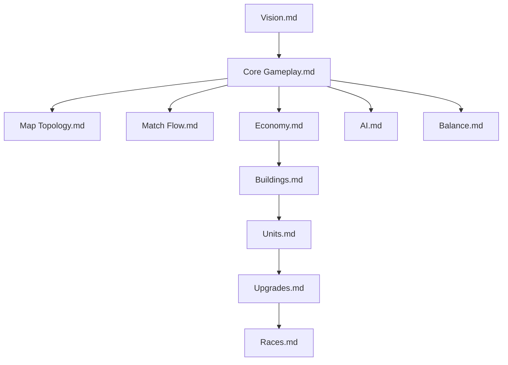

**Diagram sources**
- [README.md:24-42](file://Assets/Game/GameDesign/README.md#L24-L42)
- [Vision.md:44-63](file://Assets/Game/GameDesign/Vision.md#L44-L63)

**Section sources**
- [README.md:1-61](file://Assets/Game/GameDesign/README.md#L1-L61)

## Core Components
- Base management focus: Players influence outcomes via building levels, stat research, hero hire/deploy, and tower upgrades. No unit selection or direct commands in combat.
- Lane-based combat: Each barracks spawns waves independently along its lane spline; units march, engage, and earn kill bounties.
- Unit roles: Melee frontline, ranged backline, caster support/DPS, siege structure pressure, flying ranged air, super siege ranged.
- Building system: Main hall, 3 barracks (one per lane), 4 towers around main. Destruction yields ruins with specific effects; elimination requires destroying all 8 buildings.
- Economy model: Gold from kill bounties and passive income ticks gated by main level upgrades. Starting gold varies by race passives.
- Balance philosophy: Fixed stats/economy/spawn intervals across N=2..8; only map geometry scales. Playtest duration targets vary by N.

**Section sources**
- [Core Gameplay.md:1-125](file://Assets/Game/GameDesign/Core%20Gameplay.md#L1-L125)
- [Units.md:1-294](file://Assets/Game/GameDesign/Units.md#L1-L294)
- [Buildings.md:1-293](file://Assets/Game/GameDesign/Buildings.md#L1-L293)
- [Economy.md:1-123](file://Assets/Game/GameDesign/Economy.md#L1-L123)
- [Balance.md:1-155](file://Assets/Game/GameDesign/Balance.md#L1-L155)

## Architecture Overview
The game architecture centers on a server-authoritative match state machine with procedural map generation and deterministic combat resolution. Player actions modify building states, upgrade queues, and hero deployment. Units follow lane splines with autonomous targeting and combat rules.

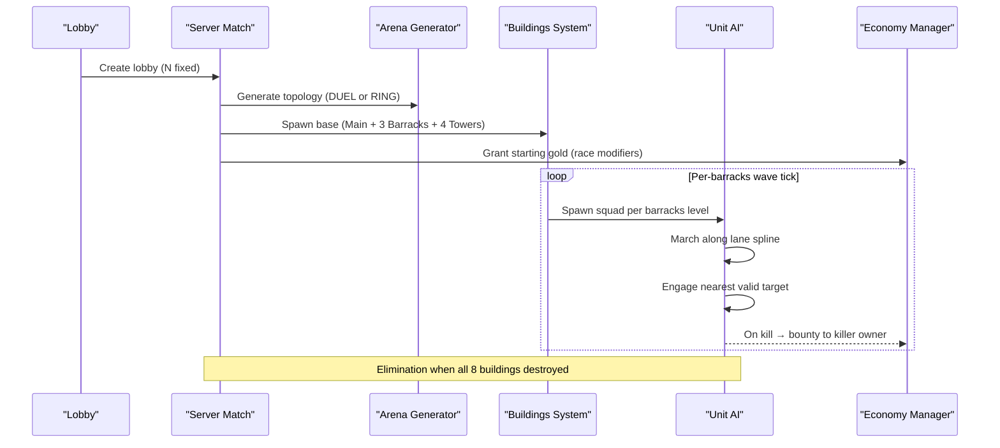

**Diagram sources**
- [Match Flow.md:74-102](file://Assets/Game/GameDesign/Match%20Flow.md#L74-L102)
- [Map Topology.md:109-165](file://Assets/Game/GameDesign/Map%20Topology.md#L109-L165)
- [Buildings.md:136-184](file://Assets/Game/GameDesign/Buildings.md#L136-L184)
- [Economy.md:24-62](file://Assets/Game/GameDesign/Economy.md#L24-L62)

## Detailed Component Analysis

### Core Gameplay Loop
- Kill enemy units → receive gold bounty.
- Spend gold on upgrades, buildings, heroes.
- Stronger waves and defense tools apply pressure on lanes.
- Pressure lanes → eliminate foes → repeat.

Player never selects units; influence is through buildings, upgrades, heroes, and defense.

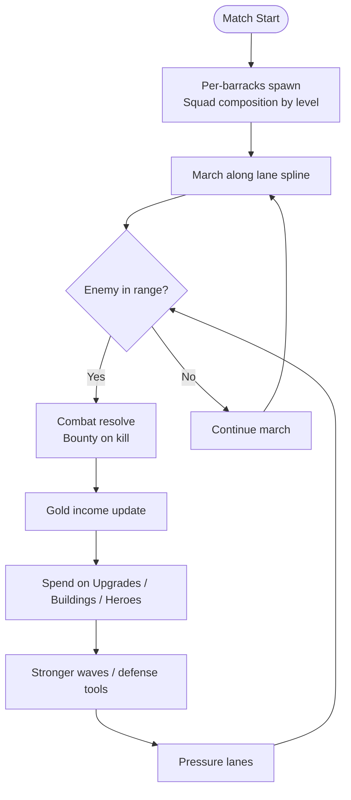

**Diagram sources**
- [Core Gameplay.md:11-32](file://Assets/Game/GameDesign/Core%20Gameplay.md#L11-L32)
- [Units.md:267-276](file://Assets/Game/GameDesign/Units.md#L267-L276)
- [Economy.md:24-62](file://Assets/Game/GameDesign/Economy.md#L24-L62)

**Section sources**
- [Core Gameplay.md:1-125](file://Assets/Game/GameDesign/Core%20Gameplay.md#L1-L125)

### Lane-Based Combat and Positioning
- Lanes: Left flank (zero-sum vs neighbor CCW), Center (non-zero-sum at Central Arena for N≥3), Right flank (zero-sum vs neighbor CW).
- Center lane merge: All center flows converge in the arena; units fight any enemy in the arena zone.
- Retargeting: If primary center target is eliminated, ongoing center waves retarget next alive slot clockwise.
- Flank lanes remain bound to neighbors ±1 regardless of eliminations.

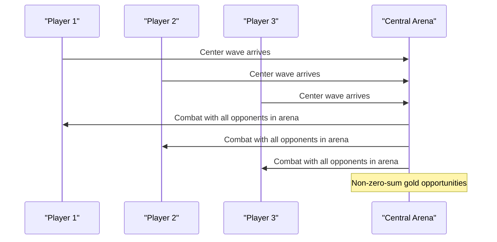

**Diagram sources**
- [Map Topology.md:135-165](file://Assets/Game/GameDesign/Map%20Topology.md#L135-L165)
- [Core Gameplay.md:36-74](file://Assets/Game/GameDesign/Core%20Gameplay.md#L36-L74)

**Section sources**
- [Map Topology.md:1-269](file://Assets/Game/GameDesign/Map%20Topology.md#L1-L269)
- [Core Gameplay.md:36-74](file://Assets/Game/GameDesign/Core%20Gameplay.md#L36-L74)

### Unit Roles and Behavior
- Roles: Melee frontline, Ranged backline, Caster support/DPS, Siege structure pressure, Flying ranged air, Super siege ranged.
- Targeting: Melee chase and stop within attack range; Ranged engage nearest in range; Caster casts spells if available; Siege prioritizes buildings; Flying attacks ground/ranged/flying; Super prioritizes buildings.
- Movement: Route-follow along lane splines with local ally avoidance; server-authoritative without NavMesh.
- Death: Despawn and trigger kill event for bounty distribution.

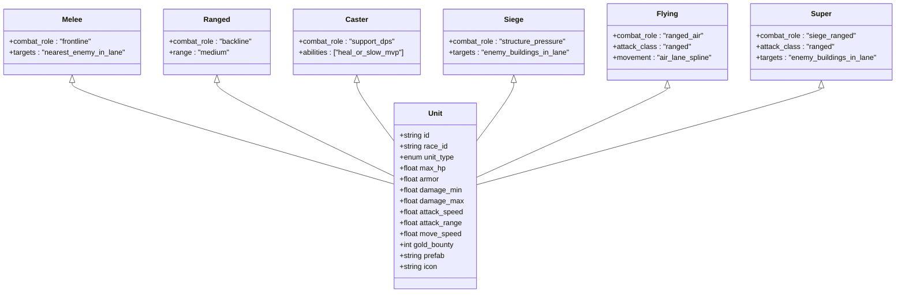

**Diagram sources**
- [Units.md:11-51](file://Assets/Game/GameDesign/Units.md#L11-L51)
- [Units.md:53-75](file://Assets/Game/GameDesign/Units.md#L53-L75)

**Section sources**
- [Units.md:1-294](file://Assets/Game/GameDesign/Units.md#L1-L294)
- [AI.md:25-64](file://Assets/Game/GameDesign/AI.md#L25-L64)

### Building System and Base Progression
- Layout: Main at center; 4 towers in square around main; 3 barracks outside between towers; 3 lanes originate from barracks.
- Levels: Main up to 3; Barracks up to 4; Tower upgrades per track up to 3.
- Destruction: Barracks ruins freeze squad and revert to L1 interval; Towers become non-functional ruins; Main ruins disable abilities and passive gold but do not eliminate.
- Elimination: Only when all 8 buildings are destroyed.

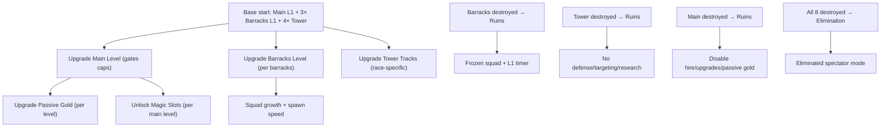

**Diagram sources**
- [Buildings.md:36-112](file://Assets/Game/GameDesign/Buildings.md#L36-L112)
- [Buildings.md:186-253](file://Assets/Game/GameDesign/Buildings.md#L186-L253)
- [Buildings.md:268-293](file://Assets/Game/GameDesign/Buildings.md#L268-L293)

**Section sources**
- [Buildings.md:1-293](file://Assets/Game/GameDesign/Buildings.md#L1-L293)

### Economy Model
- Income sources: Kill bounties and passive gold ticks every 30 seconds.
- Passive gold: Starts at 0; each upgrade level adds +25g/tick; cap by main level × 3 (max 9 levels).
- Starting gold: 500g base; Humans start with -250 due to Levy Tax passive.
- Costs: Main level, passive gold, magic slots, barracks level, tower tracks, stat upgrades, hero hire/deploy.
- Spending rules: No negative balance; one active queue per building type; full refund on cancel.

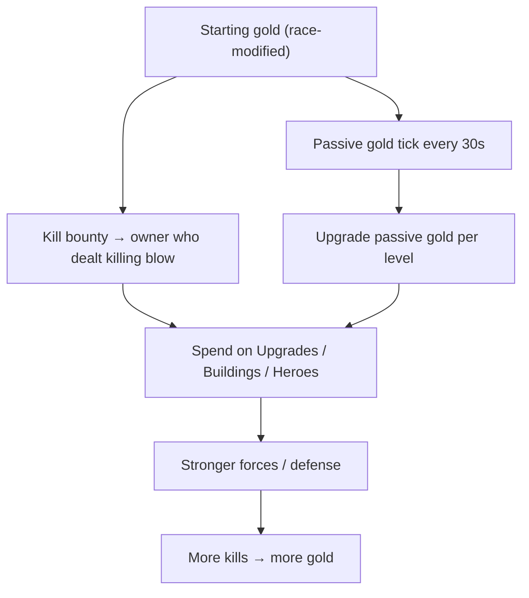

**Diagram sources**
- [Economy.md:24-62](file://Assets/Game/GameDesign/Economy.md#L24-L62)
- [Economy.md:77-98](file://Assets/Game/GameDesign/Economy.md#L77-L98)

**Section sources**
- [Economy.md:1-123](file://Assets/Game/GameDesign/Economy.md#L1-L123)

### Upgrades and Research
- Stat research: Global per race, up to 9 levels per track; actual cap = main level × 3.
- Tracks: Melee damage, Ranged damage, Armor, Caster heal.
- Main magic: Race-unique spells unlocked via main magic slots (1/2/3 based on main level).
- Tower upgrades: 5 tracks per race, levels 1–3; parallel research across 4 towers.

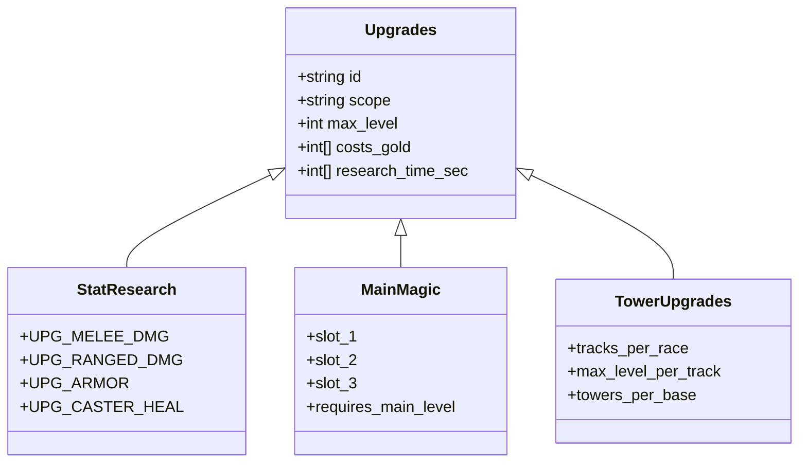

**Diagram sources**
- [Upgrades.md:67-98](file://Assets/Game/GameDesign/Upgrades.md#L67-L98)
- [Upgrades.md:133-151](file://Assets/Game/GameDesign/Upgrades.md#L133-L151)
- [Upgrades.md:161-178](file://Assets/Game/GameDesign/Upgrades.md#L161-L178)

**Section sources**
- [Upgrades.md:1-211](file://Assets/Game/GameDesign/Upgrades.md#L1-L211)

### Heroes
- Hire: From Main building, once per hero, cost 500g.
- Deploy: Instant spawn at barracks rally point, cost 1000g; cooldown after death 300s; re-deploy allowed without re-hire.
- Morale: Idle heroes grant stacking bonuses (+10% dmg/AS/armor per slot); deployed/dead heroes provide no morale.
- AI: Attack nearest threat, prioritize buildings if no units, draw tower fire.

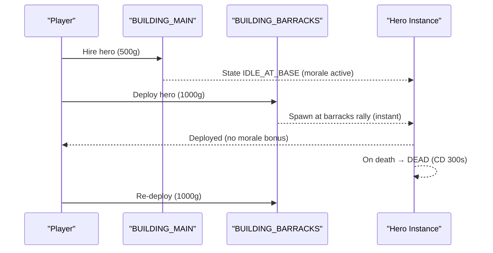

**Diagram sources**
- [Heroes.md:63-89](file://Assets/Game/GameDesign/Heroes.md#L63-L89)
- [Heroes.md:91-123](file://Assets/Game/GameDesign/Heroes.md#L91-L123)

**Section sources**
- [Heroes.md:1-219](file://Assets/Game/GameDesign/Heroes.md#L1-L219)

### Races and Asymmetry
- Two MVP races: Humans and Bugs.
- Asymmetry axes: Start passives (2 positive, 1 negative), tower upgrades, caster magic, magic upgrades.
- Human passives: +10% damage, +10% defense, -250 starting gold.
- Bug passives: +10% attack/move speed, +10% barracks spawn speed, -10% HP.
- Magic spells: Unique per race; unlock via main magic slots.

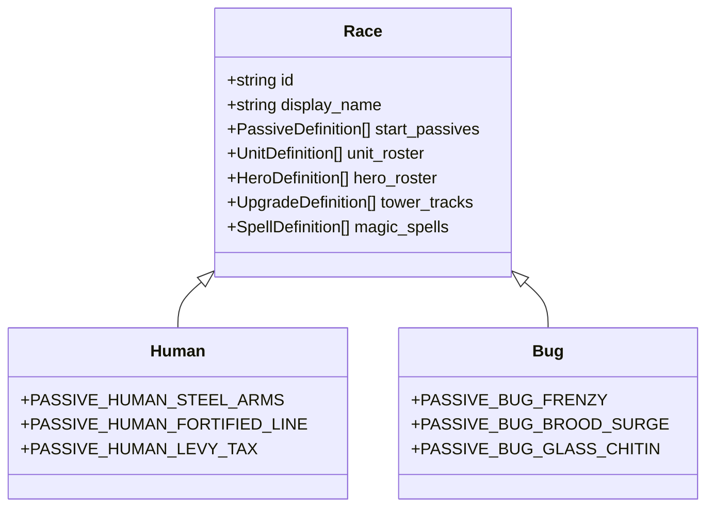

**Diagram sources**
- [Races.md:93-147](file://Assets/Game/GameDesign/Races.md#L93-L147)
- [Races.md:148-249](file://Assets/Game/GameDesign/Races.md#L148-L249)

**Section sources**
- [Races.md:1-491](file://Assets/Game/GameDesign/Races.md#L1-L491)

### AI Autonomy
- Unit brain: States Spawn → March → Engage → Dead; targeting follows role priorities; no friendly fire.
- Center arena: Units can attack any enemy in arena zone; retargeting on elimination.
- Hero AI: Prioritize towers targeting hero; classic RTS behaviors.

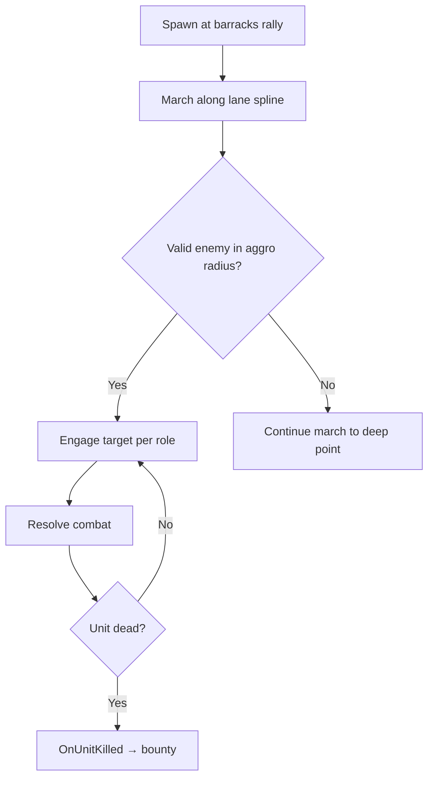

**Diagram sources**
- [AI.md:25-64](file://Assets/Game/GameDesign/AI.md#L25-L64)
- [Units.md:267-276](file://Assets/Game/GameDesign/Units.md#L267-L276)

**Section sources**
- [AI.md:1-96](file://Assets/Game/GameDesign/AI.md#L1-L96)

### Match Flow and Win Conditions
- Phases: Lobby → Countdown → GenerateArena → InProgress → Ended.
- Win condition: Last standing; no time cap.
- Elimination: All 8 buildings destroyed; eliminated players enter spectator mode with FoW off and free camera.
- Disconnect policy: Grace period 90s; no global pause; immediate elimination on expiry (MVP).

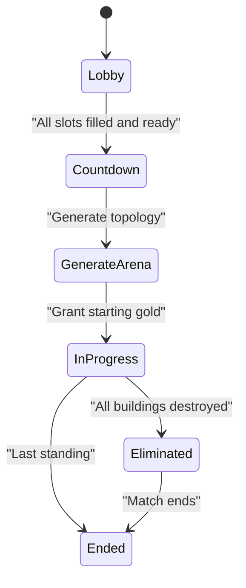

**Diagram sources**
- [Match Flow.md:74-102](file://Assets/Game/GameDesign/Match%20Flow.md#L74-L102)
- [Match Flow.md:104-132](file://Assets/Game/GameDesign/Match%20Flow.md#L104-L132)

**Section sources**
- [Match Flow.md:1-242](file://Assets/Game/GameDesign/Match%20Flow.md#L1-L242)

## Dependency Analysis
The design documents form a dependency graph where core systems rely on foundational definitions. The AI-ready format ensures stable IDs propagate across implementations.

**Diagram sources**
- [README.md:24-42](file://Assets/Game/GameDesign/README.md#L24-L42)

**Section sources**
- [README.md:1-61](file://Assets/Game/GameDesign/README.md#L1-L61)

## Performance Considerations
- Deterministic combat and route-follow reduce complexity; avoid NavMesh for performance and predictability.
- Per-barracks independent timers prevent synchronization overhead.
- Server-authoritative targeting and movement ensure consistency across clients.
- Procedural map generation scales geometry without altering stats/economy, maintaining balance and reducing tuning load.

[No sources needed since this section provides general guidance]

## Troubleshooting Guide
- Stuck units: MVP assumes good spread and ally avoidance prevents sticking; revisit formation and lane width if issues arise.
- Friendly fire: Disabled by design; verify targeting filters and lane scoping.
- Elimination edge cases: Ensure center retarget logic skips eliminated slots and updates ongoing waves.
- Disconnect handling: Implement grace period without pausing match; schedule elimination on expiry.

**Section sources**
- [AI.md:90-96](file://Assets/Game/GameDesign/AI.md#L90-L96)
- [Match Flow.md:162-184](file://Assets/Game/GameDesign/Match%20Flow.md#L162-L184)

## Conclusion
BARAKI’s design emphasizes macro strategy, lane politics, and scalable FFA with consistent balance across player counts. The AI-ready GDD format provides clear entity IDs and locked decisions to guide implementation. By focusing on base management, autonomous unit behavior, and well-defined progression systems, BARAKI delivers a strategic experience accessible to players who prefer high-level decision-making over micro-management.

[No sources needed since this section summarizes without analyzing specific files]

## Appendices

### Entity Definitions Reference
- Core entities include RES_GOLD, INCOME_KILL, INCOME_MAIN_PASSIVE, BASE_LAYOUT, BUILDING_MAIN, BUILDING_BARRACKS, BUILDING_TOWER, SQUAD_BARRACKS_L1..L4, UNIT_* types, UPG_* tracks, HERO_* definitions, RACE_* schemas, TOPOLOGY_* layouts, MATCH_FFA, PHASE_* states, ELIMINATED_SPECTATOR, DISCONNECT_POLICY_MVP, BALANCE_WAVE_INTERVAL_BASE, FORMULA_BARRACKS_WAVE_INTERVAL, etc.

These IDs should be used consistently across code, ScriptableObject assets, addressables, and tests as mandated by the AI-ready GDD format.

**Section sources**
- [Economy.md:15-22](file://Assets/Game/GameDesign/Economy.md#L15-L22)
- [Buildings.md:85-112](file://Assets/Game/GameDesign/Buildings.md#L85-L112)
- [Units.md:88-141](file://Assets/Game/GameDesign/Units.md#L88-L141)
- [Upgrades.md:72-98](file://Assets/Game/GameDesign/Upgrades.md#L72-L98)
- [Heroes.md:19-25](file://Assets/Game/GameDesign/Heroes.md#L19-L25)
- [Races.md:66-91](file://Assets/Game/GameDesign/Races.md#L66-L91)
- [Map Topology.md:25-32](file://Assets/Game/GameDesign/Map%20Topology.md#L25-L32)
- [Match Flow.md:13-24](file://Assets/Game/GameDesign/Match%20Flow.md#L13-L24)
- [Balance.md:13-33](file://Assets/Game/GameDesign/Balance.md#L13-L33)