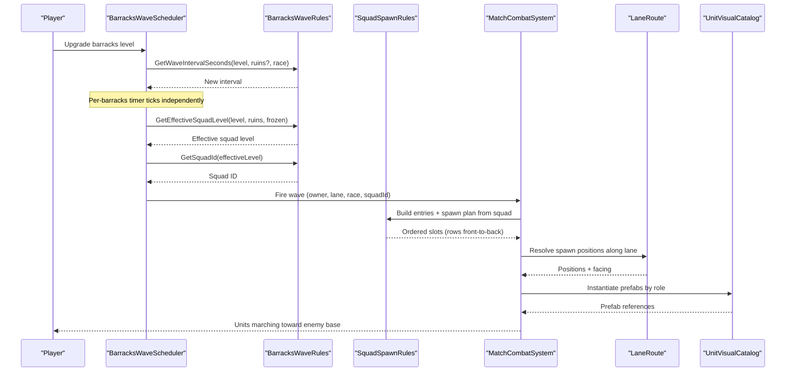
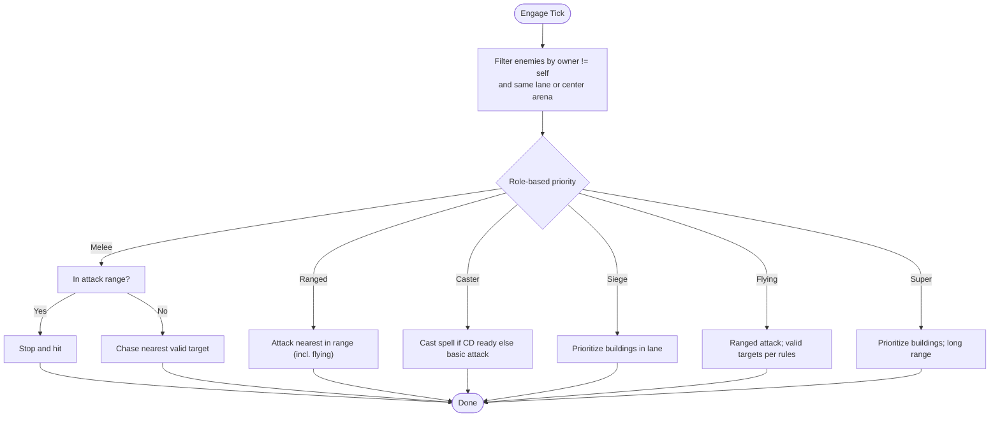
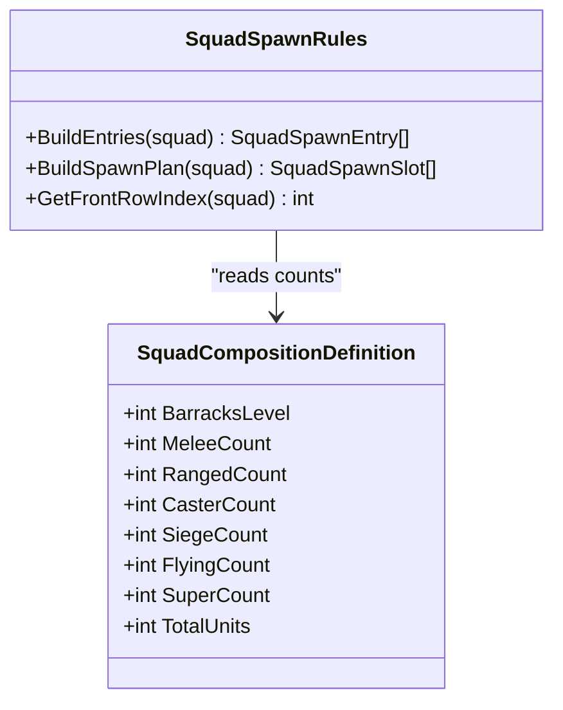
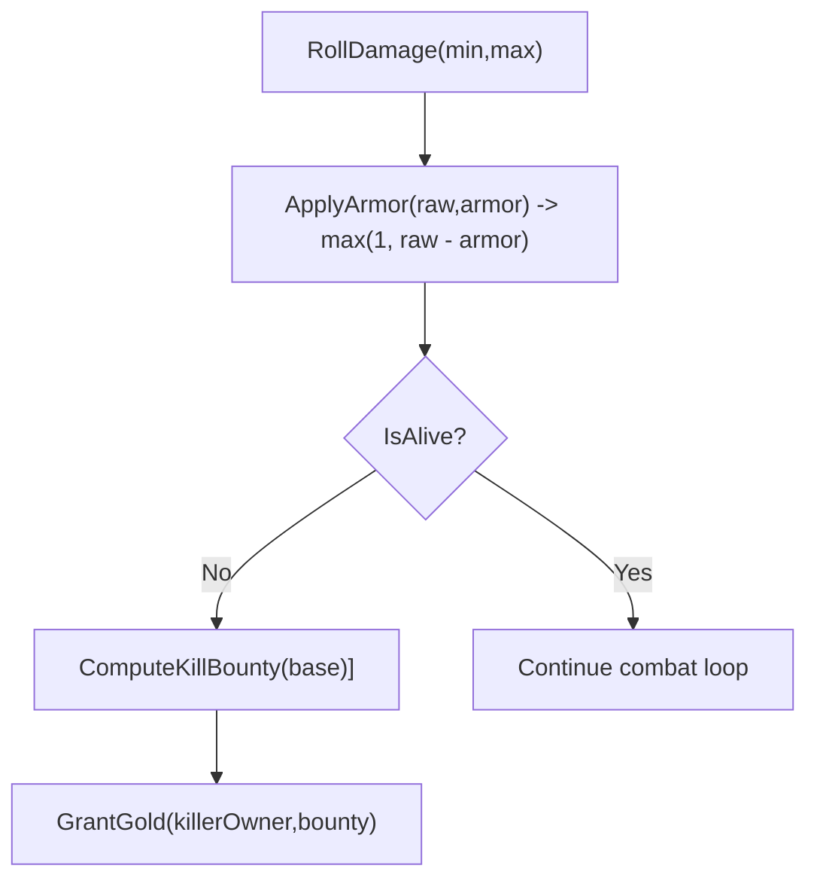
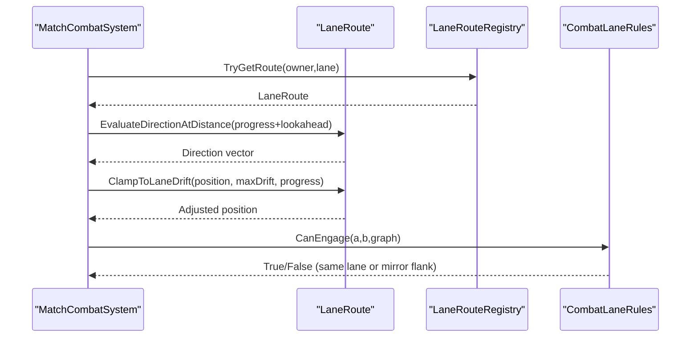
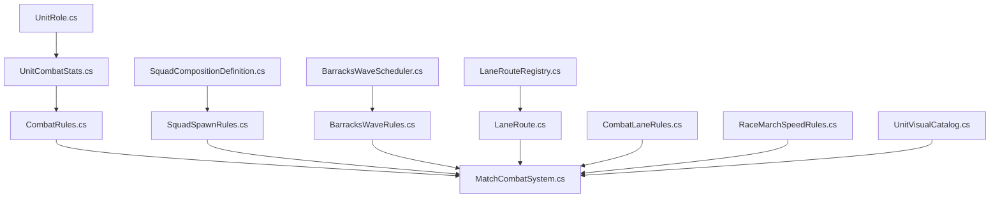

# Unit System & Roles

<cite>
**Referenced Files in This Document**
- [Units.md](file://Assets/Game/GameDesign/Units.md)
- [Core Gameplay.md](file://Assets/Game/GameDesign/Core Gameplay.md)
- [Balance.md](file://Assets/Game/GameDesign/Balance.md)
- [AI.md](file://Assets/Game/GameDesign/AI.md)
- [Races.md](file://Assets/Game/GameDesign/Races.md)
- [UnitRole.cs](file://Assets/Game/Scripts/Runtime/Gameplay/Data/UnitRole.cs)
- [UnitCombatStats.cs](file://Assets/Game/Scripts/Runtime/Gameplay/Combat/UnitCombatStats.cs)
- [CombatRules.cs](file://Assets/Game/Scripts/Runtime/Gameplay/Combat/CombatRules.cs)
- [MatchCombatSystem.cs](file://Assets/Game/Scripts/Runtime/Gameplay/Combat/MatchCombatSystem.cs)
- [SquadCompositionDefinition.cs](file://Assets/Game/Scripts/Runtime/Gameplay/Data/SquadCompositionDefinition.cs)
- [SquadSpawnRules.cs](file://Assets/Game/Scripts/Runtime/Gameplay/Combat/SquadSpawnRules.cs)
- [BarracksWaveScheduler.cs](file://Assets/Game/Scripts/Runtime/Gameplay/Match/BarracksWaveScheduler.cs)
- [BarracksWaveState.cs](file://Assets/Game/Scripts/Runtime/Gameplay/Match/BarracksWaveState.cs)
- [BarracksWaveRules.cs](file://Assets/Game/Scripts/Runtime/Gameplay/Match/BarracksWaveRules.cs)
- [LaneRoute.cs](file://Assets/Game/Scripts/Runtime/Gameplay/Combat/LaneRoute.cs)
- [LaneRouteRegistry.cs](file://Assets/Game/Scripts/Runtime/Gameplay/Combat/LaneRouteRegistry.cs)
- [CombatLaneRules.cs](file://Assets/Game/Scripts/Runtime/Gameplay/Combat/CombatLaneRules.cs)
- [RaceMarchSpeedRules.cs](file://Assets/Game/Scripts/Runtime/Gameplay/Combat/RaceMarchSpeedRules.cs)
- [UnitVisualCatalog.cs](file://Assets/Game/Scripts/Runtime/Gameplay/Match/UnitVisualCatalog.cs)
</cite>

## Table of Contents
1. [Introduction](#introduction)
2. [Project Structure](#project-structure)
3. [Core Components](#core-components)
4. [Architecture Overview](#architecture-overview)
5. [Detailed Component Analysis](#detailed-component-analysis)
6. [Dependency Analysis](#dependency-analysis)
7. [Performance Considerations](#performance-considerations)
8. [Troubleshooting Guide](#troubleshooting-guide)
9. [Conclusion](#conclusion)

## Introduction
This document explains BARAKI’s unit system and role-based combat mechanics. It covers the six unit roles, their combat behaviors and positioning, the cumulative squad composition tied to barracks levels, race-specific variations, unit autonomy along lane splines, engagement rules, and bounty systems. It also provides examples of effective compositions and counter-strategies grounded in the design and implementation.

## Project Structure
The unit system is defined by a combination of game design documents and runtime code:
- Design docs define roles, stats schema, squad composition, combat resolution, and race asymmetry.
- Runtime code implements roles, stats, combat math, wave scheduling, spawn plans, movement along lanes, and targeting rules.

```mermaid
graph TB
subgraph "Design"
U["Units.md"]
CG["Core Gameplay.md"]
B["Balance.md"]
AI["AI.md"]
R["Races.md"]
end
subgraph "Runtime Data"
UR["UnitRole.cs"]
UCS["UnitCombatStats.cs"]
SCD["SquadCompositionDefinition.cs"]
RMS["RaceMarchSpeedRules.cs"]
end
subgraph "Runtime Systems"
CR["CombatRules.cs"]
MCS["MatchCombatSystem.cs"]
SSR["SquadSpawnRules.cs"]
BWS["BarracksWaveScheduler.cs"]
BWR["BarracksWaveRules.cs"]
LR["LaneRoute.cs"]
LRR["LaneRouteRegistry.cs"]
CLR["CombatLaneRules.cs"]
UVC["UnitVisualCatalog.cs"]
end
U --> UR
U --> UCS
U --> CR
U --> SSR
U --> BWR
U --> CLR
U --> AI
CG --> BWS
CG --> LR
B --> BWR
R --> RMS
R --> UVC
```

**Diagram sources**
- [Units.md:1-294](file://Assets/Game/GameDesign/Units.md#L1-L294)
- [Core Gameplay.md:1-125](file://Assets/Game/GameDesign/Core Gameplay.md#L1-L125)
- [Balance.md:1-155](file://Assets/Game/GameDesign/Balance.md#L1-L155)
- [AI.md:1-96](file://Assets/Game/GameDesign/AI.md#L1-L96)
- [Races.md:1-491](file://Assets/Game/GameDesign/Races.md#L1-L491)
- [UnitRole.cs:1-12](file://Assets/Game/Scripts/Runtime/Gameplay/Data/UnitRole.cs#L1-L12)
- [UnitCombatStats.cs:1-74](file://Assets/Game/Scripts/Runtime/Gameplay/Combat/UnitCombatStats.cs#L1-L74)
- [CombatRules.cs:1-62](file://Assets/Game/Scripts/Runtime/Gameplay/Combat/CombatRules.cs#L1-L62)
- [SquadCompositionDefinition.cs:1-26](file://Assets/Game/Scripts/Runtime/Gameplay/Data/SquadCompositionDefinition.cs#L1-L26)
- [SquadSpawnRules.cs:1-77](file://Assets/Game/Scripts/Runtime/Gameplay/Combat/SquadSpawnRules.cs#L1-L77)
- [BarracksWaveScheduler.cs:40-159](file://Assets/Game/Scripts/Runtime/Gameplay/Match/BarracksWaveScheduler.cs#L40-L159)
- [BarracksWaveRules.cs:1-46](file://Assets/Game/Scripts/Runtime/Gameplay/Match/BarracksWaveRules.cs#L1-L46)
- [LaneRoute.cs:1-42](file://Assets/Game/Scripts/Runtime/Gameplay/Combat/LaneRoute.cs#L1-L42)
- [LaneRouteRegistry.cs:1-36](file://Assets/Game/Scripts/Runtime/Gameplay/Combat/LaneRouteRegistry.cs#L1-L36)
- [CombatLaneRules.cs:1-41](file://Assets/Game/Scripts/Runtime/Gameplay/Combat/CombatLaneRules.cs#L1-L41)
- [RaceMarchSpeedRules.cs:1-39](file://Assets/Game/Scripts/Runtime/Gameplay/Combat/RaceMarchSpeedRules.cs#L1-L39)
- [UnitVisualCatalog.cs:37-57](file://Assets/Game/Scripts/Runtime/Gameplay/Match/UnitVisualCatalog.cs#L37-L57)

**Section sources**
- [Units.md:1-294](file://Assets/Game/GameDesign/Units.md#L1-L294)
- [Core Gameplay.md:1-125](file://Assets/Game/GameDesign/Core Gameplay.md#L1-L125)
- [Balance.md:1-155](file://Assets/Game/GameDesign/Balance.md#L1-L155)
- [AI.md:1-96](file://Assets/Game/GameDesign/AI.md#L1-L96)
- [Races.md:1-491](file://Assets/Game/GameDesign/Races.md#L1-L491)

## Core Components
- Unit roles are enumerated and used across combat, spawning, and visuals.
- Unit stats are stored as a compact struct with combat, economy, and optional mana fields.
- Combat rules implement damage rolling, armor reduction, aggro radius, attack intervals, and target validity (including flying restrictions).
- Squad composition definitions map barracks level to counts per role; spawn rules generate ordered rows for formation.
- Barracks wave scheduler drives per-barracks timers and fires waves based on effective squad level.
- Lane routing and registry provide spline-based marching and projection.
- Race march speed rules apply passive modifiers (e.g., Bug frenzy).

**Section sources**
- [UnitRole.cs:1-12](file://Assets/Game/Scripts/Runtime/Gameplay/Data/UnitRole.cs#L1-L12)
- [UnitCombatStats.cs:1-74](file://Assets/Game/Scripts/Runtime/Gameplay/Combat/UnitCombatStats.cs#L1-L74)
- [CombatRules.cs:1-62](file://Assets/Game/Scripts/Runtime/Gameplay/Combat/CombatRules.cs#L1-L62)
- [SquadCompositionDefinition.cs:1-26](file://Assets/Game/Scripts/Runtime/Gameplay/Data/SquadCompositionDefinition.cs#L1-L26)
- [SquadSpawnRules.cs:1-77](file://Assets/Game/Scripts/Runtime/Gameplay/Combat/SquadSpawnRules.cs#L1-L77)
- [BarracksWaveScheduler.cs:40-159](file://Assets/Game/Scripts/Runtime/Gameplay/Match/BarracksWaveScheduler.cs#L40-L159)
- [BarracksWaveRules.cs:1-46](file://Assets/Game/Scripts/Runtime/Gameplay/Match/BarracksWaveRules.cs#L1-L46)
- [LaneRoute.cs:1-42](file://Assets/Game/Scripts/Runtime/Gameplay/Combat/LaneRoute.cs#L1-L42)
- [LaneRouteRegistry.cs:1-36](file://Assets/Game/Scripts/Runtime/Gameplay/Combat/LaneRouteRegistry.cs#L1-L36)
- [RaceMarchSpeedRules.cs:1-39](file://Assets/Game/Scripts/Runtime/Gameplay/Combat/RaceMarchSpeedRules.cs#L1-L39)

## Architecture Overview
The unit system integrates data-driven definitions with deterministic combat and autonomous movement along lanes.

**Diagram sources**
- [BarracksWaveScheduler.cs:40-159](file://Assets/Game/Scripts/Runtime/Gameplay/Match/BarracksWaveScheduler.cs#L40-L159)
- [BarracksWaveRules.cs:1-46](file://Assets/Game/Scripts/Runtime/Gameplay/Match/BarracksWaveRules.cs#L1-L46)
- [SquadSpawnRules.cs:1-77](file://Assets/Game/Scripts/Runtime/Gameplay/Combat/SquadSpawnRules.cs#L1-L77)
- [LaneRoute.cs:1-42](file://Assets/Game/Scripts/Runtime/Gameplay/Combat/LaneRoute.cs#L1-L42)
- [UnitVisualCatalog.cs:37-57](file://Assets/Game/Scripts/Runtime/Gameplay/Match/UnitVisualCatalog.cs#L37-L57)
- [MatchCombatSystem.cs:311-344](file://Assets/Game/Scripts/Runtime/Gameplay/Combat/MatchCombatSystem.cs#L311-L344)

## Detailed Component Analysis

### Unit Roles and Combat Behaviors
BARAKI defines six unit roles that determine targeting, range, and special behavior:
- Melee: frontline, engages nearest enemy in lane within attack range; chases if out of range; cannot attack flying units.
- Ranged: backline, attacks nearest valid target within range, including flying.
- Caster: support/dps hybrid; uses race-specific spells when available; otherwise basic attack.
- Siege: structure pressure; prioritizes buildings in lane; cannot attack flying.
- Flying: ranged air; moves along air lane spline; only ranged/flying/caster/super/towers/heroes can attack it.
- Super: siege/ranged powerhouse; prioritizes buildings; long-range.

Targeting and engagement rules:
- Target selection filters by owner and lane (or shared arena for center), then applies role-based priority.
- Melee stops and hits within attack range; otherwise chases directly with ally avoidance.
- Siege targets buildings first if in range.
- Flying is immune to melee and siege attacks.
- Center arena (N≥3) allows cross-engagement among all opponents within the arena zone.

**Diagram sources**
- [AI.md:25-57](file://Assets/Game/GameDesign/AI.md#L25-L57)
- [CombatLaneRules.cs:1-41](file://Assets/Game/Scripts/Runtime/Gameplay/Combat/CombatLaneRules.cs#L1-L41)
- [CombatRules.cs:38-49](file://Assets/Game/Scripts/Runtime/Gameplay/Combat/CombatRules.cs#L38-L49)

**Section sources**
- [Units.md:11-51](file://Assets/Game/GameDesign/Units.md#L11-L51)
- [AI.md:25-57](file://Assets/Game/GameDesign/AI.md#L25-L57)
- [CombatLaneRules.cs:1-41](file://Assets/Game/Scripts/Runtime/Gameplay/Combat/CombatLaneRules.cs#L1-L41)
- [CombatRules.cs:38-49](file://Assets/Game/Scripts/Runtime/Gameplay/Combat/CombatRules.cs#L38-L49)

### Cumulative Squad Composition by Barracks Level
Squad composition is cumulative across barracks levels 1–4. Each upgrade adds more units and increases total wave size. The structure is identical across races; specific unit instances come from the race roster.

- Level 1: 2 melee, 1 ranged, 1 caster → 4 total
- Level 2: +2 siege, +1 melee → 7 total
- Level 3: +1 flying, +1 caster, +1 ranged → 10 total
- Level 4: +1 super, +1 siege, +1 melee, +1 ranged → 14 total

Spawn plan orders units front-to-back by role: melee → ranged → caster → siege → flying → super.

**Diagram sources**
- [SquadCompositionDefinition.cs:1-26](file://Assets/Game/Scripts/Runtime/Gameplay/Data/SquadCompositionDefinition.cs#L1-L26)
- [SquadSpawnRules.cs:35-77](file://Assets/Game/Scripts/Runtime/Gameplay/Combat/SquadSpawnRules.cs#L35-L77)

**Section sources**
- [Units.md:77-141](file://Assets/Game/GameDesign/Units.md#L77-L141)
- [Core Gameplay.md:75-88](file://Assets/Game/GameDesign/Core Gameplay.md#L75-L88)
- [SquadCompositionDefinition.cs:1-26](file://Assets/Game/Scripts/Runtime/Gameplay/Data/SquadCompositionDefinition.cs#L1-L26)
- [SquadSpawnRules.cs:35-77](file://Assets/Game/Scripts/Runtime/Gameplay/Combat/SquadSpawnRules.cs#L35-L77)

### Unit Statistics and Combat Math
Each unit has a stat block covering HP, armor, damage range, attack speed, attack range, move speed, gold bounty, and optional mana. Damage is randomized between min/max, reduced by armor with a minimum of 1. Aggro radius scales with attack range but has a floor. Attack interval is reciprocal of attack speed.

- Armor reduces raw damage to at least 1.
- Kill bounties grant gold to the killer’s owner slot; heroes double base bounty.
- Aggro radius ensures ranged units detect threats earlier than melee.

**Diagram sources**
- [UnitCombatStats.cs:1-74](file://Assets/Game/Scripts/Runtime/Gameplay/Combat/UnitCombatStats.cs#L1-L74)
- [CombatRules.cs:12-36](file://Assets/Game/Scripts/Runtime/Gameplay/Combat/CombatRules.cs#L12-L36)
- [MatchCombatSystem.cs:897-940](file://Assets/Game/Scripts/Runtime/Gameplay/Combat/MatchCombatSystem.cs#L897-L940)

**Section sources**
- [Units.md:53-75](file://Assets/Game/GameDesign/Units.md#L53-L75)
- [CombatRules.cs:12-36](file://Assets/Game/Scripts/Runtime/Gameplay/Combat/CombatRules.cs#L12-L36)
- [MatchCombatSystem.cs:897-940](file://Assets/Game/Scripts/Runtime/Gameplay/Combat/MatchCombatSystem.cs#L897-L940)

### Autonomy, Movement Along Lane Splines, and Engagement
Units autonomously march along lane splines without NavMesh. They use a route registry to project positions and directions, clamp drift, and maintain forward progress. Melee units chase targets directly while avoiding allies; ranged units hold position until targets enter aggro radius.

- March waypoints and distance evaluation drive movement.
- Clamping keeps units near the lane path while allowing lateral spread.
- Facing direction aligns with the spline ahead.

**Diagram sources**
- [LaneRoute.cs:1-42](file://Assets/Game/Scripts/Runtime/Gameplay/Combat/LaneRoute.cs#L1-L42)
- [LaneRouteRegistry.cs:1-36](file://Assets/Game/Scripts/Runtime/Gameplay/Combat/LaneRouteRegistry.cs#L1-L36)
- [CombatLaneRules.cs:1-41](file://Assets/Game/Scripts/Runtime/Gameplay/Combat/CombatLaneRules.cs#L1-L41)
- [MatchCombatSystem.cs:311-344](file://Assets/Game/Scripts/Runtime/Gameplay/Combat/MatchCombatSystem.cs#L311-L344)

**Section sources**
- [AI.md:25-57](file://Assets/Game/GameDesign/AI.md#L25-L57)
- [LaneRoute.cs:1-42](file://Assets/Game/Scripts/Runtime/Gameplay/Combat/LaneRoute.cs#L1-L42)
- [LaneRouteRegistry.cs:1-36](file://Assets/Game/Scripts/Runtime/Gameplay/Combat/LaneRouteRegistry.cs#L1-L36)
- [CombatLaneRules.cs:1-41](file://Assets/Game/Scripts/Runtime/Gameplay/Combat/CombatLaneRules.cs#L1-L41)
- [MatchCombatSystem.cs:311-344](file://Assets/Game/Scripts/Runtime/Gameplay/Combat/MatchCombatSystem.cs#L311-L344)

### Bounty System
When a unit dies, its gold bounty is computed and granted to the attacker’s owner slot. Hero kills double the base bounty. This ties kill pressure directly to economic advantage.

- Base bounty per unit type varies by role.
- Heroes have higher base bounties and are doubled on kill.

**Section sources**
- [CombatRules.cs:33-36](file://Assets/Game/Scripts/Runtime/Gameplay/Combat/CombatRules.cs#L33-L36)
- [MatchCombatSystem.cs:924-933](file://Assets/Game/Scripts/Runtime/Gameplay/Combat/MatchCombatSystem.cs#L924-L933)

### Race-Specific Variations and Unique Abilities
Races differ via:
- Start passives (two positive, one negative).
- Tower upgrades (race-unique tracks affecting units, towers, spells).
- Magic spells (caster abilities unlocked via main building magic slots).

Examples:
- Human passives include increased damage and defense, with lower starting gold.
- Bug passives include faster attack/move speed and barracks spawn speed, with reduced HP.
- Human magic includes healing, AoE frost, and resurrection.
- Bug magic includes infection (spawn melee on death), egg deployment, and mutation (HP/damage boost).

Race march speed rules apply passives globally (e.g., Bug frenzy multiplier).

**Section sources**
- [Races.md:93-147](file://Assets/Game/GameDesign/Races.md#L93-L147)
- [Races.md:148-251](file://Assets/Game/GameDesign/Races.md#L148-L251)
- [RaceMarchSpeedRules.cs:1-39](file://Assets/Game/Scripts/Runtime/Gameplay/Combat/RaceMarchSpeedRules.cs#L1-L39)

### Examples of Effective Compositions and Counter-Strategies
- Early game (L1): Focus on balanced melee/ranged/caster mix to sustain lane pressure and absorb early engagements.
- Mid game (L2): Add siege to pressure structures; protect casters with melee screen.
- Late game (L3–L4): Introduce flying to bypass ground defenses; add super for heavy structure damage. Use ranged/flying/caster/super to engage flying threats.
- Counters:
  - Against flying: prioritize ranged/flying/caster/super and towers; avoid relying on melee/siege.
  - Against siege: deploy ranged and flying to outrange and focus down before they reach structures.
  - Against casters: disrupt with fast melee flanks or tower fire; reduce cooldowns via race tower upgrades.

[No sources needed since this section synthesizes previously cited design and implementation details]

## Dependency Analysis
The following diagram shows key dependencies between data, rules, and systems:

**Diagram sources**
- [UnitRole.cs:1-12](file://Assets/Game/Scripts/Runtime/Gameplay/Data/UnitRole.cs#L1-L12)
- [UnitCombatStats.cs:1-74](file://Assets/Game/Scripts/Runtime/Gameplay/Combat/UnitCombatStats.cs#L1-L74)
- [CombatRules.cs:1-62](file://Assets/Game/Scripts/Runtime/Gameplay/Combat/CombatRules.cs#L1-L62)
- [MatchCombatSystem.cs:311-344](file://Assets/Game/Scripts/Runtime/Gameplay/Combat/MatchCombatSystem.cs#L311-L344)
- [SquadCompositionDefinition.cs:1-26](file://Assets/Game/Scripts/Runtime/Gameplay/Data/SquadCompositionDefinition.cs#L1-L26)
- [SquadSpawnRules.cs:1-77](file://Assets/Game/Scripts/Runtime/Gameplay/Combat/SquadSpawnRules.cs#L1-L77)
- [BarracksWaveScheduler.cs:40-159](file://Assets/Game/Scripts/Runtime/Gameplay/Match/BarracksWaveScheduler.cs#L40-L159)
- [BarracksWaveRules.cs:1-46](file://Assets/Game/Scripts/Runtime/Gameplay/Match/BarracksWaveRules.cs#L1-L46)
- [LaneRoute.cs:1-42](file://Assets/Game/Scripts/Runtime/Gameplay/Combat/LaneRoute.cs#L1-L42)
- [LaneRouteRegistry.cs:1-36](file://Assets/Game/Scripts/Runtime/Gameplay/Combat/LaneRouteRegistry.cs#L1-L36)
- [CombatLaneRules.cs:1-41](file://Assets/Game/Scripts/Runtime/Gameplay/Combat/CombatLaneRules.cs#L1-L41)
- [RaceMarchSpeedRules.cs:1-39](file://Assets/Game/Scripts/Runtime/Gameplay/Combat/RaceMarchSpeedRules.cs#L1-L39)
- [UnitVisualCatalog.cs:37-57](file://Assets/Game/Scripts/Runtime/Gameplay/Match/UnitVisualCatalog.cs#L37-L57)

**Section sources**
- [UnitRole.cs:1-12](file://Assets/Game/Scripts/Runtime/Gameplay/Data/UnitRole.cs#L1-L12)
- [UnitCombatStats.cs:1-74](file://Assets/Game/Scripts/Runtime/Gameplay/Combat/UnitCombatStats.cs#L1-L74)
- [CombatRules.cs:1-62](file://Assets/Game/Scripts/Runtime/Gameplay/Combat/CombatRules.cs#L1-L62)
- [SquadCompositionDefinition.cs:1-26](file://Assets/Game/Scripts/Runtime/Gameplay/Data/SquadCompositionDefinition.cs#L1-L26)
- [SquadSpawnRules.cs:1-77](file://Assets/Game/Scripts/Runtime/Gameplay/Combat/SquadSpawnRules.cs#L1-L77)
- [BarracksWaveScheduler.cs:40-159](file://Assets/Game/Scripts/Runtime/Gameplay/Match/BarracksWaveScheduler.cs#L40-L159)
- [BarracksWaveRules.cs:1-46](file://Assets/Game/Scripts/Runtime/Gameplay/Match/BarracksWaveRules.cs#L1-L46)
- [LaneRoute.cs:1-42](file://Assets/Game/Scripts/Runtime/Gameplay/Combat/LaneRoute.cs#L1-L42)
- [LaneRouteRegistry.cs:1-36](file://Assets/Game/Scripts/Runtime/Gameplay/Combat/LaneRouteRegistry.cs#L1-L36)
- [CombatLaneRules.cs:1-41](file://Assets/Game/Scripts/Runtime/Gameplay/Combat/CombatLaneRules.cs#L1-L41)
- [RaceMarchSpeedRules.cs:1-39](file://Assets/Game/Scripts/Runtime/Gameplay/Combat/RaceMarchSpeedRules.cs#L1-L39)
- [UnitVisualCatalog.cs:37-57](file://Assets/Game/Scripts/Runtime/Gameplay/Match/UnitVisualCatalog.cs#L37-L57)

## Performance Considerations
- Deterministic combat math avoids expensive calculations; damage rolls and armor reductions are O(1).
- Per-barracks wave timing prevents global synchronization overhead; each barracks maintains independent timers.
- Lane-based movement eliminates NavMesh queries; spline projections are lightweight and clamped to minimal drift.
- Role-based targeting reduces search space by filtering lanes and arenas.

[No sources needed since this section provides general guidance]

## Troubleshooting Guide
Common issues and checks:
- Units stuck on spline: Ensure proper spread and ally avoidance; MVP does not handle “stuck” explicitly—verify formation offsets and lane geometry.
- Flying units not engaging: Confirm attacker role permits attacking flying (ranged/flying/caster/super/towers/heroes).
- Center arena targeting: Verify graph connectivity and opponent slot mapping for mirror flanks and center retargeting.
- Bounty not awarded: Check killer owner slot resolution and event invocation after death.

**Section sources**
- [AI.md:90-96](file://Assets/Game/GameDesign/AI.md#L90-L96)
- [CombatRules.cs:38-49](file://Assets/Game/Scripts/Runtime/Gameplay/Combat/CombatRules.cs#L38-L49)
- [CombatLaneRules.cs:1-41](file://Assets/Game/Scripts/Runtime/Gameplay/Combat/CombatLaneRules.cs#L1-L41)
- [MatchCombatSystem.cs:897-940](file://Assets/Game/Scripts/Runtime/Gameplay/Combat/MatchCombatSystem.cs#L897-L940)

## Conclusion
BARAKI’s unit system combines clear role definitions, deterministic combat math, and autonomous lane-based movement. The cumulative squad composition scales strategically with barracks upgrades, while race-specific passives, magic, and tower upgrades introduce meaningful asymmetry. Effective play hinges on balancing roles, leveraging counters (especially against flying and siege), and managing economy through bounties and upgrades.

[No sources needed since this section summarizes without analyzing specific files]