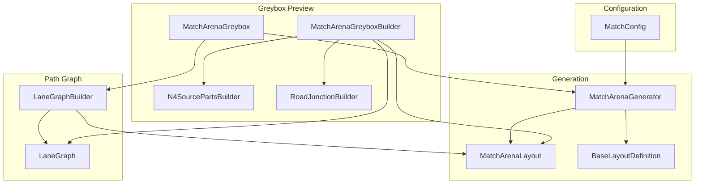
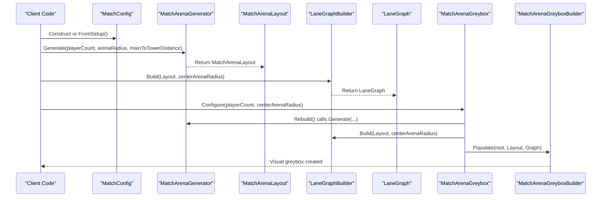
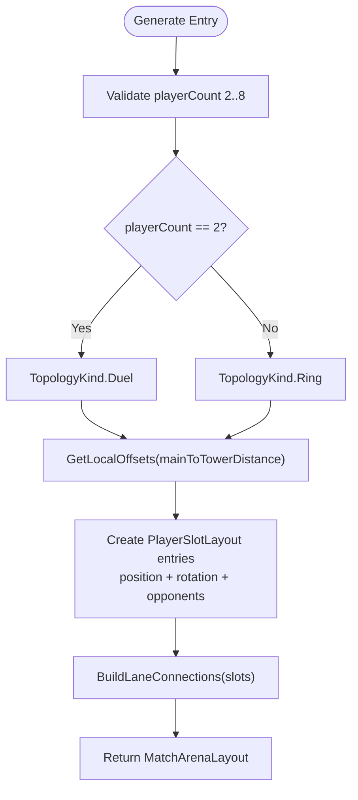
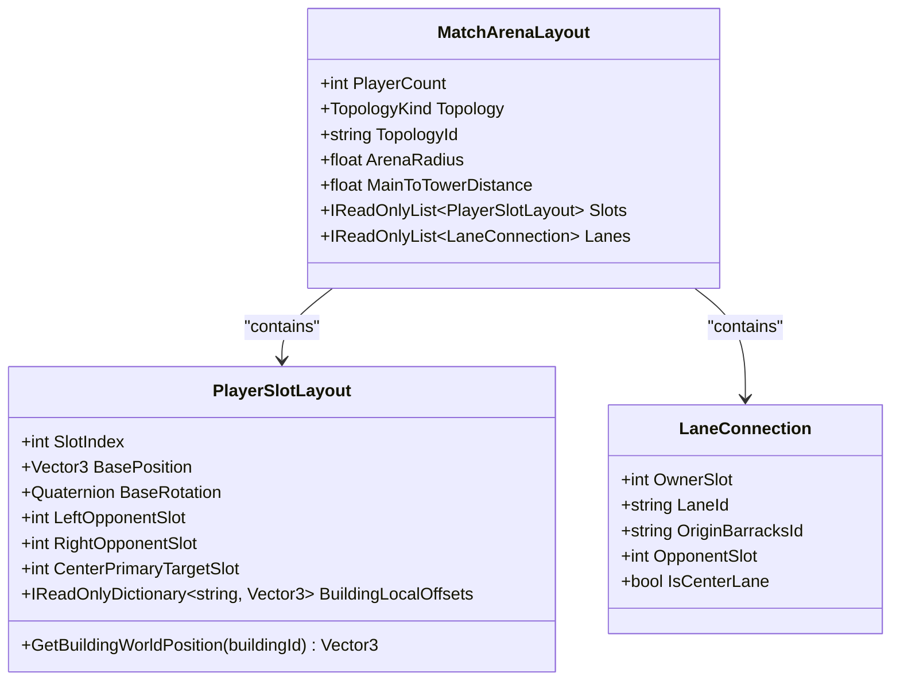
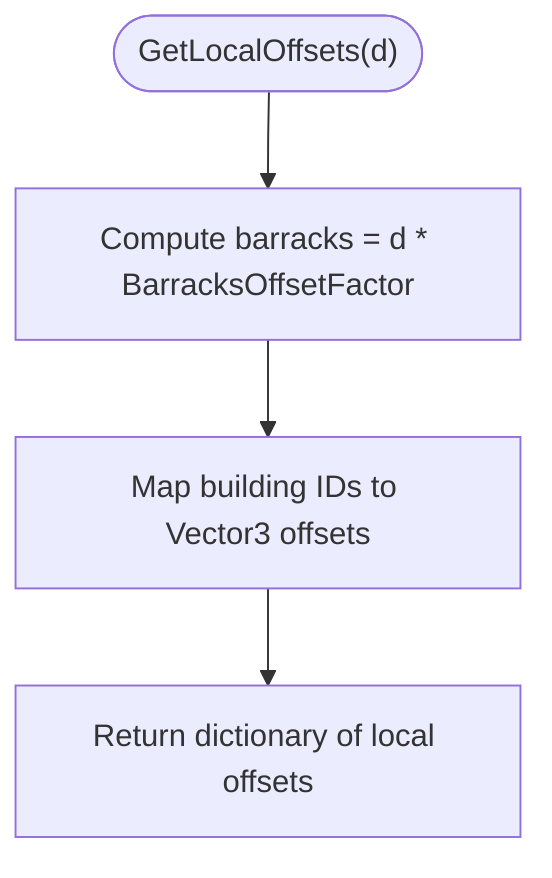
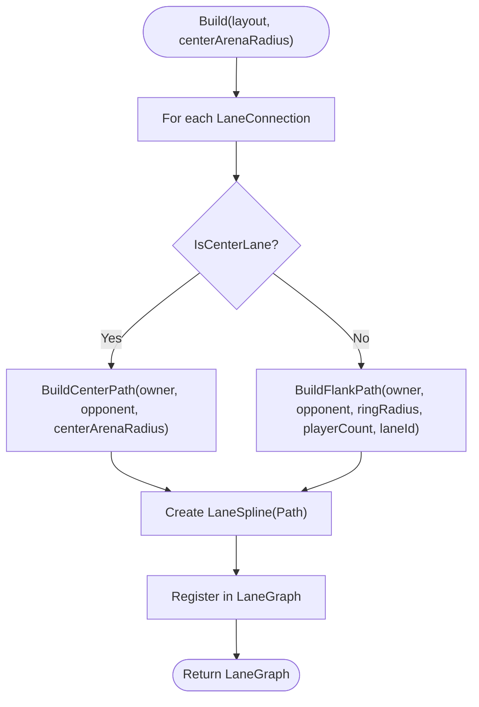
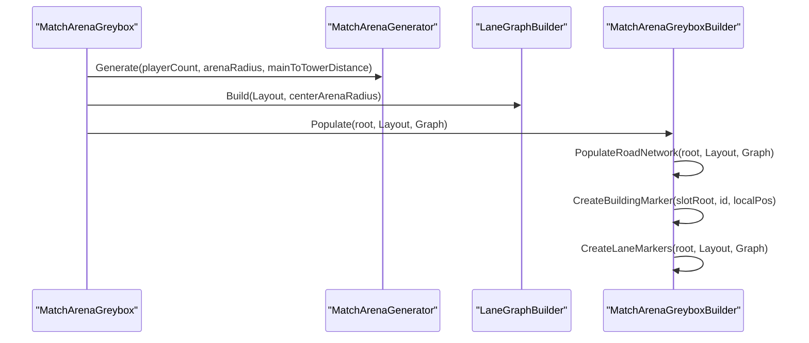
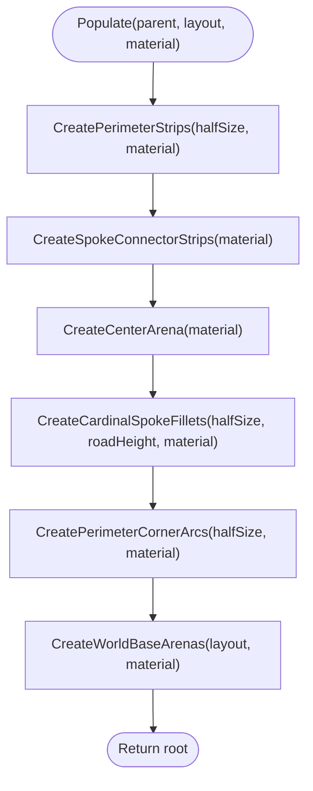
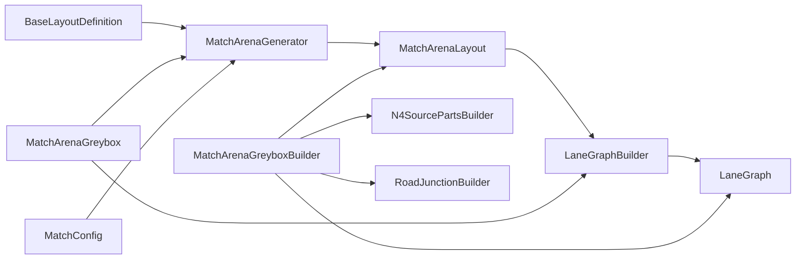

# Arena Generation

<cite>
**Referenced Files in This Document**
- [MatchArenaGenerator.cs](file://Assets/Game/Scripts/Runtime/Gameplay/Match/MatchArenaGenerator.cs)
- [MatchArenaLayout.cs](file://Assets/Game/Scripts/Runtime/Gameplay/Match/MatchArenaLayout.cs)
- [BaseLayoutDefinition.cs](file://Assets/Game/Scripts/Runtime/Gameplay/Match/BaseLayoutDefinition.cs)
- [MatchConfig.cs](file://Assets/Game/Scripts/Runtime/Gameplay/Match/MatchConfig.cs)
- [LaneGraph.cs](file://Assets/Game/Scripts/Runtime/Gameplay/Match/LaneGraph.cs)
- [LaneGraphBuilder.cs](file://Assets/Game/Scripts/Runtime/Gameplay/Match/LaneGraphBuilder.cs)
- [MatchArenaGreybox.cs](file://Assets/Game/Scripts/Runtime/Gameplay/Match/MatchArenaGreybox.cs)
- [MatchArenaGreyboxBuilder.cs](file://Assets/Game/Scripts/Runtime/Gameplay/Match/MatchArenaGreyboxBuilder.cs)
- [N4SourcePartsBuilder.cs](file://Assets/Game/Scripts/Runtime/Gameplay/Match/N4SourcePartsBuilder.cs)
- [RoadJunctionBuilder.cs](file://Assets/Game/Scripts/Runtime/Gameplay/Match/RoadJunctionBuilder.cs)
</cite>

## Table of Contents
1. [Introduction](#introduction)
2. [Project Structure](#project-structure)
3. [Core Components](#core-components)
4. [Architecture Overview](#architecture-overview)
5. [Detailed Component Analysis](#detailed-component-analysis)
6. [Dependency Analysis](#dependency-analysis)
7. [Performance Considerations](#performance-considerations)
8. [Troubleshooting Guide](#troubleshooting-guide)
9. [Conclusion](#conclusion)
10. [Appendices](#appendices)

## Introduction
This document explains BARAKI’s procedural arena generation system used to create randomized battlefields for matches. It covers:
- MatchArenaGenerator for generating randomized layouts
- MatchArenaLayout for defining arena structures and player slots
- BaseLayoutDefinition for arena templates and building offsets
- LaneGraph and LaneGraphBuilder for path construction and validation
- MatchArenaGreybox and MatchArenaGreyboxBuilder for placeholder visual representation
- MatchConfig for generation parameters and integration with setup data

The documentation includes implementation details, diagrams, examples for custom arenas, parameter tuning, performance considerations, and debugging guidance.

## Project Structure
The arena generation system is implemented under the Gameplay/Match runtime scripts. Key responsibilities are split across focused components:
- Layout generation and topology: MatchArenaGenerator, MatchArenaLayout, BaseLayoutDefinition
- Path graph construction: LaneGraph, LaneGraphBuilder
- Visual greybox preview: MatchArenaGreybox, MatchArenaGreyboxBuilder, N4SourcePartsBuilder, RoadJunctionBuilder
- Configuration: MatchConfig

**Diagram sources**
- [MatchArenaGenerator.cs:19-67](file://Assets/Game/Scripts/Runtime/Gameplay/Match/MatchArenaGenerator.cs#L19-L67)
- [MatchArenaLayout.cs:13-52](file://Assets/Game/Scripts/Runtime/Gameplay/Match/MatchArenaLayout.cs#L13-L52)
- [BaseLayoutDefinition.cs:11-66](file://Assets/Game/Scripts/Runtime/Gameplay/Match/BaseLayoutDefinition.cs#L11-L66)
- [LaneGraph.cs:5-33](file://Assets/Game/Scripts/Runtime/Gameplay/Match/LaneGraph.cs#L5-L33)
- [LaneGraphBuilder.cs:12-45](file://Assets/Game/Scripts/Runtime/Gameplay/Match/LaneGraphBuilder.cs#L12-L45)
- [MatchArenaGreybox.cs:35-43](file://Assets/Game/Scripts/Runtime/Gameplay/Match/MatchArenaGreybox.cs#L35-L43)
- [MatchArenaGreyboxBuilder.cs:37-77](file://Assets/Game/Scripts/Runtime/Gameplay/Match/MatchArenaGreyboxBuilder.cs#L37-L77)
- [N4SourcePartsBuilder.cs:11-33](file://Assets/Game/Scripts/Runtime/Gameplay/Match/N4SourcePartsBuilder.cs#L11-L33)
- [RoadJunctionBuilder.cs:25-71](file://Assets/Game/Scripts/Runtime/Gameplay/Match/RoadJunctionBuilder.cs#L25-L71)
- [MatchConfig.cs:9-27](file://Assets/Game/Scripts/Runtime/Gameplay/Match/MatchConfig.cs#L9-L27)

**Section sources**
- [MatchArenaGenerator.cs:19-67](file://Assets/Game/Scripts/Runtime/Gameplay/Match/MatchArenaGenerator.cs#L19-L67)
- [MatchArenaLayout.cs:13-52](file://Assets/Game/Scripts/Runtime/Gameplay/Match/MatchArenaLayout.cs#L13-L52)
- [BaseLayoutDefinition.cs:11-66](file://Assets/Game/Scripts/Runtime/Gameplay/Match/BaseLayoutDefinition.cs#L11-L66)
- [LaneGraph.cs:5-33](file://Assets/Game/Scripts/Runtime/Gameplay/Match/LaneGraph.cs#L5-L33)
- [LaneGraphBuilder.cs:12-45](file://Assets/Game/Scripts/Runtime/Gameplay/Match/LaneGraphBuilder.cs#L12-L45)
- [MatchArenaGreybox.cs:35-43](file://Assets/Game/Scripts/Runtime/Gameplay/Match/MatchArenaGreybox.cs#L35-L43)
- [MatchArenaGreyboxBuilder.cs:37-77](file://Assets/Game/Scripts/Runtime/Gameplay/Match/MatchArenaGreyboxBuilder.cs#L37-L77)
- [N4SourcePartsBuilder.cs:11-33](file://Assets/Game/Scripts/Runtime/Gameplay/Match/N4SourcePartsBuilder.cs#L11-L33)
- [RoadJunctionBuilder.cs:25-71](file://Assets/Game/Scripts/Runtime/Gameplay/Match/RoadJunctionBuilder.cs#L25-L71)
- [MatchConfig.cs:9-27](file://Assets/Game/Scripts/Runtime/Gameplay/Match/MatchConfig.cs#L9-L27)

## Core Components
- MatchArenaGenerator: Generates a MatchArenaLayout given player count and radius/distance parameters. Computes player slot positions around a ring or duel line, assigns opponent relationships, and builds lane connections per base template.
- MatchArenaLayout: Holds generated layout data including player slots, lanes, topology kind, and radii. PlayerSlotLayout provides helper methods to compute world positions for buildings using local offsets and base rotation.
- BaseLayoutDefinition: Defines per-player building offsets (main, towers, barracks), constants for lanes per player, and helpers to map barracks to lanes and flank destinations.
- LaneGraph and LaneGraphBuilder: Build a graph of splines representing center and flank lanes. Center paths intersect a central arena circle; flank paths follow the perimeter ring with clockwise/counterclockwise logic.
- MatchArenaGreybox and MatchArenaGreyboxBuilder: Provide a quick visual greybox of roads, bases, and lane markers. They instantiate road strips, corner arcs, base platforms, and lane lines based on the generated layout and graph.
- N4SourcePartsBuilder and RoadJunctionBuilder: Specialized builders for N=4 road networks and junction fillets, ensuring smooth turns and consistent geometry.
- MatchConfig: Encapsulates match configuration such as player count, race IDs, and arena dimensions. Provides factory methods to construct defaults from setup data.

**Section sources**
- [MatchArenaGenerator.cs:19-67](file://Assets/Game/Scripts/Runtime/Gameplay/Match/MatchArenaGenerator.cs#L19-L67)
- [MatchArenaLayout.cs:13-52](file://Assets/Game/Scripts/Runtime/Gameplay/Match/MatchArenaLayout.cs#L13-L52)
- [BaseLayoutDefinition.cs:11-66](file://Assets/Game/Scripts/Runtime/Gameplay/Match/BaseLayoutDefinition.cs#L11-L66)
- [LaneGraph.cs:5-33](file://Assets/Game/Scripts/Runtime/Gameplay/Match/LaneGraph.cs#L5-L33)
- [LaneGraphBuilder.cs:12-45](file://Assets/Game/Scripts/Runtime/Gameplay/Match/LaneGraphBuilder.cs#L12-L45)
- [MatchArenaGreybox.cs:35-43](file://Assets/Game/Scripts/Runtime/Gameplay/Match/MatchArenaGreybox.cs#L35-L43)
- [MatchArenaGreyboxBuilder.cs:37-77](file://Assets/Game/Scripts/Runtime/Gameplay/Match/MatchArenaGreyboxBuilder.cs#L37-L77)
- [N4SourcePartsBuilder.cs:11-33](file://Assets/Game/Scripts/Runtime/Gameplay/Match/N4SourcePartsBuilder.cs#L11-L33)
- [RoadJunctionBuilder.cs:25-71](file://Assets/Game/Scripts/Runtime/Gameplay/Match/RoadJunctionBuilder.cs#L25-L71)
- [MatchConfig.cs:9-27](file://Assets/Game/Scripts/Runtime/Gameplay/Match/MatchConfig.cs#L9-L27)

## Architecture Overview
The generation pipeline proceeds through configuration, layout creation, path graph construction, and greybox visualization.

**Diagram sources**
- [MatchConfig.cs:29-44](file://Assets/Game/Scripts/Runtime/Gameplay/Match/MatchConfig.cs#L29-L44)
- [MatchArenaGenerator.cs:19-67](file://Assets/Game/Scripts/Runtime/Gameplay/Match/MatchArenaGenerator.cs#L19-L67)
- [LaneGraphBuilder.cs:12-45](file://Assets/Game/Scripts/Runtime/Gameplay/Match/LaneGraphBuilder.cs#L12-L45)
- [MatchArenaGreybox.cs:35-43](file://Assets/Game/Scripts/Runtime/Gameplay/Match/MatchArenaGreybox.cs#L35-L43)
- [MatchArenaGreyboxBuilder.cs:58-77](file://Assets/Game/Scripts/Runtime/Gameplay/Match/MatchArenaGreyboxBuilder.cs#L58-L77)

## Detailed Component Analysis

### MatchArenaGenerator
Responsibilities:
- Validate player count (2..8).
- Determine topology (Duel vs Ring).
- Compute player slot positions around a ring using trigonometry.
- Assign opponent indices (left/right neighbors and primary target).
- Build lane connections per player using base template definitions.

Key behaviors:
- Default arena radius and main-to-tower distance are provided as constants.
- Ground plane scale is derived from arena radius plus margin.
- Modulo arithmetic ensures correct cyclic neighbor assignment.

**Diagram sources**
- [MatchArenaGenerator.cs:19-67](file://Assets/Game/Scripts/Runtime/Gameplay/Match/MatchArenaGenerator.cs#L19-L67)
- [BaseLayoutDefinition.cs:19-34](file://Assets/Game/Scripts/Runtime/Gameplay/Match/BaseLayoutDefinition.cs#L19-L34)

**Section sources**
- [MatchArenaGenerator.cs:19-67](file://Assets/Game/Scripts/Runtime/Gameplay/Match/MatchArenaGenerator.cs#L19-L67)

### MatchArenaLayout
Responsibilities:
- Store topology metadata and arena dimensions.
- Represent player slots with base transforms and building offsets.
- Provide helper to compute building world positions from local offsets.

Data model highlights:
- PlayerSlotLayout includes left/right opponent indices and center primary target index.
- BuildingLocalOffsets maps building IDs to local positions relative to the slot base.

**Diagram sources**
- [MatchArenaLayout.cs:13-52](file://Assets/Game/Scripts/Runtime/Gameplay/Match/MatchArenaLayout.cs#L13-L52)

**Section sources**
- [MatchArenaLayout.cs:13-52](file://Assets/Game/Scripts/Runtime/Gameplay/Match/MatchArenaLayout.cs#L13-L52)

### BaseLayoutDefinition
Responsibilities:
- Define per-player building offsets in base local space.
- Provide mapping utilities between barracks and lanes.
- Specify constants for buildings per base and lanes per player.

Key algorithms:
- GetLocalOffsets computes positions for main, four towers, and three barracks based on main-to-tower distance and a factor.
- GetLaneForBarracks maps barracks IDs to lane IDs.
- Flank origin/destination helpers determine which barracks are used for left/right flank paths.

**Diagram sources**
- [BaseLayoutDefinition.cs:19-34](file://Assets/Game/Scripts/Runtime/Gameplay/Match/BaseLayoutDefinition.cs#L19-L34)

**Section sources**
- [BaseLayoutDefinition.cs:11-66](file://Assets/Game/Scripts/Runtime/Gameplay/Match/BaseLayoutDefinition.cs#L11-L66)

### LaneGraph and LaneGraphBuilder
Responsibilities:
- Build a graph of LaneSpline objects representing center and flank lanes.
- Compute center paths that pass through the central arena circle.
- Compute flank paths along the perimeter ring with directional logic.

Implementation details:
- TryGetSegmentCircleIntersections calculates entry/exit points of a segment crossing a circle at the origin.
- BuildFlankPath uses perimeter path builders to generate arc segments between flank barracks.
- Angle interpolation supports clockwise/counterclockwise traversal.

**Diagram sources**
- [LaneGraphBuilder.cs:12-45](file://Assets/Game/Scripts/Runtime/Gameplay/Match/LaneGraphBuilder.cs#L12-L45)
- [LaneGraphBuilder.cs:48-66](file://Assets/Game/Scripts/Runtime/Gameplay/Match/LaneGraphBuilder.cs#L48-L66)
- [LaneGraphBuilder.cs:114-138](file://Assets/Game/Scripts/Runtime/Gameplay/Match/LaneGraphBuilder.cs#L114-L138)

**Section sources**
- [LaneGraph.cs:5-33](file://Assets/Game/Scripts/Runtime/Gameplay/Match/LaneGraph.cs#L5-L33)
- [LaneGraphBuilder.cs:12-45](file://Assets/Game/Scripts/Runtime/Gameplay/Match/LaneGraphBuilder.cs#L12-L45)
- [LaneGraphBuilder.cs:48-66](file://Assets/Game/Scripts/Runtime/Gameplay/Match/LaneGraphBuilder.cs#L48-L66)
- [LaneGraphBuilder.cs:114-138](file://Assets/Game/Scripts/Runtime/Gameplay/Match/LaneGraphBuilder.cs#L114-L138)

### MatchArenaGreybox and MatchArenaGreyboxBuilder
Responsibilities:
- Provide a quick visual greybox of roads, bases, and lane markers.
- Populate road networks, base platforms, building markers, and lane lines.
- Handle N=4 special-case road mesh via N4SourcePartsBuilder.

Key behaviors:
- Rebuild clears previous visuals, generates layout and graph, then populates root transform.
- CreateRoadStrip and CreatePerimeterCornerArc build road geometry.
- Lane markers use LineRenderer with colors per lane type.

**Diagram sources**
- [MatchArenaGreybox.cs:35-43](file://Assets/Game/Scripts/Runtime/Gameplay/Match/MatchArenaGreybox.cs#L35-L43)
- [MatchArenaGreyboxBuilder.cs:58-77](file://Assets/Game/Scripts/Runtime/Gameplay/Match/MatchArenaGreyboxBuilder.cs#L58-L77)
- [MatchArenaGreyboxBuilder.cs:136-170](file://Assets/Game/Scripts/Runtime/Gameplay/Match/MatchArenaGreyboxBuilder.cs#L136-L170)

**Section sources**
- [MatchArenaGreybox.cs:35-43](file://Assets/Game/Scripts/Runtime/Gameplay/Match/MatchArenaGreybox.cs#L35-L43)
- [MatchArenaGreyboxBuilder.cs:37-77](file://Assets/Game/Scripts/Runtime/Gameplay/Match/MatchArenaGreyboxBuilder.cs#L37-L77)
- [MatchArenaGreyboxBuilder.cs:136-170](file://Assets/Game/Scripts/Runtime/Gameplay/Match/MatchArenaGreyboxBuilder.cs#L136-L170)

### N4SourcePartsBuilder and RoadJunctionBuilder
Responsibilities:
- N4SourcePartsBuilder constructs the N=4 road network source parts, including perimeter strips, spoke connectors, center arena platform, corner arcs, and world base arenas.
- RoadJunctionBuilder creates fillets and junctions for smooth turns at cardinal spokes and base crossroads.

Key behaviors:
- Fillet radii are tuned for sharper turns near main and wider turns at perimeter corners.
- Spoke connectors bridge center arena to perimeter roads.

**Diagram sources**
- [N4SourcePartsBuilder.cs:11-33](file://Assets/Game/Scripts/Runtime/Gameplay/Match/N4SourcePartsBuilder.cs#L11-L33)
- [RoadJunctionBuilder.cs:109-135](file://Assets/Game/Scripts/Runtime/Gameplay/Match/RoadJunctionBuilder.cs#L109-L135)

**Section sources**
- [N4SourcePartsBuilder.cs:11-33](file://Assets/Game/Scripts/Runtime/Gameplay/Match/N4SourcePartsBuilder.cs#L11-L33)
- [RoadJunctionBuilder.cs:25-71](file://Assets/Game/Scripts/Runtime/Gameplay/Match/RoadJunctionBuilder.cs#L25-L71)
- [RoadJunctionBuilder.cs:109-135](file://Assets/Game/Scripts/Runtime/Gameplay/Match/RoadJunctionBuilder.cs#L109-L135)

### MatchConfig
Responsibilities:
- Hold match configuration including player count, race IDs, and arena dimensions.
- Provide factory methods to construct default configurations from setup data.

Usage patterns:
- FromSetup converts external setup into internal config.
- MvpDefault returns a balanced default configuration for typical matches.

**Section sources**
- [MatchConfig.cs:9-27](file://Assets/Game/Scripts/Runtime/Gameplay/Match/MatchConfig.cs#L9-L27)
- [MatchConfig.cs:29-44](file://Assets/Game/Scripts/Runtime/Gameplay/Match/MatchConfig.cs#L29-L44)

## Dependency Analysis
Component dependencies and interactions:
- MatchArenaGenerator depends on BaseLayoutDefinition for building offsets and lane mappings.
- LaneGraphBuilder depends on MatchArenaLayout and BaseLayoutDefinition to compute paths.
- MatchArenaGreybox orchestrates generation and visualization by calling generators and builders.
- MatchArenaGreyboxBuilder composes road meshes and lane markers using specialized builders.

**Diagram sources**
- [MatchArenaGenerator.cs:19-67](file://Assets/Game/Scripts/Runtime/Gameplay/Match/MatchArenaGenerator.cs#L19-L67)
- [BaseLayoutDefinition.cs:11-66](file://Assets/Game/Scripts/Runtime/Gameplay/Match/BaseLayoutDefinition.cs#L11-L66)
- [LaneGraphBuilder.cs:12-45](file://Assets/Game/Scripts/Runtime/Gameplay/Match/LaneGraphBuilder.cs#L12-L45)
- [MatchArenaGreybox.cs:35-43](file://Assets/Game/Scripts/Runtime/Gameplay/Match/MatchArenaGreybox.cs#L35-L43)
- [MatchArenaGreyboxBuilder.cs:58-77](file://Assets/Game/Scripts/Runtime/Gameplay/Match/MatchArenaGreyboxBuilder.cs#L58-L77)
- [N4SourcePartsBuilder.cs:11-33](file://Assets/Game/Scripts/Runtime/Gameplay/Match/N4SourcePartsBuilder.cs#L11-L33)
- [RoadJunctionBuilder.cs:25-71](file://Assets/Game/Scripts/Runtime/Gameplay/Match/RoadJunctionBuilder.cs#L25-L71)
- [MatchConfig.cs:9-27](file://Assets/Game/Scripts/Runtime/Gameplay/Match/MatchConfig.cs#L9-L27)

**Section sources**
- [MatchArenaGenerator.cs:19-67](file://Assets/Game/Scripts/Runtime/Gameplay/Match/MatchArenaGenerator.cs#L19-L67)
- [LaneGraphBuilder.cs:12-45](file://Assets/Game/Scripts/Runtime/Gameplay/Match/LaneGraphBuilder.cs#L12-L45)
- [MatchArenaGreybox.cs:35-43](file://Assets/Game/Scripts/Runtime/Gameplay/Match/MatchArenaGreybox.cs#L35-L43)
- [MatchArenaGreyboxBuilder.cs:58-77](file://Assets/Game/Scripts/Runtime/Gameplay/Match/MatchArenaGreyboxBuilder.cs#L58-L77)
- [N4SourcePartsBuilder.cs:11-33](file://Assets/Game/Scripts/Runtime/Gameplay/Match/N4SourcePartsBuilder.cs#L11-L33)
- [RoadJunctionBuilder.cs:25-71](file://Assets/Game/Scripts/Runtime/Gameplay/Match/RoadJunctionBuilder.cs#L25-L71)
- [MatchConfig.cs:9-27](file://Assets/Game/Scripts/Runtime/Gameplay/Match/MatchConfig.cs#L9-L27)

## Performance Considerations
- Geometry reuse: Prefer shared materials and avoid per-frame allocations when possible. The greybox builder reuses materials and primitives; ensure these are pooled if reused frequently.
- Mesh complexity: Corner arcs and road strips are constructed procedurally; keep segment counts reasonable for large arenas.
- Memory optimization: Destroy colliders on greybox primitives to reduce physics overhead during preview.
- Large arenas: Increase arena radius carefully; road strip lengths grow linearly, and lane marker point counts increase with player count. Consider LOD or simplified previews for very large maps.
- Editor vs runtime: Use immediate destruction in editor mode to prevent lingering objects during iterative design.

[No sources needed since this section provides general guidance]

## Troubleshooting Guide
Common issues and diagnostics:
- Invalid player count: Ensure playerCount is within 2..8; otherwise generation throws an argument error.
- Missing building offsets: If a building ID is not present in BuildingLocalOffsets, world position falls back to base position. Verify BaseLayoutDefinition mappings.
- Center lane intersection failures: If center arena radius is too small or zero, center paths may bypass the circle; adjust centerArenaRadius accordingly.
- Flank path directionality: Left lanes go clockwise, right lanes go counterclockwise; verify lane IDs and origin/destination barracks mappings.
- Greybox visibility: Confirm that materials are found (URP Lit/Unlit fallbacks); check shader availability and renderer assignments.

Operational tips:
- Use MatchArenaGreybox.Rebuild to regenerate visuals after changing parameters.
- Inspect LaneGraph.TryGetLane to validate lane existence by owner slot and lane ID.
- Validate building world positions using PlayerSlotLayout.GetBuildingWorldPosition before spawning units or structures.

**Section sources**
- [MatchArenaGenerator.cs:24-27](file://Assets/Game/Scripts/Runtime/Gameplay/Match/MatchArenaGenerator.cs#L24-L27)
- [MatchArenaLayout.cs:23-31](file://Assets/Game/Scripts/Runtime/Gameplay/Match/MatchArenaLayout.cs#L23-L31)
- [LaneGraphBuilder.cs:48-66](file://Assets/Game/Scripts/Runtime/Gameplay/Match/LaneGraphBuilder.cs#L48-L66)
- [LaneGraphBuilder.cs:114-138](file://Assets/Game/Scripts/Runtime/Gameplay/Match/LaneGraphBuilder.cs#L114-L138)
- [MatchArenaGreybox.cs:35-43](file://Assets/Game/Scripts/Runtime/Gameplay/Match/MatchArenaGreybox.cs#L35-L43)

## Conclusion
BARAKI’s procedural arena generation system combines deterministic templates with configurable parameters to produce scalable battlefields. The separation of concerns—layout generation, path graph construction, and greybox visualization—enables flexible customization and efficient iteration. By tuning arena radius, main-to-tower distance, and center arena radius, designers can shape playstyles ranging from tight duels to expansive ring battles. The greybox tools provide rapid feedback for level design workflows, while careful attention to memory and geometry complexity ensures good performance even for larger arenas.

[No sources needed since this section summarizes without analyzing specific files]

## Appendices

### Custom Arena Creation Examples
- Create a custom 6-player ring arena:
  - Set playerCount to 6.
  - Choose arenaRadius appropriate for desired spacing.
  - Adjust mainToTowerDistance to control base density.
  - Generate layout and graph, then rebuild greybox to inspect.
- Create a compact duel arena:
  - Set playerCount to 2.
  - Reduce arenaRadius and mainToTowerDistance for tighter engagements.
  - Validate center lane intersections and flank paths.

Parameter tuning guidelines:
- Larger arenaRadius increases travel distances and encourages flanking strategies.
- Smaller mainToTowerDistance brings barracks closer to the main, increasing early pressure.
- CenterArenaRadius influences how prominently the center is contested; smaller values encourage direct confrontations.

Integration with level design workflow:
- Use MatchConfig.FromSetup to convert external setup data into internal configuration.
- Call MatchArenaGenerator.Generate to obtain layout, then LaneGraphBuilder.Build for paths.
- Instantiate MatchArenaGreybox and call Rebuild to visualize changes quickly.
- Iterate by adjusting parameters and rebuilding until gameplay goals are met.

**Section sources**
- [MatchConfig.cs:29-44](file://Assets/Game/Scripts/Runtime/Gameplay/Match/MatchConfig.cs#L29-L44)
- [MatchArenaGenerator.cs:19-67](file://Assets/Game/Scripts/Runtime/Gameplay/Match/MatchArenaGenerator.cs#L19-L67)
- [LaneGraphBuilder.cs:12-45](file://Assets/Game/Scripts/Runtime/Gameplay/Match/LaneGraphBuilder.cs#L12-L45)
- [MatchArenaGreybox.cs:35-43](file://Assets/Game/Scripts/Runtime/Gameplay/Match/MatchArenaGreybox.cs#L35-L43)