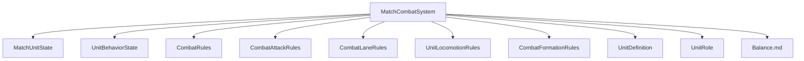
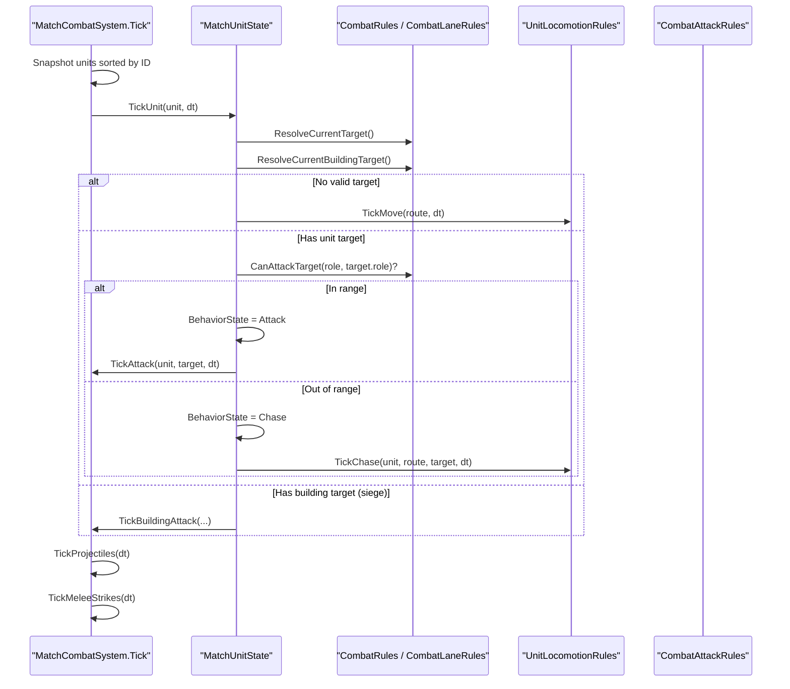
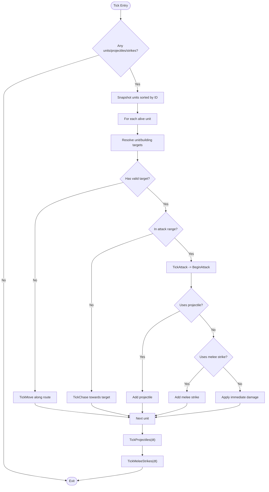
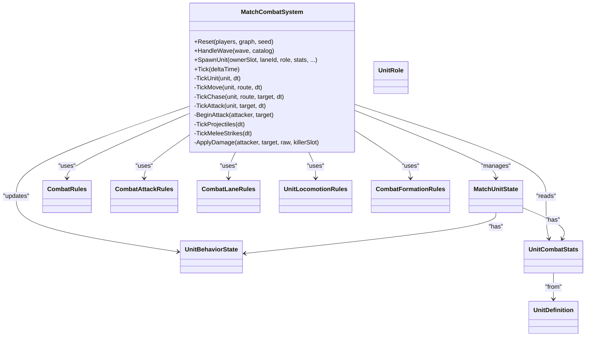

# Combat System

<cite>
**Referenced Files in This Document**
- [MatchCombatSystem.cs](file://Assets/Game/Scripts/Runtime/Gameplay/Combat/MatchCombatSystem.cs)
- [UnitBehaviorState.cs](file://Assets/Game/Scripts/Runtime/Gameplay/Combat/UnitBehaviorState.cs)
- [UnitCombatStats.cs](file://Assets/Game/Scripts/Runtime/Gameplay/Combat/UnitCombatStats.cs)
- [CombatRules.cs](file://Assets/Game/Scripts/Runtime/Gameplay/Combat/CombatRules.cs)
- [CombatAttackRules.cs](file://Assets/Game/Scripts/Runtime/Gameplay/Combat/CombatAttackRules.cs)
- [CombatLaneRules.cs](file://Assets/Game/Scripts/Runtime/Gameplay/Combat/CombatLaneRules.cs)
- [UnitLocomotionRules.cs](file://Assets/Game/Scripts/Runtime/Gameplay/Combat/UnitLocomotionRules.cs)
- [CombatFormationRules.cs](file://Assets/Game/Scripts/Runtime/Gameplay/Combat/CombatFormationRules.cs)
- [MatchUnitState.cs](file://Assets/Game/Scripts/Runtime/Gameplay/Combat/MatchUnitState.cs)
- [UnitDefinition.cs](file://Assets/Game/Scripts/Runtime/Gameplay/Data/UnitDefinition.cs)
- [UnitRole.cs](file://Assets/Game/Scripts/Runtime/Gameplay/Data/UnitRole.cs)
- [Balance.md](file://Assets/Game/GameDesign/Balance.md)
</cite>

## Table of Contents
1. Introduction
2. Project Structure
3. Core Components
4. Architecture Overview
5. Detailed Component Analysis
6. Dependency Analysis
7. Performance Considerations
8. Troubleshooting Guide
9. Conclusion

## Introduction
This document explains BARAKI’s automated combat system with a focus on how units engage along lanes, including target selection, attack timing, and damage calculation. It documents the central coordinator (MatchCombatSystem), unit AI state (UnitBehaviorState), statistical calculations (UnitCombatStats), engagement rules (CombatRules, CombatLaneRules), and damage formulas (CombatAttackRules). It also provides concrete examples for typical scenarios such as melee vs ranged, flying targets, and siege attacks, plus guidance on balance tuning, performance optimization for large battles, and debugging tools.

## Project Structure
The combat system is implemented under the Gameplay/Combat runtime scripts and integrates with data definitions and design docs:
- Match orchestration and simulation loop: MatchCombatSystem
- Unit state and behavior: MatchUnitState, UnitBehaviorState
- Stats and roles: UnitCombatStats, UnitDefinition, UnitRole
- Rules and math: CombatRules, CombatAttackRules, CombatLaneRules, UnitLocomotionRules, CombatFormationRules
- Balance configuration: Balance.md

**Diagram sources**
- [MatchCombatSystem.cs](file://Assets/Game/Scripts/Runtime/Gameplay/Combat/MatchCombatSystem.cs)
- [MatchUnitState.cs](file://Assets/Game/Scripts/Runtime/Gameplay/Combat/MatchUnitState.cs)
- [UnitBehaviorState.cs](file://Assets/Game/Scripts/Runtime/Gameplay/Combat/UnitBehaviorState.cs)
- [CombatRules.cs](file://Assets/Game/Scripts/Runtime/Gameplay/Combat/CombatRules.cs)
- [CombatAttackRules.cs](file://Assets/Game/Scripts/Runtime/Gameplay/Combat/CombatAttackRules.cs)
- [CombatLaneRules.cs](file://Assets/Game/Scripts/Runtime/Gameplay/Combat/CombatLaneRules.cs)
- [UnitLocomotionRules.cs](file://Assets/Game/Scripts/Runtime/Gameplay/Combat/UnitLocomotionRules.cs)
- [CombatFormationRules.cs](file://Assets/Game/Scripts/Runtime/Gameplay/Combat/CombatFormationRules.cs)
- [UnitDefinition.cs](file://Assets/Game/Scripts/Runtime/Gameplay/Data/UnitDefinition.cs)
- [UnitRole.cs](file://Assets/Game/Scripts/Runtime/Gameplay/Data/UnitRole.cs)
- [Balance.md](file://Assets/Game/GameDesign/Balance.md)

**Section sources**
- [MatchCombatSystem.cs](file://Assets/Game/Scripts/Runtime/Gameplay/Combat/MatchCombatSystem.cs)
- [UnitBehaviorState.cs](file://Assets/Game/Scripts/Runtime/Gameplay/Combat/UnitBehaviorState.cs)
- [UnitCombatStats.cs](file://Assets/Game/Scripts/Runtime/Gameplay/Combat/UnitCombatStats.cs)
- [CombatRules.cs](file://Assets/Game/Scripts/Runtime/Gameplay/Combat/CombatRules.cs)
- [CombatAttackRules.cs](file://Assets/Game/Scripts/Runtime/Gameplay/Combat/CombatAttackRules.cs)
- [CombatLaneRules.cs](file://Assets/Game/Scripts/Runtime/Gameplay/Combat/CombatLaneRules.cs)
- [UnitLocomotionRules.cs](file://Assets/Game/Scripts/Runtime/Gameplay/Combat/UnitLocomotionRules.cs)
- [CombatFormationRules.cs](file://Assets/Game/Scripts/Runtime/Gameplay/Combat/CombatFormationRules.cs)
- [MatchUnitState.cs](file://Assets/Game/Scripts/Runtime/Gameplay/Combat/MatchUnitState.cs)
- [UnitDefinition.cs](file://Assets/Game/Scripts/Runtime/Gameplay/Data/UnitDefinition.cs)
- [UnitRole.cs](file://Assets/Game/Scripts/Runtime/Gameplay/Data/UnitRole.cs)
- [Balance.md](file://Assets/Game/GameDesign/Balance.md)

## Core Components
- MatchCombatSystem: Central coordinator that owns all active units, projectiles, and melee strikes; spawns units from waves; ticks movement, targeting, and attacks; applies damage and gold bounties; exposes events for kills.
- MatchUnitState: Per-unit runtime state including position, HP, mana, facing, current target, cooldowns, and behavior state.
- UnitBehaviorState: Simple enum representing Move, Chase, Attack states used by units during simulation.
- UnitCombatStats: Immutable stats derived from UnitDefinition (HP, armor, damage range, attack speed, range, move speed, bounty, mana).
- CombatRules: Engagement conditions (e.g., CanAttackTarget for flying), damage roll, armor reduction, aggro radius, attack interval.
- CombatAttackRules: Delivery mechanics (melee strike duration, projectile speed, parabolic arcs).
- CombatLaneRules: Lane-based engagement constraints (same lane or mirror flank via graph).
- UnitLocomotionRules: Movement, ally avoidance, route following, and drift clamping.
- CombatFormationRules: Spawn formation offsets, row staggering, lateral spread, and separation constants.
- UnitDefinition and UnitRole: Data-driven unit attributes and role classification.

Key responsibilities:
- Target selection: Scan within aggro radius, prefer engaged allies, respect lane rules and role restrictions.
- Attack timing: Cooldown based on attack speed; different delivery types (melee strike, direct hit, projectile).
- Damage calculation: Randomized raw damage, armor mitigation, minimum damage floor, kill bounty and gold grant.

**Section sources**
- [MatchCombatSystem.cs](file://Assets/Game/Scripts/Runtime/Gameplay/Combat/MatchCombatSystem.cs)
- [MatchUnitState.cs](file://Assets/Game/Scripts/Runtime/Gameplay/Combat/MatchUnitState.cs)
- [UnitBehaviorState.cs](file://Assets/Game/Scripts/Runtime/Gameplay/Combat/UnitBehaviorState.cs)
- [UnitCombatStats.cs](file://Assets/Game/Scripts/Runtime/Gameplay/Combat/UnitCombatStats.cs)
- [CombatRules.cs](file://Assets/Game/Scripts/Runtime/Gameplay/Combat/CombatRules.cs)
- [CombatAttackRules.cs](file://Assets/Game/Scripts/Runtime/Gameplay/Combat/CombatAttackRules.cs)
- [CombatLaneRules.cs](file://Assets/Game/Scripts/Runtime/Gameplay/Combat/CombatLaneRules.cs)
- [UnitLocomotionRules.cs](file://Assets/Game/Scripts/Runtime/Gameplay/Combat/UnitLocomotionRules.cs)
- [CombatFormationRules.cs](file://Assets/Game/Scripts/Runtime/Gameplay/Combat/CombatFormationRules.cs)
- [UnitDefinition.cs](file://Assets/Game/Scripts/Runtime/Gameplay/Data/UnitDefinition.cs)
- [UnitRole.cs](file://Assets/Game/Scripts/Runtime/Gameplay/Data/UnitRole.cs)

## Architecture Overview
At each tick, the system iterates over alive units in deterministic order, resolves targets, updates locomotion, and schedules attacks. Projectiles and melee strikes are processed separately to decouple visual timing from logical damage application.

**Diagram sources**
- [MatchCombatSystem.cs](file://Assets/Game/Scripts/Runtime/Gameplay/Combat/MatchCombatSystem.cs)
- [CombatRules.cs](file://Assets/Game/Scripts/Runtime/Gameplay/Combat/CombatRules.cs)
- [CombatLaneRules.cs](file://Assets/Game/Scripts/Runtime/Gameplay/Combat/CombatLaneRules.cs)
- [UnitLocomotionRules.cs](file://Assets/Game/Scripts/Runtime/Gameplay/Combat/UnitLocomotionRules.cs)
- [CombatAttackRules.cs](file://Assets/Game/Scripts/Runtime/Gameplay/Combat/CombatAttackRules.cs)

## Detailed Component Analysis

### MatchCombatSystem: Central Coordinator
Responsibilities:
- Spawns units from barracks waves using squad composition and spawn plans.
- Maintains lists of units, projectiles, and melee strikes.
- Ticks movement, targeting, and attacks per frame.
- Applies damage, handles deaths, grants gold, and raises kill events.
- Integrates with buildings for siege targeting.

Key flows:
- Wave spawning: Builds spawn plan, computes positions along lane routes, creates units with initial stats and progress.
- Target scanning: Periodic scan within aggro radius; prefers enemies already engaged by allies; respects lane and role constraints.
- Movement: Marching follows route with lookahead and ally avoidance; combat chase moves toward target with lane drift clamping.
- Attacks: Melee strikes apply after short delay; ranged/caster/siege/flying/super use projectiles; direct hits for non-projectile roles.
- Damage: Raw damage rolled, armor subtracted with minimum floor; death triggers bounty and event.

**Diagram sources**
- [MatchCombatSystem.cs](file://Assets/Game/Scripts/Runtime/Gameplay/Combat/MatchCombatSystem.cs)

**Section sources**
- [MatchCombatSystem.cs](file://Assets/Game/Scripts/Runtime/Gameplay/Combat/MatchCombatSystem.cs)

### UnitBehaviorState: AI Decision States
States:
- Move: Marching along lane path with lookahead and avoidance.
- Chase: Moving toward an enemy target while maintaining lane drift limits.
- Attack: Facing target and attacking when cooldown expires.

Usage:
- Updated by MatchCombatSystem based on distance, validity, and role constraints.
- Drives locomotion and attack scheduling.

**Section sources**
- [UnitBehaviorState.cs](file://Assets/Game/Scripts/Runtime/Gameplay/Combat/UnitBehaviorState.cs)
- [MatchCombatSystem.cs](file://Assets/Game/Scripts/Runtime/Gameplay/Combat/MatchCombatSystem.cs)

### UnitCombatStats: Statistical Calculations
Contents:
- Role, MaxHp, Armor, DamageMin/Max, AttackSpeed, AttackRange, MoveSpeed, GoldBounty, MaxMana.
- Factory method builds stats from UnitDefinition, resolving default mana for casters.

Complexity:
- O(1) construction and access.
- Used throughout combat for aggro radius, attack intervals, movement, and damage.

**Section sources**
- [UnitCombatStats.cs](file://Assets/Game/Scripts/Runtime/Gameplay/Combat/UnitCombatStats.cs)
- [UnitDefinition.cs](file://Assets/Game/Scripts/Runtime/Gameplay/Data/UnitDefinition.cs)

### CombatRules: Engagement Conditions and Math
Highlights:
- RollDamage: Uniform random between min/max.
- ApplyArmor: Linear subtraction with MinDamage floor.
- ComputeKillBounty: Hero multiplier.
- CanAttackTarget: Flying units can only be attacked by Ranged/Flying/Caster/Super.
- GetAttackIntervalSeconds: Derived from attack speed.
- GetAggroRadius: Scales with attack range but has a minimum.

Edge cases:
- Zero or negative attack speed yields infinite interval.
- Armor may reduce damage to at least MinDamage.

**Section sources**
- [CombatRules.cs](file://Assets/Game/Scripts/Runtime/Gameplay/Combat/CombatRules.cs)

### CombatAttackRules: Damage Formulas and Delivery
Highlights:
- MeleeStrikeDuration and MeleeLungeDistance define melee timing and reach.
- ProjectileSpeed controls flight time.
- ParabolicArcHeight and ProjectileBodyHeight shape visuals.
- UsesProjectile/UsesParabolicArc determine delivery type by role.

Integration:
- Used by MatchCombatSystem to decide whether to schedule a melee strike, add a projectile, or apply direct damage.

**Section sources**
- [CombatAttackRules.cs](file://Assets/Game/Scripts/Runtime/Gameplay/Combat/CombatAttackRules.cs)
- [MatchCombatSystem.cs](file://Assets/Game/Scripts/Runtime/Gameplay/Combat/MatchCombatSystem.cs)

### CombatLaneRules: Lane-Based Engagement
Highlights:
- Units can engage if on the same lane or on mirrored flanks (Left vs Right) validated by LaneGraph.
- Prevents cross-lane engagements unless geometry allows.

Impact:
- Ensures strategic lane control and flanking dynamics.

**Section sources**
- [CombatLaneRules.cs](file://Assets/Game/Scripts/Runtime/Gameplay/Combat/CombatLaneRules.cs)

### UnitLocomotionRules: Movement and Avoidance
Highlights:
- Route lookahead destination computation.
- Ally avoidance using lateral repulsion and blocked-ahead spreading.
- MoveTowards with final direction normalization and step clamping.
- ClampToLaneDrift keeps units near lane spine with configurable drift limits.

Performance:
- Avoidance uses squared distances and capped radii to limit checks.

**Section sources**
- [UnitLocomotionRules.cs](file://Assets/Game/Scripts/Runtime/Gameplay/Combat/UnitLocomotionRules.cs)

### CombatFormationRules: Spawn and Formation Offsets
Highlights:
- Row staggering and lateral spread for barrack spawns.
- Jitter and clamp ranges ensure natural-looking formations.
- Constants scale with unit visual scale for consistency.

**Section sources**
- [CombatFormationRules.cs](file://Assets/Game/Scripts/Runtime/Gameplay/Combat/CombatFormationRules.cs)

### MatchUnitState: Runtime Unit State
Highlights:
- Tracks HP, mana, position, facing, cooldowns, current targets, and behavior state.
- IsAlive computed from HP.
- March progress and waypoint index support route-following.

**Section sources**
- [MatchUnitState.cs](file://Assets/Game/Scripts/Runtime/Gameplay/Combat/MatchUnitState.cs)

### UnitDefinition and UnitRole: Data Model
Highlights:
- UnitDefinition holds base stats and overrides (e.g., march speed).
- UnitRole classifies units into Melee, Ranged, Caster, Siege, Flying, Super.

**Section sources**
- [UnitDefinition.cs](file://Assets/Game/Scripts/Runtime/Gameplay/Data/UnitDefinition.cs)
- [UnitRole.cs](file://Assets/Game/Scripts/Runtime/Gameplay/Data/UnitRole.cs)

## Dependency Analysis
High-level dependencies:
- MatchCombatSystem depends on all rule modules and state structures.
- UnitCombatStats depends on UnitDefinition.
- CombatRules and CombatAttackRules are pure functions used across the system.
- CombatLaneRules depends on LaneGraph for geometry validation.
- UnitLocomotionRules depends on LaneRoute for path evaluation.

**Diagram sources**
- [MatchCombatSystem.cs](file://Assets/Game/Scripts/Runtime/Gameplay/Combat/MatchCombatSystem.cs)
- [MatchUnitState.cs](file://Assets/Game/Scripts/Runtime/Gameplay/Combat/MatchUnitState.cs)
- [UnitBehaviorState.cs](file://Assets/Game/Scripts/Runtime/Gameplay/Combat/UnitBehaviorState.cs)
- [UnitCombatStats.cs](file://Assets/Game/Scripts/Runtime/Gameplay/Combat/UnitCombatStats.cs)
- [CombatRules.cs](file://Assets/Game/Scripts/Runtime/Gameplay/Combat/CombatRules.cs)
- [CombatAttackRules.cs](file://Assets/Game/Scripts/Runtime/Gameplay/Combat/CombatAttackRules.cs)
- [CombatLaneRules.cs](file://Assets/Game/Scripts/Runtime/Gameplay/Combat/CombatLaneRules.cs)
- [UnitLocomotionRules.cs](file://Assets/Game/Scripts/Runtime/Gameplay/Combat/UnitLocomotionRules.cs)
- [CombatFormationRules.cs](file://Assets/Game/Scripts/Runtime/Gameplay/Combat/CombatFormationRules.cs)
- [UnitDefinition.cs](file://Assets/Game/Scripts/Runtime/Gameplay/Data/UnitDefinition.cs)
- [UnitRole.cs](file://Assets/Game/Scripts/Runtime/Gameplay/Data/UnitRole.cs)

**Section sources**
- [MatchCombatSystem.cs](file://Assets/Game/Scripts/Runtime/Gameplay/Combat/MatchCombatSystem.cs)
- [UnitCombatStats.cs](file://Assets/Game/Scripts/Runtime/Gameplay/Combat/UnitCombatStats.cs)
- [CombatRules.cs](file://Assets/Game/Scripts/Runtime/Gameplay/Combat/CombatRules.cs)
- [CombatAttackRules.cs](file://Assets/Game/Scripts/Runtime/Gameplay/Combat/CombatAttackRules.cs)
- [CombatLaneRules.cs](file://Assets/Game/Scripts/Runtime/Gameplay/Combat/CombatLaneRules.cs)
- [UnitLocomotionRules.cs](file://Assets/Game/Scripts/Runtime/Gameplay/Combat/UnitLocomotionRules.cs)
- [CombatFormationRules.cs](file://Assets/Game/Scripts/Runtime/Gameplay/Combat/CombatFormationRules.cs)
- [MatchUnitState.cs](file://Assets/Game/Scripts/Runtime/Gameplay/Combat/MatchUnitState.cs)
- [UnitDefinition.cs](file://Assets/Game/Scripts/Runtime/Gameplay/Data/UnitDefinition.cs)
- [UnitRole.cs](file://Assets/Game/Scripts/Runtime/Gameplay/Data/UnitRole.cs)

## Performance Considerations
- Deterministic iteration: Units are snapshot-sorted by ID each tick to ensure stable ordering and avoid mutation issues.
- Early exits: If no units/projectiles/strikes exist, the tick returns immediately.
- Aggressive culling:
  - Target scans use squared distances and aggro radius squares.
  - March avoidance queries restrict to nearby allies and forward gaps.
  - Lane drift clamping prevents excessive lateral deviation.
- Projectile/melee batching:
  - Projectiles and melee strikes are processed in separate loops with early exit when empty.
- Memory management:
  - Lists are cleared on reset; despawn utilities remove owner-specific entries efficiently.

Recommendations:
- Keep aggro radius and avoidance radii tuned to minimize unnecessary neighbor checks.
- Use fixed timestep or cap deltaTime to prevent large jumps causing overshoots.
- Consider spatial partitioning if unit counts grow significantly beyond current scope.

[No sources needed since this section provides general guidance]

## Troubleshooting Guide
Common issues and diagnostics:
- Units not engaging:
  - Verify lane engagement via CombatLaneRules (same lane or mirrored flank).
  - Check role restrictions for flying targets via CombatRules.CanAttackTarget.
- Units stuck or drifting too far:
  - Inspect UnitLocomotionRules.ClampToLaneDrift parameters and route projection.
- Attack timing anomalies:
  - Confirm attack speed and interval conversion; zero speed yields infinite interval.
- Siege units not attacking buildings:
  - Ensure BuildingRegistry is set and BuildingRules allow siege targets.
- Visual vs logical mismatch:
  - Remember projectiles and melee strikes have delayed application; check elapsed durations.

Debugging hooks:
- UnitKilled event: Subscribe to track eliminations, bounties, and roles.
- Public read-only collections:
  - Units, Projectiles, MeleeStrikes for inspection.
- Explicit spawn helper:
  - SpawnUnit for scripted scenarios and tests.

**Section sources**
- [MatchCombatSystem.cs](file://Assets/Game/Scripts/Runtime/Gameplay/Combat/MatchCombatSystem.cs)
- [CombatLaneRules.cs](file://Assets/Game/Scripts/Runtime/Gameplay/Combat/CombatLaneRules.cs)
- [CombatRules.cs](file://Assets/Game/Scripts/Runtime/Gameplay/Combat/CombatRules.cs)
- [UnitLocomotionRules.cs](file://Assets/Game/Scripts/Runtime/Gameplay/Combat/UnitLocomotionRules.cs)
- [CombatAttackRules.cs](file://Assets/Game/Scripts/Runtime/Gameplay/Combat/CombatAttackRules.cs)

## Conclusion
BARAKI’s combat system cleanly separates concerns: MatchCombatSystem orchestrates simulation, UnitBehaviorState drives simple AI, UnitCombatStats encapsulates numeric profiles, and dedicated rule modules enforce engagement and damage logic. The design supports complex interactions like lane-based engagements, flying targets, and siege attacks while remaining performant and debuggable. Balance knobs in the design doc provide a foundation for tuning without altering core mechanics.

[No sources needed since this section summarizes without analyzing specific files]

## Appendices

### Concrete Combat Scenarios
- Melee vs Ranged:
  - Melee chases until in range, then attacks with melee strike timing.
  - Ranged maintains distance and fires projectiles with parabolic arcs.
- Flying Targets:
  - Only Ranged/Flying/Caster/Super can engage flying units.
  - Ground melee cannot attack unless they gain air capability.
- Siege Attacks:
  - Siege units scan for buildings within aggro radius and attack when in range.
  - Damage applied either directly or via projectiles depending on role.

[No sources needed since this section doesn't analyze specific files]

### Configuration Options for Balance Tuning
- Global knobs (per design doc):
  - Wave intervals, spawn speed scaling, starting gold, passive gold tick.
- Unit baselines:
  - HP, damage, attack speed, range, bounty per role.
- Stat upgrades:
  - Percentage increases for damage and armor tracks.
- Buildings:
  - HP and armor values for main, barracks, towers.

Notes:
- Player count does not scale combat stats; map geometry scales instead.
- Barracks level affects spawn intervals; destroyed barracks revert to L1 speed.

**Section sources**
- [Balance.md](file://Assets/Game/GameDesign/Balance.md)