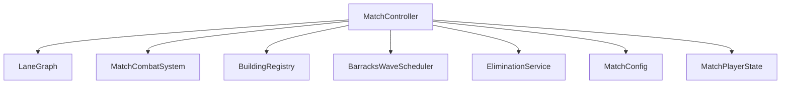
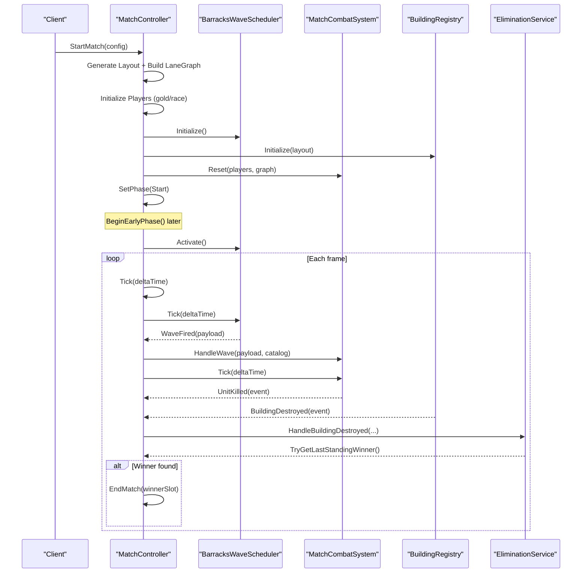
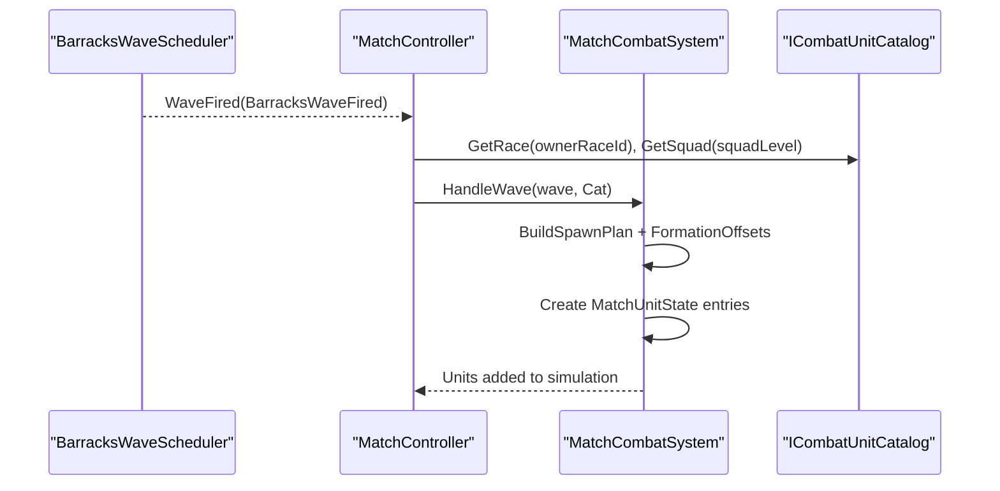
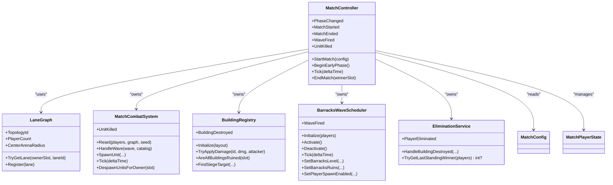

# Gameplay Systems

<cite>
**Referenced Files in This Document**
- [MatchController.cs](file://Assets/Game/Scripts/Runtime/Gameplay/Match/MatchController.cs)
- [LaneGraph.cs](file://Assets/Game/Scripts/Runtime/Gameplay/Match/LaneGraph.cs)
- [MatchCombatSystem.cs](file://Assets/Game/Scripts/Runtime/Gameplay/Combat/MatchCombatSystem.cs)
- [BuildingRegistry.cs](file://Assets/Game/Scripts/Runtime/Gameplay/Match/BuildingRegistry.cs)
- [BarracksWaveScheduler.cs](file://Assets/Game/Scripts/Runtime/Gameplay/Match/BarracksWaveScheduler.cs)
- [EliminationService.cs](file://Assets/Game/Scripts/Runtime/Gameplay/Match/EliminationService.cs)
- [MatchConfig.cs](file://Assets/Game/Scripts/Runtime/Gameplay/Match/MatchConfig.cs)
- [MatchPlayerState.cs](file://Assets/Game/Scripts/Runtime/Gameplay/Match/MatchPlayerState.cs)
- [Core Gameplay.md](file://Assets/Game/GameDesign/Core Gameplay.md)
- [Match Flow.md](file://Assets/Game/GameDesign/Match Flow.md)
</cite>

## Table of Contents
1. Introduction
2. Project Structure
3. Core Components
4. Architecture Overview
5. Detailed Component Analysis
6. Dependency Analysis
7. Performance Considerations
8. Troubleshooting Guide
9. Conclusion

## Introduction
This document explains BARAKI’s gameplay systems with a focus on the match lifecycle, lane-based combat mechanics, and resource management. It documents how MatchController orchestrates matches, how LaneGraph defines lanes and movement paths, and how MatchCombatSystem automates battles. It also covers building management, unit spawning, upgrade progression, configuration via ScriptableObjects, and integration points between systems. Concrete examples reference actual code files to show how races interact with units and buildings.

## Project Structure
The runtime gameplay is organized around a small set of authoritative systems:
- Match orchestration and state machine (phases, events, timing)
- Lane graph and pathfinding for unit movement
- Combat simulation (units, projectiles, melee strikes)
- Building registry and elimination logic
- Wave scheduling per barracks
- Configuration and player state

**Diagram sources**
- [MatchController.cs:1-205](file://Assets/Game/Scripts/Runtime/Gameplay/Match/MatchController.cs#L1-L205)
- [LaneGraph.cs:1-35](file://Assets/Game/Scripts/Runtime/Gameplay/Match/LaneGraph.cs#L1-L35)
- [MatchCombatSystem.cs:1-800](file://Assets/Game/Scripts/Runtime/Gameplay/Combat/MatchCombatSystem.cs#L1-L800)
- [BuildingRegistry.cs:1-148](file://Assets/Game/Scripts/Runtime/Gameplay/Match/BuildingRegistry.cs#L1-L148)
- [BarracksWaveScheduler.cs:1-160](file://Assets/Game/Scripts/Runtime/Gameplay/Match/BarracksWaveScheduler.cs#L1-L160)
- [EliminationService.cs:1-83](file://Assets/Game/Scripts/Runtime/Gameplay/Match/EliminationService.cs#L1-L83)
- [MatchConfig.cs:1-68](file://Assets/Game/Scripts/Runtime/Gameplay/Match/MatchConfig.cs#L1-L68)
- [MatchPlayerState.cs:1-18](file://Assets/Game/Scripts/Runtime/Gameplay/Match/MatchPlayerState.cs#L1-L18)

**Section sources**
- [MatchController.cs:1-205](file://Assets/Game/Scripts/Runtime/Gameplay/Match/MatchController.cs#L1-L205)
- [Match Flow.md:1-242](file://Assets/Game/GameDesign/Match Flow.md#L1-L242)

## Core Components
- MatchController: Central orchestrator that manages phases, initializes subsystems, ticks time, and coordinates wave firing, combat updates, and elimination checks.
- LaneGraph: Defines lanes as splines with owner/opponent metadata and exposes lookup by key.
- MatchCombatSystem: Simulates units, projectiles, and melee strikes; handles spawn from waves, targeting, locomotion, and damage application.
- BuildingRegistry: Manages building instances, HP/armor, damage application, siege targeting, and ruin state.
- BarracksWaveScheduler: Per-barracks timers that fire squads at intervals based on level and race.
- EliminationService: Transitions players to eliminated when all buildings are ruined and cleans up resources.
- MatchConfig and MatchPlayerState: Provide match setup parameters and per-player state including gold and race.

Key responsibilities and interactions:
- StartMatch builds arena layout and LaneGraph, initializes players, registers event hooks, and transitions to Start phase.
- Tick advances time, drives wave scheduler and combat system, and transitions phases based on elapsed time.
- OnWaveFired translates scheduled squad into spawned units using catalog data and combat formation rules.
- OnUnitKilled and OnBuildingDestroyed propagate events and trigger elimination checks.

**Section sources**
- [MatchController.cs:36-126](file://Assets/Game/Scripts/Runtime/Gameplay/Match/MatchController.cs#L36-L126)
- [LaneGraph.cs:15-33](file://Assets/Game/Scripts/Runtime/Gameplay/Match/LaneGraph.cs#L15-L33)
- [MatchCombatSystem.cs:91-156](file://Assets/Game/Scripts/Runtime/Gameplay/Combat/MatchCombatSystem.cs#L91-L156)
- [BuildingRegistry.cs:18-77](file://Assets/Game/Scripts/Runtime/Gameplay/Match/BuildingRegistry.cs#L18-L77)
- [BarracksWaveScheduler.cs:27-93](file://Assets/Game/Scripts/Runtime/Gameplay/Match/BarracksWaveScheduler.cs#L27-L93)
- [EliminationService.cs:11-36](file://Assets/Game/Scripts/Runtime/Gameplay/Match/EliminationService.cs#L11-L36)
- [MatchConfig.cs:9-27](file://Assets/Game/Scripts/Runtime/Gameplay/Match/MatchConfig.cs#L9-L27)
- [MatchPlayerState.cs:5-16](file://Assets/Game/Scripts/Runtime/Gameplay/Match/MatchPlayerState.cs#L5-L16)

## Architecture Overview
The match lifecycle flows through phases: Lobby → Start → Early/Mid/Late → End. The controller initializes subsystems, activates wave scheduling during Early, and ends when only one player remains.

**Diagram sources**
- [MatchController.cs:36-126](file://Assets/Game/Scripts/Runtime/Gameplay/Match/MatchController.cs#L36-L126)
- [BarracksWaveScheduler.cs:69-93](file://Assets/Game/Scripts/Runtime/Gameplay/Match/BarracksWaveScheduler.cs#L69-L93)
- [MatchCombatSystem.cs:91-156](file://Assets/Game/Scripts/Runtime/Gameplay/Combat/MatchCombatSystem.cs#L91-L156)
- [EliminationService.cs:11-36](file://Assets/Game/Scripts/Runtime/Gameplay/Match/EliminationService.cs#L11-L36)

## Detailed Component Analysis

### MatchController: Central Orchestrator
Responsibilities:
- Validates config and constructs arena layout and LaneGraph.
- Initializes players with starting gold derived from race.
- Registers event handlers for waves, kills, and building destruction.
- Drives phase transitions and activation/deactivation of wave scheduling.
- Exposes public events for UI and networking.

Key behaviors:
- StartMatch: Builds layout/graph, sets up players, wires events, resets combat, and emits MatchStarted.
- Tick: Advances time, ticks wave scheduler and combat, resolves time-based phase changes.
- EndMatch: Stops wave scheduling, sets winner, emits MatchEnded.
- Event propagation: Forwards WaveFired and UnitKilled to subscribers.

Return values and exceptions:
- StartMatch throws on invalid config or wrong phase.
- EndMatch throws if match not started or invalid winner slot.
- PhaseChanged provides previous and next phase.

Integration points:
- Uses ICombatUnitCatalog to resolve race/squad definitions for spawns.
- Relies on LaneGraphBuilder and MatchArenaGenerator for topology.
- Delegates elimination checks to EliminationService.

**Section sources**
- [MatchController.cs:36-88](file://Assets/Game/Scripts/Runtime/Gameplay/Match/MatchController.cs#L36-L88)
- [MatchController.cs:100-126](file://Assets/Game/Scripts/Runtime/Gameplay/Match/MatchController.cs#L100-L126)
- [MatchController.cs:128-149](file://Assets/Game/Scripts/Runtime/Gameplay/Match/MatchController.cs#L128-L149)
- [MatchController.cs:151-180](file://Assets/Game/Scripts/Runtime/Gameplay/Match/MatchController.cs#L151-L180)
- [MatchController.cs:182-202](file://Assets/Game/Scripts/Runtime/Gameplay/Match/MatchController.cs#L182-L202)

### LaneGraph: Pathfinding and Movement
Data model:
- LaneSpline: Owner/opponent slots, lane id, origin barracks id, center flag, and path.
- LaneGraph: Topology id, player count, center arena radius, list of lanes, keyed lookup by (ownerSlot, laneId).

Usage:
- Built once per match from arena layout.
- Used by combat system to compute routes, spawn positions, and movement along lanes.

Lookup API:
- TryGetLane(ownerSlot, laneId) returns LaneSpline or null.

**Section sources**
- [LaneGraph.cs:5-13](file://Assets/Game/Scripts/Runtime/Gameplay/Match/LaneGraph.cs#L5-L13)
- [LaneGraph.cs:15-33](file://Assets/Game/Scripts/Runtime/Gameplay/Match/LaneGraph.cs#L15-L33)

### MatchCombatSystem: Automated Battles
Core responsibilities:
- Maintain lists of units, projectiles, and melee strikes.
- Spawn units from waves using catalog and formation rules.
- Update unit behavior: move, chase, attack, target selection, and building siege.
- Apply damage to buildings and handle projectile flight.
- Provide explicit spawn for tests and scripted scenarios.

Important APIs:
- Reset(players, graph, randomSeed): Clears state and prepares route registry.
- HandleWave(wave, catalog): Spawns units according to squad plan and race definitions.
- SpawnUnit(ownerSlot, laneId, role, stats, distanceAlongLane, formationOffset): Direct spawn for testing.
- Tick(deltaTime): Updates units, projectiles, melee strikes.
- DespawnUnitsForOwner(ownerSlot): Cleans up units/projectiles/strikes for eliminated players.

Targeting and engagement:
- ResolveCurrentTarget and ScanForEnemy enforce lane engagement rules and aggro ranges.
- Siege units can target buildings within range and switch to chase/building attack states.

Damage and projectiles:
- Melee attacks apply damage directly to buildings.
- Ranged attacks create projectiles with computed duration and impact.

**Section sources**
- [MatchCombatSystem.cs:42-59](file://Assets/Game/Scripts/Runtime/Gameplay/Combat/MatchCombatSystem.cs#L42-L59)
- [MatchCombatSystem.cs:91-156](file://Assets/Game/Scripts/Runtime/Gameplay/Combat/MatchCombatSystem.cs#L91-L156)
- [MatchCombatSystem.cs:158-190](file://Assets/Game/Scripts/Runtime/Gameplay/Combat/MatchCombatSystem.cs#L158-L190)
- [MatchCombatSystem.cs:192-216](file://Assets/Game/Scripts/Runtime/Gameplay/Combat/MatchCombatSystem.cs#L192-L216)
- [MatchCombatSystem.cs:218-290](file://Assets/Game/Scripts/Runtime/Gameplay/Combat/MatchCombatSystem.cs#L218-L290)
- [MatchCombatSystem.cs:586-623](file://Assets/Game/Scripts/Runtime/Gameplay/Combat/MatchCombatSystem.cs#L586-L623)

#### Sequence: Wave-to-Combat Flow

**Diagram sources**
- [BarracksWaveScheduler.cs:145-157](file://Assets/Game/Scripts/Runtime/Gameplay/Match/BarracksWaveScheduler.cs#L145-L157)
- [MatchController.cs:151-159](file://Assets/Game/Scripts/Runtime/Gameplay/Match/MatchController.cs#L151-L159)
- [MatchCombatSystem.cs:91-156](file://Assets/Game/Scripts/Runtime/Gameplay/Combat/MatchCombatSystem.cs#L91-L156)

### BuildingRegistry: Buildings and Ruins
Responsibilities:
- Initialize building instances for each slot and building type.
- Apply armor-reduced damage and transition to ruins.
- Find siege targets within range and lane constraints.
- Report destruction events and query ruin status.

Key APIs:
- Initialize(layout): Creates all buildings with max HP and armor.
- TryApplyDamage(instanceId, rawDamage, attackerOwnerSlot): Applies damage and fires BuildingDestroyed if ruined.
- AreAllBuildingsRuined(ownerSlot): Checks if all buildings for a player are ruined.
- CountIntactBuildings(ownerSlot): Counts intact buildings for a player.
- FindSiegeTarget(attackerOwnerSlot, laneId, position, attackRange): Selects nearest valid enemy building.

Events:
- BuildingDestroyed(ownerSlot, buildingId, instanceId, attackerOwnerSlot).

**Section sources**
- [BuildingRegistry.cs:18-42](file://Assets/Game/Scripts/Runtime/Gameplay/Match/BuildingRegistry.cs#L18-L42)
- [BuildingRegistry.cs:57-77](file://Assets/Game/Scripts/Runtime/Gameplay/Match/BuildingRegistry.cs#L57-L77)
- [BuildingRegistry.cs:79-111](file://Assets/Game/Scripts/Runtime/Gameplay/Match/BuildingRegistry.cs#L79-L111)
- [BuildingRegistry.cs:113-145](file://Assets/Game/Scripts/Runtime/Gameplay/Match/BuildingRegistry.cs#L113-L145)

### BarracksWaveScheduler: Per-Barracks Timers
Responsibilities:
- Maintain per-barracks timers and effective squad levels.
- Fire waves at intervals determined by barracks level and race passives.
- Support ruins mode where interval reverts to L1 and squad level freezes.

Key APIs:
- Initialize(players): Sets up timers for all barracks across all players.
- Activate()/Deactivate(): Controls global ticking.
- Tick(deltaTime): Decrements timers and fires waves when ready.
- SetBarracksLevel(ownerSlot, barracksId, level): Updates level and refreshes interval.
- SetBarracksRuins(ownerSlot, barracksId): Freezes squad level and reverts interval to L1.
- SetPlayerSpawnEnabled(ownerSlot, enabled): Enables/disables spawn for a player.

Events:
- WaveFired(BarracksWaveFired) includes owner slot, barracks id, lane id, race id, squad level, and squad id.

**Section sources**
- [BarracksWaveScheduler.cs:27-57](file://Assets/Game/Scripts/Runtime/Gameplay/Match/BarracksWaveScheduler.cs#L27-L57)
- [BarracksWaveScheduler.cs:69-93](file://Assets/Game/Scripts/Runtime/Gameplay/Match/BarracksWaveScheduler.cs#L69-L93)
- [BarracksWaveScheduler.cs:95-118](file://Assets/Game/Scripts/Runtime/Gameplay/Match/BarracksWaveScheduler.cs#L95-L118)
- [BarracksWaveScheduler.cs:120-129](file://Assets/Game/Scripts/Runtime/Gameplay/Match/BarracksWaveScheduler.cs#L120-L129)
- [BarracksWaveScheduler.cs:145-157](file://Assets/Game/Scripts/Runtime/Gameplay/Match/BarracksWaveScheduler.cs#L145-L157)

### EliminationService: Player Elimination and Cleanup
Responsibilities:
- React to building destruction and update barracks ruin state.
- Determine elimination when all buildings are ruined.
- Clean up spawn and active units for eliminated players.
- Compute last standing winner.

Key APIs:
- HandleBuildingDestroyed(event, buildings, players, waveScheduler, combat): Orchestrates ruin and elimination.
- TryGetLastStandingWinner(players): Returns winner slot if exactly one remains.

Events:
- PlayerEliminated(ownerSlot).

**Section sources**
- [EliminationService.cs:11-36](file://Assets/Game/Scripts/Runtime/Gameplay/Match/EliminationService.cs#L11-L36)
- [EliminationService.cs:38-62](file://Assets/Game/Scripts/Runtime/Gameplay/Match/EliminationService.cs#L38-L62)
- [EliminationService.cs:64-80](file://Assets/Game/Scripts/Runtime/Gameplay/Match/EliminationService.cs#L64-L80)

### Configuration and Data Models
- MatchConfig: Holds player count, race ids, arena radii, and distances. Provides MVP defaults and factory helpers.
- MatchPlayerState: Tracks slot index, race id, gold, and elimination flag.

Configuration usage:
- StartMatch validates player count and race ids, generates layout, and assigns starting gold per race.

**Section sources**
- [MatchConfig.cs:9-27](file://Assets/Game/Scripts/Runtime/Gameplay/Match/MatchConfig.cs#L9-L27)
- [MatchConfig.cs:29-44](file://Assets/Game/Scripts/Runtime/Gameplay/Match/MatchConfig.cs#L29-L44)
- [MatchConfig.cs:46-54](file://Assets/Game/Scripts/Runtime/Gameplay/Match/MatchConfig.cs#L46-L54)
- [MatchPlayerState.cs:5-16](file://Assets/Game/Scripts/Runtime/Gameplay/Match/MatchPlayerState.cs#L5-L16)

### Race Interaction Examples
- Starting gold: Determined by race id via MatchRules.GetStartingGold during player initialization.
- March speed: Computed per unit role using RaceMarchSpeedRules.GetMarchSpeed.
- Squad composition: Resolved via ICombatUnitCatalog.GetSquad and SquadSpawnRules.BuildSpawnPlan.
- Unit definitions: Retrieved via ICombatUnitCatalog.GetRace(raceId).GetUnit(role).

These patterns demonstrate how races influence unit stats, march speeds, and squad composition during spawning.

**Section sources**
- [MatchController.cs:65-70](file://Assets/Game/Scripts/Runtime/Gameplay/Match/MatchController.cs#L65-L70)
- [MatchCombatSystem.cs:104-136](file://Assets/Game/Scripts/Runtime/Gameplay/Combat/MatchCombatSystem.cs#L104-L136)

## Dependency Analysis
High-level dependencies among core components:

**Diagram sources**
- [MatchController.cs:1-205](file://Assets/Game/Scripts/Runtime/Gameplay/Match/MatchController.cs#L1-L205)
- [LaneGraph.cs:1-35](file://Assets/Game/Scripts/Runtime/Gameplay/Match/LaneGraph.cs#L1-L35)
- [MatchCombatSystem.cs:1-800](file://Assets/Game/Scripts/Runtime/Gameplay/Combat/MatchCombatSystem.cs#L1-L800)
- [BuildingRegistry.cs:1-148](file://Assets/Game/Scripts/Runtime/Gameplay/Match/BuildingRegistry.cs#L1-L148)
- [BarracksWaveScheduler.cs:1-160](file://Assets/Game/Scripts/Runtime/Gameplay/Match/BarracksWaveScheduler.cs#L1-L160)
- [EliminationService.cs:1-83](file://Assets/Game/Scripts/Runtime/Gameplay/Match/EliminationService.cs#L1-L83)
- [MatchConfig.cs:1-68](file://Assets/Game/Scripts/Runtime/Gameplay/Match/MatchConfig.cs#L1-L68)
- [MatchPlayerState.cs:1-18](file://Assets/Game/Scripts/Runtime/Gameplay/Match/MatchPlayerState.cs#L1-L18)

**Section sources**
- [MatchController.cs:1-205](file://Assets/Game/Scripts/Runtime/Gameplay/Match/MatchController.cs#L1-L205)
- [MatchCombatSystem.cs:1-800](file://Assets/Game/Scripts/Runtime/Gameplay/Combat/MatchCombatSystem.cs#L1-L800)

## Performance Considerations
- Avoid unnecessary allocations in hot paths:
  - Reuse temporary lists in combat loops where possible.
  - Minimize LINQ in per-frame updates; prefer indexed iteration.
- Optimize unit scanning:
  - Use spatial queries or broad-phase culling for aggro scans.
  - Limit scan radius and frequency via TargetScanCooldown.
- Projectile and melee strike lists:
  - Keep collections compact; remove expired items promptly.
- Building damage application:
  - Batch operations if multiple units attack same building in a frame.

[No sources needed since this section provides general guidance]

## Troubleshooting Guide
Common issues and diagnostics:
- Invalid start conditions:
  - Ensure PlayerCount is within 2..8 and RaceIds length matches PlayerCount.
  - Verify Phase is Lobby or End before calling StartMatch.
- Missing lane routes:
  - Confirm LaneGraph was built and routes exist for (ownerSlot, laneId).
  - Check LaneGraph.TryGetLane results before spawning units.
- Null catalogs:
  - Set ICombatUnitCatalog before handling waves to avoid null references.
- Building damage not applied:
  - Validate building instance id and ensure it is not already ruins.
  - Confirm attackerOwnerSlot differs from building owner and lane constraints allow siege.
- Elimination not triggering:
  - Ensure AreAllBuildingsRuined returns true for a player after building destruction.
  - Verify wave scheduler is deactivated and units despawned for eliminated players.

**Section sources**
- [MatchController.cs:36-56](file://Assets/Game/Scripts/Runtime/Gameplay/Match/MatchController.cs#L36-L56)
- [MatchCombatSystem.cs:91-102](file://Assets/Game/Scripts/Runtime/Gameplay/Combat/MatchCombatSystem.cs#L91-L102)
- [BuildingRegistry.cs:57-77](file://Assets/Game/Scripts/Runtime/Gameplay/Match/BuildingRegistry.cs#L57-L77)
- [EliminationService.cs:11-36](file://Assets/Game/Scripts/Runtime/Gameplay/Match/EliminationService.cs#L11-L36)

## Conclusion
BARAKI’s gameplay systems are centered around a deterministic, server-authoritative architecture. MatchController orchestrates phases and delegates specialized tasks to LaneGraph, MatchCombatSystem, BuildingRegistry, BarracksWaveScheduler, and EliminationService. Races influence unit stats, march speeds, and squad composition through catalogs and rules. Configuration via MatchConfig and player state via MatchPlayerState provide clear entry points for setup and runtime tracking. The design supports scalable topologies, automated lane-based combat, and robust elimination logic suitable for FFA matches.

[No sources needed since this section summarizes without analyzing specific files]