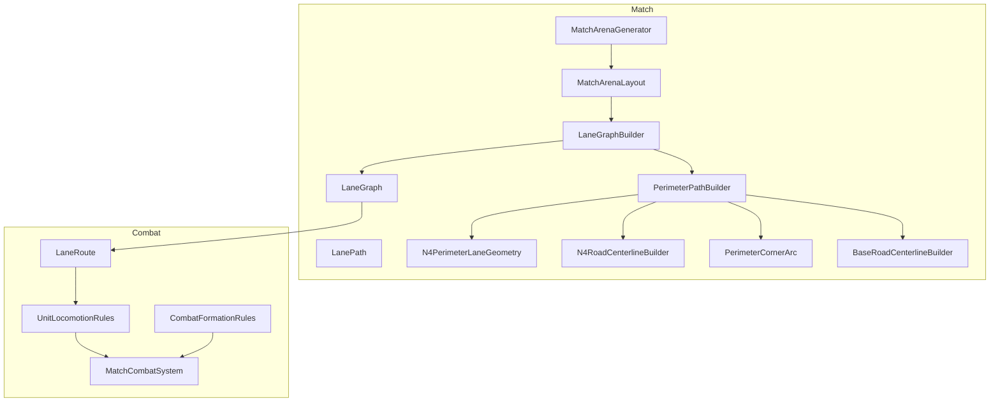
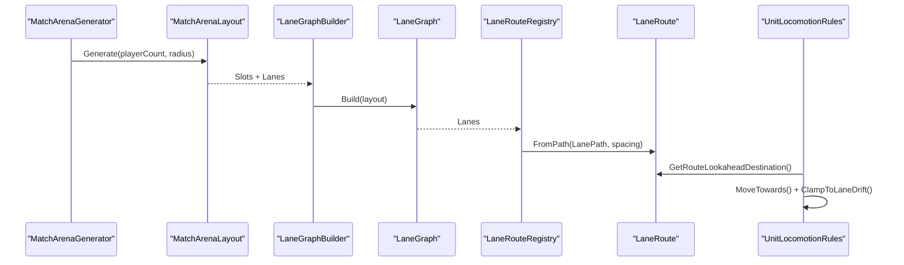
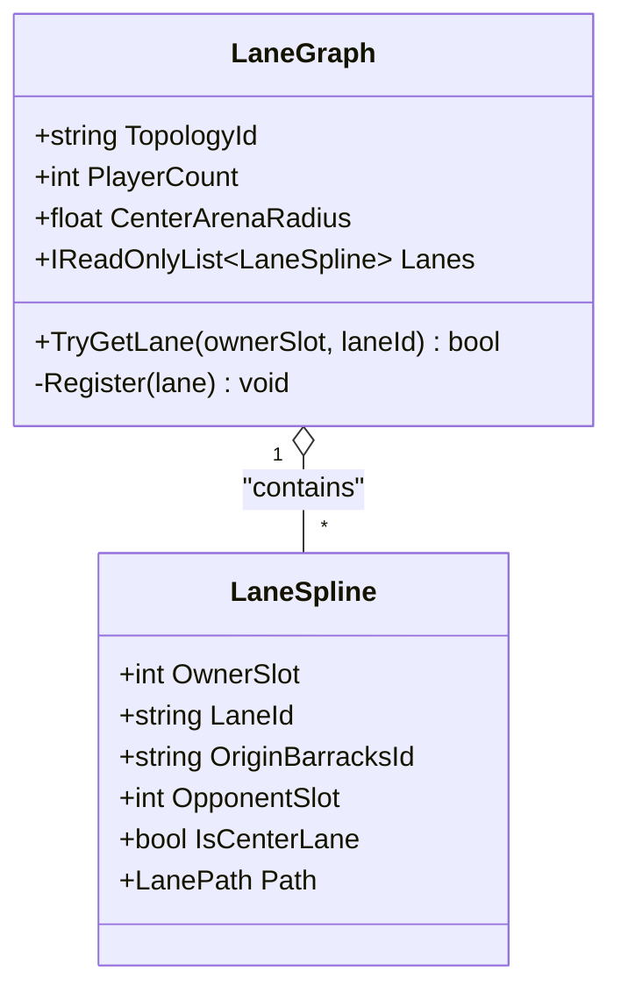
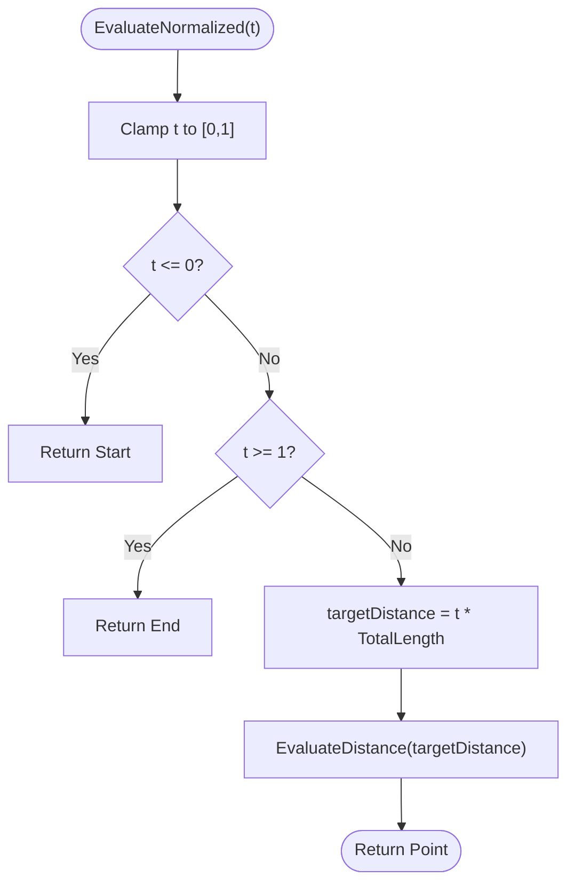
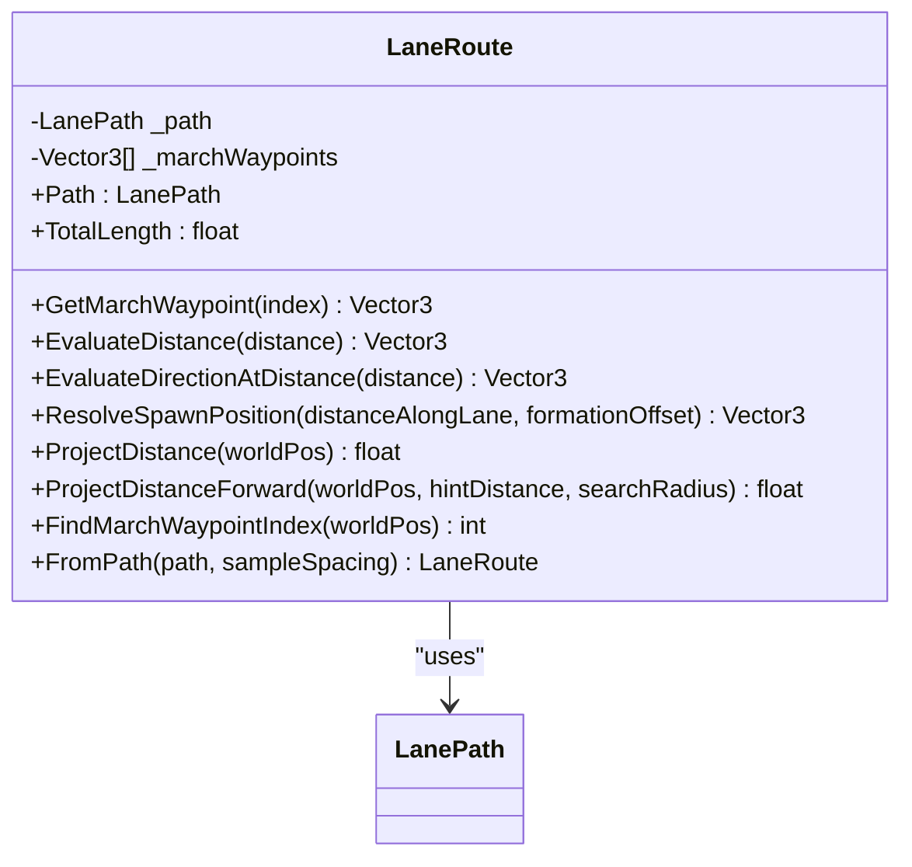
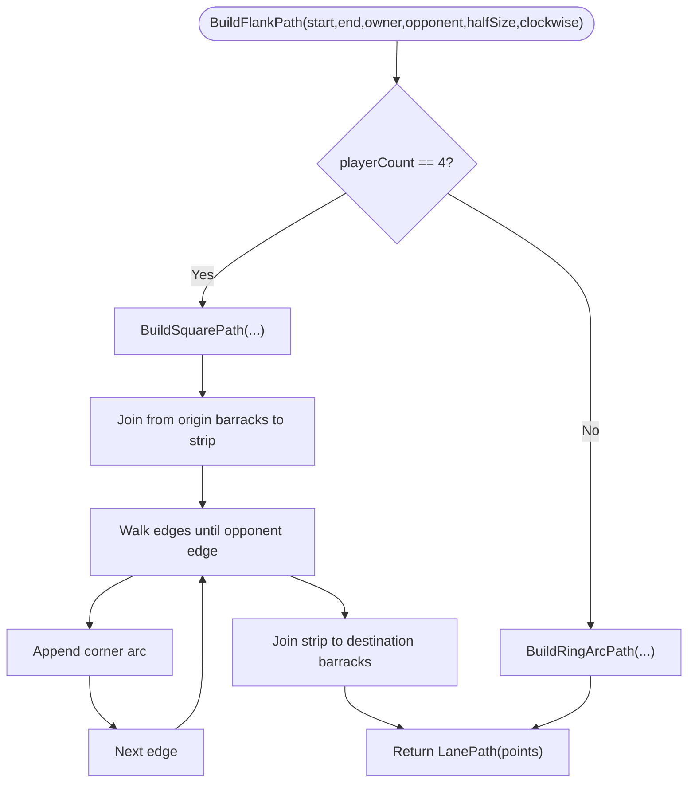
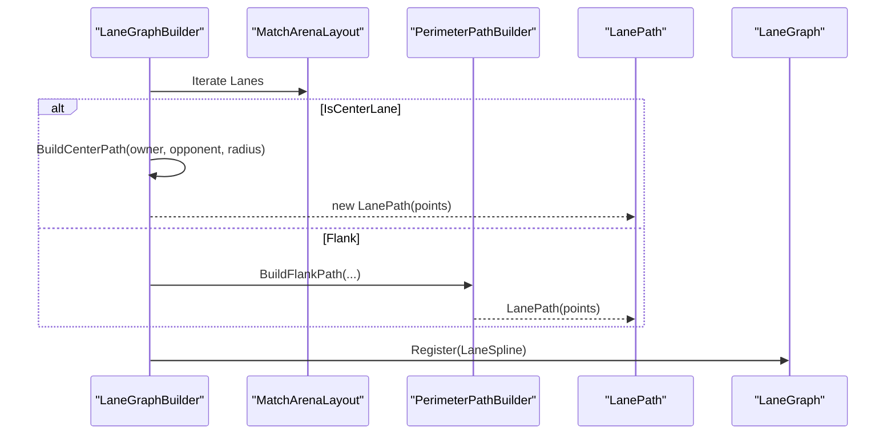
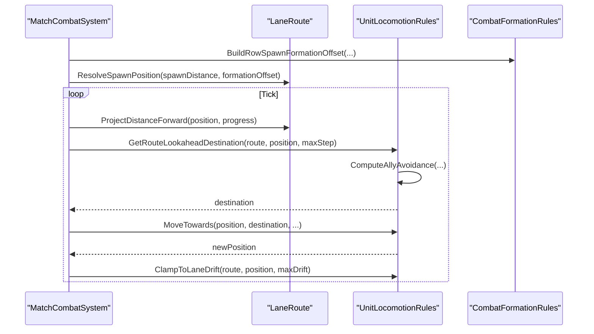
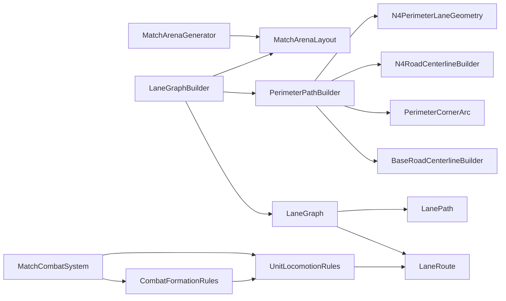

# Lane Mechanics

<cite>
**Referenced Files in This Document**
- [LaneGraph.cs](file://Assets/Game/Scripts/Runtime/Gameplay/Match/LaneGraph.cs)
- [LanePath.cs](file://Assets/Game/Scripts/Runtime/Gameplay/Match/LanePath.cs)
- [LaneRoute.cs](file://Assets/Game/Scripts/Runtime/Gameplay/Combat/LaneRoute.cs)
- [N4PerimeterLaneGeometry.cs](file://Assets/Game/Scripts/Runtime/Gameplay/Match/N4PerimeterLaneGeometry.cs)
- [PerimeterPathBuilder.cs](file://Assets/Game/Scripts/Runtime/Gameplay/Match/PerimeterPathBuilder.cs)
- [LaneGraphBuilder.cs](file://Assets/Game/Scripts/Runtime/Gameplay/Match/LaneGraphBuilder.cs)
- [N4RoadCenterlineBuilder.cs](file://Assets/Game/Scripts/Runtime/Gameplay/Match/N4RoadCenterlineBuilder.cs)
- [PerimeterCornerArc.cs](file://Assets/Game/Scripts/Runtime/Gameplay/Match/PerimeterCornerArc.cs)
- [BaseRoadCenterlineBuilder.cs](file://Assets/Game/Scripts/Runtime/Gameplay/Match/BaseRoadCenterlineBuilder.cs)
- [MatchArenaLayout.cs](file://Assets/Game/Scripts/Runtime/Gameplay/Match/MatchArenaLayout.cs)
- [MatchArenaGenerator.cs](file://Assets/Game/Scripts/Runtime/Gameplay/Match/MatchArenaGenerator.cs)
- [UnitLocomotionRules.cs](file://Assets/Game/Scripts/Runtime/Gameplay/Combat/UnitLocomotionRules.cs)
- [CombatFormationRules.cs](file://Assets/Game/Scripts/Runtime/Gameplay/Combat/CombatFormationRules.cs)
- [MatchCombatSystem.cs](file://Assets/Game/Scripts/Runtime/Gameplay/Combat/MatchCombatSystem.cs)
</cite>

## Table of Contents
1. [Introduction](#introduction)
2. [Project Structure](#project-structure)
3. [Core Components](#core-components)
4. [Architecture Overview](#architecture-overview)
5. [Detailed Component Analysis](#detailed-component-analysis)
6. [Dependency Analysis](#dependency-analysis)
7. [Performance Considerations](#performance-considerations)
8. [Troubleshooting Guide](#troubleshooting-guide)
9. [Conclusion](#conclusion)
10. [Appendices](#appendices)

## Introduction
This document explains BARAKI’s lane-based movement and positioning system. It covers the LaneGraph architecture for pathfinding, LanePath for individual route definitions, and LaneRoute for combat-specific routing. It also documents N4PerimeterLaneGeometry for arena layout generation and PerimeterPathBuilder for creating perimeter paths. Finally, it details unit spawning points, lane assignments, and movement algorithms, with examples for custom lane creation, path modification, and geometry customization. Performance considerations for complex arenas, collision detection, and optimization techniques for large numbers of units are included.

## Project Structure
The lane system is implemented under the Gameplay modules:
- Match-time graph and path primitives (LaneGraph, LanePath, builders)
- Combat-time routing and movement rules (LaneRoute, UnitLocomotionRules, CombatFormationRules)
- Arena geometry helpers (N4PerimeterLaneGeometry, N4RoadCenterlineBuilder, PerimeterCornerArc, BaseRoadCenterlineBuilder)
- Arena layout generation (MatchArenaLayout, MatchArenaGenerator)
- Combat orchestration (MatchCombatSystem)

**Diagram sources**
- [LaneGraph.cs:15-33](file://Assets/Game/Scripts/Runtime/Gameplay/Match/LaneGraph.cs#L15-L33)
- [LanePath.cs:10-40](file://Assets/Game/Scripts/Runtime/Gameplay/Match/LanePath.cs#L10-L40)
- [LaneGraphBuilder.cs:12-45](file://Assets/Game/Scripts/Runtime/Gameplay/Match/LaneGraphBuilder.cs#L12-L45)
- [PerimeterPathBuilder.cs:7-36](file://Assets/Game/Scripts/Runtime/Gameplay/Match/PerimeterPathBuilder.cs#L7-L36)
- [N4PerimeterLaneGeometry.cs:7-31](file://Assets/Game/Scripts/Runtime/Gameplay/Match/N4PerimeterLaneGeometry.cs#L7-L31)
- [N4RoadCenterlineBuilder.cs:7-35](file://Assets/Game/Scripts/Runtime/Gameplay/Match/N4RoadCenterlineBuilder.cs#L7-L35)
- [PerimeterCornerArc.cs:7-20](file://Assets/Game/Scripts/Runtime/Gameplay/Match/PerimeterCornerArc.cs#L7-L20)
- [BaseRoadCenterlineBuilder.cs:172-200](file://Assets/Game/Scripts/Runtime/Gameplay/Match/BaseRoadCenterlineBuilder.cs#L172-L200)
- [MatchArenaLayout.cs:13-32](file://Assets/Game/Scripts/Runtime/Gameplay/Match/MatchArenaLayout.cs#L13-L32)
- [MatchArenaGenerator.cs:19-67](file://Assets/Game/Scripts/Runtime/Gameplay/Match/MatchArenaGenerator.cs#L19-L67)
- [LaneRoute.cs:9-20](file://Assets/Game/Scripts/Runtime/Gameplay/Combat/LaneRoute.cs#L9-L20)
- [UnitLocomotionRules.cs:7-20](file://Assets/Game/Scripts/Runtime/Gameplay/Combat/UnitLocomotionRules.cs#L7-L20)
- [CombatFormationRules.cs:7-22](file://Assets/Game/Scripts/Runtime/Gameplay/Combat/CombatFormationRules.cs#L7-L22)
- [MatchCombatSystem.cs:116-145](file://Assets/Game/Scripts/Runtime/Gameplay/Combat/MatchCombatSystem.cs#L116-L145)

**Section sources**
- [LaneGraph.cs:15-33](file://Assets/Game/Scripts/Runtime/Gameplay/Match/LaneGraph.cs#L15-L33)
- [LanePath.cs:10-40](file://Assets/Game/Scripts/Runtime/Gameplay/Match/LanePath.cs#L10-L40)
- [LaneGraphBuilder.cs:12-45](file://Assets/Game/Scripts/Runtime/Gameplay/Match/LaneGraphBuilder.cs#L12-L45)
- [PerimeterPathBuilder.cs:7-36](file://Assets/Game/Scripts/Runtime/Gameplay/Match/PerimeterPathBuilder.cs#L7-L36)
- [N4PerimeterLaneGeometry.cs:7-31](file://Assets/Game/Scripts/Runtime/Gameplay/Match/N4PerimeterLaneGeometry.cs#L7-L31)
- [N4RoadCenterlineBuilder.cs:7-35](file://Assets/Game/Scripts/Runtime/Gameplay/Match/N4RoadCenterlineBuilder.cs#L7-L35)
- [PerimeterCornerArc.cs:7-20](file://Assets/Game/Scripts/Runtime/Gameplay/Match/PerimeterCornerArc.cs#L7-L20)
- [BaseRoadCenterlineBuilder.cs:172-200](file://Assets/Game/Scripts/Runtime/Gameplay/Match/BaseRoadCenterlineBuilder.cs#L172-L200)
- [MatchArenaLayout.cs:13-32](file://Assets/Game/Scripts/Runtime/Gameplay/Match/MatchArenaLayout.cs#L13-L32)
- [MatchArenaGenerator.cs:19-67](file://Assets/Game/Scripts/Runtime/Gameplay/Match/MatchArenaGenerator.cs#L19-L67)
- [LaneRoute.cs:9-20](file://Assets/Game/Scripts/Runtime/Gameplay/Combat/LaneRoute.cs#L9-L20)
- [UnitLocomotionRules.cs:7-20](file://Assets/Game/Scripts/Runtime/Gameplay/Combat/UnitLocomotionRules.cs#L7-L20)
- [CombatFormationRules.cs:7-22](file://Assets/Game/Scripts/Runtime/Gameplay/Combat/CombatFormationRules.cs#L7-L22)
- [MatchCombatSystem.cs:116-145](file://Assets/Game/Scripts/Runtime/Gameplay/Combat/MatchCombatSystem.cs#L116-L145)

## Core Components
- LaneGraph: Holds a collection of lanes per topology, indexed by owner slot and lane id. Each lane contains metadata and a LanePath.
- LanePath: Piecewise-linear path through waypoints with cumulative length tables for fast evaluation by normalized t or distance.
- LaneRoute: Combat-oriented wrapper around LanePath that pre-samples march waypoints and provides spawn resolution and projection utilities.
- N4PerimeterLaneGeometry: Geometry helpers for square (N=4) perimeter lanes, including travel coordinates, junctions, strip joins, and corner tangents.
- PerimeterPathBuilder: Builds flank paths along shared perimeter ring (square for N=4; circular arc for other N).
- LaneGraphBuilder: Constructs LaneGraph from MatchArenaLayout, generating center and flank paths.
- UnitLocomotionRules: Movement rules combining route lookahead, ally avoidance, and lane drift clamping.
- CombatFormationRules: Spawn formation offsets, lateral spread, and row staggering.
- MatchArenaLayout/MatchArenaGenerator: Define player slots, building positions, and lane connections used to build the graph.

**Section sources**
- [LaneGraph.cs:15-33](file://Assets/Game/Scripts/Runtime/Gameplay/Match/LaneGraph.cs#L15-L33)
- [LanePath.cs:10-40](file://Assets/Game/Scripts/Runtime/Gameplay/Match/LanePath.cs#L10-L40)
- [LaneRoute.cs:9-20](file://Assets/Game/Scripts/Runtime/Gameplay/Combat/LaneRoute.cs#L9-L20)
- [N4PerimeterLaneGeometry.cs:7-31](file://Assets/Game/Scripts/Runtime/Gameplay/Match/N4PerimeterLaneGeometry.cs#L7-L31)
- [PerimeterPathBuilder.cs:7-36](file://Assets/Game/Scripts/Runtime/Gameplay/Match/PerimeterPathBuilder.cs#L7-L36)
- [LaneGraphBuilder.cs:12-45](file://Assets/Game/Scripts/Runtime/Gameplay/Match/LaneGraphBuilder.cs#L12-L45)
- [UnitLocomotionRules.cs:7-20](file://Assets/Game/Scripts/Runtime/Gameplay/Combat/UnitLocomotionRules.cs#L7-L20)
- [CombatFormationRules.cs:7-22](file://Assets/Game/Scripts/Runtime/Gameplay/Combat/CombatFormationRules.cs#L7-L22)
- [MatchArenaLayout.cs:13-32](file://Assets/Game/Scripts/Runtime/Gameplay/Match/MatchArenaLayout.cs#L13-L32)
- [MatchArenaGenerator.cs:19-67](file://Assets/Game/Scripts/Runtime/Gameplay/Match/MatchArenaGenerator.cs#L19-L67)

## Architecture Overview
The system builds a LaneGraph at match start from an arena layout. Center lanes go straight through the arena center; flank lanes follow a shared perimeter ring. At runtime, LaneRoute instances sample the path for marching and provide spawn resolution. Units use UnitLocomotionRules to move toward lookahead targets while avoiding allies and staying within lane drift bounds.

**Diagram sources**
- [MatchArenaGenerator.cs:19-67](file://Assets/Game/Scripts/Runtime/Gameplay/Match/MatchArenaGenerator.cs#L19-L67)
- [MatchArenaLayout.cs:43-52](file://Assets/Game/Scripts/Runtime/Gameplay/Match/MatchArenaLayout.cs#L43-L52)
- [LaneGraphBuilder.cs:12-45](file://Assets/Game/Scripts/Runtime/Gameplay/Match/LaneGraphBuilder.cs#L12-L45)
- [LaneGraph.cs:15-33](file://Assets/Game/Scripts/Runtime/Gameplay/Match/LaneGraph.cs#L15-L33)
- [LaneRoute.cs:74-96](file://Assets/Game/Scripts/Runtime/Gameplay/Combat/LaneRoute.cs#L74-L96)
- [UnitLocomotionRules.cs:18-41](file://Assets/Game/Scripts/Runtime/Gameplay/Combat/UnitLocomotionRules.cs#L18-L41)

## Detailed Component Analysis

### LaneGraph and LaneSpline
- Purpose: Store all lanes for a topology, keyed by (ownerSlot, laneId).
- Key fields: TopologyId, PlayerCount, CenterArenaRadius, Lanes list.
- Operations: Register lane, TryGetLane lookup.

**Diagram sources**
- [LaneGraph.cs:15-33](file://Assets/Game/Scripts/Runtime/Gameplay/Match/LaneGraph.cs#L15-L33)
- [LaneGraph.cs:5-13](file://Assets/Game/Scripts/Runtime/Gameplay/Match/LaneGraph.cs#L5-L13)

**Section sources**
- [LaneGraph.cs:15-33](file://Assets/Game/Scripts/Runtime/Gameplay/Match/LaneGraph.cs#L15-L33)

### LanePath: Evaluation and Projection
- Data structures: Waypoints array, segment lengths, cumulative lengths.
- Complexity:
  - EvaluateNormalized/EvaluateDistance: O(log N) if binary search were used; current implementation is linear scan over segments.
  - ProjectDistance: O(N) scanning all segments.
  - ProjectDistanceForward: O(K) where K is number of segments near hintDistance.
- Utilities: Start/End, direction estimation via finite differences or look-ahead sampling.

**Diagram sources**
- [LanePath.cs:50-65](file://Assets/Game/Scripts/Runtime/Gameplay/Match/LanePath.cs#L50-L65)
- [LanePath.cs:67-96](file://Assets/Game/Scripts/Runtime/Gameplay/Match/LanePath.cs#L67-L96)

**Section sources**
- [LanePath.cs:10-40](file://Assets/Game/Scripts/Runtime/Gameplay/Match/LanePath.cs#L10-L40)
- [LanePath.cs:50-96](file://Assets/Game/Scripts/Runtime/Gameplay/Match/LanePath.cs#L50-L96)
- [LanePath.cs:130-192](file://Assets/Game/Scripts/Runtime/Gameplay/Match/LanePath.cs#L130-L192)

### LaneRoute: Combat Routing and Spawning
- Wraps LanePath and samples march waypoints at fixed spacing.
- Provides ResolveSpawnPosition using spine position plus formation offset.
- FindMarchWaypointIndex uses projected distances to locate next waypoint ahead.

**Diagram sources**
- [LaneRoute.cs:9-20](file://Assets/Game/Scripts/Runtime/Gameplay/Combat/LaneRoute.cs#L9-L20)
- [LaneRoute.cs:41-57](file://Assets/Game/Scripts/Runtime/Gameplay/Combat/LaneRoute.cs#L41-L57)
- [LaneRoute.cs:74-96](file://Assets/Game/Scripts/Runtime/Gameplay/Combat/LaneRoute.cs#L74-L96)

**Section sources**
- [LaneRoute.cs:9-20](file://Assets/Game/Scripts/Runtime/Gameplay/Combat/LaneRoute.cs#L9-L20)
- [LaneRoute.cs:41-57](file://Assets/Game/Scripts/Runtime/Gameplay/Combat/LaneRoute.cs#L41-L57)
- [LaneRoute.cs:74-96](file://Assets/Game/Scripts/Runtime/Gameplay/Combat/LaneRoute.cs#L74-L96)

### N4PerimeterLaneGeometry and PerimeterPathBuilder
- N4PerimeterLaneGeometry exposes constants and helpers for square perimeter lanes: travel coordinates, edge points, junctions, strip joins, and corner tangents.
- PerimeterPathBuilder.BuildFlankPath chooses between square (N=4) and ring (other N) construction. For N=4, it walks edges, appends strip travel, corner arcs, and connects to/from barracks strips.

**Diagram sources**
- [PerimeterPathBuilder.cs:9-36](file://Assets/Game/Scripts/Runtime/Gameplay/Match/PerimeterPathBuilder.cs#L9-L36)
- [PerimeterPathBuilder.cs:38-115](file://Assets/Game/Scripts/Runtime/Gameplay/Match/PerimeterPathBuilder.cs#L38-L115)
- [N4PerimeterLaneGeometry.cs:19-44](file://Assets/Game/Scripts/Runtime/Gameplay/Match/N4PerimeterLaneGeometry.cs#L19-L44)
- [PerimeterCornerArc.cs:13-20](file://Assets/Game/Scripts/Runtime/Gameplay/Match/PerimeterCornerArc.cs#L13-L20)

**Section sources**
- [N4PerimeterLaneGeometry.cs:7-31](file://Assets/Game/Scripts/Runtime/Gameplay/Match/N4PerimeterLaneGeometry.cs#L7-L31)
- [PerimeterPathBuilder.cs:7-36](file://Assets/Game/Scripts/Runtime/Gameplay/Match/PerimeterPathBuilder.cs#L7-L36)
- [PerimeterPathBuilder.cs:38-115](file://Assets/Game/Scripts/Runtime/Gameplay/Match/PerimeterPathBuilder.cs#L38-L115)
- [PerimeterCornerArc.cs:7-20](file://Assets/Game/Scripts/Runtime/Gameplay/Match/PerimeterCornerArc.cs#L7-L20)

### LaneGraphBuilder: Center and Flank Path Construction
- Build(): Iterates connections, creates LaneSpline entries, registers them into LaneGraph.
- BuildCenterPath(): Straight line through arena center with entry/exit computed by circle intersection.
- BuildFlankPath(): Delegates to PerimeterPathBuilder based on lane id and clockwise direction.

**Diagram sources**
- [LaneGraphBuilder.cs:12-45](file://Assets/Game/Scripts/Runtime/Gameplay/Match/LaneGraphBuilder.cs#L12-L45)
- [LaneGraphBuilder.cs:48-66](file://Assets/Game/Scripts/Runtime/Gameplay/Match/LaneGraphBuilder.cs#L48-L66)
- [LaneGraphBuilder.cs:114-138](file://Assets/Game/Scripts/Runtime/Gameplay/Match/LaneGraphBuilder.cs#L114-L138)
- [PerimeterPathBuilder.cs:9-36](file://Assets/Game/Scripts/Runtime/Gameplay/Match/PerimeterPathBuilder.cs#L9-L36)

**Section sources**
- [LaneGraphBuilder.cs:12-45](file://Assets/Game/Scripts/Runtime/Gameplay/Match/LaneGraphBuilder.cs#L12-L45)
- [LaneGraphBuilder.cs:48-66](file://Assets/Game/Scripts/Runtime/Gameplay/Match/LaneGraphBuilder.cs#L48-L66)
- [LaneGraphBuilder.cs:114-138](file://Assets/Game/Scripts/Runtime/Gameplay/Match/LaneGraphBuilder.cs#L114-L138)

### Unit Movement and Collision Avoidance
- UnitLocomotionRules:
  - GetRouteLookaheadDestination: Projects forward along route and evaluates target point.
  - ComputeAllyAvoidance: Local repulsion force based on nearby allies; fallback spread when blocked.
  - MoveTowards: Applies desired direction + avoidance, normalizes, steps towards destination.
  - ClampToLaneDrift: Ensures units stay within max drift from lane spine.
- CombatFormationRules:
  - Spawn offsets: Row-based lateral spacing and jittered depth.
  - Right vector computation and lateral projection utilities.
- MatchCombatSystem:
  - Orchestrates spawning using CombatFormationRules and resolves world positions via LaneRoute.ResolveSpawnPosition.
  - Moves units using UnitLocomotionRules and clamps to lane drift during combat.

**Diagram sources**
- [MatchCombatSystem.cs:116-145](file://Assets/Game/Scripts/Runtime/Gameplay/Combat/MatchCombatSystem.cs#L116-L145)
- [UnitLocomotionRules.cs:18-41](file://Assets/Game/Scripts/Runtime/Gameplay/Combat/UnitLocomotionRules.cs#L18-L41)
- [UnitLocomotionRules.cs:43-102](file://Assets/Game/Scripts/Runtime/Gameplay/Combat/UnitLocomotionRules.cs#L43-L102)
- [UnitLocomotionRules.cs:104-155](file://Assets/Game/Scripts/Runtime/Gameplay/Combat/UnitLocomotionRules.cs#L104-L155)
- [UnitLocomotionRules.cs:157-188](file://Assets/Game/Scripts/Runtime/Gameplay/Combat/UnitLocomotionRules.cs#L157-L188)
- [CombatFormationRules.cs:45-72](file://Assets/Game/Scripts/Runtime/Gameplay/Combat/CombatFormationRules.cs#L45-L72)

**Section sources**
- [UnitLocomotionRules.cs:7-20](file://Assets/Game/Scripts/Runtime/Gameplay/Combat/UnitLocomotionRules.cs#L7-L20)
- [UnitLocomotionRules.cs:18-41](file://Assets/Game/Scripts/Runtime/Gameplay/Combat/UnitLocomotionRules.cs#L18-L41)
- [UnitLocomotionRules.cs:43-102](file://Assets/Game/Scripts/Runtime/Gameplay/Combat/UnitLocomotionRules.cs#L43-L102)
- [UnitLocomotionRules.cs:104-155](file://Assets/Game/Scripts/Runtime/Gameplay/Combat/UnitLocomotionRules.cs#L104-L155)
- [UnitLocomotionRules.cs:157-188](file://Assets/Game/Scripts/Runtime/Gameplay/Combat/UnitLocomotionRules.cs#L157-L188)
- [CombatFormationRules.cs:45-72](file://Assets/Game/Scripts/Runtime/Gameplay/Combat/CombatFormationRules.cs#L45-L72)
- [MatchCombatSystem.cs:116-145](file://Assets/Game/Scripts/Runtime/Gameplay/Combat/MatchCombatSystem.cs#L116-L145)

## Dependency Analysis
- LaneGraph depends on LanePath and stores LaneSpline entries.
- LaneGraphBuilder depends on MatchArenaLayout and delegates flank path creation to PerimeterPathBuilder.
- PerimeterPathBuilder depends on N4PerimeterLaneGeometry, N4RoadCenterlineBuilder, PerimeterCornerArc, and BaseRoadCenterlineBuilder.
- LaneRoute depends on LanePath and is consumed by UnitLocomotionRules and MatchCombatSystem.
- UnitLocomotionRules depends on LaneRoute and CombatFormationRules.

**Diagram sources**
- [MatchArenaGenerator.cs:19-67](file://Assets/Game/Scripts/Runtime/Gameplay/Match/MatchArenaGenerator.cs#L19-L67)
- [MatchArenaLayout.cs:43-52](file://Assets/Game/Scripts/Runtime/Gameplay/Match/MatchArenaLayout.cs#L43-L52)
- [LaneGraphBuilder.cs:12-45](file://Assets/Game/Scripts/Runtime/Gameplay/Match/LaneGraphBuilder.cs#L12-L45)
- [PerimeterPathBuilder.cs:7-36](file://Assets/Game/Scripts/Runtime/Gameplay/Match/PerimeterPathBuilder.cs#L7-L36)
- [N4PerimeterLaneGeometry.cs:7-31](file://Assets/Game/Scripts/Runtime/Gameplay/Match/N4PerimeterLaneGeometry.cs#L7-L31)
- [N4RoadCenterlineBuilder.cs:7-35](file://Assets/Game/Scripts/Runtime/Gameplay/Match/N4RoadCenterlineBuilder.cs#L7-L35)
- [PerimeterCornerArc.cs:7-20](file://Assets/Game/Scripts/Runtime/Gameplay/Match/PerimeterCornerArc.cs#L7-L20)
- [BaseRoadCenterlineBuilder.cs:172-200](file://Assets/Game/Scripts/Runtime/Gameplay/Match/BaseRoadCenterlineBuilder.cs#L172-L200)
- [LaneGraph.cs:15-33](file://Assets/Game/Scripts/Runtime/Gameplay/Match/LaneGraph.cs#L15-L33)
- [LanePath.cs:10-40](file://Assets/Game/Scripts/Runtime/Gameplay/Match/LanePath.cs#L10-L40)
- [LaneRoute.cs:9-20](file://Assets/Game/Scripts/Runtime/Gameplay/Combat/LaneRoute.cs#L9-L20)
- [UnitLocomotionRules.cs:7-20](file://Assets/Game/Scripts/Runtime/Gameplay/Combat/UnitLocomotionRules.cs#L7-L20)
- [CombatFormationRules.cs:7-22](file://Assets/Game/Scripts/Runtime/Gameplay/Combat/CombatFormationRules.cs#L7-L22)
- [MatchCombatSystem.cs:116-145](file://Assets/Game/Scripts/Runtime/Gameplay/Combat/MatchCombatSystem.cs#L116-L145)

**Section sources**
- [LaneGraph.cs:15-33](file://Assets/Game/Scripts/Runtime/Gameplay/Match/LaneGraph.cs#L15-L33)
- [LanePath.cs:10-40](file://Assets/Game/Scripts/Runtime/Gameplay/Match/LanePath.cs#L10-L40)
- [LaneGraphBuilder.cs:12-45](file://Assets/Game/Scripts/Runtime/Gameplay/Match/LaneGraphBuilder.cs#L12-L45)
- [PerimeterPathBuilder.cs:7-36](file://Assets/Game/Scripts/Runtime/Gameplay/Match/PerimeterPathBuilder.cs#L7-L36)
- [N4PerimeterLaneGeometry.cs:7-31](file://Assets/Game/Scripts/Runtime/Gameplay/Match/N4PerimeterLaneGeometry.cs#L7-L31)
- [N4RoadCenterlineBuilder.cs:7-35](file://Assets/Game/Scripts/Runtime/Gameplay/Match/N4RoadCenterlineBuilder.cs#L7-L35)
- [PerimeterCornerArc.cs:7-20](file://Assets/Game/Scripts/Runtime/Gameplay/Match/PerimeterCornerArc.cs#L7-L20)
- [BaseRoadCenterlineBuilder.cs:172-200](file://Assets/Game/Scripts/Runtime/Gameplay/Match/BaseRoadCenterlineBuilder.cs#L172-L200)
- [LaneRoute.cs:9-20](file://Assets/Game/Scripts/Runtime/Gameplay/Combat/LaneRoute.cs#L9-L20)
- [UnitLocomotionRules.cs:7-20](file://Assets/Game/Scripts/Runtime/Gameplay/Combat/UnitLocomotionRules.cs#L7-L20)
- [CombatFormationRules.cs:7-22](file://Assets/Game/Scripts/Runtime/Gameplay/Combat/CombatFormationRules.cs#L7-L22)
- [MatchCombatSystem.cs:116-145](file://Assets/Game/Scripts/Runtime/Gameplay/Combat/MatchCombatSystem.cs#L116-L145)

## Performance Considerations
- LanePath evaluation:
  - Current EvaluateDistance and ProjectDistance iterate segments linearly. For long paths, consider binary search over cumulative lengths to achieve O(log N).
  - ProjectDistanceForward already narrows search by hintDistance and radius; ensure searchRadius is tuned to avoid excessive scans.
- LaneRoute sampling:
  - March waypoint spacing controls memory and lookup cost. Larger spacing reduces memory but may reduce precision for waypoint-based logic.
- UnitLocomotionRules:
  - Ally avoidance is O(A) per unit per frame where A is number of nearby allies. Use spatial partitioning (grid or quadtree) to limit queries.
  - ClampToLaneDrift uses ProjectDistanceForward; cache progressDistance across frames to avoid recomputation.
- Arena geometry:
  - N=4 square perimeter uses discrete edges and corners; keep halfSize consistent with road geometry to avoid gaps.
  - For non-N=4, ring arcs are built with fixed segments per neighbor; adjust RingArcSegmentsPerNeighbor for curvature fidelity vs. performance.

[No sources needed since this section provides general guidance]

## Troubleshooting Guide
- Spawn positions too close to barracks:
  - Ensure spawn distance accounts for BarracksFootprintExtent and MinUnitSeparation. Verify ResolveSpawnPosition aligns with forward direction.
- Units drifting off-lane:
  - Increase MaxMarchDriftFromLane or tune ClampToLaneDrift parameters. Confirm ProjectDistanceForward returns sensible values.
- Corner rounding issues:
  - Validate PerimeterCornerArc endpoints and radii. Ensure AppendPathWaypoints respects turn direction and lane height.
- N=4 perimeter gaps:
  - Check N4PerimeterLaneGeometry travel coordinate mapping and strip join points. Ensure AppendStripEdgeTravel and AppendJunctionGapCrossing are used correctly.

**Section sources**
- [CombatFormationRules.cs:15-22](file://Assets/Game/Scripts/Runtime/Gameplay/Combat/CombatFormationRules.cs#L15-L22)
- [UnitLocomotionRules.cs:157-188](file://Assets/Game/Scripts/Runtime/Gameplay/Combat/UnitLocomotionRules.cs#L157-L188)
- [PerimeterCornerArc.cs:13-20](file://Assets/Game/Scripts/Runtime/Gameplay/Match/PerimeterCornerArc.cs#L13-L20)
- [N4PerimeterLaneGeometry.cs:37-51](file://Assets/Game/Scripts/Runtime/Gameplay/Match/N4PerimeterLaneGeometry.cs#L37-L51)

## Conclusion
BARAKI’s lane system separates static path definition (LaneGraph/LanePath) from dynamic combat routing (LaneRoute) and movement rules (UnitLocomotionRules). The geometry layer (N4PerimeterLaneGeometry, PerimeterPathBuilder) ensures coherent perimeter and center paths across topologies. With careful tuning of sampling, drift limits, and avoidance radii, the system scales to large unit counts and complex arenas.

[No sources needed since this section summarizes without analyzing specific files]

## Appendices

### Examples: Custom Lane Creation and Path Modification
- Create a custom LanePath:
  - Provide a list of waypoints and construct LanePath directly. See [LanePath constructor:16-38](file://Assets/Game/Scripts/Runtime/Gameplay/Match/LanePath.cs#L16-L38).
- Add a custom lane to LaneGraph:
  - Build a LaneSpline with metadata and register it via LaneGraph.Register. See [LaneGraph.Register:29-32](file://Assets/Game/Scripts/Runtime/Gameplay/Match/LaneGraph.cs#L29-L32).
- Modify flank path behavior:
  - Extend PerimeterPathBuilder.BuildSquarePath to insert additional waypoints or adjust join points. See [BuildSquarePath:38-115](file://Assets/Game/Scripts/Runtime/Gameplay/Match/PerimeterPathBuilder.cs#L38-L115).
- Customize N=4 geometry:
  - Adjust N4PerimeterLaneGeometry constants and helper outputs (travel coords, junctions, strip joins). See [N4PerimeterLaneGeometry:7-31](file://Assets/Game/Scripts/Runtime/Gameplay/Match/N4PerimeterLaneGeometry.cs#L7-L31).

**Section sources**
- [LanePath.cs:16-38](file://Assets/Game/Scripts/Runtime/Gameplay/Match/LanePath.cs#L16-L38)
- [LaneGraph.cs:29-32](file://Assets/Game/Scripts/Runtime/Gameplay/Match/LaneGraph.cs#L29-L32)
- [PerimeterPathBuilder.cs:38-115](file://Assets/Game/Scripts/Runtime/Gameplay/Match/PerimeterPathBuilder.cs#L38-L115)
- [N4PerimeterLaneGeometry.cs:7-31](file://Assets/Game/Scripts/Runtime/Gameplay/Match/N4PerimeterLaneGeometry.cs#L7-L31)

### Unit Spawning Points and Lane Assignments
- Arena generation defines slots and lane connections. See [MatchArenaGenerator.Generate:19-67](file://Assets/Game/Scripts/Runtime/Gameplay/Match/MatchArenaGenerator.cs#L19-L67).
- LaneGraphBuilder maps connections to paths. See [LaneGraphBuilder.Build:12-45](file://Assets/Game/Scripts/Runtime/Gameplay/Match/LaneGraphBuilder.cs#L12-L45).
- Combat spawns units using CombatFormationRules and LaneRoute.ResolveSpawnPosition. See [MatchCombatSystem spawn flow:116-145](file://Assets/Game/Scripts/Runtime/Gameplay/Combat/MatchCombatSystem.cs#L116-L145).

**Section sources**
- [MatchArenaGenerator.cs:19-67](file://Assets/Game/Scripts/Runtime/Gameplay/Match/MatchArenaGenerator.cs#L19-L67)
- [LaneGraphBuilder.cs:12-45](file://Assets/Game/Scripts/Runtime/Gameplay/Match/LaneGraphBuilder.cs#L12-L45)
- [MatchCombatSystem.cs:116-145](file://Assets/Game/Scripts/Runtime/Gameplay/Combat/MatchCombatSystem.cs#L116-L145)

### Movement Algorithms Summary
- Lookahead target selection: [UnitLocomotionRules.GetRouteLookaheadDestination:18-41](file://Assets/Game/Scripts/Runtime/Gameplay/Combat/UnitLocomotionRules.cs#L18-L41)
- Ally avoidance: [UnitLocomotionRules.ComputeAllyAvoidance:43-102](file://Assets/Game/Scripts/Runtime/Gameplay/Combat/UnitLocomotionRules.cs#L43-L102)
- Step application and facing: [UnitLocomotionRules.MoveTowards:104-155](file://Assets/Game/Scripts/Runtime/Gameplay/Combat/UnitLocomotionRules.cs#L104-L155)
- Lane drift enforcement: [UnitLocomotionRules.ClampToLaneDrift:157-188](file://Assets/Game/Scripts/Runtime/Gameplay/Combat/UnitLocomotionRules.cs#L157-L188)

**Section sources**
- [UnitLocomotionRules.cs:18-41](file://Assets/Game/Scripts/Runtime/Gameplay/Combat/UnitLocomotionRules.cs#L18-L41)
- [UnitLocomotionRules.cs:43-102](file://Assets/Game/Scripts/Runtime/Gameplay/Combat/UnitLocomotionRules.cs#L43-L102)
- [UnitLocomotionRules.cs:104-155](file://Assets/Game/Scripts/Runtime/Gameplay/Combat/UnitLocomotionRules.cs#L104-L155)
- [UnitLocomotionRules.cs:157-188](file://Assets/Game/Scripts/Runtime/Gameplay/Combat/UnitLocomotionRules.cs#L157-L188)