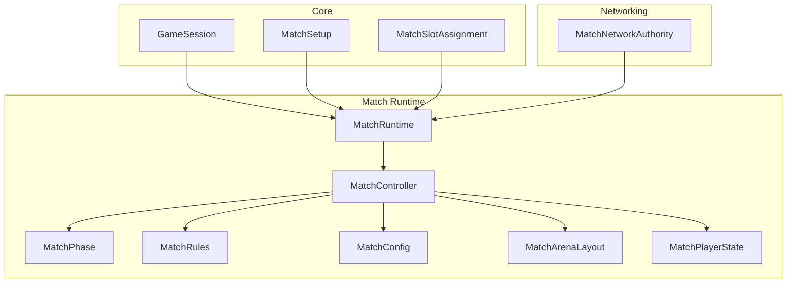
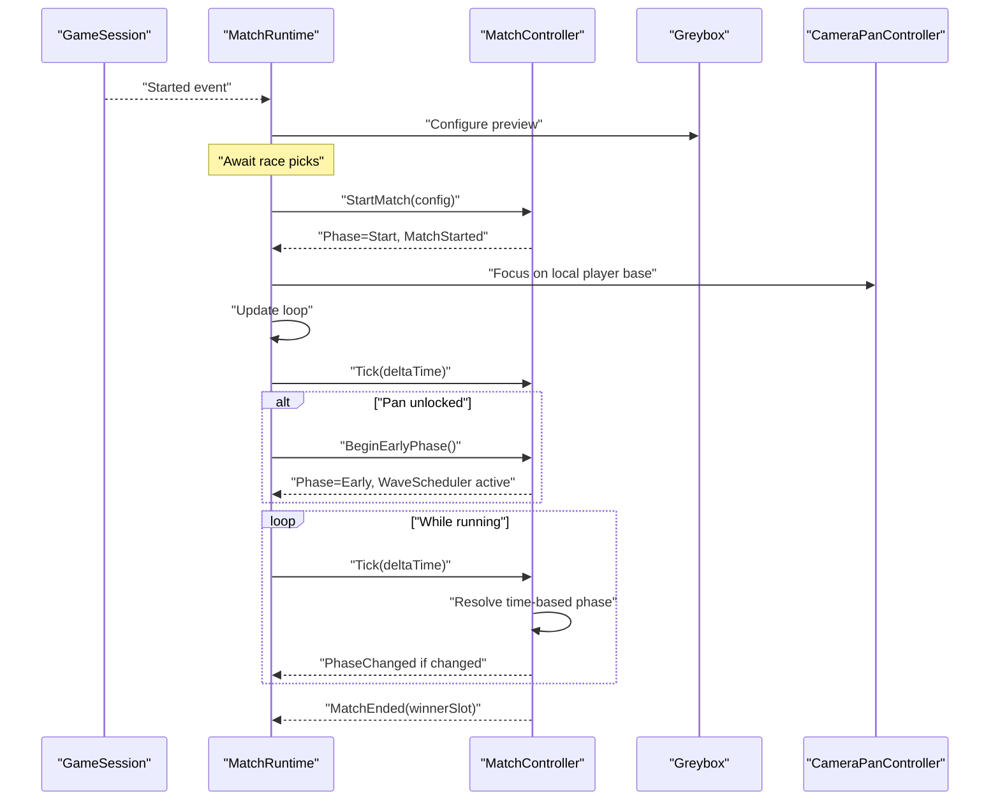
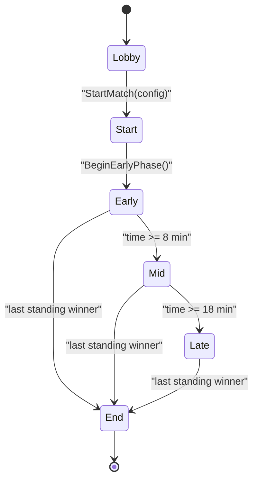
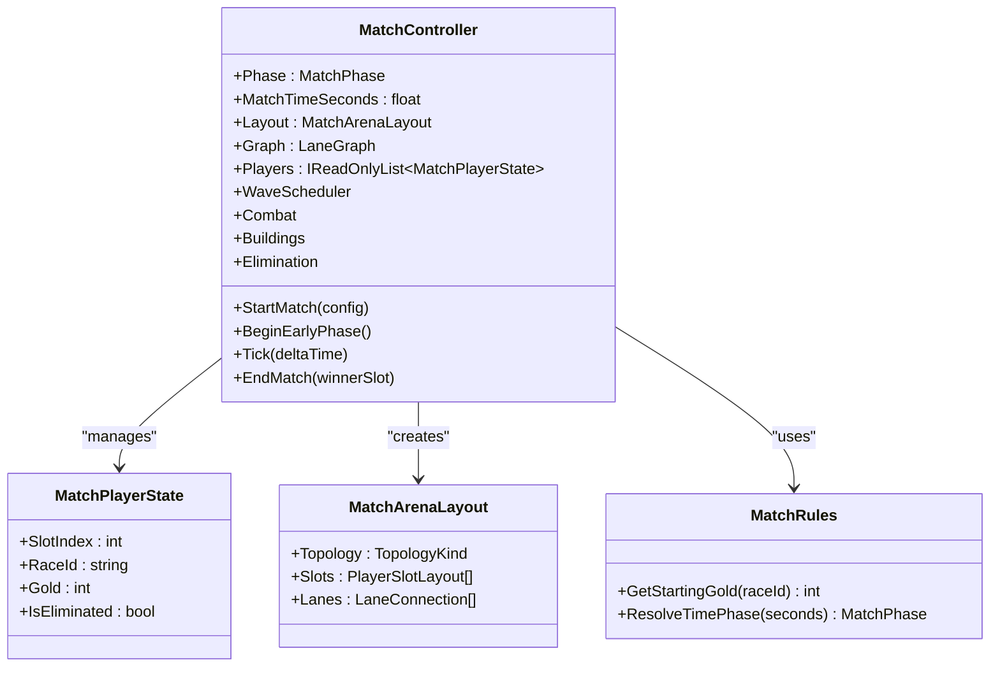
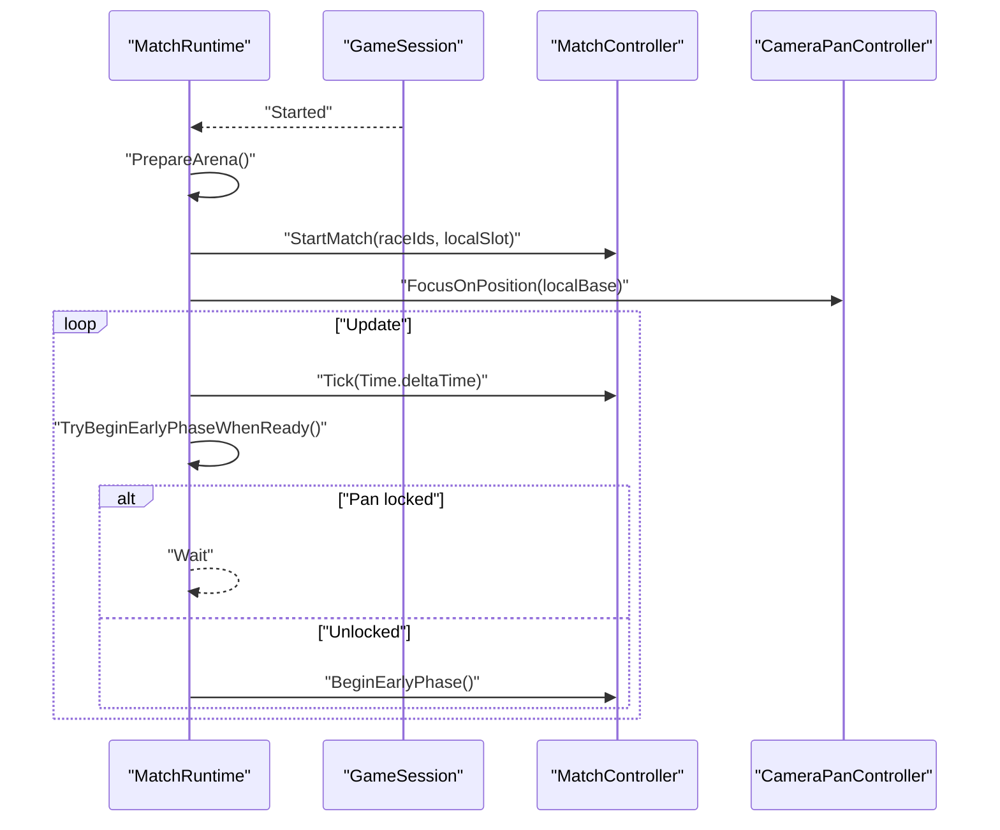
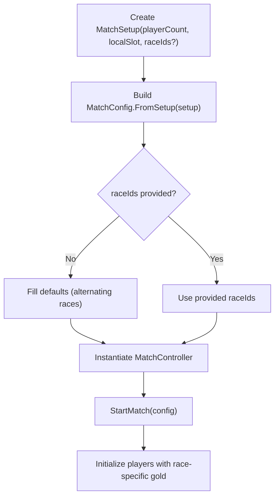
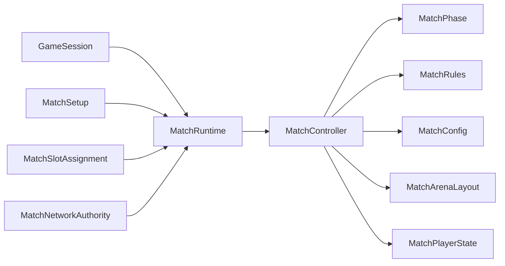

# Match Management

<cite>
**Referenced Files in This Document**
- [MatchController.cs](file://Assets/Game/Scripts/Runtime/Gameplay/Match/MatchController.cs)
- [MatchRuntime.cs](file://Assets/Game/Scripts/Runtime/Gameplay/Match/MatchRuntime.cs)
- [MatchPhase.cs](file://Assets/Game/Scripts/Runtime/Gameplay/Match/MatchPhase.cs)
- [MatchConfig.cs](file://Assets/Game/Scripts/Runtime/Gameplay/Match/MatchConfig.cs)
- [MatchRules.cs](file://Assets/Game/Scripts/Runtime/Gameplay/Match/MatchRules.cs)
- [GameSession.cs](file://Assets/Game/Scripts/Runtime/Core/GameSession.cs)
- [MatchSetup.cs](file://Assets/Game/Scripts/Runtime/Core/MatchSetup.cs)
- [MatchSlotAssignment.cs](file://Assets/Game/Scripts/Runtime/Core/MatchSlotAssignment.cs)
- [MatchArenaLayout.cs](file://Assets/Game/Scripts/Runtime/Gameplay/Match/MatchArenaLayout.cs)
- [MatchPlayerState.cs](file://Assets/Game/Scripts/Runtime/Gameplay/Match/MatchPlayerState.cs)
- [MatchNetworkAuthority.cs](file://Assets/Game/Scripts/Runtime/Gameplay/Networking/MatchNetworkAuthority.cs)
- [MatchControllerTests.cs](file://Assets/Game/Scripts/Tests/MatchControllerTests.cs)
- [GameIds.cs](file://Assets/Game/Scripts/Runtime/Core/GameIds.cs)
</cite>

## Table of Contents
1. [Introduction](#introduction)
2. [Project Structure](#project-structure)
3. [Core Components](#core-components)
4. [Architecture Overview](#architecture-overview)
5. [Detailed Component Analysis](#detailed-component-analysis)
6. [Dependency Analysis](#dependency-analysis)
7. [Performance Considerations](#performance-considerations)
8. [Troubleshooting Guide](#troubleshooting-guide)
9. [Conclusion](#conclusion)
10. [Appendices](#appendices)

## Introduction
This document explains BARAKI’s match management system, focusing on the complete match lifecycle from initialization through phase transitions to completion. It documents:
- MatchController as the central orchestrator for setup, player state, and phase coordination
- MatchRuntime as the scene bridge that prepares the arena and starts the controller after race picks are ready
- MatchPhase enum for game state tracking
- Player registration, race assignment, and match configuration
- Concrete examples showing how matches are created, started, and ended
- The relationship between GameSession and match instances
- Error handling patterns and performance considerations for large matches

## Project Structure
The match management system is implemented across core runtime components under Assets/Game/Scripts/Runtime and related gameplay modules. Key responsibilities:
- Core session and setup: GameSession, MatchSetup, MatchSlotAssignment
- Match orchestration and simulation: MatchController, MatchRuntime, MatchRules, MatchPhase
- Configuration and layout: MatchConfig, MatchArenaLayout, MatchPlayerState
- Networking scaffold: MatchNetworkAuthority (MVP bridge)
- Tests validating behavior: MatchControllerTests

**Diagram sources**
- [GameSession.cs:1-34](file://Assets/Game/Scripts/Runtime/Core/GameSession.cs#L1-L34)
- [MatchSetup.cs:1-29](file://Assets/Game/Scripts/Runtime/Core/MatchSetup.cs#L1-L29)
- [MatchSlotAssignment.cs:1-79](file://Assets/Game/Scripts/Runtime/Core/MatchSlotAssignment.cs#L1-L79)
- [MatchRuntime.cs:1-200](file://Assets/Game/Scripts/Runtime/Gameplay/Match/MatchRuntime.cs#L1-L200)
- [MatchController.cs:1-205](file://Assets/Game/Scripts/Runtime/Gameplay/Match/MatchController.cs#L1-L205)
- [MatchPhase.cs:1-13](file://Assets/Game/Scripts/Runtime/Gameplay/Match/MatchPhase.cs#L1-L13)
- [MatchRules.cs:1-47](file://Assets/Game/Scripts/Runtime/Gameplay/Match/MatchRules.cs#L1-L47)
- [MatchConfig.cs:1-68](file://Assets/Game/Scripts/Runtime/Gameplay/Match/MatchConfig.cs#L1-L68)
- [MatchArenaLayout.cs:1-54](file://Assets/Game/Scripts/Runtime/Gameplay/Match/MatchArenaLayout.cs#L1-L54)
- [MatchPlayerState.cs:1-18](file://Assets/Game/Scripts/Runtime/Gameplay/Match/MatchPlayerState.cs#L1-L18)
- [MatchNetworkAuthority.cs:1-34](file://Assets/Game/Scripts/Runtime/Gameplay/Networking/MatchNetworkAuthority.cs#L1-L34)

**Section sources**
- [GameSession.cs:1-34](file://Assets/Game/Scripts/Runtime/Core/GameSession.cs#L1-L34)
- [MatchSetup.cs:1-29](file://Assets/Game/Scripts/Runtime/Core/MatchSetup.cs#L1-L29)
- [MatchSlotAssignment.cs:1-79](file://Assets/Game/Scripts/Runtime/Core/MatchSlotAssignment.cs#L1-L79)
- [MatchRuntime.cs:1-200](file://Assets/Game/Scripts/Runtime/Gameplay/Match/MatchRuntime.cs#L1-L200)
- [MatchController.cs:1-205](file://Assets/Game/Scripts/Runtime/Gameplay/Match/MatchController.cs#L1-L205)
- [MatchPhase.cs:1-13](file://Assets/Game/Scripts/Runtime/Gameplay/Match/MatchPhase.cs#L1-L13)
- [MatchRules.cs:1-47](file://Assets/Game/Scripts/Runtime/Gameplay/Match/MatchRules.cs#L1-L47)
- [MatchConfig.cs:1-68](file://Assets/Game/Scripts/Runtime/Gameplay/Match/MatchConfig.cs#L1-L68)
- [MatchArenaLayout.cs:1-54](file://Assets/Game/Scripts/Runtime/Gameplay/Match/MatchArenaLayout.cs#L1-L54)
- [MatchPlayerState.cs:1-18](file://Assets/Game/Scripts/Runtime/Gameplay/Match/MatchPlayerState.cs#L1-L18)
- [MatchNetworkAuthority.cs:1-34](file://Assets/Game/Scripts/Runtime/Gameplay/Networking/MatchNetworkAuthority.cs#L1-L34)

## Core Components
- MatchController: Server-authoritative orchestrator managing phases, arena layout, player states, wave scheduling, combat, buildings, elimination, and winner determination. Exposes events for phase changes, start/end, waves, and unit kills.
- MatchRuntime: MonoBehaviour that bridges Unity scene lifecycle with match logic. Prepares arena preview, waits for race pick readiness, constructs MatchConfig, initializes MatchController, and drives Tick until match end.
- MatchPhase: Enumerates Lobby, Start, Early, Mid, Late, End.
- MatchRules: Centralizes timing thresholds and starting gold rules; maps phases to stable IDs.
- MatchConfig: Immutable configuration for a match instance including player count, races, and arena parameters.
- MatchSetup: Handoff data from lobby to match (player count, local slot, optional race IDs).
- MatchSlotAssignment: Shuffles arena slots for participants.
- MatchArenaLayout: Topology, lanes, and per-player slot geometry.
- MatchPlayerState: Per-player slot index, race ID, gold, and elimination flag.
- MatchNetworkAuthority: MVP networking scaffold bridging NGO to MatchRuntime.

**Section sources**
- [MatchController.cs:1-205](file://Assets/Game/Scripts/Runtime/Gameplay/Match/MatchController.cs#L1-L205)
- [MatchRuntime.cs:1-200](file://Assets/Game/Scripts/Runtime/Gameplay/Match/MatchRuntime.cs#L1-L200)
- [MatchPhase.cs:1-13](file://Assets/Game/Scripts/Runtime/Gameplay/Match/MatchPhase.cs#L1-L13)
- [MatchRules.cs:1-47](file://Assets/Game/Scripts/Runtime/Gameplay/Match/MatchRules.cs#L1-L47)
- [MatchConfig.cs:1-68](file://Assets/Game/Scripts/Runtime/Gameplay/Match/MatchConfig.cs#L1-L68)
- [MatchSetup.cs:1-29](file://Assets/Game/Scripts/Runtime/Core/MatchSetup.cs#L1-L29)
- [MatchSlotAssignment.cs:1-79](file://Assets/Game/Scripts/Runtime/Core/MatchSlotAssignment.cs#L1-L79)
- [MatchArenaLayout.cs:1-54](file://Assets/Game/Scripts/Runtime/Gameplay/Match/MatchArenaLayout.cs#L1-L54)
- [MatchPlayerState.cs:1-18](file://Assets/Game/Scripts/Runtime/Gameplay/Match/MatchPlayerState.cs#L1-L18)
- [MatchNetworkAuthority.cs:1-34](file://Assets/Game/Scripts/Runtime/Gameplay/Networking/MatchNetworkAuthority.cs#L1-L34)

## Architecture Overview
High-level flow:
- GameSession signals entry into gameplay and holds ActiveSetup.
- MatchRuntime listens for session start, prepares arena greybox, and awaits race picks.
- When ready, MatchRuntime builds MatchConfig and calls MatchController.StartMatch.
- MatchController initializes layout, graph, players, and subsystems, then enters Start phase.
- MatchRuntime advances to Early when camera pan lock clears; thereafter Tick drives time-based phase transitions.
- Elimination checks can trigger End automatically; manual EndMatch also supported.

**Diagram sources**
- [GameSession.cs:1-34](file://Assets/Game/Scripts/Runtime/Core/GameSession.cs#L1-L34)
- [MatchRuntime.cs:1-200](file://Assets/Game/Scripts/Runtime/Gameplay/Match/MatchRuntime.cs#L1-L200)
- [MatchController.cs:1-205](file://Assets/Game/Scripts/Runtime/Gameplay/Match/MatchController.cs#L1-L205)

## Detailed Component Analysis

### MatchLifecycle and Phase Transitions
- Phases: Lobby → Start → Early → Mid → Late → End
- Start: Arena generated, players initialized with race-specific starting gold, subsystems wired, timer reset, phase set to Start.
- Early: Activated by BeginEarlyPhase; enables wave spawning.
- Mid/Late: Time-driven via MatchRules thresholds.
- End: Triggered by last-standing winner detection or explicit EndMatch.

**Diagram sources**
- [MatchPhase.cs:1-13](file://Assets/Game/Scripts/Runtime/Gameplay/Match/MatchPhase.cs#L1-L13)
- [MatchController.cs:1-205](file://Assets/Game/Scripts/Runtime/Gameplay/Match/MatchController.cs#L1-L205)
- [MatchRules.cs:1-47](file://Assets/Game/Scripts/Runtime/Gameplay/Match/MatchRules.cs#L1-L47)

**Section sources**
- [MatchController.cs:36-149](file://Assets/Game/Scripts/Runtime/Gameplay/Match/MatchController.cs#L36-L149)
- [MatchRules.cs:20-33](file://Assets/Game/Scripts/Runtime/Gameplay/Match/MatchRules.cs#L20-L33)

### MatchController: Orchestration and State
Responsibilities:
- Validate inputs and constraints (player count, race IDs length)
- Generate arena layout and lane graph
- Initialize players with race-appropriate starting gold
- Wire subsystems: wave scheduler, combat, buildings, elimination
- Drive Tick: accumulate match time, tick subsystems, resolve time-based phases
- Manage phase transitions and events
- Determine winner and end match

Key behaviors:
- StartMatch: Setup and validation, layout/graph generation, player creation, subsystem wiring, phase transition to Start
- BeginEarlyPhase: Transition to Early and activate waves
- Tick: Skip Lobby/End/Start; update time and subsystems; auto-transition to Mid/Late based on thresholds
- EndMatch: Set winner, deactivate waves, transition to End, fire MatchEnded
- Events: PhaseChanged, MatchStarted, MatchEnded, WaveFired, UnitKilled

**Diagram sources**
- [MatchController.cs:1-205](file://Assets/Game/Scripts/Runtime/Gameplay/Match/MatchController.cs#L1-L205)
- [MatchPlayerState.cs:1-18](file://Assets/Game/Scripts/Runtime/Gameplay/Match/MatchPlayerState.cs#L1-L18)
- [MatchArenaLayout.cs:1-54](file://Assets/Game/Scripts/Runtime/Gameplay/Match/MatchArenaLayout.cs#L1-L54)
- [MatchRules.cs:1-47](file://Assets/Game/Scripts/Runtime/Gameplay/Match/MatchRules.cs#L1-L47)

**Section sources**
- [MatchController.cs:36-149](file://Assets/Game/Scripts/Runtime/Gameplay/Match/MatchController.cs#L36-L149)
- [MatchController.cs:151-202](file://Assets/Game/Scripts/Runtime/Gameplay/Match/MatchController.cs#L151-L202)

### MatchRuntime: Scene Bridge and Lifecycle Driver
Responsibilities:
- Initialize selection bridge and greybox
- Listen to GameSession.Started to prepare arena preview
- Build MatchConfig from selections and session setup
- Instantiate and configure MatchController
- Focus camera on local player base
- Drive Tick and transition to Early when camera pan lock clears
- Provide accessors for Controller, Selection, PickRegistry

**Diagram sources**
- [MatchRuntime.cs:1-200](file://Assets/Game/Scripts/Runtime/Gameplay/Match/MatchRuntime.cs#L1-L200)
- [GameSession.cs:1-34](file://Assets/Game/Scripts/Runtime/Core/GameSession.cs#L1-L34)

**Section sources**
- [MatchRuntime.cs:32-96](file://Assets/Game/Scripts/Runtime/Gameplay/Match/MatchRuntime.cs#L32-L96)
- [MatchRuntime.cs:98-147](file://Assets/Game/Scripts/Runtime/Gameplay/Match/MatchRuntime.cs#L98-L147)

### Player Registration, Race Assignment, and Match Configuration
- MatchSetup: Defines player count, local slot, and optional race IDs; clamps values to valid ranges.
- MatchSlotAssignment: Generates shuffled arena slot order for fairness; validates counts.
- MatchConfig: Holds immutable match parameters; provides default race assignments and helper FromSetup.
- MatchRules: Determines starting gold per race; maps phases to stable IDs.
- MatchPlayerState: Tracks per-player slot, race, gold, and elimination status.

**Diagram sources**
- [MatchSetup.cs:1-29](file://Assets/Game/Scripts/Runtime/Core/MatchSetup.cs#L1-L29)
- [MatchSlotAssignment.cs:1-79](file://Assets/Game/Scripts/Runtime/Core/MatchSlotAssignment.cs#L1-L79)
- [MatchConfig.cs:1-68](file://Assets/Game/Scripts/Runtime/Gameplay/Match/MatchConfig.cs#L1-L68)
- [MatchRules.cs:13-18](file://Assets/Game/Scripts/Runtime/Gameplay/Match/MatchRules.cs#L13-L18)
- [MatchPlayerState.cs:1-18](file://Assets/Game/Scripts/Runtime/Gameplay/Match/MatchPlayerState.cs#L1-L18)

**Section sources**
- [MatchSetup.cs:12-26](file://Assets/Game/Scripts/Runtime/Core/MatchSetup.cs#L12-L26)
- [MatchSlotAssignment.cs:26-76](file://Assets/Game/Scripts/Runtime/Core/MatchSlotAssignment.cs#L26-L76)
- [MatchConfig.cs:29-65](file://Assets/Game/Scripts/Runtime/Gameplay/Match/MatchConfig.cs#L29-L65)
- [MatchRules.cs:13-18](file://Assets/Game/Scripts/Runtime/Gameplay/Match/MatchRules.cs#L13-L18)
- [MatchPlayerState.cs:5-16](file://Assets/Game/Scripts/Runtime/Gameplay/Match/MatchPlayerState.cs#L5-L16)

### Relationship Between GameSession and Match Instances
- GameSession tracks IsPlaying and ActiveSetup; fires Started once when entering gameplay.
- MatchRuntime subscribes to Started, prepares arena preview, and defers actual match start until race picks are ready.
- Multiple match instances are not concurrent; MatchRuntime ensures single active controller per session.

**Section sources**
- [GameSession.cs:10-32](file://Assets/Game/Scripts/Runtime/Core/GameSession.cs#L10-L32)
- [MatchRuntime.cs:44-65](file://Assets/Game/Scripts/Runtime/Gameplay/Match/MatchRuntime.cs#L44-L65)

### Networking Scaffold (MVP)
- MatchNetworkAuthority is a NetworkBehaviour placeholder bridging NGO to MatchRuntime.
- Comments indicate future server-side Tick gating; currently offline MVP uses local Update.

**Section sources**
- [MatchNetworkAuthority.cs:1-34](file://Assets/Game/Scripts/Runtime/Gameplay/Networking/MatchNetworkAuthority.cs#L1-L34)

## Dependency Analysis

**Diagram sources**
- [GameSession.cs:1-34](file://Assets/Game/Scripts/Runtime/Core/GameSession.cs#L1-L34)
- [MatchSetup.cs:1-29](file://Assets/Game/Scripts/Runtime/Core/MatchSetup.cs#L1-L29)
- [MatchSlotAssignment.cs:1-79](file://Assets/Game/Scripts/Runtime/Core/MatchSlotAssignment.cs#L1-L79)
- [MatchRuntime.cs:1-200](file://Assets/Game/Scripts/Runtime/Gameplay/Match/MatchRuntime.cs#L1-L200)
- [MatchController.cs:1-205](file://Assets/Game/Scripts/Runtime/Gameplay/Match/MatchController.cs#L1-L205)
- [MatchPhase.cs:1-13](file://Assets/Game/Scripts/Runtime/Gameplay/Match/MatchPhase.cs#L1-L13)
- [MatchRules.cs:1-47](file://Assets/Game/Scripts/Runtime/Gameplay/Match/MatchRules.cs#L1-L47)
- [MatchConfig.cs:1-68](file://Assets/Game/Scripts/Runtime/Gameplay/Match/MatchConfig.cs#L1-L68)
- [MatchArenaLayout.cs:1-54](file://Assets/Game/Scripts/Runtime/Gameplay/Match/MatchArenaLayout.cs#L1-L54)
- [MatchPlayerState.cs:1-18](file://Assets/Game/Scripts/Runtime/Gameplay/Match/MatchPlayerState.cs#L1-L18)
- [MatchNetworkAuthority.cs:1-34](file://Assets/Game/Scripts/Runtime/Gameplay/Networking/MatchNetworkAuthority.cs#L1-L34)

**Section sources**
- [MatchController.cs:1-205](file://Assets/Game/Scripts/Runtime/Gameplay/Match/MatchController.cs#L1-L205)
- [MatchRuntime.cs:1-200](file://Assets/Game/Scripts/Runtime/Gameplay/Match/MatchRuntime.cs#L1-L200)

## Performance Considerations
- Avoid negative deltaTime: Tick validates non-negative input to prevent invalid state progression.
- Phase gating: Tick skips Lobby, Start, and End phases to reduce unnecessary work.
- Event-driven updates: Subsystems (waves, combat, buildings) are ticked only during active phases.
- Large matches: With up to 8 players, ensure:
  - Efficient graph traversal for lanes
  - Batched building and unit operations where possible
  - Minimal allocations in hot paths (e.g., avoid frequent list resizing)
  - Use stable identifiers (GameIds) to avoid string hashing overhead in tight loops

[No sources needed since this section provides general guidance]

## Troubleshooting Guide
Common issues and resolutions:
- Starting a match while already running: StartMatch throws if Phase is not Lobby or End. Ensure previous match has ended or reset before restarting.
- Invalid player count or mismatched race IDs: StartMatch validates PlayerCount range and RaceIds length; correct configuration before calling.
- Ending an unstarted match: EndMatch throws if Phase is Lobby; ensure StartMatch was called first.
- Negative deltaTime: Tick throws on negative values; verify caller passes Time.deltaTime or equivalent positive increments.
- Early phase not activating: BeginEarlyPhase requires Phase == Start; ensure camera pan lock is released and TryBeginEarlyPhaseWhenReady runs.

Validation references:
- Input validation and exceptions in StartMatch/Tick/EndMatch
- Phase guards and event firing

**Section sources**
- [MatchController.cs:36-56](file://Assets/Game/Scripts/Runtime/Gameplay/Match/MatchController.cs#L36-L56)
- [MatchController.cs:100-126](file://Assets/Game/Scripts/Runtime/Gameplay/Match/MatchController.cs#L100-L126)
- [MatchController.cs:128-149](file://Assets/Game/Scripts/Runtime/Gameplay/Match/MatchController.cs#L128-L149)
- [MatchRuntime.cs:78-96](file://Assets/Game/Scripts/Runtime/Gameplay/Match/MatchRuntime.cs#L78-L96)

## Conclusion
BARAKI’s match management system centers on MatchController for authoritative orchestration and MatchRuntime for scene integration. The design cleanly separates configuration, layout, simulation, and UI concerns, with robust validation and clear phase transitions. Tests validate topology generation, race-based starting gold, phase activation, and end conditions. The architecture supports future networking expansion via MatchNetworkAuthority while maintaining a solid offline MVP foundation.

[No sources needed since this section summarizes without analyzing specific files]

## Appendices

### API Reference Summary
- MatchController
  - Properties: Phase, MatchTimeSeconds, Layout, Graph, Players, WaveScheduler, Combat, Buildings, Elimination, WinnerSlot, IsRunning
  - Methods: StartMatch(MatchConfig), BeginEarlyPhase(), Tick(float), EndMatch(int)
  - Events: PhaseChanged, MatchStarted, MatchEnded, WaveFired, UnitKilled
- MatchRuntime
  - Properties: Controller, IsMatchStarted, Selection, PickRegistry
  - Methods: StartMatch(IReadOnlyList<string>, int)
- MatchConfig
  - Constructors and static helpers: FromSetup, MvpDefault
  - Methods: GetRaceId(int)
- MatchRules
  - Constants: EarlyEndSeconds, MidEndSeconds, DefaultStartingGold, HumanStartingGoldPenalty
  - Methods: GetStartingGold(string), ResolveTimePhase(float), ToPhaseId(MatchPhase)
- MatchPhase
  - Values: Lobby, Start, Early, Mid, Late, End
- GameSession
  - Properties: IsPlaying, ActiveSetup
  - Methods: Begin(MatchSetup), Reset()
- MatchSetup
  - Properties: PlayerCount, LocalPlayerSlot, RaceIds
  - Static: Default
- MatchSlotAssignment
  - Methods: CreateOffline, CreateForLocalParticipants, CreateShuffledSlotOrder
- MatchArenaLayout
  - Types: TopologyKind, PlayerSlotLayout, LaneConnection, MatchArenaLayout
- MatchPlayerState
  - Properties: SlotIndex, RaceId, Gold, IsEliminated
- MatchNetworkAuthority
  - Purpose: MVP bridge between NGO and MatchRuntime

**Section sources**
- [MatchController.cs:1-205](file://Assets/Game/Scripts/Runtime/Gameplay/Match/MatchController.cs#L1-L205)
- [MatchRuntime.cs:1-200](file://Assets/Game/Scripts/Runtime/Gameplay/Match/MatchRuntime.cs#L1-L200)
- [MatchConfig.cs:1-68](file://Assets/Game/Scripts/Runtime/Gameplay/Match/MatchConfig.cs#L1-L68)
- [MatchRules.cs:1-47](file://Assets/Game/Scripts/Runtime/Gameplay/Match/MatchRules.cs#L1-L47)
- [MatchPhase.cs:1-13](file://Assets/Game/Scripts/Runtime/Gameplay/Match/MatchPhase.cs#L1-L13)
- [GameSession.cs:1-34](file://Assets/Game/Scripts/Runtime/Core/GameSession.cs#L1-L34)
- [MatchSetup.cs:1-29](file://Assets/Game/Scripts/Runtime/Core/MatchSetup.cs#L1-L29)
- [MatchSlotAssignment.cs:1-79](file://Assets/Game/Scripts/Runtime/Core/MatchSlotAssignment.cs#L1-L79)
- [MatchArenaLayout.cs:1-54](file://Assets/Game/Scripts/Runtime/Gameplay/Match/MatchArenaLayout.cs#L1-L54)
- [MatchPlayerState.cs:1-18](file://Assets/Game/Scripts/Runtime/Gameplay/Match/MatchPlayerState.cs#L1-L18)
- [MatchNetworkAuthority.cs:1-34](file://Assets/Game/Scripts/Runtime/Gameplay/Networking/MatchNetworkAuthority.cs#L1-L34)

### Example Workflows

#### Creating and Starting a Match
- Prepare MatchSetup with player count and optional race IDs
- Build MatchConfig using FromSetup or MvpDefault
- Call MatchRuntime.StartMatch with race IDs and local player slot
- Verify Phase transitions to Start and events fired

References:
- [MatchControllerTests.cs:10-21](file://Assets/Game/Scripts/Tests/MatchControllerTests.cs#L10-L21)
- [MatchControllerTests.cs:24-35](file://Assets/Game/Scripts/Tests/MatchControllerTests.cs#L24-L35)
- [MatchRuntime.cs:98-147](file://Assets/Game/Scripts/Runtime/Gameplay/Match/MatchRuntime.cs#L98-L147)

#### Advancing to Early Phase
- After Start, wait for camera pan unlock
- MatchRuntime triggers BeginEarlyPhase
- Waves become active; time-based phases continue

References:
- [MatchControllerTests.cs:38-51](file://Assets/Game/Scripts/Tests/MatchControllerTests.cs#L38-L51)
- [MatchRuntime.cs:78-96](file://Assets/Game/Scripts/Runtime/Gameplay/Match/MatchRuntime.cs#L78-L96)

#### Time-Based Phase Transitions
- Tick accumulates match time
- ResolveTimePhase transitions Early → Mid → Late at thresholds

References:
- [MatchControllerTests.cs:54-68](file://Assets/Game/Scripts/Tests/MatchControllerTests.cs#L54-L68)
- [MatchRules.cs:20-33](file://Assets/Game/Scripts/Runtime/Gameplay/Match/MatchRules.cs#L20-L33)

#### Ending a Match
- Manual EndMatch sets winner and transitions to End
- Automatic ending via elimination detection

References:
- [MatchControllerTests.cs:70-91](file://Assets/Game/Scripts/Tests/MatchControllerTests.cs#L70-L91)
- [MatchController.cs:166-180](file://Assets/Game/Scripts/Runtime/Gameplay/Match/MatchController.cs#L166-L180)