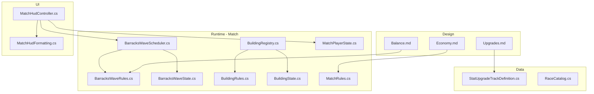
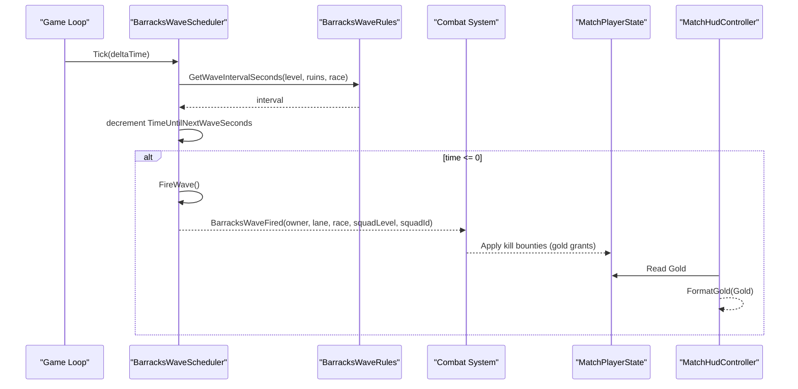
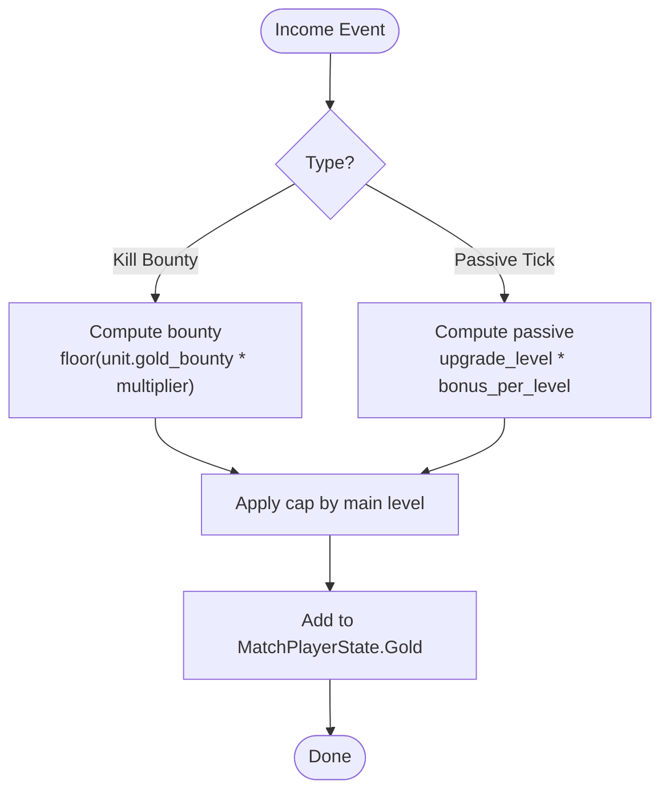
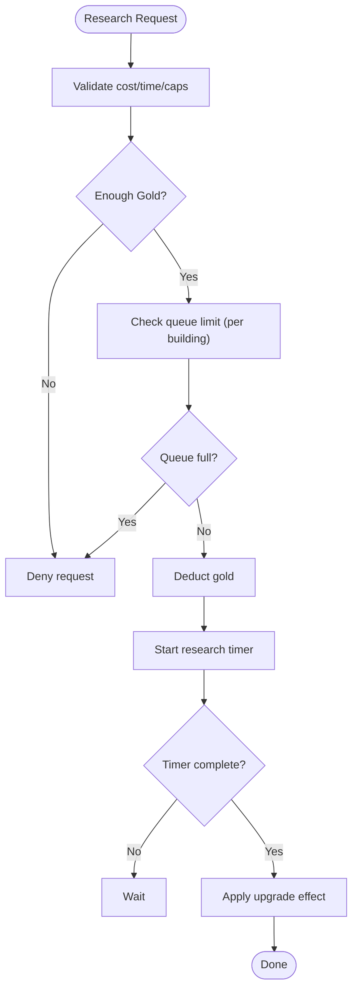
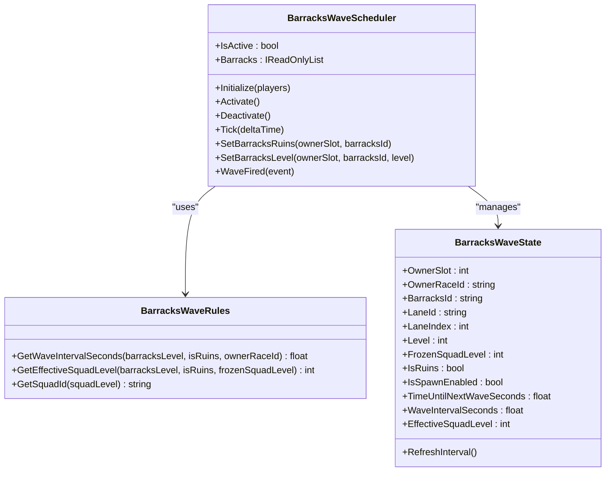
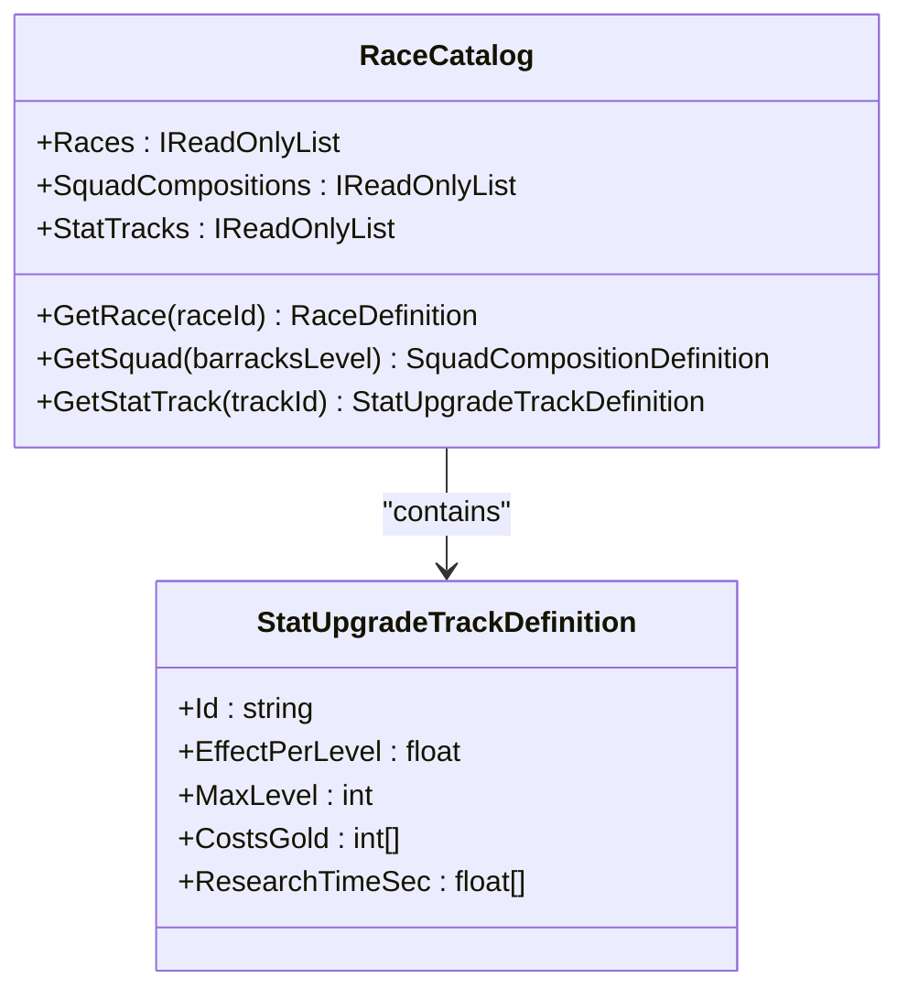
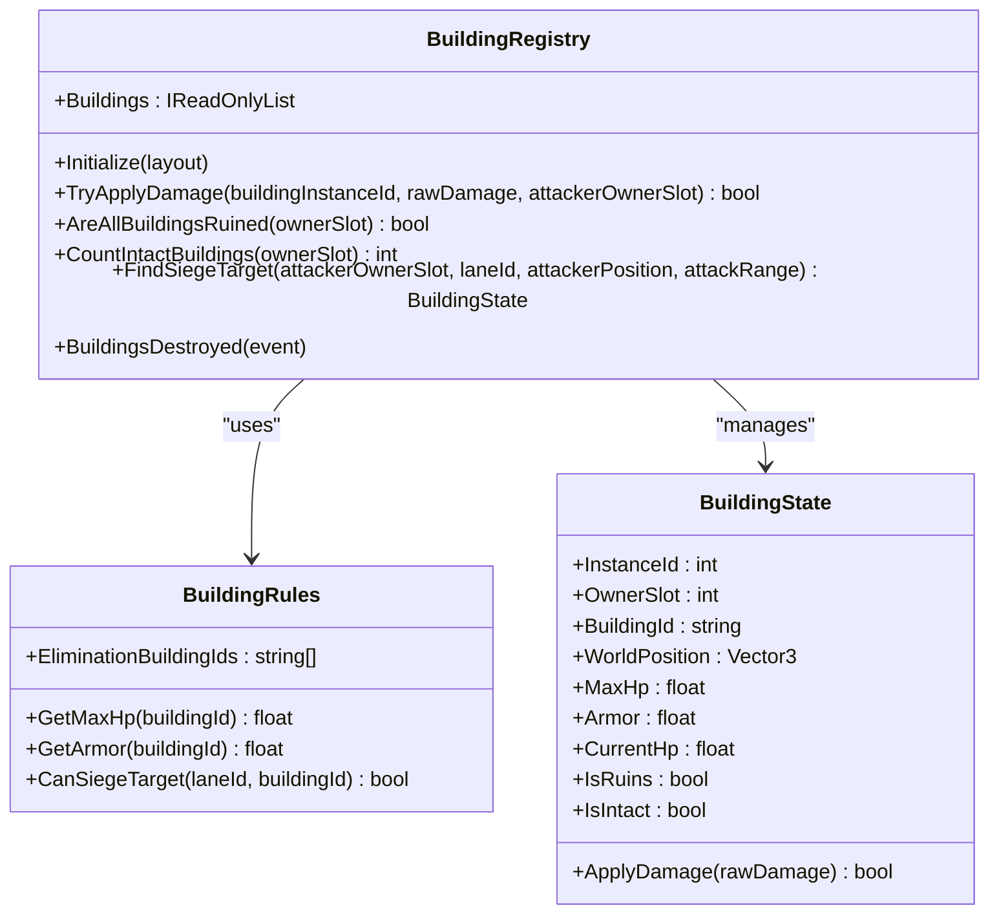
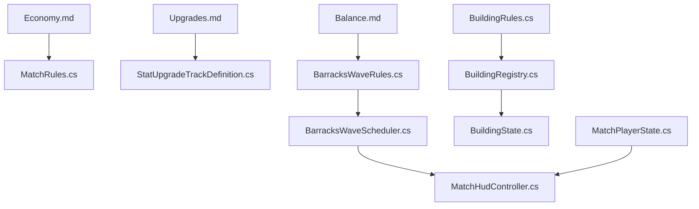

# Resource Economy

<cite>
**Referenced Files in This Document**
- [Economy.md](file://Assets/Game/GameDesign/Economy.md)
- [Upgrades.md](file://Assets/Game/GameDesign/Upgrades.md)
- [Balance.md](file://Assets/Game/GameDesign/Balance.md)
- [BarracksWaveScheduler.cs](file://Assets/Game/Scripts/Runtime/Gameplay/Match/BarracksWaveScheduler.cs)
- [BarracksWaveRules.cs](file://Assets/Game/Scripts/Runtime/Gameplay/Match/BarracksWaveRules.cs)
- [BarracksWaveState.cs](file://Assets/Game/Scripts/Runtime/Gameplay/Match/BarracksWaveState.cs)
- [BuildingRules.cs](file://Assets/Game/Scripts/Runtime/Gameplay/Match/BuildingRules.cs)
- [BuildingRegistry.cs](file://Assets/Game/Scripts/Runtime/Gameplay/Match/BuildingRegistry.cs)
- [BuildingState.cs](file://Assets/Game/Scripts/Runtime/Gameplay/Match/BuildingState.cs)
- [StatUpgradeTrackDefinition.cs](file://Assets/Game/Scripts/Runtime/Gameplay/Data/StatUpgradeTrackDefinition.cs)
- [RaceCatalog.cs](file://Assets/Game/Scripts/Runtime/Gameplay/Data/RaceCatalog.cs)
- [MatchPlayerState.cs](file://Assets/Game/Scripts/Runtime/Gameplay/Match/MatchPlayerState.cs)
- [MatchRules.cs](file://Assets/Game/Scripts/Runtime/Gameplay/Match/MatchRules.cs)
- [MatchHudController.cs](file://Assets/Game/UI/Runtime/Controllers/MatchHudController.cs)
- [MatchHudFormatting.cs](file://Assets/Game/UI/Runtime/MatchHudFormatting.cs)
</cite>

## Table of Contents
1. [Introduction](#introduction)
2. [Project Structure](#project-structure)
3. [Core Components](#core-components)
4. [Architecture Overview](#architecture-overview)
5. [Detailed Component Analysis](#detailed-component-analysis)
6. [Dependency Analysis](#dependency-analysis)
7. [Performance Considerations](#performance-considerations)
8. [Troubleshooting Guide](#troubleshooting-guide)
9. [Conclusion](#conclusion)
10. [Appendices](#appendices)

## Introduction
This document explains BARAKI’s resource economy and progression systems with a focus on gold income generation, spending mechanics, and upgrade research processes. It also documents the BarracksWaveScheduler for unit production timing, BarracksWaveRules for spawn configurations, StatUpgradeTrackDefinition for upgrade paths, BuildingRules for building capabilities, and BuildingState for persistent building data. Concrete examples are provided for economic balancing, upgrade tree design, and resource flow optimization, along with configuration methods for custom economies and scaling considerations across player counts.

## Project Structure
The economy and progression systems span design documents and runtime code:
- Design docs define rules, costs, and formulas (gold sources, passive income, upgrade trees).
- Runtime components implement wave scheduling, building state, and upgrade definitions.
- UI reads player gold and displays timers and gold values.

**Diagram sources**
- [Economy.md:1-123](file://Assets/Game/GameDesign/Economy.md#L1-L123)
- [Upgrades.md:1-211](file://Assets/Game/GameDesign/Upgrades.md#L1-L211)
- [Balance.md:1-65](file://Assets/Game/GameDesign/Balance.md#L1-L65)
- [BarracksWaveScheduler.cs:1-159](file://Assets/Game/Scripts/Runtime/Gameplay/Match/BarracksWaveScheduler.cs#L1-L159)
- [BarracksWaveRules.cs:1-46](file://Assets/Game/Scripts/Runtime/Gameplay/Match/BarracksWaveRules.cs#L1-L46)
- [BarracksWaveState.cs:1-47](file://Assets/Game/Scripts/Runtime/Gameplay/Match/BarracksWaveState.cs#L1-L47)
- [BuildingRules.cs:1-38](file://Assets/Game/Scripts/Runtime/Gameplay/Match/BuildingRules.cs#L1-L38)
- [BuildingRegistry.cs:1-148](file://Assets/Game/Scripts/Runtime/Gameplay/Match/BuildingRegistry.cs#L1-L148)
- [BuildingState.cs:1-47](file://Assets/Game/Scripts/Runtime/Gameplay/Match/BuildingState.cs#L1-L47)
- [StatUpgradeTrackDefinition.cs:1-20](file://Assets/Game/Scripts/Runtime/Gameplay/Data/StatUpgradeTrackDefinition.cs#L1-L20)
- [RaceCatalog.cs:1-28](file://Assets/Game/Scripts/Runtime/Gameplay/Data/RaceCatalog.cs#L1-L28)
- [MatchPlayerState.cs:1-18](file://Assets/Game/Scripts/Runtime/Gameplay/Match/MatchPlayerState.cs#L1-L18)
- [MatchRules.cs:1-46](file://Assets/Game/Scripts/Runtime/Gameplay/Match/MatchRules.cs#L1-L46)
- [MatchHudController.cs:113-192](file://Assets/Game/UI/Runtime/Controllers/MatchHudController.cs#L113-L192)
- [MatchHudFormatting.cs:1-47](file://Assets/Game/UI/Runtime/MatchHudFormatting.cs#L1-L47)

**Section sources**
- [Economy.md:1-123](file://Assets/Game/GameDesign/Economy.md#L1-L123)
- [Upgrades.md:1-211](file://Assets/Game/GameDesign/Upgrades.md#L1-L211)
- [Balance.md:1-65](file://Assets/Game/GameDesign/Balance.md#L1-L65)
- [BarracksWaveScheduler.cs:1-159](file://Assets/Game/Scripts/Runtime/Gameplay/Match/BarracksWaveScheduler.cs#L1-L159)
- [BarracksWaveRules.cs:1-46](file://Assets/Game/Scripts/Runtime/Gameplay/Match/BarracksWaveRules.cs#L1-L46)
- [BarracksWaveState.cs:1-47](file://Assets/Game/Scripts/Runtime/Gameplay/Match/BarracksWaveState.cs#L1-L47)
- [BuildingRules.cs:1-38](file://Assets/Game/Scripts/Runtime/Gameplay/Match/BuildingRules.cs#L1-L38)
- [BuildingRegistry.cs:1-148](file://Assets/Game/Scripts/Runtime/Gameplay/Match/BuildingRegistry.cs#L1-L148)
- [BuildingState.cs:1-47](file://Assets/Game/Scripts/Runtime/Gameplay/Match/BuildingState.cs#L1-L47)
- [StatUpgradeTrackDefinition.cs:1-20](file://Assets/Game/Scripts/Runtime/Gameplay/Data/StatUpgradeTrackDefinition.cs#L1-L20)
- [RaceCatalog.cs:1-28](file://Assets/Game/Scripts/Runtime/Gameplay/Data/RaceCatalog.cs#L1-L28)
- [MatchPlayerState.cs:1-18](file://Assets/Game/Scripts/Runtime/Gameplay/Match/MatchPlayerState.cs#L1-L18)
- [MatchRules.cs:1-46](file://Assets/Game/Scripts/Runtime/Gameplay/Match/MatchRules.cs#L1-L46)
- [MatchHudController.cs:113-192](file://Assets/Game/UI/Runtime/Controllers/MatchHudController.cs#L113-L192)
- [MatchHudFormatting.cs:1-47](file://Assets/Game/UI/Runtime/MatchHudFormatting.cs#L1-L47)

## Core Components
- Gold income sources: kill bounty and passive gold from main building upgrades.
- Spending rules: no negative balance, one active research per building type, full refund on cancel.
- Upgrade tracks: stat upgrades via StatUpgradeTrackDefinition; main building levels; barracks levels; tower upgrades.
- Wave scheduling: per-barracks timers using BarracksWaveScheduler and BarracksWaveRules.
- Buildings: BuildingRules defines HP/armor/siege targeting; BuildingRegistry manages instances; BuildingState holds persistent data.

Key implementation anchors:
- Player gold storage: MatchPlayerState.Gold
- Passive gold tick interval and caps: Economy.md and Upgrades.md
- Barracks wave intervals and squad selection: BarracksWaveRules
- Research queue constraints: Upgrades.md (queue_per_building = 1)
- Building capabilities and siege rules: BuildingRules
- Building persistence and damage application: BuildingRegistry + BuildingState

**Section sources**
- [Economy.md:24-75](file://Assets/Game/GameDesign/Economy.md#L24-L75)
- [Economy.md:77-106](file://Assets/Game/GameDesign/Economy.md#L77-L106)
- [Upgrades.md:11-211](file://Assets/Game/GameDesign/Upgrades.md#L11-L211)
- [BarracksWaveRules.cs:1-46](file://Assets/Game/Scripts/Runtime/Gameplay/Match/BarracksWaveRules.cs#L1-L46)
- [BarracksWaveScheduler.cs:1-159](file://Assets/Game/Scripts/Runtime/Gameplay/Match/BarracksWaveScheduler.cs#L1-L159)
- [BuildingRules.cs:1-38](file://Assets/Game/Scripts/Runtime/Gameplay/Match/BuildingRules.cs#L1-L38)
- [BuildingRegistry.cs:1-148](file://Assets/Game/Scripts/Runtime/Gameplay/Match/BuildingRegistry.cs#L1-L148)
- [BuildingState.cs:1-47](file://Assets/Game/Scripts/Runtime/Gameplay/Match/BuildingState.cs#L1-L47)
- [StatUpgradeTrackDefinition.cs:1-20](file://Assets/Game/Scripts/Runtime/Gameplay/Data/StatUpgradeTrackDefinition.cs#L1-L20)
- [MatchPlayerState.cs:1-18](file://Assets/Game/Scripts/Runtime/Gameplay/Match/MatchPlayerState.cs#L1-L18)

## Architecture Overview
The economy and progression system integrates design rules with runtime logic:
- Design documents specify constants, formulas, and constraints.
- Runtime classes enforce these rules during match execution.
- UI surfaces gold and timers to players.

**Diagram sources**
- [BarracksWaveScheduler.cs:69-159](file://Assets/Game/Scripts/Runtime/Gameplay/Match/BarracksWaveScheduler.cs#L69-L159)
- [BarracksWaveRules.cs:12-24](file://Assets/Game/Scripts/Runtime/Gameplay/Match/BarracksWaveRules.cs#L12-L24)
- [MatchPlayerState.cs:12-14](file://Assets/Game/Scripts/Runtime/Gameplay/Match/MatchPlayerState.cs#L12-L14)
- [MatchHudController.cs:119-138](file://Assets/Game/UI/Runtime/Controllers/MatchHudController.cs#L119-L138)
- [MatchHudFormatting.cs:37-41](file://Assets/Game/UI/Runtime/MatchHudFormatting.cs#L37-L41)

## Detailed Component Analysis

### Gold Income Generation
- Kill bounty: awarded to the owner of the unit that deals the killing blow; hero kills multiply bounty; building kills grant no gold in MVP.
- Passive gold: every 30 seconds, each level of the passive gold upgrade adds a fixed amount; capped by main building level × 3; max upgrade level is 9.
- Starting gold: base starting amount with race modifiers (e.g., Human penalty reduces initial gold).

Implementation anchors:
- Player wallet: MatchPlayerState.Gold
- Starting gold calculation: MatchRules.GetStartingGold
- Passive gold formula and caps: Economy.md and Upgrades.md

**Diagram sources**
- [Economy.md:24-75](file://Assets/Game/GameDesign/Economy.md#L24-L75)
- [Upgrades.md:117-131](file://Assets/Game/GameDesign/Upgrades.md#L117-L131)
- [MatchPlayerState.cs:12-14](file://Assets/Game/Scripts/Runtime/Gameplay/Match/MatchPlayerState.cs#L12-L14)
- [MatchRules.cs:13-18](file://Assets/Game/Scripts/Runtime/Gameplay/Match/MatchRules.cs#L13-L18)

**Section sources**
- [Economy.md:24-75](file://Assets/Game/GameDesign/Economy.md#L24-L75)
- [Upgrades.md:117-131](file://Assets/Game/GameDesign/Upgrades.md#L117-L131)
- [MatchPlayerState.cs:12-14](file://Assets/Game/Scripts/Runtime/Gameplay/Match/MatchPlayerState.cs#L12-L14)
- [MatchRules.cs:13-18](file://Assets/Game/Scripts/Runtime/Gameplay/Match/MatchRules.cs#L13-L18)

### Spending Mechanics and Research Queue
- Spending rules: cannot go negative; one active research per building type; full refund on cancel.
- Research queue constraints: queue_per_building = 1; cancel_refund = 1.0.
- Main building upgrades: level increases gates for stat levels, heroes, and magic slots.
- Barracks upgrades: per-barracks instance, unlock higher squads and increase spawn speed.
- Tower upgrades: per-tower, race-unique tracks, parallel up to number of towers.

Configuration anchors:
- Costs and times: Economy.md and Upgrades.md tables
- Queue rules: Upgrades.md RESEARCH_RULES_MVP
- Gates and caps: Upgrades.md MAIN_BUILDING_GATES

**Diagram sources**
- [Economy.md:93-97](file://Assets/Game/GameDesign/Economy.md#L93-L97)
- [Upgrades.md:72-79](file://Assets/Game/GameDesign/Upgrades.md#L72-L79)
- [Upgrades.md:22-50](file://Assets/Game/GameDesign/Upgrades.md#L22-L50)
- [Upgrades.md:52-65](file://Assets/Game/GameDesign/Upgrades.md#L52-L65)
- [Upgrades.md:161-178](file://Assets/Game/GameDesign/Upgrades.md#L161-L178)

**Section sources**
- [Economy.md:93-97](file://Assets/Game/GameDesign/Economy.md#L93-L97)
- [Upgrades.md:72-79](file://Assets/Game/GameDesign/Upgrades.md#L72-L79)
- [Upgrades.md:22-50](file://Assets/Game/GameDesign/Upgrades.md#L22-L50)
- [Upgrades.md:52-65](file://Assets/Game/GameDesign/Upgrades.md#L52-L65)
- [Upgrades.md:161-178](file://Assets/Game/GameDesign/Upgrades.md#L161-L178)

### BarracksWaveScheduler and BarracksWaveRules
- Per-barracks independent timers; scheduler ticks each barracks and fires waves when ready.
- Wave interval formula uses base interval and spawn speed per barracks level; ruins revert to base interval.
- Race-specific multipliers (e.g., Bug brood surge) adjust intervals.
- Squad ID mapping based on effective squad level (ruins use frozen squad level).

**Diagram sources**
- [BarracksWaveScheduler.cs:1-159](file://Assets/Game/Scripts/Runtime/Gameplay/Match/BarracksWaveScheduler.cs#L1-L159)
- [BarracksWaveRules.cs:1-46](file://Assets/Game/Scripts/Runtime/Gameplay/Match/BarracksWaveRules.cs#L1-L46)
- [BarracksWaveState.cs:1-47](file://Assets/Game/Scripts/Runtime/Gameplay/Match/BarracksWaveState.cs#L1-L47)

**Section sources**
- [BarracksWaveScheduler.cs:1-159](file://Assets/Game/Scripts/Runtime/Gameplay/Match/BarracksWaveScheduler.cs#L1-L159)
- [BarracksWaveRules.cs:1-46](file://Assets/Game/Scripts/Runtime/Gameplay/Match/BarracksWaveRules.cs#L1-L46)
- [BarracksWaveState.cs:1-47](file://Assets/Game/Scripts/Runtime/Gameplay/Match/BarracksWaveState.cs#L1-L47)

### StatUpgradeTrackDefinition and Upgrade Paths
- StatUpgradeTrackDefinition stores track id, effect per level, max level, costs, and research times.
- RaceCatalog provides access to races, squad compositions, and stat tracks.
- Tracks include melee/ranged damage, armor, and caster heal effects; costs and times defined in design docs.

**Diagram sources**
- [StatUpgradeTrackDefinition.cs:1-20](file://Assets/Game/Scripts/Runtime/Gameplay/Data/StatUpgradeTrackDefinition.cs#L1-L20)
- [RaceCatalog.cs:1-28](file://Assets/Game/Scripts/Runtime/Gameplay/Data/RaceCatalog.cs#L1-L28)

**Section sources**
- [StatUpgradeTrackDefinition.cs:1-20](file://Assets/Game/Scripts/Runtime/Gameplay/Data/StatUpgradeTrackDefinition.cs#L1-L20)
- [RaceCatalog.cs:1-28](file://Assets/Game/Scripts/Runtime/Gameplay/Data/RaceCatalog.cs#L1-L28)
- [Upgrades.md:81-115](file://Assets/Game/GameDesign/Upgrades.md#L81-L115)

### BuildingRules and BuildingState
- BuildingRules defines elimination buildings, HP, armor, and siege targeting rules per lane.
- BuildingRegistry initializes building instances per slot, applies damage, and emits destruction events.
- BuildingState persists current HP, armor, and ruin status.

**Diagram sources**
- [BuildingRules.cs:1-38](file://Assets/Game/Scripts/Runtime/Gameplay/Match/BuildingRules.cs#L1-L38)
- [BuildingRegistry.cs:1-148](file://Assets/Game/Scripts/Runtime/Gameplay/Match/BuildingRegistry.cs#L1-L148)
- [BuildingState.cs:1-47](file://Assets/Game/Scripts/Runtime/Gameplay/Match/BuildingState.cs#L1-L47)

**Section sources**
- [BuildingRules.cs:1-38](file://Assets/Game/Scripts/Runtime/Gameplay/Match/BuildingRules.cs#L1-L38)
- [BuildingRegistry.cs:1-148](file://Assets/Game/Scripts/Runtime/Gameplay/Match/BuildingRegistry.cs#L1-L148)
- [BuildingState.cs:1-47](file://Assets/Game/Scripts/Runtime/Gameplay/Match/BuildingState.cs#L1-L47)

### Economic Balancing Examples
- Early game pressure vs late-game scaling:
  - Starting gold sets early options; passive gold scales with main level and upgrade levels.
  - Example: With passive gold at level 3 (cap), each tick yields 75g; over 5 minutes, this contributes significantly to mid-game power spikes.
- Cost-to-time ratios:
  - Stat upgrades have increasing costs and times; prioritize armor or damage depending on enemy composition.
  - Barracks upgrades reduce spawn intervals, accelerating unit pressure.
- Trade-offs:
  - Investing in passive gold vs immediate hero hire/spell unlocks.
  - Defending towers vs pushing lanes for kill bounties.

References:
- Starting gold and passive gold caps: Economy.md and Upgrades.md
- Stat upgrade costs/times: Upgrades.md
- Barracks upgrade costs/times: Upgrades.md and Balance.md

**Section sources**
- [Economy.md:64-75](file://Assets/Game/GameDesign/Economy.md#L64-L75)
- [Economy.md:43-62](file://Assets/Game/GameDesign/Economy.md#L43-L62)
- [Upgrades.md:100-115](file://Assets/Game/GameDesign/Upgrades.md#L100-L115)
- [Upgrades.md:52-65](file://Assets/Game/GameDesign/Upgrades.md#L52-L65)
- [Balance.md:35-65](file://Assets/Game/GameDesign/Balance.md#L35-L65)

### Upgrade Tree Design
- Main building level gates:
  - Max stat levels, hero hires, and magic slots scale with main level.
- Stat tracks:
  - Global per race, capped by main level × 3; absolute cap 9.
- Tower upgrades:
  - Race-unique tracks per tower; parallel research across towers.

Configuration anchors:
- MAIN_BUILDING_GATES: Upgrades.md
- Stat tracks and caps: Upgrades.md
- Tower upgrade structure: Upgrades.md

**Section sources**
- [Upgrades.md:22-50](file://Assets/Game/GameDesign/Upgrades.md#L22-L50)
- [Upgrades.md:67-98](file://Assets/Game/GameDesign/Upgrades.md#L67-L98)
- [Upgrades.md:161-178](file://Assets/Game/GameDesign/Upgrades.md#L161-L178)

### Resource Flow Optimization
- Optimize passive gold investment:
  - Prioritize passive gold upgrades early to smooth income and fund later investments.
- Balance kill pressure and defense:
  - Use kill bounties to fund timely barracks upgrades; maintain tower integrity to sustain income.
- Efficient research queue usage:
  - Keep one active research per building type; plan transitions between stat tracks to avoid idle time.

Practical tips:
- Monitor HUD gold and timers to align upgrades with wave cadence.
- Adjust strategy based on opponent aggression and lane control.

**Section sources**
- [Economy.md:99-106](file://Assets/Game/GameDesign/Economy.md#L99-L106)
- [MatchHudController.cs:119-138](file://Assets/Game/UI/Runtime/Controllers/MatchHudController.cs#L119-L138)
- [MatchHudFormatting.cs:37-41](file://Assets/Game/UI/Runtime/MatchHudFormatting.cs#L37-L41)

## Dependency Analysis
The economy and progression system depends on clear separation between design rules and runtime enforcement:
- Design docs provide authoritative constants and formulas.
- Runtime classes implement logic consistent with those rules.
- UI consumes player state and scheduler output for feedback.

**Diagram sources**
- [Economy.md:1-123](file://Assets/Game/GameDesign/Economy.md#L1-L123)
- [Upgrades.md:1-211](file://Assets/Game/GameDesign/Upgrades.md#L1-L211)
- [Balance.md:1-65](file://Assets/Game/GameDesign/Balance.md#L1-L65)
- [MatchRules.cs:1-46](file://Assets/Game/Scripts/Runtime/Gameplay/Match/MatchRules.cs#L1-L46)
- [StatUpgradeTrackDefinition.cs:1-20](file://Assets/Game/Scripts/Runtime/Gameplay/Data/StatUpgradeTrackDefinition.cs#L1-L20)
- [BarracksWaveRules.cs:1-46](file://Assets/Game/Scripts/Runtime/Gameplay/Match/BarracksWaveRules.cs#L1-L46)
- [BarracksWaveScheduler.cs:1-159](file://Assets/Game/Scripts/Runtime/Gameplay/Match/BarracksWaveScheduler.cs#L1-L159)
- [MatchHudController.cs:113-192](file://Assets/Game/UI/Runtime/Controllers/MatchHudController.cs#L113-L192)
- [BuildingRules.cs:1-38](file://Assets/Game/Scripts/Runtime/Gameplay/Match/BuildingRules.cs#L1-L38)
- [BuildingRegistry.cs:1-148](file://Assets/Game/Scripts/Runtime/Gameplay/Match/BuildingRegistry.cs#L1-L148)
- [BuildingState.cs:1-47](file://Assets/Game/Scripts/Runtime/Gameplay/Match/BuildingState.cs#L1-L47)
- [MatchPlayerState.cs:1-18](file://Assets/Game/Scripts/Runtime/Gameplay/Match/MatchPlayerState.cs#L1-L18)

**Section sources**
- [Economy.md:1-123](file://Assets/Game/GameDesign/Economy.md#L1-L123)
- [Upgrades.md:1-211](file://Assets/Game/GameDesign/Upgrades.md#L1-L211)
- [Balance.md:1-65](file://Assets/Game/GameDesign/Balance.md#L1-L65)
- [MatchRules.cs:1-46](file://Assets/Game/Scripts/Runtime/Gameplay/Match/MatchRules.cs#L1-L46)
- [StatUpgradeTrackDefinition.cs:1-20](file://Assets/Game/Scripts/Runtime/Gameplay/Data/StatUpgradeTrackDefinition.cs#L1-L20)
- [BarracksWaveRules.cs:1-46](file://Assets/Game/Scripts/Runtime/Gameplay/Match/BarracksWaveRules.cs#L1-L46)
- [BarracksWaveScheduler.cs:1-159](file://Assets/Game/Scripts/Runtime/Gameplay/Match/BarracksWaveScheduler.cs#L1-L159)
- [MatchHudController.cs:113-192](file://Assets/Game/UI/Runtime/Controllers/MatchHudController.cs#L113-L192)
- [BuildingRules.cs:1-38](file://Assets/Game/Scripts/Runtime/Gameplay/Match/BuildingRules.cs#L1-L38)
- [BuildingRegistry.cs:1-148](file://Assets/Game/Scripts/Runtime/Gameplay/Match/BuildingRegistry.cs#L1-L148)
- [BuildingState.cs:1-47](file://Assets/Game/Scripts/Runtime/Gameplay/Match/BuildingState.cs#L1-L47)
- [MatchPlayerState.cs:1-18](file://Assets/Game/Scripts/Runtime/Gameplay/Match/MatchPlayerState.cs#L1-L18)

## Performance Considerations
- Per-barracks timers:
  - Independent timers scale linearly with player count and barracks per player; ensure efficient iteration in scheduler tick.
- Passive gold ticks:
  - Fixed interval reduces overhead; compute increments once per tick and apply to player wallets.
- Building registry operations:
  - Damage application and siege target selection should be optimized for frequent calls; consider spatial queries if needed.

[No sources needed since this section provides general guidance]

## Troubleshooting Guide
Common issues and checks:
- Gold not updating:
  - Verify MatchPlayerState.Gold updates after kill bounties and passive ticks.
  - Ensure UI reads correct local player slot.
- Research not starting:
  - Confirm sufficient gold and queue availability; check cancel refund behavior.
- Wave not firing:
  - Inspect scheduler activation and barracks spawn enablement; verify interval calculations and ruins handling.
- Building damage not applied:
  - Check BuildingRegistry.TryApplyDamage and BuildingState.ApplyDamage; confirm armor application and ruin events.

**Section sources**
- [MatchPlayerState.cs:12-14](file://Assets/Game/Scripts/Runtime/Gameplay/Match/MatchPlayerState.cs#L12-L14)
- [MatchHudController.cs:149-160](file://Assets/Game/UI/Runtime/Controllers/MatchHudController.cs#L149-L160)
- [Economy.md:93-97](file://Assets/Game/GameDesign/Economy.md#L93-L97)
- [BarracksWaveScheduler.cs:69-159](file://Assets/Game/Scripts/Runtime/Gameplay/Match/BarracksWaveScheduler.cs#L69-L159)
- [BuildingRegistry.cs:57-77](file://Assets/Game/Scripts/Runtime/Gameplay/Match/BuildingRegistry.cs#L57-L77)
- [BuildingState.cs:35-44](file://Assets/Game/Scripts/Runtime/Gameplay/Match/BuildingState.cs#L35-L44)

## Conclusion
BARAKI’s economy and progression systems are grounded in clear design rules and implemented through focused runtime components. Gold income derives from kill bounties and passive upgrades, while spending is constrained by queue limits and caps tied to main building levels. The BarracksWaveScheduler ensures precise unit production timing, and BuildingRules/BuildingState manage building capabilities and persistence. By following the documented configuration methods and balancing guidelines, developers can tailor economies for different player counts and integrate seamlessly with the broader progression system.

[No sources needed since this section summarizes without analyzing specific files]

## Appendices

### Configuration Methods for Custom Economies
- Modify starting gold and race modifiers in MatchRules and Economy.md.
- Adjust passive gold tick interval, bonus per level, and caps in Economy.md and Upgrades.md.
- Define new stat tracks via StatUpgradeTrackDefinition assets and register them in RaceCatalog.
- Update barracks wave intervals and spawn speeds in Balance.md and BarracksWaveRules.

**Section sources**
- [MatchRules.cs:13-18](file://Assets/Game/Scripts/Runtime/Gameplay/Match/MatchRules.cs#L13-L18)
- [Economy.md:64-75](file://Assets/Game/GameDesign/Economy.md#L64-L75)
- [Upgrades.md:117-131](file://Assets/Game/GameDesign/Upgrades.md#L117-L131)
- [StatUpgradeTrackDefinition.cs:1-20](file://Assets/Game/Scripts/Runtime/Gameplay/Data/StatUpgradeTrackDefinition.cs#L1-L20)
- [RaceCatalog.cs:1-28](file://Assets/Game/Scripts/Runtime/Gameplay/Data/RaceCatalog.cs#L1-L28)
- [Balance.md:35-65](file://Assets/Game/GameDesign/Balance.md#L35-L65)
- [BarracksWaveRules.cs:12-24](file://Assets/Game/Scripts/Runtime/Gameplay/Match/BarracksWaveRules.cs#L12-L24)

### Scaling Considerations for Different Player Counts
- Per-barracks timers scale with N players × 3 barracks; ensure scheduler efficiency.
- Passive gold income scales with player count; monitor overall match economy balance.
- Building registry operations scale with N players × elimination buildings; optimize queries if necessary.

**Section sources**
- [BarracksWaveScheduler.cs:27-57](file://Assets/Game/Scripts/Runtime/Gameplay/Match/BarracksWaveScheduler.cs#L27-L57)
- [Economy.md:112-116](file://Assets/Game/GameDesign/Economy.md#L112-L116)
- [BuildingRegistry.cs:18-42](file://Assets/Game/Scripts/Runtime/Gameplay/Match/BuildingRegistry.cs#L18-L42)