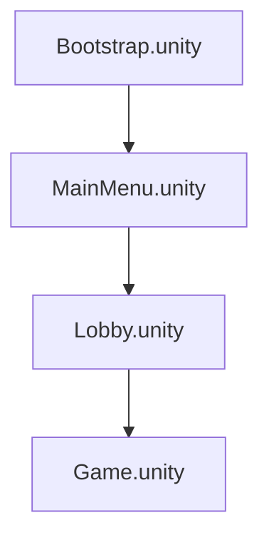
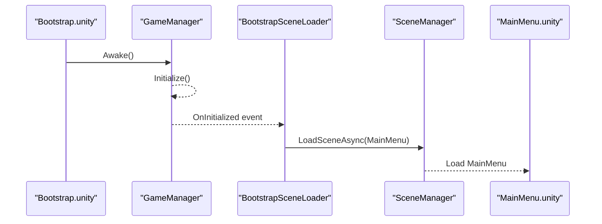
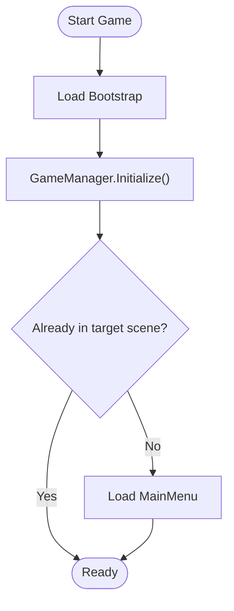
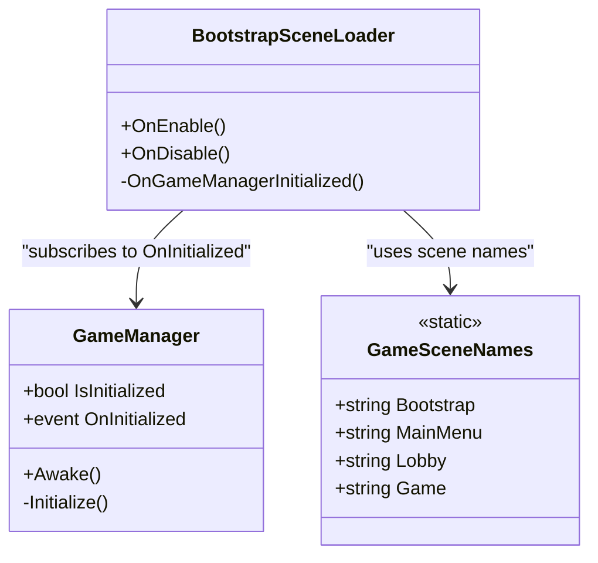

# Getting Started Guide

<cite>
**Referenced Files in This Document**
- [Bootstrap.unity](file://Assets/Game/Scenes/Bootstrap.unity)
- [MainMenu.unity](file://Assets/Game/Scenes/MainMenu.unity)
- [Lobby.unity](file://Assets/Game/Scenes/Lobby.unity)
- [Game.unity](file://Assets/Game/Scenes/Game.unity)
- [GameManager.cs](file://Assets/Game/Scripts/Runtime/Core/GameManager.cs)
- [BootstrapSceneLoader.cs](file://Assets/Game/Scripts/Runtime/Core/BootstrapSceneLoader.cs)
- [GameSceneNames.cs](file://Assets/Game/Scripts/Runtime/Core/GameSceneNames.cs)
- [EditorBuildSettings.asset](file://ProjectSettings/EditorBuildSettings.asset)
- [Discord Platform.md](file://Assets/Game/GameDesign/Discord Platform.md)
- [Match Flow.md](file://Assets/Game/GameDesign/Match Flow.md)
</cite>

## Table of Contents
1. Introduction
2. Project Structure
3. Core Components
4. Architecture Overview
5. Detailed Component Analysis
6. Dependency Analysis
7. Performance Considerations
8. Troubleshooting Guide
9. Conclusion

## Introduction
This guide helps you set up and run BARAKI for the first time, understand the scene flow from Bootstrap to MainMenu, Lobby, and Game, and get started with Discord Activity development. It is written for Unity beginners but includes enough technical depth for experienced developers to navigate the codebase quickly.

## Project Structure
The project uses a minimal, clear scene pipeline:
- Bootstrap initializes core systems and transitions to the main menu.
- MainMenu provides entry points to online play.
- Lobby handles matchmaking and readiness.
- Game loads the match arena and HUD.

**Diagram sources**
- [Bootstrap.unity](file://Assets/Game/Scenes/Bootstrap.unity)
- [MainMenu.unity](file://Assets/Game/Scenes/MainMenu.unity)
- [Lobby.unity](file://Assets/Game/Scenes/Lobby.unity)
- [Game.unity](file://Assets/Game/Scenes/Game.unity)

**Section sources**
- [EditorBuildSettings.asset](file://ProjectSettings/EditorBuildSettings.asset)
- [GameSceneNames.cs](file://Assets/Game/Scripts/Runtime/Core/GameSceneNames.cs)

## Core Components
- GameManager: Central lifecycle coordinator that persists across scenes and signals when initialization is complete.
- BootstrapSceneLoader: Subscribes to GameManager initialization and loads the next scene (MainMenu).
- Scene names registry: Centralized constants for build-order scene names.

Key responsibilities:
- Ensure a single persistent instance of GameManager exists.
- Emit an initialization event once ready.
- Load the appropriate next scene after bootstrap.

**Section sources**
- [GameManager.cs](file://Assets/Game/Scripts/Runtime/Core/GameManager.cs)
- [BootstrapSceneLoader.cs](file://Assets/Game/Scripts/Runtime/Core/BootstrapSceneLoader.cs)
- [GameSceneNames.cs](file://Assets/Game/Scripts/Runtime/Core/GameSceneNames.cs)

## Architecture Overview
The runtime architecture centers on a small bootstrap sequence and a persistent game manager. UI controllers are attached to each scene’s UI root and drive user interactions.

**Diagram sources**
- [Bootstrap.unity](file://Assets/Game/Scenes/Bootstrap.unity)
- [GameManager.cs](file://Assets/Game/Scripts/Runtime/Core/GameManager.cs)
- [BootstrapSceneLoader.cs](file://Assets/Game/Scripts/Runtime/Core/BootstrapSceneLoader.cs)
- [MainMenu.unity](file://Assets/Game/Scenes/MainMenu.unity)

## Detailed Component Analysis

### Bootstrap Scene Initialization
- The Bootstrap scene contains a GameManager GameObject with persistence enabled and a BootstrapSceneLoader component.
- On enable, BootstrapSceneLoader subscribes to GameManager.OnInitialized and loads MainMenu after the next frame if not already in a target scene.

What to look for:
- GameManager component on the “SYSTEMS” hierarchy.
- BootstrapSceneLoader component on the same object.
- Scene name checks against GameSceneNames to avoid redundant loads.

**Section sources**
- [Bootstrap.unity](file://Assets/Game/Scenes/Bootstrap.unity)
- [BootstrapSceneLoader.cs](file://Assets/Game/Scripts/Runtime/Core/BootstrapSceneLoader.cs)
- [GameSceneNames.cs](file://Assets/Game/Scripts/Runtime/Core/GameSceneNames.cs)

### GameManager Lifecycle
- Ensures a single instance via static reference and destroys duplicates.
- Optionally persists across scene loads using DontDestroyOnLoad.
- Sets IsInitialized and raises OnInitialized.

Implications:
- Any system can subscribe to OnInitialized to start late-initialization logic safely.
- Persistence flag controls whether the instance survives scene switches.

**Section sources**
- [GameManager.cs](file://Assets/Game/Scripts/Runtime/Core/GameManager.cs)

### Scene Flow: Bootstrap → MainMenu → Lobby → Game
- Build order is defined in EditorBuildSettings and referenced by GameSceneNames.
- BootstrapSceneLoader loads MainMenu; subsequent flows (Lobby → Game) are driven by UI controllers within those scenes.

**Diagram sources**
- [BootstrapSceneLoader.cs](file://Assets/Game/Scripts/Runtime/Core/BootstrapSceneLoader.cs)
- [GameSceneNames.cs](file://Assets/Game/Scripts/Runtime/Core/GameSceneNames.cs)
- [EditorBuildSettings.asset](file://ProjectSettings/EditorBuildSettings.asset)

**Section sources**
- [EditorBuildSettings.asset](file://ProjectSettings/EditorBuildSettings.asset)
- [GameSceneNames.cs](file://Assets/Game/Scripts/Runtime/Core/GameSceneNames.cs)

### Running the Game for the First Time
- Open the project in Unity.
- In the Scene view or Project window, open Assets/Game/Scenes/Bootstrap.unity.
- Press Play. The GameManager initializes and BootstrapSceneLoader loads MainMenu.
- From MainMenu, proceed to Lobby and then Game according to your current implementation.

Tips:
- Verify that all four scenes are enabled in the Build Settings.
- If the game does not transition, check that BootstrapSceneLoader is present and subscribed to GameManager events.

**Section sources**
- [Bootstrap.unity](file://Assets/Game/Scenes/Bootstrap.unity)
- [MainMenu.unity](file://Assets/Game/Scenes/MainMenu.unity)
- [Lobby.unity](file://Assets/Game/Scenes/Lobby.unity)
- [Game.unity](file://Assets/Game/Scenes/Game.unity)
- [EditorBuildSettings.asset](file://ProjectSettings/EditorBuildSettings.asset)

### Understanding the Codebase Navigation
- Core runtime logic lives under Scripts/Runtime/Core.
- UI controllers are attached to scene roots and manage their respective UI documents.
- Scene assets are organized under Scenes with subfolders for Levels and Menus.

Where to start:
- GameManager and BootstrapSceneLoader for bootstrapping.
- GameSceneNames for scene identifiers.
- Each scene file to see its camera, UI document, and controller components.

**Section sources**
- [GameManager.cs](file://Assets/Game/Scripts/Runtime/Core/GameManager.cs)
- [BootstrapSceneLoader.cs](file://Assets/Game/Scripts/Runtime/Core/BootstrapSceneLoader.cs)
- [GameSceneNames.cs](file://Assets/Game/Scripts/Runtime/Core/GameSceneNames.cs)
- [MainMenu.unity](file://Assets/Game/Scenes/MainMenu.unity)
- [Lobby.unity](file://Assets/Game/Scenes/Lobby.unity)
- [Game.unity](file://Assets/Game/Scenes/Game.unity)

### Setting Up Discord Activity Environment
Target platform and model:
- Primary launch: Discord Activity on desktop Discord.
- Client: Unity WebGL running inside Discord’s iframe.
- Networking: Dedicated headless server per match; clients connect via WebSockets.

Development workflow highlights:
- Use a local host-client setup for quick iteration.
- For multi-client testing, run multiple WebGL instances and a dedicated server locally.
- Expose services through HTTPS with valid TLS; use Discord URL mappings for HTTP calls.

Practical steps:
- Build WebGL client and serve it via a static host (e.g., Cloudflare Pages).
- Run a local headless server build for matches.
- Configure Discord Developer Portal with URL mappings and verify activity as needed.

References for constraints and recommendations:
- WebGL cannot be a reliable listen-server; use dedicated servers.
- All HTTP must go through Discord proxy/mappings.
- CSP and size limits require careful asset management.

**Section sources**
- [Discord Platform.md](file://Assets/Game/GameDesign/Discord Platform.md)

### Configuring Build Settings
- Ensure the four scenes are enabled in the correct order: Bootstrap, MainMenu, Lobby, Game.
- The build order is stored in EditorBuildSettings and mirrored by GameSceneNames constants.

How to verify:
- Open Edit > Project Settings > Player and confirm the Scenes In Build list matches the expected order.
- Confirm that Bootstrap is the first scene.

**Section sources**
- [EditorBuildSettings.asset](file://ProjectSettings/EditorBuildSettings.asset)
- [GameSceneNames.cs](file://Assets/Game/Scripts/Runtime/Core/GameSceneNames.cs)

### Launching Matches Locally
MVP offline flow:
- Host creates a lobby; joiners connect to the host.
- After race pick and Ready, load Game.unity and generate the arena.

Online flow (Discord):
- Clients start in the browser-based Activity shell.
- Matchmaker assigns a dedicated server address.
- All clients connect to the server over WSS.

Notes:
- N is fixed at lobby creation.
- Elimination and win conditions follow the documented rules.

**Section sources**
- [Match Flow.md](file://Assets/Game/GameDesign/Match Flow.md)
- [Discord Platform.md](file://Assets/Game/GameDesign/Discord Platform.md)

## Dependency Analysis
Runtime dependencies between core components:

**Diagram sources**
- [GameManager.cs](file://Assets/Game/Scripts/Runtime/Core/GameManager.cs)
- [BootstrapSceneLoader.cs](file://Assets/Game/Scripts/Runtime/Core/BootstrapSceneLoader.cs)
- [GameSceneNames.cs](file://Assets/Game/Scripts/Runtime/Core/GameSceneNames.cs)

**Section sources**
- [GameManager.cs](file://Assets/Game/Scripts/Runtime/Core/GameManager.cs)
- [BootstrapSceneLoader.cs](file://Assets/Game/Scripts/Runtime/Core/BootstrapSceneLoader.cs)
- [GameSceneNames.cs](file://Assets/Game/Scripts/Runtime/Core/GameSceneNames.cs)

## Performance Considerations
- Keep the initial scene light; defer heavy loading until after MainMenu.
- Use asynchronous scene loading where possible to avoid stutters.
- For WebGL builds, monitor bundle size and memory usage; consider simplified URP profiles for Activity.

[No sources needed since this section provides general guidance]

## Troubleshooting Guide
Common issues and resolutions:
- Game starts but stays on Bootstrap:
  - Verify BootstrapSceneLoader is attached and GameManager is initialized.
  - Check that MainMenu is enabled in Build Settings and scene name matches GameSceneNames.MainMenu.
- MainMenu appears but nothing happens:
  - Ensure MainMenu UI document and controller are correctly assigned in the scene.
- Cannot transition to Lobby or Game:
  - Confirm scene names and build order in EditorBuildSettings.
  - Validate that any custom scene-loading logic references the correct constants.

**Section sources**
- [BootstrapSceneLoader.cs](file://Assets/Game/Scripts/Runtime/Core/BootstrapSceneLoader.cs)
- [GameManager.cs](file://Assets/Game/Scripts/Runtime/Core/GameManager.cs)
- [GameSceneNames.cs](file://Assets/Game/Scripts/Runtime/Core/GameSceneNames.cs)
- [EditorBuildSettings.asset](file://ProjectSettings/EditorBuildSettings.asset)
- [MainMenu.unity](file://Assets/Game/Scenes/MainMenu.unity)

## Conclusion
You now have the essentials to set up BARAKI, run the game, and understand the bootstrap-to-game flow. For Discord Activity development, focus on WebGL hosting, a dedicated server, and proper URL mappings. Use the provided diagrams and source references to navigate the codebase efficiently and iterate quickly.