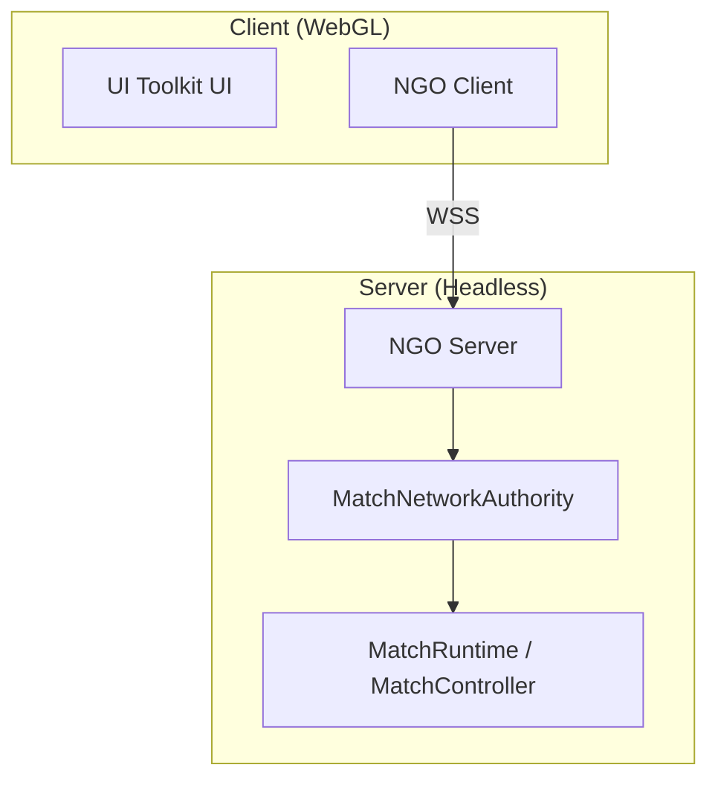
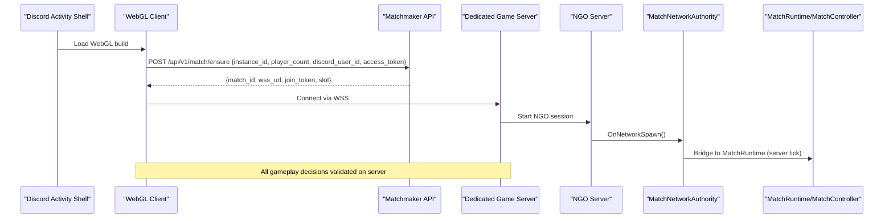
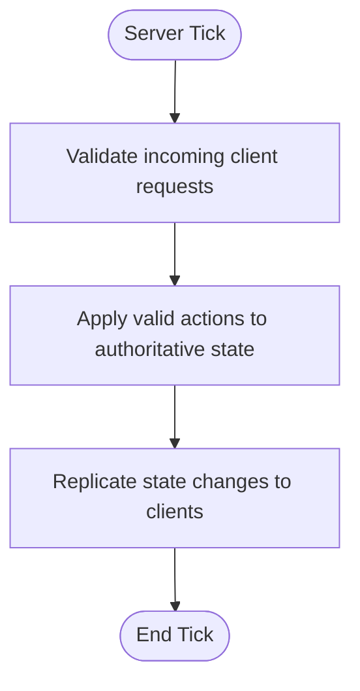
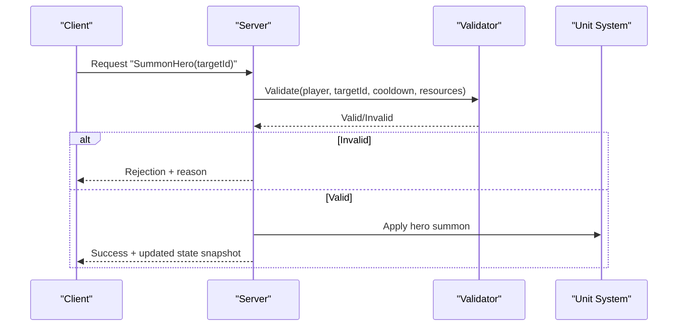
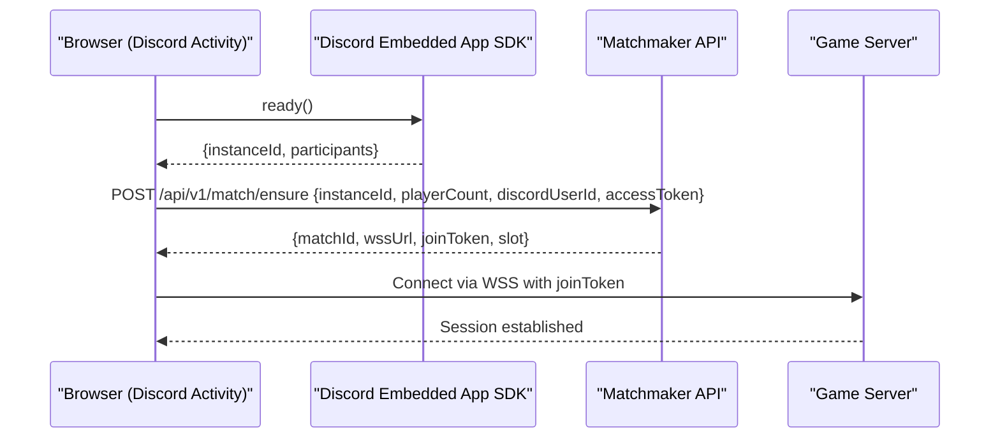
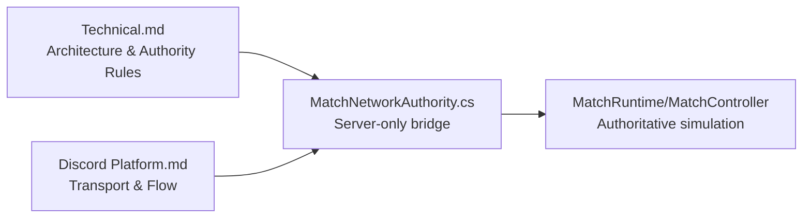

# Authority & Security

<cite>
**Referenced Files in This Document**
- [Technical.md](file://Assets/Game/GameDesign/Technical.md)
- [Discord Platform.md](file://Assets/Game/GameDesign/Discord Platform.md)
- [MatchNetworkAuthority.cs](file://Assets/Game/Scripts/Runtime/Gameplay/Networking/MatchNetworkAuthority.cs)
</cite>

## Table of Contents
1. Introduction
2. Project Structure
3. Core Components
4. Architecture Overview
5. Detailed Component Analysis
6. Dependency Analysis
7. Performance Considerations
8. Troubleshooting Guide
9. Conclusion
10. Appendices

## Introduction
This document explains BARAKI’s server-authoritative authority model and security implementation strategy. It focuses on how the server maintains authoritative game state, validates all client actions, and prevents common multiplayer exploits such as client-side manipulation, timing attacks, and resource abuse. It also outlines secure RPC patterns, state reconciliation, desynchronization recovery, authentication flows, authorization checks, permission-based access control, and monitoring approaches for detecting suspicious behavior.

The project targets a dedicated headless server per match with WebGL clients running inside Discord Activities. The transport is WebSockets/WebSecureSockets (WSS), and the simulation runs at 30 Hz. Unit movement and combat are simulated on the server; clients render only.

## Project Structure
At a high level, the relevant parts for authority and security are:
- Design documents that define the production architecture, transport, tick rate, and authority boundaries.
- A networking scaffold that bridges Netcode for GameObjects (NGO) to the match runtime on the server.

**Diagram sources**
- [Technical.md:65-126](file://Assets/Game/GameDesign/Technical.md#L65-L126)
- [Discord Platform.md:26-70](file://Assets/Game/GameDesign/Discord Platform.md#L26-L70)
- [MatchNetworkAuthority.cs:11-33](file://Assets/Game/Scripts/Runtime/Gameplay/Networking/MatchNetworkAuthority.cs#L11-L33)

**Section sources**
- [Technical.md:11-24](file://Assets/Game/GameDesign/Technical.md#L11-L24)
- [Technical.md:65-126](file://Assets/Game/GameDesign/Technical.md#L65-L126)
- [Discord Platform.md:26-70](file://Assets/Game/GameDesign/Discord Platform.md#L26-L70)
- [MatchNetworkAuthority.cs:11-33](file://Assets/Game/Scripts/Runtime/Gameplay/Networking/MatchNetworkAuthority.cs#L11-L33)

## Core Components
- Dedicated server per match: authoritative simulation, spawns, economy, combat, building damage, and elimination logic run on the server. Clients are render-only.
- Transport: WSS between WebGL clients and the headless server.
- Tick rate: 30 Hz server simulation; spawn/wave timers are per-barracks and not tied to the global tick.
- Networking scaffold: MatchNetworkAuthority bridges NGO to MatchRuntime on the server side.

Key authority rules:
- Spawn/waves: server only
- Gold/purchases: server only
- Building damage: server only
- Tower target/hero summon: client request → server validate
- Unit positions: server sim with authoritative transform sync

**Section sources**
- [Technical.md:114-126](file://Assets/Game/GameDesign/Technical.md#L114-L126)
- [Technical.md:173-185](file://Assets/Game/GameDesign/Technical.md#L173-L185)
- [MatchNetworkAuthority.cs:11-33](file://Assets/Game/Scripts/Runtime/Gameplay/Networking/MatchNetworkAuthority.cs#L11-L33)

## Architecture Overview
The production architecture uses a dedicated headless Unity server per match. All clients connect via WSS. The server runs the authoritative simulation and pushes state to clients.

**Diagram sources**
- [Discord Platform.md:263-276](file://Assets/Game/GameDesign/Discord Platform.md#L263-L276)
- [Discord Platform.md:199-204](file://Assets/Game/GameDesign/Discord Platform.md#L199-L204)
- [MatchNetworkAuthority.cs:15-32](file://Assets/Game/Scripts/Runtime/Gameplay/Networking/MatchNetworkAuthority.cs#L15-L32)
- [Technical.md:65-79](file://Assets/Game/GameDesign/Technical.md#L65-L79)

## Detailed Component Analysis

### Server-Authoritative Simulation and State
- The server owns all critical state: spawning, waves, gold/economy, combat resolution, building HP, and win conditions.
- Clients do not simulate or mutate these states; they send requests which the server validates and applies.
- The current MVP has a pure-C# simulation path; the network bridge will move ticking into the server-only component when NGO sessions are active.

[No sources needed since this diagram shows conceptual workflow, not actual code structure]

**Section sources**
- [Technical.md:114-126](file://Assets/Game/GameDesign/Technical.md#L114-L126)
- [MatchNetworkAuthority.cs:23-32](file://Assets/Game/Scripts/Runtime/Gameplay/Networking/MatchNetworkAuthority.cs#L23-L32)

### Command Validation and Anti-Cheat Measures
- Input verification: Only accept well-formed commands within allowed frequency and ranges. Reject out-of-window timestamps and impossible action rates.
- Rate limiting: Enforce per-player cooldowns and maximum command throughput on the server.
- Sanity checks: Validate distances, line-of-sight, resource availability, and unit ownership before applying actions.
- Determinism: Keep core simulation deterministic and free from floating-point drift across frames.

Implementation guidance:
- Gate all gameplay-affecting RPCs behind IsServer checks and explicit validation routines.
- Use server-side timers for spawns and waves rather than relying on client timing.

**Section sources**
- [Technical.md:173-185](file://Assets/Game/GameDesign/Technical.md#L173-L185)
- [MatchNetworkAuthority.cs:23-32](file://Assets/Game/Scripts/Runtime/Gameplay/Networking/MatchNetworkAuthority.cs#L23-L32)

### Secure RPC Patterns
- Always check IsServer before processing gameplay-affecting logic.
- Validate inputs: IDs, enums, ranges, timestamps, and permissions.
- Use idempotent operations where possible to tolerate retransmissions.
- Return explicit results to clients so they can reconcile state.

Example flow:

[No sources needed since this diagram shows conceptual workflow, not actual code structure]

### State Reconciliation and Desynchronization Recovery
- Snapshot-based reconciliation: Periodically send authoritative snapshots; clients compare and correct local state.
- Lag compensation: For targeting and hit detection, reconstruct server time state based on client timestamps.
- Rollback/reapply: If a client detects divergence, request a full snapshot and reapply buffered input events.

Operational tips:
- Track last accepted sequence numbers and timestamps per client.
- Log mismatches and trigger automatic resync when thresholds are exceeded.

[No sources needed since this section provides general guidance]

### Player Authentication Flows
- Activity shell loads WebGL and obtains instance context from Discord SDK.
- Client calls matchmaker to ensure/join a match, passing instanceId and OAuth token.
- Backend verifies the Discord Activity instance and returns server address, slot, and join token.
- Client connects to the dedicated server via WSS using the provided credentials.

**Diagram sources**
- [Discord Platform.md:263-276](file://Assets/Game/GameDesign/Discord Platform.md#L263-L276)
- [Discord Platform.md:199-204](file://Assets/Game/GameDesign/Discord Platform.md#L199-L204)

**Section sources**
- [Discord Platform.md:26-70](file://Assets/Game/GameDesign/Discord Platform.md#L26-L70)
- [Discord Platform.md:263-276](file://Assets/Game/GameDesign/Discord Platform.md#L263-L276)

### Authorization Checks and Permission-Based Access Control
- Role-based access: Differentiate between host/admin, regular players, and spectators.
- Scope-limited RPCs: Restrict certain actions to specific roles (e.g., admin-only matchmaking controls).
- Slot binding: Bind actions to a specific player slot; reject cross-slot operations.
- Token scoping: Ensure join tokens are scoped to matchId and slot and verified on each connection.

[No sources needed since this section provides general guidance]

### Common Security Vulnerabilities and Mitigations
- Client-side manipulation: Prevent by making the server authoritative for all gameplay-affecting state.
- Timing attacks: Use server-side timestamps, monotonic clocks, and tolerance windows; ignore stale or future commands.
- Resource exploitation: Enforce caps on CPU/memory usage per match; pool objects; limit packet sizes and frequencies.
- Replay attacks: Include nonces or sequence numbers; verify join tokens; bind connections to matchId/slot.
- Injection and parsing errors: Strictly validate and sanitize all inputs; use typed messages and schema validation.

[No sources needed since this section provides general guidance]

### Monitoring and Detection of Suspicious Behavior
- Metrics: Track per-client command rates, rejection reasons, latency, and desync events.
- Alerts: Trigger alerts for abnormal spikes in invalid commands, repeated timeouts, or unusual resource consumption.
- Logging: Record detailed but privacy-safe logs around rejected actions and resync events.
- Telemetry: Aggregate anonymized stats for trend analysis and cheat pattern discovery.

[No sources needed since this section provides general guidance]

## Dependency Analysis
The following diagram maps the key components involved in authority and security:

**Diagram sources**
- [Technical.md:65-126](file://Assets/Game/GameDesign/Technical.md#L65-L126)
- [Discord Platform.md:26-70](file://Assets/Game/GameDesign/Discord Platform.md#L26-L70)
- [MatchNetworkAuthority.cs:11-33](file://Assets/Game/Scripts/Runtime/Gameplay/Networking/MatchNetworkAuthority.cs#L11-L33)

**Section sources**
- [Technical.md:65-126](file://Assets/Game/GameDesign/Technical.md#L65-L126)
- [Discord Platform.md:26-70](file://Assets/Game/GameDesign/Discord Platform.md#L26-L70)
- [MatchNetworkAuthority.cs:11-33](file://Assets/Game/Scripts/Runtime/Gameplay/Networking/MatchNetworkAuthority.cs#L11-L33)

## Performance Considerations
- Keep the server tick at 30 Hz; avoid heavy work per frame.
- Use object pooling and spatial partitioning for targeting.
- Limit replication bandwidth by sending deltas and snapshots efficiently.
- Offload expensive calculations to background jobs where possible.

[No sources needed since this section provides general guidance]

## Troubleshooting Guide
- Connection issues: Verify WSS endpoints, TLS certificates, and CORS/proxy settings for Discord URL mappings.
- Desyncs: Check timestamp windows, sequence numbers, and snapshot intervals; enable resync on divergence.
- High rejection rates: Review input validation rules and rate limits; adjust tolerances if necessary.
- Resource spikes: Inspect object pools, VFX budgets, and per-match caps.

[No sources needed since this section provides general guidance]

## Conclusion
BARAKI adopts a strict server-authoritative design with a dedicated headless server per match and WebGL clients connecting via WSS. Critical gameplay systems are validated and applied on the server, while clients render only. By enforcing robust input validation, rate limiting, role-based authorization, and monitoring, the system mitigates common multiplayer vulnerabilities and supports reliable state reconciliation and desynchronization recovery.

## Appendices

### Authority Matrix
- Spawn/waves: server only
- Gold/purchases: server only
- Building damage: server only
- Tower target/hero summon: client request → server validate
- Unit positions: server sim with authoritative transform sync

**Section sources**
- [Technical.md:114-126](file://Assets/Game/GameDesign/Technical.md#L114-L126)