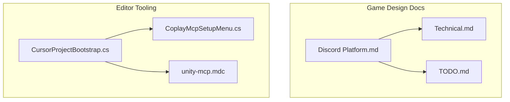
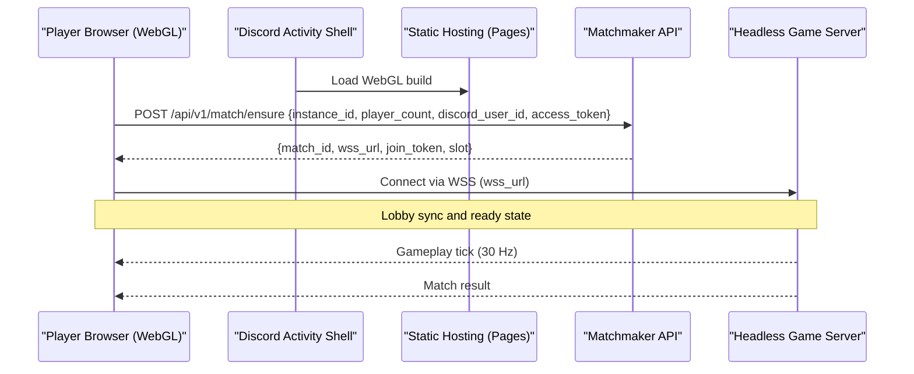
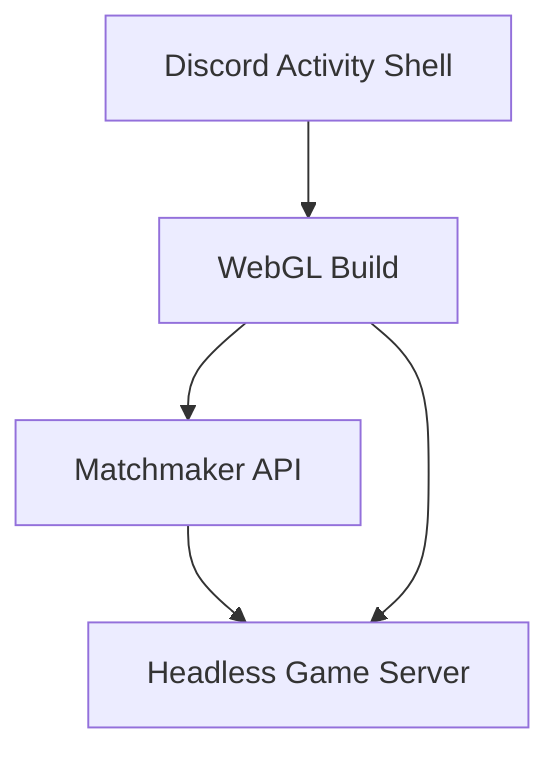

# Deployment & Monitoring

<cite>
**Referenced Files in This Document**
- [Discord Platform.md](file://Assets/Game/GameDesign/Discord Platform.md)
- [Technical.md](file://Assets/Game/GameDesign/Technical.md)
- [TODO.md](file://Assets/Game/GameDesign/TODO.md)
- [CursorProjectBootstrap.cs](file://Assets/Game/Scripts/Editor/CursorProjectBootstrap.cs)
- [CoplayMcpSetupMenu.cs](file://Assets/Game/Scripts/Editor/CoplayMcpSetupMenu.cs)
- [unity-mcp.mdc](file://Assets/Game/Settings/ProjectBootstrap/Cursor/rules/unity-mcp.mdc)
</cite>

## Table of Contents
1. [Introduction](#introduction)
2. [Project Structure](#project-structure)
3. [Core Components](#core-components)
4. [Architecture Overview](#architecture-overview)
5. [Detailed Component Analysis](#detailed-component-analysis)
6. [Dependency Analysis](#dependency-analysis)
7. [Performance Considerations](#performance-considerations)
8. [Troubleshooting Guide](#troubleshooting-guide)
9. [Conclusion](#conclusion)
10. [Appendices](#appendices)

## Introduction
This document provides operational guidance for deploying and monitoring BARAKI’s multiplayer infrastructure as a Discord Activity with Unity WebGL clients and dedicated headless game servers. It consolidates the project’s locked decisions, recommended infrastructure paths (FREE-0 to FREE-1), client/server transport requirements, and development workflow notes. It also outlines CI/CD considerations, automated testing strategies, performance profiling, monitoring, logging, scaling, load balancing, disaster recovery, and operational runbooks for common scenarios.

## Project Structure
The repository is a Unity project with gameplay code, UI assets, and design documentation. The deployment and monitoring scope primarily derives from the Game Design documents that define platform constraints, networking model, and infrastructure options. Editor bootstrap scripts support local developer tooling and MCP integration but are not part of production runtime.

**Diagram sources**
- [Discord Platform.md:1-340](file://Assets/Game/GameDesign/Discord Platform.md#L1-L340)
- [Technical.md:38-79](file://Assets/Game/GameDesign/Technical.md#L38-L79)
- [TODO.md:1-40](file://Assets/Game/GameDesign/TODO.md#L1-L40)
- [CursorProjectBootstrap.cs:1-35](file://Assets/Game/Scripts/Editor/CursorProjectBootstrap.cs#L1-L35)
- [CoplayMcpSetupMenu.cs:1-34](file://Assets/Game/Scripts/Editor/CoplayMcpSetupMenu.cs#L1-L34)
- [unity-mcp.mdc:88-96](file://Assets/Game/Settings/ProjectBootstrap/Cursor/rules/unity-mcp.mdc#L88-L96)

**Section sources**
- [Discord Platform.md:1-340](file://Assets/Game/GameDesign/Discord Platform.md#L1-L340)
- [Technical.md:38-79](file://Assets/Game/GameDesign/Technical.md#L38-L79)
- [TODO.md:1-40](file://Assets/Game/GameDesign/TODO.md#L1-L40)
- [CursorProjectBootstrap.cs:1-35](file://Assets/Game/Scripts/Editor/CursorProjectBootstrap.cs#L1-L35)
- [CoplayMcpSetupMenu.cs:1-34](file://Assets/Game/Scripts/Editor/CoplayMcpSetupMenu.cs#L1-L34)
- [unity-mcp.mdc:88-96](file://Assets/Game/Settings/ProjectBootstrap/Cursor/rules/unity-mcp.mdc#L88-L96)

## Core Components
- Discord Activity shell + WebGL build: Hosted on static hosting; loads the Unity WebGL build inside Discord iframe.
- Matchmaker API: Ensures or joins a match by instanceId and returns a WSS URL and join token.
- Dedicated headless game server: Per-match authoritative simulation at 30 Hz using Netcode for GameObjects over WebSockets.
- TLS and proxying: All traffic between browser and server must be secure (WSS); HTTP calls go through Discord URL mappings/proxy.

Key locked decisions and constraints:
- Primary platform: Desktop Discord Activity only.
- Client: Unity WebGL.
- Production netcode: Dedicated server per match.
- Transport: WebSockets/WSS on both client and server.
- Recommended infra path: FREE-0 (local PC headless + Cloudflare Tunnel) → FREE-1 (Oracle Always Free ARM VM).

**Section sources**
- [Discord Platform.md:105-340](file://Assets/Game/GameDesign/Discord Platform.md#L105-L340)
- [Technical.md:65-79](file://Assets/Game/GameDesign/Technical.md#L65-L79)

## Architecture Overview
End-to-end flow for a match session:

**Diagram sources**
- [Discord Platform.md:77-116](file://Assets/Game/GameDesign/Discord Platform.md#L77-L116)
- [Discord Platform.md:263-276](file://Assets/Game/GameDesign/Discord Platform.md#L263-L276)
- [Discord Platform.md:280-286](file://Assets/Game/GameDesign/Discord Platform.md#L280-L286)

## Detailed Component Analysis

### WebGL Build Configuration for Discord Activities
- Target: Unity WebGL build served from static hosting (e.g., Cloudflare Pages).
- Constraints:
  - Keep build size and RAM usage low due to iframe limits.
  - Use URP WebGL profile suitable for Activity; consider simplified renderer if needed.
  - No inline scripts; adhere to CSP.
  - All HTTP requests must route through Discord URL mappings/proxy.
- Integration:
  - Initialize Discord Embedded App SDK, obtain instanceId and participants list.
  - Use lobby UI within WebGL for race pick and Ready state.

Operational implications:
- Ensure CDN caching headers for fast initial load.
- Validate Content Security Policy compliance in the HTML shell.
- Monitor bundle size and memory footprint during profiling.

**Section sources**
- [Discord Platform.md:313-319](file://Assets/Game/GameDesign/Discord Platform.md#L313-L319)
- [Discord Platform.md:321-326](file://Assets/Game/GameDesign/Discord Platform.md#L321-L326)

### Server Setup Requirements
- Headless Unity server build:
  - Target: Linux Server (Dedicated Server enabled).
  - Launch flags: batchmode and nographics.
  - Environment variables: MATCH_ID, PLAYER_COUNT, PORT.
  - Scene: Simulation and networking only (no UI menus).
  - Transport: WebSockets listening on all interfaces.
- Networking:
  - Use Netcode for GameObjects with WebSocket transport.
  - Secure connections via WSS with valid TLS certificates.

Deployment patterns:
- One container/process per match; auto-provision on first player request; terminate after match ends.
- Reverse proxy routes wss://game.domain.com/match/{id} to the assigned server port.

**Section sources**
- [Discord Platform.md:280-286](file://Assets/Game/GameDesign/Discord Platform.md#L280-L286)
- [Discord Platform.md:188-207](file://Assets/Game/GameDesign/Discord Platform.md#L188-L207)

### Production Deployment Strategies
Recommended path:
- Phase FREE-0: Local PC headless server exposed via Cloudflare Tunnel; WebGL hosted on Cloudflare Pages; matchmaker on Cloudflare Workers.
- Phase FREE-1: Oracle Always Free ARM VM running Dockerized headless server; same image used locally and in production.

Hosting layers:
- Static hosting for shell + WebGL build.
- Lightweight matchmaker service.
- Per-match headless server instances.

TLS and exposure:
- Valid TLS for WSS endpoints.
- Use Caddy or nginx reverse proxy for routing and certificate management.

**Section sources**
- [Discord Platform.md:188-207](file://Assets/Game/GameDesign/Discord Platform.md#L188-L207)
- [Discord Platform.md:238-261](file://Assets/Game/GameDesign/Discord Platform.md#L238-L261)

### CI/CD Pipeline Configuration
Suggested pipeline stages:
- Lint and static analysis for C# and Unity settings.
- Unit tests execution.
- WebGL build validation (headless editor build).
- Docker image build for headless server.
- Artifact publishing (WebGL build artifacts, Docker images).
- Staging deploy to Pages and Workers/VPS.
- Smoke tests against staging environment.

Automation targets:
- Trigger on tags or main branch merges.
- Cache dependencies to speed up builds.
- Store build artifacts and logs for traceability.

[No sources needed since this section provides general guidance]

### Automated Testing for Multiplayer Scenarios
- Unit tests for core gameplay logic.
- Play mode tests for network behaviors where feasible.
- End-to-end smoke tests:
  - Start a headless server locally or in CI.
  - Launch multiple WebGL clients (or simulated clients) to connect via WSS.
  - Verify matchmaking flow and basic match lifecycle.
- Performance regression checks:
  - Measure frame times and network latency under load.

**Section sources**
- [TODO.md:29-40](file://Assets/Game/GameDesign/TODO.md#L29-L40)

### Performance Profiling Tools
- Unity Profiler and Memory Profiler for WebGL builds.
- Network profiling to monitor round-trip time and packet loss.
- Server-side metrics collection for CPU, memory, and connection counts.
- Browser DevTools for WebGL resource usage and memory leaks.

Integration with editor tooling:
- MCP rules expose profiler and test commands for developers.

**Section sources**
- [unity-mcp.mdc:88-96](file://Assets/Game/Settings/ProjectBootstrap/Cursor/rules/unity-mcp.mdc#L88-L96)

### Monitoring Solutions
Track:
- Network latency and jitter between clients and server.
- Player sessions: join/leave events, lobby readiness, match duration.
- Server health: CPU, memory, active matches, error rates.

Recommendations:
- Centralized logging for matchmaker and game servers.
- Metrics export to a time-series database.
- Alerting on thresholds (latency spikes, crash loops, high error rates).

[No sources needed since this section provides general guidance]

### Logging Strategies and Error Reporting
- Structured JSON logs with correlation IDs per match/session.
- Log levels: info for lifecycle events, warn for retries/backoffs, error for failures.
- Error reporting:
  - Capture unhandled exceptions and network errors.
  - Include context such as match_id, player_count, and transport status.
- Retries and backoff policies for transient failures.

[No sources needed since this section provides general guidance]

### Debugging Tools for Distributed Environments
- Local dev workflow:
  - Run headless server locally and connect multiple WebGL tabs.
  - Use ParrelSync or multiple editor instances for host-client style debugging.
- Remote debugging:
  - Enable verbose logging in staging.
  - Use distributed tracing across matchmaker and server.

**Section sources**
- [Discord Platform.md:328-334](file://Assets/Game/GameDesign/Discord Platform.md#L328-L334)

### Scaling Considerations and Load Balancing
- Horizontal scaling:
  - Spawn one headless server per match; scale out by increasing capacity.
- Load distribution:
  - Matchmaker assigns new matches to available server instances.
  - Reverse proxy balances WSS connections based on match routing.
- Auto-scaling:
  - Container orchestration can spin up/down server instances based on demand.
- Capacity planning:
  - Estimate concurrent matches and resource usage per instance.

[No sources needed since this section provides general guidance]

### Disaster Recovery Procedures
- Failover:
  - If a server crashes, mark match as failed and notify players.
  - Optionally allow rejoin within a grace period if state permits.
- Data persistence:
  - Persist match state snapshots for potential recovery.
- Rollbacks:
  - Maintain previous Docker images and WebGL builds for quick rollback.
- Backups:
  - Backup configuration and any persistent data (if used).

[No sources needed since this section provides general guidance]

### Operational Runbooks
Common scenarios:
- New match creation:
  - Client calls ensure endpoint; matchmaker provisions server and returns WSS URL.
- Late join:
  - Client calls get-by-instanceId to retrieve existing match details.
- Readiness and start:
  - Clients signal ready; server starts countdown when all are ready.
- Match teardown:
  - Server terminates container/process after match completion.

Health checks:
- Health endpoint for matchmaker and reverse proxy.
- Liveness/readiness probes for containers.

**Section sources**
- [Discord Platform.md:263-276](file://Assets/Game/GameDesign/Discord Platform.md#L263-L276)
- [Discord Platform.md:188-207](file://Assets/Game/GameDesign/Discord Platform.md#L188-L207)

## Dependency Analysis
High-level component relationships:

**Diagram sources**
- [Discord Platform.md:77-116](file://Assets/Game/GameDesign/Discord Platform.md#L77-L116)

**Section sources**
- [Discord Platform.md:77-116](file://Assets/Game/GameDesign/Discord Platform.md#L77-L116)

## Performance Considerations
- WebGL constraints:
  - Aggressive asset pooling, LOD, and VFX limits to fit iframe memory.
  - Simplified URP profile for Activity if necessary.
- Network efficiency:
  - Minimize payload sizes; use delta compression where possible.
  - Tune tick rate and interpolation to balance responsiveness and bandwidth.
- Server resources:
  - Profile CPU and memory per match; optimize hot paths.
  - Avoid unnecessary allocations and GC pressure.

[No sources needed since this section provides general guidance]

## Troubleshooting Guide
Common issues and resolutions:
- WebGL fails to load in Discord:
  - Verify HTTPS and CSP compliance; check console for blocked resources.
- Connection refused or TLS errors:
  - Ensure WSS endpoint has valid certificates and reverse proxy routes correctly.
- Matchmaker timeouts:
  - Check Workers/VPS health and logs; verify instance verification.
- High latency or jitter:
  - Inspect network paths; consider regional deployment or edge hosting.
- Server crashes:
  - Review logs for exceptions; validate environment variables and scene setup.

**Section sources**
- [Discord Platform.md:313-319](file://Assets/Game/GameDesign/Discord Platform.md#L313-L319)
- [Discord Platform.md:188-207](file://Assets/Game/GameDesign/Discord Platform.md#L188-L207)

## Conclusion
BARAKI’s multiplayer architecture centers on a Discord Activity delivering a Unity WebGL client to desktop users, backed by a lightweight matchmaker and per-match headless servers using Netcode for GameObjects over WebSockets. The recommended FREE-0 to FREE-1 path enables zero-cost playtesting and 24/7 operation without vendor lock-in. By implementing robust CI/CD, automated multiplayer tests, comprehensive monitoring, and clear runbooks, teams can maintain reliability and performance while scaling to meet demand.

## Appendices

### Development Workflow Notes
- Gameplay without Discord: Editor sandbox and unit tests.
- Netcode testing: Multiple WebGL tabs or ParrelSync with local dedicated server.
- Discord integration: Cloudflare tunnel and URL mapping with a small test guild.

**Section sources**
- [Discord Platform.md:328-334](file://Assets/Game/GameDesign/Discord Platform.md#L328-L334)

### Editor Bootstrap and MCP Integration
- On first open, editor bootstrap copies Cursor rules and configures MCP stdio preferences.
- MCP rules expose commands for building, testing, and profiling within the editor.

**Section sources**
- [CursorProjectBootstrap.cs:1-35](file://Assets/Game/Scripts/Editor/CursorProjectBootstrap.cs#L1-L35)
- [CoplayMcpSetupMenu.cs:1-34](file://Assets/Game/Scripts/Editor/CoplayMcpSetupMenu.cs#L1-L34)
- [unity-mcp.mdc:88-96](file://Assets/Game/Settings/ProjectBootstrap/Cursor/rules/unity-mcp.mdc#L88-L96)