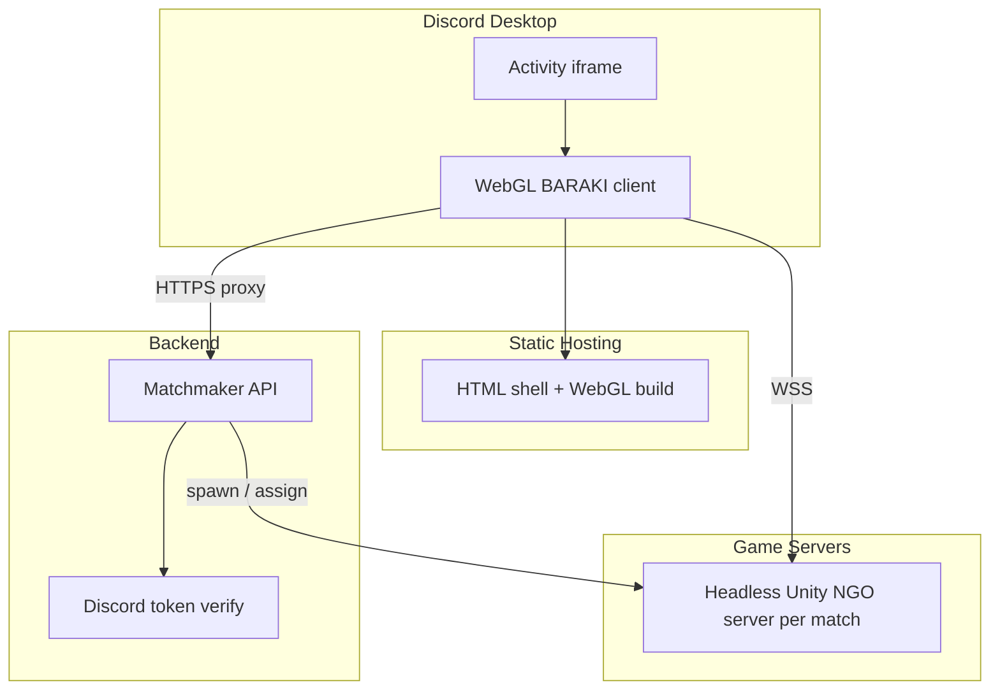
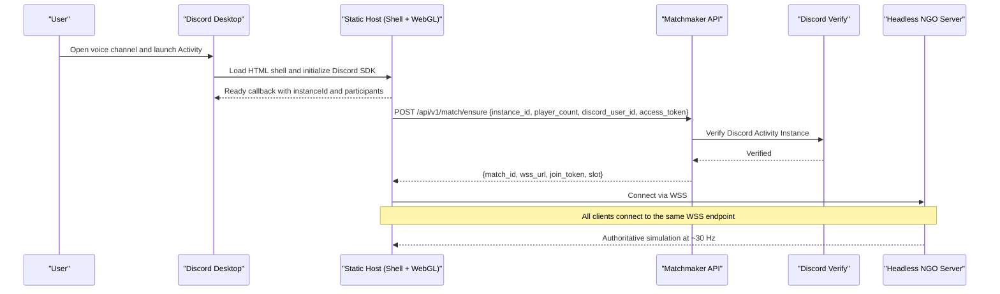
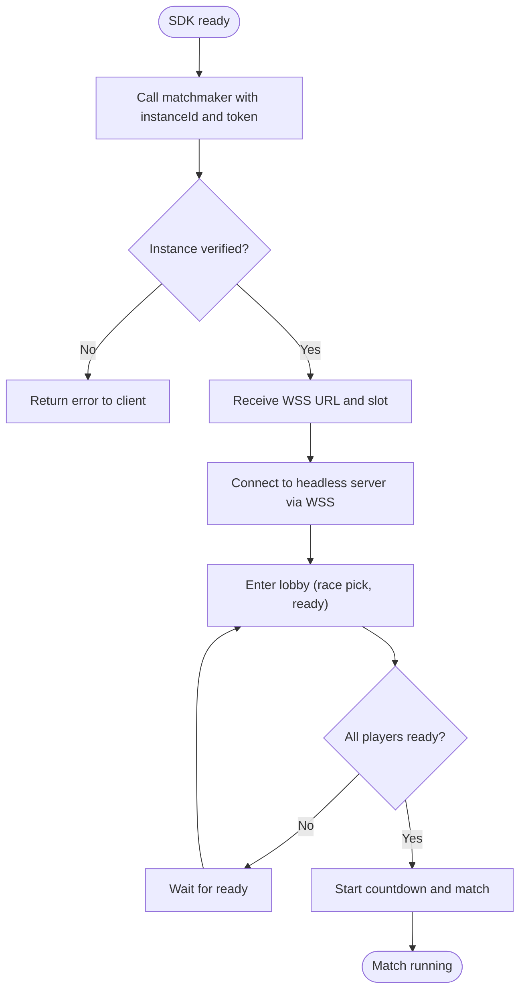
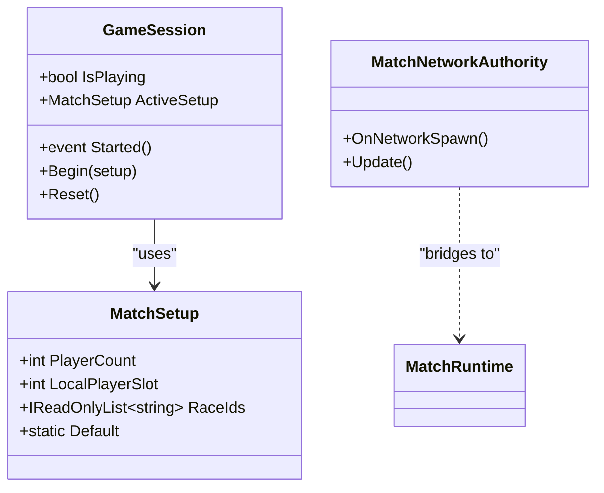
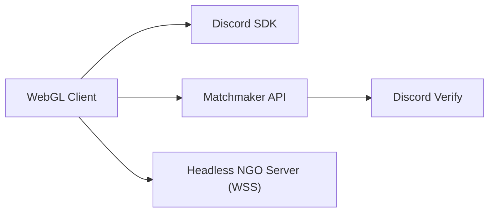

# Discord Integration

<cite>
**Referenced Files in This Document**
- [Discord Platform.md](file://Assets/Game/GameDesign/Discord Platform.md)
- [EditorBuildSettings.asset](file://ProjectSettings/EditorBuildSettings.asset)
- [GraphicsSettings.asset](file://ProjectSettings/GraphicsSettings.asset)
- [GameSession.cs](file://Assets/Game/Scripts/Runtime/Core/GameSession.cs)
- [MatchSetup.cs](file://Assets/Game/Scripts/Runtime/Core/MatchSetup.cs)
- [MatchNetworkAuthority.cs](file://Assets/Game/Scripts/Runtime/Gameplay/Networking/MatchNetworkAuthority.cs)
</cite>

## Table of Contents
1. Introduction
2. Project Structure
3. Core Components
4. Architecture Overview
5. Detailed Component Analysis
6. Dependency Analysis
7. Performance Considerations
8. Troubleshooting Guide
9. Conclusion

## Introduction
This document explains how BARAKI integrates with Discord Activities to host multiplayer matches inside Discord voice channels on desktop. It covers platform requirements, WebGL build configuration, Activity manifest considerations, voice channel awareness, deployment workflows, player discovery and session management, cross-platform constraints, SDK limitations, browser security restrictions, performance optimization for embedded web apps, troubleshooting strategies, and testing approaches.

## Project Structure
The Discord integration spans design documentation, Unity project settings, and runtime scaffolding:
- Design and architecture guidance is captured in the Discord Platform document.
- WebGL scenes are registered in EditorBuildSettings.
- Rendering pipeline and WebGL-specific graphics options are configured in GraphicsSettings.
- Runtime components provide session state, match setup parameters, and a minimal Netcode for GameObjects (NGO) bridge for server-side authority.

**Diagram sources**
- [Discord Platform.md:77-103](file://Assets/Game/GameDesign/Discord Platform.md#L77-L103)

**Section sources**
- [Discord Platform.md:1-340](file://Assets/Game/GameDesign/Discord Platform.md#L1-L340)
- [EditorBuildSettings.asset:1-21](file://ProjectSettings/EditorBuildSettings.asset#L1-L21)
- [GraphicsSettings.asset:1-68](file://ProjectSettings/GraphicsSettings.asset#L1-L68)

## Core Components
- Session lifecycle and state:
  - GameSession tracks whether gameplay has started and exposes an event for subscribers.
- Match setup:
  - MatchSetup defines lobby-to-match handoff parameters such as player count and local slot assignment.
- Networking scaffold:
  - MatchNetworkAuthority bridges NGO lifecycle into the match runtime and prepares for authoritative simulation.

Key responsibilities:
- GameSession: centralize “playing” state and notify systems when entering gameplay.
- MatchSetup: enforce valid player counts and slot indices; carry race selections into the match.
- MatchNetworkAuthority: ensure server-only update loop and prepare for authoritative tick once NGO is active.

**Section sources**
- [GameSession.cs:1-34](file://Assets/Game/Scripts/Runtime/Core/GameSession.cs#L1-L34)
- [MatchSetup.cs:1-29](file://Assets/Game/Scripts/Runtime/Core/MatchSetup.cs#L1-L29)
- [MatchNetworkAuthority.cs:1-35](file://Assets/Game/Scripts/Runtime/Gameplay/Networking/MatchNetworkAuthority.cs#L1-L35)

## Architecture Overview
BARAKI’s Discord integration follows a dedicated-server model:
- The client is a Unity WebGL build served from static hosting.
- An HTML shell initializes the Discord Embedded App SDK and loads the WebGL build.
- A lightweight backend provides matchmaking and optional Discord instance verification.
- Each match runs a headless Unity server using NGO over WebSockets (WSS).

**Diagram sources**
- [Discord Platform.md:63-71](file://Assets/Game/GameDesign/Discord Platform.md#L63-L71)
- [Discord Platform.md:263-276](file://Assets/Game/GameDesign/Discord Platform.md#L263-L276)

## Detailed Component Analysis

### WebGL Build Configuration
- Scenes included in builds:
  - Bootstrap, MainMenu, Lobby, Game are enabled for builds.
- Rendering pipeline:
  - Uses a custom render pipeline asset and Universal Render Pipeline settings.
- Recommendations for Discord Activities:
  - Optimize for smaller bundle size and lower memory usage within the Discord iframe.
  - Consider a simplified URP profile for Activity builds.

Operational notes:
- Ensure HTTPS delivery and Content Security Policy compliance in the shell.
- Route all HTTP requests through Discord URL mappings or a proxy.

**Section sources**
- [EditorBuildSettings.asset:1-21](file://ProjectSettings/EditorBuildSettings.asset#L1-L21)
- [GraphicsSettings.asset:1-68](file://ProjectSettings/GraphicsSettings.asset#L1-L68)
- [Discord Platform.md:313-319](file://Assets/Game/GameDesign/Discord Platform.md#L313-L319)

### Activity Manifest and Shell Setup
- The HTML shell must:
  - Initialize the Discord Embedded App SDK.
  - Provide a ready callback that exposes instanceId and participants.
  - Use patchUrlMappings to proxy HTTP calls to the matchmaker.
- For public release, complete Activity verification in the Discord Developer Portal.

Constraints:
- Avoid inline scripts due to CSP.
- Keep assets lean to fit within iframe memory limits.

**Section sources**
- [Discord Platform.md:54-71](file://Assets/Game/GameDesign/Discord Platform.md#L54-L71)
- [Discord Platform.md:313-319](file://Assets/Game/GameDesign/Discord Platform.md#L313-L319)

### Voice Channel Awareness and Player Discovery
- Discord supplies:
  - instanceId identifying the activity instance.
  - Participant list derived from the voice channel context.
  - OAuth data (nickname/avatar) if permitted.
- Lobby logic uses N = number of participants in the instance (2–8).
- The Discord SDK is the source of truth for who is present in the channel.

**Section sources**
- [Discord Platform.md:13-24](file://Assets/Game/GameDesign/Discord Platform.md#L13-L24)
- [Discord Platform.md:321-326](file://Assets/Game/GameDesign/Discord Platform.md#L321-L326)

### Session Management Across Discord Users
- Client flow:
  - On SDK ready, call the matchmaker to create or join a room using instanceId and OAuth token.
  - Backend validates the instance and returns a WSS address and slot.
  - Clients connect to the dedicated server and participate in the lobby phase.
- Server flow:
  - Dedicated headless Unity server runs authoritative simulation at approximately 30 Hz.
  - Lobby readiness triggers countdown and match start.

**Diagram sources**
- [Discord Platform.md:63-71](file://Assets/Game/GameDesign/Discord Platform.md#L63-L71)
- [Discord Platform.md:263-276](file://Assets/Game/GameDesign/Discord Platform.md#L263-L276)

**Section sources**
- [Discord Platform.md:54-71](file://Assets/Game/GameDesign/Discord Platform.md#L54-L71)
- [Discord Platform.md:263-276](file://Assets/Game/GameDesign/Discord Platform.md#L263-L276)

### Cross-Platform Compatibility Considerations
- Target platform:
  - Desktop Discord only; mobile Discord is not supported.
- Transport:
  - Production uses WebSockets/WSS on both client and server.
- Hosting:
  - Static hosting for shell/WebGL; dedicated headless servers per match.

**Section sources**
- [Discord Platform.md:294-306](file://Assets/Game/GameDesign/Discord Platform.md#L294-L306)

### Discord SDK Limitations and Browser Security Restrictions
- WebGL cannot act as a reliable listen server; use dedicated headless servers.
- All HTTP must go through Discord URL mappings/proxy.
- CSP forbids inline scripts in the shell.
- Public release requires Activity verification in the Discord Developer Portal.

**Section sources**
- [Discord Platform.md:39-42](file://Assets/Game/GameDesign/Discord Platform.md#L39-L42)
- [Discord Platform.md:313-319](file://Assets/Game/GameDesign/Discord Platform.md#L313-L319)

### Deployment Workflows for Publishing Activities
- Development:
  - Host shell and WebGL on Cloudflare Pages.
  - Run matchmaker on Cloudflare Workers.
  - Expose local headless server via Cloudflare Tunnel.
- Production:
  - Migrate game servers to Oracle Always Free ARM VM or a paid VPS.
  - Serve WSS behind a reverse proxy with TLS (Caddy/nginx/Let’s Encrypt).
  - Maintain one container/process per match for isolation.

**Section sources**
- [Discord Platform.md:118-134](file://Assets/Game/GameDesign/Discord Platform.md#L118-L134)
- [Discord Platform.md:188-210](file://Assets/Game/GameDesign/Discord Platform.md#L188-L210)
- [Discord Platform.md:238-261](file://Assets/Game/GameDesign/Discord Platform.md#L238-L261)

### Runtime Scaffolding: Session, Setup, and Authority
- GameSession:
  - Provides IsPlaying flag and Started event to coordinate UI and systems.
- MatchSetup:
  - Enforces player count between 2 and 8 and clamps local slot index.
- MatchNetworkAuthority:
  - Bridges NGO lifecycle to match runtime; prepares server-only tick path.

**Diagram sources**
- [GameSession.cs:1-34](file://Assets/Game/Scripts/Runtime/Core/GameSession.cs#L1-L34)
- [MatchSetup.cs:1-29](file://Assets/Game/Scripts/Runtime/Core/MatchSetup.cs#L1-L29)
- [MatchNetworkAuthority.cs:1-35](file://Assets/Game/Scripts/Runtime/Gameplay/Networking/MatchNetworkAuthority.cs#L1-L35)

**Section sources**
- [GameSession.cs:1-34](file://Assets/Game/Scripts/Runtime/Core/GameSession.cs#L1-L34)
- [MatchSetup.cs:1-29](file://Assets/Game/Scripts/Runtime/Core/MatchSetup.cs#L1-L29)
- [MatchNetworkAuthority.cs:1-35](file://Assets/Game/Scripts/Runtime/Gameplay/Networking/MatchNetworkAuthority.cs#L1-L35)

## Dependency Analysis
- Client dependencies:
  - Discord Embedded App SDK for instance context and participant enumeration.
  - WebGL runtime for rendering and input.
- Network dependencies:
  - Unity Netcode for GameObjects (NGO) for transport and replication.
  - WebSocket transport (WSS) for secure connections.
- Backend dependencies:
  - Matchmaker service orchestrating server spawn and assignment.
  - Optional Discord Activity Instance API verification.

**Diagram sources**
- [Discord Platform.md:77-103](file://Assets/Game/GameDesign/Discord Platform.md#L77-L103)
- [Discord Platform.md:263-276](file://Assets/Game/GameDesign/Discord Platform.md#L263-L276)

**Section sources**
- [Discord Platform.md:73-116](file://Assets/Game/GameDesign/Discord Platform.md#L73-L116)
- [Discord Platform.md:263-276](file://Assets/Game/GameDesign/Discord Platform.md#L263-L276)

## Performance Considerations
- Bundle size and memory:
  - Aggressive object pooling, LOD, and VFX limits to fit within iframe constraints.
- Rendering:
  - Evaluate a simplified URP profile for Activity builds.
- Networking:
  - Use WSS and keep message rates efficient; target ~30 Hz authoritative updates.
- Hosting:
  - Prefer CDN-backed static hosting for fast initial load.

[No sources needed since this section provides general guidance]

## Troubleshooting Guide
Common issues and resolutions:
- Activity not launching in Discord:
  - Ensure Activity verification is completed in the Discord Developer Portal for public releases.
- HTTP errors from matchmaker:
  - Confirm URLs are proxied via Discord URL mappings or a compatible proxy.
- WSS connection failures:
  - Verify the game server exposes a valid TLS certificate and is reachable over HTTPS/WSS.
- High latency or stuttering:
  - Reduce visual complexity and network payload; confirm server runs at stable ~30 Hz.
- Too many concurrent matches:
  - Scale headless server instances and adjust matchmaker capacity planning.

**Section sources**
- [Discord Platform.md:313-319](file://Assets/Game/GameDesign/Discord Platform.md#L313-L319)
- [Discord Platform.md:111-116](file://Assets/Game/GameDesign/Discord Platform.md#L111-L116)

## Conclusion
BARAKI’s Discord integration leverages a dedicated-headless architecture with WebGL clients, a lightweight matchmaker, and secure WSS transport. By adhering to Discord’s Activity constraints, optimizing WebGL builds, and following the recommended deployment paths, teams can deliver responsive multiplayer experiences directly within Discord voice channels on desktop.