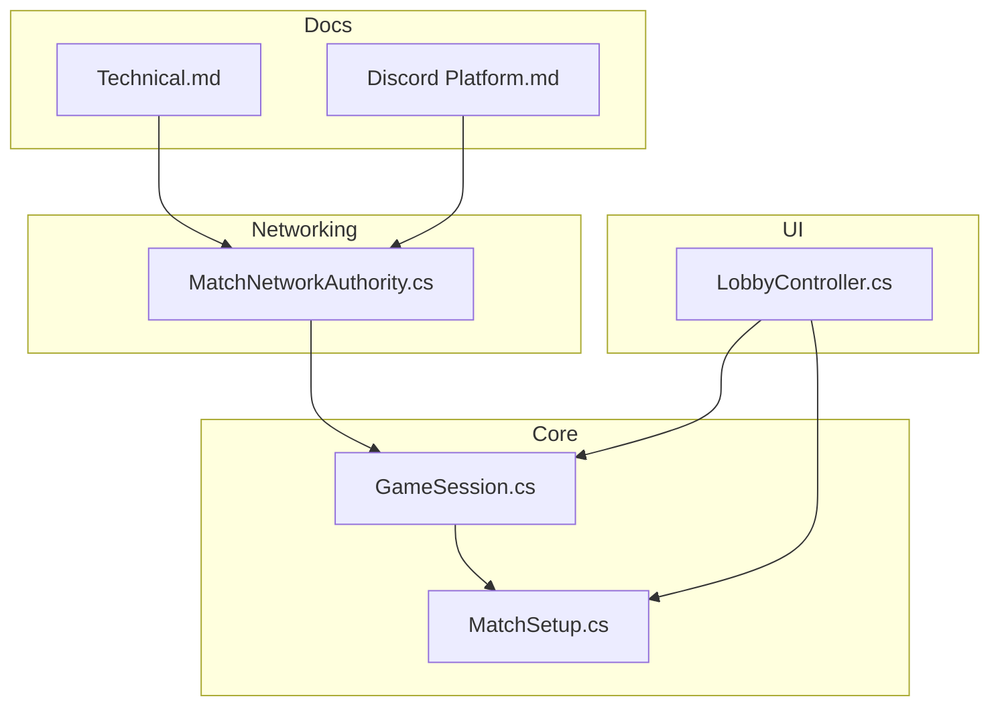
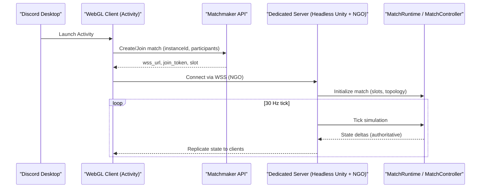
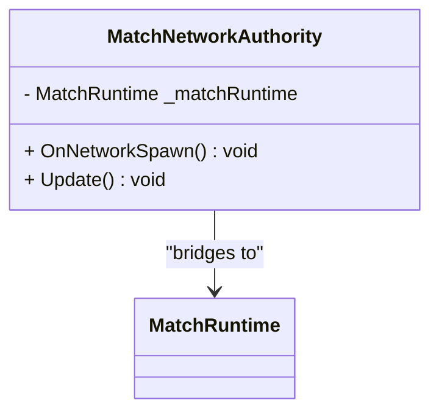
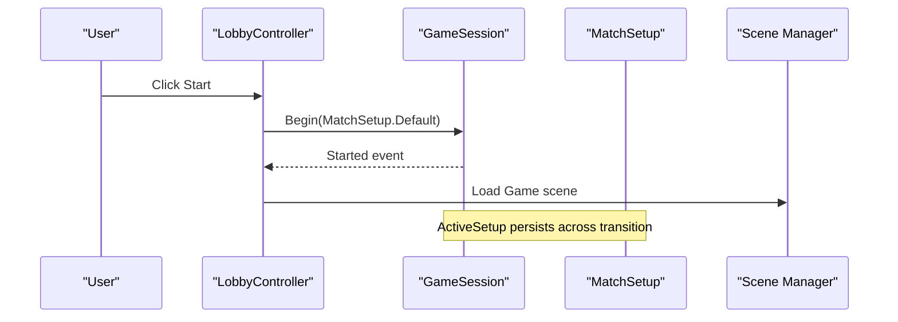
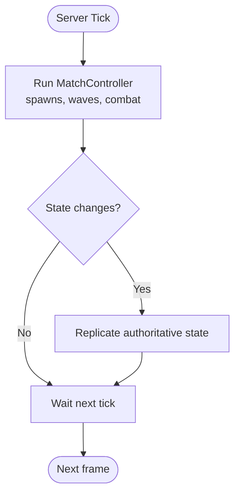
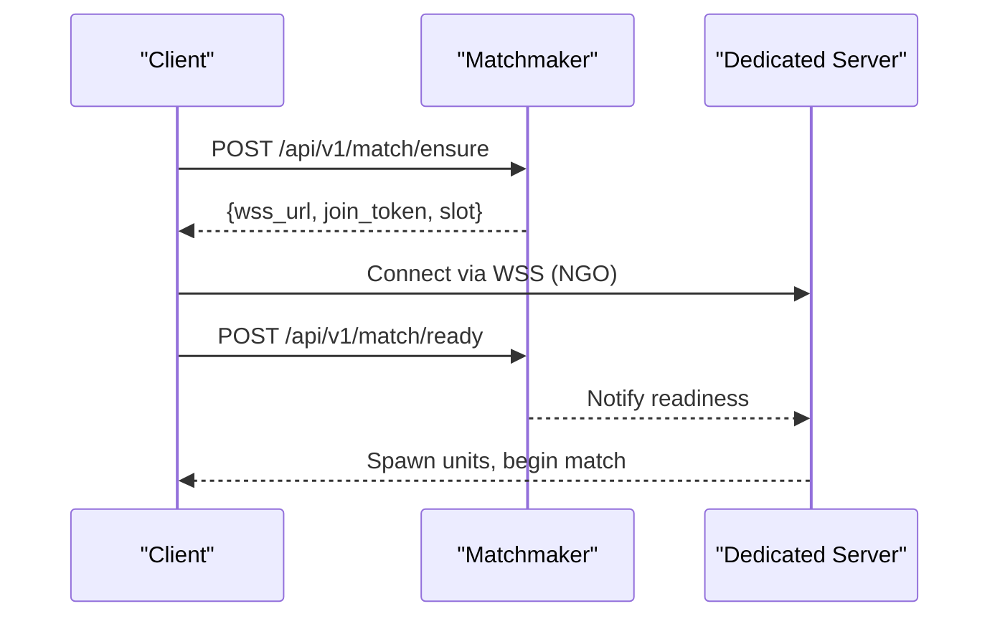
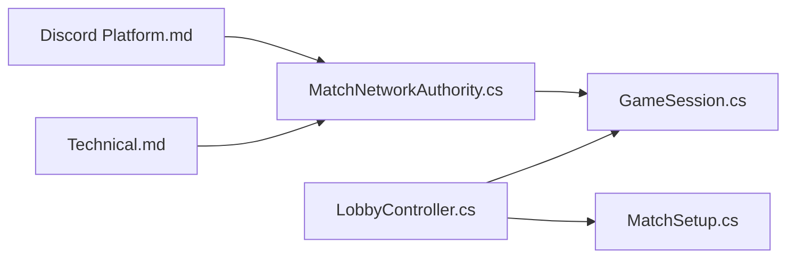

# Multiplayer & Networking

<cite>
**Referenced Files in This Document**
- [MatchNetworkAuthority.cs](file://Assets/Game/Scripts/Runtime/Gameplay/Networking/MatchNetworkAuthority.cs)
- [LobbyController.cs](file://Assets/Game/UI/Runtime/Controllers/LobbyController.cs)
- [GameSession.cs](file://Assets/Game/Scripts/Runtime/Core/GameSession.cs)
- [MatchSetup.cs](file://Assets/Game/Scripts/Runtime/Core/MatchSetup.cs)
- [Technical.md](file://Assets/Game/GameDesign/Technical.md)
- [Discord Platform.md](file://Assets/Game/GameDesign/Discord Platform.md)
</cite>

## Table of Contents
1. Introduction
2. Project Structure
3. Core Components
4. Architecture Overview
5. Detailed Component Analysis
6. Dependency Analysis
7. Performance Considerations
8. Troubleshooting Guide
9. Conclusion
10. Appendices

## Introduction
This document explains BARAKI’s multiplayer networking implementation using Netcode for GameObjects (NGO) and its integration with Discord Activity. It covers the client-server architecture, authority model, state synchronization strategy, and the MatchNetworkAuthority component that bridges NGO to the match simulation. It also documents Discord deployment requirements, WebGL build configuration, backend server setup, security considerations, debugging approaches, and migration guidance for network updates and version compatibility.

## Project Structure
The networking-related code is organized under gameplay and core systems:
- Networking bridge: Assets/Game/Scripts/Runtime/Gameplay/Networking
- UI lobby flow: Assets/Game/UI/Runtime/Controllers
- Core session and setup: Assets/Game/Scripts/Runtime/Core
- Design docs for networking and Discord platform: Assets/Game/GameDesign

**Diagram sources**
- [LobbyController.cs:1-136](file://Assets/Game/UI/Runtime/Controllers/LobbyController.cs#L1-L136)
- [GameSession.cs:1-35](file://Assets/Game/Scripts/Runtime/Core/GameSession.cs#L1-L35)
- [MatchSetup.cs:1-29](file://Assets/Game/Scripts/Runtime/Core/MatchSetup.cs#L1-L29)
- [MatchNetworkAuthority.cs:1-35](file://Assets/Game/Scripts/Runtime/Gameplay/Networking/MatchNetworkAuthority.cs#L1-L35)
- [Technical.md:65-138](file://Assets/Game/GameDesign/Technical.md#L65-L138)
- [Discord Platform.md:26-71](file://Assets/Game/GameDesign/Discord Platform.md#L26-L71)

**Section sources**
- [LobbyController.cs:1-136](file://Assets/Game/UI/Runtime/Controllers/LobbyController.cs#L1-L136)
- [GameSession.cs:1-35](file://Assets/Game/Scripts/Runtime/Core/GameSession.cs#L1-L35)
- [MatchSetup.cs:1-29](file://Assets/Game/Scripts/Runtime/Core/MatchSetup.cs#L1-L29)
- [MatchNetworkAuthority.cs:1-35](file://Assets/Game/Scripts/Runtime/Gameplay/Networking/MatchNetworkAuthority.cs#L1-L35)
- [Technical.md:65-138](file://Assets/Game/GameDesign/Technical.md#L65-L138)
- [Discord Platform.md:26-71](file://Assets/Game/GameDesign/Discord Platform.md#L26-L71)

## Core Components
- MatchNetworkAuthority: A server-only NetworkBehaviour scaffold that bridges NGO lifecycle to the match runtime. It ensures the match runtime reference exists on spawn and provides a hook to drive authoritative ticks when NGO sessions are active.
- LobbyController: Manages the lobby UI, transitions into gameplay, and triggers the session start with a default or configured MatchSetup.
- GameSession: Global session state signaling entry into gameplay and carrying the active MatchSetup.
- MatchSetup: Encapsulates lobby-to-match handoff parameters such as player count, local slot, and race selections.

Key responsibilities:
- Authority boundary: Only server-side logic drives match simulation; clients render and send requests.
- Session orchestration: UI initiates gameplay via GameSession and MatchSetup.
- MVP bridging: MatchNetworkAuthority prepares for full replication while current simulation runs in pure C#.

**Section sources**
- [MatchNetworkAuthority.cs:1-35](file://Assets/Game/Scripts/Runtime/Gameplay/Networking/MatchNetworkAuthority.cs#L1-L35)
- [LobbyController.cs:1-136](file://Assets/Game/UI/Runtime/Controllers/LobbyController.cs#L1-L136)
- [GameSession.cs:1-35](file://Assets/Game/Scripts/Runtime/Core/GameSession.cs#L1-L35)
- [MatchSetup.cs:1-29](file://Assets/Game/Scripts/Runtime/Core/MatchSetup.cs#L1-L29)

## Architecture Overview
BARAKI uses a dedicated server per match with WebGL clients running inside Discord Activity. The production transport is WebSockets/WSS. The design mandates server-authoritative simulation at 30 Hz, with clients rendering only.

**Diagram sources**
- [Discord Platform.md:76-103](file://Assets/Game/GameDesign/Discord Platform.md#L76-L103)
- [Technical.md:65-138](file://Assets/Game/GameDesign/Technical.md#L65-L138)

**Section sources**
- [Discord Platform.md:26-71](file://Assets/Game/GameDesign/Discord Platform.md#L26-L71)
- [Technical.md:65-138](file://Assets/Game/GameDesign/Technical.md#L65-L138)

## Detailed Component Analysis

### MatchNetworkAuthority
Purpose:
- Acts as the server-only bridge between NGO and the match runtime.
- Ensures the match runtime reference is available after spawn.
- Provides an Update hook to integrate authoritative ticking once NGO sessions are active.

Behavior highlights:
- OnNetworkSpawn resolves the match runtime if not assigned.
- Update guards execution to server instances only.
- Comments indicate future gating of match runtime updates behind IsServer.

**Diagram sources**
- [MatchNetworkAuthority.cs:1-35](file://Assets/Game/Scripts/Runtime/Gameplay/Networking/MatchNetworkAuthority.cs#L1-L35)

**Section sources**
- [MatchNetworkAuthority.cs:1-35](file://Assets/Game/Scripts/Runtime/Gameplay/Networking/MatchNetworkAuthority.cs#L1-L35)

### Lobby to Gameplay Flow
Responsibilities:
- LobbyController handles UI interactions and scene transitions.
- GameSession signals gameplay entry and holds the active MatchSetup.
- MatchSetup carries lobby parameters into the match.

**Diagram sources**
- [LobbyController.cs:80-107](file://Assets/Game/UI/Runtime/Controllers/LobbyController.cs#L80-L107)
- [GameSession.cs:16-26](file://Assets/Game/Scripts/Runtime/Core/GameSession.cs#L16-L26)
- [MatchSetup.cs:12-26](file://Assets/Game/Scripts/Runtime/Core/MatchSetup.cs#L12-L26)

**Section sources**
- [LobbyController.cs:1-136](file://Assets/Game/UI/Runtime/Controllers/LobbyController.cs#L1-L136)
- [GameSession.cs:1-35](file://Assets/Game/Scripts/Runtime/Core/GameSession.cs#L1-L35)
- [MatchSetup.cs:1-29](file://Assets/Game/Scripts/Runtime/Core/MatchSetup.cs#L1-L29)

### Authority Model and State Synchronization
- Production model: Dedicated headless server per match; all clients are WebGL in Discord.
- Simulation authority: Server simulates movement, combat, spawning, waves, gold, purchases, building damage, and unit positions. Clients render only.
- Tick rate: 30 Hz server tick; spawn/wave timers are per-barracks and not tied to tick.
- Client prediction: Disabled in MVP; interpolation may be optional later.

**Diagram sources**
- [Technical.md:94-127](file://Assets/Game/GameDesign/Technical.md#L94-L127)

**Section sources**
- [Technical.md:65-138](file://Assets/Game/GameDesign/Technical.md#L65-L138)

### Message Passing and Connection Handling (Protocol Examples)
While specific message classes are not present in the analyzed files, the documented protocol outlines the following patterns:

- Matchmaking handshake:
  - Client calls POST /api/v1/match/ensure with instance_id, player_count, discord_user_id, access_token.
  - Response includes match_id, wss_url, join_token, slot.
- Readiness:
  - Clients call POST /api/v1/match/ready with match_id, join_token, race_id.
  - When all players are ready, the game server starts countdown.
- Late join:
  - GET /api/v1/match/{instance_id} supports idempotent joins during lobby phase.

Connection handling:
- WebGL clients connect to the dedicated server via WSS using NGO’s WebSocket transport.
- Server listens on 0.0.0.0 and exposes a secure endpoint through TLS.

**Diagram sources**
- [Discord Platform.md:263-276](file://Assets/Game/GameDesign/Discord Platform.md#L263-L276)
- [Discord Platform.md:280-286](file://Assets/Game/GameDesign/Discord Platform.md#L280-L286)

**Section sources**
- [Discord Platform.md:263-276](file://Assets/Game/GameDesign/Discord Platform.md#L263-L276)
- [Discord Platform.md:280-286](file://Assets/Game/GameDesign/Discord Platform.md#L280-L286)

### Real-time Interaction Patterns
- Client requests (e.g., tower target, hero summon) are sent to the server for validation.
- Server validates inputs against rules and applies deterministic outcomes.
- Clients receive replicated state and render accordingly without predicting movement.

[No sources needed since this section summarizes established patterns from referenced docs]

## Dependency Analysis
High-level dependencies among networking components:
- LobbyController depends on GameSession and MatchSetup to initiate gameplay.
- MatchNetworkAuthority depends on the match runtime and NGO lifecycle hooks.
- Technical and Discord Platform docs define constraints and architecture decisions that guide implementation.

**Diagram sources**
- [LobbyController.cs:1-136](file://Assets/Game/UI/Runtime/Controllers/LobbyController.cs#L1-L136)
- [GameSession.cs:1-35](file://Assets/Game/Scripts/Runtime/Core/GameSession.cs#L1-L35)
- [MatchSetup.cs:1-29](file://Assets/Game/Scripts/Runtime/Core/MatchSetup.cs#L1-L29)
- [MatchNetworkAuthority.cs:1-35](file://Assets/Game/Scripts/Runtime/Gameplay/Networking/MatchNetworkAuthority.cs#L1-L35)
- [Technical.md:65-138](file://Assets/Game/GameDesign/Technical.md#L65-L138)
- [Discord Platform.md:26-71](file://Assets/Game/GameDesign/Discord Platform.md#L26-L71)

**Section sources**
- [LobbyController.cs:1-136](file://Assets/Game/UI/Runtime/Controllers/LobbyController.cs#L1-L136)
- [GameSession.cs:1-35](file://Assets/Game/Scripts/Runtime/Core/GameSession.cs#L1-L35)
- [MatchSetup.cs:1-29](file://Assets/Game/Scripts/Runtime/Core/MatchSetup.cs#L1-L29)
- [MatchNetworkAuthority.cs:1-35](file://Assets/Game/Scripts/Runtime/Gameplay/Networking/MatchNetworkAuthority.cs#L1-L35)
- [Technical.md:65-138](file://Assets/Game/GameDesign/Technical.md#L65-L138)
- [Discord Platform.md:26-71](file://Assets/Game/GameDesign/Discord Platform.md#L26-L71)

## Performance Considerations
- Server tick rate is fixed at 30 Hz; avoid heavy work per tick.
- Offload non-tick-dependent tasks (spawn/wave scheduling) to per-barracks timers.
- Keep client-side logic minimal; focus on rendering and input forwarding.
- Optimize WebGL build size and memory usage due to iframe constraints.

[No sources needed since this section provides general guidance]

## Troubleshooting Guide
Common issues and checks:
- WebGL cannot act as a listen server in Discord; ensure dedicated headless server is used in production.
- Validate TLS and WSS endpoints; browsers require secure connections.
- Use URL mappings/proxy for HTTP calls to the matchmaker from within Discord Activity.
- For dev testing, use host-client mode locally but do not ship it for Discord.

Operational tips:
- Monitor matchmaker logs for correct instance verification and slot assignment.
- Inspect server logs for connection acceptance and tick consistency.
- Verify that clients connect via WSS and receive authoritative state updates.

**Section sources**
- [Discord Platform.md:39-43](file://Assets/Game/GameDesign/Discord Platform.md#L39-L43)
- [Discord Platform.md:111-116](file://Assets/Game/GameDesign/Discord Platform.md#L111-L116)
- [Technical.md:81-92](file://Assets/Game/GameDesign/Technical.md#L81-L92)

## Conclusion
BARAKI’s networking approach centers on a dedicated, authoritative server with WebGL clients in Discord Activity. The MVP scaffolding introduces MatchNetworkAuthority to bridge NGO to the match runtime, while UI and session management coordinate match setup and transitions. The documented architecture enforces clear authority boundaries, predictable tick-driven simulation, and secure transport. Following the provided deployment and security guidelines will enable reliable playtests and smooth migration toward production.

[No sources needed since this section summarizes without analyzing specific files]

## Appendices

### Security Considerations
- Authentication:
  - Use Discord OAuth tokens and verify Activity Instance membership via the backend.
- Authorization:
  - Enforce server-side validation for all actions (spawns, purchases, combat).
- Anti-cheat measures:
  - Disallow client-side movement and critical state mutations.
  - Validate timing and action rates on the server.
  - Reject out-of-range inputs and enforce deterministic rules.

**Section sources**
- [Technical.md:115-127](file://Assets/Game/GameDesign/Technical.md#L115-L127)
- [Discord Platform.md:63-71](file://Assets/Game/GameDesign/Discord Platform.md#L63-L71)

### WebGL Build Configuration
- Target Unity WebGL for Activity delivery.
- Ensure HTTPS hosting and proper CSP settings.
- Minimize asset sizes and VFX to fit browser constraints.
- Configure simplified renderer profile if necessary.

**Section sources**
- [Discord Platform.md:313-319](file://Assets/Game/GameDesign/Discord Platform.md#L313-L319)

### Backend Server Setup
- Headless Unity server build targeting Linux Server with batchmode and no graphics.
- Environment variables: MATCH_ID, PLAYER_COUNT, PORT.
- Transport: WebSockets listening on 0.0.0.0.
- Expose via secure reverse proxy with valid TLS.

**Section sources**
- [Discord Platform.md:280-286](file://Assets/Game/GameDesign/Discord Platform.md#L280-L286)

### Migration and Backwards Compatibility Notes
- Versioning:
  - Maintain a stable match protocol contract; increment API versions when changing matchmaking payloads.
- Reconnect readiness:
  - Persist player_slot_id and session token to support reconnect flows.
- Transition path:
  - Move authoritative ticking into MatchNetworkAuthority and gate MatchRuntime updates behind IsServer.
  - Introduce replication gradually while keeping server authority intact.

**Section sources**
- [Technical.md:123-127](file://Assets/Game/GameDesign/Technical.md#L123-L127)
- [MatchNetworkAuthority.cs:23-32](file://Assets/Game/Scripts/Runtime/Gameplay/Networking/MatchNetworkAuthority.cs#L23-L32)