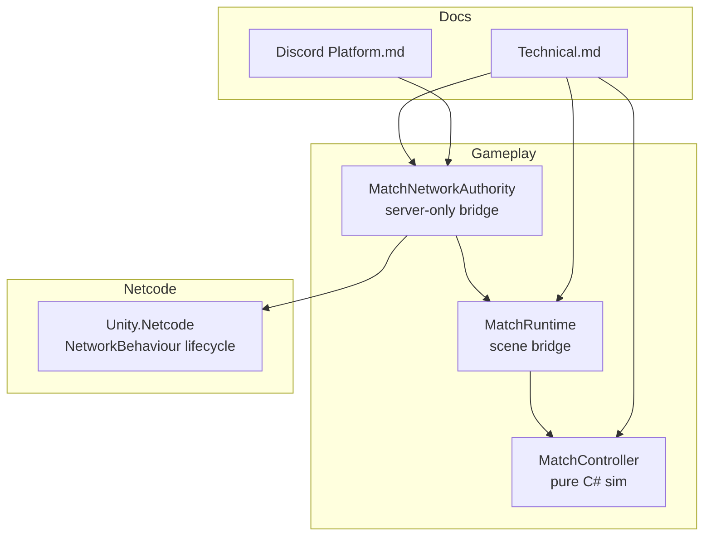
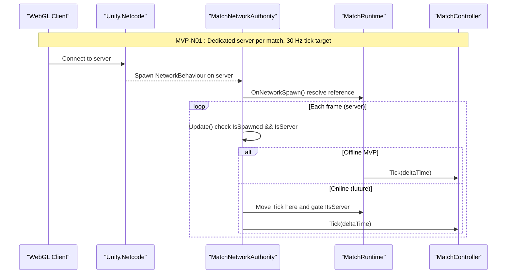
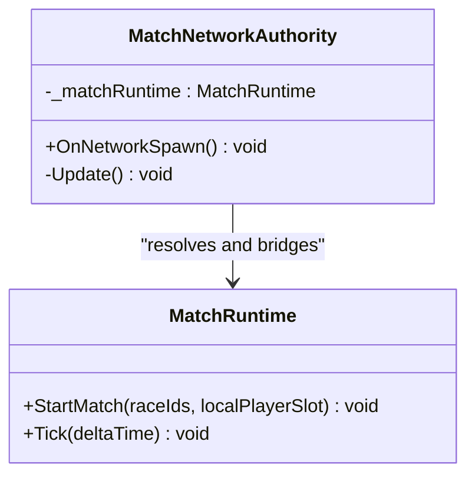
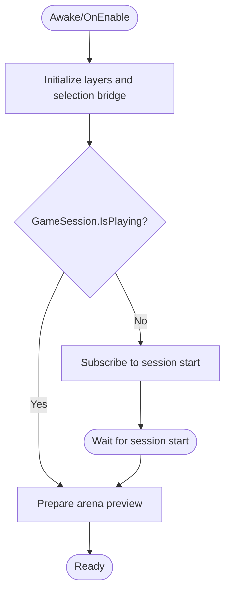
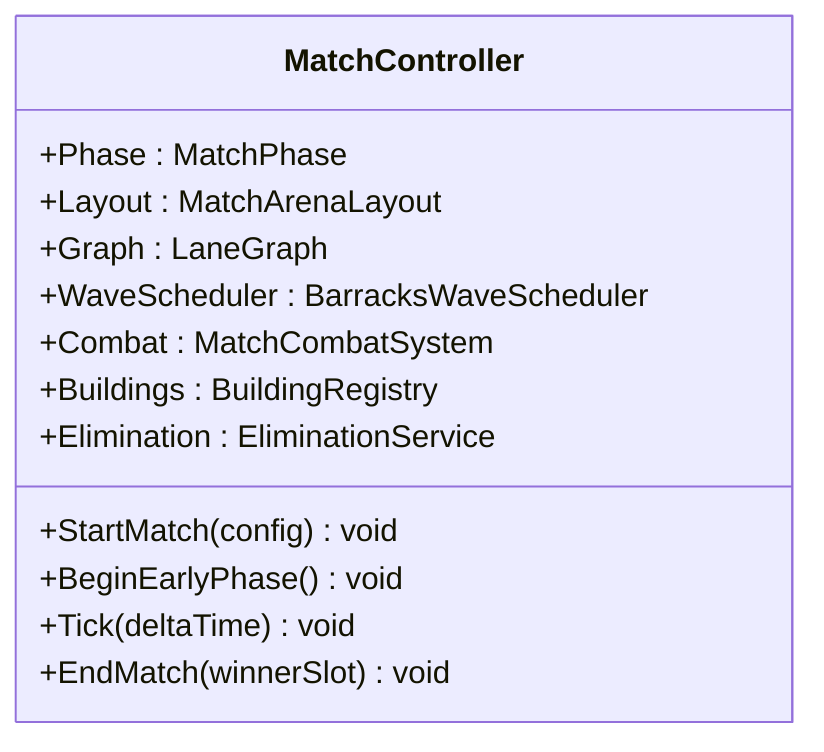
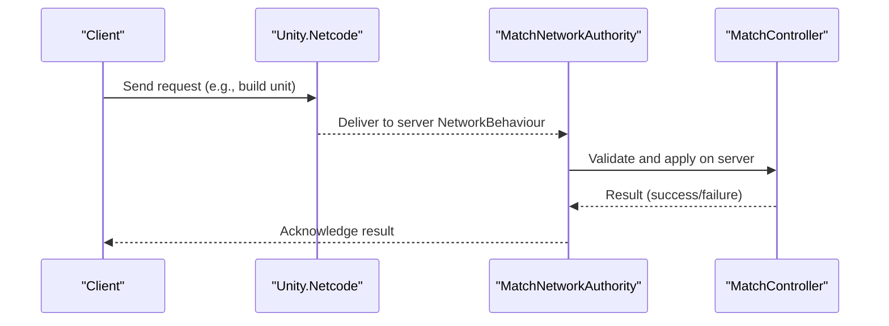
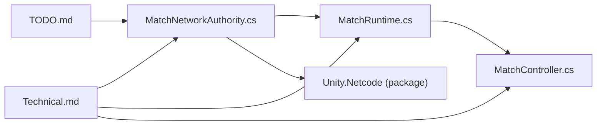

# Netcode Implementation

<cite>
**Referenced Files in This Document**
- [MatchNetworkAuthority.cs](file://Assets/Game/Scripts/Runtime/Gameplay/Networking/MatchNetworkAuthority.cs)
- [MatchRuntime.cs](file://Assets/Game/Scripts/Runtime/Gameplay/Match/MatchRuntime.cs)
- [MatchController.cs](file://Assets/Game/Scripts/Runtime/Gameplay/Match/MatchController.cs)
- [Technical.md](file://Assets/Game/GameDesign/Technical.md)
- [Discord Platform.md](file://Assets/Game/GameDesign/Discord Platform.md)
- [TODO.md](file://Assets/Game/GameDesign/TODO.md)
- [DefaultNetworkPrefabs.asset](file://Assets/DefaultNetworkPrefabs.asset)
</cite>

## Table of Contents
1. [Introduction](#introduction)
2. [Project Structure](#project-structure)
3. [Core Components](#core-components)
4. [Architecture Overview](#architecture-overview)
5. [Detailed Component Analysis](#detailed-component-analysis)
6. [Dependency Analysis](#dependency-analysis)
7. [Performance Considerations](#performance-considerations)
8. [Troubleshooting Guide](#troubleshooting-guide)
9. [Conclusion](#conclusion)
10. [Appendices](#appendices)

## Introduction
This document explains BARAKI’s Netcode for GameObjects (NGO) implementation with a focus on the MVP-N01 architecture. The current design keeps match simulation in pure C# and uses a server-only bridge component to connect NGO with the match runtime. Authority is strictly server-side; clients are render-only. The goal is to provide clear guidance on network spawning, authority models, command processing patterns, and state synchronization strategies while preparing for future replication.

## Project Structure
The networking-related code is organized under Game.Gameplay:
- Networking: MatchNetworkAuthority (server-only bridge)
- Match: MatchRuntime (scene bridge), MatchController (pure C# authoritative simulation)
- Design docs define production model (dedicated server per match), tick rate, and authority rules

**Diagram sources**
- [MatchNetworkAuthority.cs:1-34](file://Assets/Game/Scripts/Runtime/Gameplay/Networking/MatchNetworkAuthority.cs#L1-L34)
- [MatchRuntime.cs:1-200](file://Assets/Game/Scripts/Runtime/Gameplay/Match/MatchRuntime.cs#L1-L200)
- [MatchController.cs:1-205](file://Assets/Game/Scripts/Runtime/Gameplay/Match/MatchController.cs#L1-L205)
- [Technical.md:38-185](file://Assets/Game/GameDesign/Technical.md#L38-L185)
- [Discord Platform.md:1-52](file://Assets/Game/GameDesign/Discord Platform.md#L1-L52)

**Section sources**
- [Technical.md:38-185](file://Assets/Game/GameDesign/Technical.md#L38-L185)
- [Discord Platform.md:1-52](file://Assets/Game/GameDesign/Discord Platform.md#L1-L52)

## Core Components
- MatchNetworkAuthority: A NetworkBehaviour that acts as the server-only bridge between NGO and MatchRuntime. It finds MatchRuntime at spawn and provides a hook to drive server ticks when NGO sessions are active.
- MatchRuntime: Scene-level bridge that prepares the arena and starts MatchController after race pick. It also drives local Tick during offline MVP.
- MatchController: Pure C# authoritative orchestrator managing phases, waves, combat, buildings, and elimination.

Key responsibilities:
- Server-only execution gating via IsServer
- Separation of concerns: networking bridge vs. scene bridge vs. simulation
- Clear path to move Tick into the network loop and gate client updates

**Section sources**
- [MatchNetworkAuthority.cs:1-34](file://Assets/Game/Scripts/Runtime/Gameplay/Networking/MatchNetworkAuthority.cs#L1-L34)
- [MatchRuntime.cs:1-200](file://Assets/Game/Scripts/Runtime/Gameplay/Match/MatchRuntime.cs#L1-L200)
- [MatchController.cs:1-205](file://Assets/Game/Scripts/Runtime/Gameplay/Match/MatchController.cs#L1-L205)

## Architecture Overview
MVP-N01 defines a dedicated server per match with WebGL clients in Discord. Simulation remains in pure C# until full replication is implemented. Authority is centralized on the server; clients render only.

**Diagram sources**
- [MatchNetworkAuthority.cs:1-34](file://Assets/Game/Scripts/Runtime/Gameplay/Networking/MatchNetworkAuthority.cs#L1-L34)
- [MatchRuntime.cs:67-76](file://Assets/Game/Scripts/Runtime/Gameplay/Match/MatchRuntime.cs#L67-L76)
- [MatchController.cs:100-126](file://Assets/Game/Scripts/Runtime/Gameplay/Match/MatchController.cs#L100-L126)
- [Technical.md:94-111](file://Assets/Game/GameDesign/Technical.md#L94-L111)
- [Discord Platform.md:26-52](file://Assets/Game/GameDesign/Discord Platform.md#L26-L52)

## Detailed Component Analysis

### MatchNetworkAuthority (Server-only Bridge)
Purpose:
- Bridges NGO lifecycle to MatchRuntime
- Provides a server-only update hook to integrate with NGO’s server loop
- Keeps simulation decoupled from Unity lifecycle until replication

Behavior:
- OnNetworkSpawn resolves MatchRuntime if not assigned
- Update gates logic by IsSpawned and IsServer
- Comments indicate migration path: move Tick into this component and gate MatchRuntime.Update to !IsServer

**Diagram sources**
- [MatchNetworkAuthority.cs:1-34](file://Assets/Game/Scripts/Runtime/Gameplay/Networking/MatchNetworkAuthority.cs#L1-L34)
- [MatchRuntime.cs:98-147](file://Assets/Game/Scripts/Runtime/Gameplay/Match/MatchRuntime.cs#L98-L147)

**Section sources**
- [MatchNetworkAuthority.cs:1-34](file://Assets/Game/Scripts/Runtime/Gameplay/Networking/MatchNetworkAuthority.cs#L1-L34)

### MatchRuntime (Scene Bridge)
Responsibilities:
- Initializes selection bridge and arena preview
- Starts MatchController after race pick validation
- Drives local Tick for offline MVP
- Manages early phase transition when camera pan is unlocked

**Diagram sources**
- [MatchRuntime.cs:32-65](file://Assets/Game/Scripts/Runtime/Gameplay/Match/MatchRuntime.cs#L32-L65)

**Section sources**
- [MatchRuntime.cs:1-200](file://Assets/Game/Scripts/Runtime/Gameplay/Match/MatchRuntime.cs#L1-L200)

### MatchController (Pure C# Authoritative Simulation)
Responsibilities:
- Orchestrates match phases, arena layout, lanes, waves, combat, buildings, and elimination
- Exposes Tick(float deltaTime) for deterministic updates
- Emits events for wave firing, unit kills, and match end

**Diagram sources**
- [MatchController.cs:1-205](file://Assets/Game/Scripts/Runtime/Gameplay/Match/MatchController.cs#L1-L205)

**Section sources**
- [MatchController.cs:1-205](file://Assets/Game/Scripts/Runtime/Gameplay/Match/MatchController.cs#L1-L205)

### Network Spawning and Prefab Registration
- DefaultNetworkPrefabs asset exists but currently has an empty list. Add any NetworkObject prefabs (e.g., units, buildings) to this list so they can be spawned across the network.
- Ensure each NetworkObject prefab has a NetworkObject component and is registered before spawning.

**Section sources**
- [DefaultNetworkPrefabs.asset:1-16](file://Assets/DefaultNetworkPrefabs.asset#L1-L16)

### Authority Model and Command Processing Patterns
- Authority: All gameplay-critical systems (spawn/waves, gold/purchases, building damage, targeting) run on the server. Clients are render-only.
- Command pattern: Clients send intent requests (e.g., tower target, hero summon). Server validates and applies changes.
- State sync: Server publishes authoritative state (positions, HP, resources) to clients for rendering.

These decisions are documented in the technical design and align with MVP-N01 constraints.

**Section sources**
- [Technical.md:103-126](file://Assets/Game/GameDesign/Technical.md#L103-L126)

### RPC Calls and State Synchronization Strategies
- Use NetworkBehaviour methods to implement server-only commands and client-to-server requests.
- For state synchronization, prefer sending minimal deltas or snapshots from server to clients.
- Keep heavy calculations on the server; clients interpolate for smooth visuals.

[No sources needed since this section provides general guidance]

### Example Scenarios

#### Client-Server Communication Flow (Request → Validate → Apply)

[No sources needed since this diagram shows conceptual workflow, not actual code structure]

#### Connection Handling and Lifecycle Management
- Production: Dedicated headless server per match; WebGL clients connect via WebSocket/WSS.
- Dev: Host-client mode for quick tests (not shipping).
- Reconnect-ready: Persist player slot ID and session token for rejoin flows.

**Section sources**
- [Discord Platform.md:26-52](file://Assets/Game/GameDesign/Discord Platform.md#L26-L52)
- [Technical.md:65-101](file://Assets/Game/GameDesign/Technical.md#L65-L101)

## Dependency Analysis
High-level dependencies among core components and documentation:

**Diagram sources**
- [MatchNetworkAuthority.cs:1-34](file://Assets/Game/Scripts/Runtime/Gameplay/Networking/MatchNetworkAuthority.cs#L1-L34)
- [MatchRuntime.cs:1-200](file://Assets/Game/Scripts/Runtime/Gameplay/Match/MatchRuntime.cs#L1-L200)
- [MatchController.cs:1-205](file://Assets/Game/Scripts/Runtime/Gameplay/Match/MatchController.cs#L1-L205)
- [Technical.md:38-185](file://Assets/Game/GameDesign/Technical.md#L38-L185)
- [TODO.md:42-66](file://Assets/Game/GameDesign/TODO.md#L42-L66)

**Section sources**
- [Technical.md:38-185](file://Assets/Game/GameDesign/Technical.md#L38-L185)
- [TODO.md:42-66](file://Assets/Game/GameDesign/TODO.md#L42-L66)

## Performance Considerations
- Target tick rate: 30 Hz for server simulation and sync.
- Unit movement and combat are server-simulated; clients render only.
- Pooling is mandatory due to potential high unit counts (up to ~14 units per lane per barracks level).
- Spread and spline march computations occur on the server; avoid client-side movement.
- Center arena targeting should use spatial partitioning to reduce overhead.

**Section sources**
- [Technical.md:161-171](file://Assets/Game/GameDesign/Technical.md#L161-L171)
- [Technical.md:103-111](file://Assets/Game/GameDesign/Technical.md#L103-L111)

## Troubleshooting Guide
Common issues and checks:
- Missing NetworkObject registration: Ensure all spawneable prefabs are added to DefaultNetworkPrefabs.
- Server tick not running: Verify IsSpawned and IsServer checks in the bridge; confirm NGO session is active.
- Race pick mismatch: Validate PlayerCount and raceIds length before starting the match.
- Camera pan lock preventing early phase: Check pan controller state before transitioning phases.

**Section sources**
- [DefaultNetworkPrefabs.asset:1-16](file://Assets/DefaultNetworkPrefabs.asset#L1-L16)
- [MatchNetworkAuthority.cs:23-32](file://Assets/Game/Scripts/Runtime/Gameplay/Networking/MatchNetworkAuthority.cs#L23-L32)
- [MatchRuntime.cs:98-147](file://Assets/Game/Scripts/Runtime/Gameplay/Match/MatchRuntime.cs#L98-L147)
- [MatchRuntime.cs:78-96](file://Assets/Game/Scripts/Runtime/Gameplay/Match/MatchRuntime.cs#L78-L96)

## Conclusion
BARAKI’s MVP-N01 netcode centers on a server-authoritative, pure C# simulation bridged to NGO via MatchNetworkAuthority. This approach ensures strong anti-cheat posture and deterministic gameplay while keeping the client lightweight. As replication matures, the plan is to move Tick into the network loop and gate client updates accordingly. The architecture supports production goals (dedicated server, WebGL clients) and dev workflows (host-client testing).

## Appendices

### MVP Tasks and Status
- MVP-N01: NGO + WebSocket transport scaffold (in progress)
- MVP-N02: Lobby flow and race pick integration (in progress)
- MVP-N03: Server-authoritative gold and spawn (pending)

**Section sources**
- [TODO.md:42-66](file://Assets/Game/GameDesign/TODO.md#L42-L66)