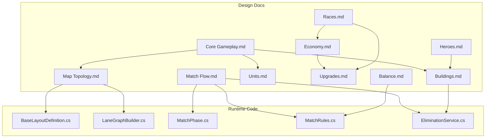
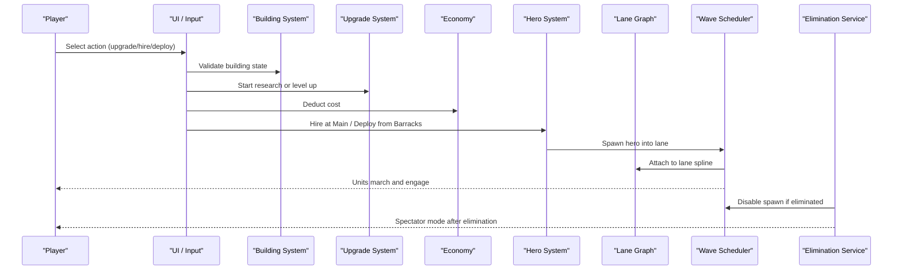
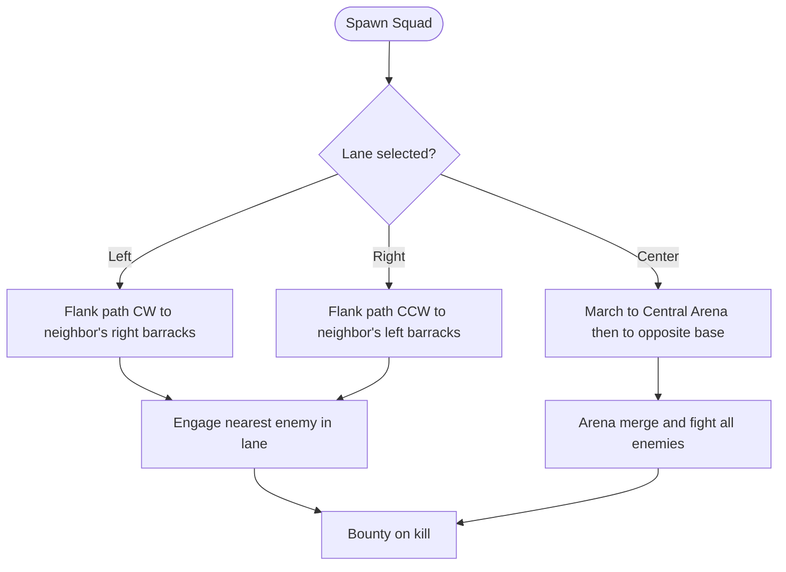
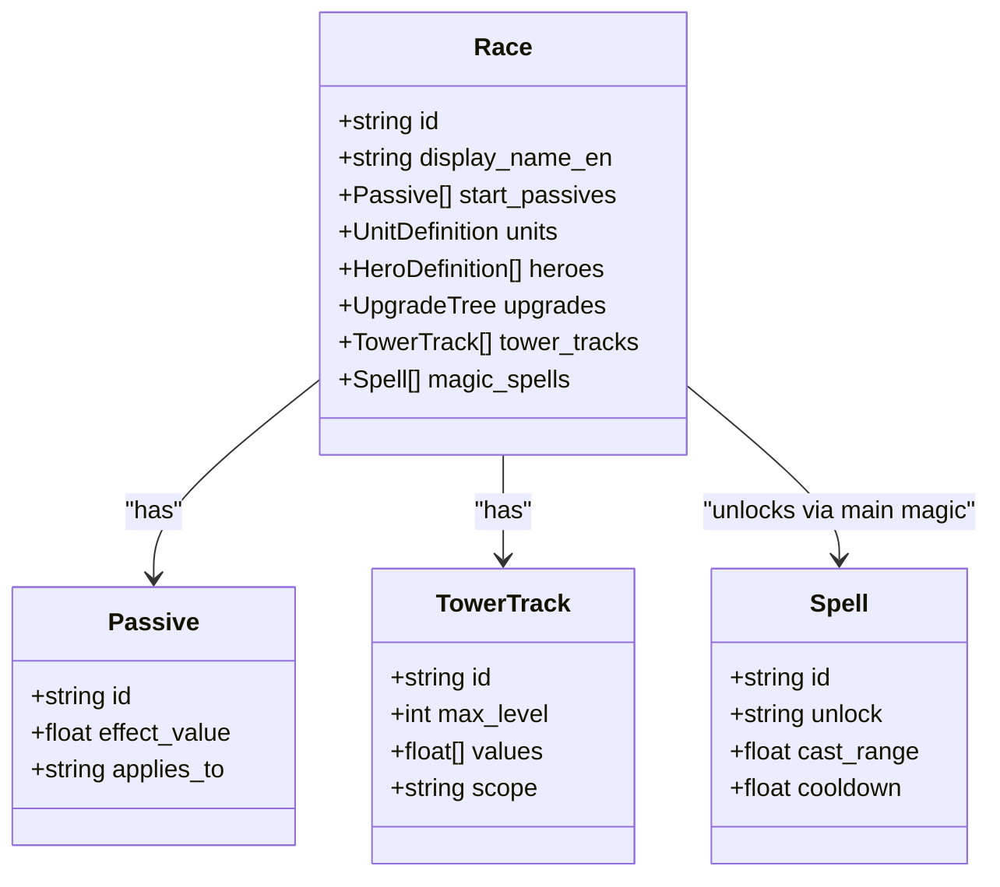
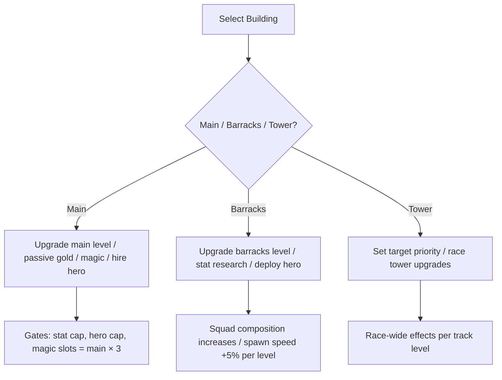
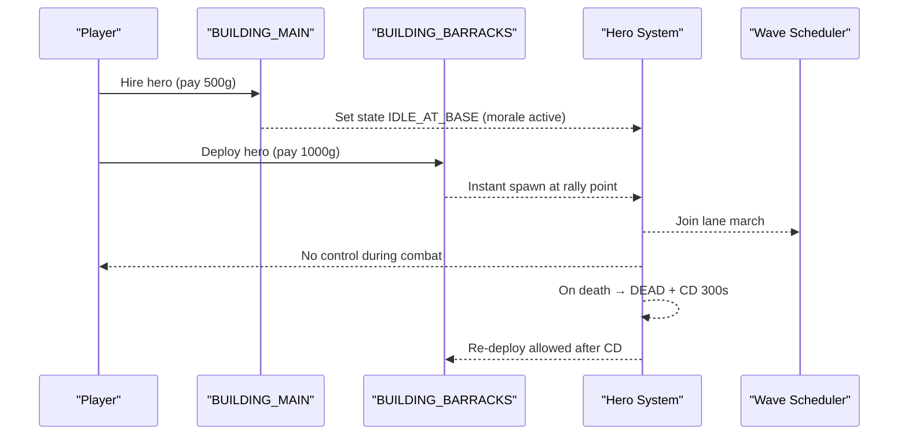
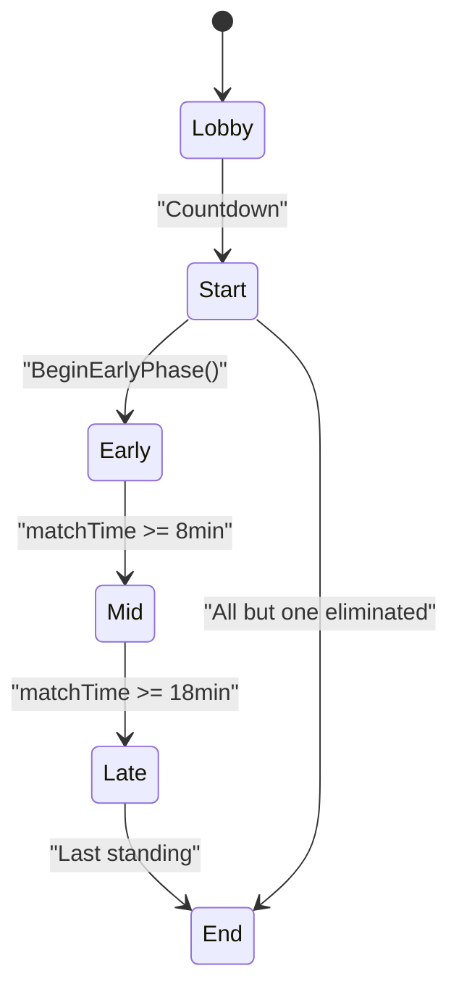
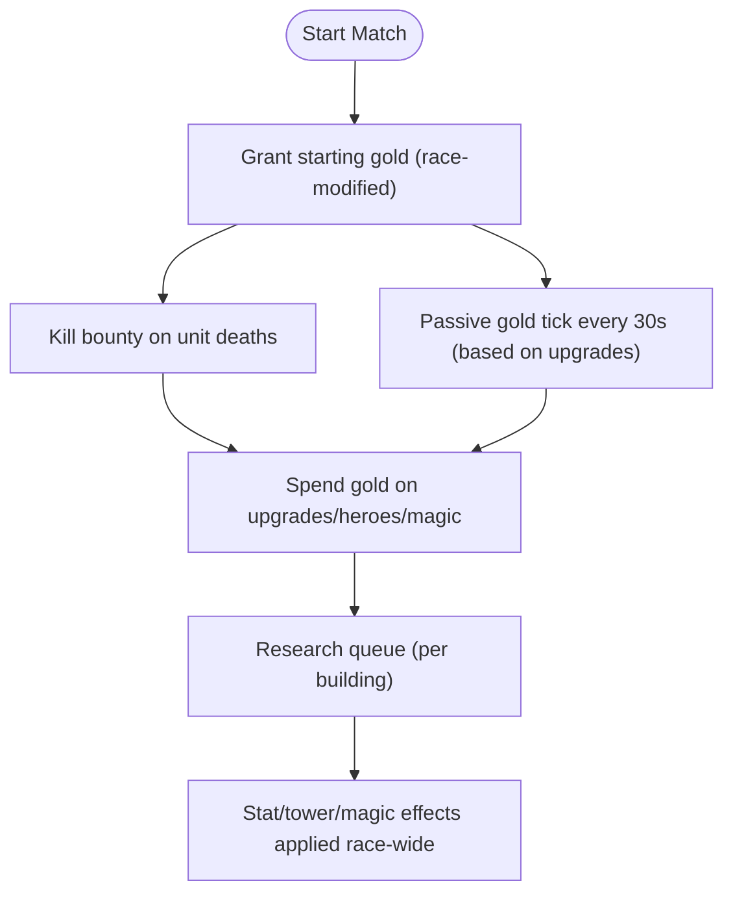
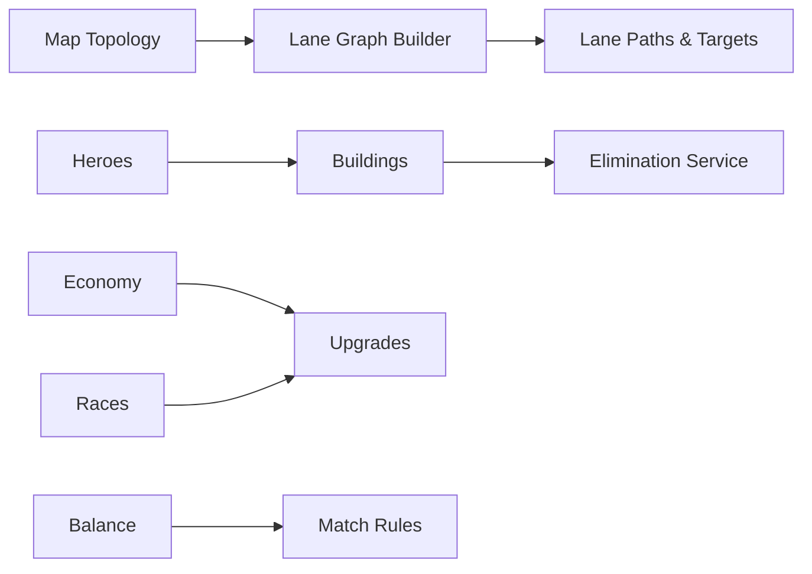

# Core Features Overview

<cite>
**Referenced Files in This Document**
- [Core Gameplay.md](file://Assets/Game/GameDesign/Core%20Gameplay.md)
- [Match Flow.md](file://Assets/Game/GameDesign/Match%20Flow.md)
- [Economy.md](file://Assets/Game/GameDesign/Economy.md)
- [Heroes.md](file://Assets/Game/GameDesign/Heroes.md)
- [Buildings.md](file://Assets/Game/GameDesign/Buildings.md)
- [Units.md](file://Assets/Game/GameDesign/Units.md)
- [Upgrades.md](file://Assets/Game/GameDesign/Upgrades.md)
- [Races.md](file://Assets/Game/GameDesign/Races.md)
- [Map Topology.md](file://Assets/Game/GameDesign/Map%20Topology.md)
- [Balance.md](file://Assets/Game/GameDesign/Balance.md)
- [BaseLayoutDefinition.cs](file://Assets/Game/Scripts/Runtime/Gameplay/Match/BaseLayoutDefinition.cs)
- [LaneGraphBuilder.cs](file://Assets/Game/Scripts/Runtime/Gameplay/Match/LaneGraphBuilder.cs)
- [MatchPhase.cs](file://Assets/Game/Scripts/Runtime/Gameplay/Match/MatchPhase.cs)
- [MatchRules.cs](file://Assets/Game/Scripts/Runtime/Gameplay/Match/MatchRules.cs)
- [EliminationService.cs](file://Assets/Game/Scripts/Runtime/Gameplay/Match/EliminationService.cs)
</cite>

## Table of Contents
1. [Introduction](#introduction)
2. [Project Structure](#project-structure)
3. [Core Components](#core-components)
4. [Architecture Overview](#architecture-overview)
5. [Detailed Component Analysis](#detailed-component-analysis)
6. [Dependency Analysis](#dependency-analysis)
7. [Performance Considerations](#performance-considerations)
8. [Troubleshooting Guide](#troubleshooting-guide)
9. [Conclusion](#conclusion)
10. [Appendices](#appendices)

## Introduction
This document explains BARAKI’s core gameplay systems: lane-based combat, race asymmetry, building management and upgrades, hero summoning and deployment, match flow and victory conditions, and the economic model. It synthesizes design documents with runtime code to provide a clear, actionable overview for both designers and developers.

## Project Structure
BARAKI’s core features are defined primarily through design documents under GameDesign and implemented via runtime scripts under Scripts/Runtime. The key areas relevant to this overview include:
- Lane topology and graph generation (map layout, flank/center lanes)
- Match phases and elimination logic
- Building definitions and destruction effects
- Unit compositions and combat behavior
- Economy rules and upgrade trees
- Race-specific passives, magic, and tower upgrades
- Hero hire/deploy mechanics and morale bonuses

**Diagram sources**
- [Core Gameplay.md:1-125](file://Assets/Game/GameDesign/Core%20Gameplay.md#L1-L125)
- [Match Flow.md:1-242](file://Assets/Game/GameDesign/Match%20Flow.md#L1-L242)
- [Economy.md:1-123](file://Assets/Game/GameDesign/Economy.md#L1-L123)
- [Heroes.md:1-219](file://Assets/Game/GameDesign/Heroes.md#L1-L219)
- [Buildings.md:1-293](file://Assets/Game/GameDesign/Buildings.md#L1-L293)
- [Units.md:1-294](file://Assets/Game/GameDesign/Units.md#L1-L294)
- [Upgrades.md:1-211](file://Assets/Game/GameDesign/Upgrades.md#L1-L211)
- [Races.md:1-491](file://Assets/Game/GameDesign/Races.md#L1-L491)
- [Map Topology.md:1-269](file://Assets/Game/GameDesign/Map%20Topology.md#L1-L269)
- [Balance.md:1-155](file://Assets/Game/GameDesign/Balance.md#L1-L155)
- [BaseLayoutDefinition.cs:31-67](file://Assets/Game/Scripts/Runtime/Gameplay/Match/BaseLayoutDefinition.cs#L31-L67)
- [LaneGraphBuilder.cs:96-134](file://Assets/Game/Scripts/Runtime/Gameplay/Match/LaneGraphBuilder.cs#L96-L134)
- [MatchPhase.cs:1-13](file://Assets/Game/Scripts/Runtime/Gameplay/Match/MatchPhase.cs#L1-L13)
- [MatchRules.cs:1-46](file://Assets/Game/Scripts/Runtime/Gameplay/Match/MatchRules.cs#L1-L46)
- [EliminationService.cs:1-82](file://Assets/Game/Scripts/Runtime/Gameplay/Match/EliminationService.cs#L1-L82)

**Section sources**
- [Core Gameplay.md:1-125](file://Assets/Game/GameDesign/Core%20Gameplay.md#L1-L125)
- [Match Flow.md:1-242](file://Assets/Game/GameDesign/Match%20Flow.md#L1-L242)
- [Map Topology.md:1-269](file://Assets/Game/GameDesign/Map%20Topology.md#L1-L269)

## Core Components
- Lane-based combat: Left flank, center lane, right flank define opponent targeting and gold models.
- Race system: Multiple factions with unique passives, caster spells, and tower upgrades.
- Building management: Main hall, barracks per lane, towers; upgrades, research queues, and destruction states.
- Hero system: Hire at main, deploy from barracks, morale bonuses when idle.
- Match flow: Phases, win condition (last standing), elimination when all buildings destroyed.
- Economy: Gold income from kills and passive ticks; spending on upgrades, heroes, and magic.

**Section sources**
- [Core Gameplay.md:34-125](file://Assets/Game/GameDesign/Core%20Gameplay.md#L34-L125)
- [Buildings.md:36-112](file://Assets/Game/GameDesign/Buildings.md#L36-L112)
- [Heroes.md:1-219](file://Assets/Game/GameDesign/Heroes.md#L1-L219)
- [Match Flow.md:74-132](file://Assets/Game/GameDesign/Match%20Flow.md#L74-L132)
- [Economy.md:24-123](file://Assets/Game/GameDesign/Economy.md#L24-L123)

## Architecture Overview
The game uses a data-driven architecture where design documents define entities and formulas, while runtime code implements phase transitions, lane graphs, and elimination checks.

**Diagram sources**
- [Buildings.md:255-276](file://Assets/Game/GameDesign/Buildings.md#L255-L276)
- [Upgrades.md:185-211](file://Assets/Game/GameDesign/Upgrades.md#L185-L211)
- [Economy.md:93-123](file://Assets/Game/GameDesign/Economy.md#L93-L123)
- [Heroes.md:63-136](file://Assets/Game/GameDesign/Heroes.md#L63-L136)
- [LaneGraphBuilder.cs:113-134](file://Assets/Game/Scripts/Runtime/Gameplay/Match/LaneGraphBuilder.cs#L113-L134)
- [EliminationService.cs:11-36](file://Assets/Game/Scripts/Runtime/Gameplay/Match/EliminationService.cs#L11-L36)

## Detailed Component Analysis

### Lane-Based Combat System
- Three lanes per player: Left flank, Center lane, Right flank.
- Flank lanes fight adjacent opponents along the ring perimeter; center lane merges in the Central Arena and targets the opposite slot.
- In duel (N=2), three parallel corridors lead to the single opponent; in FFA (N≥3), center lanes converge in the arena for multi-opponent fights.
- Implementation maps barracks to lanes and builds flank paths along shared perimeter arcs.

**Diagram sources**
- [Core Gameplay.md:40-74](file://Assets/Game/GameDesign/Core%20Gameplay.md#L40-L74)
- [Map Topology.md:135-165](file://Assets/Game/GameDesign/Map%20Topology.md#L135-L165)
- [BaseLayoutDefinition.cs:36-57](file://Assets/Game/Scripts/Runtime/Gameplay/Match/BaseLayoutDefinition.cs#L36-L57)
- [LaneGraphBuilder.cs:113-134](file://Assets/Game/Scripts/Runtime/Gameplay/Match/LaneGraphBuilder.cs#L113-L134)

**Section sources**
- [Core Gameplay.md:34-74](file://Assets/Game/GameDesign/Core%20Gameplay.md#L34-L74)
- [Map Topology.md:135-165](file://Assets/Game/GameDesign/Map%20Topology.md#L135-L165)
- [BaseLayoutDefinition.cs:31-67](file://Assets/Game/Scripts/Runtime/Gameplay/Match/BaseLayoutDefinition.cs#L31-L67)
- [LaneGraphBuilder.cs:96-134](file://Assets/Game/Scripts/Runtime/Gameplay/Match/LaneGraphBuilder.cs#L96-L134)

### Race System
- Races differ by four axes: start passives (+2/+−1), tower upgrades, caster spells, and magic upgrades unlocked at main.
- MVP races: Humans and Bugs with distinct passives, spells, and tower tracks.
- Race schema is data-driven; new races add assets and SO without changing combat core.

**Diagram sources**
- [Races.md:66-91](file://Assets/Game/GameDesign/Races.md#L66-L91)
- [Races.md:93-147](file://Assets/Game/GameDesign/Races.md#L93-L147)
- [Races.md:252-377](file://Assets/Game/GameDesign/Races.md#L252-L377)
- [Upgrades.md:133-153](file://Assets/Game/GameDesign/Upgrades.md#L133-L153)

**Section sources**
- [Races.md:17-56](file://Assets/Game/GameDesign/Races.md#L17-L56)
- [Races.md:93-147](file://Assets/Game/GameDesign/Races.md#L93-L147)
- [Races.md:252-377](file://Assets/Game/GameDesign/Races.md#L252-L377)
- [Upgrades.md:133-153](file://Assets/Game/GameDesign/Upgrades.md#L133-L153)

### Building Management System
- Base layout: 8 buildings per player — main, 3 barracks (one per lane), 4 towers around main.
- Barracks levels (1–4) determine squad composition and spawn speed; destroyed barracks become ruins with frozen squad and L1 interval.
- Towers provide defense and race-specific upgrades; main unlocks hero hiring, passive gold, and magic slots gated by main level.

**Diagram sources**
- [Buildings.md:36-112](file://Assets/Game/GameDesign/Buildings.md#L36-L112)
- [Buildings.md:114-134](file://Assets/Game/GameDesign/Buildings.md#L114-L134)
- [Buildings.md:186-241](file://Assets/Game/GameDesign/Buildings.md#L186-L241)
- [Upgrades.md:22-65](file://Assets/Game/GameDesign/Upgrades.md#L22-L65)

**Section sources**
- [Buildings.md:36-112](file://Assets/Game/GameDesign/Buildings.md#L36-L112)
- [Buildings.md:114-134](file://Assets/Game/GameDesign/Buildings.md#L114-L134)
- [Buildings.md:186-241](file://Assets/Game/GameDesign/Buildings.md#L186-L241)
- [Upgrades.md:22-65](file://Assets/Game/GameDesign/Upgrades.md#L22-L65)

### Hero Summoning and Deployment Mechanics
- Hire heroes at main (cost per hero, once per match); limit equals main level.
- Deploy heroes instantly from any alive barracks into that barracks’ lane; costs deploy fee; one deployed hero per barracks at a time.
- Morale bonuses apply only when heroes are idle at base; deployed/dead heroes do not grant bonuses.
- Death triggers cooldown before redeploy.

**Diagram sources**
- [Heroes.md:45-136](file://Assets/Game/GameDesign/Heroes.md#L45-L136)
- [Heroes.md:127-136](file://Assets/Game/GameDesign/Heroes.md#L127-L136)

**Section sources**
- [Heroes.md:1-136](file://Assets/Game/GameDesign/Heroes.md#L1-L136)

### Match Flow and Victory Conditions
- Phases: Lobby → Start (5s) → Early (0–8 min) → Mid (8–18 min) → Late (18+ min) → End.
- Win condition: Last standing player wins; no time cap.
- Elimination occurs when all 8 buildings are destroyed; eliminated players become spectators with free camera and FoW off.
- Runtime constants define phase boundaries and starting gold per race.

**Diagram sources**
- [Match Flow.md:74-102](file://Assets/Game/GameDesign/Match%20Flow.md#L74-L102)
- [Match Flow.md:104-132](file://Assets/Game/GameDesign/Match%20Flow.md#L104-L132)
- [MatchPhase.cs:1-13](file://Assets/Game/Scripts/Runtime/Gameplay/Match/MatchPhase.cs#L1-L13)
- [MatchRules.cs:20-33](file://Assets/Game/Scripts/Runtime/Gameplay/Match/MatchRules.cs#L20-L33)
- [EliminationService.cs:38-62](file://Assets/Game/Scripts/Runtime/Gameplay/Match/EliminationService.cs#L38-L62)

**Section sources**
- [Match Flow.md:74-132](file://Assets/Game/GameDesign/Match%20Flow.md#L74-L132)
- [MatchPhase.cs:1-13](file://Assets/Game/Scripts/Runtime/Gameplay/Match/MatchPhase.cs#L1-L13)
- [MatchRules.cs:1-46](file://Assets/Game/Scripts/Runtime/Gameplay/Match/MatchRules.cs#L1-L46)
- [EliminationService.cs:1-82](file://Assets/Game/Scripts/Runtime/Gameplay/Match/EliminationService.cs#L1-L82)

### Economic Model
- Income sources: Kill bounty (owner of killing blow gets gold; hero kills double bounty) and passive gold tick every 30s based on main passive upgrades.
- Starting gold: 500g baseline; Humans start with −250 due to levy tax.
- Spending options: Main upgrades, barracks upgrades, stat research, tower upgrades, hero hire/deploy, magic slots.
- Research queue: One active per building type; cancel refunds 100%.

**Diagram sources**
- [Economy.md:24-75](file://Assets/Game/GameDesign/Economy.md#L24-L75)
- [Economy.md:77-123](file://Assets/Game/GameDesign/Economy.md#L77-L123)
- [Upgrades.md:185-211](file://Assets/Game/GameDesign/Upgrades.md#L185-L211)

**Section sources**
- [Economy.md:24-123](file://Assets/Game/GameDesign/Economy.md#L24-L123)
- [Upgrades.md:185-211](file://Assets/Game/GameDesign/Upgrades.md#L185-L211)

### Concrete Gameplay Scenarios
- Scenario A (Duel): Two players choose lanes strategically; center corridor shorter for faster pressure, flanks bypass towers. Killing blows drive gold income; passive gold scales with main upgrades.
- Scenario B (FFA 4): Center lanes merge in the arena, creating multi-opponent fights; eliminating an opponent reassigns center targets clockwise. Flank lanes remain zero-sum duels with neighbors.
- Scenario C (Hero Timing): Hire early to gain morale bonuses; deploy into a critical lane to reinforce waves; redeploy after death cooldown to stabilize a losing flank.

[No sources needed since this section provides conceptual examples grounded in documented mechanics]

## Dependency Analysis
Key dependencies between systems:
- Map topology drives lane graph construction and flank/center pathing.
- Buildings gate upgrades and hero actions; destruction affects wave scheduling and elimination.
- Economy gates upgrades and hero deployment; passive gold depends on main upgrades.
- Race passives and tower upgrades modify unit stats and spell cooldowns globally.

**Diagram sources**
- [Map Topology.md:109-165](file://Assets/Game/GameDesign/Map%20Topology.md#L109-L165)
- [LaneGraphBuilder.cs:113-134](file://Assets/Game/Scripts/Runtime/Gameplay/Match/LaneGraphBuilder.cs#L113-L134)
- [Buildings.md:186-241](file://Assets/Game/GameDesign/Buildings.md#L186-L241)
- [EliminationService.cs:11-36](file://Assets/Game/Scripts/Runtime/Gameplay/Match/EliminationService.cs#L11-L36)
- [Economy.md:43-62](file://Assets/Game/GameDesign/Economy.md#L43-L62)
- [Upgrades.md:117-131](file://Assets/Game/GameDesign/Upgrades.md#L117-L131)
- [Races.md:252-377](file://Assets/Game/GameDesign/Races.md#L252-L377)
- [Heroes.md:63-136](file://Assets/Game/GameDesign/Heroes.md#L63-L136)
- [Balance.md:11-33](file://Assets/Game/GameDesign/Balance.md#L11-L33)
- [MatchRules.cs:1-46](file://Assets/Game/Scripts/Runtime/Gameplay/Match/MatchRules.cs#L1-L46)

**Section sources**
- [Map Topology.md:109-165](file://Assets/Game/GameDesign/Map%20Topology.md#L109-L165)
- [Buildings.md:186-241](file://Assets/Game/GameDesign/Buildings.md#L186-L241)
- [Economy.md:43-62](file://Assets/Game/GameDesign/Economy.md#L43-L62)
- [Races.md:252-377](file://Assets/Game/GameDesign/Races.md#L252-L377)
- [Heroes.md:63-136](file://Assets/Game/GameDesign/Heroes.md#L63-L136)
- [Balance.md:11-33](file://Assets/Game/GameDesign/Balance.md#L11-L33)
- [MatchRules.cs:1-46](file://Assets/Game/Scripts/Runtime/Gameplay/Match/MatchRules.cs#L1-L46)

## Performance Considerations
- Per-barracks wave scheduling avoids global synchronization overhead; intervals scale with barracks level using a simple formula.
- Unit movement follows predefined splines rather than NavMesh, reducing pathfinding costs.
- Arena merging concentrates combat in a bounded zone, improving batched updates and visibility culling.
- Race-wide effects are applied globally, minimizing per-unit branching.

[No sources needed since this section provides general guidance]

## Troubleshooting Guide
- If spawn stops unexpectedly, check elimination status and whether all buildings are ruined.
- If passive gold does not increase, verify main passive upgrade levels and main level caps.
- If hero cannot be deployed, ensure the selected barracks is alive and the hero is not already deployed elsewhere.
- If center lanes target wrong opponent after elimination, confirm retarget logic advances clockwise skipping eliminated slots.

**Section sources**
- [EliminationService.cs:11-36](file://Assets/Game/Scripts/Runtime/Gameplay/Match/EliminationService.cs#L11-L36)
- [Economy.md:43-62](file://Assets/Game/GameDesign/Economy.md#L43-L62)
- [Heroes.md:127-136](file://Assets/Game/GameDesign/Heroes.md#L127-L136)
- [Map Topology.md:151-165](file://Assets/Game/GameDesign/Map%20Topology.md#L151-L165)

## Conclusion
BARAKI’s core loop centers on lane pressure, strategic upgrades, and race-specific asymmetry. The three-lane structure balances direct duels with central arena clashes, while economy and building management create meaningful trade-offs. Heroes offer tactical spikes without micro-intensive control. The last-standing win condition ensures matches conclude organically, with eliminated players remaining engaged as spectators.

[No sources needed since this section summarizes without analyzing specific files]

## Appendices

### Key Formulas and Constants
- Barracks wave interval: BASE / (1.05^(level-1)); ruins revert to BASE.
- Passive gold: +25g per 30s per upgrade level; cap = main level × 3.
- Starting gold: 500 baseline; Humans −250 due to levy tax.
- Phase boundaries: Early ends at 8 minutes, Mid at 18 minutes.

**Section sources**
- [Balance.md:35-65](file://Assets/Game/GameDesign/Balance.md#L35-L65)
- [Economy.md:43-75](file://Assets/Game/GameDesign/Economy.md#L43-L75)
- [MatchRules.cs:8-18](file://Assets/Game/Scripts/Runtime/Gameplay/Match/MatchRules.cs#L8-L18)