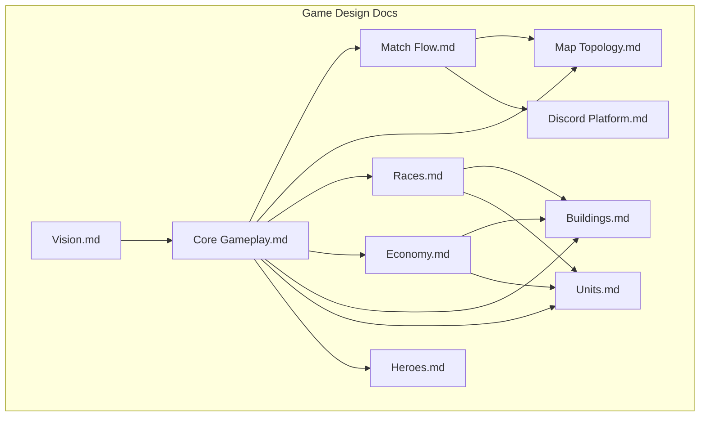
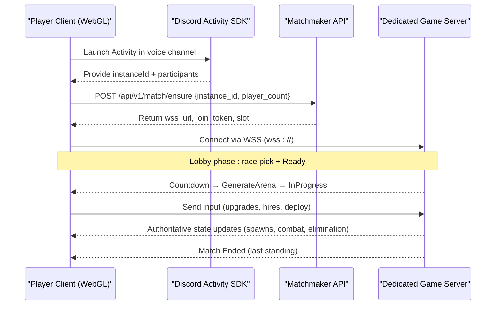
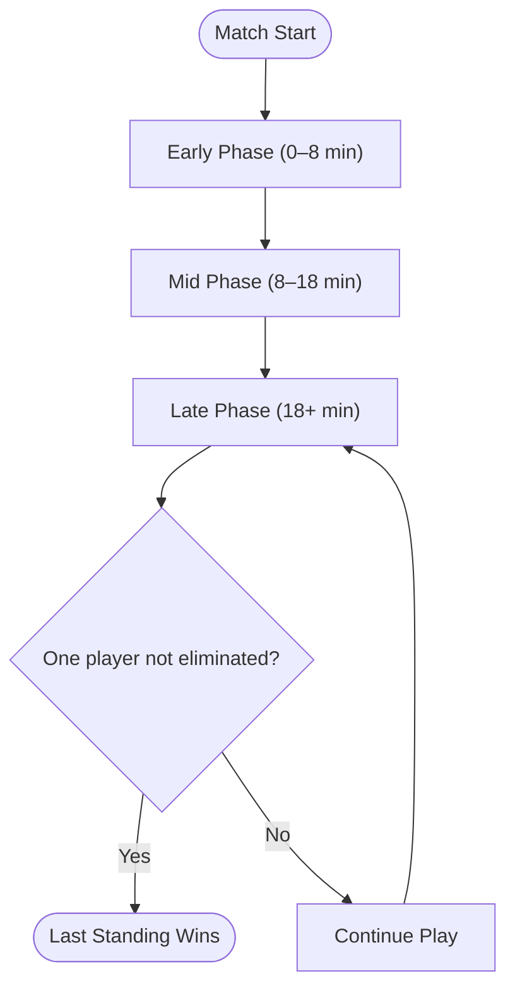
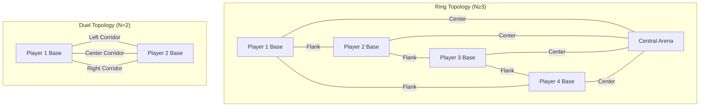
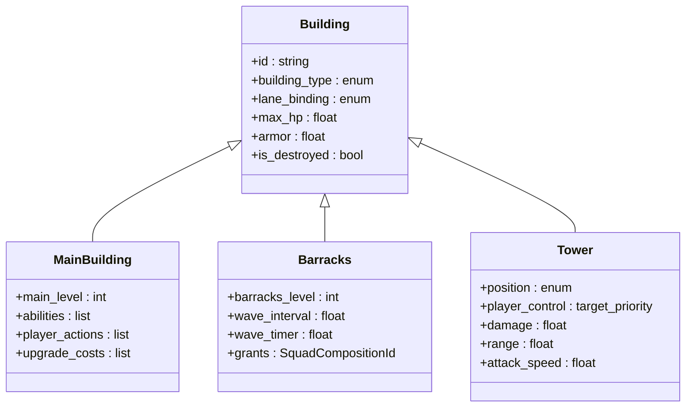
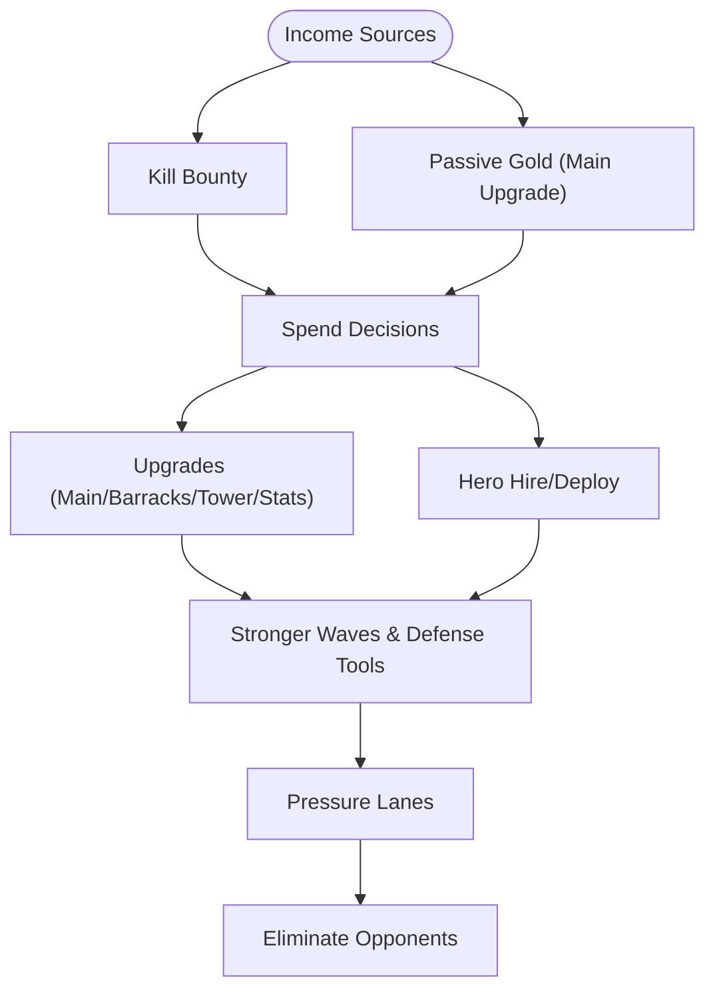
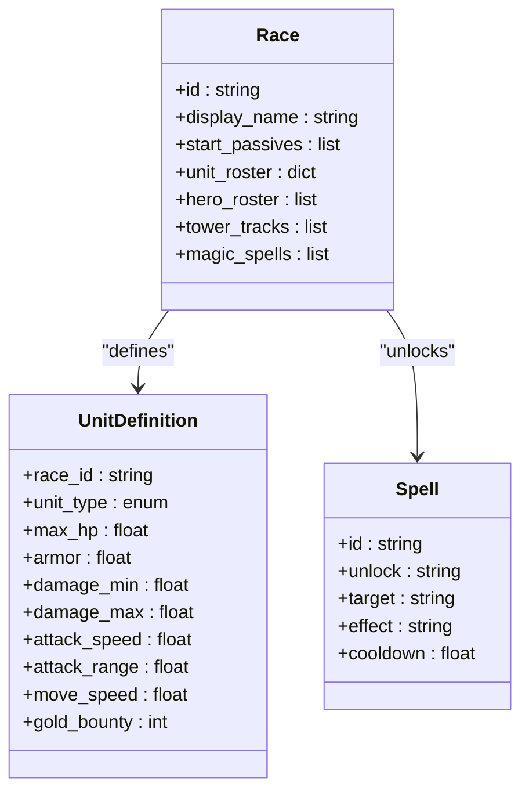
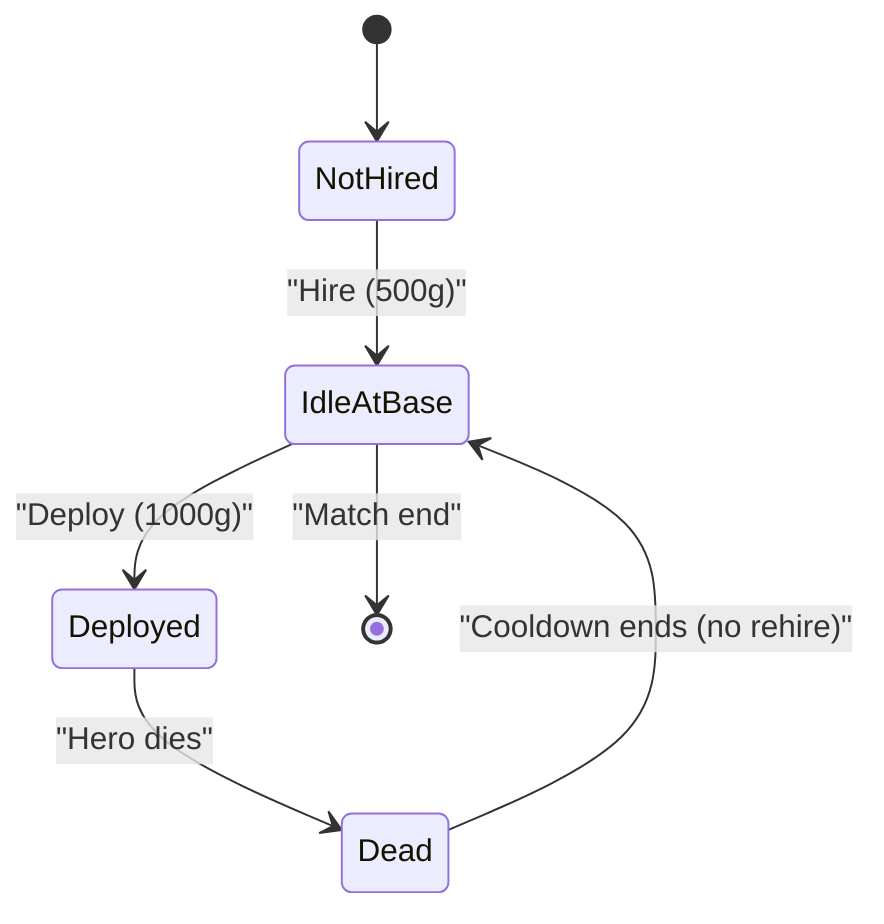
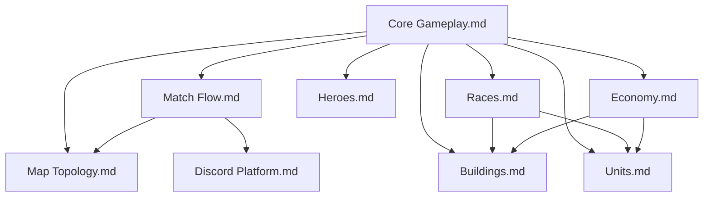

# Game Concept & Vision

<cite>
**Referenced Files in This Document**
- [Vision.md](file://Assets/Game/GameDesign/Vision.md)
- [Core Gameplay.md](file://Assets/Game/GameDesign/Core Gameplay.md)
- [Match Flow.md](file://Assets/Game/GameDesign/Match Flow.md)
- [Map Topology.md](file://Assets/Game/GameDesign/Map Topology.md)
- [Races.md](file://Assets/Game/GameDesign/Races.md)
- [Economy.md](file://Assets/Game/GameDesign/Economy.md)
- [Buildings.md](file://Assets/Game/GameDesign/Buildings.md)
- [Units.md](file://Assets/Game/GameDesign/Units.md)
- [Heroes.md](file://Assets/Game/GameDesign/Heroes.md)
- [Discord Platform.md](file://Assets/Game/GameDesign/Discord Platform.md)
</cite>

## Table of Contents
1. [Introduction](#introduction)
2. [Project Structure](#project-structure)
3. [Core Components](#core-components)
4. [Architecture Overview](#architecture-overview)
5. [Detailed Component Analysis](#detailed-component-analysis)
6. [Dependency Analysis](#dependency-analysis)
7. [Performance Considerations](#performance-considerations)
8. [Troubleshooting Guide](#troubleshooting-guide)
9. [Conclusion](#conclusion)
10. [Appendices](#appendices)

## Introduction
BARAKI is a Free-For-All (FFA) strategy game designed for real-time matches with 2–8 players inside Discord voice channels. The core vision emphasizes base management over individual unit control: players influence outcomes through buildings, upgrades, heroes, and tower strategies while armies march autonomously along lanes. Matches are played without bots—only humans—and the design prioritizes macro decisions, strategic positioning across lanes, and resource allocation rather than micro-management.

The game’s unique selling points include:
- Lane-based combat mechanics with clear flank and center roles
- Diverse races with asymmetric passives, magic spells, and tower upgrades
- Seamless social gaming integration via Discord Activity on desktop

This document consolidates the BARAKI concept and vision using terminology consistent with the codebase such as match, lane, race, and base. It also outlines gameplay philosophy, target audience analysis, competitive balance considerations, typical match scenarios, and how BARAKI differs from traditional RTS games by focusing on base management.

**Section sources**
- [Vision.md:11-36](file://Assets/Game/GameDesign/Vision.md#L11-L36)
- [Core Gameplay.md:9-34](file://Assets/Game/GameDesign/Core Gameplay.md#L9-L34)
- [Discord Platform.md:13-21](file://Assets/Game/GameDesign/Discord Platform.md#L13-L21)

## Project Structure
The BARAKI project organizes its design documentation under Assets/Game/GameDesign, with each aspect covered by a focused document:
- Vision: pillars, audience, scope, non-goals
- Core Gameplay: loop, lanes, player actions, unit autonomy
- Match Flow: phases, win conditions, timings, lobby flow
- Map Topology: ring + center layout, duel mode, procedural generation
- Races: asymmetry axes, roster, magic, tower upgrades
- Economy: gold income, costs, spending rules
- Buildings: base layout, barracks levels, destruction effects
- Units: types, stats schema, squad composition, combat behavior
- Heroes: hire/deploy, morale, AI
- Discord Platform: Activity UX, backend, infrastructure options

[No sources needed since this diagram shows conceptual structure, not actual code structure]

## Core Components
- FFA Strategy Loop: Players earn gold from kills and passive income, spend on upgrades, buildings, heroes, and towers to strengthen waves and pressure lanes, aiming to eliminate opponents until one remains.
- Lanes and Politics: Each base has three outgoing lanes (Left Flank, Center, Right Flank). Flank lanes are zero-sum duels with neighbors; the center lane merges into a Central Arena where all opponents fight, creating non-zero-sum dynamics when N ≥ 3.
- Base Management Focus: No direct unit control in combat. Influence comes from upgrading barracks (levels 1–4), main building levels, tower upgrades, hiring and deploying heroes, and researching stat upgrades.
- Race Diversity: Races differ via start passives (two positive, one negative), unique caster spells unlocked at the main building, and race-specific tower upgrade tracks.
- Social Integration: Runs within Discord Activity on desktop, leveraging voice channels for coordination and matchmaking via a dedicated server model.

**Section sources**
- [Core Gameplay.md:11-34](file://Assets/Game/GameDesign/Core Gameplay.md#L11-L34)
- [Core Gameplay.md:36-74](file://Assets/Game/GameDesign/Core Gameplay.md#L36-L74)
- [Core Gameplay.md:94-105](file://Assets/Game/GameDesign/Core Gameplay.md#L94-L105)
- [Races.md:17-56](file://Assets/Game/GameDesign/Races.md#L17-L56)
- [Discord Platform.md:13-21](file://Assets/Game/GameDesign/Discord Platform.md#L13-L21)

## Architecture Overview
The BARAKI architecture centers around a server-authoritative simulation running on a dedicated headless Unity server per match. Clients run as Unity WebGL builds embedded in Discord Activity. A lightweight backend provides matchmaking and session verification.

**Diagram sources**
- [Discord Platform.md:263-276](file://Assets/Game/GameDesign/Discord Platform.md#L263-L276)
- [Discord Platform.md:280-286](file://Assets/Game/GameDesign/Discord Platform.md#L280-L286)
- [Match Flow.md:216-227](file://Assets/Game/GameDesign/Match Flow.md#L216-L227)

**Section sources**
- [Discord Platform.md:26-52](file://Assets/Game/GameDesign/Discord Platform.md#L26-L52)
- [Match Flow.md:46-58](file://Assets/Game/GameDesign/Match Flow.md#L46-L58)

## Detailed Component Analysis

### FFA Match Dynamics and Win Conditions
- Match slots: 2–8 players, free-for-all, last standing wins.
- Elimination rule: All 8 buildings destroyed (main + 3 barracks + 4 towers). Main alone does not eliminate; only total base destruction ends a player’s participation.
- Spectator mode: Eliminated players remain as spectators with fog-of-war off and free camera.

**Diagram sources**
- [Match Flow.md:74-102](file://Assets/Game/GameDesign/Match Flow.md#L74-L102)
- [Match Flow.md:104-132](file://Assets/Game/GameDesign/Match Flow.md#L104-L132)
- [Match Flow.md:146-158](file://Assets/Game/GameDesign/Match Flow.md#L146-L158)

**Section sources**
- [Match Flow.md:11-24](file://Assets/Game/GameDesign/Match Flow.md#L11-L24)
- [Match Flow.md:104-132](file://Assets/Game/GameDesign/Match Flow.md#L104-L132)
- [Match Flow.md:146-158](file://Assets/Game/GameDesign/Match Flow.md#L146-L158)

### Lane-Based Combat and Map Topology
- Three-lane politics: Left and Right flanks engage immediate neighbors (zero-sum); Center merges into a Central Arena where all opponents fight (non-zero-sum when N ≥ 3).
- Duel mode (N=2): Three parallel corridors between two bases; all lanes lead to the single opponent.
- Procedural generation: Bases placed on a regular polygon perimeter; lanes generated from barracks splines toward center or neighbors.

**Diagram sources**
- [Map Topology.md:13-41](file://Assets/Game/GameDesign/Map Topology.md#L13-L41)
- [Map Topology.md:76-106](file://Assets/Game/GameDesign/Map Topology.md#L76-L106)
- [Map Topology.md:135-165](file://Assets/Game/GameDesign/Map Topology.md#L135-L165)

**Section sources**
- [Core Gameplay.md:36-74](file://Assets/Game/GameDesign/Core Gameplay.md#L36-L74)
- [Map Topology.md:13-41](file://Assets/Game/GameDesign/Map Topology.md#L13-L41)
- [Map Topology.md:76-106](file://Assets/Game/GameDesign/Map Topology.md#L76-L106)

### Base Management and Destruction Effects
- Base layout: Main building surrounded by four towers; three barracks positioned outward toward lanes. Rear side faces map edge without barracks or lanes.
- Barracks levels: Levels 1–4 increase squad composition and spawn speed (+5% per level). Destroyed barracks become ruins with frozen squad and L1 interval.
- Main building: Upgrades unlock magic slots, passive gold, hero hire cap. Destroyed main disables abilities but does not eliminate the player.
- Towers: Four per base; provide defense and race-specific upgrades. Destroyed towers become ruins with no function.

**Diagram sources**
- [Buildings.md:11-34](file://Assets/Game/GameDesign/Buildings.md#L11-L34)
- [Buildings.md:136-184](file://Assets/Game/GameDesign/Buildings.md#L136-L184)
- [Buildings.md:186-253](file://Assets/Game/GameDesign/Buildings.md#L186-L253)

**Section sources**
- [Buildings.md:36-112](file://Assets/Game/GameDesign/Buildings.md#L36-L112)
- [Buildings.md:114-134](file://Assets/Game/GameDesign/Buildings.md#L114-L134)
- [Buildings.md:186-253](file://Assets/Game/GameDesign/Buildings.md#L186-L253)

### Economy and Resource Allocation
- Gold sources: Kill bounty and passive gold ticks every 30 seconds based on main building upgrades.
- Costs: Upgrades for main level, passive gold, magic slots, barracks levels, tower tracks, stat upgrades, hero hire/deploy.
- Spending rules: No negative balances, one active research per building type, full refund on cancel.

**Diagram sources**
- [Economy.md:24-75](file://Assets/Game/GameDesign/Economy.md#L24-L75)
- [Economy.md:77-92](file://Assets/Game/GameDesign/Economy.md#L77-L92)
- [Economy.md:99-106](file://Assets/Game/GameDesign/Economy.md#L99-L106)

**Section sources**
- [Economy.md:24-75](file://Assets/Game/GameDesign/Economy.md#L24-L75)
- [Economy.md:77-92](file://Assets/Game/GameDesign/Economy.md#L77-L92)
- [Economy.md:99-106](file://Assets/Game/GameDesign/Economy.md#L99-L106)

### Races and Asymmetry
- Asymmetry axes: Start passives (two positive, one negative), tower upgrades, caster spells, magic upgrades.
- Roster: Six unit types per race plus heroes; identical baseline stats with race-specific modifiers.
- Magic: Caster spells unlocked via main building magic slots; race-unique effects.
- Tower upgrades: Five tracks per race, levels 1–3, researched in living towers.

**Diagram sources**
- [Races.md:66-91](file://Assets/Game/GameDesign/Races.md#L66-L91)
- [Races.md:93-147](file://Assets/Game/GameDesign/Races.md#L93-L147)
- [Races.md:148-249](file://Assets/Game/GameDesign/Races.md#L148-L249)
- [Races.md:252-377](file://Assets/Game/GameDesign/Races.md#L252-L377)
- [Units.md:53-75](file://Assets/Game/GameDesign/Units.md#L53-L75)

**Section sources**
- [Races.md:17-56](file://Assets/Game/GameDesign/Races.md#L17-L56)
- [Races.md:93-147](file://Assets/Game/GameDesign/Races.md#L93-L147)
- [Races.md:148-249](file://Assets/Game/GameDesign/Races.md#L148-L249)
- [Races.md:252-377](file://Assets/Game/GameDesign/Races.md#L252-L377)
- [Units.md:53-75](file://Assets/Game/GameDesign/Units.md#L53-L75)

### Heroes and Morale
- Hire and deploy: Hire heroes from main building (costs gold once per hero), deploy instantly from living barracks.
- Morale bonuses: Idle heroes grant stackable bonuses (damage, attack speed, armor); deployed/dead heroes do not provide bonuses.
- Death and cooldown: After death, heroes enter cooldown before redeploy.

**Diagram sources**
- [Heroes.md:45-89](file://Assets/Game/GameDesign/Heroes.md#L45-L89)
- [Heroes.md:91-123](file://Assets/Game/GameDesign/Heroes.md#L91-L123)

**Section sources**
- [Heroes.md:11-25](file://Assets/Game/GameDesign/Heroes.md#L11-L25)
- [Heroes.md:45-89](file://Assets/Game/GameDesign/Heroes.md#L45-L89)
- [Heroes.md:91-123](file://Assets/Game/GameDesign/Heroes.md#L91-L123)

## Dependency Analysis
The BARAKI design documents form a cohesive dependency graph where core gameplay drives match flow, topology, economy, buildings, units, heroes, and races.

**Diagram sources**
- [Core Gameplay.md:5-6](file://Assets/Game/GameDesign/Core Gameplay.md#L5-L6)
- [Match Flow.md:5-6](file://Assets/Game/GameDesign/Match Flow.md#L5-L6)
- [Map Topology.md:5-6](file://Assets/Game/GameDesign/Map Topology.md#L5-L6)
- [Races.md:5-6](file://Assets/Game/GameDesign/Races.md#L5-L6)
- [Economy.md:5-6](file://Assets/Game/GameDesign/Economy.md#L5-L6)
- [Buildings.md:5-6](file://Assets/Game/GameDesign/Buildings.md#L5-L6)
- [Units.md:5-6](file://Assets/Game/GameDesign/Units.md#L5-L6)
- [Heroes.md:5-6](file://Assets/Game/GameDesign/Heroes.md#L5-L6)
- [Discord Platform.md:5-6](file://Assets/Game/GameDesign/Discord Platform.md#L5-L6)

**Section sources**
- [Core Gameplay.md:5-6](file://Assets/Game/GameDesign/Core Gameplay.md#L5-L6)
- [Match Flow.md:5-6](file://Assets/Game/GameDesign/Match Flow.md#L5-L6)
- [Map Topology.md:5-6](file://Assets/Game/GameDesign/Map Topology.md#L5-L6)
- [Races.md:5-6](file://Assets/Game/GameDesign/Races.md#L5-L6)
- [Economy.md:5-6](file://Assets/Game/GameDesign/Economy.md#L5-L6)
- [Buildings.md:5-6](file://Assets/Game/GameDesign/Buildings.md#L5-L6)
- [Units.md:5-6](file://Assets/Game/GameDesign/Units.md#L5-L6)
- [Heroes.md:5-6](file://Assets/Game/GameDesign/Heroes.md#L5-L6)
- [Discord Platform.md:5-6](file://Assets/Game/GameDesign/Discord Platform.md#L5-L6)

## Performance Considerations
- WebGL constraints: Aggressive asset pooling, LOD, and limited VFX due to iframe memory and build size limits.
- Dedicated server model: Headless Unity server per match ensures authoritative simulation and scalability for 2–8 players.
- Network transport: WebSockets (WSS) required for secure client-server communication within Discord Activity.

[No sources needed since this section provides general guidance]

## Troubleshooting Guide
- Disconnect policy: MVP uses a 90-second grace period without global pause; after expiry, the player is eliminated. Reconnect is planned for Early Access.
- Spectator mode: Eliminated players can spectate with fog-of-war off and free camera until match end.
- Lobby immutability: Player count N is fixed at lobby creation; changing N requires a new lobby.

**Section sources**
- [Match Flow.md:162-184](file://Assets/Game/GameDesign/Match Flow.md#L162-L184)
- [Match Flow.md:146-158](file://Assets/Game/GameDesign/Match Flow.md#L146-L158)
- [Match Flow.md:58-61](file://Assets/Game/GameDesign/Match Flow.md#L58-L61)

## Conclusion
BARAKI reimagines FFA strategy by emphasizing base management, lane-based combat, and race diversity within a socially integrated Discord environment. The design avoids micro-management, focusing instead on macro decisions like upgrades, positioning, and resource allocation. With scalable topologies, asymmetric races, and a robust server architecture, BARAKI offers a fresh take on Tug of War-style gameplay tailored for real-time multiplayer sessions among friends.

[No sources needed since this section summarizes without analyzing specific files]

## Appendices

### Typical Match Scenarios and Strategic Depth
- Duel (N=2): Three parallel corridors create varied risk profiles; center corridor delivers faster pressure, flanks bypass towers.
- FFA (N=4): Center lane converges in the arena, enabling multi-opponent engagements; flank lanes maintain neighbor duels.
- Large FFA (N=8): Center overloaded by geometry; strategic focus shifts to balancing flank defense and center pressure.

**Section sources**
- [Core Gameplay.md:69-74](file://Assets/Game/GameDesign/Core Gameplay.md#L69-L74)
- [Map Topology.md:43-72](file://Assets/Game/GameDesign/Map Topology.md#L43-L72)

### Competitive Balance Considerations
- Fixed stats and economy across N=2…8 ensure consistent gameplay; only map geometry scales.
- Race asymmetry balanced via symmetric baseline stats with unique passives, magic, and tower upgrades.
- Playtest targets guide match duration and elimination counts for different player counts.

**Section sources**
- [Balance.md:67-88](file://Assets/Game/GameDesign/Balance.md#L67-L88)
- [Races.md:17-56](file://Assets/Game/GameDesign/Races.md#L17-L56)
- [Balance.md:138-145](file://Assets/Game/GameDesign/Balance.md#L138-L145)