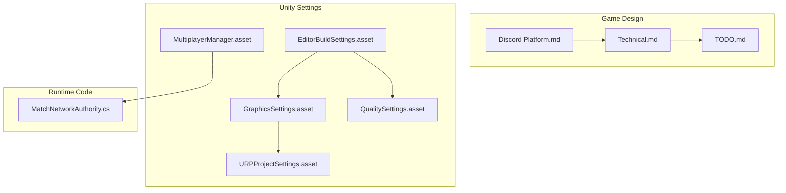
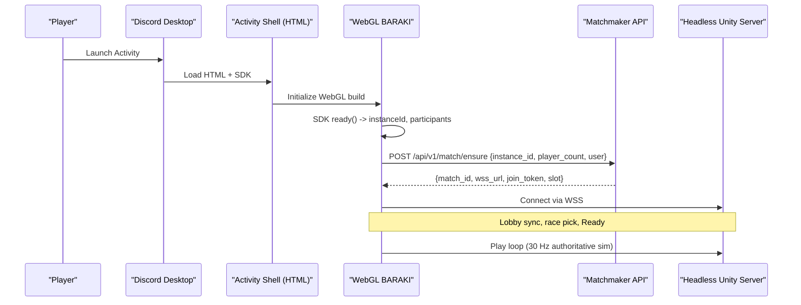
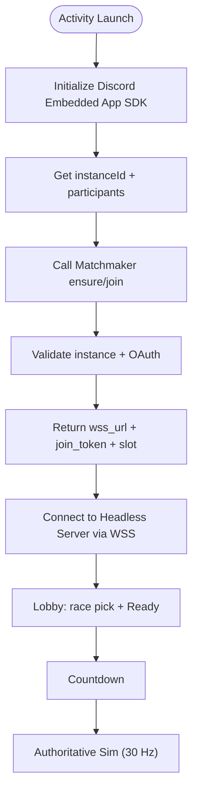
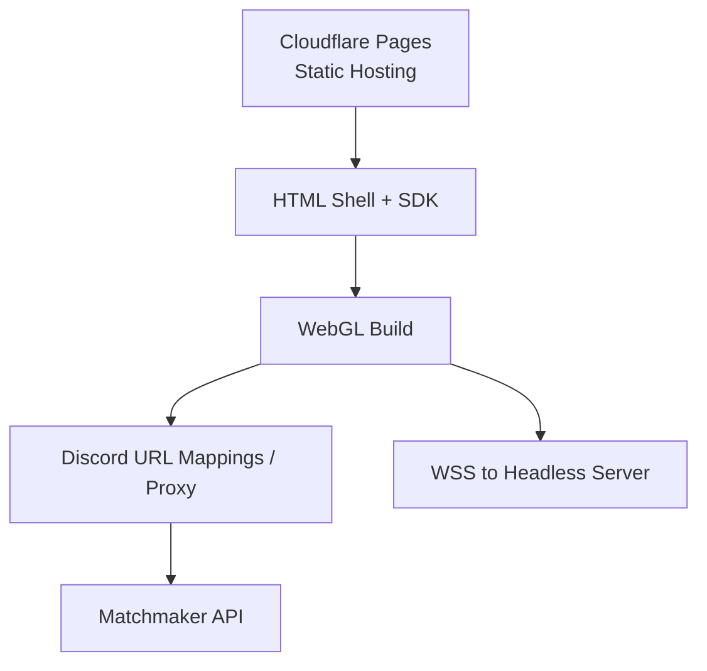
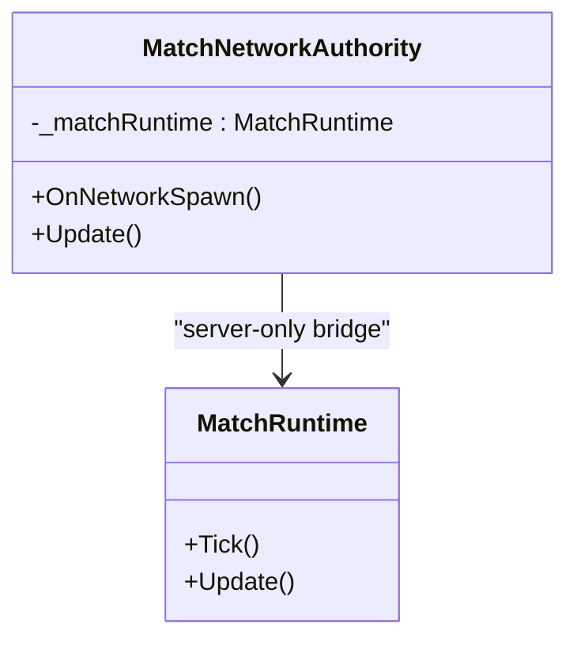
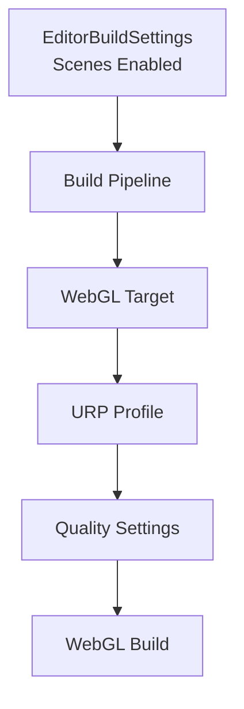
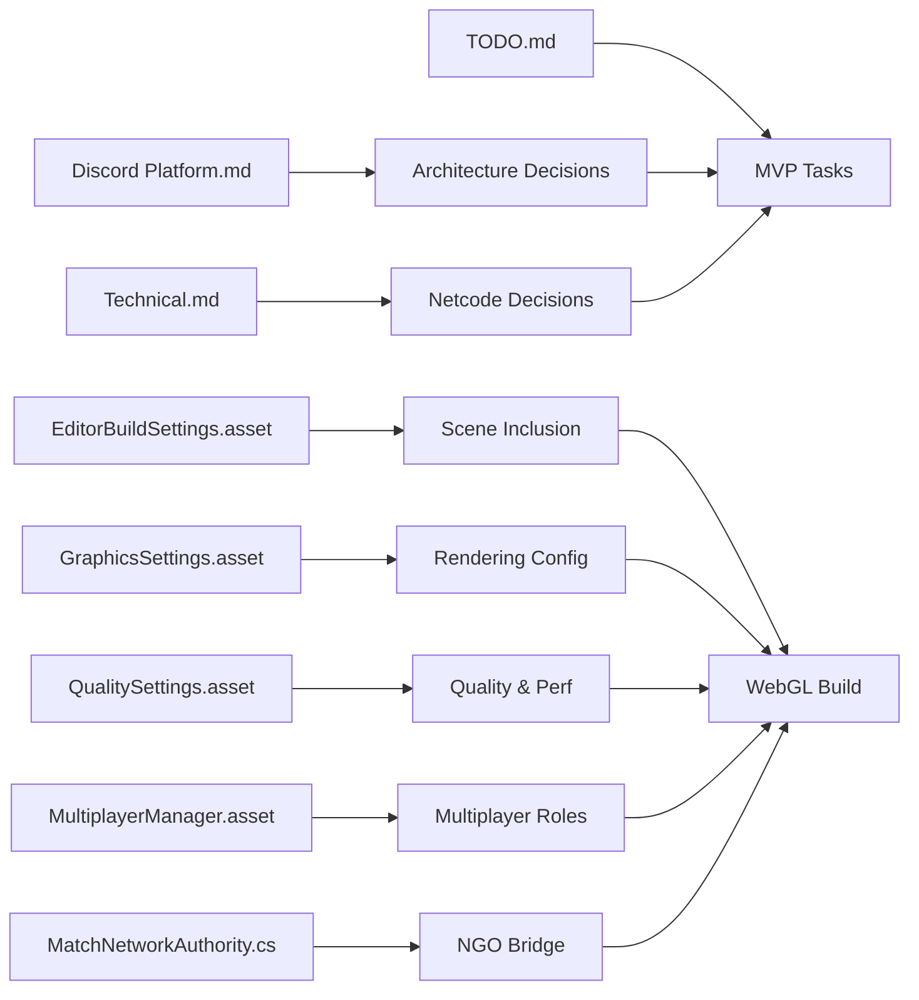

# Platform Integration

<cite>
**Referenced Files in This Document**
- [Discord Platform.md](file://Assets/Game/GameDesign/Discord Platform.md)
- [Technical.md](file://Assets/Game/GameDesign/Technical.md)
- [TODO.md](file://Assets/Game/GameDesign/TODO.md)
- [EditorBuildSettings.asset](file://ProjectSettings/EditorBuildSettings.asset)
- [GraphicsSettings.asset](file://ProjectSettings/GraphicsSettings.asset)
- [QualitySettings.asset](file://ProjectSettings/QualitySettings.asset)
- [MultiplayerManager.asset](file://ProjectSettings/MultiplayerManager.asset)
- [URPProjectSettings.asset](file://ProjectSettings/URPProjectSettings.asset)
- [MatchNetworkAuthority.cs](file://Assets/Game/Scripts/Runtime/Gameplay/Networking/MatchNetworkAuthority.cs)
</cite>

## Table of Contents
1. [Introduction](#introduction)
2. [Project Structure](#project-structure)
3. [Core Components](#core-components)
4. [Architecture Overview](#architecture-overview)
5. [Detailed Component Analysis](#detailed-component-analysis)
6. [Dependency Analysis](#dependency-analysis)
7. [Performance Considerations](#performance-considerations)
8. [Troubleshooting Guide](#troubleshooting-guide)
9. [Conclusion](#conclusion)
10. [Appendices](#appendices)

## Introduction
This document explains BARAKI’s platform integration architecture for Discord Activities with a Unity WebGL client and dedicated headless game servers. It covers the Discord Activities framework implementation, WebGL deployment strategy, cross-platform considerations for desktop gaming, technical requirements, browser compatibility matrix, performance optimization techniques, setup instructions for hosting, build configuration for WebGL targets, debugging approaches, networking considerations, security implications, platform-specific limitations, troubleshooting guidance, and the relationship between Unity editor workflows and final web deployment pipeline.

## Project Structure
The project is organized around:
- Game design documents that define the Discord Activity model, infrastructure options, and netcode decisions.
- Unity project settings that configure scenes, rendering, quality, and multiplayer roles.
- A minimal networking scaffold bridging Netcode for GameObjects (NGO) to the match runtime.

**Diagram sources**
- [Discord Platform.md:1-340](file://Assets/Game/GameDesign/Discord Platform.md#L1-L340)
- [Technical.md:173-185](file://Assets/Game/GameDesign/Technical.md#L173-L185)
- [TODO.md:29-40](file://Assets/Game/GameDesign/TODO.md#L29-L40)
- [EditorBuildSettings.asset:1-21](file://ProjectSettings/EditorBuildSettings.asset#L1-L21)
- [GraphicsSettings.asset:1-68](file://ProjectSettings/GraphicsSettings.asset#L1-L68)
- [QualitySettings.asset:1-81](file://ProjectSettings/QualitySettings.asset#L1-L81)
- [MultiplayerManager.asset:1-8](file://ProjectSettings/MultiplayerManager.asset#L1-L8)
- [URPProjectSettings.asset:1-17](file://ProjectSettings/URPProjectSettings.asset#L1-L17)
- [MatchNetworkAuthority.cs:1-35](file://Assets/Game/Scripts/Runtime/Gameplay/Networking/MatchNetworkAuthority.cs#L1-L35)

**Section sources**
- [Discord Platform.md:1-340](file://Assets/Game/GameDesign/Discord Platform.md#L1-L340)
- [EditorBuildSettings.asset:1-21](file://ProjectSettings/EditorBuildSettings.asset#L1-L21)

## Core Components
- Discord Activities shell and Embedded App SDK integration: The activity runs as a Unity WebGL build inside an iframe within desktop Discord. The shell initializes the SDK, obtains instanceId and participants, and loads the WebGL build.
- Dedicated headless server per match: All clients connect via WebSockets over WSS to a headless Unity server running at 30 Hz tick rate.
- Matchmaker API: Resolves or creates a game server based on instanceId and returns a WSS URL and join token.
- NGO bridge: A NetworkBehaviour scaffolds server-side authority and will gate simulation updates when NGO sessions are active.

Key constraints and decisions:
- Primary platform: Desktop Discord Activity; mobile not targeted.
- Transport: WebSockets/WSS on both client and server.
- Authority: Server-authoritative simulation; clients render-only.
- Infra: FREE-2 path (PC+Tunnel → Oracle Always Free ARM VM), zero cost for friends playtesting.

**Section sources**
- [Discord Platform.md:26-71](file://Assets/Game/GameDesign/Discord Platform.md#L26-L71)
- [Discord Platform.md:111-116](file://Assets/Game/GameDesign/Discord Platform.md#L111-L116)
- [Discord Platform.md:280-286](file://Assets/Game/GameDesign/Discord Platform.md#L280-L286)
- [Technical.md:173-185](file://Assets/Game/GameDesign/Technical.md#L173-L185)
- [MatchNetworkAuthority.cs:1-35](file://Assets/Game/Scripts/Runtime/Gameplay/Networking/MatchNetworkAuthority.cs#L1-L35)

## Architecture Overview
The system consists of four layers:
- Activity shell + WebGL client hosted on static hosting (Cloudflare Pages).
- Matchmaker backend (Cloudflare Workers or small VPS) handling ensure/join by instanceId.
- Headless Unity game server per match (Linux ARM64 on Oracle Always Free or local PC).
- TLS termination and exposure via Cloudflare Tunnel or Caddy/Let’s Encrypt.

**Diagram sources**
- [Discord Platform.md:63-71](file://Assets/Game/GameDesign/Discord Platform.md#L63-L71)
- [Discord Platform.md:263-276](file://Assets/Game/GameDesign/Discord Platform.md#L263-L276)
- [Discord Platform.md:280-286](file://Assets/Game/GameDesign/Discord Platform.md#L280-L286)

## Detailed Component Analysis

### Discord Activities Framework Implementation
- Target UX: Voice channel with 2–8 players; one launches Activity, others Join; lobby includes race pick and Ready; countdown leads into match.
- Technical model: Activity = Unity WebGL in iframe + backend + dedicated game server per match.
- Why not host-client: WebGL cannot reliably act as listen-server for multiple peers; production uses dedicated headless server.
- Backend minimum: Activity shell (HTML + SDK), matchmaker, authoritative game server, optional session verification via Discord Activity Instance API.
- Flow: WebGL starts → SDK ready() → instanceId/participants → client calls backend to create/join room → backend validates instance → returns server address + slot → all NGO clients connect to dedicated server → server sim runs authoritative.

**Diagram sources**
- [Discord Platform.md:13-24](file://Assets/Game/GameDesign/Discord Platform.md#L13-L24)
- [Discord Platform.md:26-71](file://Assets/Game/GameDesign/Discord Platform.md#L26-L71)

**Section sources**
- [Discord Platform.md:13-24](file://Assets/Game/GameDesign/Discord Platform.md#L13-L24)
- [Discord Platform.md:26-71](file://Assets/Game/GameDesign/Discord Platform.md#L26-L71)

### WebGL Deployment Strategy
- Hosting: Static hosting (Cloudflare Pages) serves HTML shell + WebGL build.
- Security: HTTPS required; game server must present valid TLS (Let’s Encrypt via nginx/Caddy); HTTP to matchmaker goes through Discord URL mappings/proxy.
- CSP: Avoid inline scripts in shell; use external scripts.
- Size/RAM: Aggressive pooling, LOD, limit VFX due to iframe size and memory constraints.
- Dev workflow: Use Cloudflare tunnel for local dev; test guild <25 members before verification.

**Diagram sources**
- [Discord Platform.md:105-116](file://Assets/Game/GameDesign/Discord Platform.md#L105-L116)
- [Discord Platform.md:313-319](file://Assets/Game/GameDesign/Discord Platform.md#L313-L319)

**Section sources**
- [Discord Platform.md:105-116](file://Assets/Game/GameDesign/Discord Platform.md#L105-L116)
- [Discord Platform.md:313-319](file://Assets/Game/GameDesign/Discord Platform.md#L313-L319)

### Cross-Platform Considerations for Desktop Gaming
- Primary platform: Desktop Discord Activity only; mobile not supported.
- Players: 2–8 per instance.
- Transport: WebSockets/WSS on client and server.
- Authority: Server-authoritative; movement/combat simulated on server; clients render-only.
- Tick rate: 30 Hz; spawn/wave timers are per-barracks and not tied to tick.

**Section sources**
- [Discord Platform.md:294-306](file://Assets/Game/GameDesign/Discord Platform.md#L294-L306)
- [Technical.md:173-185](file://Assets/Game/GameDesign/Technical.md#L173-L185)

### Networking Considerations
- Production netcode: Dedicated server per match using NGO with WebSocket transport.
- Dev/local: Host-client mode for quick tests (ParrelSync/editor), not shipping path.
- Reconnect-ready: Persist player_slot_id and session token (EA phase).
- NGO bridge: MatchNetworkAuthority scaffolds server-only update gating and future replication hooks.

**Diagram sources**
- [MatchNetworkAuthority.cs:1-35](file://Assets/Game/Scripts/Runtime/Gameplay/Networking/MatchNetworkAuthority.cs#L1-L35)

**Section sources**
- [Technical.md:65-111](file://Assets/Game/GameDesign/Technical.md#L65-L111)
- [MatchNetworkAuthority.cs:1-35](file://Assets/Game/Scripts/Runtime/Gameplay/Networking/MatchNetworkAuthority.cs#L1-L35)

### Security Implications
- Valid TLS for game server endpoints (wss://).
- Use Discord URL mappings/proxy for HTTP to matchmaker from iframe.
- Optional session verification via Discord Activity Instance API to confirm client presence in instance.
- Content Security Policy: avoid inline scripts in shell.

**Section sources**
- [Discord Platform.md:111-116](file://Assets/Game/GameDesign/Discord Platform.md#L111-L116)
- [Discord Platform.md:313-319](file://Assets/Game/GameDesign/Discord Platform.md#L313-L319)

### Platform-Specific Limitations
- WebGL cannot be a reliable listen-server; use dedicated headless server.
- Build size and iframe RAM require aggressive asset management and reduced VFX.
- URP WebGL profile may need simplification for Activity.

**Section sources**
- [Discord Platform.md:39-42](file://Assets/Game/GameDesign/Discord Platform.md#L39-L42)
- [Discord Platform.md:313-319](file://Assets/Game/GameDesign/Discord Platform.md#L313-L319)

### Setup Instructions for Discord Activity Hosting
- Static hosting: Deploy HTML shell + WebGL build to Cloudflare Pages.
- Matchmaker: Implement ensure/join endpoints returning wss_url and join_token.
- Exposure: Use Cloudflare Tunnel for local dev or Caddy/Let’s Encrypt for production.
- Discord Developer Portal: Configure public HTTPS URL mappings for the activity.

**Section sources**
- [Discord Platform.md:118-134](file://Assets/Game/GameDesign/Discord Platform.md#L118-L134)
- [Discord Platform.md:188-210](file://Assets/Game/GameDesign/Discord Platform.md#L188-L210)
- [Discord Platform.md:263-276](file://Assets/Game/GameDesign/Discord Platform.md#L263-L276)

### Build Configuration for WebGL Targets
- Scenes: Bootstrap, MainMenu, Lobby, Game enabled in EditorBuildSettings.
- Rendering: URP configured via GraphicsSettings and URPProjectSettings.
- Quality: Default quality profile applied across platforms including WebGL.
- Multiplayer: Roles disabled in MultiplayerManager; NGO transport set to WebSockets/WSS per design docs.

**Diagram sources**
- [EditorBuildSettings.asset:7-20](file://ProjectSettings/EditorBuildSettings.asset#L7-L20)
- [GraphicsSettings.asset:40-44](file://ProjectSettings/GraphicsSettings.asset#L40-L44)
- [QualitySettings.asset:9-50](file://ProjectSettings/QualitySettings.asset#L9-L50)
- [URPProjectSettings.asset:10-17](file://ProjectSettings/URPProjectSettings.asset#L10-L17)

**Section sources**
- [EditorBuildSettings.asset:1-21](file://ProjectSettings/EditorBuildSettings.asset#L1-L21)
- [GraphicsSettings.asset:1-68](file://ProjectSettings/GraphicsSettings.asset#L1-L68)
- [QualitySettings.asset:1-81](file://ProjectSettings/QualitySettings.asset#L1-L81)
- [MultiplayerManager.asset:1-8](file://ProjectSettings/MultiplayerManager.asset#L1-L8)
- [URPProjectSettings.asset:1-17](file://ProjectSettings/URPProjectSettings.asset#L1-L17)

### Debugging Approaches for Web Deployments
- Local dev: Two WebGL tabs + dedicated server locally; ParrelSync for host-client testing.
- Discord integration: Cloudflare tunnel + URL mapping + test guild (<25 members) prior to verification.
- Performance profiling: Monitor iframe size, memory usage, and network latency; reduce VFX and textures.

**Section sources**
- [Discord Platform.md:328-334](file://Assets/Game/GameDesign/Discord Platform.md#L328-L334)

### Relationship Between Unity Editor Workflows and Final Web Deployment Pipeline
- Scene enablement in EditorBuildSettings drives what gets included in builds.
- URP and Quality settings influence runtime performance and output size.
- NGO scaffolding ensures server-side logic separation and prepares for full replication.
- TODO items track MVP tasks for Discord hosting, SDK integration, matchmaker, and headless server Dockerization.

**Section sources**
- [EditorBuildSettings.asset:7-20](file://ProjectSettings/EditorBuildSettings.asset#L7-L20)
- [GraphicsSettings.asset:40-44](file://ProjectSettings/GraphicsSettings.asset#L40-L44)
- [QualitySettings.asset:9-50](file://ProjectSettings/QualitySettings.asset#L9-L50)
- [TODO.md:29-40](file://Assets/Game/GameDesign/TODO.md#L29-L40)

## Dependency Analysis
High-level dependencies:
- Discord Platform.md defines architecture, infra, and constraints.
- Technical.md locks netcode decisions and tick rate.
- TODO.md tracks MVP tasks aligned with architecture.
- Unity settings configure scenes, rendering, quality, and multiplayer roles.
- MatchNetworkAuthority bridges NGO to match runtime.

**Diagram sources**
- [Discord Platform.md:1-340](file://Assets/Game/GameDesign/Discord Platform.md#L1-L340)
- [Technical.md:173-185](file://Assets/Game/GameDesign/Technical.md#L173-L185)
- [TODO.md:29-40](file://Assets/Game/GameDesign/TODO.md#L29-L40)
- [EditorBuildSettings.asset:7-20](file://ProjectSettings/EditorBuildSettings.asset#L7-L20)
- [GraphicsSettings.asset:40-44](file://ProjectSettings/GraphicsSettings.asset#L40-L44)
- [QualitySettings.asset:9-50](file://ProjectSettings/QualitySettings.asset#L9-L50)
- [MultiplayerManager.asset:1-8](file://ProjectSettings/MultiplayerManager.asset#L1-L8)
- [MatchNetworkAuthority.cs:1-35](file://Assets/Game/Scripts/Runtime/Gameplay/Networking/MatchNetworkAuthority.cs#L1-L35)

**Section sources**
- [Discord Platform.md:1-340](file://Assets/Game/GameDesign/Discord Platform.md#L1-L340)
- [Technical.md:173-185](file://Assets/Game/GameDesign/Technical.md#L173-L185)
- [TODO.md:29-40](file://Assets/Game/GameDesign/TODO.md#L29-L40)
- [EditorBuildSettings.asset:7-20](file://ProjectSettings/EditorBuildSettings.asset#L7-L20)
- [GraphicsSettings.asset:40-44](file://ProjectSettings/GraphicsSettings.asset#L40-L44)
- [QualitySettings.asset:9-50](file://ProjectSettings/QualitySettings.asset#L9-L50)
- [MultiplayerManager.asset:1-8](file://ProjectSettings/MultiplayerManager.asset#L1-L8)
- [MatchNetworkAuthority.cs:1-35](file://Assets/Game/Scripts/Runtime/Gameplay/Networking/MatchNetworkAuthority.cs#L1-L35)

## Performance Considerations
- Asset management: Aggressive pooling, LOD, and limited VFX to fit iframe size and memory constraints.
- Rendering: Consider simplified URP WebGL profile for Activity.
- Network: 30 Hz authoritative tick; minimize payload sizes; prefer deterministic server sim.
- Build size: Keep WebGL build compact; leverage CDN caching and compression.

[No sources needed since this section provides general guidance]

## Troubleshooting Guide
Common issues and resolutions:
- WebGL cannot act as server: Ensure dedicated headless server is used; verify WSS connectivity and TLS certificates.
- Matchmaker errors: Confirm instanceId validation and correct return fields (wss_url, join_token, slot).
- CSP violations: Remove inline scripts from HTML shell; load SDK externally.
- Browser compatibility: Test on latest desktop browsers; monitor WebGL context loss and memory limits.
- Dev flow: Use Cloudflare tunnel for local dev; validate URLs in Discord Developer Portal mappings.

**Section sources**
- [Discord Platform.md:111-116](file://Assets/Game/GameDesign/Discord Platform.md#L111-L116)
- [Discord Platform.md:313-319](file://Assets/Game/GameDesign/Discord Platform.md#L313-L319)
- [Discord Platform.md:328-334](file://Assets/Game/GameDesign/Discord Platform.md#L328-L334)

## Conclusion
BARAKI’s platform integration centers on a Discord Activity delivered as a Unity WebGL client communicating with a dedicated headless server via WebSockets over WSS. The architecture emphasizes server-authoritative gameplay, zero-cost infrastructure for friends playtesting, and careful attention to WebGL constraints. With clear scene enablement, URP/quality settings, and NGO scaffolding, the project is positioned to scale from local dev to 24/7 cloud hosting while maintaining performance and security.

[No sources needed since this section summarizes without analyzing specific files]

## Appendices

### Browser Compatibility Matrix (Conceptual)
- Supported: Latest desktop Chromium-based browsers (Chrome, Edge), Firefox, Safari on desktop.
- Not supported: Mobile Discord Activity target per locked decisions.
- Notes: Monitor WebGL context stability, memory limits, and TLS requirements.

[No sources needed since this diagram shows conceptual workflow, not actual code structure]

### Matchmaker API Contract (Summary)
- POST /api/v1/match/ensure: Returns match_id, wss_url, join_token, slot.
- POST /api/v1/match/ready: Signals readiness; all Ready triggers countdown.
- GET /api/v1/match/{instance_id}: Idempotent join for late participants.

**Section sources**
- [Discord Platform.md:263-276](file://Assets/Game/GameDesign/Discord Platform.md#L263-L276)