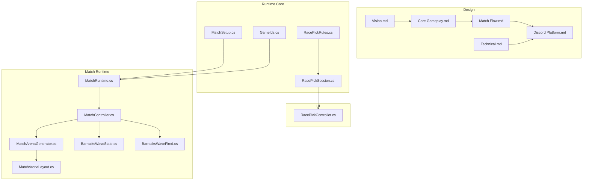
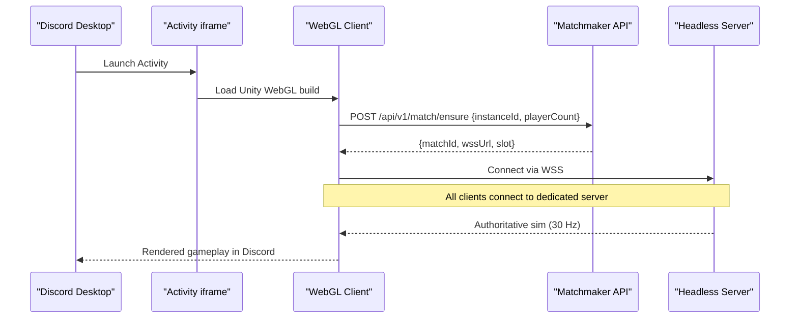
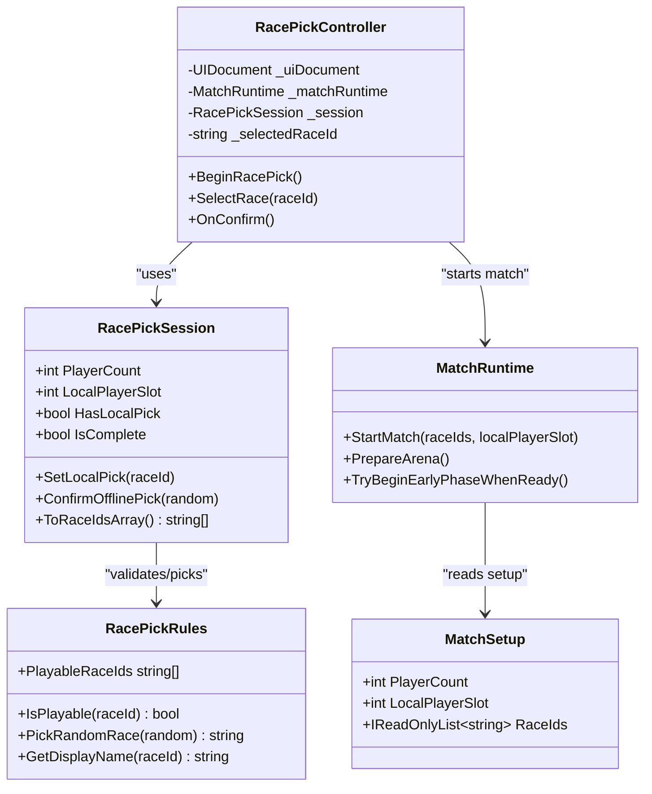
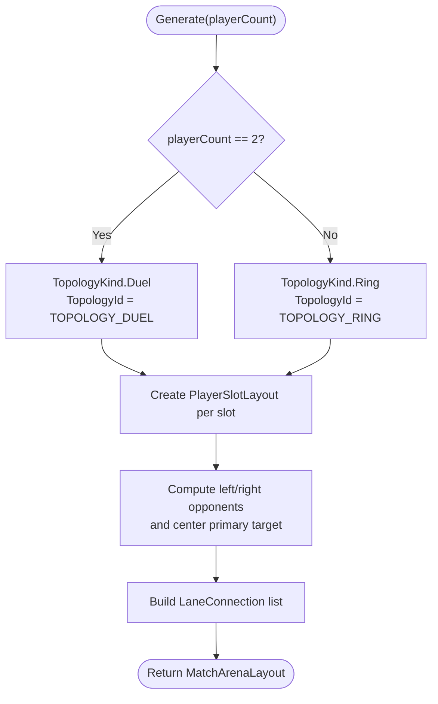
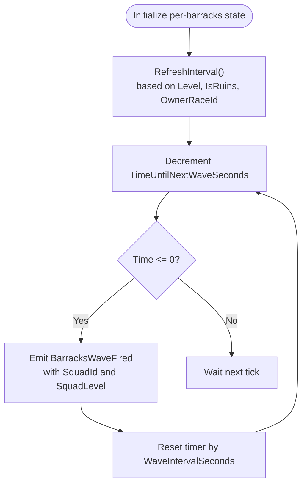
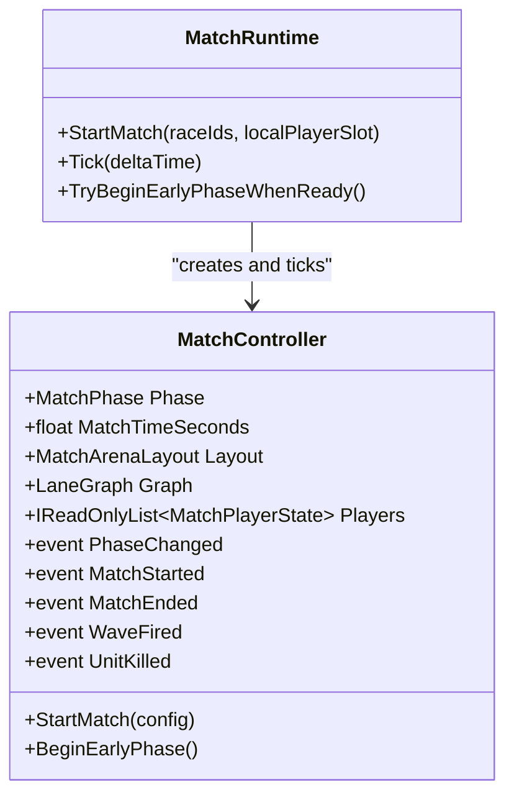
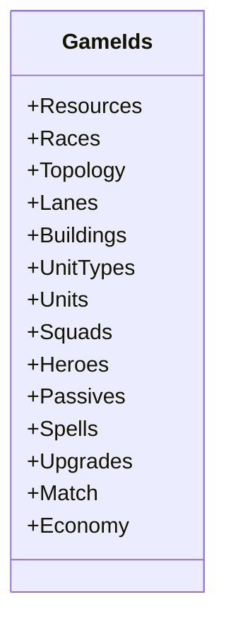
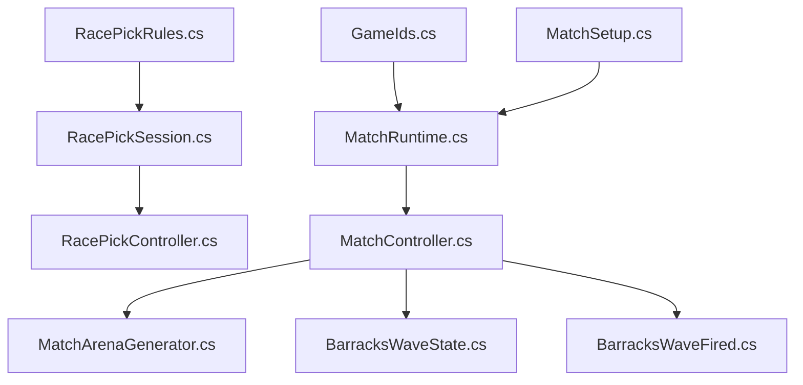

# Project Overview

<cite>
**Referenced Files in This Document**
- [Vision.md](file://Assets/Game/GameDesign/Vision.md)
- [README.md](file://Assets/Game/GameDesign/README.md)
- [Discord Platform.md](file://Assets/Game/GameDesign/Discord Platform.md)
- [Core Gameplay.md](file://Assets/Game/GameDesign/Core Gameplay.md)
- [Match Flow.md](file://Assets/Game/GameDesign/Match Flow.md)
- [Technical.md](file://Assets/Game/GameDesign/Technical.md)
- [RacePickSession.cs](file://Assets/Game/Scripts/Runtime/Core/RacePickSession.cs)
- [RacePickRules.cs](file://Assets/Game/Scripts/Runtime/Core/RacePickRules.cs)
- [GameIds.cs](file://Assets/Game/Scripts/Runtime/Core/GameIds.cs)
- [MatchSetup.cs](file://Assets/Game/Scripts/Runtime/Core/MatchSetup.cs)
- [RacePickController.cs](file://Assets/Game/UI/Controllers/RacePickController.cs)
- [MatchRuntime.cs](file://Assets/Game/Scripts/Runtime/Gameplay/Match/MatchRuntime.cs)
- [MatchConfig.cs](file://Assets/Game/Scripts/Runtime/Gameplay/Match/MatchConfig.cs)
- [MatchArenaGenerator.cs](file://Assets/Game/Scripts/Runtime/Gameplay/Match/MatchArenaGenerator.cs)
- [MatchArenaLayout.cs](file://Assets/Game/Scripts/Runtime/Gameplay/Match/MatchArenaLayout.cs)
- [BarracksWaveState.cs](file://Assets/Game/Scripts/Runtime/Gameplay/Match/BarracksWaveState.cs)
- [BarracksWaveFired.cs](file://Assets/Game/Scripts/Runtime/Gameplay/Match/BarracksWaveFired.cs)
</cite>

## Table of Contents
1. [Introduction](#introduction)
2. [Project Structure](#project-structure)
3. [Core Components](#core-components)
4. [Architecture Overview](#architecture-overview)
5. [Detailed Component Analysis](#detailed-component-analysis)
6. [Dependency Analysis](#dependency-analysis)
7. [Performance Considerations](#performance-considerations)
8. [Troubleshooting Guide](#troubleshooting-guide)
9. [Conclusion](#conclusion)

## Introduction
BARAKI is a multiplayer Free-For-All strategy game designed for Discord Activities on desktop. The core vision emphasizes base management over unit control: players never issue direct combat orders to units; instead, they influence outcomes through base upgrades, barracks levels, heroes, towers, and spells. Matches support 2–8 human-only players sharing a voice channel, with no bots.

Key features include:
- Lane-based combat across three lanes per player (left flank, center, right flank).
- A race system with unique races that differ via passives, heroes, and magic.
- Tight platform integration with Discord Activities using Unity WebGL, a dedicated headless server per match, and a minimal backend for matchmaking.

This overview provides both a beginner-friendly conceptual explanation and technical details for developers working within the Unity-based architecture. It uses terminology consistent with the codebase such as match, lane, race, and base.

**Section sources**
- [Vision.md:10-36](file://Assets/Game/GameDesign/Vision.md#L10-L36)
- [README.md:1-20](file://Assets/Game/GameDesign/README.md#L1-L20)

## Project Structure
At a high level, BARAKI’s project structure separates design documentation from runtime implementation:
- Game design documents define pillars, audience, scope, and systems like lanes, races, economy, and match flow.
- Runtime code implements match orchestration, arena generation, lane graph construction, wave scheduling, combat simulation, building registry, and elimination logic.
- UI controllers manage pre-match race selection and scene transitions.
- Stable identifiers are centralized to keep GDD and runtime in sync.

[No sources needed since this diagram shows conceptual workflow, not actual code structure]

**Section sources**
- [Technical.md:25-55](file://Assets/Game/GameDesign/Technical.md#L25-L55)
- [GameIds.cs:1-40](file://Assets/Game/Scripts/Runtime/Core/GameIds.cs#L1-L40)

## Core Components
- Match lifecycle and phases: Lobby → Start → Early/Mid/Late → End, with last-standing win condition and elimination when all buildings are destroyed.
- Arena topology: Duel (N=2) or Ring (N=3..8), generated at runtime with neighbor indices and center targets.
- Lanes: Left flank, center, right flank; each barracks independently spawns waves based on level and race.
- Races: Unique identities with distinct passives, heroes, and spells; early access targets 4+ races.
- Economy: Gold income from kills and passive main upgrades; spend on upgrades, barracks levels, heroes, towers, and spells.
- Platform: Discord Activity (desktop) hosting Unity WebGL client, dedicated headless server per match, and minimal backend for matchmaking.

Practical gameplay loop example:
- Players join a Discord voice channel and launch the BARAKI Activity.
- In the lobby, each player selects a race and becomes ready.
- On countdown, the arena generates according to N, lanes are built, starting gold is granted, and the match enters the early phase.
- Barracks spawn waves automatically; players invest gold into upgrades, heroes, and defenses.
- Center lanes merge into an arena where multiple opponents fight; flanks duel neighbors.
- When a player loses all buildings, they become eliminated spectators until one remains.

**Section sources**
- [Match Flow.md:74-132](file://Assets/Game/GameDesign/Match Flow.md#L74-L132)
- [Core Gameplay.md:11-34](file://Assets/Game/GameDesign/Core Gameplay.md#L11-L34)
- [Core Gameplay.md:36-74](file://Assets/Game/GameDesign/Core Gameplay.md#L36-L74)
- [Vision.md:44-63](file://Assets/Game/GameDesign/Vision.md#L44-L63)

## Architecture Overview
The production architecture centers on a dedicated headless server per match, with Unity WebGL clients running inside Discord Activities. A small backend handles activity shell loading, instance verification, and matchmaking.

**Diagram sources**
- [Discord Platform.md:63-71](file://Assets/Game/GameDesign/Discord Platform.md#L63-L71)
- [Discord Platform.md:263-276](file://Assets/Game/GameDesign/Discord Platform.md#L263-L276)
- [Technical.md:65-79](file://Assets/Game/GameDesign/Technical.md#L65-L79)

**Section sources**
- [Discord Platform.md:26-52](file://Assets/Game/GameDesign/Discord Platform.md#L26-L52)
- [Technical.md:65-112](file://Assets/Game/GameDesign/Technical.md#L65-L112)

## Detailed Component Analysis

### Race Selection and Match Start
Pre-match race selection ensures every slot has a playable race before starting. The offline MVP fills unpicked slots with random playable races.

**Diagram sources**
- [RacePickSession.cs:10-125](file://Assets/Game/Scripts/Runtime/Core/RacePickSession.cs#L10-L125)
- [RacePickRules.cs:5-44](file://Assets/Game/Scripts/Runtime/Core/RacePickRules.cs#L5-L44)
- [RacePickController.cs:1-145](file://Assets/Game/UI/Controllers/RacePickController.cs#L1-L145)
- [MatchRuntime.cs:98-147](file://Assets/Game/Scripts/Runtime/Gameplay/Match/MatchRuntime.cs#L98-L147)
- [MatchSetup.cs:1-28](file://Assets/Game/Scripts/Runtime/Core/MatchSetup.cs#L1-L28)

**Section sources**
- [RacePickSession.cs:10-125](file://Assets/Game/Scripts/Runtime/Core/RacePickSession.cs#L10-L125)
- [RacePickRules.cs:5-44](file://Assets/Game/Scripts/Runtime/Core/RacePickRules.cs#L5-L44)
- [RacePickController.cs:78-115](file://Assets/Game/UI/Controllers/RacePickController.cs#L78-L115)
- [MatchRuntime.cs:98-147](file://Assets/Game/Scripts/Runtime/Gameplay/Match/MatchRuntime.cs#L98-L147)
- [MatchSetup.cs:1-28](file://Assets/Game/Scripts/Runtime/Core/MatchSetup.cs#L1-L28)

### Arena Generation and Topology
The arena layout is procedural and adapts to player count:
- Duel topology for N=2 with three parallel corridors.
- Ring topology for N=3..8 with bases arranged around a central arena.

**Diagram sources**
- [MatchArenaGenerator.cs:19-33](file://Assets/Game/Scripts/Runtime/Gameplay/Match/MatchArenaGenerator.cs#L19-L33)
- [MatchArenaLayout.cs:7-53](file://Assets/Game/Scripts/Runtime/Gameplay/Match/MatchArenaLayout.cs#L7-L53)

**Section sources**
- [MatchArenaGenerator.cs:19-33](file://Assets/Game/Scripts/Runtime/Gameplay/Match/MatchArenaGenerator.cs#L19-L33)
- [MatchArenaLayout.cs:13-53](file://Assets/Game/Scripts/Runtime/Gameplay/Match/MatchArenaLayout.cs#L13-L53)

### Wave Scheduling and Combat Integration
Each barracks maintains independent timers and squad composition based on its level and race. Destroyed barracks enter ruins state, freezing squad level and reverting interval to L1 behavior.

**Diagram sources**
- [BarracksWaveState.cs:1-47](file://Assets/Game/Scripts/Runtime/Gameplay/Match/BarracksWaveState.cs#L1-L47)
- [BarracksWaveFired.cs:1-28](file://Assets/Game/Scripts/Runtime/Gameplay/Match/BarracksWaveFired.cs#L1-L28)

**Section sources**
- [BarracksWaveState.cs:1-47](file://Assets/Game/Scripts/Runtime/Gameplay/Match/BarracksWaveState.cs#L1-L47)
- [BarracksWaveFired.cs:1-28](file://Assets/Game/Scripts/Runtime/Gameplay/Match/BarracksWaveFired.cs#L1-L28)

### Match Orchestration and Phases
The match controller coordinates arena generation, lane graph construction, player initialization, wave scheduling, combat, buildings, and elimination. It exposes events for phase changes, match start/end, wave firing, and unit kills.

**Diagram sources**
- [MatchRuntime.cs:67-96](file://Assets/Game/Scripts/Runtime/Gameplay/Match/MatchRuntime.cs#L67-L96)
- [MatchRuntime.cs:98-147](file://Assets/Game/Scripts/Runtime/Gameplay/Match/MatchRuntime.cs#L98-L147)

**Section sources**
- [MatchRuntime.cs:67-96](file://Assets/Game/Scripts/Runtime/Gameplay/Match/MatchRuntime.cs#L67-L96)
- [MatchRuntime.cs:98-147](file://Assets/Game/Scripts/Runtime/Gameplay/Match/MatchRuntime.cs#L98-L147)

### Data Identifiers and Consistency
Stable identifiers mirror the GDD and ScriptableObject assets, ensuring consistency across systems. Examples include races, lanes, buildings, unit types, squads, heroes, passives, spells, upgrades, and match phases.

**Diagram sources**
- [GameIds.cs:1-165](file://Assets/Game/Scripts/Runtime/Core/GameIds.cs#L1-L165)

**Section sources**
- [GameIds.cs:1-165](file://Assets/Game/Scripts/Runtime/Core/GameIds.cs#L1-L165)

## Dependency Analysis
The runtime depends on stable identifiers and configuration objects to initialize matches and UI flows. UI controllers depend on session setup and match runtime to transition scenes and begin gameplay.

**Diagram sources**
- [GameIds.cs:1-40](file://Assets/Game/Scripts/Runtime/Core/GameIds.cs#L1-L40)
- [MatchSetup.cs:1-28](file://Assets/Game/Scripts/Runtime/Core/MatchSetup.cs#L1-L28)
- [RacePickSession.cs:10-125](file://Assets/Game/Scripts/Runtime/Core/RacePickSession.cs#L10-L125)
- [RacePickRules.cs:5-44](file://Assets/Game/Scripts/Runtime/Core/RacePickRules.cs#L5-L44)
- [RacePickController.cs:1-145](file://Assets/Game/UI/Controllers/RacePickController.cs#L1-L145)
- [MatchRuntime.cs:98-147](file://Assets/Game/Scripts/Runtime/Gameplay/Match/MatchRuntime.cs#L98-L147)
- [MatchArenaGenerator.cs:19-33](file://Assets/Game/Scripts/Runtime/Gameplay/Match/MatchArenaGenerator.cs#L19-L33)
- [BarracksWaveState.cs:1-47](file://Assets/Game/Scripts/Runtime/Gameplay/Match/BarracksWaveState.cs#L1-L47)
- [BarracksWaveFired.cs:1-28](file://Assets/Game/Scripts/Runtime/Gameplay/Match/BarracksWaveFired.cs#L1-L28)

**Section sources**
- [GameIds.cs:1-40](file://Assets/Game/Scripts/Runtime/Core/GameIds.cs#L1-L40)
- [MatchSetup.cs:1-28](file://Assets/Game/Scripts/Runtime/Core/MatchSetup.cs#L1-L28)
- [RacePickSession.cs:10-125](file://Assets/Game/Scripts/Runtime/Core/RacePickSession.cs#L10-L125)
- [RacePickRules.cs:5-44](file://Assets/Game/Scripts/Runtime/Core/RacePickRules.cs#L5-L44)
- [RacePickController.cs:1-145](file://Assets/Game/UI/Controllers/RacePickController.cs#L1-L145)
- [MatchRuntime.cs:98-147](file://Assets/Game/Scripts/Runtime/Gameplay/Match/MatchRuntime.cs#L98-L147)
- [MatchArenaGenerator.cs:19-33](file://Assets/Game/Scripts/Runtime/Gameplay/Match/MatchArenaGenerator.cs#L19-L33)
- [BarracksWaveState.cs:1-47](file://Assets/Game/Scripts/Runtime/Gameplay/Match/BarracksWaveState.cs#L1-L47)
- [BarracksWaveFired.cs:1-28](file://Assets/Game/Scripts/Runtime/Gameplay/Match/BarracksWaveFired.cs#L1-L28)

## Performance Considerations
- At peak (8 players × 3 lanes × up to 14 units per barracks L4), aggressive object pooling and spatial partitioning for targeting are essential.
- Per-barracks wave timers avoid global synchronization spikes.
- WebGL constraints require careful asset sizing, LOD usage, and limited VFX to fit within iframe memory budgets.

[No sources needed since this section provides general guidance]

## Troubleshooting Guide
Common issues and checks:
- Ensure player count is between 2 and 8 during race pick and match start; otherwise, exceptions will be thrown.
- Validate that race IDs are playable before confirming selections.
- Confirm that race IDs count matches the active setup’s player count before starting the match.
- Verify that the match controller is initialized and ticking only after the race pick UI unlocks pan input.

**Section sources**
- [RacePickSession.cs:14-29](file://Assets/Game/Scripts/Runtime/Core/RacePickSession.cs#L14-L29)
- [RacePickSession.cs:62-85](file://Assets/Game/Scripts/Runtime/Core/RacePickSession.cs#L62-L85)
- [MatchRuntime.cs:105-119](file://Assets/Game/Scripts/Runtime/Gameplay/Match/MatchRuntime.cs#L105-L119)
- [RacePickController.cs:103-115](file://Assets/Game/UI/Controllers/RacePickController.cs#L103-L115)

## Conclusion
BARAKI delivers a focused FFA strategy experience optimized for Discord Activities, emphasizing macro-level base management and lane-based politics. Its Unity WebGL client integrates with a dedicated headless server and minimal backend to provide scalable, authoritative matches for 2–8 players. The architecture cleanly separates design documentation from runtime systems, uses stable identifiers for consistency, and supports procedural arena generation and per-barracks wave scheduling. This foundation enables rapid iteration on races, upgrades, and balance while maintaining a clear path toward early access and beyond.

[No sources needed since this section summarizes without analyzing specific files]