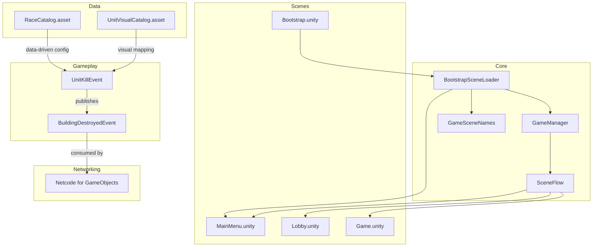
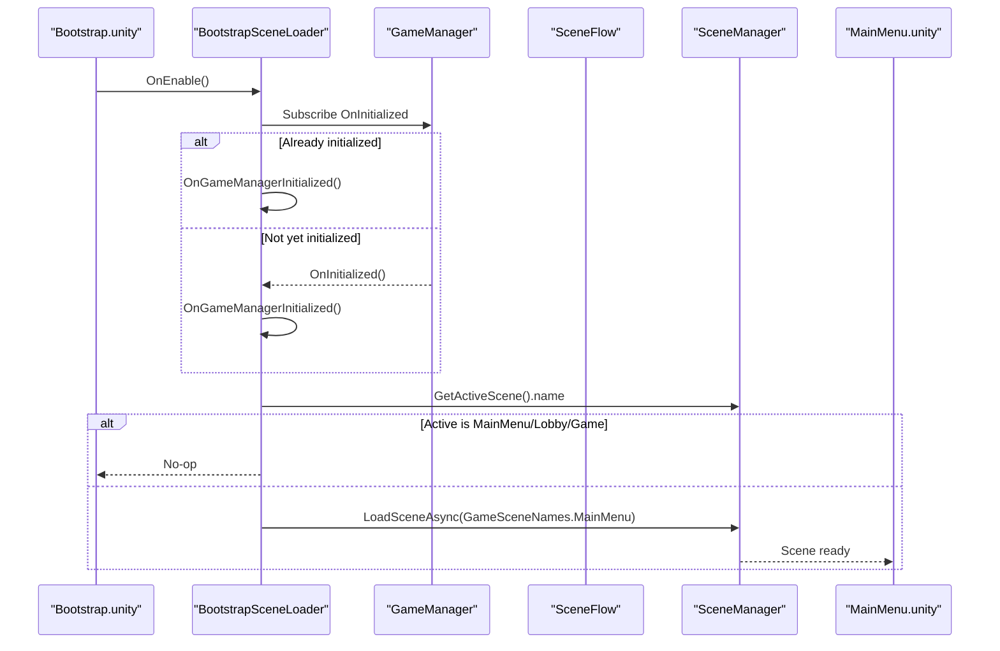
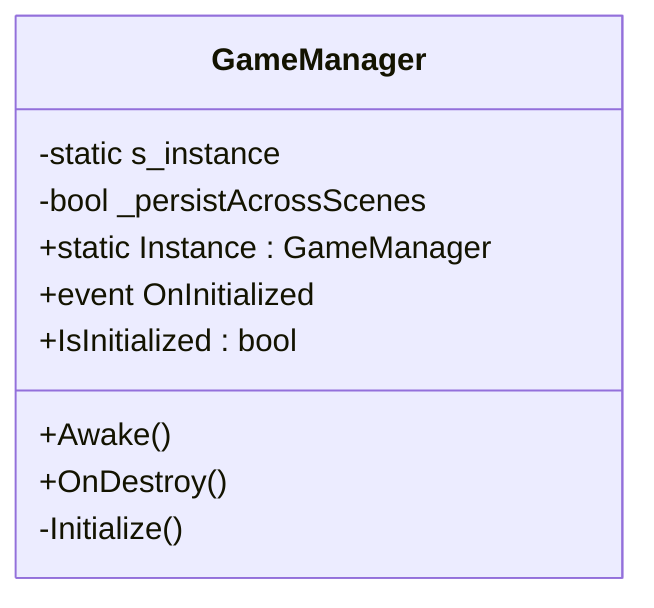
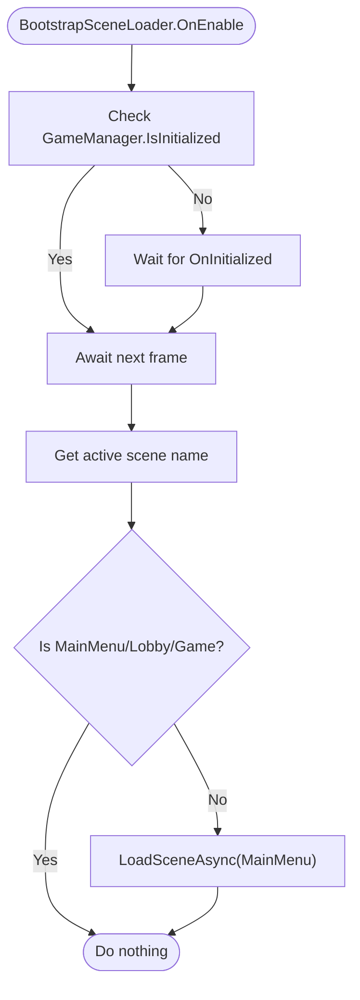
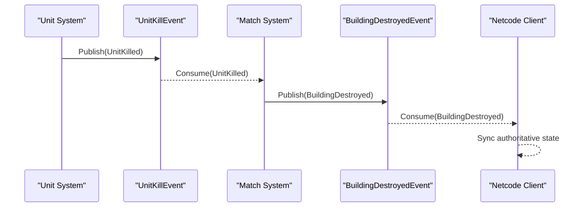
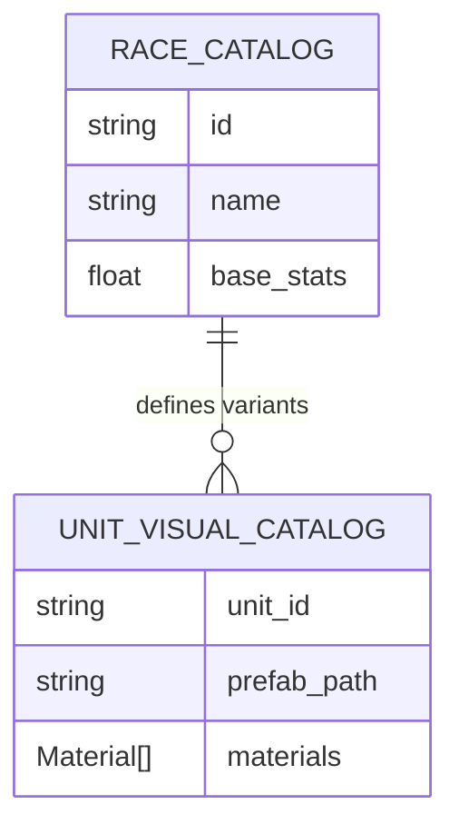
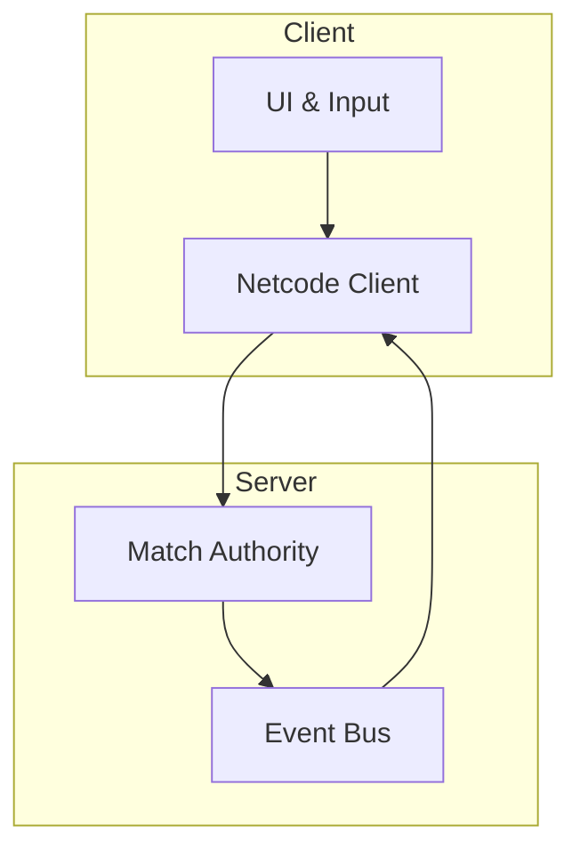
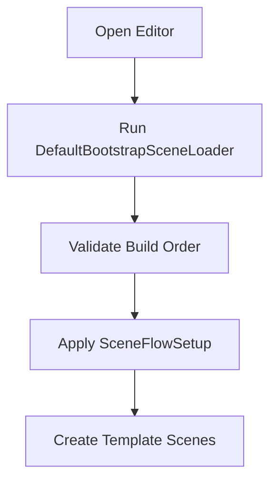
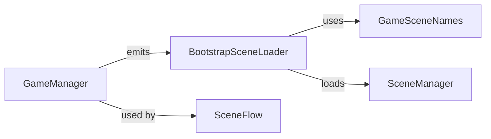

# Technical Architecture

<cite>
**Referenced Files in This Document**
- [GameManager.cs](file://Assets/Game/Scripts/Runtime/Core/GameManager.cs)
- [BootstrapSceneLoader.cs](file://Assets/Game/Scripts/Runtime/Core/BootstrapSceneLoader.cs)
- [GameSceneNames.cs](file://Assets/Game/Scripts/Runtime/Core/GameSceneNames.cs)
- [SceneFlow.cs](file://Assets/Game/Scripts/Runtime/Core/SceneFlow.cs)
- [DefaultBootstrapSceneLoader.cs](file://Assets/Game/Scripts/Editor/DefaultBootstrapSceneLoader.cs)
- [SceneFlowSetup.cs](file://Assets/Game/Scripts/Editor/SceneFlowSetup.cs)
- [TemplateSceneSetup.cs](file://Assets/Game/Scripts/Editor/TemplateSceneSetup.cs)
- [RaceCatalog.asset](file://Assets/Game/ScriptableObjects/RaceCatalog.asset)
- [UnitVisualCatalog.asset](file://Assets/Game/ScriptableObjects/UnitVisualCatalog.asset)
- [Combat.UnitKillEvent.cs](file://Assets/Game/Scripts/Runtime/Gameplay/Combat/UnitKillEvent.cs)
- [Match.BuildingDestroyedEvent.cs](file://Assets/Game/Scripts/Runtime/Gameplay/Match/BuildingDestroyedEvent.cs)
- [Bootstrap.unity](file://Assets/Game/Scenes/Bootstrap.unity)
- [MainMenu.unity](file://Assets/Game/Scenes/MainMenu.unity)
- [Lobby.unity](file://Assets/Game/Scenes/Lobby.unity)
- [Game.unity](file://Assets/Game/Scenes/Game.unity)
</cite>

## Table of Contents
1. Introduction
2. Project Structure
3. Core Components
4. Architecture Overview
5. Detailed Component Analysis
6. Dependency Analysis
7. Performance Considerations
8. Troubleshooting Guide
9. Conclusion

## Introduction
This document describes the technical architecture of BARAKI’s Unity-based game engine implementation. It focuses on the high-level system design, including the GameManager lifecycle, scene flow management, component organization patterns, event-driven communication, data-driven design via ScriptableObjects, and multiplayer networking with Netcode for GameObjects. It also provides architectural diagrams, performance guidance, memory management strategies, scalability patterns, and modular assembly structure recommendations to support extensibility while maintaining code quality and performance standards.

## Project Structure
The project follows a layered and feature-oriented organization under Assets/Game:
- Runtime core systems (lifecycle, scene flow, bootstrap)
- Gameplay systems (events, match logic, combat)
- UI runtime and assets
- ScriptableObjects for data-driven configuration
- Scenes for bootstrapping, menus, lobby, and gameplay
- Editor tooling for scene setup and templates

**Diagram sources**
- [GameManager.cs:1-59](file://Assets/Game/Scripts/Runtime/Core/GameManager.cs#L1-L59)
- [BootstrapSceneLoader.cs:1-40](file://Assets/Game/Scripts/Runtime/Core/BootstrapSceneLoader.cs#L1-L40)
- [GameSceneNames.cs:1-12](file://Assets/Game/Scripts/Runtime/Core/GameSceneNames.cs#L1-L12)
- [SceneFlow.cs:1-14](file://Assets/Game/Scripts/Runtime/Core/SceneFlow.cs#L1-L14)
- [Bootstrap.unity](file://Assets/Game/Scenes/Bootstrap.unity)
- [MainMenu.unity](file://Assets/Game/Scenes/MainMenu.unity)
- [Lobby.unity](file://Assets/Game/Scenes/Lobby.unity)
- [Game.unity](file://Assets/Game/Scenes/Game.unity)
- [RaceCatalog.asset](file://Assets/Game/ScriptableObjects/RaceCatalog.asset)
- [UnitVisualCatalog.asset](file://Assets/Game/ScriptableObjects/UnitVisualCatalog.asset)
- [Combat.UnitKillEvent.cs](file://Assets/Game/Scripts/Runtime/Gameplay/Combat/UnitKillEvent.cs)
- [Match.BuildingDestroyedEvent.cs](file://Assets/Game/Scripts/Runtime/Gameplay/Match/BuildingDestroyedEvent.cs)

**Section sources**
- [GameManager.cs:1-59](file://Assets/Game/Scripts/Runtime/Core/GameManager.cs#L1-L59)
- [BootstrapSceneLoader.cs:1-40](file://Assets/Game/Scripts/Runtime/Core/BootstrapSceneLoader.cs#L1-L40)
- [GameSceneNames.cs:1-12](file://Assets/Game/Scripts/Runtime/Core/GameSceneNames.cs#L1-L12)
- [SceneFlow.cs:1-14](file://Assets/Game/Scripts/Runtime/Core/SceneFlow.cs#L1-L14)
- [Bootstrap.unity](file://Assets/Game/Scenes/Bootstrap.unity)
- [MainMenu.unity](file://Assets/Game/Scenes/MainMenu.unity)
- [Lobby.unity](file://Assets/Game/Scenes/Lobby.unity)
- [Game.unity](file://Assets/Game/Scenes/Game.unity)
- [RaceCatalog.asset](file://Assets/Game/ScriptableObjects/RaceCatalog.asset)
- [UnitVisualCatalog.asset](file://Assets/Game/ScriptableObjects/UnitVisualCatalog.asset)
- [Combat.UnitKillEvent.cs](file://Assets/Game/Scripts/Runtime/Gameplay/Combat/UnitKillEvent.cs)
- [Match.BuildingDestroyedEvent.cs](file://Assets/Game/Scripts/Runtime/Gameplay/Match/BuildingDestroyedEvent.cs)

## Core Components
- GameManager: Central singleton that persists across scenes and signals initialization completion via an event.
- BootstrapSceneLoader: Subscribes to GameManager initialization and transitions to MainMenu unless already in a valid scene.
- GameSceneNames: Centralized constants for build-order scene names.
- SceneFlow: Utility helpers for checking loaded scenes.

Key responsibilities:
- Lifecycle coordination and global readiness signaling
- Safe scene transitions based on current state
- Data-driven scene name resolution

**Section sources**
- [GameManager.cs:1-59](file://Assets/Game/Scripts/Runtime/Core/GameManager.cs#L1-L59)
- [BootstrapSceneLoader.cs:1-40](file://Assets/Game/Scripts/Runtime/Core/BootstrapSceneLoader.cs#L1-L40)
- [GameSceneNames.cs:1-12](file://Assets/Game/Scripts/Runtime/Core/GameSceneNames.cs#L1-L12)
- [SceneFlow.cs:1-14](file://Assets/Game/Scripts/Runtime/Core/SceneFlow.cs#L1-L14)

## Architecture Overview
The engine uses a minimal bootstrap pattern:
- The first scene loads core systems and waits for GameManager initialization.
- Upon initialization, the bootstrap loader ensures the active scene is one of the allowed top-level scenes; otherwise it loads MainMenu.
- SceneFlow utilities provide safe checks for loaded scenes.
- Gameplay events are published and consumed across systems, enabling decoupled interactions.
- Data-driven configuration is provided via ScriptableObjects for races and unit visuals.
- Multiplayer networking integrates through Netcode for GameObjects, consuming gameplay events to synchronize state.

**Diagram sources**
- [BootstrapSceneLoader.cs:1-40](file://Assets/Game/Scripts/Runtime/Core/BootstrapSceneLoader.cs#L1-L40)
- [GameManager.cs:1-59](file://Assets/Game/Scripts/Runtime/Core/GameManager.cs#L1-L59)
- [GameSceneNames.cs:1-12](file://Assets/Game/Scripts/Runtime/Core/GameSceneNames.cs#L1-L12)
- [SceneFlow.cs:1-14](file://Assets/Game/Scripts/Runtime/Core/SceneFlow.cs#L1-L14)
- [Bootstrap.unity](file://Assets/Game/Scenes/Bootstrap.unity)
- [MainMenu.unity](file://Assets/Game/Scenes/MainMenu.unity)

## Detailed Component Analysis

### GameManager Lifecycle
- Singleton instance with optional persistence across scenes.
- Emits OnInitialized when fully ready.
- Provides IsInitialized flag for consumers to guard early access.

**Diagram sources**
- [GameManager.cs:1-59](file://Assets/Game/Scripts/Runtime/Core/GameManager.cs#L1-L59)

**Section sources**
- [GameManager.cs:1-59](file://Assets/Game/Scripts/Runtime/Core/GameManager.cs#L1-L59)

### Scene Flow Management
- Centralized scene name constants ensure consistency between editor settings and runtime.
- BootstrapSceneLoader enforces a canonical entry point after core systems are ready.
- SceneFlow provides utility checks for loaded scenes.

**Diagram sources**
- [BootstrapSceneLoader.cs:1-40](file://Assets/Game/Scripts/Runtime/Core/BootstrapSceneLoader.cs#L1-L40)
- [GameSceneNames.cs:1-12](file://Assets/Game/Scripts/Runtime/Core/GameSceneNames.cs#L1-L12)

**Section sources**
- [BootstrapSceneLoader.cs:1-40](file://Assets/Game/Scripts/Runtime/Core/BootstrapSceneLoader.cs#L1-L40)
- [GameSceneNames.cs:1-12](file://Assets/Game/Scripts/Runtime/Core/GameSceneNames.cs#L1-L12)
- [SceneFlow.cs:1-14](file://Assets/Game/Scripts/Runtime/Core/SceneFlow.cs#L1-L14)

### Event-Driven Communication
- Gameplay events encapsulate domain actions such as unit kills and building destruction.
- Publishers emit events; subscribers react without tight coupling.
- Networking layer can subscribe to these events to synchronize state across clients.

**Diagram sources**
- [Combat.UnitKillEvent.cs](file://Assets/Game/Scripts/Runtime/Gameplay/Combat/UnitKillEvent.cs)
- [Match.BuildingDestroyedEvent.cs](file://Assets/Game/Scripts/Runtime/Gameplay/Match/BuildingDestroyedEvent.cs)

**Section sources**
- [Combat.UnitKillEvent.cs](file://Assets/Game/Scripts/Runtime/Gameplay/Combat/UnitKillEvent.cs)
- [Match.BuildingDestroyedEvent.cs](file://Assets/Game/Scripts/Runtime/Gameplay/Match/BuildingDestroyedEvent.cs)

### Data-Driven Design with ScriptableObjects
- RaceCatalog.asset centralizes race definitions used by gameplay systems.
- UnitVisualCatalog.asset maps units to visual representations, decoupling content from logic.
- These assets enable designers to tune balance and visuals without code changes.

**Diagram sources**
- [RaceCatalog.asset](file://Assets/Game/ScriptableObjects/RaceCatalog.asset)
- [UnitVisualCatalog.asset](file://Assets/Game/ScriptableObjects/UnitVisualCatalog.asset)

**Section sources**
- [RaceCatalog.asset](file://Assets/Game/ScriptableObjects/RaceCatalog.asset)
- [UnitVisualCatalog.asset](file://Assets/Game/ScriptableObjects/UnitVisualCatalog.asset)

### Multiplayer Networking Approach (Netcode for GameObjects)
- Netcode for GameObjects integrates at the network layer to synchronize authoritative game state.
- Networked systems subscribe to gameplay events to broadcast updates and reconcile client state.
- Scene boundaries (Lobby vs Game) determine when network sessions start and stop.

[No diagram sources since this diagram shows conceptual integration points]

**Section sources**
- [Lobby.unity](file://Assets/Game/Scenes/Lobby.unity)
- [Game.unity](file://Assets/Game/Scenes/Game.unity)
- [Match.BuildingDestroyedEvent.cs](file://Assets/Game/Scripts/Runtime/Gameplay/Match/BuildingDestroyedEvent.cs)

### Modular Assembly Structure and Dependency Injection
Recommended structure for clarity and testability:
- Game.Core: Core services, lifecycle, scene flow, bootstrap.
- Game.Gameplay: Match, combat, AI, economy, upgrades.
- Game.UI: UI runtime, view models, controllers.
- Game.Networking: Netcode integration, RPCs, synchronization.
- Game.Data: ScriptableObjects catalogs and loaders.

Dependency injection guidance:
- Use a lightweight DI container or service locator for cross-cutting concerns (logging, settings).
- Inject dependencies into constructors rather than using static singletons where possible.
- Keep GameManager focused on lifecycle and global readiness; avoid business logic there.

[No section sources since this is recommended guidance]

### Editor Tooling and Setup
- DefaultBootstrapSceneLoader: Editor-time helper to configure bootstrap behavior.
- SceneFlowSetup: Editor utilities to validate and set up scene flow configurations.
- TemplateSceneSetup: Templates to scaffold new scenes consistently.

**Diagram sources**
- [DefaultBootstrapSceneLoader.cs](file://Assets/Game/Scripts/Editor/DefaultBootstrapSceneLoader.cs)
- [SceneFlowSetup.cs](file://Assets/Game/Scripts/Editor/SceneFlowSetup.cs)
- [TemplateSceneSetup.cs](file://Assets/Game/Scripts/Editor/TemplateSceneSetup.cs)

**Section sources**
- [DefaultBootstrapSceneLoader.cs](file://Assets/Game/Scripts/Editor/DefaultBootstrapSceneLoader.cs)
- [SceneFlowSetup.cs](file://Assets/Game/Scripts/Editor/SceneFlowSetup.cs)
- [TemplateSceneSetup.cs](file://Assets/Game/Scripts/Editor/TemplateSceneSetup.cs)

## Dependency Analysis
Runtime dependency relationships among core components:

**Diagram sources**
- [GameManager.cs:1-59](file://Assets/Game/Scripts/Runtime/Core/GameManager.cs#L1-L59)
- [BootstrapSceneLoader.cs:1-40](file://Assets/Game/Scripts/Runtime/Core/BootstrapSceneLoader.cs#L1-L40)
- [GameSceneNames.cs:1-12](file://Assets/Game/Scripts/Runtime/Core/GameSceneNames.cs#L1-L12)
- [SceneFlow.cs:1-14](file://Assets/Game/Scripts/Runtime/Core/SceneFlow.cs#L1-L14)

**Section sources**
- [GameManager.cs:1-59](file://Assets/Game/Scripts/Runtime/Core/GameManager.cs#L1-L59)
- [BootstrapSceneLoader.cs:1-40](file://Assets/Game/Scripts/Runtime/Core/BootstrapSceneLoader.cs#L1-L40)
- [GameSceneNames.cs:1-12](file://Assets/Game/Scripts/Runtime/Core/GameSceneNames.cs#L1-L12)
- [SceneFlow.cs:1-14](file://Assets/Game/Scripts/Runtime/Core/SceneFlow.cs#L1-L14)

## Performance Considerations
- Scene loading:
  - Prefer asynchronous scene loading and streaming for large levels.
  - Avoid frequent scene reloads; reuse persistent managers and objects.
- Object pooling:
  - Pool frequently spawned/despawned entities (projectiles, effects, UI panels).
- Memory management:
  - Unload unused assets and textures; use Addressables or AssetBundles for dynamic content.
  - Avoid allocations in hot paths; reuse buffers and structs.
- Event system:
  - Coalesce events and process them in batches to reduce per-frame overhead.
- Networking:
  - Minimize RPC frequency; batch updates and use interest management.
  - Apply client-side prediction and server reconciliation for responsive controls.
- Rendering:
  - Use batching, instancing, and LODs for complex scenes.
  - Optimize draw calls and texture atlases.

[No sources needed since this section provides general guidance]

## Troubleshooting Guide
Common issues and resolutions:
- Bootstrap does not transition to MainMenu:
  - Verify GameManager initializes and emits OnInitialized.
  - Ensure active scene is not already MainMenu/Lobby/Game before forcing load.
- Scene not found errors:
  - Confirm scene names in GameSceneNames match EditorBuildSettings.
  - Validate SceneFlow.IsLoaded checks before accessing scene-specific resources.
- Event handlers not firing:
  - Ensure publishers and subscribers are registered before events occur.
  - Check for premature unsubscriptions or missing references.
- Networking desync:
  - Review authoritative server decisions and client reconciliation.
  - Inspect event propagation from gameplay to network layer.

**Section sources**
- [BootstrapSceneLoader.cs:1-40](file://Assets/Game/Scripts/Runtime/Core/BootstrapSceneLoader.cs#L1-L40)
- [GameSceneNames.cs:1-12](file://Assets/Game/Scripts/Runtime/Core/GameSceneNames.cs#L1-L12)
- [SceneFlow.cs:1-14](file://Assets/Game/Scripts/Runtime/Core/SceneFlow.cs#L1-L14)
- [Combat.UnitKillEvent.cs](file://Assets/Game/Scripts/Runtime/Gameplay/Combat/UnitKillEvent.cs)
- [Match.BuildingDestroyedEvent.cs](file://Assets/Game/Scripts/Runtime/Gameplay/Match/BuildingDestroyedEvent.cs)

## Conclusion
BARAKI’s architecture centers around a robust bootstrap and lifecycle system, clear scene flow management, and a decoupled event-driven model. Data-driven design via ScriptableObjects enables flexible content tuning, while Netcode for GameObjects integrates cleanly with gameplay events for synchronized multiplayer experiences. Following the recommended modular assembly structure and dependency injection patterns will improve maintainability and testability. Adhering to the performance and memory guidelines ensures scalable, efficient gameplay even as features grow.