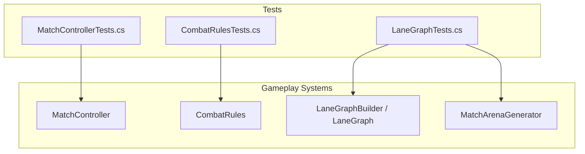
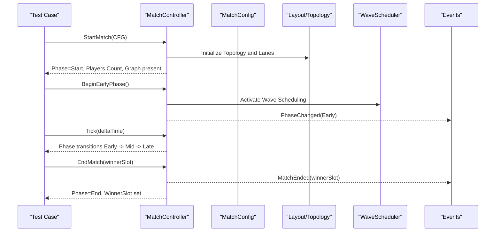
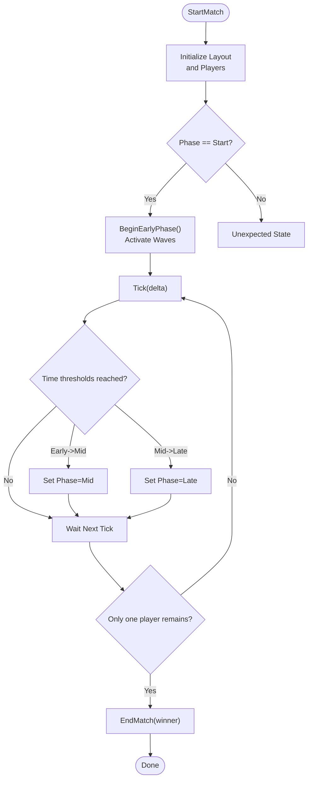
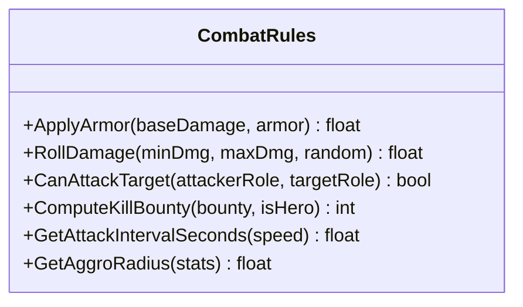
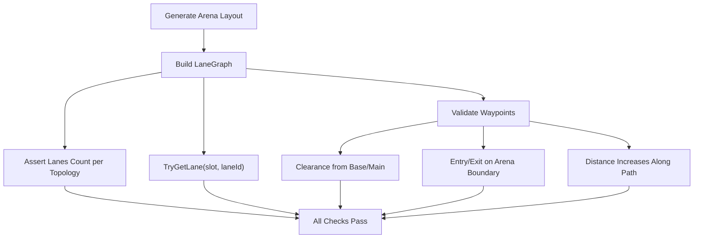
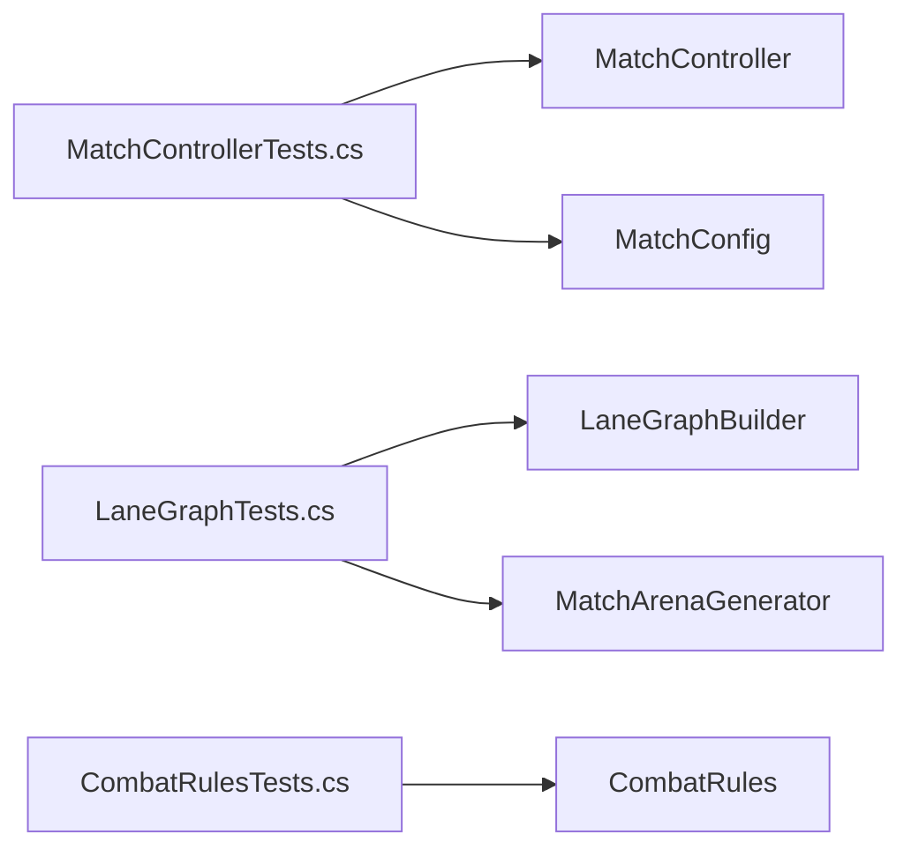

# Testing & Quality Assurance

<cite>
**Referenced Files in This Document**
- [MatchControllerTests.cs](file://Assets/Game/Scripts/Tests/MatchControllerTests.cs)
- [CombatRulesTests.cs](file://Assets/Game/Scripts/Tests/CombatRulesTests.cs)
- [LaneGraphTests.cs](file://Assets/Game/Scripts/Tests/LaneGraphTests.cs)
</cite>

## Table of Contents
1. [Introduction](#introduction)
2. [Project Structure](#project-structure)
3. [Core Components](#core-components)
4. [Architecture Overview](#architecture-overview)
5. [Detailed Component Analysis](#detailed-component-analysis)
6. [Dependency Analysis](#dependency-analysis)
7. [Performance Considerations](#performance-considerations)
8. [Troubleshooting Guide](#troubleshooting-guide)
9. [Conclusion](#conclusion)
10. [Appendices](#appendices)

## Introduction
This document explains BARAKI’s testing framework and quality assurance processes with a focus on the test organization under Assets/Game/Scripts/Tests. It covers unit tests, integration-style tests, and smoke-style validations for critical systems such as MatchController, CombatRules, and LaneGraph. It also provides guidelines for writing effective tests, mocking external dependencies, maintaining coverage, continuous integration setup, automated pipelines, performance regression testing, debugging techniques, profiling tools, and quality metrics.

## Project Structure
The project uses NUnit-based tests located under Assets/Game/Scripts/Tests. The existing tests demonstrate:
- Unit tests for pure logic (e.g., combat rules).
- Integration-style tests that coordinate multiple subsystems (e.g., match lifecycle and lane graph construction).
- Smoke-style assertions validating end-to-end behaviors (e.g., topology correctness and path geometry constraints).

[No sources needed since this diagram shows conceptual structure]

## Core Components
- MatchController tests validate match initialization, phase transitions, timing, winner determination, and elimination conditions. They assert state changes, event firing, and resource counts across players and buildings.
- CombatRules tests verify deterministic math and rule enforcement: armor clamping, damage rolling ranges, attack eligibility by role, kill bounty scaling, attack interval calculation, and aggro radius computation.
- LaneGraph tests ensure correct lane generation per topology, path geometry constraints (clearance from base interiors, main building avoidance), spawn clearance relative to barracks, and arena boundary behavior for center lanes.

Key patterns observed:
- Direct instantiation of system classes within tests.
- Use of configuration helpers (e.g., MatchConfig) to set up scenarios.
- Assertions over public APIs and observable state/events.
- Geometric checks using Unity math utilities for spatial validation.

**Section sources**
- [MatchControllerTests.cs:10-21](file://Assets/Game/Scripts/Tests/MatchControllerTests.cs#L10-L21)
- [MatchControllerTests.cs:23-35](file://Assets/Game/Scripts/Tests/MatchControllerTests.cs#L23-L35)
- [MatchControllerTests.cs:37-51](file://Assets/Game/Scripts/Tests/MatchControllerTests.cs#L37-L51)
- [MatchControllerTests.cs:53-68](file://Assets/Game/Scripts/Tests/MatchControllerTests.cs#L53-L68)
- [MatchControllerTests.cs:70-91](file://Assets/Game/Scripts/Tests/MatchControllerTests.cs#L70-L91)
- [MatchControllerTests.cs:93-105](file://Assets/Game/Scripts/Tests/MatchControllerTests.cs#L93-L105)
- [MatchControllerTests.cs:107-117](file://Assets/Game/Scripts/Tests/MatchControllerTests.cs#L107-L117)
- [MatchControllerTests.cs:119-128](file://Assets/Game/Scripts/Tests/MatchControllerTests.cs#L119-L128)
- [MatchControllerTests.cs:130-138](file://Assets/Game/Scripts/Tests/MatchControllerTests.cs#L130-L138)
- [MatchControllerTests.cs:140-166](file://Assets/Game/Scripts/Tests/MatchControllerTests.cs#L140-L166)
- [CombatRulesTests.cs:9-14](file://Assets/Game/Scripts/Tests/CombatRulesTests.cs#L9-L14)
- [CombatRulesTests.cs:16-26](file://Assets/Game/Scripts/Tests/CombatRulesTests.cs#L16-L26)
- [CombatRulesTests.cs:28-35](file://Assets/Game/Scripts/Tests/CombatRulesTests.cs#L28-L35)
- [CombatRulesTests.cs:37-42](file://Assets/Game/Scripts/Tests/CombatRulesTests.cs#L37-L42)
- [CombatRulesTests.cs:44-49](file://Assets/Game/Scripts/Tests/CombatRulesTests.cs#L44-L49)
- [CombatRulesTests.cs:51-59](file://Assets/Game/Scripts/Tests/CombatRulesTests.cs#L51-L59)
- [LaneGraphTests.cs:13-21](file://Assets/Game/Scripts/Tests/LaneGraphTests.cs#L13-L21)
- [LaneGraphTests.cs:23-31](file://Assets/Game/Scripts/Tests/LaneGraphTests.cs#L23-L31)
- [LaneGraphTests.cs:33-47](file://Assets/Game/Scripts/Tests/LaneGraphTests.cs#L33-L47)
- [LaneGraphTests.cs:49-85](file://Assets/Game/Scripts/Tests/LaneGraphTests.cs#L49-L85)
- [LaneGraphTests.cs:87-115](file://Assets/Game/Scripts/Tests/LaneGraphTests.cs#L87-L115)
- [LaneGraphTests.cs:117-152](file://Assets/Game/Scripts/Tests/LaneGraphTests.cs#L117-L152)
- [LaneGraphTests.cs:154-165](file://Assets/Game/Scripts/Tests/LaneGraphTests.cs#L154-L165)
- [LaneGraphTests.cs:167-182](file://Assets/Game/Scripts/Tests/LaneGraphTests.cs#L167-L182)
- [LaneGraphTests.cs:184-197](file://Assets/Game/Scripts/Tests/LaneGraphTests.cs#L184-L197)
- [LaneGraphTests.cs:199-231](file://Assets/Game/Scripts/Tests/LaneGraphTests.cs#L199-L231)
- [LaneGraphTests.cs:233-260](file://Assets/Game/Scripts/Tests/LaneGraphTests.cs#L233-L260)
- [LaneGraphTests.cs:262-277](file://Assets/Game/Scripts/Tests/LaneGraphTests.cs#L262-L277)
- [LaneGraphTests.cs:279-293](file://Assets/Game/Scripts/Tests/LaneGraphTests.cs#L279-L293)
- [LaneGraphTests.cs:295-307](file://Assets/Game/Scripts/Tests/LaneGraphTests.cs#L295-L307)

## Architecture Overview
The tests exercise core gameplay loops and data-driven systems:
- MatchController orchestrates match phases, player setup, wave scheduling, and termination.
- CombatRules encapsulates deterministic combat math and policy functions.
- LaneGraphBuilder constructs navigable lane graphs from generated arena layouts, validated by geometric and topological assertions.

**Diagram sources**
- [MatchControllerTests.cs:10-21](file://Assets/Game/Scripts/Tests/MatchControllerTests.cs#L10-L21)
- [MatchControllerTests.cs:37-51](file://Assets/Game/Scripts/Tests/MatchControllerTests.cs#L37-L51)
- [MatchControllerTests.cs:53-68](file://Assets/Game/Scripts/Tests/MatchControllerTests.cs#L53-L68)
- [MatchControllerTests.cs:70-91](file://Assets/Game/Scripts/Tests/MatchControllerTests.cs#L70-L91)
- [MatchControllerTests.cs:93-105](file://Assets/Game/Scripts/Tests/MatchControllerTests.cs#L93-L105)

## Detailed Component Analysis

### MatchController Tests
Focus areas:
- Initialization and topology selection based on player count.
- Player gold grants per race and building initialization counts.
- Phase transitions driven by time ticks and explicit calls.
- Event signaling for phase changes and match end.
- Elimination logic when all buildings of one player are destroyed.

**Diagram sources**
- [MatchControllerTests.cs:10-21](file://Assets/Game/Scripts/Tests/MatchControllerTests.cs#L10-L21)
- [MatchControllerTests.cs:37-51](file://Assets/Game/Scripts/Tests/MatchControllerTests.cs#L37-L51)
- [MatchControllerTests.cs:53-68](file://Assets/Game/Scripts/Tests/MatchControllerTests.cs#L53-L68)
- [MatchControllerTests.cs:140-166](file://Assets/Game/Scripts/Tests/MatchControllerTests.cs#L140-L166)

**Section sources**
- [MatchControllerTests.cs:10-21](file://Assets/Game/Scripts/Tests/MatchControllerTests.cs#L10-L21)
- [MatchControllerTests.cs:23-35](file://Assets/Game/Scripts/Tests/MatchControllerTests.cs#L23-L35)
- [MatchControllerTests.cs:37-51](file://Assets/Game/Scripts/Tests/MatchControllerTests.cs#L37-L51)
- [MatchControllerTests.cs:53-68](file://Assets/Game/Scripts/Tests/MatchControllerTests.cs#L53-L68)
- [MatchControllerTests.cs:70-91](file://Assets/Game/Scripts/Tests/MatchControllerTests.cs#L70-L91)
- [MatchControllerTests.cs:93-105](file://Assets/Game/Scripts/Tests/MatchControllerTests.cs#L93-L105)
- [MatchControllerTests.cs:107-117](file://Assets/Game/Scripts/Tests/MatchControllerTests.cs#L107-L117)
- [MatchControllerTests.cs:119-128](file://Assets/Game/Scripts/Tests/MatchControllerTests.cs#L119-L128)
- [MatchControllerTests.cs:130-138](file://Assets/Game/Scripts/Tests/MatchControllerTests.cs#L130-L138)
- [MatchControllerTests.cs:140-166](file://Assets/Game/Scripts/Tests/MatchControllerTests.cs#L140-L166)

### CombatRules Tests
Focus areas:
- Armor application clamps minimum damage.
- Damage rolling stays within configured bounds.
- Attack eligibility depends on roles (melee/ranged/siege vs flying/melee).
- Kill bounty doubles for heroes.
- Attack interval is reciprocal of speed.
- Aggro radius respects minimum and scales with attack range.

**Diagram sources**
- [CombatRulesTests.cs:9-14](file://Assets/Game/Scripts/Tests/CombatRulesTests.cs#L9-L14)
- [CombatRulesTests.cs:16-26](file://Assets/Game/Scripts/Tests/CombatRulesTests.cs#L16-L26)
- [CombatRulesTests.cs:28-35](file://Assets/Game/Scripts/Tests/CombatRulesTests.cs#L28-L35)
- [CombatRulesTests.cs:37-42](file://Assets/Game/Scripts/Tests/CombatRulesTests.cs#L37-L42)
- [CombatRulesTests.cs:44-49](file://Assets/Game/Scripts/Tests/CombatRulesTests.cs#L44-L49)
- [CombatRulesTests.cs:51-59](file://Assets/Game/Scripts/Tests/CombatRulesTests.cs#L51-L59)

**Section sources**
- [CombatRulesTests.cs:9-14](file://Assets/Game/Scripts/Tests/CombatRulesTests.cs#L9-L14)
- [CombatRulesTests.cs:16-26](file://Assets/Game/Scripts/Tests/CombatRulesTests.cs#L16-L26)
- [CombatRulesTests.cs:28-35](file://Assets/Game/Scripts/Tests/CombatRulesTests.cs#L28-L35)
- [CombatRulesTests.cs:37-42](file://Assets/Game/Scripts/Tests/CombatRulesTests.cs#L37-L42)
- [CombatRulesTests.cs:44-49](file://Assets/Game/Scripts/Tests/CombatRulesTests.cs#L44-L49)
- [CombatRulesTests.cs:51-59](file://Assets/Game/Scripts/Tests/CombatRulesTests.cs#L51-L59)

### LaneGraph Tests
Focus areas:
- Correct number of lanes per topology (N2 duel, N4 ring).
- Per-player lane accessors for Left/Center/Right.
- Flank paths leaving barracks outward and avoiding base interior.
- Spawn clearance ahead of march direction.
- Center lane passes through central arena and enters/exits at boundary.
- Path length and progression away from start.
- All slots have three lanes for larger player counts.

**Diagram sources**
- [LaneGraphTests.cs:13-21](file://Assets/Game/Scripts/Tests/LaneGraphTests.cs#L13-L21)
- [LaneGraphTests.cs:23-31](file://Assets/Game/Scripts/Tests/LaneGraphTests.cs#L23-L31)
- [LaneGraphTests.cs:33-47](file://Assets/Game/Scripts/Tests/LaneGraphTests.cs#L33-L47)
- [LaneGraphTests.cs:49-85](file://Assets/Game/Scripts/Tests/LaneGraphTests.cs#L49-L85)
- [LaneGraphTests.cs:87-115](file://Assets/Game/Scripts/Tests/LaneGraphTests.cs#L87-L115)
- [LaneGraphTests.cs:117-152](file://Assets/Game/Scripts/Tests/LaneGraphTests.cs#L117-L152)
- [LaneGraphTests.cs:154-165](file://Assets/Game/Scripts/Tests/LaneGraphTests.cs#L154-L165)
- [LaneGraphTests.cs:167-182](file://Assets/Game/Scripts/Tests/LaneGraphTests.cs#L167-L182)
- [LaneGraphTests.cs:184-197](file://Assets/Game/Scripts/Tests/LaneGraphTests.cs#L184-L197)
- [LaneGraphTests.cs:199-231](file://Assets/Game/Scripts/Tests/LaneGraphTests.cs#L199-L231)
- [LaneGraphTests.cs:233-260](file://Assets/Game/Scripts/Tests/LaneGraphTests.cs#L233-L260)
- [LaneGraphTests.cs:262-277](file://Assets/Game/Scripts/Tests/LaneGraphTests.cs#L262-L277)
- [LaneGraphTests.cs:279-293](file://Assets/Game/Scripts/Tests/LaneGraphTests.cs#L279-L293)
- [LaneGraphTests.cs:295-307](file://Assets/Game/Scripts/Tests/LaneGraphTests.cs#L295-L307)

**Section sources**
- [LaneGraphTests.cs:13-21](file://Assets/Game/Scripts/Tests/LaneGraphTests.cs#L13-L21)
- [LaneGraphTests.cs:23-31](file://Assets/Game/Scripts/Tests/LaneGraphTests.cs#L23-L31)
- [LaneGraphTests.cs:33-47](file://Assets/Game/Scripts/Tests/LaneGraphTests.cs#L33-L47)
- [LaneGraphTests.cs:49-85](file://Assets/Game/Scripts/Tests/LaneGraphTests.cs#L49-L85)
- [LaneGraphTests.cs:87-115](file://Assets/Game/Scripts/Tests/LaneGraphTests.cs#L87-L115)
- [LaneGraphTests.cs:117-152](file://Assets/Game/Scripts/Tests/LaneGraphTests.cs#L117-L152)
- [LaneGraphTests.cs:154-165](file://Assets/Game/Scripts/Tests/LaneGraphTests.cs#L154-L165)
- [LaneGraphTests.cs:167-182](file://Assets/Game/Scripts/Tests/LaneGraphTests.cs#L167-L182)
- [LaneGraphTests.cs:184-197](file://Assets/Game/Scripts/Tests/LaneGraphTests.cs#L184-L197)
- [LaneGraphTests.cs:199-231](file://Assets/Game/Scripts/Tests/LaneGraphTests.cs#L199-L231)
- [LaneGraphTests.cs:233-260](file://Assets/Game/Scripts/Tests/LaneGraphTests.cs#L233-L260)
- [LaneGraphTests.cs:262-277](file://Assets/Game/Scripts/Tests/LaneGraphTests.cs#L262-L277)
- [LaneGraphTests.cs:279-293](file://Assets/Game/Scripts/Tests/LaneGraphTests.cs#L279-L293)
- [LaneGraphTests.cs:295-307](file://Assets/Game/Scripts/Tests/LaneGraphTests.cs#L295-L307)

## Dependency Analysis
- MatchController tests depend on configuration and layout abstractions to initialize matches and assert state.
- LaneGraph tests depend on arena generation and lane builder to construct and validate paths.
- CombatRules tests are self-contained and rely only on deterministic functions.

**Diagram sources**
- [MatchControllerTests.cs:10-21](file://Assets/Game/Scripts/Tests/MatchControllerTests.cs#L10-L21)
- [LaneGraphTests.cs:13-21](file://Assets/Game/Scripts/Tests/LaneGraphTests.cs#L13-L21)
- [CombatRulesTests.cs:9-14](file://Assets/Game/Scripts/Tests/CombatRulesTests.cs#L9-L14)

**Section sources**
- [MatchControllerTests.cs:10-21](file://Assets/Game/Scripts/Tests/MatchControllerTests.cs#L10-L21)
- [LaneGraphTests.cs:13-21](file://Assets/Game/Scripts/Tests/LaneGraphTests.cs#L13-L21)
- [CombatRulesTests.cs:9-14](file://Assets/Game/Scripts/Tests/CombatRulesTests.cs#L9-L14)

## Performance Considerations
- Keep unit tests fast and deterministic; avoid heavy scene loads or I/O.
- For geometry-heavy tests (e.g., LaneGraph), sample waypoints efficiently and reuse computed values where possible.
- Prefer fixed seeds for randomized components to stabilize runtime and enable reproducible failures.
- Batch assertions to reduce overhead and improve readability.

[No sources needed since this section provides general guidance]

## Troubleshooting Guide
Common issues and strategies:
- Flaky timing tests: use explicit phase transitions and small delta steps rather than relying on real-time accumulation.
- Floating-point comparisons: use tolerance-based assertions for distances and dot products.
- Non-deterministic RNG: inject a seeded random instance into methods that roll damage or generate randomness.
- Network-dependent flows: mock network interfaces or stub callbacks to simulate latency, packet loss, and reconnection states.

Guidelines for writing effective tests:
- Arrange-Act-Assert pattern with clear setup and teardown.
- Isolate external dependencies via interfaces and dependency injection.
- Cover edge cases: zero players, single-lane anomalies, extreme stats, and invalid inputs.
- Maintain descriptive test names that encode intent and scenario.

Mocking external dependencies:
- Define thin interfaces around networking, persistence, and platform services.
- Provide test-only implementations that return predictable results.
- Verify interactions using recorded calls or simple counters.

Maintaining test coverage:
- Track coverage per module (combat, match flow, navigation).
- Enforce minimum thresholds for critical subsystems.
- Add regression tests for any discovered bugs.

Continuous integration and automated pipelines:
- Run unit and integration tests on every commit and pull request.
- Execute smoke tests against minimal scenes to catch regressions early.
- Publish test reports and artifacts for review.

Performance regression testing:
- Benchmark hot paths (damage calculations, path queries) with stable hardware profiles.
- Compare metrics across branches and fail builds on significant regressions.

Debugging techniques and profiling tools:
- Use Unity Profiler and Frame Debugger for visual bottlenecks.
- Log structured events around state transitions and key decisions.
- Capture minimal reproducers for intermittent failures.

Quality metrics:
- Coverage percentage per subsystem.
- Test execution time budgets.
- Failure rate trends and flakiness index.

[No sources needed since this section provides general guidance]

## Conclusion
BARAKI’s current tests provide strong unit-level guarantees for combat rules and robust integration-style validations for match lifecycle and lane graph geometry. By extending these patterns—adding mocks for external systems, expanding edge-case coverage, and integrating CI with performance benchmarks—the team can maintain high code health and confidence during rapid iteration.

[No sources needed since this section summarizes without analyzing specific files]

## Appendices

### Example Test Scenarios (by category)
- Gameplay mechanics:
  - Armor clamping and damage ranges.
  - Hero kill bounty doubling.
  - Attack intervals derived from speed.
- Networking scenarios:
  - Simulate delayed messages and out-of-order packets.
  - Validate client reconciliation after reconnect.
- Edge cases:
  - Single-player match behavior.
  - Zero-length lanes or degenerate geometries.
  - Extreme stat values and overflow handling.

[No sources needed since this section provides general guidance]