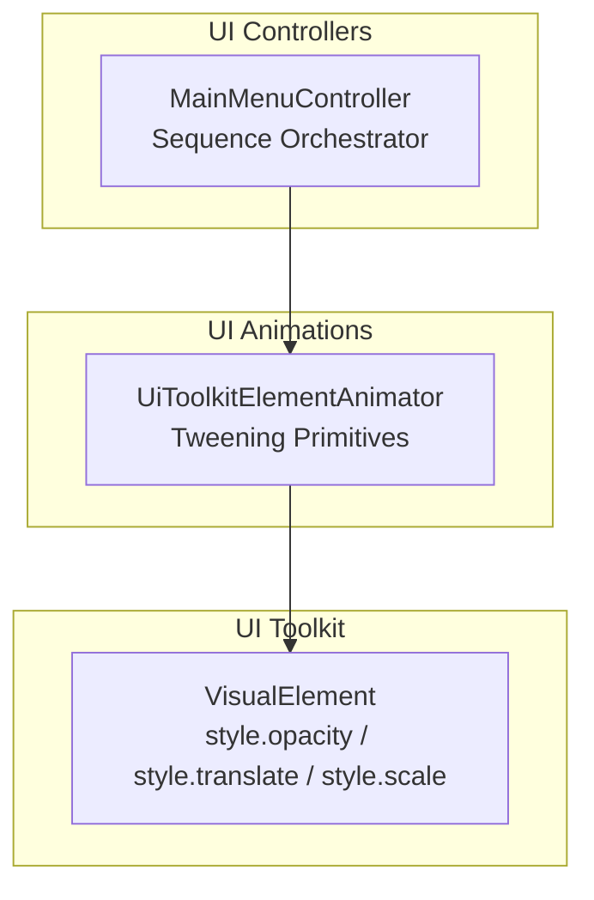
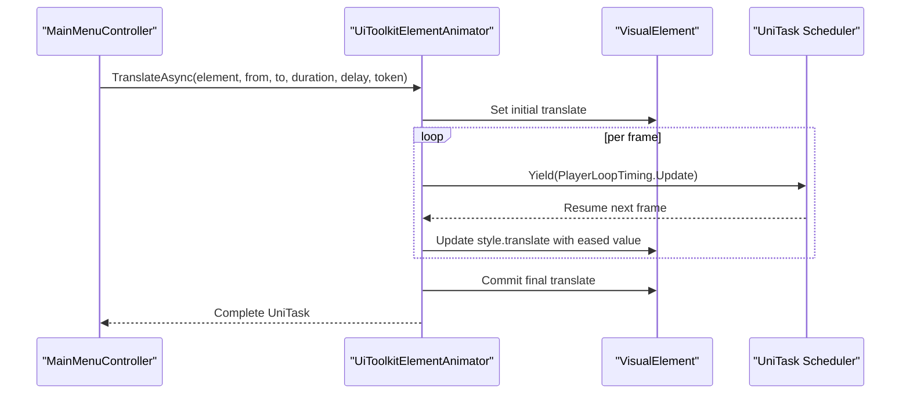
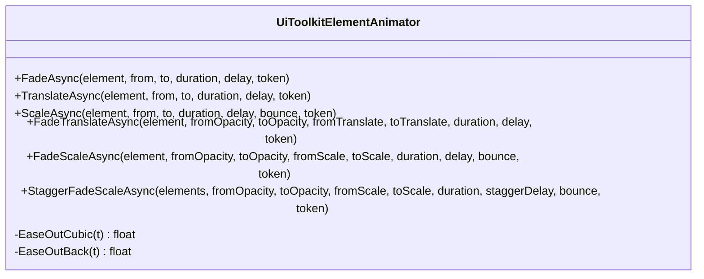
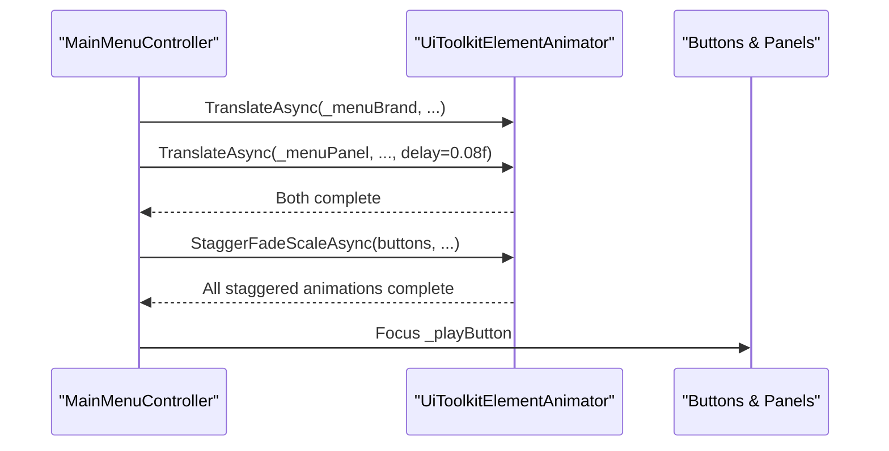
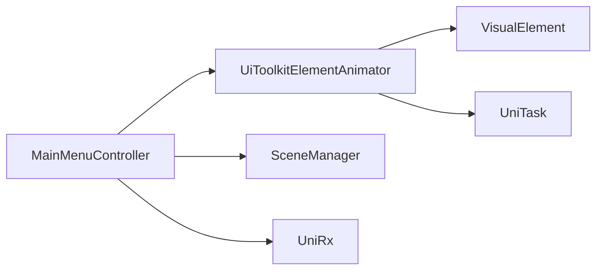

# Animation System

<cite>
**Referenced Files in This Document**
- [UiToolkitElementAnimator.cs](file://Assets/Game/UI/Runtime/Animations/UiToolkitElementAnimator.cs)
- [MainMenuController.cs](file://Assets/Game/UI/Runtime/Controllers/MainMenuController.cs)
</cite>

## Table of Contents
1. [Introduction](#introduction)
2. [Project Structure](#project-structure)
3. [Core Components](#core-components)
4. [Architecture Overview](#architecture-overview)
5. [Detailed Component Analysis](#detailed-component-analysis)
6. [Dependency Analysis](#dependency-analysis)
7. [Performance Considerations](#performance-considerations)
8. [Troubleshooting Guide](#troubleshooting-guide)
9. [Conclusion](#conclusion)
10. [Appendices](#appendices)

## Introduction
This document explains BARAKI’s UI animation system built around UiToolkitElementAnimator, a lightweight tweening API for Unity UI Toolkit elements. It covers the animation pipeline (tweening and easing), timeline management via asynchronous UniTask-based methods, event handling patterns, and synchronization with gameplay state changes. It also provides practical examples such as panel transitions, button feedback, and loading indicators, along with guidelines for performance optimization, pooling strategies, and memory management during intensive UI animations.

## Project Structure
The animation system is implemented as a small, focused set of components:
- UiToolkitElementAnimator: Static helper class providing tweening primitives and composable sequences.
- MainMenuController: A representative consumer that orchestrates complex sequences and integrates animations with UI state and scene flow.

**Diagram sources**
- [UiToolkitElementAnimator.cs:12-262](file://Assets/Game/UI/Runtime/Animations/UiToolkitElementAnimator.cs#L12-L262)
- [MainMenuController.cs:147-431](file://Assets/Game/UI/Runtime/Controllers/MainMenuController.cs#L147-L431)

**Section sources**
- [UiToolkitElementAnimator.cs:1-264](file://Assets/Game/UI/Runtime/Animations/UiToolkitElementAnimator.cs#L1-L264)
- [MainMenuController.cs:1-441](file://Assets/Game/UI/Runtime/Controllers/MainMenuController.cs#L1-L441)

## Core Components
- UiToolkitElementAnimator
  - Provides async tweening methods for opacity, translation, scale, and combined effects.
  - Supports optional delay, cancellation, and bounce variants.
  - Includes staggered sequence helpers to animate multiple elements with incremental delays.
  - Implements easing functions used across tweens.

- MainMenuController
  - Demonstrates how to compose multiple animations into coherent sequences.
  - Integrates animations with UI state flags, focus management, and scene transitions.
  - Uses cancellation tokens tied to component lifecycle to prevent leaks.

Key capabilities:
- Tweening primitives: FadeAsync, TranslateAsync, ScaleAsync, FadeTranslateAsync, FadeScaleAsync.
- Sequencing: StaggerFadeScaleAsync for cascading reveals.
- Easing: EaseOutCubic and EaseOutBack.
- Async control: UniTask-based APIs with CancellationToken support.

**Section sources**
- [UiToolkitElementAnimator.cs:14-261](file://Assets/Game/UI/Runtime/Animations/UiToolkitElementAnimator.cs#L14-L261)
- [MainMenuController.cs:147-431](file://Assets/Game/UI/Runtime/Controllers/MainMenuController.cs#L147-L431)

## Architecture Overview
The animation architecture follows a simple, layered design:
- Controllers orchestrate high-level flows by composing low-level tweens.
- The animator updates VisualElement styles each frame using unscaled delta time and yields on Update.
- Cancellation tokens allow safe interruption when UI or scenes change.

**Diagram sources**
- [UiToolkitElementAnimator.cs:51-88](file://Assets/Game/UI/Runtime/Animations/UiToolkitElementAnimator.cs#L51-L88)
- [MainMenuController.cs:155-170](file://Assets/Game/UI/Runtime/Controllers/MainMenuController.cs#L155-L170)

## Detailed Component Analysis

### UiToolkitElementAnimator
A static utility class exposing fluent, async tweening methods for UI Toolkit elements. Each method:
- Validates inputs and handles zero-duration or null element cases by immediately setting final values.
- Optionally waits for a delay before starting.
- Initializes element styles to start values.
- Runs a frame-by-frame loop using Time.unscaledDeltaTime and yields on PlayerLoopTiming.Update.
- Applies easing to compute interpolated values and updates element styles accordingly.
- Ensures final values are committed after the loop completes.
- Respects CancellationToken to abort early if needed.

Supported primitives:
- FadeAsync: Interpolates opacity.
- TranslateAsync: Interpolates position via style.translate.
- ScaleAsync: Interpolates scale via style.scale; supports bounce variant.
- FadeTranslateAsync: Combined fade and translate.
- FadeScaleAsync: Combined fade and scale; supports bounce variant.
- StaggerFadeScaleAsync: Animates a list of elements with staggered delays.

Easing functions:
- EaseOutCubic: Smooth deceleration curve.
- EaseOutBack: Slight overshoot effect for bounce-like motion.

**Diagram sources**
- [UiToolkitElementAnimator.cs:12-262](file://Assets/Game/UI/Runtime/Animations/UiToolkitElementAnimator.cs#L12-L262)

**Section sources**
- [UiToolkitElementAnimator.cs:14-261](file://Assets/Game/UI/Runtime/Animations/UiToolkitElementAnimator.cs#L14-L261)

### MainMenuController Integration
The controller demonstrates real-world usage:
- Intro sequence: Parallel translations followed by staggered fade/scale of buttons.
- Settings overlay: Fade dim background and bounce-in dialog; reverse on close.
- Scene transition: Scale down main panel, fade out screen, then load next scene.
- State flags: Prevents overlapping animations and ensures correct focus management.
- Cancellation: Uses GetCancellationTokenOnDestroy() to avoid lingering tasks.

**Diagram sources**
- [MainMenuController.cs:147-205](file://Assets/Game/UI/Runtime/Controllers/MainMenuController.cs#L147-L205)
- [UiToolkitElementAnimator.cs:211-249](file://Assets/Game/UI/Runtime/Animations/UiToolkitElementAnimator.cs#L211-L249)

**Section sources**
- [MainMenuController.cs:147-431](file://Assets/Game/UI/Runtime/Controllers/MainMenuController.cs#L147-L431)

### Common Animation Patterns

#### Panel Transitions
- Use FadeAsync to dim overlays and FadeScaleAsync for modal dialogs.
- Combine parallel animations with UniTask.WhenAll for smooth transitions.
- Toggle CSS classes to manage visibility states alongside animations.

References:
- [ShowSettingsAsync:325-357](file://Assets/Game/UI/Runtime/Controllers/MainMenuController.cs#L325-L357)
- [HideSettingsAsync:359-379](file://Assets/Game/UI/Runtime/Controllers/MainMenuController.cs#L359-L379)

#### Button Feedback
- Apply short-scale or fade tweens on click events for tactile feedback.
- Use ScaleAsync with minimal duration and no bounce for snappy responses.

Implementation guidance:
- Trigger on Button.clicked callbacks.
- Keep durations under ~0.15s for responsiveness.

#### Loading Indicators
- Use FadeAsync to reveal/hide a loading overlay.
- For spinners, consider combining FadeAsync with periodic property updates (e.g., rotation via transform or custom style).

Integration example:
- Show overlay with FadeAsync at start of long operations.
- Hide overlay with FadeAsync upon completion.

[No sources needed since this section provides general guidance]

### Timeline Management and Sequencing
- Sequential steps: await one animation before starting the next.
- Parallel steps: use UniTask.WhenAll to run multiple animations concurrently.
- Staggered sequences: use StaggerFadeScaleAsync to cascade animations across lists.
- Delays: pass delay parameters to individual tweens or use UniTask.Delay between steps.

References:
- [PlayIntroAsync:147-205](file://Assets/Game/UI/Runtime/Controllers/MainMenuController.cs#L147-L205)
- [StaggerFadeScaleAsync:211-249](file://Assets/Game/UI/Runtime/Animations/UiToolkitElementAnimator.cs#L211-L249)

**Section sources**
- [MainMenuController.cs:147-205](file://Assets/Game/UI/Runtime/Controllers/MainMenuController.cs#L147-L205)
- [UiToolkitElementAnimator.cs:211-249](file://Assets/Game/UI/Runtime/Animations/UiToolkitElementAnimator.cs#L211-L249)

### Event Handling and Game State Synchronization
- Guard against overlapping animations using boolean flags (e.g., _isTransitioning, _isSettingsAnimating).
- Cancel ongoing animations when leaving screens or destroying controllers using CancellationToken.
- Synchronize focus and interactivity with animation completion to ensure consistent UX.

References:
- [OnEnable/OnDisable:120-140](file://Assets/Game/UI/Runtime/Controllers/MainMenuController.cs#L120-L140)
- [LoadSceneWithFadeAsync:400-431](file://Assets/Game/UI/Runtime/Controllers/MainMenuController.cs#L400-L431)

**Section sources**
- [MainMenuController.cs:120-140](file://Assets/Game/UI/Runtime/Controllers/MainMenuController.cs#L120-L140)
- [MainMenuController.cs:400-431](file://Assets/Game/UI/Runtime/Controllers/MainMenuController.cs#L400-L431)

## Dependency Analysis
- UiToolkitElementAnimator depends on:
  - UnityEngine.UIElements.VisualElement for style manipulation.
  - Cysharp.Threading.Tasks.UniTask for async scheduling and cancellation.
  - UnityEngine.Time for unscaled delta time.
- MainMenuController depends on:
  - UiToolkitElementAnimator for all tweening.
  - UniRx for reactive bindings and extension methods.
  - UnityEngine.SceneManagement for scene loading integration.

**Diagram sources**
- [UiToolkitElementAnimator.cs:1-6](file://Assets/Game/UI/Runtime/Animations/UiToolkitElementAnimator.cs#L1-L6)
- [MainMenuController.cs:1-11](file://Assets/Game/UI/Runtime/Controllers/MainMenuController.cs#L1-L11)

**Section sources**
- [UiToolkitElementAnimator.cs:1-6](file://Assets/Game/UI/Runtime/Animations/UiToolkitElementAnimator.cs#L1-L6)
- [MainMenuController.cs:1-11](file://Assets/Game/UI/Runtime/Controllers/MainMenuController.cs#L1-L11)

## Performance Considerations
- Prefer unscaled time for UI animations to remain responsive regardless of game pause or time scale.
- Batch animations where possible:
  - Use StaggerFadeScaleAsync for lists instead of manual loops.
  - Group independent animations with UniTask.WhenAll.
- Avoid excessive allocations:
  - Reuse lists and temporary vectors when animating large sets.
  - Minimize object creation inside tight loops.
- Limit concurrent animations:
  - Gate animations with flags to prevent redundant work.
- Optimize easing:
  - Precompute or cache easing results if animating many elements simultaneously.
- Memory management:
  - Always propagate CancellationToken to cancel animations on destroy or navigation.
  - Dispose binding scopes and unregister callbacks to prevent leaks.

[No sources needed since this section provides general guidance]

## Troubleshooting Guide
Common issues and resolutions:
- Animations not stopping:
  - Ensure CancellationToken is passed and checked; verify OnDisable/OnDestroy cancels tasks.
- Overlapping animations:
  - Use boolean guards to block new animations while others are running.
- Final state mismatch:
  - Confirm that final values are explicitly set after loops or cancellations.
- Stutter or lag:
  - Reduce number of simultaneous animations; prefer batching and staggering.
  - Check for heavy operations triggered within animation callbacks.

**Section sources**
- [UiToolkitElementAnimator.cs:41-46](file://Assets/Game/UI/Runtime/Animations/UiToolkitElementAnimator.cs#L41-L46)
- [MainMenuController.cs:120-140](file://Assets/Game/UI/Runtime/Controllers/MainMenuController.cs#L120-L140)

## Conclusion
BARAKI’s UI animation system centers on a concise, async-driven tweening API that composes smoothly into complex sequences. By leveraging UniTask for control flow, applying robust easing curves, and integrating with UI Toolkit styles, developers can create fluid transitions, responsive feedback, and polished loading experiences. Following the performance and memory guidelines ensures scalable animations even under heavy UI loads.

[No sources needed since this section summarizes without analyzing specific files]

## Appendices

### API Reference Summary
- FadeAsync: Opacity interpolation with optional delay and cancellation.
- TranslateAsync: Position interpolation via style.translate.
- ScaleAsync: Scale interpolation via style.scale; supports bounce.
- FadeTranslateAsync: Combined fade and translate.
- FadeScaleAsync: Combined fade and scale; supports bounce.
- StaggerFadeScaleAsync: Cascaded fade/scale across element lists.
- Easing: EaseOutCubic, EaseOutBack.

**Section sources**
- [UiToolkitElementAnimator.cs:14-261](file://Assets/Game/UI/Runtime/Animations/UiToolkitElementAnimator.cs#L14-L261)