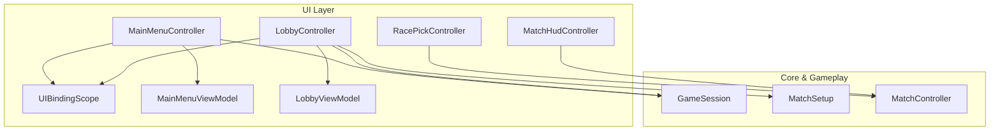
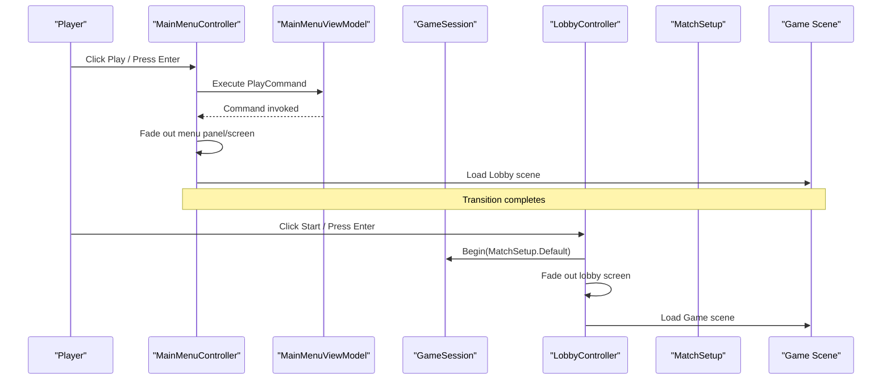
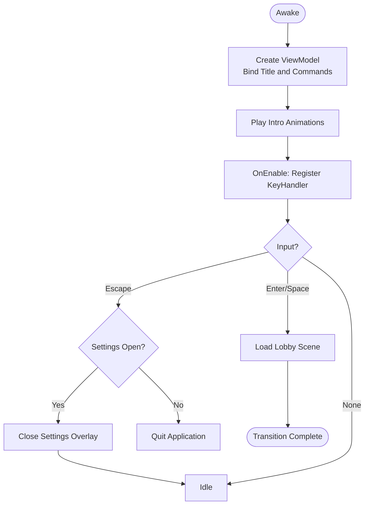
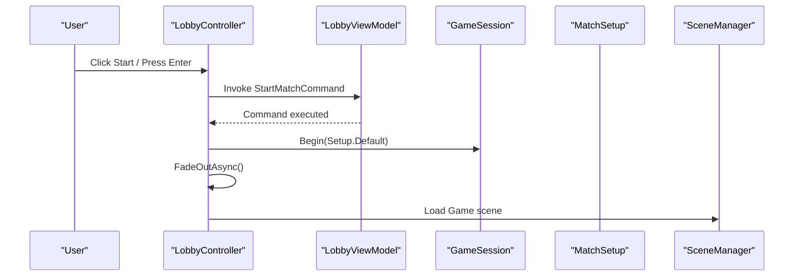
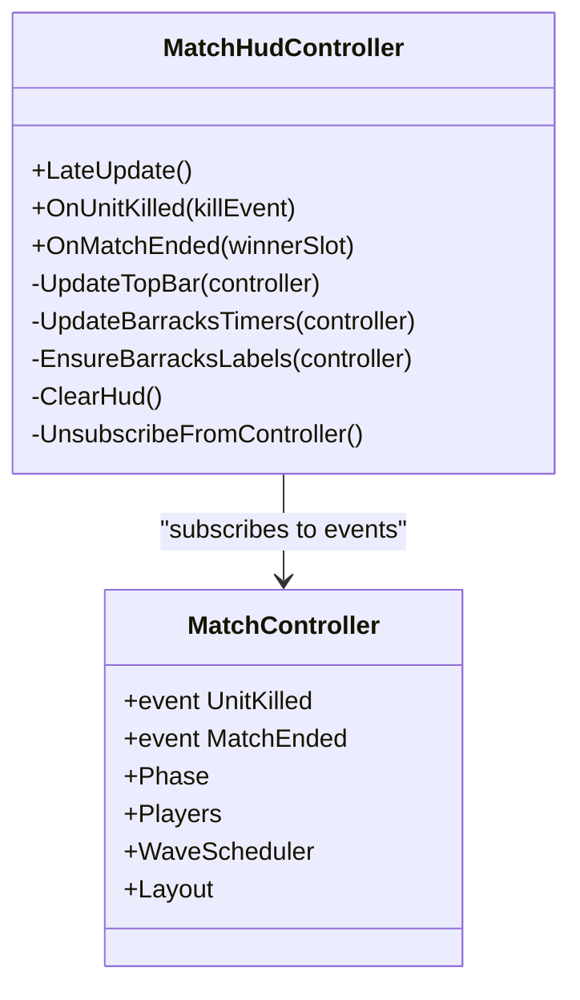
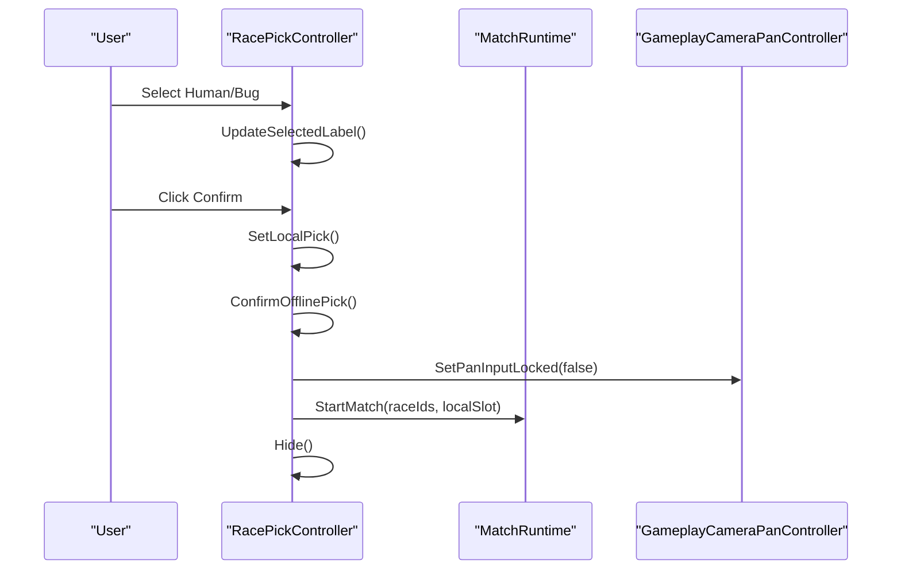
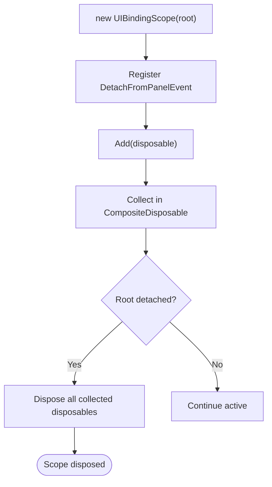
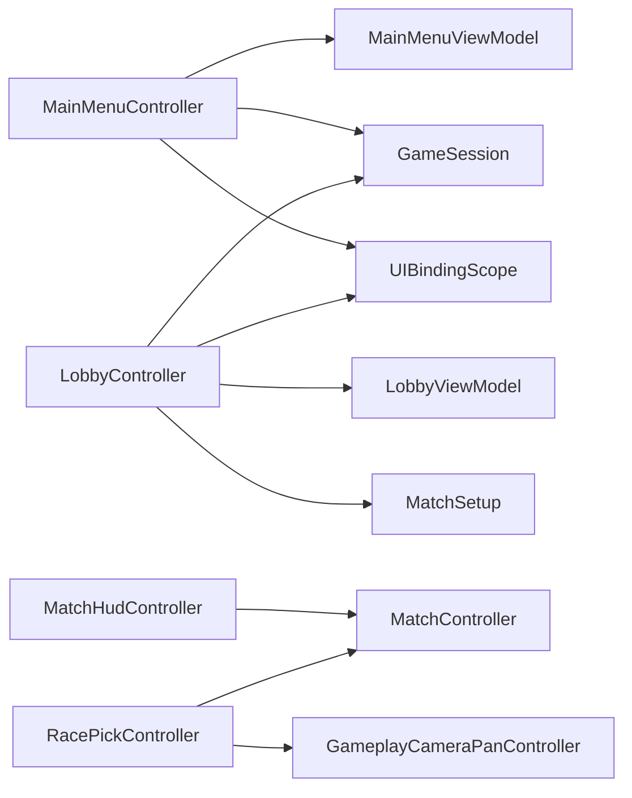

# Controller Architecture

<cite>
**Referenced Files in This Document**
- [MainMenuController.cs](file://Assets/Game/UI/Runtime/Controllers/MainMenuController.cs)
- [LobbyController.cs](file://Assets/Game/UI/Runtime/Controllers/LobbyController.cs)
- [MatchHudController.cs](file://Assets/Game/UI/Runtime/Controllers/MatchHudController.cs)
- [RacePickController.cs](file://Assets/Game/UI/Runtime/Controllers/RacePickController.cs)
- [UIBindingScope.cs](file://Assets/Game/UI/Runtime/Bindings/UIBindingScope.cs)
- [MainMenuViewModel.cs](file://Assets/Game/UI/Runtime/ViewModels/MainMenuViewModel.cs)
- [LobbyViewModel.cs](file://Assets/Game/UI/Runtime/ViewModels/LobbyViewModel.cs)
- [MatchController.cs](file://Assets/Game/Scripts/Runtime/Gameplay/Match/MatchController.cs)
- [GameSession.cs](file://Assets/Game/Scripts/Runtime/Core/GameSession.cs)
- [MatchSetup.cs](file://Assets/Game/Scripts/Runtime/Core/MatchSetup.cs)
</cite>

## Table of Contents
1. Introduction
2. Project Structure
3. Core Components
4. Architecture Overview
5. Detailed Component Analysis
6. Dependency Analysis
7. Performance Considerations
8. Troubleshooting Guide
9. Conclusion

## Introduction
This document explains BARAKI’s UI controller architecture following the MVC pattern. It focuses on scene-specific controllers (MainMenuController, LobbyController, MatchHudController, RacePickController), the UIBindingScope data-binding system, and how controllers interact with game systems through events and services. It also covers initialization patterns, event handling, lifecycle management, communication flows, best practices for organization and dependency injection, testing strategies, and common patterns such as modal dialogs, navigation flows, and state synchronization across screens.

## Project Structure
The UI layer is organized by scenes and responsibilities:
- Controllers live under Game/UI/Runtime/Controllers and orchestrate per-screen behavior.
- ViewModels live under Game/UI/Runtime/ViewModels and expose reactive properties and commands.
- The binding infrastructure lives under Game/UI/Runtime/Bindings and centralizes subscription lifetimes.
- Game systems and match orchestration are under Game/Scripts/Runtime, including core session and match control.

**Diagram sources**
- [MainMenuController.cs:1-441](file://Assets/Game/UI/Runtime/Controllers/MainMenuController.cs#L1-L441)
- [LobbyController.cs:1-136](file://Assets/Game/UI/Runtime/Controllers/LobbyController.cs#L1-L136)
- [MatchHudController.cs:1-293](file://Assets/Game/UI/Runtime/Controllers/MatchHudController.cs#L1-L293)
- [RacePickController.cs:1-163](file://Assets/Game/UI/Runtime/Controllers/RacePickController.cs#L1-L163)
- [UIBindingScope.cs:1-64](file://Assets/Game/UI/Runtime/Bindings/UIBindingScope.cs#L1-L64)
- [MainMenuViewModel.cs:1-12](file://Assets/Game/UI/Runtime/ViewModels/MainMenuViewModel.cs#L1-L12)
- [LobbyViewModel.cs:1-11](file://Assets/Game/UI/Runtime/ViewModels/LobbyViewModel.cs#L1-L11)
- [GameSession.cs:1-35](file://Assets/Game/Scripts/Runtime/Core/GameSession.cs#L1-L35)
- [MatchSetup.cs:1-29](file://Assets/Game/Scripts/Runtime/Core/MatchSetup.cs#L1-L29)
- [MatchController.cs:1-205](file://Assets/Game/Scripts/Runtime/Gameplay/Match/MatchController.cs#L1-L205)

**Section sources**
- [MainMenuController.cs:1-441](file://Assets/Game/UI/Runtime/Controllers/MainMenuController.cs#L1-L441)
- [LobbyController.cs:1-136](file://Assets/Game/UI/Runtime/Controllers/LobbyController.cs#L1-L136)
- [MatchHudController.cs:1-293](file://Assets/Game/UI/Runtime/Controllers/MatchHudController.cs#L1-L293)
- [RacePickController.cs:1-163](file://Assets/Game/UI/Runtime/Controllers/RacePickController.cs#L1-L163)
- [UIBindingScope.cs:1-64](file://Assets/Game/UI/Runtime/Bindings/UIBindingScope.cs#L1-L64)
- [MainMenuViewModel.cs:1-12](file://Assets/Game/UI/Runtime/ViewModels/MainMenuViewModel.cs#L1-L12)
- [LobbyViewModel.cs:1-11](file://Assets/Game/UI/Runtime/ViewModels/LobbyViewModel.cs#L1-L11)
- [GameSession.cs:1-35](file://Assets/Game/Scripts/Runtime/Core/GameSession.cs#L1-L35)
- [MatchSetup.cs:1-29](file://Assets/Game/Scripts/Runtime/Core/MatchSetup.cs#L1-L29)
- [MatchController.cs:1-205](file://Assets/Game/Scripts/Runtime/Gameplay/Match/MatchController.cs#L1-L205)

## Core Components
- Scene controllers encapsulate screen logic, user input, animations, and transitions. They own a UIDocument root and bind to UI elements.
- ViewModels expose reactive properties and commands that drive UI updates and actions without touching UI directly.
- UIBindingScope collects subscriptions and disposes them when the root element detaches or the scope is disposed, preventing leaks.
- GameSession provides global session state and signals between menus and gameplay.
- MatchController orchestrates match phases, waves, combat, and results; UI subscribes to its events to update HUD and overlays.

Key responsibilities:
- MainMenuController: Title display via ViewModel, settings overlay, intro animation, scene navigation to Lobby, quit flow.
- LobbyController: Start match using GameSession and MatchSetup, navigate back to MainMenu, keyboard shortcuts.
- MatchHudController: Subscribe to MatchController events, render phase/time/gold, barracks timers, bounty popups, results overlay.
- RacePickController: Local race selection, confirm pick, start match via MatchRuntime, lock camera pan during selection.

**Section sources**
- [MainMenuController.cs:1-441](file://Assets/Game/UI/Runtime/Controllers/MainMenuController.cs#L1-L441)
- [LobbyController.cs:1-136](file://Assets/Game/UI/Runtime/Controllers/LobbyController.cs#L1-L136)
- [MatchHudController.cs:1-293](file://Assets/Game/UI/Runtime/Controllers/MatchHudController.cs#L1-L293)
- [RacePickController.cs:1-163](file://Assets/Game/UI/Runtime/Controllers/RacePickController.cs#L1-L163)
- [UIBindingScope.cs:1-64](file://Assets/Game/UI/Runtime/Bindings/UIBindingScope.cs#L1-L64)
- [MainMenuViewModel.cs:1-12](file://Assets/Game/UI/Runtime/ViewModels/MainMenuViewModel.cs#L1-L12)
- [LobbyViewModel.cs:1-11](file://Assets/Game/UI/Runtime/ViewModels/LobbyViewModel.cs#L1-L11)
- [GameSession.cs:1-35](file://Assets/Game/Scripts/Runtime/Core/GameSession.cs#L1-L35)
- [MatchController.cs:1-205](file://Assets/Game/Scripts/Runtime/Gameplay/Match/MatchController.cs#L1-L205)

## Architecture Overview
The UI follows MVC:
- Model: GameSession, MatchSetup, MatchController, and other gameplay systems.
- View: UIElements trees rooted at UIDocument.
- Controller: Per-scene controllers coordinating View and Model.
- Binding: UIBindingScope manages reactive subscriptions from ViewModels to UI.

**Diagram sources**
- [MainMenuController.cs:1-441](file://Assets/Game/UI/Runtime/Controllers/MainMenuController.cs#L1-L441)
- [MainMenuViewModel.cs:1-12](file://Assets/Game/UI/Runtime/ViewModels/MainMenuViewModel.cs#L1-L12)
- [LobbyController.cs:1-136](file://Assets/Game/UI/Runtime/Controllers/LobbyController.cs#L1-L136)
- [GameSession.cs:1-35](file://Assets/Game/Scripts/Runtime/Core/GameSession.cs#L1-L35)
- [MatchSetup.cs:1-29](file://Assets/Game/Scripts/Runtime/Core/MatchSetup.cs#L1-L29)

## Detailed Component Analysis

### MainMenuController
Responsibilities:
- Initialize UIDocument root and query UI elements.
- Create MainMenuViewModel and bind title text and commands via UIBindingScope.
- Manage settings overlay (modal dialog) with fade/scale animations and focus management.
- Handle keyboard input (Escape to close settings or quit, Enter/Space to play).
- Perform scene transitions with fade-out and scale effects.

Initialization and binding:
- Creates ViewModel, binds ReactiveProperty and ReactiveCommand to UI elements.
- Uses UIBindingScope.Add to collect subscriptions and dispose on destroy.

Event handling:
- Settings open/close toggles classes and animates overlay/dialog.
- Keyboard handler routes Escape and Enter/Space to appropriate actions.

Lifecycle:
- Awake: setup and bindings.
- OnEnable/OnDisable: register/unregister key callbacks and run intro animations.
- OnDestroy: dispose binding scope.

Navigation:
- Play navigates to Lobby scene with fade.
- Quit exits editor playmode or application.

**Diagram sources**
- [MainMenuController.cs:1-441](file://Assets/Game/UI/Runtime/Controllers/MainMenuController.cs#L1-L441)
- [MainMenuViewModel.cs:1-12](file://Assets/Game/UI/Runtime/ViewModels/MainMenuViewModel.cs#L1-L12)

**Section sources**
- [MainMenuController.cs:1-441](file://Assets/Game/UI/Runtime/Controllers/MainMenuController.cs#L1-L441)
- [MainMenuViewModel.cs:1-12](file://Assets/Game/UI/Runtime/ViewModels/MainMenuViewModel.cs#L1-L12)

### LobbyController
Responsibilities:
- Bind Start and Back commands to buttons via ViewModel and UIBindingScope.
- Handle keyboard shortcuts (Enter/Space to start, Escape to go back).
- Initiate match by calling GameSession.Begin with MatchSetup.Default and load the Game scene.
- Fade out the lobby screen before transitioning.

Initialization and binding:
- Creates LobbyViewModel and binds commands to UI.
- Registers keydown callback on enable and unregisters on disable.

Navigation:
- Start match: begin session, fade out, load Game scene.
- Back: fade out, load MainMenu scene.

**Diagram sources**
- [LobbyController.cs:1-136](file://Assets/Game/UI/Runtime/Controllers/LobbyController.cs#L1-L136)
- [LobbyViewModel.cs:1-11](file://Assets/Game/UI/Runtime/ViewModels/LobbyViewModel.cs#L1-L11)
- [GameSession.cs:1-35](file://Assets/Game/Scripts/Runtime/Core/GameSession.cs#L1-L35)
- [MatchSetup.cs:1-29](file://Assets/Game/Scripts/Runtime/Core/MatchSetup.cs#L1-L29)

**Section sources**
- [LobbyController.cs:1-136](file://Assets/Game/UI/Runtime/Controllers/LobbyController.cs#L1-L136)
- [LobbyViewModel.cs:1-11](file://Assets/Game/UI/Runtime/ViewModels/LobbyViewModel.cs#L1-L11)
- [GameSession.cs:1-35](file://Assets/Game/Scripts/Runtime/Core/GameSession.cs#L1-L35)
- [MatchSetup.cs:1-29](file://Assets/Game/Scripts/Runtime/Core/MatchSetup.cs#L1-L29)

### MatchHudController
Responsibilities:
- Subscribe to MatchController events (UnitKilled, MatchEnded).
- Update top bar (phase, time, gold) each frame while match is running.
- Show temporary bounty popup on unit kills for local player.
- Render barracks timers above buildings using world-to-panel projection.
- Display results overlay when match ends.

Event-driven updates:
- Unit kill: format and show bounty popup with timed hide.
- Match ended: format result and show results overlay.

Barracks timer logic:
- Ensure labels exist per barracks.
- Compute world position, project to panel coordinates, set visibility and text based on wave scheduler state.

**Diagram sources**
- [MatchHudController.cs:1-293](file://Assets/Game/UI/Runtime/Controllers/MatchHudController.cs#L1-L293)
- [MatchController.cs:1-205](file://Assets/Game/Scripts/Runtime/Gameplay/Match/MatchController.cs#L1-L205)

**Section sources**
- [MatchHudController.cs:1-293](file://Assets/Game/UI/Runtime/Controllers/MatchHudController.cs#L1-L293)
- [MatchController.cs:1-205](file://Assets/Game/Scripts/Runtime/Gameplay/Match/MatchController.cs#L1-L205)

### RacePickController
Responsibilities:
- Present race selection UI (Human/Bug) and confirm button.
- Lock camera pan input during selection.
- Build slots hint and selected race label.
- Confirm selection and start match via MatchRuntime.

Flow:
- On enable: if not playing or match started, hide and unlock pan input.
- BeginRacePick: create session, initialize UI, lock pan input, show screen.
- SelectRace: update selected label and button states.
- OnConfirm: set local pick, confirm offline pick, start match, hide screen.

**Diagram sources**
- [RacePickController.cs:1-163](file://Assets/Game/UI/Runtime/Controllers/RacePickController.cs#L1-L163)

**Section sources**
- [RacePickController.cs:1-163](file://Assets/Game/UI/Runtime/Controllers/RacePickController.cs#L1-L163)

### UIBindingScope System
Purpose:
- Centralizes subscription lifetime management for UI bindings.
- Automatically disposes all added disposables when the root VisualElement detaches from the panel or when Dispose is called.

Usage pattern:
- Instantiate with root VisualElement.
- Add ReactiveProperty subscriptions and command bindings.
- Dispose in controller OnDestroy or rely on DetachFromPanelEvent.

**Diagram sources**
- [UIBindingScope.cs:1-64](file://Assets/Game/UI/Runtime/Bindings/UIBindingScope.cs#L1-L64)

**Section sources**
- [UIBindingScope.cs:1-64](file://Assets/Game/UI/Runtime/Bindings/UIBindingScope.cs#L1-L64)

## Dependency Analysis
- MainMenuController depends on MainMenuViewModel and GameSession for navigation and quit.
- LobbyController depends on LobbyViewModel, GameSession, and MatchSetup to initiate matches.
- MatchHudController depends on MatchController for live match data and events.
- RacePickController depends on MatchRuntime and GameplayCameraPanController for selection and input locking.
- All controllers use UIBindingScope to manage reactive subscriptions.

**Diagram sources**
- [MainMenuController.cs:1-441](file://Assets/Game/UI/Runtime/Controllers/MainMenuController.cs#L1-L441)
- [LobbyController.cs:1-136](file://Assets/Game/UI/Runtime/Controllers/LobbyController.cs#L1-L136)
- [MatchHudController.cs:1-293](file://Assets/Game/UI/Runtime/Controllers/MatchHudController.cs#L1-L293)
- [RacePickController.cs:1-163](file://Assets/Game/UI/Runtime/Controllers/RacePickController.cs#L1-L163)
- [UIBindingScope.cs:1-64](file://Assets/Game/UI/Runtime/Bindings/UIBindingScope.cs#L1-L64)
- [MainMenuViewModel.cs:1-12](file://Assets/Game/UI/Runtime/ViewModels/MainMenuViewModel.cs#L1-L12)
- [LobbyViewModel.cs:1-11](file://Assets/Game/UI/Runtime/ViewModels/LobbyViewModel.cs#L1-L11)
- [GameSession.cs:1-35](file://Assets/Game/Scripts/Runtime/Core/GameSession.cs#L1-L35)
- [MatchSetup.cs:1-29](file://Assets/Game/Scripts/Runtime/Core/MatchSetup.cs#L1-L29)
- [MatchController.cs:1-205](file://Assets/Game/Scripts/Runtime/Gameplay/Match/MatchController.cs#L1-L205)

**Section sources**
- [MainMenuController.cs:1-441](file://Assets/Game/UI/Runtime/Controllers/MainMenuController.cs#L1-L441)
- [LobbyController.cs:1-136](file://Assets/Game/UI/Runtime/Controllers/LobbyController.cs#L1-L136)
- [MatchHudController.cs:1-293](file://Assets/Game/UI/Runtime/Controllers/MatchHudController.cs#L1-L293)
- [RacePickController.cs:1-163](file://Assets/Game/UI/Runtime/Controllers/RacePickController.cs#L1-L163)
- [UIBindingScope.cs:1-64](file://Assets/Game/UI/Runtime/Bindings/UIBindingScope.cs#L1-L64)
- [MainMenuViewModel.cs:1-12](file://Assets/Game/UI/Runtime/ViewModels/MainMenuViewModel.cs#L1-L12)
- [LobbyViewModel.cs:1-11](file://Assets/Game/UI/Runtime/ViewModels/LobbyViewModel.cs#L1-L11)
- [GameSession.cs:1-35](file://Assets/Game/Scripts/Runtime/Core/GameSession.cs#L1-L35)
- [MatchSetup.cs:1-29](file://Assets/Game/Scripts/Runtime/Core/MatchSetup.cs#L1-L29)
- [MatchController.cs:1-205](file://Assets/Game/Scripts/Runtime/Gameplay/Match/MatchController.cs#L1-L205)

## Performance Considerations
- Prefer UIBindingScope to avoid memory leaks from long-lived subscriptions.
- Use LateUpdate for HUD updates tied to runtime objects to ensure consistent ordering.
- Minimize allocations in hot paths (e.g., reuse labels, avoid string concatenation in tight loops).
- Batch UI changes where possible (e.g., update multiple styles together).
- Avoid heavy work in OnEnable/OnDisable; defer to async tasks or coroutines.

[No sources needed since this section provides general guidance]

## Troubleshooting Guide
Common issues and resolutions:
- UI not updating after binding: verify UIBindingScope.Add is used and not disposed prematurely; check ReactiveProperty/Command wiring.
- Event handlers not firing: ensure controllers subscribe/unsubscribe correctly (e.g., MatchHudController UnsubscribeFromController).
- Modal overlay stuck: check class toggling and animation flags; ensure interactivity is restored after hiding.
- Scene transition glitches: confirm fade animations complete before loading scenes; guard against reentrancy with transition flags.
- Camera pan not unlocking: verify RacePickController sets pan input locked state appropriately on enable/disable and confirm.

**Section sources**
- [UIBindingScope.cs:1-64](file://Assets/Game/UI/Runtime/Bindings/UIBindingScope.cs#L1-L64)
- [MatchHudController.cs:1-293](file://Assets/Game/UI/Runtime/Controllers/MatchHudController.cs#L1-L293)
- [RacePickController.cs:1-163](file://Assets/Game/UI/Runtime/Controllers/RacePickController.cs#L1-L163)
- [MainMenuController.cs:1-441](file://Assets/Game/UI/Runtime/Controllers/MainMenuController.cs#L1-L441)
- [LobbyController.cs:1-136](file://Assets/Game/UI/Runtime/Controllers/LobbyController.cs#L1-L136)

## Conclusion
BARAKI’s UI architecture cleanly separates concerns using MVC: controllers coordinate UI and game systems, ViewModels expose reactive interfaces, and UIBindingScope ensures robust subscription management. Controllers handle scene-specific interactions, navigation, and lifecycle, while MatchHudController demonstrates event-driven updates from the match system. Following the outlined best practices—explicit lifecycle management, clear separation of concerns, and disciplined dependency usage—yields maintainable and testable UI code.

[No sources needed since this section summarizes without analyzing specific files]