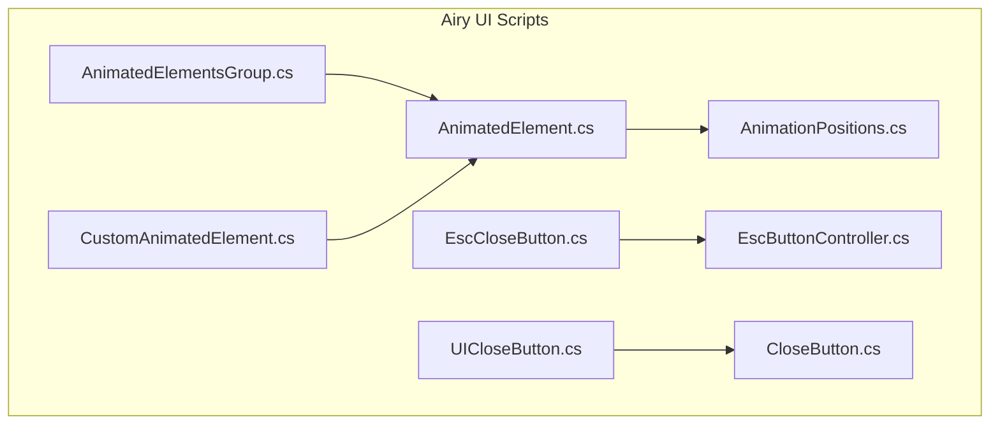
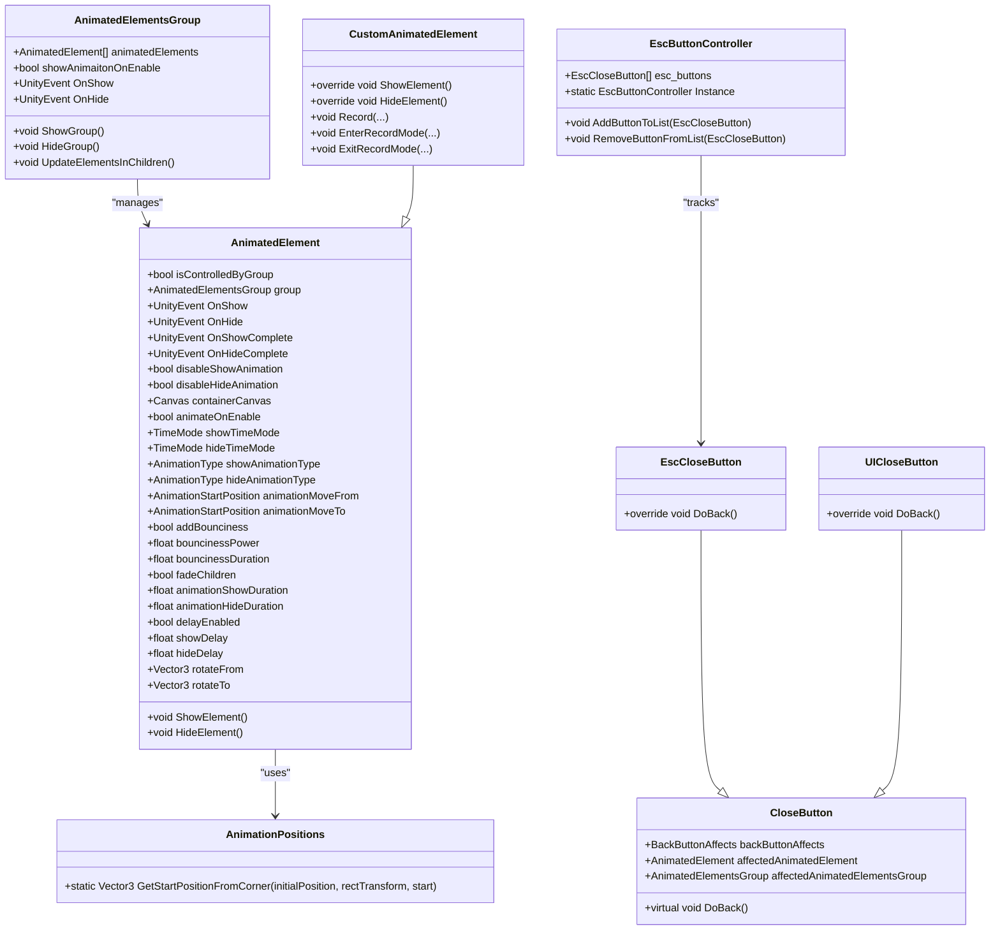
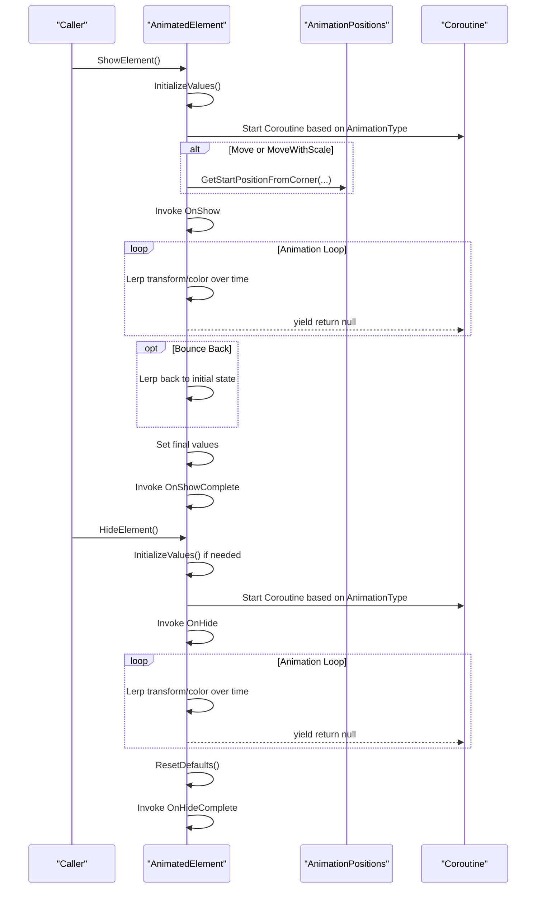
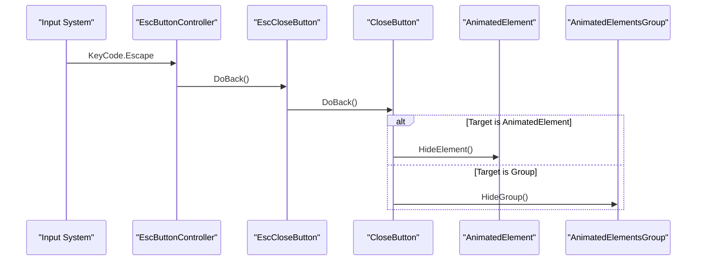
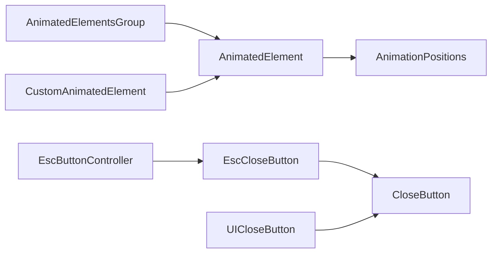

# Custom UI Components

<cite>
**Referenced Files in This Document**
- [AnimatedElement.cs](file://Assets/Airy UI/Scripts/AnimatedElement.cs)
- [AnimatedElementsGroup.cs](file://Assets/Airy UI/Scripts/AnimatedElementsGroup.cs)
- [AnimationPositions.cs](file://Assets/Airy UI/Scripts/AnimationPositions.cs)
- [CloseButton.cs](file://Assets/Airy UI/Scripts/CloseButton.cs)
- [EscButtonController.cs](file://Assets/Airy UI/Scripts/EscButtonController.cs)
- [EscCloseButton.cs](file://Assets/Airy UI/Scripts/EscCloseButton.cs)
- [UICloseButton.cs](file://Assets/Airy UI/Scripts/UICloseButton.cs)
- [CustomAnimatedElement.cs](file://Assets/Airy UI/Scripts/CustomAnimatedElement.cs)
</cite>

## Table of Contents
1. [Introduction](#introduction)
2. [Project Structure](#project-structure)
3. [Core Components](#core-components)
4. [Architecture Overview](#architecture-overview)
5. [Detailed Component Analysis](#detailed-component-analysis)
6. [Dependency Analysis](#dependency-analysis)
7. [Performance Considerations](#performance-considerations)
8. [Troubleshooting Guide](#troubleshooting-guide)
9. [Conclusion](#conclusion)
10. [Appendices](#appendices)

## Introduction
This document explains BARAKI’s custom UI components built on the Airy UI framework. It focuses on:
- AnimatedElement base class and its animation capabilities (position, scale, rotation, fade, transitions).
- AnimatedElementsGroup for coordinated management of multiple animated elements.
- CloseButton and EscButtonController for user interaction and window management.
- Practical examples to create custom UI elements, extend existing components, and implement complex interactions.
- Component lifecycle, event system integration, and performance considerations for smooth animations.

## Project Structure
The relevant runtime scripts are located under Assets/Airy UI/Scripts. The core architecture centers around a base animation component, a group manager, helper utilities for positioning, and button controllers that integrate with Unity UI and input.

**Diagram sources**
- [AnimatedElement.cs:1-1152](file://Assets/Airy UI/Scripts/AnimatedElement.cs#L1-L1152)
- [AnimatedElementsGroup.cs:1-108](file://Assets/Airy UI/Scripts/AnimatedElementsGroup.cs#L1-L108)
- [AnimationPositions.cs:1-187](file://Assets/Airy UI/Scripts/AnimationPositions.cs#L1-L187)
- [CloseButton.cs:1-51](file://Assets/Airy UI/Scripts/CloseButton.cs#L1-L51)
- [EscButtonController.cs:1-77](file://Assets/Airy UI/Scripts/EscButtonController.cs#L1-L77)
- [EscCloseButton.cs:1-118](file://Assets/Airy UI/Scripts/EscCloseButton.cs#L1-L118)
- [UICloseButton.cs:1-93](file://Assets/Airy UI/Scripts/UICloseButton.cs#L1-L93)
- [CustomAnimatedElement.cs:1-993](file://Assets/Airy UI/Scripts/CustomAnimatedElement.cs#L1-L993)

**Section sources**
- [AnimatedElement.cs:1-1152](file://Assets/Airy UI/Scripts/AnimatedElement.cs#L1-L1152)
- [AnimatedElementsGroup.cs:1-108](file://Assets/Airy UI/Scripts/AnimatedElementsGroup.cs#L1-L108)
- [AnimationPositions.cs:1-187](file://Assets/Airy UI/Scripts/AnimationPositions.cs#L1-L187)
- [CloseButton.cs:1-51](file://Assets/Airy UI/Scripts/CloseButton.cs#L1-L51)
- [EscButtonController.cs:1-77](file://Assets/Airy UI/Scripts/EscButtonController.cs#L1-L77)
- [EscCloseButton.cs:1-118](file://Assets/Airy UI/Scripts/EscCloseButton.cs#L1-L118)
- [UICloseButton.cs:1-93](file://Assets/Airy UI/Scripts/UICloseButton.cs#L1-L93)
- [CustomAnimatedElement.cs:1-993](file://Assets/Airy UI/Scripts/CustomAnimatedElement.cs#L1-L993)

## Core Components
- AnimatedElement: Base component providing show/hide animations with configurable types (scale, rotate, fade, move, move+scale), timing modes, delays, bounciness, and child fading. Exposes events OnShow, OnHide, OnShowComplete, OnHideComplete.
- AnimatedElementsGroup: Manages a list of AnimatedElement instances, optionally animating them together when enabled. Provides ShowGroup/HideGroup and group-level events.
- AnimationPositions: Utility to compute initial positions from canvas corners or edges for movement-based animations.
- CloseButton: Abstract controller that can hide either an AnimatedElement or an AnimatedElementsGroup based on configuration.
- EscButtonController: Singleton that listens for Escape key and triggers the last registered close action.
- EscCloseButton: Implements CloseButton and integrates with EscButtonController by subscribing to show/hide events of the affected element/group.
- UICloseButton: Unity UI Button-backed CloseButton that also auto-shows its parent AnimatedElement when closing another element/group.
- CustomAnimatedElement: Extends AnimatedElement to support recordable sequences of transform/graphic changes with per-step delay/duration and optional looping.

**Section sources**
- [AnimatedElement.cs:1-1152](file://Assets/Airy UI/Scripts/AnimatedElement.cs#L1-L1152)
- [AnimatedElementsGroup.cs:1-108](file://Assets/Airy UI/Scripts/AnimatedElementsGroup.cs#L1-L108)
- [AnimationPositions.cs:1-187](file://Assets/Airy UI/Scripts/AnimationPositions.cs#L1-L187)
- [CloseButton.cs:1-51](file://Assets/Airy UI/Scripts/CloseButton.cs#L1-L51)
- [EscButtonController.cs:1-77](file://Assets/Airy UI/Scripts/EscButtonController.cs#L1-L77)
- [EscCloseButton.cs:1-118](file://Assets/Airy UI/Scripts/EscCloseButton.cs#L1-L118)
- [UICloseButton.cs:1-93](file://Assets/Airy UI/Scripts/UICloseButton.cs#L1-L93)
- [CustomAnimatedElement.cs:1-993](file://Assets/Airy UI/Scripts/CustomAnimatedElement.cs#L1-L993)

## Architecture Overview
The system is centered around AnimatedElement as the foundation for all animated UI objects. Groups coordinate multiple elements. Button controllers provide standardized ways to trigger hide/show behavior, while EscButtonController centralizes keyboard-driven navigation.

**Diagram sources**
- [AnimatedElement.cs:1-1152](file://Assets/Airy UI/Scripts/AnimatedElement.cs#L1-L1152)
- [AnimatedElementsGroup.cs:1-108](file://Assets/Airy UI/Scripts/AnimatedElementsGroup.cs#L1-L108)
- [AnimationPositions.cs:1-187](file://Assets/Airy UI/Scripts/AnimationPositions.cs#L1-L187)
- [CloseButton.cs:1-51](file://Assets/Airy UI/Scripts/CloseButton.cs#L1-L51)
- [EscButtonController.cs:1-77](file://Assets/Airy UI/Scripts/EscButtonController.cs#L1-L77)
- [EscCloseButton.cs:1-118](file://Assets/Airy UI/Scripts/EscCloseButton.cs#L1-L118)
- [UICloseButton.cs:1-93](file://Assets/Airy UI/Scripts/UICloseButton.cs#L1-L93)
- [CustomAnimatedElement.cs:1-993](file://Assets/Airy UI/Scripts/CustomAnimatedElement.cs#L1-L993)

## Detailed Component Analysis

### AnimatedElement
AnimatedElement provides a robust animation system for showing and hiding UI elements. Key behaviors:
- Initialization captures RectTransform state, children Graphic colors (optional), and pivot/scale/rotation anchors.
- ShowElement/HideElement dispatch to coroutine-based animations based on configured AnimationType.
- Supports time scaling control via TimeMode for both show and hide phases.
- Optional delays before starting animations.
- Optional bounciness after reaching target transforms.
- Child fading support across all descendants’ Graphics if enabled.
- Events: OnShow, OnHide, OnShowComplete, OnHideComplete.

Supported animation types:
- Scale: Lerp localScale from zero to target; optional bounce back.
- Rotate: Lerp eulerAngles from rotateFrom to target; optional bounce back.
- FadeColor: Lerp alpha of selected Graphics from 0 to final color; supports child fading.
- Move: Lerp anchoredPosition from off-screen corner to final position; optional bounce back.
- MoveWithScale: Combined move and scale with optional fade and bounce.

Lifecycle hooks:
- OnEnable initializes values and optionally shows the element if animateOnEnable is true and not controlled by a group.
- ResetDefaults restores initial state and deactivates the GameObject after hide animations complete.

Practical usage patterns:
- Configure show/hide durations, delays, and time modes independently.
- Use AnimationStartPosition to define entry/exit directions relative to the Canvas.
- Enable fadeChildren to animate all descendant Graphics uniformly.

**Section sources**
- [AnimatedElement.cs:1-1152](file://Assets/Airy UI/Scripts/AnimatedElement.cs#L1-L1152)

#### AnimatedElement Sequence Diagram (Show/Hide Flow)

**Diagram sources**
- [AnimatedElement.cs:153-296](file://Assets/Airy UI/Scripts/AnimatedElement.cs#L153-L296)
- [AnimatedElement.cs:302-607](file://Assets/Airy UI/Scripts/AnimatedElement.cs#L302-L607)
- [AnimatedElement.cs:620-863](file://Assets/Airy UI/Scripts/AnimatedElement.cs#L620-L863)
- [AnimationPositions.cs:17-185](file://Assets/Airy UI/Scripts/AnimationPositions.cs#L17-L185)

### AnimatedElementsGroup
AnimatedElementsGroup coordinates multiple AnimatedElement instances:
- Maintains a list of managed elements.
- Optionally shows all elements when the group is enabled.
- Provides ShowGroup/HideGroup methods that iterate through elements and call their ShowElement/HideElement.
- Exposes group-level OnShow/OnHide events.
- Editor utility to update elements found in children marked as controlled by group.

Typical workflow:
- Place multiple AnimatedElement children under a group object.
- Mark each child as controlled by group.
- Call ShowGroup/HideGroup to orchestrate coordinated animations.

**Section sources**
- [AnimatedElementsGroup.cs:1-108](file://Assets/Airy UI/Scripts/AnimatedElementsGroup.cs#L1-L108)

### AnimationPositions
Utility for computing initial positions based on canvas geometry and element size:
- Calculates start positions from predefined corners/edges (Up, Bottom, Left, Right, UpLeft, etc.).
- Adjusts for parent offsets to ensure correct screen-relative placement.
- Used by AnimatedElement during move-based animations to determine where to start from.

**Section sources**
- [AnimationPositions.cs:1-187](file://Assets/Airy UI/Scripts/AnimationPositions.cs#L1-L187)

### CloseButton, EscButtonController, EscCloseButton, UICloseButton
These components standardize user-triggered window management:
- CloseButton abstracts the logic to hide either a single AnimatedElement or an entire AnimatedElementsGroup.
- EscButtonController is a singleton that listens for the Escape key and invokes the most recently added EscCloseButton.
- EscCloseButton subscribes to the show/hide events of the affected element/group to register/unregister itself with the controller.
- UICloseButton binds a Unity UI Button to DoBack and can auto-show its own AnimatedElement when closing another element/group.

Interaction flow:
- User presses Escape.
- EscButtonController calls DoBack on the last EscCloseButton.
- EscCloseButton.DoBack delegates to CloseButton.DoBack which hides the target element/group.

**Diagram sources**
- [EscButtonController.cs:29-53](file://Assets/Airy UI/Scripts/EscButtonController.cs#L29-L53)
- [EscCloseButton.cs:80-83](file://Assets/Airy UI/Scripts/EscCloseButton.cs#L80-L83)
- [CloseButton.cs:20-42](file://Assets/Airy UI/Scripts/CloseButton.cs#L20-L42)
- [AnimatedElementsGroup.cs:64-72](file://Assets/Airy UI/Scripts/AnimatedElementsGroup.cs#L64-L72)

**Section sources**
- [CloseButton.cs:1-51](file://Assets/Airy UI/Scripts/CloseButton.cs#L1-L51)
- [EscButtonController.cs:1-77](file://Assets/Airy UI/Scripts/EscButtonController.cs#L1-L77)
- [EscCloseButton.cs:1-118](file://Assets/Airy UI/Scripts/EscCloseButton.cs#L1-L118)
- [UICloseButton.cs:1-93](file://Assets/Airy UI/Scripts/UICloseButton.cs#L1-L93)

### CustomAnimatedElement
Extends AnimatedElement to support advanced, recordable animation sequences:
- Records Transform and/or Graphic states into lists with per-step Delay and Duration.
- Supports Image sprites and TextMeshPro text changes alongside color transitions.
- Can loop sequences indefinitely or play once.
- Provides Record/EnterRecordMode/ExitRecordMode helpers to capture current state and build animation records.

Key features:
- Separate record lists for Show and Hide paths.
- Per-record delay and duration allow staggered choreography.
- Resets to initial recorded values after hide completes.

Use cases:
- Complex entrance/exit choreographies combining position, scale, rotation, sprite swaps, and text updates.
- Reusable animation clips defined via editor-friendly lists.

**Section sources**
- [CustomAnimatedElement.cs:1-993](file://Assets/Airy UI/Scripts/CustomAnimatedElement.cs#L1-L993)

## Dependency Analysis
Component relationships and coupling:
- AnimatedElementsGroup depends on AnimatedElement instances and orchestrates their lifecycle.
- AnimatedElement uses AnimationPositions for move-based animations.
- EscCloseButton and UICloseButton depend on CloseButton abstraction and integrate with EscButtonController.
- CustomAnimatedElement extends AnimatedElement, inheriting its lifecycle and animation infrastructure.

Potential circular dependencies:
- None observed between runtime scripts. Group-to-element references are one-directional.

External integrations:
- Unity UI components (Image, Button, TextMeshProUGUI) used by UICloseButton and CustomAnimatedElement.
- Unity input system via Input.GetKeyDown for Escape handling.

**Diagram sources**
- [AnimatedElementsGroup.cs:1-108](file://Assets/Airy UI/Scripts/AnimatedElementsGroup.cs#L1-L108)
- [AnimatedElement.cs:1-1152](file://Assets/Airy UI/Scripts/AnimatedElement.cs#L1-L1152)
- [AnimationPositions.cs:1-187](file://Assets/Airy UI/Scripts/AnimationPositions.cs#L1-L187)
- [EscCloseButton.cs:1-118](file://Assets/Airy UI/Scripts/EscCloseButton.cs#L1-L118)
- [UICloseButton.cs:1-93](file://Assets/Airy UI/Scripts/UICloseButton.cs#L1-L93)
- [EscButtonController.cs:1-77](file://Assets/Airy UI/Scripts/EscButtonController.cs#L1-L77)
- [CustomAnimatedElement.cs:1-993](file://Assets/Airy UI/Scripts/CustomAnimatedElement.cs#L1-L993)

**Section sources**
- [AnimatedElementsGroup.cs:1-108](file://Assets/Airy UI/Scripts/AnimatedElementsGroup.cs#L1-L108)
- [AnimatedElement.cs:1-1152](file://Assets/Airy UI/Scripts/AnimatedElement.cs#L1-L1152)
- [AnimationPositions.cs:1-187](file://Assets/Airy UI/Scripts/AnimationPositions.cs#L1-L187)
- [EscCloseButton.cs:1-118](file://Assets/Airy UI/Scripts/EscCloseButton.cs#L1-L118)
- [UICloseButton.cs:1-93](file://Assets/Airy UI/Scripts/UICloseButton.cs#L1-L93)
- [EscButtonController.cs:1-77](file://Assets/Airy UI/Scripts/EscButtonController.cs#L1-L77)
- [CustomAnimatedElement.cs:1-993](file://Assets/Airy UI/Scripts/CustomAnimatedElement.cs#L1-L993)

## Performance Considerations
- Prefer NotTimeScaleDependent for critical UI transitions that must remain consistent even when game time is paused.
- Keep animation durations reasonable; very short durations may cause jitter due to frame sampling.
- Avoid excessive child fading on large hierarchies; disabling fadeChildren reduces per-frame allocations and updates.
- Use groups to batch show/hide operations and minimize redundant coroutines.
- For CustomAnimatedElement, limit the number of records and avoid overly long loops to prevent memory churn and CPU spikes.
- Reuse AnimatedElement instances rather than frequently enabling/disabling to reduce GC pressure.

[No sources needed since this section provides general guidance]

## Troubleshooting Guide
Common issues and resolutions:
- Missing target for CloseButton: Ensure affectedAnimatedElement or affectedAnimatedElementsGroup is assigned; otherwise, DoBack logs an error and returns early.
- ESC key does nothing: Verify EscButtonController exists and EscCloseButton is registered via show/hide events; check that the last item in the controller’s list is non-null.
- Animations do not start: Confirm animateOnEnable is set appropriately and that the element is not disabled by a group’s isControlledByGroup flag.
- Incorrect move origins: Check containerCanvas assignment and ensure AnimationStartPosition matches expected canvas orientation and parent offsets.

**Section sources**
- [CloseButton.cs:20-42](file://Assets/Airy UI/Scripts/CloseButton.cs#L20-L42)
- [EscCloseButton.cs:17-43](file://Assets/Airy UI/Scripts/EscCloseButton.cs#L17-L43)
- [EscButtonController.cs:29-53](file://Assets/Airy UI/Scripts/EscButtonController.cs#L29-L53)
- [AnimatedElement.cs:75-86](file://Assets/Airy UI/Scripts/AnimatedElement.cs#L75-L86)
- [AnimationPositions.cs:23-25](file://Assets/Airy UI/Scripts/AnimationPositions.cs#L23-L25)

## Conclusion
BARAKI’s Airy UI extensions provide a cohesive system for animated UI windows and panels. AnimatedElement offers flexible, configurable animations with strong eventing and timing controls. AnimatedElementsGroup simplifies coordination across multiple elements. CloseButton, EscButtonController, EscCloseButton, and UICloseButton deliver intuitive user interaction patterns. CustomAnimatedElement enables rich, recordable sequences for complex visual effects. Together, these components form a powerful toolkit for building responsive, polished UI experiences.

[No sources needed since this section summarizes without analyzing specific files]

## Appendices

### Practical Examples

- Create a simple panel with fade-in/out:
  - Attach AnimatedElement to a panel.
  - Set showAnimationType and hideAnimationType to FadeColor.
  - Configure animationShowDuration and animationHideDuration.
  - Subscribe to OnShowComplete/OnHideComplete for post-animation logic.

- Slide-in from bottom with bounce:
  - Set showAnimationType to Move, animationMoveFrom to Bottom.
  - Enable addBounciness and adjust bouncinessPower/bouncinessDuration.
  - Ensure containerCanvas is set correctly for accurate positioning.

- Manage multiple panels with a group:
  - Create AnimatedElementsGroup and mark child AnimatedElements as controlled by group.
  - Call ShowGroup/HideGroup to animate all children together.
  - Use group-level OnShow/OnHide events for global transitions.

- Implement ESC-to-close behavior:
  - Add EscCloseButton to your panel and assign affectedAnimatedElement or affectedAnimatedElementsGroup.
  - Pressing Escape will invoke DoBack and hide the target.

- Build a UI close button that toggles panels:
  - Add UICloseButton to a Button.
  - Configure it to affect another AnimatedElement or group.
  - Clicking closes the target and shows the button’s own panel.

- Choreograph complex animations:
  - Use CustomAnimatedElement to record transform and graphic changes.
  - Define per-step delays and durations for staggered effects.
  - Toggle loop mode for continuous animations.

[No sources needed since this section provides general guidance]