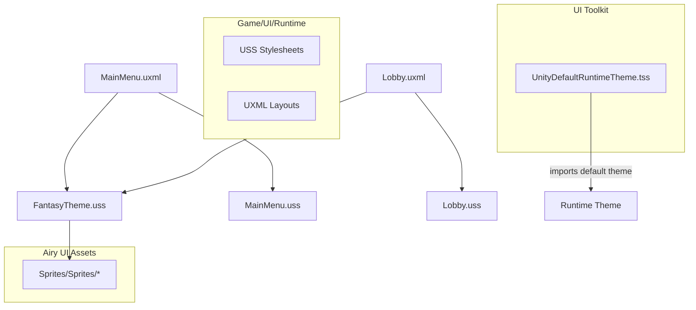
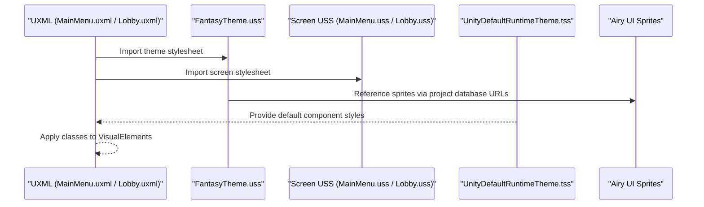
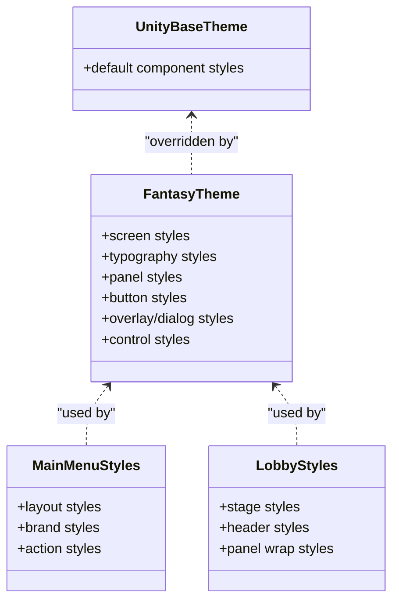
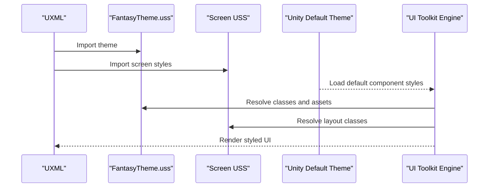
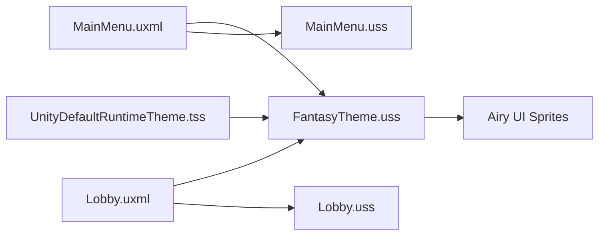

# Styling System

<cite>
**Referenced Files in This Document**
- [FantasyTheme.uss](file://Assets/Game/UI/Runtime/USS/FantasyTheme.uss)
- [MainMenu.uss](file://Assets/Game/UI/Runtime/USS/MainMenu.uss)
- [Lobby.uss](file://Assets/Game/UI/Runtime/USS/Lobby.uss)
- [MainMenu.uxml](file://Assets/Game/UI/Runtime/UXML/MainMenu.uxml)
- [Lobby.uxml](file://Assets/Game/UI/Runtime/UXML/Lobby.uxml)
- [UnityDefaultRuntimeTheme.tss](file://Assets/UI Toolkit/UnityThemes/UnityDefaultRuntimeTheme.tss)
</cite>

## Table of Contents
1. Introduction
2. Project Structure
3. Core Components
4. Architecture Overview
5. Detailed Component Analysis
6. Dependency Analysis
7. Performance Considerations
8. Troubleshooting Guide
9. Conclusion

## Introduction
This document explains BARAKI’s styling system built with Unity UI Toolkit using USS (Unity Style Sheets) and theme management. It focuses on the FantasyTheme.uss structure, how to create consistent visual themes across UI components, responsive design principles for different screen sizes and aspect ratios, reusable style classes, dark/light theming, asset references, integration with Airy UI sprites, guidelines for maintaining visual consistency, performance optimization, debugging layout issues, cross-platform considerations, and accessibility compliance through contrast and font sizing.

## Project Structure
BARAKI organizes UI styles and layouts under Game/UI/Runtime:
- USS files define reusable styles and theme tokens.
- UXML files compose screens and import relevant USS files.
- A runtime theme file imports Unity’s default theme.

**Diagram sources**
- [FantasyTheme.uss](file://Assets/Game/UI/Runtime/USS/FantasyTheme.uss)
- [MainMenu.uss](file://Assets/Game/UI/Runtime/USS/MainMenu.uss)
- [Lobby.uss](file://Assets/Game/UI/Runtime/USS/Lobby.uss)
- [MainMenu.uxml](file://Assets/Game/UI/Runtime/UXML/MainMenu.uxml)
- [Lobby.uxml](file://Assets/Game/UI/Runtime/UXML/Lobby.uxml)
- [UnityDefaultRuntimeTheme.tss](file://Assets/UI Toolkit/UnityThemes/UnityDefaultRuntimeTheme.tss)

**Section sources**
- [FantasyTheme.uss](file://Assets/Game/UI/Runtime/USS/FantasyTheme.uss)
- [MainMenu.uss](file://Assets/Game/UI/Runtime/USS/MainMenu.uss)
- [Lobby.uss](file://Assets/Game/UI/Runtime/USS/Lobby.uss)
- [MainMenu.uxml](file://Assets/Game/UI/Runtime/UXML/MainMenu.uxml)
- [Lobby.uxml](file://Assets/Game/UI/Runtime/UXML/Lobby.uxml)
- [UnityDefaultRuntimeTheme.tss](file://Assets/UI Toolkit/UnityThemes/UnityDefaultRuntimeTheme.tss)

## Core Components
- FantasyTheme.uss: Central theme stylesheet defining screen backgrounds, typography, panels, buttons, overlays, dialogs, toggles, and sliders. It integrates Airy UI sprites via project database URLs.
- MainMenu.uss and Lobby.uss: Screen-specific layout styles that compose with FantasyTheme.uss.
- MainMenu.uxml and Lobby.uxml: Layouts that import both the theme and screen-specific styles, then apply class names to elements.
- UnityDefaultRuntimeTheme.tss: Imports Unity’s default runtime theme, providing base component styles that can be overridden by custom USS.

Key responsibilities:
- Theme tokens: colors, fonts, spacing, borders, shadows.
- Reusable classes: .fantasy-panel, .fantasy-btn, .fantasy-overlay, etc.
- Asset references: background images, button states, toggle/slider visuals from Airy UI.
- Responsive behavior: max-width constraints, flexible containers, centering strategies.

**Section sources**
- [FantasyTheme.uss](file://Assets/Game/UI/Runtime/USS/FantasyTheme.uss)
- [MainMenu.uss](file://Assets/Game/UI/Runtime/USS/MainMenu.uss)
- [Lobby.uss](file://Assets/Game/UI/Runtime/USS/Lobby.uss)
- [MainMenu.uxml](file://Assets/Game/UI/Runtime/UXML/MainMenu.uxml)
- [Lobby.uxml](file://Assets/Game/UI/Runtime/UXML/Lobby.uxml)
- [UnityDefaultRuntimeTheme.tss](file://Assets/UI Toolkit/UnityThemes/UnityDefaultRuntimeTheme.tss)

## Architecture Overview
The styling architecture separates concerns:
- Theme layer (FantasyTheme.uss): global look-and-feel and shared components.
- Screen layer (MainMenu.uss, Lobby.uss): layout and composition rules per screen.
- Composition layer (UXML): imports styles and applies classes to elements.
- Base theme (UnityDefaultRuntimeTheme.tss): provides defaults for Unity components.

**Diagram sources**
- [FantasyTheme.uss](file://Assets/Game/UI/Runtime/USS/FantasyTheme.uss)
- [MainMenu.uss](file://Assets/Game/UI/Runtime/USS/MainMenu.uss)
- [Lobby.uss](file://Assets/Game/UI/Runtime/USS/Lobby.uss)
- [MainMenu.uxml](file://Assets/Game/UI/Runtime/UXML/MainMenu.uxml)
- [Lobby.uxml](file://Assets/Game/UI/Runtime/UXML/Lobby.uxml)
- [UnityDefaultRuntimeTheme.tss](file://Assets/UI Toolkit/UnityThemes/UnityDefaultRuntimeTheme.tss)

## Detailed Component Analysis

### FantasyTheme.uss Structure
- Screen and background:
  - .fantasy-screen sets a full-screen container with a dark background color.
  - .fantasy-bg uses an absolute-positioned background image from Airy UI with stretch-to-fill scaling.
  - .fantasy-bg-shade overlays a semi-transparent color to improve readability.
  - .fantasy-accent-line adds a thin accent line at the top.
- Typography:
  - .fantasy-title and .fantasy-title--sm provide large, bold titles with letter-spacing and text-shadow.
  - .fantasy-tagline and .fantasy-meta define secondary text styles with appropriate contrast.
  - .fantasy-logo is a fixed-size icon element referencing a star sprite.
- Panels:
  - .fantasy-panel wraps content with a decorative border image and inner container (.fantasy-panel__inner).
  - .fantasy-panel__header and .fantasy-panel__body define header and body regions with borders and padding.
  - .fantasy-panel__note provides centered helper text.
- Buttons:
  - .fantasy-btn.unity-button defines base button styles including transitions and focus state.
  - Variants:
    - .fantasy-btn--primary.unity-button uses an orange button sprite with hover and pressed states.
    - .fantasy-btn--secondary.unity-button uses solid colors and borders for subtle actions.
    - .fantasy-btn--muted.unity-button reduces emphasis.
- Shortcuts and footer:
  - .fantasy-shortcuts groups key hints with styled .fantasy-key badges.
  - .fantasy-footer positions footer text at the bottom with muted color.
- Overlays and dialogs:
  - .fantasy-overlay centers content; .fantasy-overlay-dim dims the background.
  - .fantasy-dialog composes a panel-like modal with header, close button, blocks, rows, labels, and values.
- Controls:
  - .fantasy-toggle styles the toggle input and checked state using Airy UI sprites.
  - .fantasy-slider styles tracker and dragger using Airy UI sprites.

Asset references:
- All images are referenced via project database URLs pointing to Airy UI sprites. This ensures stable asset resolution within Unity.

Responsive patterns:
- Use of width/max-width and flex properties to constrain panels and dialogs.
- Absolute positioning for background layers and accent lines.
- Centering via justify-content and align-items for dialog placement.

Accessibility:
- High-contrast colors for primary text and accents.
- Text shadow improves legibility over complex backgrounds.
- Focus states on buttons ensure keyboard navigation visibility.

**Section sources**
- [FantasyTheme.uss](file://Assets/Game/UI/Runtime/USS/FantasyTheme.uss)

### Screen-Specific Styles: MainMenu.uss and Lobby.uss
- MainMenu.uss:
  - .menu--hidden hides the menu overlay.
  - .menu__layout centers brand and action columns with horizontal flex direction.
  - .menu__brand constrains maximum width and aligns items to start.
  - .menu__actions fixes width range for action buttons.
- Lobby.uss:
  - .lobby--hidden hides the lobby overlay.
  - .lobby__stage centers content vertically and horizontally with padding.
  - .lobby__header aligns title and tagline.
  - .lobby__panel-wrap constrains panel width for readability.

These styles rely on FantasyTheme.uss for component visuals and combine with UXML to build complete screens.

**Section sources**
- [MainMenu.uss](file://Assets/Game/UI/Runtime/USS/MainMenu.uss)
- [Lobby.uss](file://Assets/Game/UI/Runtime/USS/Lobby.uss)

### Composition: MainMenu.uxml and Lobby.uxml
- Both UXML files import FantasyTheme.uss and their respective screen USS.
- They apply theme classes to VisualElements and Labels to achieve consistent visuals.
- Example usage:
  - Title label uses .fantasy-title and .fantasy-title--sm variants.
  - Panel elements use .fantasy-panel, .fantasy-panel__inner, .fantasy-panel__header, .fantasy-panel__body.
  - Buttons use .fantasy-btn and .fantasy-btn--primary.

This separation allows reuse of theme styles across multiple screens while keeping layout logic isolated.

**Section sources**
- [MainMenu.uxml](file://Assets/Game/UI/Runtime/UXML/MainMenu.uxml)
- [Lobby.uxml](file://Assets/Game/UI/Runtime/UXML/Lobby.uxml)

### Theme Management: UnityDefaultRuntimeTheme.tss
- The runtime theme imports Unity’s default theme, providing baseline styles for Unity components.
- Custom USS (FantasyTheme.uss) overrides or extends these defaults by targeting specific classes and pseudo-states.

This approach ensures compatibility with Unity’s component internals while allowing deep customization.

**Section sources**
- [UnityDefaultRuntimeTheme.tss](file://Assets/UI Toolkit/UnityThemes/UnityDefaultRuntimeTheme.tss)

### Class Diagram: FantasyTheme Classes and Relationships

**Diagram sources**
- [FantasyTheme.uss](file://Assets/Game/UI/Runtime/USS/FantasyTheme.uss)
- [MainMenu.uss](file://Assets/Game/UI/Runtime/USS/MainMenu.uss)
- [Lobby.uss](file://Assets/Game/UI/Runtime/USS/Lobby.uss)
- [UnityDefaultRuntimeTheme.tss](file://Assets/UI Toolkit/UnityThemes/UnityDefaultRuntimeTheme.tss)

### Sequence Diagram: Style Resolution Flow

**Diagram sources**
- [FantasyTheme.uss](file://Assets/Game/UI/Runtime/USS/FantasyTheme.uss)
- [MainMenu.uss](file://Assets/Game/UI/Runtime/USS/MainMenu.uss)
- [Lobby.uss](file://Assets/Game/UI/Runtime/USS/Lobby.uss)
- [UnityDefaultRuntimeTheme.tss](file://Assets/UI Toolkit/UnityThemes/UnityDefaultRuntimeTheme.tss)

## Dependency Analysis
- UXML files depend on USS files for styling.
- FantasyTheme.uss depends on Airy UI sprites via project database URLs.
- Screen USS files depend on FantasyTheme.uss for component visuals.
- UnityDefaultRuntimeTheme.tss provides base styles that FantasyTheme.uss may override.

**Diagram sources**
- [FantasyTheme.uss](file://Assets/Game/UI/Runtime/USS/FantasyTheme.uss)
- [MainMenu.uss](file://Assets/Game/UI/Runtime/USS/MainMenu.uss)
- [Lobby.uss](file://Assets/Game/UI/Runtime/USS/Lobby.uss)
- [MainMenu.uxml](file://Assets/Game/UI/Runtime/UXML/MainMenu.uxml)
- [Lobby.uxml](file://Assets/Game/UI/Runtime/UXML/Lobby.uxml)
- [UnityDefaultRuntimeTheme.tss](file://Assets/UI Toolkit/UnityThemes/UnityDefaultRuntimeTheme.tss)

**Section sources**
- [FantasyTheme.uss](file://Assets/Game/UI/Runtime/USS/FantasyTheme.uss)
- [MainMenu.uss](file://Assets/Game/UI/Runtime/USS/MainMenu.uss)
- [Lobby.uss](file://Assets/Game/UI/Runtime/USS/Lobby.uss)
- [MainMenu.uxml](file://Assets/Game/UI/Runtime/UXML/MainMenu.uxml)
- [Lobby.uxml](file://Assets/Game/UI/Runtime/UXML/Lobby.uxml)
- [UnityDefaultRuntimeTheme.tss](file://Assets/UI Toolkit/UnityThemes/UnityDefaultRuntimeTheme.tss)

## Performance Considerations
- Prefer background-image with scale modes (stretch-to-fill, scale-to-fit) to avoid redundant textures.
- Limit heavy effects like text-shadow to essential elements to reduce GPU overhead.
- Use max-width constraints to prevent unnecessary layout recalculations on large screens.
- Group related styles into reusable classes to minimize duplication and improve cache efficiency.
- Avoid excessive nested selectors; keep specificity manageable for faster style resolution.

[No sources needed since this section provides general guidance]

## Troubleshooting Guide
Common issues and resolutions:
- Missing or broken asset references:
  - Verify project database URLs point to valid Airy UI sprites.
  - Ensure sprites are imported and not corrupted.
- Incorrect layout on certain devices:
  - Check max-width and flex settings; adjust breakpoints if necessary.
  - Validate centering and padding for smaller screens.
- Contrast and accessibility problems:
  - Confirm text colors meet contrast requirements against backgrounds.
  - Ensure focus states are visible for keyboard navigation.
- Style conflicts:
  - Review specificity and order of imports; ensure theme styles load before overrides.
  - Inspect pseudo-state selectors (hover, active, focus) for unintended interactions.

**Section sources**
- [FantasyTheme.uss](file://Assets/Game/UI/Runtime/USS/FantasyTheme.uss)
- [MainMenu.uss](file://Assets/Game/UI/Runtime/USS/MainMenu.uss)
- [Lobby.uss](file://Assets/Game/UI/Runtime/USS/Lobby.uss)

## Conclusion
BARAKI’s styling system leverages a clear separation between theme, screen-specific styles, and composition via UXML. FantasyTheme.uss centralizes visual tokens and reusable components, integrating seamlessly with Airy UI sprites. Screen styles handle layout and responsiveness, while Unity’s default theme provides a robust baseline. Following the guidelines here will help maintain visual consistency, optimize performance, ensure accessibility, and support cross-platform deployment.

[No sources needed since this section summarizes without analyzing specific files]