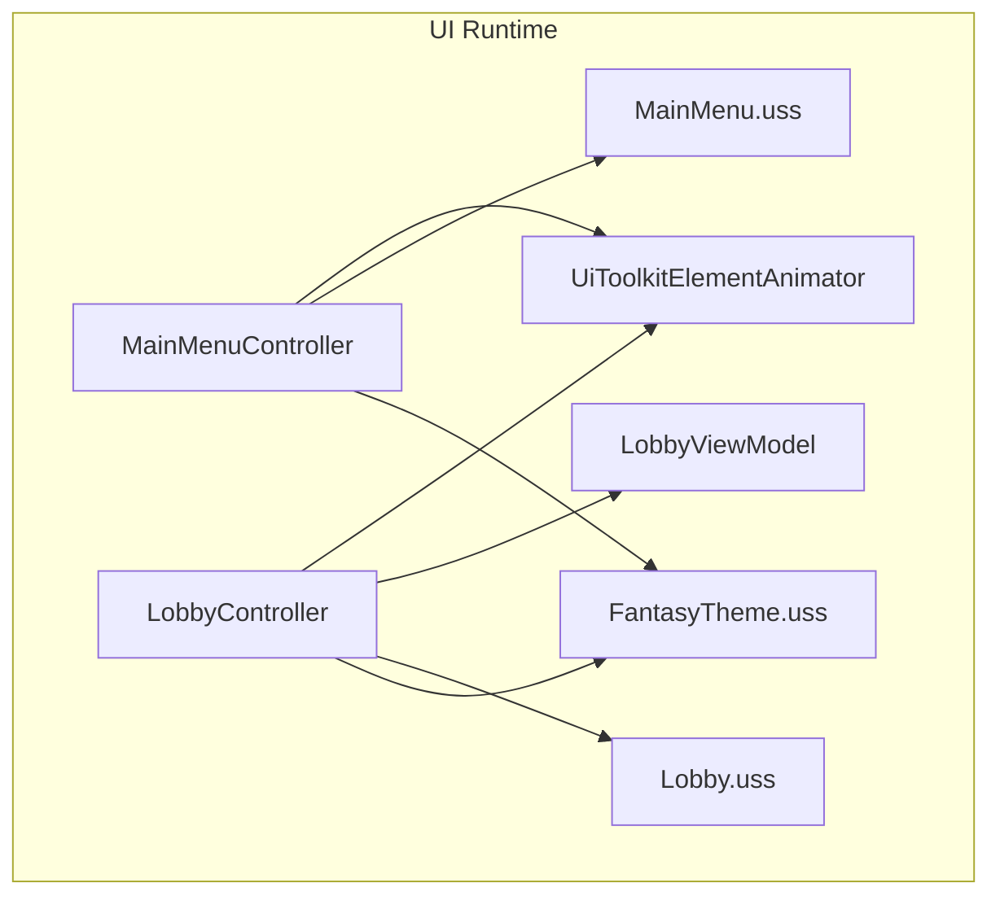
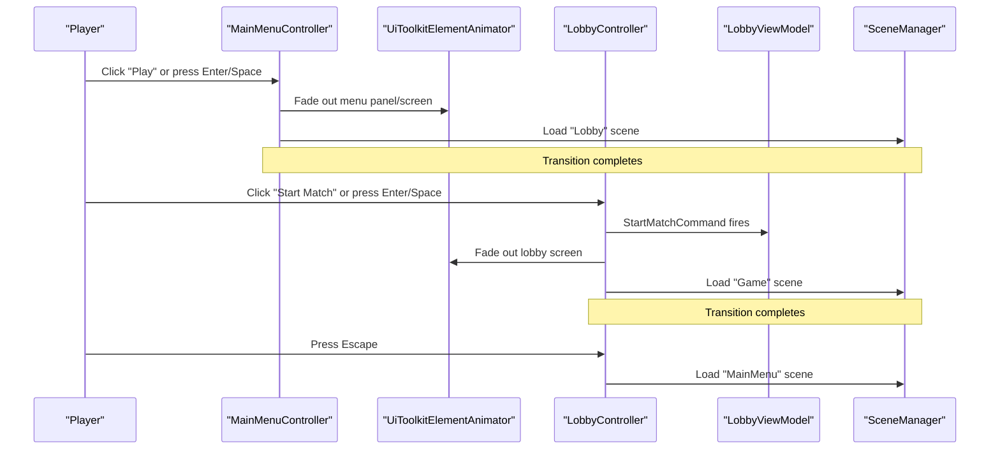
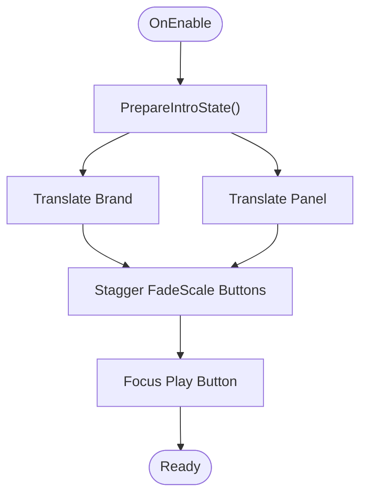
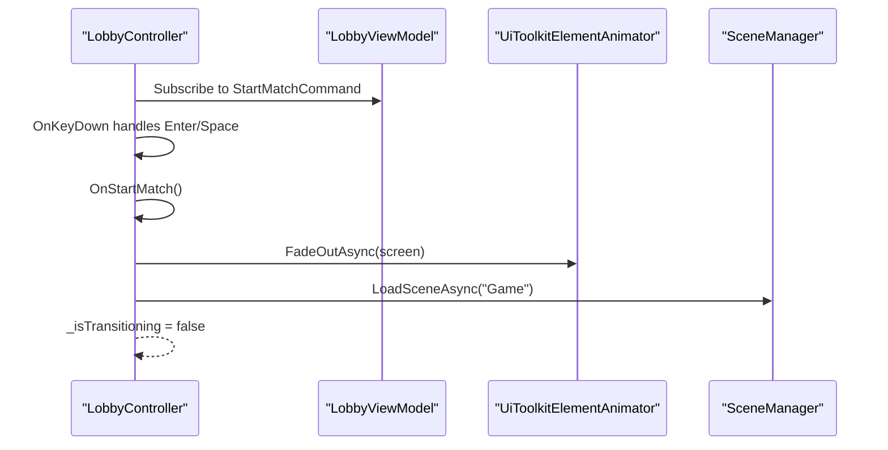
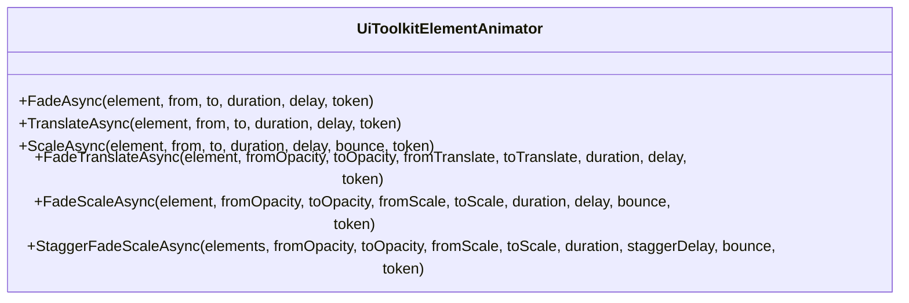
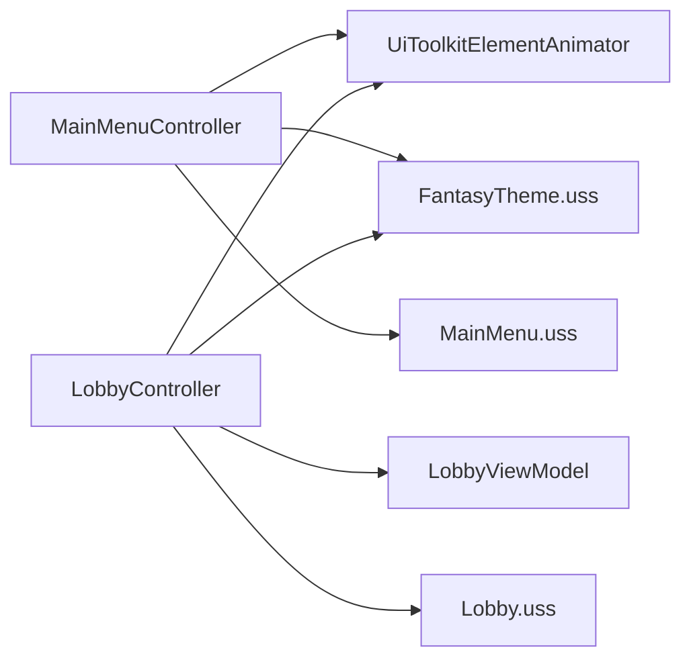

# User Interface System

<cite>
**Referenced Files in This Document**
- [MainMenuController.cs](file://Assets/Game/UI/Runtime/Controllers/MainMenuController.cs)
- [LobbyController.cs](file://Assets/Game/UI/Runtime/Controllers/LobbyController.cs)
- [UiToolkitElementAnimator.cs](file://Assets/Game/UI/Runtime/Animations/UiToolkitElementAnimator.cs)
- [FantasyTheme.uss](file://Assets/Game/UI/Runtime/USS/FantasyTheme.uss)
- [MainMenu.uss](file://Assets/Game/UI/Runtime/USS/MainMenu.uss)
- [Lobby.uss](file://Assets/Game/UI/Runtime/USS/Lobby.uss)
- [LobbyViewModel.cs](file://Assets/Game/UI/Runtime/ViewModels/LobbyViewModel.cs)
</cite>

## Table of Contents
1. [Introduction](#introduction)
2. [Project Structure](#project-structure)
3. [Core Components](#core-components)
4. [Architecture Overview](#architecture-overview)
5. [Detailed Component Analysis](#detailed-component-analysis)
6. [Dependency Analysis](#dependency-analysis)
7. [Performance Considerations](#performance-considerations)
8. [Troubleshooting Guide](#troubleshooting-guide)
9. [Conclusion](#conclusion)
10. [Appendices](#appendices)

## Introduction
This document describes BARAKI’s user interface system built on Unity UI Toolkit and enhanced by Airy UI assets. It explains the component architecture, scene-specific controllers, animation system, theme management via USS, and data binding patterns. It also provides usage examples for creating animated panels, handling input, and binding data to UI elements, along with guidelines for responsive design, accessibility, cross-platform considerations, and performance optimization.

## Project Structure
The UI system is organized around:
- Controllers that manage scene-specific UI logic and transitions
- ViewModels exposing reactive commands and properties
- An animator utility for lightweight tweening
- USS files for styling and theming
- Airy UI assets for visuals (backgrounds, buttons, toggles, sliders)

**Diagram sources**
- [MainMenuController.cs](file://Assets/Game/UI/Runtime/Controllers/MainMenuController.cs)
- [LobbyController.cs](file://Assets/Game/UI/Runtime/Controllers/LobbyController.cs)
- [UiToolkitElementAnimator.cs](file://Assets/Game/UI/Runtime/Animations/UiToolkitElementAnimator.cs)
- [MainMenu.uss](file://Assets/Game/UI/Runtime/USS/MainMenu.uss)
- [Lobby.uss](file://Assets/Game/UI/Runtime/USS/Lobby.uss)
- [FantasyTheme.uss](file://Assets/Game/UI/Runtime/USS/FantasyTheme.uss)
- [LobbyViewModel.cs](file://Assets/Game/UI/Runtime/ViewModels/LobbyViewModel.cs)

**Section sources**
- [MainMenuController.cs](file://Assets/Game/UI/Runtime/Controllers/MainMenuController.cs)
- [LobbyController.cs](file://Assets/Game/UI/Runtime/Controllers/LobbyController.cs)
- [UiToolkitElementAnimator.cs](file://Assets/Game/UI/Runtime/Animations/UiToolkitElementAnimator.cs)
- [FantasyTheme.uss](file://Assets/Game/UI/Runtime/USS/FantasyTheme.uss)
- [MainMenu.uss](file://Assets/Game/UI/Runtime/USS/MainMenu.uss)
- [Lobby.uss](file://Assets/Game/UI/Runtime/USS/Lobby.uss)
- [LobbyViewModel.cs](file://Assets/Game/UI/Runtime/ViewModels/LobbyViewModel.cs)

## Core Components
- MainMenuController: Manages main menu layout, settings overlay, keyboard navigation, intro animations, and scene transitions.
- LobbyController: Handles lobby screen interactions, command bindings, fade-out transitions, and scene loading.
- UiToolkitElementAnimator: Provides async tween helpers (fade, translate, scale, combined effects, staggered sequences).
- FantasyTheme.uss: Global fantasy-themed styles for backgrounds, typography, panels, buttons, overlays, dialogs, toggles, and sliders.
- MainMenu.uss and Lobby.uss: Scene-specific layout and state classes.
- LobbyViewModel: Exposes reactive commands for start and back actions.

Key responsibilities:
- Controllers own lifecycle, event registration, and orchestration of animations and scene changes.
- Animations are performed through a shared animator utility using UI Toolkit style properties.
- Theming is centralized in USS; scenes compose theme classes with their own layout classes.
- Data binding uses a scope-based approach to connect ViewModel commands to UI elements.

**Section sources**
- [MainMenuController.cs](file://Assets/Game/UI/Runtime/Controllers/MainMenuController.cs)
- [LobbyController.cs](file://Assets/Game/UI/Runtime/Controllers/LobbyController.cs)
- [UiToolkitElementAnimator.cs](file://Assets/Game/UI/Runtime/Animations/UiToolkitElementAnimator.cs)
- [FantasyTheme.uss](file://Assets/Game/UI/Runtime/USS/FantasyTheme.uss)
- [MainMenu.uss](file://Assets/Game/UI/Runtime/USS/MainMenu.uss)
- [Lobby.uss](file://Assets/Game/UI/Runtime/USS/Lobby.uss)
- [LobbyViewModel.cs](file://Assets/Game/UI/Runtime/ViewModels/LobbyViewModel.cs)

## Architecture Overview
The UI follows a controller-driven pattern with clear separation between view (UIDocument + USS), controller (scene logic), and model (ViewModels). Animations are decoupled into a reusable animator utility.

**Diagram sources**
- [MainMenuController.cs](file://Assets/Game/UI/Runtime/Controllers/MainMenuController.cs)
- [LobbyController.cs](file://Assets/Game/UI/Runtime/Controllers/LobbyController.cs)
- [UiToolkitElementAnimator.cs](file://Assets/Game/UI/Runtime/Animations/UiToolkitElementAnimator.cs)
- [LobbyViewModel.cs](file://Assets/Game/UI/Runtime/ViewModels/LobbyViewModel.cs)

## Detailed Component Analysis

### MainMenuController
Responsibilities:
- Binds title text and commands to UI elements
- Handles settings overlay open/close with fade/scale animations
- Implements keyboard shortcuts (Escape, Enter/Space)
- Performs intro animations on enable
- Loads next scene with fade transition

Key behaviors:
- Intro sequence: brand and panel translate in, then buttons fade/scale in with stagger
- Settings overlay: dim background fades in, dialog scales/fades in with bounce
- Scene load: panel scales down slightly, screen fades out, then loads target scene

**Diagram sources**
- [MainMenuController.cs](file://Assets/Game/UI/Runtime/Controllers/MainMenuController.cs)
- [UiToolkitElementAnimator.cs](file://Assets/Game/UI/Runtime/Animations/UiToolkitElementAnimator.cs)

Usage example paths:
- Create an animated panel entrance: see intro animation calls in the controller.
- Handle user input: keydown handler routes Escape and Enter/Space.
- Bind data to UI: title text and button commands bound via binding scope.

Accessibility notes:
- Uses focus management to guide keyboard users.
- Ensure sufficient color contrast per theme definitions.

Responsive notes:
- Layout uses flexible containers and max-width constraints to adapt to different screens.

**Section sources**
- [MainMenuController.cs](file://Assets/Game/UI/Runtime/Controllers/MainMenuController.cs)
- [UiToolkitElementAnimator.cs](file://Assets/Game/UI/Runtime/Animations/UiToolkitElementAnimator.cs)
- [MainMenu.uss](file://Assets/Game/UI/Runtime/USS/MainMenu.uss)
- [FantasyTheme.uss](file://Assets/Game/UI/Runtime/USS/FantasyTheme.uss)

### LobbyController
Responsibilities:
- Binds Start and Back commands from LobbyViewModel to UI buttons
- Handles keyboard shortcuts (Enter/Space to start, Escape to go back)
- Fades out the lobby screen before scene transitions

Transition flow:
- On action: set transitioning flag, fade out screen, perform game/session setup if needed, load next scene asynchronously.

**Diagram sources**
- [LobbyController.cs](file://Assets/Game/UI/Runtime/Controllers/LobbyController.cs)
- [LobbyViewModel.cs](file://Assets/Game/UI/Runtime/ViewModels/LobbyViewModel.cs)
- [UiToolkitElementAnimator.cs](file://Assets/Game/UI/Runtime/Animations/UiToolkitElementAnimator.cs)

Usage example paths:
- Bind commands: use binding scope to attach ViewModel commands to buttons.
- Fade-out transition: custom loop updates opacity each frame until duration elapses.

**Section sources**
- [LobbyController.cs](file://Assets/Game/UI/Runtime/Controllers/LobbyController.cs)
- [LobbyViewModel.cs](file://Assets/Game/UI/Runtime/ViewModels/LobbyViewModel.cs)
- [Lobby.uss](file://Assets/Game/UI/Runtime/USS/Lobby.uss)

### Animation System: UiToolkitElementAnimator
Provides async tween utilities:
- FadeAsync: animates opacity with easing
- TranslateAsync: animates position via translate
- ScaleAsync: animates scale with optional bounce
- FadeTranslateAsync / FadeScaleAsync: combined effects
- StaggerFadeScaleAsync: sequential staggered animations across multiple elements

Characteristics:
- Uses Time.unscaledDeltaTime for consistent timing
- Supports cancellation tokens
- Applies easing functions (cubic ease-out, back ease-out)

**Diagram sources**
- [UiToolkitElementAnimator.cs](file://Assets/Game/UI/Runtime/Animations/UiToolkitElementAnimator.cs)

**Section sources**
- [UiToolkitElementAnimator.cs](file://Assets/Game/UI/Runtime/Animations/UiToolkitElementAnimator.cs)

### Theme Management: FantasyTheme.uss
Centralized fantasy theme covering:
- Screen and background layers
- Typography (titles, taglines, meta text)
- Panels with inner content areas
- Buttons (primary, secondary, muted) with hover/active states
- Overlays and dialogs
- Toggles and sliders styled with Airy UI sprites

Integration:
- Scenes apply theme classes to root elements and components
- Scene-specific USS files add layout and state classes (e.g., hidden states)

**Section sources**
- [FantasyTheme.uss](file://Assets/Game/UI/Runtime/USS/FantasyTheme.uss)
- [MainMenu.uss](file://Assets/Game/UI/Runtime/USS/MainMenu.uss)
- [Lobby.uss](file://Assets/Game/UI/Runtime/USS/Lobby.uss)

## Dependency Analysis
High-level dependencies:
- Controllers depend on UiToolkitElementAnimator for animations
- LobbyController depends on LobbyViewModel for commands
- Both controllers rely on USS themes and scene-specific layouts
- Controllers interact with SceneManager for transitions

**Diagram sources**
- [MainMenuController.cs](file://Assets/Game/UI/Runtime/Controllers/MainMenuController.cs)
- [LobbyController.cs](file://Assets/Game/UI/Runtime/Controllers/LobbyController.cs)
- [UiToolkitElementAnimator.cs](file://Assets/Game/UI/Runtime/Animations/UiToolkitElementAnimator.cs)
- [FantasyTheme.uss](file://Assets/Game/UI/Runtime/USS/FantasyTheme.uss)
- [MainMenu.uss](file://Assets/Game/UI/Runtime/USS/MainMenu.uss)
- [Lobby.uss](file://Assets/Game/UI/Runtime/USS/Lobby.uss)
- [LobbyViewModel.cs](file://Assets/Game/UI/Runtime/ViewModels/LobbyViewModel.cs)

**Section sources**
- [MainMenuController.cs](file://Assets/Game/UI/Runtime/Controllers/MainMenuController.cs)
- [LobbyController.cs](file://Assets/Game/UI/Runtime/Controllers/LobbyController.cs)
- [UiToolkitElementAnimator.cs](file://Assets/Game/UI/Runtime/Animations/UiToolkitElementAnimator.cs)
- [FantasyTheme.uss](file://Assets/Game/UI/Runtime/USS/FantasyTheme.uss)
- [MainMenu.uss](file://Assets/Game/UI/Runtime/USS/MainMenu.uss)
- [Lobby.uss](file://Assets/Game/UI/Runtime/USS/Lobby.uss)
- [LobbyViewModel.cs](file://Assets/Game/UI/Runtime/ViewModels/LobbyViewModel.cs)

## Performance Considerations
- Prefer async animations with cancellation tokens to avoid leaks and ensure responsiveness during scene loads.
- Use unscaled time in animations to keep motion consistent regardless of game time scaling.
- Batch animations where possible (e.g., staggered sequences) to reduce per-frame allocations.
- Keep USS styles minimal and reuse theme classes to minimize style recalculations.
- Avoid frequent style mutations; group changes within single frames when feasible.
- Limit heavy textures in USS; prefer scalable vector-like assets or atlases provided by Airy UI.

[No sources needed since this section provides general guidance]

## Troubleshooting Guide
Common issues and resolutions:
- Missing UIDocument reference: Controllers attempt to fetch it automatically; verify the GameObject has a UIDocument component attached.
- Elements not found by name: Ensure VisualElement names match those queried in Awake (e.g., MenuScreen, LobbyScreen).
- Input not responding: Confirm KeyDownEvent is registered on the root element and that focus is on the expected control.
- Transitions stuck: Check transitioning flags and ensure animations complete or are cancelled properly.
- Overlay visibility: Verify class toggling for hidden states (e.g., menu__overlay--hidden, lobby--hidden).

**Section sources**
- [MainMenuController.cs](file://Assets/Game/UI/Runtime/Controllers/MainMenuController.cs)
- [LobbyController.cs](file://Assets/Game/UI/Runtime/Controllers/LobbyController.cs)
- [MainMenu.uss](file://Assets/Game/UI/Runtime/USS/MainMenu.uss)
- [Lobby.uss](file://Assets/Game/UI/Runtime/USS/Lobby.uss)

## Conclusion
BARAKI’s UI system combines Unity UI Toolkit with Airy UI assets, structured around scene controllers, reactive ViewModels, and a lightweight animation utility. The FantasyTheme.uss centralizes visual identity while scene-specific USS files handle layout and state. This architecture promotes reusability, clarity, and maintainability, with strong support for animations, input handling, and responsive design.

[No sources needed since this section summarizes without analyzing specific files]

## Appendices

### Usage Examples (paths only)
- Animated panel entrance: see intro animation calls in the main menu controller.
- Fade/scale transitions for overlays: see settings overlay open/close methods.
- Command binding: bind ViewModel commands to buttons via binding scope.
- Keyboard navigation: register KeyDownEvent on root and route keys to handlers.

**Section sources**
- [MainMenuController.cs](file://Assets/Game/UI/Runtime/Controllers/MainMenuController.cs)
- [LobbyController.cs](file://Assets/Game/UI/Runtime/Controllers/LobbyController.cs)
- [LobbyViewModel.cs](file://Assets/Game/UI/Runtime/ViewModels/LobbyViewModel.cs)

### Responsive Design Guidelines
- Use flex containers and align/justify properties to center and distribute content.
- Apply max-width constraints to panels and dialogs to prevent stretching on large screens.
- Leverage theme classes for consistent spacing and typography across devices.
- Test on various aspect ratios and adjust padding/margins in scene-specific USS files.

**Section sources**
- [MainMenu.uss](file://Assets/Game/UI/Runtime/USS/MainMenu.uss)
- [Lobby.uss](file://Assets/Game/UI/Runtime/USS/Lobby.uss)
- [FantasyTheme.uss](file://Assets/Game/UI/Runtime/USS/FantasyTheme.uss)

### Accessibility Compliance
- Provide visible focus indicators via USS (e.g., border-color on focus).
- Ensure adequate contrast for text and interactive elements against backgrounds.
- Support keyboard-only navigation with logical tab order and meaningful labels.
- Announce important state changes where applicable (e.g., overlay open/close).

**Section sources**
- [FantasyTheme.uss](file://Assets/Game/UI/Runtime/USS/FantasyTheme.uss)

### Cross-Platform Compatibility
- Rely on UI Toolkit for consistent rendering across platforms.
- Avoid platform-specific UI code; use USS and runtime controllers for behavior.
- Validate touch targets and font sizes for mobile devices.
- Confirm input mappings for keyboard and gamepad where relevant.

[No sources needed since this section provides general guidance]