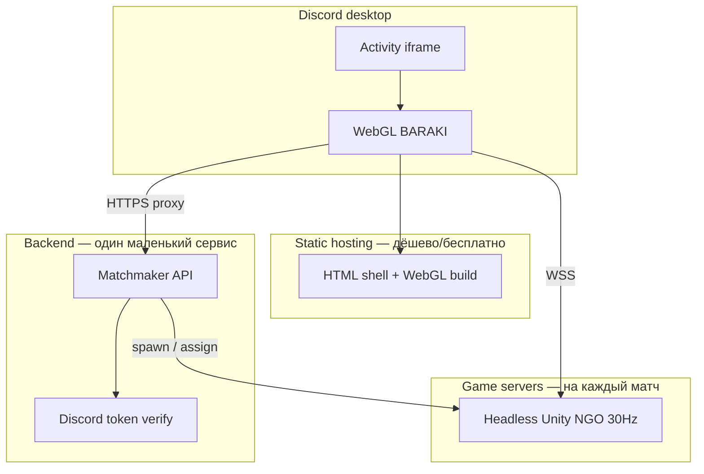

# Discord Platform

> **Primary launch:** Discord Activity на **desktop Discord**. Mobile Discord — **не** целевой.

## Целевой UX

```
Голосовой канал (2–8 человек)
  → Кто-то запускает Activity «BARAKI»
  → Остальные жмут Join
  → Лобби: race pick, Ready (N = число участников instance)
  → Countdown → матч
```

Discord даёт: `instanceId`, список участников, OAuth (ник/аватар).  
Игра даёт: netcode, симуляция, GDD loop.

## Техническая модель

Activity = **Unity WebGL** в iframe Discord + **backend** + **dedicated game server** на матч.

```entity
id: DISCORD_ACTIVITY
platform: desktop_discord_only
client_build: Unity_WebGL
sdk: Discord_Embedded_App_SDK
hosting: public_https + URL_mappings_in_dev_portal
mvp: true
```

### Почему не host-client в Discord

Все игроки в **браузере** (iframe). WebGL **не может** надёжно быть listen-server для 7 других клиентов.  
**Production:** dedicated **headless** server на матч; все WebGL-клиенты подключаются к нему.

```entity
id: NET_PRODUCTION
model: dedicated_server_per_match
clients: WebGL (Discord Activity)
server: headless_Unity_or_authorized_sim   # TBD infra
dev_fallback: host_client                # ParrelSync / local only
package: Netcode_for_GameObjects
mvp: true
```

## Backend (минимум)

| Сервис | Назначение |
|--------|------------|
| **Activity shell** | HTML + Embedded App SDK; загрузка WebGL; `patchUrlMappings` |
| **Matchmaker** | `instanceId` + participants → создать/найти game server |
| **Game server** | Authoritative sim (30 Hz); 2–8 slots |
| **Session verify** | Optional: Discord Activity Instance API + proxy auth |

Flow:

1. WebGL стартует → SDK `ready()` → `instanceId`, participants  
2. Клиент → backend: «создать/присоединиться к комнате» + OAuth token  
3. Backend валидирует instance → выдаёт **server address** + slot  
4. Все NGO-клиенты коннектятся к **dedicated server**  
5. Server sim — как в GDD (server-authoritative)

Infra hosting game servers: см. § **Infrastructure options** ниже.

## Infrastructure options

### Слои (что вообще нужно)



| Слой | Что делает | Типичный хостинг |
|------|------------|------------------|
| **Activity shell + WebGL** | Загрузка игры, Discord SDK | Cloudflare Pages, Vercel, S3+CDN |
| **Matchmaker API** | `instanceId` → адрес game server | 1 маленький VPS или container |
| **Game server** | Симуляция матча 2–8 игроков | Headless Linux build **на матч** |

### Критично для Unity + Discord

- WebGL **не может** быть server → только **dedicated headless** (Linux Server Build).
- **WebGL + dedicated** → transport **WebSockets** на **клиенте и server** (`UseWebSockets`, подключение через **`wss://`**).
- Discord Activity = HTTPS iframe → game server только с **валидным TLS** (Let's Encrypt + nginx/Caddy).
- HTTP к matchmaker — через **Discord URL mappings / proxy** (как в [Discord docs](https://docs.discord.com/developers/activities/building-an-activity)).

### Вариант FREE-0 — «PC хоста + Cloudflare Tunnel» (**$0**, проще всего)

Подходит, когда играете **вместе по договорённости** (вечер в Discord).

| Компонент | Где | Цена |
|-----------|-----|------|
| WebGL + shell | **Cloudflare Pages** | $0 |
| Matchmaker | **Cloudflare Workers** (free tier) | $0 |
| Game server | **Твой PC** — headless Linux/Windows build | $0 |
| TLS / доступ из интернета | **Cloudflare Tunnel** (`cloudflared`) | $0 |
| Discord Activity URL | `<app_id>.discordsays.com` → Pages | $0 |

**Flow:** ты запускаешь headless server на ПК → tunnel даёт `wss://xxx.trycloudflare.com` или named tunnel → Workers записывает `instanceId → wss URL` → друзья в Discord подключаются.

**Плюсы:** нулевой cost, быстрый старт, не нужен VPS.  
**Минусы:** пока **твой ПК выключен / server не запущен — игра недоступна**; upload домашнего интернета; не 24/7.

---

### Вариант FREE-1 — **Oracle Cloud Always Free** (**$0**, 24/7)

Единственный реалистичный **постоянно бесплатный** cloud для headless Unity.

| Ресурс (Always Free) | Зачем |
|----------------------|--------|
| **Ampere ARM:** до 4 OCPU + **24 GB RAM** | Docker: несколько game servers |
| Публичный IP + VCN | `wss://` через Caddy + Let's Encrypt |
| Egress | Лимиты есть — для 2–8 игроков × друзья обычно OK |

| Компонент | Где | Цена |
|-----------|-----|------|
| WebGL + shell | Cloudflare Pages | $0 |
| Matchmaker + Docker | **Oracle VM** (ARM) | $0 |
| Game server | Docker на той же VM | $0 |
| Домен | **Не обязателен** — IP + nip.io / free DuckDNS / Tunnel | $0 |

**Важно:** server build = **Linux ARM64** (Oracle Ampere). Unity 6 поддерживает — проверить в первом spike.

**Плюсы:** $0/мес постоянно, 24/7, 1–3 матча параллельно реально.  
**Минусы:** регистрация Oracle (карта для verify, но не списывают при Always Free), настройка Linux/Docker, ARM-сборка.

---

### Вариант FREE-2 — гибрид (рекомендация **$0**)

| Фаза | Stack |
|------|--------|
| **Сейчас / playtest** | FREE-0 (PC + Tunnel) |
| **Когда надоест держать ПК** | FREE-1 (Oracle) — те же Docker-образы |

Matchmaker и WebGL **одинаковые** в обоих случаях (Workers + Pages).

---

### Что **не** бывает бесплатным без компромиссов

| Миф | Реальность |
|-----|------------|
| «Только Discord, без своего backend» | Discord ≠ game server; sim всё равно где-то крутится |
| «Cloudflare Workers запустит Unity» | Workers — только API/lobby, не headless |
| «Edgegap / Multiplay free навсегда» | Free credits / pay-per-minute |
| «Без домена никак» | Pages + Tunnel + Discord proxy — **домен не обязателен** |

### Лимиты free tier (честно)

- **Cloudflare Pages:** 500 builds/мес, bandwidth generous — WebGL OK если билд не гигантский  
- **Workers:** 100k requests/day — matchmaker для друзей более чем  
- **Oracle:** capacity / idle reclaim policies — держать VM «warm»  
- **Discord verify:** бесплатно, но review для больших серверов  

### Вариант A — Self-host (платный VPS, если free не подойдёт)

**Один VPS** (Hetzner / OVH / Timeweb) + Docker.

| Компонент | Реализация |
|-----------|------------|
| WebGL + shell | Cloudflare Pages (free) |
| Matchmaker | Node/FastAPI на VPS :443 |
| Game server | Docker: `baraki-server` image, **1 container = 1 матч**, свой port |
| TLS | Caddy/nginx: `wss://game.yourdomain.com/match/{id}` → port |

**Flow:**

1. Первый игрок в instance → `POST /match { instanceId, N }` → matchmaker поднимает container, возвращает `wss` URL + room token.
2. Остальные → `POST /match/join { instanceId }` → тот же URL.
3. WebGL → `NetworkManager.StartClient()` → **WSS** на game server.
4. Матч конец → container kill, port free.

**Cost (ориентир):** €8–15/мес VPS (4–8 GB RAM) + domain ~€10/год.  
При **1–2 одновременных** матчах для друзей — хватает с запасом.

**Плюсы:** дёшево, полный контроль, без vendor lock-in.  
**Минусы:** сам настраиваешь Linux, Docker, TLS, мониторинг.

### Вариант B — Managed game hosting (Edgegap / Hathora)

Matchmaker вызывает API → провайдер поднимает headless build в облаке → отдаёт IP:port.

**Плюсы:** autoscale, меньше DevOps.  
**Минусы:** pay-per-minute (~$0.01–0.05/час на инстанс — для постоянных друзей может быть дороже VPS); интеграция SDK/REST.

**Когда:** много **параллельных** матчей или не хочешь админить VPS.

### Вариант C — Unity Multiplay / Game Server Hosting

Официальный путь Unity + NGO.

**Плюсы:** интеграция с Unity ecosystem.  
**Минусы:** сложнее onboarding, часто избыточен для indie Discord Activity; cost TBD.

**Когда:** масштаб beyond indie friends, команда уже на Unity Gaming Services.

### Вариант D — не подходит

| | Почему нет |
|---|-----------|
| **Host-client в Discord** | WebGL не host |
| **Unity Relay без dedicated** | Relay ≠ authoritative sim; нужен host или dedicated + Relay только как NAT helper |
| **Один вечный game server на все матчи** | Возможно для MVP, но риск state leak; **1 match = 1 process** проще |

### Рекомендация BARAKI — **FREE-2 (locked)**

| Фаза | Stack | Когда |
|------|--------|--------|
| **FREE-0** | PC headless + Cloudflare Tunnel + Workers matchmaker + Pages WebGL | Playtest, игровые вечера |
| **FREE-1** | Oracle Always Free ARM VM + Docker (те же образы) + Pages + Workers | Когда нужен **24/7** без ПК |

```entity
id: INFRA_FREE_2
phase_0:
  webgl: Cloudflare_Pages
  matchmaker: Cloudflare_Workers
  game_server: local_PC_headless
  exposure: Cloudflare_Tunnel
  cost: 0
phase_1:
  webgl: Cloudflare_Pages
  matchmaker: Cloudflare_Workers_or_Oracle_VM
  game_server: Oracle_Always_Free_ARM_Docker
  exposure: Caddy_LetsEncrypt_or_Tunnel
  cost: 0
migration: same_Docker_image_PC_to_Oracle
mvp: true
```

### Matchmaker API (минимальный контракт)

```yaml
POST /api/v1/match/ensure
  body: { instance_id, player_count, discord_user_id, access_token }
  response: { match_id, wss_url, join_token, slot }

POST /api/v1/match/ready
  body: { match_id, join_token, race_id }
  # все Ready → game server стартует countdown

GET /api/v1/match/{instance_id}
  # idempotent join для late participants в lobby phase
```

Verify: Discord [Activity Instance API](https://docs.discord.com/developers/activities/development-guides/multiplayer-experience) (bot token) — клиент реально в instance.

### Headless server (Unity build)

- Target: **Linux Server** (Dedicated Server checkbox в Unity 6).
- Auto-start: `-batchmode -nographics` + env `MATCH_ID`, `PLAYER_COUNT`, `PORT`.
- Scene: только sim + networking (без UI Toolkit menu — или `#if UNITY_SERVER`).
- Transport: **WebSockets**, listen `0.0.0.0`.

### Cost sanity (friends, ~10 сессий/нед по 30 мин)

| | Self-host A | Edgegap B |
|---|-------------|-----------|
| Месяц | ~€10 flat | ~€5–20+ usage |
| DevOps | ты | меньше |

## Locked decisions

| Решение | Значение |
|---------|----------|
| Primary platform | **Discord Activity desktop** |
| Discord mobile | **Не** поддерживаем |
| Players | **2–8** |
| Client | **Unity WebGL** |
| Production netcode | **Dedicated server** per match |
| Host-client | **Только dev/local**, не shipping |
| Transport (production) | **WebSockets / WSS** on client **and** server |
| Infra | **FREE-2** — FREE-0 (PC+Tunnel) → FREE-1 (Oracle 24/7) |
| Infra cost | **$0** — Cloudflare Pages + Workers + Tunnel; Oracle Always Free |

## Open — нужен твой выбор

- [x] **FREE-2** — FREE-0 → FREE-1
- [ ] Пик **одновременных** матчей: 1, 2–3? (default: **1–2** для friends)

## WebGL / Discord ограничения (учесть в art/code)

- Размер билда и RAM iframe — агрессивный pooling, LOD, лимит VFX  
- URP WebGL — проверить early; возможен упрощённый renderer profile для Activity  
- Все HTTP — через **Discord proxy** + URL mappings  
- CSP — без inline scripts в shell  
- Верификация Activity в Discord Developer Portal для публичного релиза  

## Lobby и N игроков

- **N** задаёт **host при Create** (Mode Select), не «все кто в голосовом канале»
- Лобби внутри WebGL: N строк, Ready, Host Start
- Race pick — на `Game.unity` после Start
- Discord SDK — `instanceId` + participants для join/identity
- Отдельный desktop launcher **не** нужен для MVP
- Клиентский API: `IMatchSessionBackend` (LocalDev сейчас, Discord matchmaker stub готов)  

## Dev workflow

| Этап | Как тестировать |
|------|-----------------|
| Gameplay без Discord | Editor + `MatchSandbox`; unit tests |
| Netcode | ParrelSync или 2 WebGL вкладки + dedicated server local |
| Discord integration | Cloudflare tunnel + URL mapping + test guild (<25 members до verify) |

## Open (tech)

- [ ] WebGL URP profile — full vs simplified
- [ ] Shell: custom HTML vs template from Discord samples
